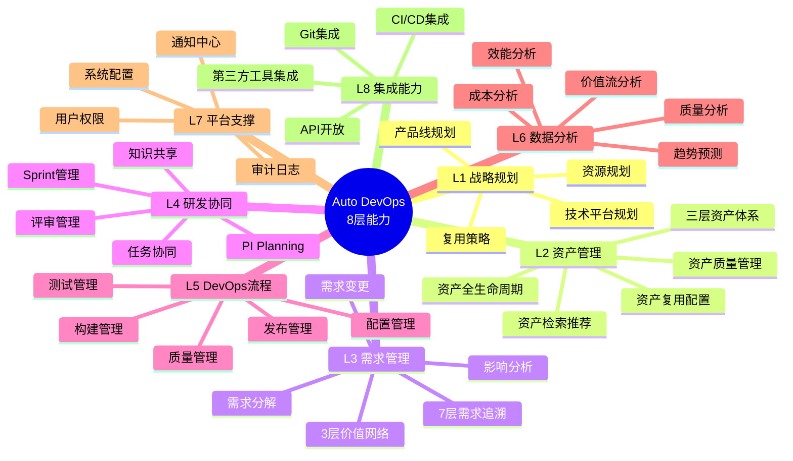

# Auto DevOps平台 - 业务架构设计 v2.0

> **文档版本**: v2.0  
> **创建日期**: 2025-01-05  
> **基于**: Phase 1-4完整实施方案  
> **目标**: 定义平台的完整业务架构、价值主张和能力地图

---

## 📋 文档说明

**更新内容**:
- ✅ 整合Phase 1-4的74个页面功能
- ✅ 完善8个角色工作台设计
- ✅ 更新9阶段完整价值流
- ✅ 补充DevOps与测试管理能力
- ✅ 新增数据分析与系统管理能力
- ✅ 完善业务指标体系

**版本历史**:
- v1.0 (2025-01-02): 初始版本，核心业务架构
- v2.0 (2025-01-05): 基于Phase 1-4完整方案的全面更新

---

## 📋 目录

1. [业务愿景与目标](#一业务愿景与目标)
2. [价值主张](#二价值主张)
3. [业务能力模型](#三业务能力模型)
4. [角色与工作台](#四角色与工作台)
5. [业务场景](#五业务场景)
6. [业务流程架构](#六业务流程架构)
7. [功能架构全景](#七功能架构全景)
8. [业务指标体系](#八业务指标体系)

---

## 一、业务愿景与目标

### 1.1 业务愿景

**成为智能驾驶行业领先的端到端价值流管理平台，支撑领域产品的高效开发与资产复用**

```
核心理念:
├─ 价值流优先: 端到端价值流可视化与优化
├─ 资产驱动: 三层资产体系，最大化复用价值
├─ 需求追溯: 7层需求追溯，从战略到交付
├─ 协同高效: 8个角色无缝协作，打破信息壁垒
├─ 数据驱动: 基于数据的持续优化和智能决策
└─ DevOps赋能: 全流程自动化，持续交付
```

### 1.2 业务目标

#### 短期目标（6个月 - MVP）
- ✅ 实现三层资产体系的基础管理能力
- ✅ 建立7层需求追溯体系
- ✅ 支撑3-5个领域产品的并行开发
- ✅ 资产复用率达到40%
- ✅ 需求追溯覆盖率100%

#### 中期目标（12个月 - V1.0）
- 🎯 覆盖研发全流程的DevOps能力
- 🎯 支撑10+个领域产品
- 🎯 资产复用率达到60%
- 🎯 交付周期缩短50%
- 🎯 端到端价值流可视化

#### 长期目标（18个月 - V2.0）
- 🚀 构建完整的数字化研发生态
- 🚀 资产复用率达到80%
- 🚀 实现智能化需求分解和资产推荐
- 🚀 AI驱动的质量预测和风险预警
- 🚀 成为行业标杆平台

### 1.3 业务范围

#### 核心业务范围

```
┌─────────────────────────────────────────────────────┐
│            Auto DevOps平台（核心范围）               │
│                                                      │
│  ┌────────────────────────────────────────────┐   │
│  │ 1. 资产管理与复用                           │   │
│  │    - 产品线管理                            │   │
│  │    - 领域产品管理                          │   │
│  │    - 领域特性管理                          │   │
│  │    - 软件模块管理                          │   │
│  │    - 资产关系与追溯                        │   │
│  └────────────────────────────────────────────┘   │
│                                                      │
│  ┌────────────────────────────────────────────┐   │
│  │ 2. 需求管理与追溯                           │   │
│  │    - 7层需求追溯体系                       │   │
│  │    - 用户需求→特性需求→模块需求            │   │
│  │    - 需求变更管理                          │   │
│  │    - 需求影响分析                          │   │
│  │    - 3层价值网络                           │   │
│  └────────────────────────────────────────────┘   │
│                                                      │
│  ┌────────────────────────────────────────────┐   │
│  │ 3. 项目与协同管理                           │   │
│  │    - PI Planning管理                       │   │
│  │    - Sprint协同管理                        │   │
│  │    - 任务管理                              │   │
│  │    - 评审管理                              │   │
│  │    - 团队协作                              │   │
│  └────────────────────────────────────────────┘   │
│                                                      │
│  ┌────────────────────────────────────────────┐   │
│  │ 4. DevOps全流程                            │   │
│  │    - 配置管理（Git）                       │   │
│  │    - 构建管理（CI/CD）                     │   │
│  │    - 测试管理（自动化测试）                │   │
│  │    - 发布管理（环境管理）                  │   │
│  │    - 质量管理（代码质量、测试覆盖）        │   │
│  └────────────────────────────────────────────┘   │
│                                                      │
│  ┌────────────────────────────────────────────┐   │
│  │ 5. 数据分析与决策                           │   │
│  │    - 价值流效率分析                        │   │
│  │    - 团队效能分析                          │   │
│  │    - 质量趋势分析                          │   │
│  │    - 成本收益分析                          │   │
│  │    - 智能预测与推荐                        │   │
│  └────────────────────────────────────────────┘   │
│                                                      │
│  ┌────────────────────────────────────────────┐   │
│  │ 6. 系统支撑能力                            │   │
│  │    - 用户权限管理                          │   │
│  │    - 系统配置管理                          │   │
│  │    - 操作审计日志                          │   │
│  │    - 通知中心                              │   │
│  └────────────────────────────────────────────┘   │
└─────────────────────────────────────────────────────┘
```

#### 边界定义

**上游边界**:
- 接收整车需求、技术需求
- 接收市场需求、法规需求
- 不负责整车级产品规划

**下游边界**:
- 交付领域产品包（软件+文档）
- 交付测试报告
- 不负责整车集成和整车测试

---

## 二、价值主张

### 2.1 核心价值主张

#### 对企业的价值

```
降本增效，数据驱动
├─ 资产复用率提升60% 
│  └─ 减少重复开发，提高研发效率
│
├─ 交付周期缩短50%
│  └─ 加快产品上市时间，抢占市场
│
├─ 开发成本降低40%
│  └─ 提高投入产出比，优化资源配置
│
├─ 质量问题减少40%
│  └─ 降低返工成本，提升客户满意度
│
└─ 端到端可视化
   └─ 价值流全程透明，快速定位瓶颈
```

#### 对研发团队的价值

```
提效赋能，协同顺畅
├─ 需求清晰
│  ├─ 7层需求追溯，100%可追溯
│  ├─ 需求→资产双向关联
│  └─ 影响分析一键生成
│
├─ 协同顺畅
│  ├─ 8个角色工作台，职责清晰
│  ├─ 信息透明，实时同步
│  └─ 打破角色壁垒
│
├─ 资产共享
│  ├─ 资产库随时查找
│  ├─ 智能推荐相似资产
│  └─ 变体配置快速复用
│
└─ 全程自动化
   ├─ CI/CD自动构建测试
   ├─ 自动化测试执行
   └─ 一键发布部署
```

#### 对管理者的价值

```
可视可控，数据决策
├─ 实时进度
│  ├─ 9阶段价值流可视化
│  ├─ PI/Sprint进度一目了然
│  └─ 燃尽图、看板实时更新
│
├─ 数据决策
│  ├─ 效能指标多维分析
│  ├─ 质量趋势提前预警
│  └─ 基于数据的资源分配
│
├─ 风险预警
│  ├─ 瓶颈自动识别
│  ├─ 风险提前预警
│  └─ 依赖关系可视化
│
└─ 效能分析
   ├─ 团队速率趋势
   ├─ 资产复用收益
   └─ 成本ROI分析
```

### 2.2 差异化竞争优势

| 维度 | 传统DevOps平台 | Jira+Confluence | Auto DevOps平台 |
|------|---------------|----------------|----------------|
| **资产管理** | 代码级复用 | 无 | 产品/特性/模块三层资产 |
| **需求追溯** | 无 | 简单关联 | 7层需求追溯+3层价值网络 |
| **价值流** | 无 | 无 | 9阶段端到端价值流可视化 |
| **协同方式** | 工具割裂 | 文档驱动 | 统一平台8角色协同 |
| **复用机制** | 手工查找 | 无 | 智能推荐+变体配置 |
| **数据驱动** | 基础报表 | 简单统计 | 全链路数据+AI预测 |
| **行业适配** | 通用 | 通用 | 深度适配智能驾驶研发 |
| **PI Planning** | 无 | 插件支持 | 原生支持+完整工作流 |
| **价值网络** | 无 | 无 | 3层价值网络+影响分析 |

---

## 三、业务能力模型

### 3.1 8层业务能力地图



### 3.2 详细能力描述

#### L1: 战略规划能力

```yaml
产品线规划:
  - 领域划分: 定义技术领域边界
  - 产品组合: 规划产品组合策略
  - 技术路线: 制定技术演进路线图
  - 资源规划: 团队与预算分配
  - 复用策略: 制定资产复用策略
  
  支撑页面:
    - 产品线列表与详情
    - 产品线路线图
    - 资源分配看板

技术平台规划:
  - 硬件平台: 传感器、计算平台选型
  - 软件平台: 基础软件架构设计
  - 技术演进: 平台升级路线
  
  支撑页面:
    - 技术平台管理
    - 平台演进规划
```

#### L2: 资产管理能力（三层资产体系）

```yaml
产品层资产 (P):
  功能:
    - 产品定义与配置
    - 产品特性选择
    - 产品变体管理
    - 产品BOM生成
  
  支撑页面:
    - 产品列表 (已实现)
    - 产品详情 (已实现)
    - 产品配置工具

特性层资产 (F):
  功能:
    - 领域特性管理
    - 特性设计与开发
    - 特性变体配置
    - 特性复用管理
  
  支撑页面:
    - 领域特性列表 (Phase 1)
    - 领域特性详情 (Phase 1)
    - 特性关系图

模块层资产 (M):
  功能:
    - 软件模块管理
    - 模块接口定义
    - 模块代码关联
    - 模块构建部署
  
  支撑页面:
    - 软件模块列表 (Phase 1)
    - 软件模块详情 (Phase 1)
    - 模块依赖图

资产统一管理:
  功能:
    - 资产检索引擎
    - 资产智能推荐
    - 资产质量评估
    - 资产复用统计
  
  支撑页面:
    - 资产关系图 (Phase 1)
    - 资产库管理
    - 复用分析仪表板 (Phase 4)
```

#### L3: 需求管理能力（7层追溯+3层价值网络）

```yaml
7层需求追溯体系:
  L1: 战略目标层
    - 公司战略目标
    - 技术战略规划
  
  L2: 产品规划层  
    - 产品路线图
    - 版本规划
  
  L3: 用户需求层 (R1)
    - 用户需求收集
    - 需求分析评审
    - 需求优先级
    支撑页面:
      - 用户需求列表 (已实现)
      - 用户需求详情 (Phase 1)
  
  L4: 特性需求层 (R2)
    - 特性需求分解
    - 技术方案设计
    - 工作量估算
    支撑页面:
      - 特性需求列表 (Phase 1)
      - 特性需求详情 (Phase 1)
  
  L5: 模块需求层 (R3)
    - 模块需求细化
    - 任务拆解
    - Story管理
    支撑页面:
      - 模块需求列表 (Phase 1)
      - 模块需求详情 (Phase 1)
      - Story列表 (Phase 2)
      - Story详情 (Phase 2)
  
  L6: 任务层
    - 开发任务
    - 测试任务
    - 任务执行
    支撑页面:
      - Task列表 (Phase 2)
      - Task详情 (Phase 2)
  
  L7: 代码层
    - 代码实现
    - 代码审查
    - 测试用例
    支撑页面:
      - Commits列表 (Phase 2)
      - Pull Requests (Phase 2)
      - 代码审查 (Phase 2)

3层价值网络:
  L1战略级:
    - 战略目标网络
    - 产品组合关系
    支撑页面:
      - L1战略级价值网络 (已实现)
  
  L2执行级:
    - 产品-特性网络
    - 需求依赖网络
    支撑页面:
      - L2执行级价值网络 (已实现)
  
  L3操作级:
    - 任务-代码网络
    - 测试追溯网络
    支撑页面:
      - L3操作级价值网络 (已实现)

追溯管理:
  功能:
    - 正向追溯: 需求→代码
    - 反向追溯: 代码→需求
    - 横向追溯: 需求↔测试
    - 影响分析: 变更影响范围
    - 覆盖率分析: 追溯覆盖度
  
  支撑页面:
    - 需求追溯主页 (已实现)
    - 追溯矩阵 (已实现)
    - 影响分析 (已实现)

需求变更管理:
  功能:
    - 变更申请
    - 影响分析
    - 变更审批
    - 变更实施
  
  支撑页面:
    - 需求变更列表 (Phase 1)
    - 需求变更详情 (Phase 1)
```

#### L4: 研发协同能力

```yaml
PI Planning管理:
  功能:
    - PI计划创建
    - 团队容量规划
    - Objectives管理
    - 依赖识别
    - 风险管理
    - PI报告生成
  
  支撑页面:
    - PI Planning列表 (已实现)
    - PI Planning工作区 (已实现)
    - PI Planning看板 (已实现)
    - PI Planning详情 (Phase 2)
    - 团队规划 (Phase 2)
    - 依赖管理 (Phase 2)
    - 风险管理 (Phase 2)
    - PI报告 (Phase 2)

Sprint协同管理:
  功能:
    - Sprint创建规划
    - Sprint看板管理
    - Sprint计划会议
    - 每日站会
    - Sprint回顾
    - 速率统计
  
  支撑页面:
    - Sprint列表 (已实现)
    - Sprint详情 (Phase 2)
    - Sprint看板 (Phase 2)
    - Sprint计划 (Phase 2)
    - Sprint回顾 (Phase 2)
    - Stories/Tasks管理 (Phase 2)

任务协同:
  功能:
    - 任务创建分配
    - 任务状态跟踪
    - 任务看板
    - 任务讨论
    - 工时记录
  
  支撑页面:
    - 任务管理看板
    - 任务详情页

评审管理:
  功能:
    - 需求评审
    - 设计评审
    - 代码评审
    - 测试评审
    - 评审跟踪
  
  支撑页面:
    - 评审列表 (Phase 2)
    - 评审详情
    - PR评审 (Phase 2)
```

#### L5: DevOps全流程能力

```yaml
配置管理:
  功能:
    - Git仓库管理
    - 分支策略
    - 代码审查
    - 合并管理
  
  集成:
    - GitLab集成
    - GitHub集成
  
  支撑页面:
    - 代码仓库管理
    - 分支管理

构建管理:
  功能:
    - CI/CD流水线配置
    - 自动构建触发
    - 构建状态监控
    - 构建产物管理
    - 构建历史
  
  支撑页面:
    - 构建列表 (Phase 3)
    - 构建详情 (Phase 3)
    - 流水线配置 (Phase 3)

测试管理:
  功能:
    - 测试计划管理
    - 测试用例管理
    - 测试执行
    - 缺陷管理
    - 测试报告
    - 自动化测试集成
  
  支撑页面:
    - 测试用例列表 (Phase 3)
    - 测试用例详情 (Phase 3)
    - 测试计划 (Phase 3)
    - 缺陷列表 (Phase 3)
    - 缺陷详情 (Phase 3)
    - 测试报告 (Phase 3)

发布管理:
  功能:
    - 发布计划
    - 环境管理
    - 发布审批
    - 部署执行
    - 版本管理
    - 灰度发布
  
  支撑页面:
    - 发布列表 (Phase 3)
    - 发布详情 (Phase 3)
    - 环境管理 (Phase 3)

质量管理:
  功能:
    - 代码质量分析
    - 测试覆盖率
    - 安全扫描
    - 技术债务跟踪
  
  集成:
    - SonarQube集成
    - 代码覆盖率工具
```

#### L6: 数据分析能力

```yaml
价值流分析:
  功能:
    - 9阶段价值流可视化
    - 各阶段耗时分析
    - 瓶颈识别
    - 流动效率分析
    - 前置时间/周期时间
    - 工作项流动
  
  支撑页面:
    - 价值流分析 (Phase 4)
    - 主价值流 (已实现)

效能分析:
  功能:
    - 团队速率分析
    - 可预测性分析
    - 吞吐量统计
    - 代码指标
    - 协作指标
    - 个人效能
  
  支撑页面:
    - 效能分析 (Phase 4)
    - 效能仪表板

质量分析:
  功能:
    - 缺陷密度分析
    - 缺陷趋势
    - 测试覆盖率
    - 代码质量评分
    - 构建成功率
    - 质量热力图
  
  支撑页面:
    - 质量分析 (Phase 4)
    - 质量仪表板

成本分析:
  功能:
    - 成本构成分析
    - 团队成本
    - 基础设施成本
    - 成本趋势
    - ROI分析
    - 成本优化建议
  
  支撑页面:
    - 成本分析 (Phase 4)

复用分析:
  功能:
    - 资产复用率统计
    - 复用收益计算
    - 复用热力图
    - 复用趋势
```

#### L7: 平台支撑能力

```yaml
用户与权限:
  功能:
    - 用户管理
    - 角色管理
    - 权限管理
    - SSO集成
    - 多因素认证
  
  支撑页面:
    - 用户管理 (已实现)
    - 角色管理 (已实现)
    - 权限管理 (已实现)

系统配置:
  功能:
    - 系统参数配置
    - 认证配置
    - 通知配置
    - 集成配置
    - 备份配置
  
  支撑页面:
    - 系统配置 (Phase 4)

审计日志:
  功能:
    - 操作日志记录
    - 日志查询
    - 日志分析
    - 合规审计
  
  支撑页面:
    - 操作日志 (Phase 4)

通知中心:
  功能:
    - 站内通知
    - 邮件通知
    - 企业微信通知
    - 订阅管理
    - 通知模板
  
  支撑页面:
    - 通知中心 (Phase 4)

帮助文档:
  支撑页面:
    - 帮助文档 (Phase 4)
    - 在线帮助
```

#### L8: 集成能力

```yaml
代码管理集成:
  - GitLab集成
  - GitHub集成
  - Gitee集成

CI/CD集成:
  - Jenkins集成
  - GitLab CI集成
  - GitHub Actions

质量工具集成:
  - SonarQube
  - 代码覆盖率工具

项目管理集成:
  - Jira集成（可选）

文档集成:
  - Confluence集成（可选）

通知集成:
  - 企业微信
  - 钉钉
  - Slack
```

---

## 四、角色与工作台

### 4.1 8个核心角色定义

#### 角色1: 产品经理 (Product Manager)

```yaml
职责:
  - 产品规划与定义
  - 用户需求管理
  - 产品配置管理
  - 产品发布管理
  - 产品演示与验收

日常工作:
  - 收集和分析用户需求
  - 定义产品特性
  - 配置产品方案
  - 跟踪产品进度
  - 组织产品评审
  - 管理产品发布

专属工作台页面:
  核心功能:
    - 产品管理 (已实现)
    - 用户需求管理 (已实现)
    - 需求看板 (Phase 1)
    - 产品配置工具
    - 价值网络L1 (已实现)
  
  协同功能:
    - PI Planning参与
    - Sprint评审
    - 发布管理
  
  数据看板:
    - 需求进度仪表板
    - 产品交付看板
    - 价值流分析 (Phase 4)

工作流程:
  1. 需求收集 → 2. 需求分析 → 3. 需求评审 → 
  4. 产品配置 → 5. 进度跟踪 → 6. 验收交付

关键产出:
  - 产品需求文档 (PRD)
  - 产品配置方案
  - 产品发布计划
  - 验收报告
```

#### 角色2: 系统工程师 (System Engineer)

```yaml
职责:
  - 用户需求分析
  - 系统架构设计
  - 需求分解（R1→R2）
  - 系统集成验证
  - 技术方案评审

日常工作:
  - 分析用户需求
  - 设计系统方案
  - 分解为特性需求
  - 评审技术方案
  - 系统集成测试
  - 追溯关系维护

专属工作台页面:
  核心功能:
    - 用户需求管理 (已实现)
    - 特性需求管理 (Phase 1)
    - 需求追溯 (已实现)
    - 影响分析 (已实现)
    - 追溯矩阵 (已实现)
    - 价值网络L2 (已实现)
  
  协同功能:
    - 需求评审
    - 技术评审
    - 集成测试
  
  数据看板:
    - 需求覆盖率
    - 追溯完整性
    - 影响分析结果

工作流程:
  1. 需求接收 → 2. 需求分析 → 3. 架构设计 → 
  4. 需求分解 → 5. 技术评审 → 6. 集成验证

关键产出:
  - 系统设计文档
  - 需求分解文档
  - 技术方案
  - 追溯矩阵
  - 集成测试报告
```

#### 角色3: 特性负责人 (Feature Owner)

```yaml
职责:
  - 特性设计和实现
  - 特性团队管理
  - 特性质量保证
  - 特性交付
  - 代码审查

日常工作:
  - 设计特性方案
  - 分配开发任务
  - 代码审查
  - 跟踪特性进度
  - 组织特性测试
  - 管理模块需求

专属工作台页面:
  核心功能:
    - 特性管理 (Phase 1)
    - 模块需求管理 (Phase 1)
    - Sprint管理 (Phase 2)
    - Story管理 (Phase 2)
    - Task管理 (Phase 2)
    - PR管理 (Phase 2)
    - 代码审查 (Phase 2)
  
  协同功能:
    - Sprint计划
    - Sprint回顾
    - 团队协作
  
  数据看板:
    - 特性进度
    - 团队速率
    - 代码质量

工作流程:
  1. 特性需求接收 → 2. 特性设计 → 3. 任务分解 →
  4. 任务分配 → 5. 代码审查 → 6. 特性验收

关键产出:
  - 特性设计文档
  - 任务分配
  - 代码审查意见
  - 特性测试报告
```

#### 角色4: 开发工程师 (Developer)

```yaml
职责:
  - 模块设计和开发
  - 代码实现
  - 单元测试
  - 代码提交
  - 缺陷修复

日常工作:
  - 领取开发任务
  - 编写代码
  - 执行单元测试
  - 提交代码审查
  - 修复缺陷
  - 参与技术评审

专属工作台页面:
  核心功能:
    - 我的任务 (Task列表)
    - Sprint看板 (Phase 2)
    - Story详情 (Phase 2)
    - Task详情 (Phase 2)
    - 代码提交 (Phase 2)
    - 构建状态 (Phase 3)
    - 缺陷跟踪 (Phase 3)
  
  协同功能:
    - Sprint参与
    - 代码审查
    - 技术讨论
  
  数据看板:
    - 我的工作量
    - 我的代码质量
    - 我的生产力

工作流程:
  1. 任务领取 → 2. 代码开发 → 3. 单元测试 →
  4. 代码提交 → 5. PR审查 → 6. 合并代码

关键产出:
  - 代码实现
  - 单元测试
  - 技术文档
```

#### 角色5: 测试工程师 (Test Engineer)

```yaml
职责:
  - 测试策略制定
  - 测试用例设计
  - 测试执行
  - 缺陷管理
  - 测试报告

日常工作:
  - 设计测试用例
  - 执行测试
  - 提交缺陷
  - 跟踪缺陷修复
  - 编写测试报告
  - 自动化测试维护

专属工作台页面:
  核心功能:
    - 测试计划 (Phase 3)
    - 测试用例管理 (Phase 3)
    - 测试执行
    - 缺陷管理 (Phase 3)
    - 测试报告 (Phase 3)
  
  协同功能:
    - Sprint测试
    - 需求验证
    - 发布测试
  
  数据看板:
    - 测试覆盖率
    - 缺陷统计
    - 测试进度

工作流程:
  1. 测试计划 → 2. 用例设计 → 3. 测试执行 →
  4. 缺陷提交 → 5. 缺陷验证 → 6. 测试报告

关键产出:
  - 测试计划
  - 测试用例
  - 缺陷报告
  - 测试报告
```

#### 角色6: DevOps工程师 (DevOps Engineer)

```yaml
职责:
  - CI/CD流水线配置
  - 环境管理
  - 发布管理
  - 监控运维
  - 工具支持

日常工作:
  - 配置流水线
  - 管理环境
  - 执行发布
  - 监控系统
  - 处理告警
  - 支持开发团队

专属工作台页面:
  核心功能:
    - 构建管理 (Phase 3)
    - 流水线配置 (Phase 3)
    - 环境管理 (Phase 3)
    - 发布管理 (Phase 3)
  
  监控功能:
    - 构建趋势
    - 环境状态
    - 发布历史
  
  数据看板:
    - 构建成功率
    - 部署频率
    - 环境健康度

工作流程:
  1. 流水线配置 → 2. 自动构建 → 3. 自动测试 →
  4. 环境部署 → 5. 监控验证 → 6. 问题处理

关键产出:
  - 流水线配置
  - 环境配置
  - 发布记录
  - 监控报告
```

#### 角色7: 项目经理 (Project Manager)

```yaml
职责:
  - 项目规划管理
  - PI Planning组织
  - 资源协调
  - 进度跟踪
  - 风险管理

日常工作:
  - 制定项目计划
  - 组织PI Planning
  - 跟踪项目进度
  - 协调资源
  - 识别和管理风险
  - 项目报告

专属工作台页面:
  核心功能:
    - 项目管理 (已实现)
    - PI Planning (已实现+Phase 2)
    - Sprint管理 (Phase 2)
    - 依赖管理 (Phase 2)
    - 风险管理 (Phase 2)
    - PI报告 (Phase 2)
  
  数据看板:
    - 项目进度
    - 团队速率
    - 风险热力图
    - 效能分析 (Phase 4)

工作流程:
  1. 项目立项 → 2. PI Planning → 3. Sprint规划 →
  4. 进度跟踪 → 5. 风险管理 → 6. 项目复盘

关键产出:
  - 项目计划
  - PI Planning报告
  - 进度报告
  - 风险报告
```

#### 角色8: 管理者 (Manager/Leader)

```yaml
职责:
  - 战略决策
  - 资源分配
  - 效能优化
  - 质量管理
  - 团队管理

日常工作:
  - 查看数据分析报告
  - 评审重大决策
  - 资源调配
  - 推动流程优化
  - 指导团队改进

专属工作台页面:
  核心功能:
    - Dashboard (已实现)
    - 价值流分析 (Phase 4)
    - 效能分析 (Phase 4)
    - 质量分析 (Phase 4)
    - 成本分析 (Phase 4)
  
  决策支持:
    - 多维数据对比
    - 趋势预测
    - 瓶颈识别
    - 改进建议

工作流程:
  1. 数据查看 → 2. 问题识别 → 3. 决策制定 →
  4. 推动实施 → 5. 效果验证 → 6. 持续改进

关键产出:
  - 战略决策
  - 资源分配方案
  - 改进计划
```

### 4.2 角色协作矩阵 (RACI)

| 活动 | 产品经理 | 系统工程师 | 特性负责人 | 开发工程师 | 测试工程师 | DevOps | 项目经理 | 管理者 |
|------|---------|-----------|-----------|-----------|-----------|--------|---------|--------|
| **需求收集** | R | C | I | I | I | I | I | C |
| **需求分析** | A | R | C | I | I | I | I | I |
| **需求分解** | C | R | C | I | I | I | I | I |
| **系统设计** | C | R | C | I | I | I | I | I |
| **特性设计** | I | C | R | C | I | I | I | I |
| **任务分配** | I | I | R | C | I | I | C | I |
| **代码开发** | I | I | C | R | I | I | I | I |
| **代码审查** | I | I | R | C | I | I | I | I |
| **单元测试** | I | I | C | R | C | I | I | I |
| **测试计划** | C | I | C | I | R | I | C | I |
| **测试执行** | I | I | I | C | R | I | I | I |
| **缺陷修复** | I | I | C | R | C | I | I | I |
| **CI/CD配置** | I | I | I | C | I | R | I | I |
| **发布管理** | A | C | C | I | C | R | C | I |
| **PI Planning** | C | C | C | I | I | I | R | A |
| **项目跟踪** | C | I | C | I | I | I | R | C |

**说明**:
- R (Responsible): 负责执行
- A (Accountable): 最终负责
- C (Consulted): 需要咨询
- I (Informed): 需要知晓

---

## 五、业务场景

### 5.1 端到端业务场景

#### 场景1: 新产品立项与开发（完整流程）

**场景描述**: 理想汽车计划为L7车型开发NOA智能驾驶功能

**参与角色**: 8个角色全流程协作

**详细流程** (9阶段价值流):

```
阶段1: 战略规划
├─ 角色: 管理者、产品线经理
├─ 活动:
│  ├─ 制定产品战略
│  ├─ 产品线规划
│  └─ 资源预算分配
├─ 工具: 产品线管理、Dashboard
└─ 产出: 产品立项批准

阶段2: 产品定义
├─ 角色: 产品经理
├─ 活动:
│  ├─ 创建产品
│  ├─ 收集用户需求
│  ├─ 定义产品特性
│  └─ 产品配置
├─ 工具: 产品管理、用户需求管理
└─ 产出: 产品需求文档、产品配置方案

阶段3: 需求分解
├─ 角色: 系统工程师
├─ 活动:
│  ├─ 分析用户需求
│  ├─ 设计系统架构
│  ├─ 分解为特性需求
│  ├─ 建立追溯关系
│  └─ 影响分析
├─ 工具: 需求分解、追溯管理、影响分析
└─ 产出: 系统设计、特性需求、追溯矩阵

阶段4: PI Planning
├─ 角色: 项目经理、所有团队
├─ 活动:
│  ├─ 创建PI
│  ├─ 团队容量规划
│  ├─ Objectives设定
│  ├─ 依赖识别
│  ├─ 风险识别
│  └─ 生成PI计划
├─ 工具: PI Planning全套页面 (8个页面)
└─ 产出: PI计划、团队计划、依赖关系图、风险清单

阶段5: Sprint执行
├─ 角色: 特性负责人、开发工程师、测试工程师
├─ 活动:
│  ├─ Sprint规划
│  ├─ Story/Task拆分
│  ├─ 开发实现
│  ├─ 代码审查
│  ├─ 测试验证
│  └─ Sprint回顾
├─ 工具: Sprint全套页面 (11个页面)
└─ 产出: 可工作的软件增量

阶段6: 持续集成
├─ 角色: DevOps工程师、开发工程师
├─ 活动:
│  ├─ 代码提交
│  ├─ 自动构建
│  ├─ 自动化测试
│  ├─ 代码质量分析
│  └─ 构建产物管理
├─ 工具: 构建管理、流水线配置
└─ 产出: 构建产物、测试报告

阶段7: 测试验证
├─ 角色: 测试工程师
├─ 活动:
│  ├─ 制定测试计划
│  ├─ 设计测试用例
│  ├─ 执行测试
│  ├─ 缺陷管理
│  └─ 生成测试报告
├─ 工具: 测试管理全套页面 (6个页面)
└─ 产出: 测试报告、缺陷列表

阶段8: 发布部署
├─ 角色: DevOps工程师、项目经理
├─ 活动:
│  ├─ 制定发布计划
│  ├─ 发布审批
│  ├─ 环境准备
│  ├─ 部署执行
│  └─ 发布验证
├─ 工具: 发布管理、环境管理
└─ 产出: 发布版本、部署记录

阶段9: 监控优化
├─ 角色: 管理者、DevOps、质量工程师
├─ 活动:
│  ├─ 价值流分析
│  ├─ 效能分析
│  ├─ 质量分析
│  ├─ 成本分析
│  ├─ 瓶颈识别
│  └─ 持续改进
├─ 工具: 数据分析全套页面 (4个页面)
└─ 产出: 分析报告、改进建议
```

**关键价值**:
- 端到端可视化: 9阶段价值流全程透明
- 资产复用: 70%代码复用（搜索L9 NOA资产）
- 周期缩短: 6个月 → 2个月
- 追溯完整: 7层需求100%可追溯
- 数据驱动: 实时效能分析和改进

#### 场景2: 法规需求影响分析（跨产品协同）

**场景描述**: 新法规要求所有L2+系统增加驾驶员监控(DMS)

**参与角色**: 产品经理、系统工程师、多个特性负责人

**详细流程**:

```
步骤1: 需求输入
├─ 产品经理创建法规需求 (R1)
├─ 标记为法规需求，P0优先级
└─ 工具: 用户需求管理

步骤2: 影响分析（自动化）
├─ 系统工程师触发影响分析
├─ 系统自动分析:
│  ├─ 扫描所有产品的资产关系
│  ├─ 识别受影响产品: NOA, LCC, APA
│  ├─ 识别受影响车型: L9, L8, L7, L6
│  ├─ 估算工作量: 80人天
│  ├─ 识别技术依赖
│  └─ 评估风险
├─ 工具: 影响分析工具
└─ 产出: 影响分析报告（1天内完成 vs 传统2周）

步骤3: 价值网络可视化
├─ 系统生成3层价值网络:
│  ├─ L1战略级: 战略目标→产品线→产品
│  ├─ L2执行级: 产品→特性→模块
│  └─ L3操作级: 模块→任务→代码
├─ 高亮显示受影响节点
└─ 工具: 价值网络可视化 (3个页面)

步骤4: 决策审批
├─ 产品线经理评审影响分析报告
├─ 管理者查看价值网络和成本分析
├─ 决策: 批准需求，统一开发
└─ 工具: Dashboard、成本分析

步骤5: 需求分解与分配
├─ 系统工程师分解为DMS特性需求
├─ 分配到各产品:
│  ├─ NOA-DMS特性
│  ├─ LCC-DMS特性
│  └─ APA-DMS特性
├─ 建立追溯关系
└─ 工具: 需求分解、追溯管理

步骤6: 并行开发（3个团队）
├─ 各团队并行Sprint开发
├─ 共享DMS基础算法资产
├─ 各自适配产品特点
└─ 工具: Sprint管理、资产复用

步骤7: 统一集成测试
├─ 系统工程师统一集成
├─ 测试工程师统一测试
├─ 追溯验证: 需求→测试用例
└─ 工具: 测试管理、追溯矩阵

步骤8: 同步发布
├─ 所有产品同步发布新版本
├─ 统一发布记录
└─ 工具: 发布管理
```

**关键价值**:
- 分析速度: 2周 → 1天（自动化影响分析）
- 准确性: 100%识别受影响产品（图数据库）
- 可视化: 3层价值网络清晰展示影响
- 协同效率: 避免重复工作，统一DMS资产
- 追溯完整: 法规→产品→特性→代码全链路

#### 场景3: 资产复用与变体配置

**场景描述**: 泊车产品需要复用NOA的融合感知特性

**详细流程**:

```
步骤1: 需求识别
├─ 泊车产品经理提出融合感知需求
└─ 工具: 用户需求管理

步骤2: 资产检索
├─ 系统工程师在资产库搜索"融合感知"
├─ 系统推荐:
│  ├─ NOA融合感知特性 (相似度98%)
│  ├─ 质量评分: A级
│  ├─ 复用次数: 5次
│  └─ 适配度评估: 80%
├─ 工具: 资产库管理、智能推荐
└─ 产出: 资产推荐列表

步骤3: 适配评估
├─ 特性负责人评估适配性
├─ 算法工程师评估算法适配
├─ 评估结果:
│  ├─ 核心算法100%复用
│  ├─ 传感器配置需要适配
│  ├─ 参数调整
│  └─ 工作量: 2人月 vs 6人月从零开发
├─ 决策: 创建泊车变体
└─ 工具: 特性详情、变体配置工具

步骤4: 变体创建
├─ 创建融合感知-泊车变体
├─ 配置变体参数:
│  ├─ 传感器类型: 超声波+环视
│  ├─ 检测范围: 0-10m
│  └─ 精度要求: ±5cm
├─ 关联到泊车产品
└─ 工具: 资产管理、产品配置

步骤5: 适配开发
├─ 算法工程师适配泊车传感器
├─ 开发工程师调整参数
├─ 测试工程师验证测试
└─ 工具: Sprint管理、测试管理

步骤6: 集成交付
├─ 集成到泊车产品
├─ 更新复用指标
├─ 追溯关系建立
└─ 工具: 追溯管理、复用分析
```

**关键价值**:
- 算法复用: 100%核心算法复用
- 开发周期: 6个月 → 2个月（缩短67%）
- 质量提升: 复用成熟算法，质量更高
- 成本节省: 节省4人月工作量
- 可追溯: 变体追溯到源特性

---

## 六、业务流程架构

### 6.1 端到端价值流全景（9阶段）

```mermaid
graph TB
    Start([业务触发点])
    
    subgraph S1["阶段1: 战略规划"]
        PL[产品线规划]
        Strategy[战略制定]
        Resource[资源分配]
    end
    
    subgraph S2["阶段2: 产品定义"]
        Product[产品创建]
        UR[用户需求]
        Config[产品配置]
    end
    
    subgraph S3["阶段3: 需求分解"]
        Analysis[需求分析]
        FR[特性需求]
        MR[模块需求]
        Trace[追溯建立]
    end
    
    subgraph S4["阶段4: PI Planning"]
        PI[PI创建]
        Team[团队规划]
        Obj[Objectives]
        Dep[依赖管理]
    end
    
    subgraph S5["阶段5: Sprint执行"]
        Sprint[Sprint规划]
        Story[Story开发]
        Task[Task执行]
        Review[代码审查]
    end
    
    subgraph S6["阶段6: 持续集成"]
        Build[自动构建]
        Test[自动测试]
        Quality[质量分析]
    end
    
    subgraph S7["阶段7: 测试验证"]
        TestPlan[测试计划]
        TestExec[测试执行]
        Defect[缺陷管理]
    end
    
    subgraph S8["阶段8: 发布部署"]
        RelPlan[发布计划]
        Deploy[部署执行]
        Verify[发布验证]
    end
    
    subgraph S9["阶段9: 监控优化"]
        Monitor[监控分析]
        Optimize[持续改进]
    end
    
    Start --> S1
    S1 --> S2
    S2 --> S3
    S3 --> S4
    S4 --> S5
    S5 --> S6
    S6 --> S7
    S7 --> S8
    S8 --> S9
    S9 -.反馈优化.-> S1
    
    style S1 fill:#e1f5ff
    style S4 fill:#fff4e6
    style S5 fill:#f3e5f5
    style S9 fill:#d4edda
```



### 6.2 关键流程说明

#### 流程1: 需求到代码的完整追溯流程

```
L1: 战略目标
  ↓ (战略分解)
L2: 产品规划
  ↓ (产品创建)
R1: 用户需求 ────→ 用户需求管理页面
  ↓ (需求分解)
R2: 特性需求 ────→ 特性需求管理页面
  ↓ (需求细化)
R3: 模块需求 ────→ 模块需求管理页面
  ↓ (任务拆解)
L6: Story/Task ──→ Sprint管理页面
  ↓ (代码实现)
L7: 代码提交 ────→ Commits/PR页面
  ↓ (测试验证)
    测试用例 ────→ 测试管理页面
  ↓ (追溯验证)
    追溯矩阵 ────→ 追溯管理页面

支撑工具:
- 追溯链自动建立
- 影响分析工具
- 追溯矩阵可视化
- 覆盖率报告
```

#### 流程2: PI Planning完整工作流

```
准备阶段:
├─ 创建PI
├─ 设置基本信息
└─ 邀请团队

规划阶段:
├─ Day 1上午: PI目标宣讲
├─ Day 1下午: 团队分组规划
│  ├─ 团队容量规划
│  ├─ 设置Objectives
│  ├─ Story拆分估算
│  └─ 识别依赖
├─ Day 2上午: 风险识别
│  ├─ 记录风险
│  ├─ 评估影响
│  └─ 制定预案
└─ Day 2下午: 总结汇报
   ├─ 各团队汇报
   ├─ 管理层确认
   └─ 生成PI报告

执行阶段:
├─ Sprint 1-N并行执行
├─ 跟踪Objectives进度
├─ 管理依赖和风险
└─ 定期同步

回顾阶段:
├─ PI Review
├─ PI Retrospective
└─ 生成PI报告

支撑页面:
- PI Planning列表/工作区/看板 (已实现)
- PI Planning详情 (Phase 2)
- 团队规划 (Phase 2)
- 依赖管理 (Phase 2)
- 风险管理 (Phase 2)
- PI报告 (Phase 2)
```

#### 流程3: Sprint完整工作流

```
Sprint规划:
├─ Sprint Planning会议
├─ 选择Story
├─ 拆分Task
├─ 估算工作量
└─ 设置Sprint目标

Sprint执行:
├─ 每日站会
├─ Task更新
├─ 看板管理
├─ 代码开发
├─ 代码审查
├─ 测试验证
└─ 持续集成

Sprint评审:
├─ Sprint Review
├─ Demo演示
└─ 验收确认

Sprint回顾:
├─ Sprint Retrospective
├─ 总结经验教训
└─ 改进措施

支撑页面:
- Sprint列表 (已实现)
- Sprint详情 (Phase 2)
- Sprint看板 (Phase 2)
- Sprint计划 (Phase 2)
- Sprint回顾 (Phase 2)
- Story/Task管理 (Phase 2)
```

---

## 七、功能架构全景

### 7.1 74个页面功能分布

#### 已实现页面（23个 - Phase 0）

```yaml
基础框架 (3):
  - 登录页
  - 工作台Dashboard
  - 主布局Layout

项目管理 (3):
  - 项目列表
  - 项目详情
  - 项目看板

PI Planning (3):
  - PI Planning列表
  - PI Planning工作区
  - PI Planning看板

资产管理 (2):
  - 产品列表
  - 产品详情

需求管理 (4):
  - 用户需求列表
  - 需求追溯主页
  - 追溯矩阵
  - 影响分析

Sprint管理 (1):
  - Sprint列表

价值网络 (3):
  - L1战略级价值网络
  - L2执行级价值网络
  - L3操作级价值网络

价值流 (1):
  - L1主价值流

系统管理 (3):
  - 用户管理
  - 角色管理
  - 权限管理
```

#### Phase 1: 资产与需求管理（15页面）

```yaml
资产管理深化 (7):
  - 产品线列表
  - 产品线详情
  - 领域特性列表
  - 领域特性详情
  - 软件模块列表
  - 软件模块详情
  - 资产关系图

需求管理深化 (8):
  - 用户需求详情
  - 特性需求列表
  - 特性需求详情
  - 模块需求列表
  - 模块需求详情
  - 需求变更列表
  - 需求变更详情
  - 需求看板
```

#### Phase 2: 项目与协同管理（16页面）

```yaml
PI Planning深化 (5):
  - PI Planning详情
  - 团队规划
  - 依赖管理
  - 风险管理
  - PI报告

Sprint协同 (11):
  - Sprint详情
  - Sprint看板
  - Sprint规划
  - Sprint回顾
  - Story列表
  - Story详情
  - Task列表
  - Task详情
  - 代码提交列表
  - Pull Request列表
  - 评审管理
```

#### Phase 3: DevOps与测试（12页面）

```yaml
DevOps流水线 (6):
  - 构建列表
  - 构建详情
  - 流水线配置
  - 环境管理
  - 发布列表
  - 发布详情

测试管理 (6):
  - 测试用例列表
  - 测试用例详情
  - 测试计划
  - 缺陷列表
  - 缺陷详情
  - 测试报告
```

#### Phase 4: 数据分析与系统（8页面）

```yaml
数据分析 (4):
  - 价值流分析
  - 效能分析
  - 质量分析
  - 成本分析

系统管理 (4):
  - 系统配置
  - 操作日志
  - 通知中心
  - 帮助文档
```

### 7.2 功能架构分层

```
┌─────────────────────────────────────────────────────┐
│                L1: 用户体验层                        │
│  ┌──────────┬──────────┬──────────┬──────────┐    │
│  │ 8个角色  │ 74个页面 │ 统一交互 │ 响应式UI │    │
│  │ 工作台   │          │ 设计     │          │    │
│  └──────────┴──────────┴──────────┴──────────┘    │
└─────────────────────────────────────────────────────┘
                        ↓
┌─────────────────────────────────────────────────────┐
│                L2: 业务功能层                        │
│  ┌─────────────────────────────────────────────┐  │
│  │ 7个功能域                                    │  │
│  │ ├─ 资产管理域 (18页面)                      │  │
│  │ ├─ 需求管理域 (17页面)                      │  │
│  │ ├─ 协同管理域 (22页面)                      │  │
│  │ ├─ DevOps域 (12页面)                        │  │
│  │ ├─ 数据分析域 (4页面)                       │  │
│  │ ├─ 系统支撑域 (7页面)                       │  │
│  │ └─ 基础框架 (3页面)                         │  │
│  └─────────────────────────────────────────────┘  │
└─────────────────────────────────────────────────────┘
                        ↓
┌─────────────────────────────────────────────────────┐
│                L3: 平台服务层                        │
│  ┌──────────┬──────────┬──────────┬──────────┐    │
│  │ 工作流   │ 追溯引擎 │ 分析引擎 │ 推荐引擎 │    │
│  │ 引擎     │          │          │          │    │
│  ├──────────┼──────────┼──────────┼──────────┤    │
│  │ 消息中心 │ 权限中心 │ 搜索引擎 │ 文档中心 │    │
│  └──────────┴──────────┴──────────┴──────────┘    │
└─────────────────────────────────────────────────────┘
                        ↓
┌─────────────────────────────────────────────────────┐
│                L4: 数据存储层                        │
│  ┌──────────┬──────────┬──────────┬──────────┐    │
│  │PostgreSQL│  Neo4j   │ TimescaleDB│  MinIO  │    │
│  │关系数据  │图数据库  │时序数据  │对象存储  │    │
│  │          │(追溯关系)│(指标数据)│(文件)    │    │
│  └──────────┴──────────┴──────────┴──────────┘    │
└─────────────────────────────────────────────────────┘
```

---

## 八、业务指标体系

### 8.1 核心业务指标 (KPI)

#### 价值流效率指标

```yaml
前置时间 (Lead Time):
  定义: 从需求创建到交付的总时间
  目标: 
    - MVP: < 60天
    - V1.0: < 45天
    - V2.0: < 30天
  计算: 发布日期 - 需求创建日期
  支撑: 价值流分析页面

周期时间 (Cycle Time):
  定义: 从开始开发到交付的时间
  目标: < 15天
  计算: 发布日期 - 开发开始日期
  支撑: 价值流分析页面

流动效率 (Flow Efficiency):
  定义: 实际工作时间占总时间的比例
  目标: > 60%
  计算: 实际工作时间 / 总时间 × 100%
  支撑: 价值流分析页面

部署频率:
  定义: 单位时间的发布次数
  目标: > 12次/月
  计算: 月发布次数
  支撑: 发布管理页面
```

#### 资产复用指标

```yaml
资产复用率:
  定义: 复用资产占总资产的比例
  目标:
    - MVP: 40%
    - V1.0: 60%
    - V2.0: 80%
  计算: 复用资产数 / 总资产数 × 100%
  支撑: 复用分析页面

代码复用率:
  定义: 复用代码占总代码的比例
  目标: > 70%
  计算: 复用代码行数 / 总代码行数 × 100%
  支撑: 复用分析页面

复用收益:
  定义: 通过复用节省的工作量
  目标: 节省50%工作量
  计算: (原始工作量 - 实际工作量) / 原始工作量
  支撑: 成本分析页面
```

#### 需求追溯指标

```yaml
追溯覆盖率:
  定义: 可追溯需求的比例
  目标: 100%
  计算: 可追溯需求数 / 总需求数 × 100%
  支撑: 追溯矩阵页面

需求覆盖率:
  定义: 有测试用例覆盖的需求比例
  目标: 100%
  计算: 有测试用例的需求数 / 总需求数 × 100%
  支撑: 追溯矩阵页面

追溯完整性:
  定义: 7层追溯链完整的需求比例
  目标: 100%
  计算: 追溯链完整的需求数 / 总需求数 × 100%
  支撑: 追溯管理页面
```

#### 团队效能指标

```yaml
团队速率 (Velocity):
  定义: 单位迭代完成的Story Points
  目标: 稳定在35-40 SP/迭代
  计算: 每迭代完成的SP
  支撑: 效能分析页面

可预测性:
  定义: 实际完成与计划完成的比率
  目标: > 85%
  计算: 实际完成SP / 计划SP
  支撑: 效能分析页面

吞吐量:
  定义: 单位时间完成的工作项数量
  目标: > 40个/月
  计算: 月完成工作项数
  支撑: 效能分析页面

协作效率:
  定义: 角色间流转的平均时间
  目标: < 4小时
  计算: 平均任务交接时间
  支撑: 效能分析页面
```

#### 质量指标

```yaml
缺陷密度:
  定义: 每千行代码的缺陷数
  目标: < 2个/KLOC
  计算: 缺陷总数 / 代码总行数 × 1000
  支撑: 质量分析页面

测试覆盖率:
  定义: 测试覆盖的代码比例
  目标: > 80%
  计算: 已测试代码行数 / 总代码行数 × 100%
  支撑: 质量分析页面

构建成功率:
  定义: 构建成功的比例
  目标: > 90%
  计算: 成功构建数 / 总构建数 × 100%
  支撑: 构建管理页面

变更失败率:
  定义: 导致生产问题的变更比例
  目标: < 5%
  计算: 失败变更数 / 总变更数 × 100%
  支撑: 发布管理、质量分析页面
```

#### 成本指标

```yaml
单位功能点成本:
  定义: 单位功能点的开发成本
  目标: 降低40%
  计算: 总开发成本 / 功能点数
  支撑: 成本分析页面

复用节省成本:
  定义: 通过复用节省的成本
  目标: 节省50%
  计算: 原始成本 - 实际成本
  支撑: 成本分析页面

ROI:
  定义: 投资回报率
  目标: > 150%
  计算: (收益 - 投资) / 投资 × 100%
  支撑: 成本分析页面
```

### 8.2 业务健康度指标

```yaml
平台活跃度:
  - 日活用户数: > 80%团队成员
  - 月活用户数: 100%
  - 人均使用时长: > 4小时/天
  - 功能使用率: 核心功能 > 90%

业务成熟度:
  - 产品数量: > 10个
  - 资产库丰富度: > 100个资产
  - 流程规范化程度: > 90%
  - 自动化率: > 80%

用户满意度:
  - NPS评分: > 8分
  - 满意度: > 85%
  - 问题响应时间: < 24小时
  - 问题解决率: > 95%

数据质量:
  - 数据完整性: > 95%
  - 追溯完整性: 100%
  - 数据准确性: > 98%
  - 数据实时性: < 5分钟延迟
```

### 8.3 仪表板设计

#### 管理层仪表板

```yaml
显示内容:
  价值流概览:
    - 9阶段价值流可视化
    - 各阶段耗时和瓶颈
    - 流动效率趋势
  
  核心指标:
    - 资产复用率
    - 交付周期
    - 团队速率
    - 质量指标
    - 成本指标
  
  趋势分析:
    - 效能趋势
    - 质量趋势
    - 成本趋势
    - 复用趋势
  
  风险预警:
    - 高风险项目
    - 瓶颈识别
    - 质量预警

支撑页面:
  - Dashboard (已实现)
  - 价值流分析 (Phase 4)
  - 效能分析 (Phase 4)
  - 质量分析 (Phase 4)
  - 成本分析 (Phase 4)
```

#### 项目经理仪表板

```yaml
显示内容:
  PI/Sprint概览:
    - 进行中的PI
    - 活跃Sprint
    - Objectives进度
    - 团队速率
  
  风险与依赖:
    - 风险列表
    - 依赖关系图
    - 阻塞问题
  
  资源与进度:
    - 团队容量
    - 燃尽图
    - 里程碑进度

支撑页面:
  - 项目看板 (已实现)
  - PI Planning看板 (已实现)
  - 依赖管理 (Phase 2)
  - 风险管理 (Phase 2)
```

#### 开发者仪表板

```yaml
显示内容:
  我的工作:
    - 我的任务列表
    - 今日待办
    - 代码审查
  
  团队协作:
    - Sprint看板
    - 团队进度
    - 每日站会
  
  质量反馈:
    - 构建状态
    - 测试结果
    - 代码质量
    - 我的Bug

支撑页面:
  - Sprint看板 (Phase 2)
  - Task管理 (Phase 2)
  - 构建管理 (Phase 3)
  - 缺陷管理 (Phase 3)
```

---

## 🎯 总结

### 核心亮点

1. **完整的价值流**: 9阶段端到端价值流，74个页面支撑
2. **7层需求追溯**: 从战略到代码的完整追溯链
3. **3层价值网络**: 战略级、执行级、操作级价值网络
4. **8个角色工作台**: 各角色专属工作台，职责清晰
5. **三层资产体系**: 产品-特性-模块三层资产管理
6. **完整DevOps**: CI/CD、测试、发布全流程自动化
7. **数据驱动**: 价值流、效能、质量、成本全方位分析
8. **智能推荐**: AI驱动的资产推荐和风险预测

### 业务价值

```yaml
对企业:
  - 资产复用率: 40% → 60% → 80%
  - 交付周期: 缩短50%
  - 开发成本: 降低40%
  - 质量问题: 减少40%

对团队:
  - 需求100%可追溯
  - 协同效率提升60%
  - 自动化率 > 80%
  - 团队满意度 > 85%

对管理:
  - 价值流全程可视化
  - 数据驱动决策
  - 风险提前预警
  - 持续改进机制
```

### 实施路径

```
MVP (6个月): 
  - 核心资产管理
  - 7层需求追溯
  - 基础协同能力
  - 支撑3-5个产品

V1.0 (12个月):
  - 完整DevOps流程
  - 数据分析能力
  - 智能推荐
  - 支撑10+个产品

V2.0 (18个月):
  - AI驱动预测
  - 完整生态
  - 行业标杆
  - 资产复用率80%
```

---

**文档维护**:
- 负责人: 产品架构团队
- 更新频率: 季度更新
- 最后更新: 2025-01-05
- 版本: v2.0

**相关文档**:
- `00-DOMAIN_MODEL_DESIGN.md` - 领域模型设计
- `02-FUNCTIONAL_ARCHITECTURE.md` - 功能架构
- `../platform-rd-process/03-VALUE_STREAM_WITH_PI_PLANNING.md` - 价值流设计
- `../platform-rd-process/03-TRACEABILITY_AND_VALUE_NETWORK.md` - 追溯与价值网络
- `../PHASE1_COMPLETE_GUIDE.md` - Phase 1实施指南
- `../PHASE2_COMPLETE_GUIDE.md` - Phase 2实施指南
- `../PHASE3_COMPLETE_GUIDE.md` - Phase 3实施指南
- `../PHASE4_COMPLETE_GUIDE.md` - Phase 4实施指南

---

**📄 本文档**: `Architecture/00-BUSINESS_ARCHITECTURE_V2.md`  
**📅 创建日期**: 2025-01-05  
**🏷️ 版本**: v2.0  
**✅ 状态**: 基于Phase 1-4完整方案的全面业务架构

**🎉 完整、最新的业务架构设计文档！**

