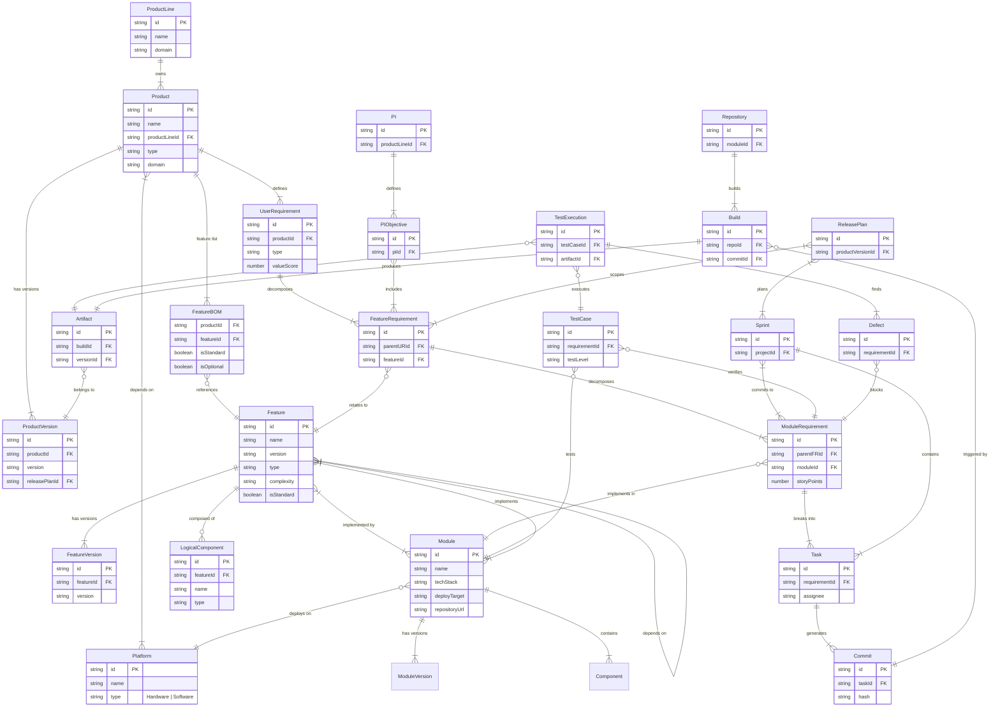
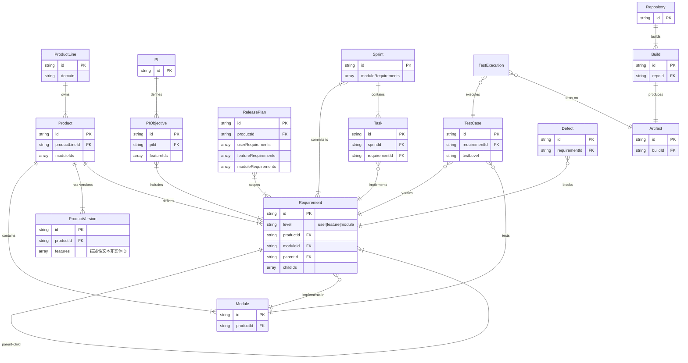

# 数据关系详细分析

> **文档版本**: v1.0  
> **创建时间**: 2026-01-02  
> **分析维度**: 关系模型、追溯链路、数据完整性

---

## 📋 目录

1. [理想关系模型](#一-理想关系模型基于新设计)
2. [当前关系模型](#二-当前关系模型)
3. [关系完整性对比](#三-关系完整性对比)
4. [追溯链路分析](#四-追溯链路分析)
5. [改进建议](#五-改进建议)

---

## 一、 理想关系模型（基于新设计）

### 1.1 完整关系图（Mermaid ERD）



---

### 1.2 关键关系说明

#### 1.2.1 产品层关系

##### R1: Product → FeatureBOM → Feature

```typescript
// 产品通过BOM包含Feature
interface FeatureBOM {
  productId: string;     // 哪个产品
  featureId: string;     // 包含哪个Feature
  isStandard: boolean;   // 是否标配
  isOptional: boolean;   // 是否可选
  variantRules?: string; // 变体规则
}

// 示例
const product_ADAS_High = {
  id: "prod-adas-high",
  name: "ADAS高配版",
  featureBOM: [
    { featureId: "feat-acc", isStandard: true },     // ACC标配
    { featureId: "feat-lcc", isStandard: true },     // LCC标配
    { featureId: "feat-alc", isStandard: true },     // ALC标配（高配独有）
    { featureId: "feat-avp", isStandard: false, isOptional: true } // AVP选配
  ]
};

const product_ADAS_Standard = {
  id: "prod-adas-std",
  name: "ADAS标准版",
  featureBOM: [
    { featureId: "feat-acc", isStandard: true },     // ACC标配
    { featureId: "feat-lcc", isStandard: true }      // LCC标配
    // 没有ALC
  ]
};
```

**作用**：
- 支持产品配置管理
- 支持Feature复用
- 支持差异化产品

##### R2: Product → Platform

```typescript
// 产品依赖平台
interface Product {
  platformIds: string[];  // 依赖的平台
}

// 示例
const product_ADAS = {
  id: "prod-adas",
  platformIds: [
    "platform-orin-x",   // 硬件平台
    "platform-qnx",      // OS平台
    "platform-autosar"   // 软件框架
  ]
};
```

**作用**：
- 软硬件解耦
- 平台兼容性管理
- 支持多平台适配

#### 1.2.2 功能层关系

##### R3: Feature → Module (M:N)

```typescript
// Feature由多个Module实现
interface Feature {
  id: string;
  name: string;
  modules: string[];  // 实现此Feature的Module列表
}

// 示例
const feature_AVP = {
  id: "feat-avp",
  name: "AVP自动泊车",
  modules: [
    "mod-parking-perception",  // 泊车感知模块
    "mod-parking-planning",    // 泊车规划模块
    "mod-parking-control",     // 泊车控制模块
    "mod-hmi"                  // HMI模块（显示泊车界面）
  ]
};

// 反向：Module支持多个Feature
const module_Perception = {
  id: "mod-perception",
  name: "感知模块",
  features: [
    "feat-acc",   // ACC特性
    "feat-lcc",   // LCC特性
    "feat-aeb"    // AEB特性
  ]
};
```

**作用**：
- Feature到实现的追溯
- 模块复用分析
- 变更影响分析

##### R4: Feature → Feature (依赖关系)

```typescript
// Feature之间的依赖
interface Feature {
  dependencies: string[];  // 依赖的其他Feature
  conflicts: string[];     // 冲突的Feature
}

// 示例
const feature_AVP = {
  id: "feat-avp",
  dependencies: [
    "feat-hd-map",      // 依赖高精地图
    "feat-ultrasonic"   // 依赖超声波雷达
  ],
  conflicts: []
};
```

**作用**：
- 依赖检查
- 配置冲突检测
- BOM完整性验证

##### R5: FeatureRequirement ↔ Feature

```typescript
// FeatureRequirement可关联Feature资产
interface FeatureRequirement {
  id: string;
  parentURId: string;
  featureId?: string;  // 关联的Feature资产（可选）
}

// 示例
const FR_ACC_FullSpeed = {
  id: "FR-ACC-001",
  description: "ACC支持0-150km/h全速域",
  parentURId: "UR-ADAS-001",
  featureId: "feat-acc",  // 关联ACC Feature v2.0
  // 这是对ACC Feature的一个具体需求
};
```

**关系说明**：
- **Feature** - 资产实体，可复用
- **FeatureRequirement** - 需求实体，对Feature的具体要求
- **关联** - FR可以关联到Feature，表示"这个需求是针对这个Feature的"

#### 1.2.3 模块层关系

##### R6: Module → Platform/DeployTarget

```typescript
// Module部署在特定平台上
interface Module {
  id: string;
  name: string;
  deployTarget: string;   // 部署目标
  platformId: string;     // 平台ID
  techStack: {
    language: string;
    framework: string;
  };
}

// 示例
const module_PlanningAlgorithm = {
  id: "mod-planning-algo",
  name: "规划算法模块",
  deployTarget: "Orin-X",        // 部署在Orin-X上
  platformId: "platform-orin-x", // 关联平台实体
  techStack: {
    language: "C++",
    framework: "ROS2"
  },
  hardwareRequirements: {
    cpu: "ARM Cortex-A78",
    memory: "512MB",
    computePower: "10 TOPS"
  }
};
```

**作用**：
- 软硬件解耦
- 平台迁移分析
- 资源评估

##### R7: Task → Commit (1:N)

```typescript
// Task生成多个Commit
interface Task {
  id: string;
  requirementId: string;
  commits: string[];  // 关联的代码提交
}

interface Commit {
  id: string;
  taskId: string;
  hash: string;
  message: string;
  files: string[];
}

// 示例
const task_ImplementAstar = {
  id: "TASK-001",
  title: "实现A*算法",
  requirementId: "MR-PLAN-001",
  commits: ["commit-001", "commit-002", "commit-003"]
};

const commit_001 = {
  id: "commit-001",
  taskId: "TASK-001",
  hash: "a1b2c3d4",
  message: "feat: add A* algorithm skeleton",
  files: ["src/planning/astar.cpp"]
};
```

**作用**：
- 需求到代码的精细追溯
- 变更影响分析
- 质量追溯

#### 1.2.4 规划层关系

##### R8: ReleasePlan → FeatureRequirement (N:N)

```typescript
// 发布计划包含Feature需求
interface ReleasePlan {
  id: string;
  productVersionId: string;
  featureRequirements: string[];  // 范围锁定
}

// 示例
const releasePlan_V2_0 = {
  id: "RP-ADAS-V2.0",
  version: "2.0.0",
  featureRequirements: [
    "FR-ACC-001",  // ACC全速域
    "FR-LCC-001",  // LCC增强
    "FR-AEB-001"   // AEB优化
  ]
};
```

##### R9: Sprint → ModuleRequirement (N:N)

```typescript
// Sprint承诺实现模块需求
interface Sprint {
  id: string;
  moduleRequirements: string[];  // 本Sprint要完成的MR
}

// 示例
const sprint_ADAS_S01 = {
  id: "sprint-adas-01",
  name: "ADAS Sprint 1",
  moduleRequirements: [
    "MR-PERCEPTION-001",
    "MR-PERCEPTION-002",
    "MR-PLANNING-001"
  ]
};
```

#### 1.2.5 测试层关系

##### R10: TestCase → ModuleRequirement

```typescript
// TestCase验证模块需求
interface TestCase {
  id: string;
  requirementId: string;    // 验证的MR
  requirementLevel: 'module';
  testLevel: TestLevel;     // 测试级别
}

// 示例
const testCase_AEB_Unit = {
  id: "TC-AEB-001",
  title: "AEB算法单元测试",
  requirementId: "MR-AEB-001",
  requirementLevel: "module",
  testLevel: "unit"
};
```

##### R11: Defect → ModuleRequirement

```typescript
// Defect阻塞模块需求
interface Defect {
  id: string;
  requirementId: string;    // 阻塞的MR
  requirementLevel: 'module';
  severity: Severity;
}

// 示例
const defect_001 = {
  id: "DEF-001",
  title: "AEB误刹车",
  requirementId: "MR-AEB-001",  // 阻塞MR-AEB-001
  requirementLevel: "module",
  severity: "critical"
};
```

---

## 二、 当前关系模型

### 2.1 当前已实现的关系（Mermaid ERD）



---

### 2.2 关系实现详情

#### 2.2.1 已完整实现的关系 ✅

| 关系 | 基数 | 实现方式 | 完成度 | 说明 |
|------|------|---------|--------|------|
| ProductLine → Product | 1:N | productLineId | 100% | 完整 |
| Product → Module | 1:N | moduleIds[] | 100% | 完整 |
| UR → FR → MR | 1:N:N | parentId/childIds | 100% | 完整追溯 |
| MR → Module | N:1 | moduleId | 100% | 完整 |
| Sprint → MR | N:N | moduleRequirements[] | 100% | P1已实现 |
| Task → MR | N:1 | requirementId | 100% | P1已实现 |
| TestCase → MR | N:1 | requirementId | 100% | P1已实现 |
| Defect → MR | N:1 | requirementId | 100% | P2.2已实现 |
| PI → PIObjective | 1:N | piId | 100% | 完整 |
| PIObjective → FR | N:N | featureIds[] | 100% | 完整 |
| ReleasePlan → Requirements | 1:N | requirements[] | 100% | P2.3已实现 |
| TestExecution → Artifact | N:1 | artifactId | 100% | P2.1已实现 |

#### 2.2.2 部分实现的关系 ⚠️

| 关系 | 目标 | 当前实现 | 差距 | 优先级 |
|------|------|---------|------|--------|
| Product → ProductVersion | 1:N | ✅ | features是文本非ID | P1 |
| Requirement → PIObjective | N:N | ⚠️ | MR未反向关联 | P2 |
| Requirement → ReleasePlan | N:N | ⚠️ | MR未反向关联 | P2 |

#### 2.2.3 完全缺失的关系 ❌

| 关系 | 说明 | 影响 | 优先级 |
|------|------|------|--------|
| **Product → Feature BOM** | 产品包含哪些Feature | 无法进行产品配置管理 | **P0** |
| **Feature → Module** | Feature由哪些Module实现 | 无法追溯Feature到Module | **P0** |
| **Module → Platform** | Module部署在哪个平台 | 软硬件耦合 | **P0** |
| **Module → Feature** | Module支持哪些Feature | 无法分析模块复用 | **P0** |
| **Product → Platform** | 产品依赖哪些平台 | 无法管理平台依赖 | P1 |
| **Feature → Feature** | Feature依赖关系 | 无法检查依赖冲突 | P1 |
| **Task → Commit** | 任务生成哪些提交 | 无法精细追溯代码 | P2 |
| **Commit → Build** | 提交触发哪个构建 | DevOps链路不完整 | P2 |

---

## 三、 关系完整性对比

### 3.1 按层级对比

#### 3.1.1 产品层关系

| 关系 | 目标设计 | 当前实现 | 完成度 | 评估 |
|------|---------|---------|--------|------|
| ProductLine → Product | ✅ 1:N | ✅ 1:N | 100% | 完整 |
| Product → Feature BOM | ✅ 1:N | ❌ 无 | 0% | **严重缺失** |
| Product → Platform | ✅ M:N | ❌ 无 | 0% | 缺失 |
| Product → ProductVersion | ✅ 1:N | ✅ 1:N | 90% | features需改进 |
| Product → Module | ✅ 1:N | ✅ 1:N | 100% | 完整 |

**产品层完成度**: **58%**

**关键问题**：
- Feature BOM缺失是**核心问题**
- Platform依赖缺失影响平台化能力

#### 3.1.2 功能层关系

| 关系 | 目标设计 | 当前实现 | 完成度 | 评估 |
|------|---------|---------|--------|------|
| UR → FR | ✅ 1:N | ✅ 1:N | 100% | 完整 |
| FR → MR | ✅ 1:N | ✅ 1:N | 100% | 完整 |
| Feature → Module | ✅ M:N | ❌ 无 | 0% | **严重缺失** |
| Feature → Feature | ✅ M:N | ❌ 无 | 0% | 缺失 |
| FR → Feature | ✅ N:1 | ❌ 无 | 0% | **严重缺失** |

**功能层完成度**: **40%**

**关键问题**：
- Feature实体及其所有关系全部缺失
- 需求与资产分离的理念未实现

#### 3.1.3 模块层关系

| 关系 | 目标设计 | 当前实现 | 完成度 | 评估 |
|------|---------|---------|--------|------|
| Module → Platform | ✅ M:1 | ❌ 无 | 0% | **严重缺失** |
| Module → Feature | ✅ M:N | ❌ 无 | 0% | **严重缺失** |
| MR → Module | ✅ N:1 | ✅ N:1 | 100% | 完整 |
| MR → Task | ✅ 1:N | ✅ 1:N | 100% | 完整 |
| Task → Commit | ✅ 1:N | ❌ 无 | 0% | 缺失 |

**模块层完成度**: **40%**

**关键问题**：
- 部署信息缺失（Module → Platform）
- Feature关联缺失（Module → Feature）

#### 3.1.4 规划层关系

| 关系 | 目标设计 | 当前实现 | 完成度 | 评估 |
|------|---------|---------|--------|------|
| PI → PIObjective | ✅ 1:N | ✅ 1:N | 100% | 完整 |
| PIObjective → FR | ✅ N:N | ✅ N:N | 100% | 完整 |
| ReleasePlan → FR | ✅ N:N | ✅ N:N | 100% | P2.3完整 |
| Sprint → MR | ✅ N:N | ✅ N:N | 100% | P1完整 |

**规划层完成度**: **100%** ✅

**评估**: 规划层关系非常完整，是亮点

#### 3.1.5 测试层关系

| 关系 | 目标设计 | 当前实现 | 完成度 | 评估 |
|------|---------|---------|--------|------|
| TestCase → MR | ✅ N:1 | ✅ N:1 | 100% | 完整 |
| TestExecution → TestCase | ✅ N:1 | ✅ N:1 | 100% | 完整 |
| TestExecution → Artifact | ✅ N:1 | ✅ N:1 | 100% | P2.1完整 |
| Defect → MR | ✅ N:1 | ✅ N:1 | 100% | P2.2完整 |

**测试层完成度**: **100%** ✅

**评估**: 测试层关系非常完整，是亮点

#### 3.1.6 DevOps层关系

| 关系 | 目标设计 | 当前实现 | 完成度 | 评估 |
|------|---------|---------|--------|------|
| Repository → Build | ✅ 1:N | ✅ 1:N | 100% | 完整 |
| Build → Artifact | ✅ 1:1 | ✅ 1:1 | 100% | 完整 |
| Commit → Build | ✅ 1:1 | ❌ 无 | 0% | 缺失 |
| Task → Commit | ✅ 1:N | ❌ 无 | 0% | 缺失 |

**DevOps层完成度**: **50%**

**评估**: 基础完整，缺Commit实体

---

### 3.2 整体完成度矩阵

```
层级           │ 关系完整度 │ 评级 │ 关键缺失
─────────────┼───────────┼─────┼──────────────
产品层        │    58%    │  C   │ Feature BOM, Platform
功能层        │    40%    │  D   │ Feature实体及所有关系
模块层        │    40%    │  D   │ Platform, Feature关联
规划层        │   100%    │  A+  │ 无
测试层        │   100%    │  A+  │ 无
DevOps层      │    50%    │  C   │ Commit实体
─────────────┼───────────┼─────┼──────────────
**总体**      │  **64%**  │ **C**│ Feature体系, 部署信息
```

---

## 四、 追溯链路分析

### 4.1 理想追溯链路

#### 4.1.1 完整价值流追溯（端到端）

```
用户价值 → 产品 → 特性 → 需求 → 模块 → 任务 → 代码 → 制品 → 测试 → 缺陷

详细链路：
UserRequirement (UR)
  └─ belongs to → Product
      └─ contains → Feature (BOM)
          └─ implemented by → Module
              └─ deploys on → Platform
  └─ decomposes → FeatureRequirement (FR)
      └─ relates to → Feature
      └─ included in → PIObjective
      └─ scoped in → ReleasePlan
      └─ decomposes → ModuleRequirement (MR)
          └─ implements in → Module
          └─ committed in → Sprint
          └─ breaks into → Task
              └─ generates → Commit
                  └─ triggers → Build
                      └─ produces → Artifact
                          └─ verified by → TestExecution
                              └─ executes → TestCase
                                  └─ verifies → MR
                              └─ finds → Defect
                                  └─ blocks → MR
```

#### 4.1.2 关键追溯场景

##### 场景1: 用户需求到代码实现

```
问题: "UR-AVP-001 (一键泊车) 在代码中哪里实现的？"

理想追溯路径:
1. UR-AVP-001 → 分解 → [FR-AVP-001, FR-AVP-002, ...]
2. FR-AVP-001 → 关联 → Feature "AVP v1.5"
3. Feature "AVP v1.5" → 实现于 → [mod-parking-perception, mod-parking-planning, ...]
4. mod-parking-perception → 代码仓库 → repo-parking (src/perception/)
5. mod-parking-perception → MR-AVP-PER-001 → 任务 → TASK-001
6. TASK-001 → 提交 → [commit-001, commit-002, ...]
7. commit-001 → 文件 → src/perception/parking_detection.cpp

答案: src/perception/parking_detection.cpp (lines 100-250)
```

##### 场景2: Feature到产品配置

```
问题: "AVP特性被哪些产品使用？"

理想追溯路径:
1. Feature "AVP v1.5" (id: feat-avp)
2. 查询 FeatureBOM where featureId = "feat-avp"
3. 返回:
   - Product "ADAS高配版" (standard=false, optional=true)
   - Product "智驾旗舰版" (standard=true)

答案: 2个产品使用，1个标配，1个选配
```

##### 场景3: 模块到硬件平台

```
问题: "如果Orin-X平台升级，影响哪些模块？"

理想追溯路径:
1. Platform "Orin-X" (id: platform-orin-x)
2. 查询 Module where deployTarget = "Orin-X"
3. 返回:
   - mod-perception (感知模块)
   - mod-planning (规划模块)
   - mod-control (控制模块)
4. 这些模块支持的Feature:
   - mod-perception → [feat-acc, feat-lcc, feat-avp, ...]
5. 这些Feature被哪些产品使用:
   - feat-acc → [ADAS高配版, ADAS标准版, ...]

答案: 影响3个模块，涉及6个Feature，波及5个产品
```

##### 场景4: 缺陷到用户需求

```
问题: "DEF-001 (AEB误刹车) 影响哪个用户需求？"

理想追溯路径:
1. DEF-001 → blocks → MR-AEB-001
2. MR-AEB-001 → parent → FR-AEB-001
3. FR-AEB-001 → parent → UR-SAFETY-001
4. UR-SAFETY-001 → product → ADAS高配版

答案: 影响 UR-SAFETY-001 "紧急制动避障"，关系到产品核心安全功能
```

---

### 4.2 当前追溯能力

#### 4.2.1 已支持的追溯 ✅

| 追溯路径 | 实现方式 | 完成度 | 说明 |
|---------|---------|--------|------|
| UR → FR → MR | parentId/childIds | 100% | 完整三层需求追溯 |
| MR → Module | moduleId | 100% | 需求到模块 |
| MR → Sprint | Sprint.moduleRequirements[] | 100% | 需求到迭代 (P1) |
| MR → Task | Task.requirementId | 100% | 需求到任务 (P1) |
| MR → TestCase | TestCase.requirementId | 100% | 需求到测试 (P1) |
| MR → Defect | Defect.requirementId | 100% | 需求到缺陷 (P2.2) |
| FR → PIObjective | PIObjective.featureIds[] | 100% | 需求到PI目标 |
| FR → ReleasePlan | ReleasePlan.featureRequirements[] | 100% | 需求到发布 (P2.3) |
| Product → Module | Product.moduleIds[] | 100% | 产品到模块 |
| Artifact → TestExecution | TestExecution.artifactId | 100% | 制品到测试执行 (P2.1) |

**评估**: 需求维度的追溯**非常完整**，是当前实现的最大亮点 ✅

#### 4.2.2 部分支持的追溯 ⚠️

| 追溯路径 | 当前实现 | 差距 | 影响 |
|---------|---------|------|------|
| Product → Feature | ❌ | 无Feature实体 | 无法追溯产品包含哪些Feature |
| Feature → Module | ❌ | 无Feature实体 | 无法追溯Feature如何实现 |
| Module → Platform | ❌ | 无Platform关联 | 无法追溯模块部署在哪 |

#### 4.2.3 缺失的追溯 ❌

| 追溯路径 | 目标 | 当前 | 优先级 |
|---------|------|------|--------|
| **UR → Feature** | UR关联Feature | ❌ 无 | P0 |
| **Feature → Module** | Feature由哪些Module实现 | ❌ 无 | P0 |
| **Module → DeployTarget** | Module部署在哪个硬件 | ❌ 无 | P0 |
| **Feature → Feature** | Feature依赖关系 | ❌ 无 | P1 |
| **Task → Commit** | 任务生成哪些代码 | ❌ 无 | P2 |
| **Commit → Build** | 提交触发哪个构建 | ❌ 无 | P2 |

---

### 4.3 追溯链路完整性评估

#### 4.3.1 纵向追溯（需求分解链）

```
UR → FR → MR → Task → Commit → Build → Artifact → TestExecution → Defect

当前实现:
UR → FR → MR → Task → [断裂] → [断裂] → Artifact → TestExecution → Defect
✅   ✅   ✅   ✅      ❌          ❌        ✅          ✅              ✅

完整度: 77% (7/9个链接)
```

**评估**: 基本完整，缺Commit实体导致链路断裂

#### 4.3.2 横向追溯（资产实现链）

```
Product → Feature → Module → DeployTarget → Platform

当前实现:
Product → [断裂] → Module → [断裂] → [断裂]
✅         ❌        ✅       ❌          ❌

完整度: 33% (2/5个链接)
```

**评估**: **严重不完整**，Feature和Platform相关链路全部缺失

#### 4.3.3 规划追溯（计划执行链）

```
PIObjective → FR → MR → Sprint → Task

当前实现:
PIObjective → FR → MR → Sprint → Task
✅            ✅   ✅   ✅       ✅

完整度: 100%
```

**评估**: **完全完整**，规划层追溯能力优秀 ✅

---

## 五、 改进建议

### 5.1 关系层面的优先级改进

#### P0 - 关键关系（必须立即建立）

##### 1. Product ↔ Feature BOM

```typescript
// 新增FeatureBOM表
interface FeatureBOM {
  productId: string;
  featureId: string;
  isStandard: boolean;
  isOptional: boolean;
  variantRules?: string;
}

// 实施步骤:
// 1. 定义Feature实体
// 2. 建立Product.featureBOM[] 关系
// 3. 为现有产品补充Feature BOM数据
// 4. 更新ProductDetailPage显示Feature列表
```

**影响**: 支持产品配置管理，核心能力

##### 2. Feature → Module (M:N)

```typescript
// 扩展Feature实体
interface Feature {
  modules: string[];  // 实现此Feature的Module
}

// 扩展Module实体
interface Module {
  features: string[];  // 支持哪些Feature
}

// 实施步骤:
// 1. 在Feature中添加modules[]
// 2. 在Module中添加features[]
// 3. 为现有数据建立映射关系
// 4. 实现双向查询工具函数
```

**影响**: 支持Feature追溯到实现

##### 3. Module → Platform/DeployTarget

```typescript
// 扩展Module实体
interface Module {
  deployTarget: string;   // "Orin-X" | "J6M" | "SA8295"
  platformId: string;     // 关联Platform实体
  techStack: {
    language: string;     // "C++" | "Python"
    framework: string;    // "ROS2" | "AUTOSAR"
  };
  hardwareRequirements: {
    cpu?: string;
    memory?: string;
    computePower?: string;
  };
}

// 实施步骤:
// 1. 创建Platform实体
// 2. 扩展Module实体添加部署信息
// 3. 为现有模块补充部署数据
// 4. 实现平台影响分析工具
```

**影响**: 软硬件解耦，支持多平台

#### P1 - 重要关系（近期建立）

##### 4. Product → Platform

```typescript
interface Product {
  platformIds: string[];  // 依赖的平台
}
```

##### 5. Feature → Feature (依赖)

```typescript
interface Feature {
  dependencies: string[];  // 依赖的Feature
  conflicts: string[];     // 冲突的Feature
}
```

#### P2 - 增强关系（可选）

##### 6. Task → Commit

```typescript
interface Commit {
  id: string;
  taskId: string;
  hash: string;
  // ...
}

interface Task {
  commits: string[];
}
```

---

### 5.2 追溯能力提升计划

#### 阶段1: 建立资产追溯（P0，1-2周）

**目标**: 支持Product → Feature → Module追溯

**交付**:
- ✅ Feature实体和BOM关系
- ✅ Feature ↔ Module双向追溯
- ✅ Module部署信息

**验收场景**:
- 查询"产品包含哪些Feature"
- 查询"Feature由哪些Module实现"
- 查询"Module部署在哪个平台"

#### 阶段2: 扩展平台管理（P1，1个月）

**目标**: 支持平台依赖追溯

**交付**:
- ✅ Platform实体
- ✅ Product → Platform关联
- ✅ Feature依赖管理

**验收场景**:
- 查询"产品依赖哪些平台"
- 查询"平台升级影响哪些模块"
- 检测"Feature依赖冲突"

#### 阶段3: 完善DevOps链路（P2，3个月）

**目标**: 支持代码级追溯

**交付**:
- ✅ Commit实体
- ✅ Task → Commit → Build链路
- ✅ 代码变更影响分析

**验收场景**:
- 追溯"需求的代码在哪里"
- 分析"提交影响哪些需求"
- 评估"变更波及范围"

---

### 5.3 数据完整性检查

#### 5.3.1 必需关系约束

建议实施以下数据约束：

```typescript
// 约束1: Product必须有Feature BOM
if (product.featureBOM.length === 0) {
  throw new Error("Product must have at least one Feature");
}

// 约束2: Feature必须有实现的Module
if (feature.modules.length === 0) {
  throw new Error("Feature must be implemented by at least one Module");
}

// 约束3: Module必须有部署目标
if (!module.deployTarget || !module.platformId) {
  throw new Error("Module must have deployTarget and platformId");
}

// 约束4: MR必须关联Module
if (moduleRequirement.level === 'module' && !moduleRequirement.moduleId) {
  throw new Error("ModuleRequirement must have moduleId");
}

// 约束5: TestCase必须关联Requirement
if (!testCase.requirementId) {
  throw new Error("TestCase must have requirementId");
}
```

#### 5.3.2 关系一致性检查

```typescript
// 检查1: BOM一致性
function checkFeatureBOMConsistency(product: Product) {
  product.featureBOM.forEach(bom => {
    const feature = features.find(f => f.id === bom.featureId);
    if (!feature) {
      throw new Error(`Feature ${bom.featureId} not found in product BOM`);
    }
  });
}

// 检查2: Module-Feature一致性
function checkModuleFeatureConsistency(feature: Feature) {
  feature.modules.forEach(moduleId => {
    const module = modules.find(m => m.id === moduleId);
    if (!module.features.includes(feature.id)) {
      throw new Error(`Module ${moduleId} does not reference Feature ${feature.id}`);
    }
  });
}

// 检查3: 追溯链完整性
function checkTraceabilityChain(ur: UserRequirement) {
  // 检查UR → FR → MR链路完整
  // 检查MR → Task链路完整
  // 检查Task → TestCase链路完整
}
```

---

## 六、 总结

### 6.1 关系模型评估

| 维度 | 目标 | 当前 | 完成度 | 评级 |
|------|------|------|--------|------|
| **需求追溯** | 完整 | 完整 | 100% | A+ |
| **规划追溯** | 完整 | 完整 | 100% | A+ |
| **测试追溯** | 完整 | 完整 | 100% | A+ |
| **资产追溯** | 完整 | 严重缺失 | 33% | D |
| **部署追溯** | 完整 | 完全缺失 | 0% | F |
| **代码追溯** | 完整 | 部分缺失 | 50% | C |
| **整体** | - | - | **64%** | **C** |

### 6.2 优势

1. ✅ **需求维度追溯极其完整** - UR→FR→MR→Task→TestCase→Defect
2. ✅ **规划层关系完整** - PI→PIObjective→FR, ReleasePlan→Requirements, Sprint→MR
3. ✅ **测试闭环完整** - TestCase→MR, TestExecution→Artifact, Defect→MR

### 6.3 关键不足

1. ❌ **资产追溯严重缺失** - 无Feature实体，无Product→Feature→Module链路
2. ❌ **部署信息完全缺失** - 无Module→Platform关联，软硬件耦合
3. ❌ **代码追溯不完整** - 缺Commit实体，Task→Code链路断裂

### 6.4 改进建议

**P0优先级（1-2周）**:
1. 建立Feature实体和BOM关系
2. 建立Feature ↔ Module双向关联
3. 扩展Module添加部署信息

**P1优先级（1个月）**:
4. 建立Platform实体和关联
5. 实施Feature依赖管理

**P2优先级（3个月）**:
6. 完善DevOps链路（Commit）
7. 实施关系一致性检查

---

**下一步**: 查看 [03-PAGE_NAVIGATION_ANALYSIS.md](./03-PAGE_NAVIGATION_ANALYSIS.md) 了解页面跳转和数据流转分析。

