# 领域模型对比可视化图

> **文档版本**: v1.0  
> **创建时间**: 2026-01-02  
> **对应文档**: 01-DOMAIN_MODEL_COMPARISON.md

---

## 📊 目录

1. [三层资产管理体系类图](#一-三层资产管理体系类图)
2. [实体关系图](#二-实体关系图)
3. [当前实现vs理想设计对比](#三-当前实现vs理想设计对比)
4. [关键差距可视化](#四-关键差距可视化)
5. [改进路径图](#五-改进路径图)

---

## 一、 三层资产管理体系类图

### 1.1 产品层（Product Layer）类图

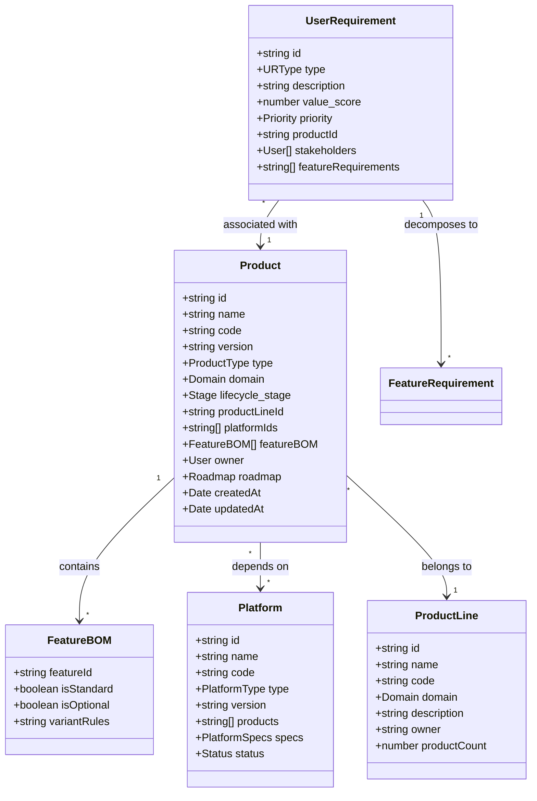

### 1.2 功能层（Function Layer）类图

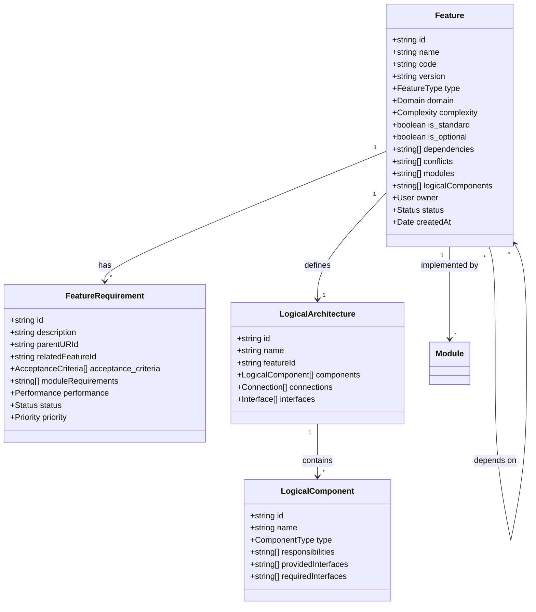

### 1.3 模块层（Module Layer）类图

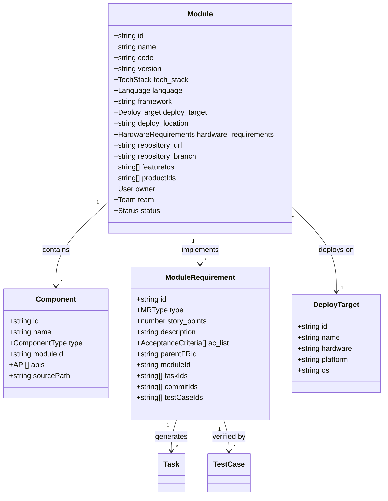

---

## 二、 实体关系图

### 2.1 完整三层关系图

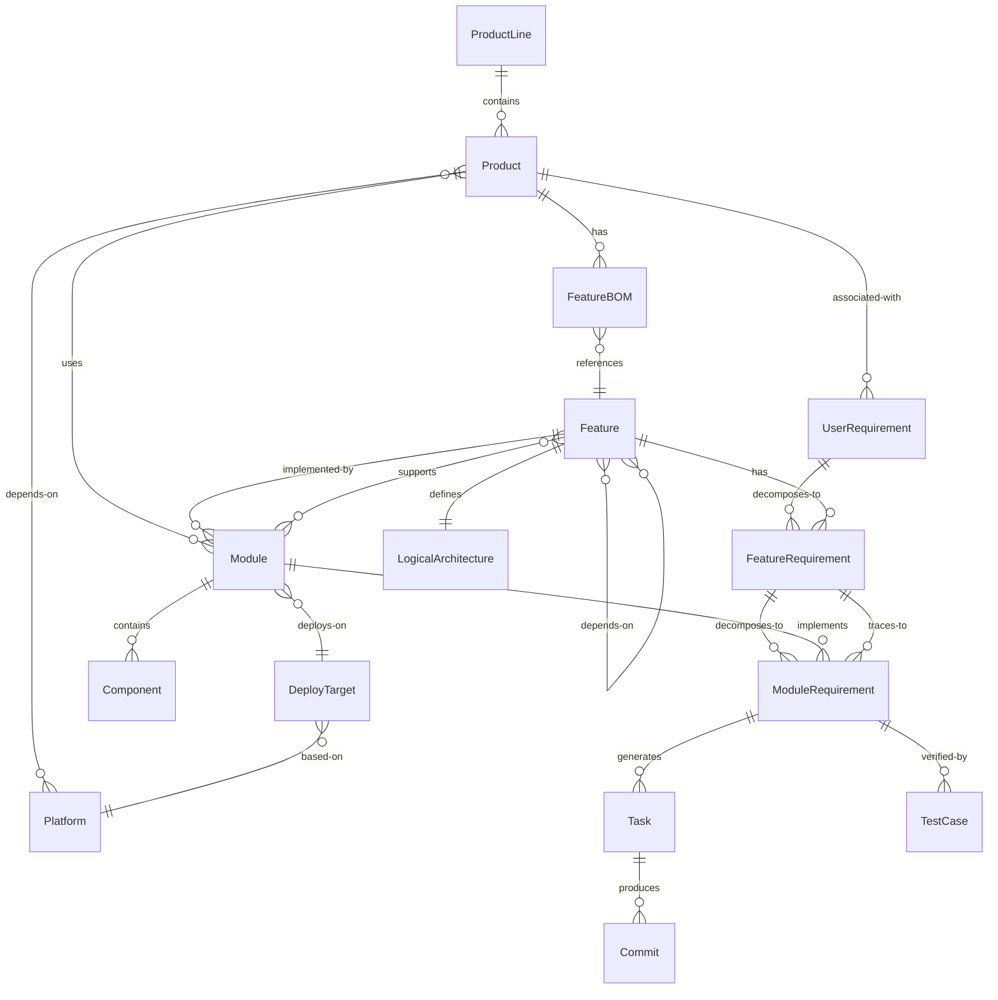

### 2.2 追溯关系图（Traceability）

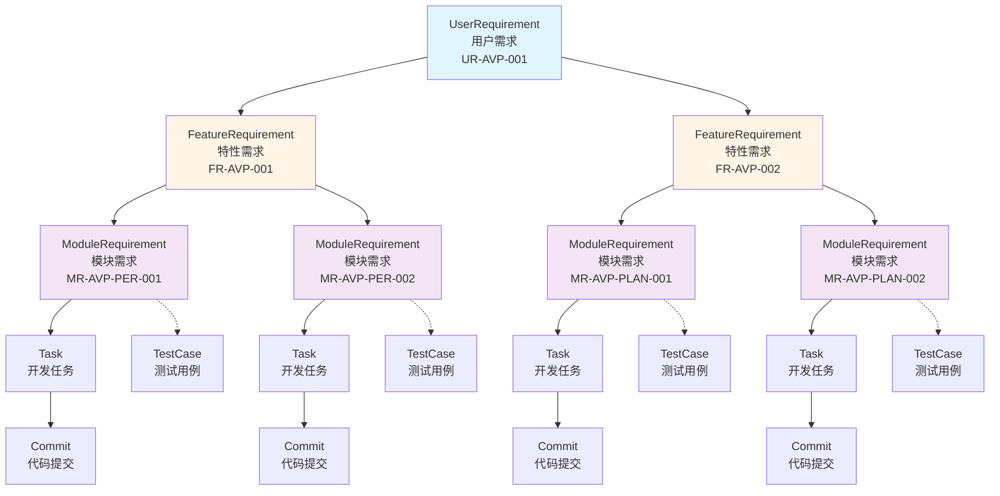

### 2.3 资产构成关系图（Composition）

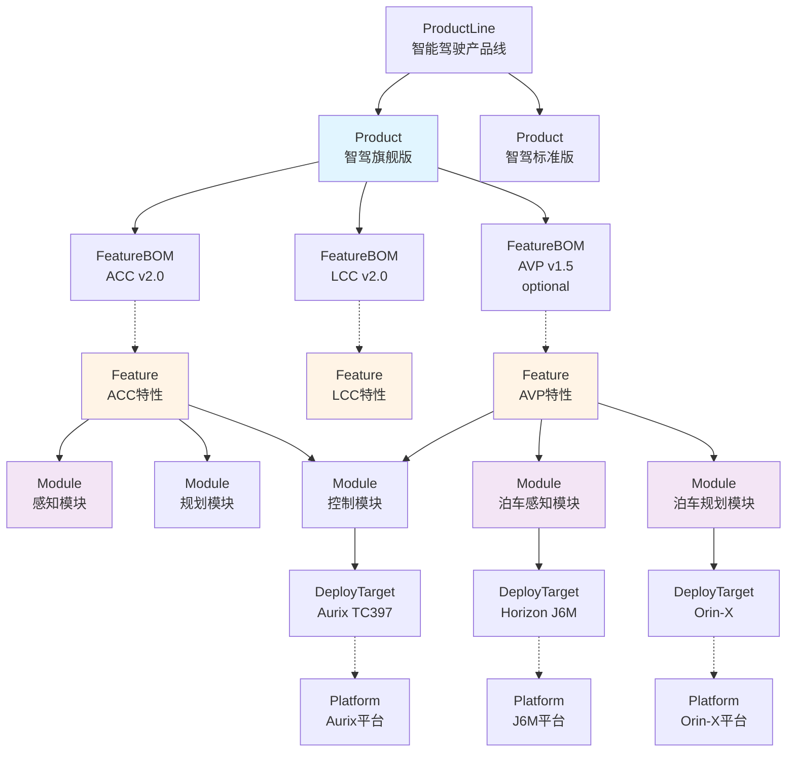

---

## 三、 当前实现vs理想设计对比

### 3.1 实体层面对比

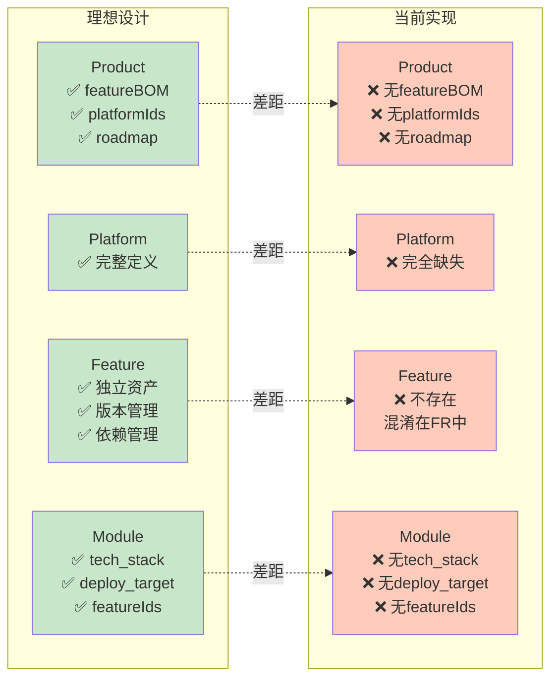

### 3.2 关系对比

```mermaid
graph TD
    subgraph 理想设计关系
        direction TB
        R1[Product → FeatureBOM]
        R2[FeatureBOM → Feature]
        R3[Feature → Module]
        R4[Module → DeployTarget]
        R5[DeployTarget → Platform]
        R6[Feature → Feature 依赖]
    end
    
    subgraph 当前实现关系
        direction TB
        C1[Product → Module ✅]
        C2[Product → FeatureBOM ❌]
        C3[Feature实体 ❌]
        C4[Module → DeployTarget ❌]
        C5[Platform实体 ❌]
        C6[Feature依赖 ❌]
    end
    
    style R1 fill:#c8e6c9
    style R2 fill:#c8e6c9
    style R3 fill:#c8e6c9
    style R4 fill:#c8e6c9
    style R5 fill:#c8e6c9
    style R6 fill:#c8e6c9
    style C2 fill:#ffccbc
    style C3 fill:#ffccbc
    style C4 fill:#ffccbc
    style C5 fill:#ffccbc
    style C6 fill:#ffccbc
```

---

## 四、 关键差距可视化

### 4.1 差距优先级矩阵

```mermaid
quadrantChart
    title 差距分析矩阵（影响 vs 复杂度）
    x-axis 低复杂度 --> 高复杂度
    y-axis 低影响 --> 高影响
    quadrant-1 P1: 重要但复杂
    quadrant-2 P0: 关键且可行
    quadrant-3 P2: 可选
    quadrant-4 P1: 快速改进
    
    Feature实体: [0.3, 0.9]
    featureBOM: [0.25, 0.85]
    deploy_target: [0.2, 0.8]
    featureIds: [0.15, 0.75]
    Platform实体: [0.5, 0.7]
    platformIds: [0.4, 0.65]
    Feature依赖: [0.6, 0.6]
    LogicalArch: [0.7, 0.4]
    Commit实体: [0.8, 0.3]
    roadmap: [0.75, 0.25]
```

### 4.2 完成度对比（雷达图）

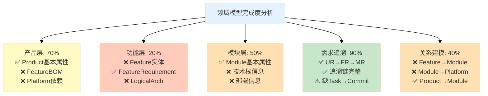

### 4.3 关键能力差距

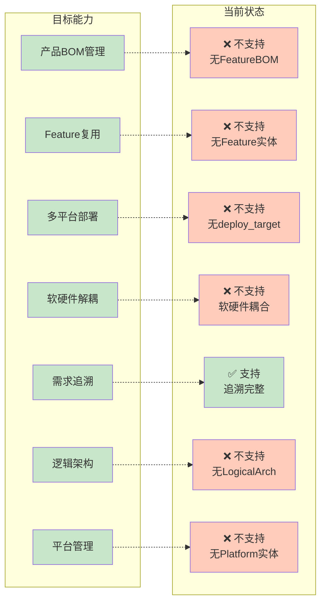

---

## 五、 改进路径图

### 5.1 改进实施路线图

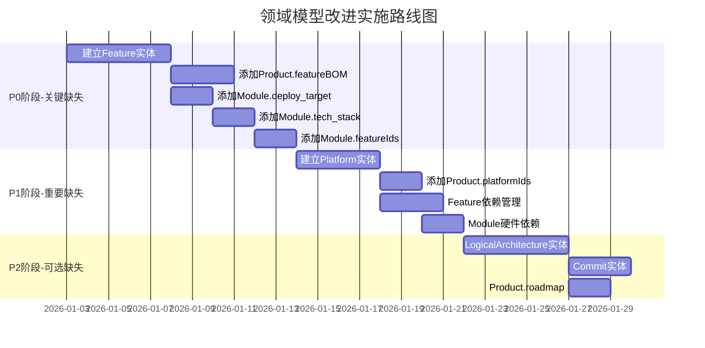

### 5.2 改进依赖关系图

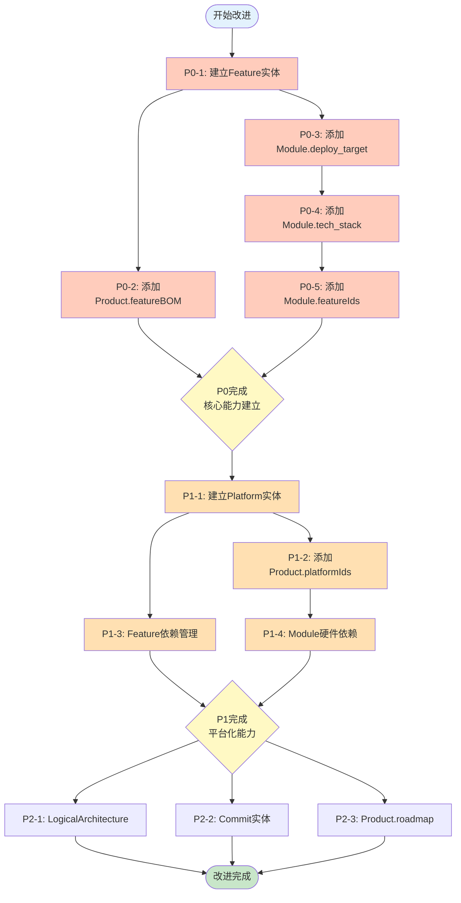

### 5.3 改进后的完整架构

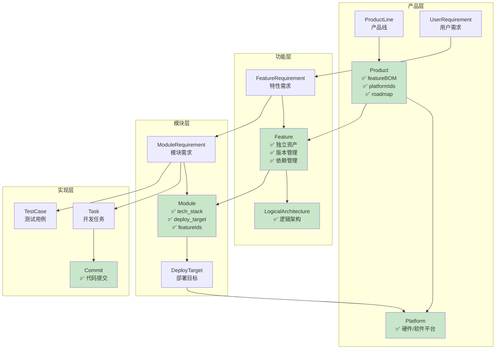

---

## 六、 总结

### 6.1 可视化要点

本可视化文档通过以下图表类型展示了领域模型对比：

1. **类图（Class Diagram）** - 展示实体的详细属性和方法
2. **实体关系图（ER Diagram）** - 展示实体间的关联关系
3. **追溯关系图（Traceability Graph）** - 展示需求的纵向分解
4. **构成关系图（Composition Graph）** - 展示资产的横向组装
5. **对比图（Comparison Graph）** - 展示理想设计vs当前实现
6. **优先级矩阵（Quadrant Chart）** - 展示差距的优先级
7. **路线图（Gantt Chart）** - 展示改进的时间计划
8. **依赖关系图（Dependency Graph）** - 展示改进任务的依赖

### 6.2 关键发现（可视化视角）

从可视化图表中可以清晰看到：

1. **Feature实体缺失** - 导致产品层和模块层之间断层
2. **Platform实体缺失** - 导致软硬件耦合
3. **部署信息缺失** - Module无法追溯到硬件平台
4. **需求追溯完整** - UR→FR→MR链路清晰（唯一的亮点）

### 6.3 使用建议

- **决策者** - 重点查看"差距优先级矩阵"和"改进路线图"
- **架构师** - 重点查看"类图"和"实体关系图"
- **开发者** - 重点查看"改进依赖关系图"和"改进后的完整架构"

---

**相关文档**:
- [01-DOMAIN_MODEL_COMPARISON.md](./01-DOMAIN_MODEL_COMPARISON.md) - 详细文字对比
- [06-AVP_CASE_STUDY-visualization.md](./06-AVP_CASE_STUDY-visualization.md) - AVP案例可视化
- [05-IMPROVEMENT_PLAN.md](./05-IMPROVEMENT_PLAN.md) - 详细改进方案

