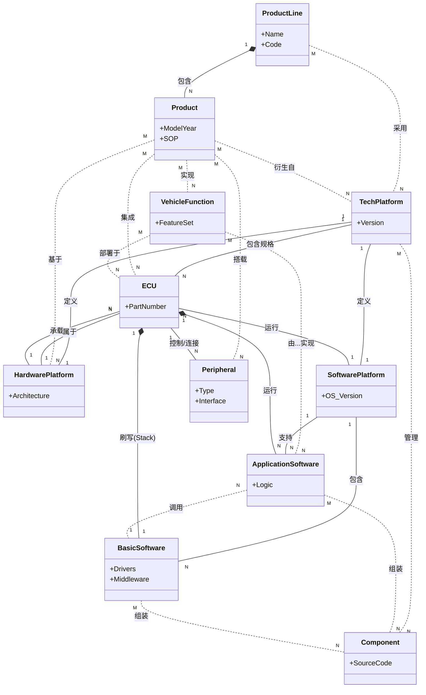

基于提供的文档（特别是《02_NEW_TYPE_DEFINITIONS.md》中的核心关系矩阵和类型定义），我为你设计了一个全面的领域模型关系图。

该模型展示了从顶层**产品线**到具体**软硬件组件**的层级结构和关联关系。

### 🚗 汽车研发资产领域模型关系图

该图表基于文档中的**核心关系矩阵** 和**类型定义** 构建。

---

### 🔍 关键关系解读

根据提供的**核心关系矩阵** 和**改进说明**，模型的主要逻辑层级如下：

#### 1. 顶层规划层 (Product Line & Platform)
*   **ProductLine (产品线)** 是最高层级的聚合，它与 **Product (产品)** 是 **1:N** 的关系，意味着一个产品线包含多个具体车型产品。
*   **Tech Platform (技术平台)** 起到承上启下的作用，它包含 **HardwarePlatform (硬件平台)** 和 **SoftwarePlatform (软件平台)**，二者均为 **1:1** 的强对应关系。

#### 2. 功能定义层 (Vehicle Function)
*   **VehicleFunction (整车功能)** 是逻辑层面的核心。它不仅与 **Product (产品)** 是 **M:N** 关系（不同车型配置不同功能），还直接映射到实现层：
    *   逻辑上：由 **ApplicationSoftware (应用软件)** 实现 (M:N)。
    *   物理上：分布在 **ECU** 上 (M:N)。

#### 3. 电子电气架构层 (ECU & Peripheral)
*   **ECU** 是核心节点，它汇聚了软硬件：
    *   它属于某个 **HardwarePlatform** (N:1)。
    *   它控制 **Peripheral (周边件)** (1:N)。
    *   它运行 **ApplicationSoftware** (1:N)。
    *   它包含 **BSW (基础软件)** (1:1，指一个ECU运行一套BSW协议栈)。

#### 4. 软件实现层 (App SW & BSW)
*   **SoftwarePlatform (软件平台)** 统一管理 **ApplicationSoftware** 和 **BSW**。
*   **Component (组件)** 是最底层的原子单元，被技术平台、应用软件和基础软件多对多 (M:N) 复用。
*   **ApplicationSoftware** 依赖 **BSW** (N:1) 来访问底层硬件资源。

---

### 💡 辅助理解的类比
为了更好地理解这个领域模型，可以将汽车研发资产类比为**“智能手机研发”**：

*   **ProductLine (产品线)**：比如 iPhone 15 系列。
*   **Product (产品)**：iPhone 15 Pro Max。
*   **Tech Platform (技术平台)**：A17 芯片架构 + iOS 17 系统架构。
*   **ECU**：类似于手机的主板或独立的协处理器（如电源管理芯片）。
*   **Peripheral (周边件)**：摄像头模组、屏幕、扬声器。
*   **VehicleFunction (整车功能)**：“面容ID解锁”、“全景拍照”。
*   **ApplicationSoftware (应用软件)**：相机App、相册App的逻辑代码。
*   **BasicSoftware (BSW)**：iOS内核、蓝牙驱动、底层通信协议。

这个模型通过清晰定义**“功能-软件-硬件-平台”**的四维关系，解决了文档中提到的资产类型改进和规范化目标。