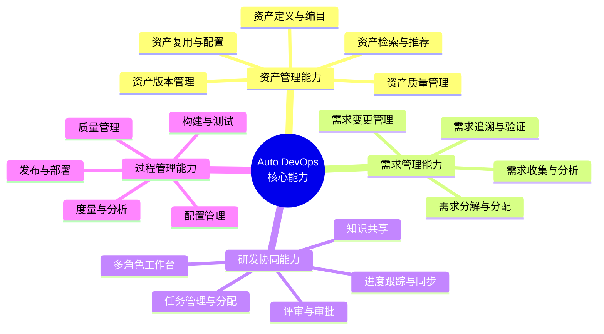
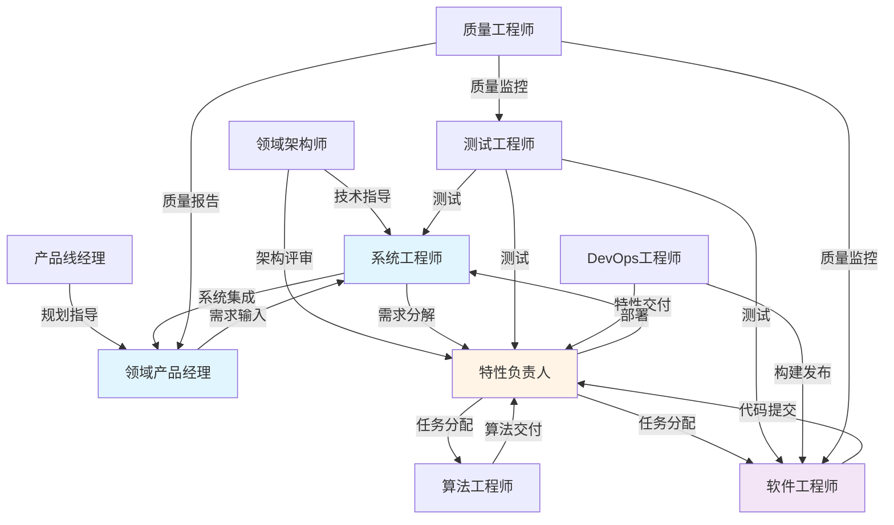
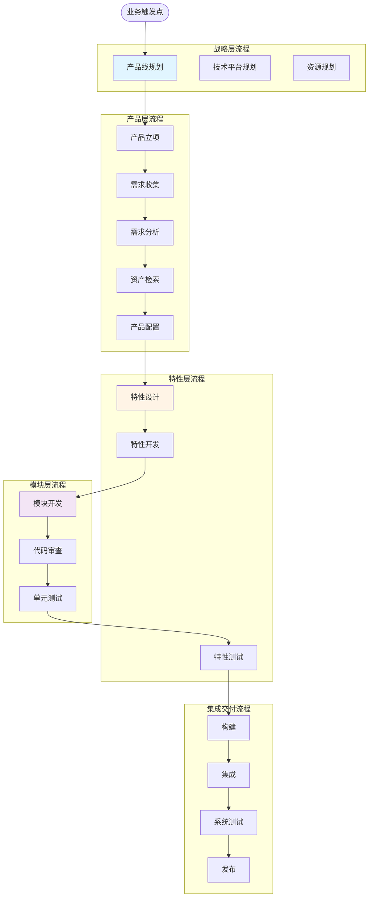

# Auto DevOps平台 - 业务架构设计

> **文档版本**: v1.0  
> **创建日期**: 2025-01-02  
> **目标**: 定义平台的业务架构、价值主张和业务能力地图

---

## 📋 目录

1. [业务愿景与目标](#一业务愿景与目标)
2. [价值主张](#二价值主张)
3. [业务能力模型](#三业务能力模型)
4. [角色与干系人](#四角色与干系人)
5. [业务场景](#五业务场景)
6. [业务流程架构](#六业务流程架构)
7. [业务指标体系](#七业务指标体系)

---

## 一、业务愿景与目标

### 1.1 业务愿景

**成为汽车行业领先的智能研发协同平台，支撑领域产品的高效开发与资产复用**

```
核心理念:
├─ 资产优先: 一切皆资产，最大化复用价值
├─ 需求驱动: 从用户需求到代码实现的全链路追溯
├─ 协同高效: 多角色无缝协作，打破信息壁垒
└─ 持续改进: 基于数据的持续优化和智能决策
```

### 1.2 业务目标

#### 短期目标（6个月）
- ✅ 实现三层资产体系的基础管理能力
- ✅ 建立需求到代码的双向追溯
- ✅ 支撑3-5个领域产品的并行开发
- ✅ 资产复用率达到40%

#### 中期目标（12个月）
- 🎯 覆盖研发全流程的DevOps能力
- 🎯 支撑10+个领域产品
- 🎯 资产复用率达到60%
- 🎯 交付周期缩短50%

#### 长期目标（18个月）
- 🚀 构建完整的数字化研发生态
- 🚀 资产复用率达到80%
- 🚀 实现智能化需求分解和资产推荐
- 🚀 成为行业标杆平台

### 1.3 业务边界

```
┌─────────────────────────────────────────────────────┐
│                  上游边界                            │
│  ├─ 整车产品管理（不在范围）                        │
│  ├─ 整车需求管理（不在范围）                        │
│  └─ 接收：整车需求、技术需求、干系人需求           │
└─────────────────────────────────────────────────────┘
                        ↓
┌─────────────────────────────────────────────────────┐
│            Auto DevOps平台（核心范围）               │
│  ├─ 领域产品线管理                                  │
│  ├─ 领域产品开发与交付                              │
│  ├─ 资产管理与复用                                  │
│  ├─ 需求管理与追溯                                  │
│  ├─ 研发过程管理                                    │
│  └─ 多角色协同                                      │
└─────────────────────────────────────────────────────┘
                        ↓
┌─────────────────────────────────────────────────────┐
│                  下游边界                            │
│  ├─ 整车集成（不在范围）                            │
│  ├─ 整车测试（不在范围）                            │
│  └─ 交付：领域产品包、文档、测试报告               │
└─────────────────────────────────────────────────────┘
```

---

## 二、价值主张

### 2.1 核心价值主张

#### 对企业的价值
```
降本增效
├─ 资产复用率提升60% → 减少重复开发
├─ 交付周期缩短50% → 加快上市时间
├─ 开发成本降低40% → 提高投入产出比
└─ 质量问题减少40% → 降低返工成本
```

#### 对研发团队的价值
```
提效赋能
├─ 需求清晰：100%可追溯的需求链路
├─ 协同顺畅：打破角色壁垒，信息透明
├─ 资产共享：随时查找和复用已有资产
└─ 自动化：CI/CD全流程自动化
```

#### 对管理者的价值
```
可视可控
├─ 实时进度：项目状态一目了然
├─ 数据决策：基于数据的资源分配
├─ 风险预警：提前识别潜在风险
└─ 效能分析：多维度的效能度量
```

### 2.2 差异化竞争优势

| 维度 | 传统平台 | Auto DevOps平台 |
|------|---------|----------------|
| **资产管理** | 代码级复用 | 产品/特性/模块三层资产 |
| **需求管理** | 需求管理工具 | 需求-资产双向追溯 |
| **协同方式** | 工具割裂 | 统一平台多角色协同 |
| **复用机制** | 手工查找 | 智能推荐+变体配置 |
| **数据驱动** | 报表统计 | 全链路数据+AI预测 |
| **行业适配** | 通用平台 | 深度适配汽车研发 |

---

## 三、业务能力模型

### 3.1 核心业务能力



### 3.2 业务能力地图

#### L1: 战略规划能力
```
产品线规划
├─ 领域划分: 定义技术领域边界
├─ 产品组合: 规划产品组合策略
├─ 技术路线: 制定技术演进路线
├─ 资源规划: 团队与预算分配
└─ 复用策略: 制定资产复用策略

平台规划
├─ 硬件平台: 选型与定义
├─ 软件平台: 架构设计
└─ 技术演进: 平台升级路线
```

#### L2: 资产管理能力
```
资产全生命周期管理
├─ 创建阶段
│  ├─ 资产定义: 元数据定义
│  ├─ 分类编目: 资产分类体系
│  └─ 基线建立: 初始版本基线
│
├─ 使用阶段
│  ├─ 资产检索: 多维度搜索
│  ├─ 资产评估: 适配度评估
│  ├─ 资产配置: 变体配置
│  └─ 资产集成: 集成到产品
│
├─ 演进阶段
│  ├─ 版本管理: 版本控制
│  ├─ 变更管理: 变更追踪
│  └─ 优化重构: 持续改进
│
└─ 退役阶段
   ├─ 废弃标记: 标记为废弃
   └─ 历史归档: 归档保存
```

#### L3: 需求管理能力
```
三层需求管理
├─ R1: 用户需求层
│  ├─ 需求收集: 从上游接入
│  ├─ 需求分析: 价值评估
│  ├─ 需求评审: 多方评审
│  └─ 需求分解: 分解为特性需求
│
├─ R2: 特性需求层
│  ├─ 特性定义: 功能规格
│  ├─ 技术方案: 技术设计
│  ├─ 工作量估算: 评估工作量
│  └─ 需求分配: 分配到模块
│
└─ R3: 模块需求层
   ├─ 任务拆解: 拆解开发任务
   ├─ 任务分配: 分配给开发者
   ├─ 开发跟踪: 跟踪开发进度
   └─ 需求验证: 测试验证
```

#### L4: 研发协同能力
```
多角色协同
├─ 产品经理工作台
│  ├─ 产品规划: 路线图规划
│  ├─ 需求管理: 需求管理
│  ├─ 特性配置: 产品配置
│  └─ 发布管理: 发布计划
│
├─ 系统工程师工作台
│  ├─ 架构设计: 系统架构
│  ├─ 需求分解: 需求分析
│  ├─ 技术评审: 技术方案
│  └─ 集成验证: 系统集成
│
├─ 特性负责人工作台
│  ├─ 特性设计: 详细设计
│  ├─ 任务管理: 任务跟踪
│  ├─ 代码审查: Code Review
│  └─ 特性测试: 特性验证
│
├─ 开发工程师工作台
│  ├─ 任务领取: 认领任务
│  ├─ 代码开发: 编码实现
│  ├─ 单元测试: 自测
│  └─ 代码提交: 提交审查
│
├─ 测试工程师工作台
│  ├─ 测试计划: 测试策略
│  ├─ 用例设计: 测试用例
│  ├─ 测试执行: 执行测试
│  └─ 缺陷管理: Bug跟踪
│
└─ DevOps工程师工作台
   ├─ 流水线配置: CI/CD
   ├─ 环境管理: 环境配置
   ├─ 发布管理: 发布执行
   └─ 监控运维: 监控告警
```

#### L5: 过程管理能力
```
DevOps全流程
├─ 配置管理
│  ├─ 版本控制: Git管理
│  ├─ 分支管理: 分支策略
│  ├─ 基线管理: 基线控制
│  └─ 变更管理: 变更控制
│
├─ 构建管理
│  ├─ 构建配置: 构建脚本
│  ├─ 自动构建: 自动触发
│  ├─ 依赖管理: 依赖解析
│  └─ 制品管理: 制品存储
│
├─ 测试管理
│  ├─ 单元测试: 单测执行
│  ├─ 集成测试: 集成验证
│  ├─ 系统测试: 系统验证
│  └─ 自动化测试: 测试自动化
│
├─ 质量管理
│  ├─ 代码质量: 静态分析
│  ├─ 测试覆盖: 覆盖率统计
│  ├─ 安全扫描: 漏洞扫描
│  └─ 性能测试: 性能分析
│
└─ 发布管理
   ├─ 发布计划: 发布排期
   ├─ 发布审批: 发布评审
   ├─ 部署执行: 自动部署
   └─ 监控验证: 发布监控
```

#### L6: 数据分析能力
```
数据驱动决策
├─ 效能分析
│  ├─ 研发效能: 开发效率
│  ├─ 交付效能: 交付速度
│  └─ 团队效能: 团队产出
│
├─ 质量分析
│  ├─ 代码质量: 质量趋势
│  ├─ 缺陷分析: Bug分析
│  └─ 测试质量: 测试效果
│
├─ 复用分析
│  ├─ 资产复用率: 复用统计
│  ├─ 复用收益: 成本节省
│  └─ 复用热力图: 复用分布
│
└─ 预测分析
   ├─ 风险预测: 风险识别
   ├─ 质量预测: 质量趋势
   └─ 资源预测: 资源需求
```

---

## 四、角色与干系人

### 4.1 核心角色定义

#### 战略层角色

**领域架构师 (Domain Architect)**
```yaml
职责:
  - 定义领域边界和产品线架构
  - 制定技术平台演进路线
  - 评审重大技术决策
  - 推动资产复用策略

日常工作:
  - 评审系统架构设计
  - 参与技术选型决策
  - 指导团队技术方向
  - 跟踪技术债务

关键产出:
  - 技术架构文档
  - 技术标准和规范
  - 技术演进路线图
  - 架构评审报告

使用功能:
  - 产品线架构设计
  - 技术平台管理
  - 架构评审工具
  - 技术债务跟踪
```

**产品线经理 (Product Line Manager)**
```yaml
职责:
  - 产品线业务规划
  - 产品组合管理
  - 资源协调
  - 成本收益分析

日常工作:
  - 制定产品线路线图
  - 评审产品立项
  - 协调跨产品资源
  - 分析产品线效益

关键产出:
  - 产品线规划文档
  - 产品路线图
  - 资源分配方案
  - 效益分析报告

使用功能:
  - 产品线规划
  - 资源管理
  - 效益分析
  - 复用分析
```

#### 产品层角色

**领域产品经理 (Domain Product Manager)**
```yaml
职责:
  - 领域产品规划和定义
  - 用户需求管理
  - 产品特性配置
  - 产品发布管理

日常工作:
  - 收集和分析需求
  - 定义产品特性
  - 配置产品方案
  - 跟踪产品进度
  - 组织产品评审

关键产出:
  - 产品需求文档
  - 产品配置方案
  - 产品发布计划
  - 产品演示

使用功能:
  - 用户需求管理
  - 产品配置工具
  - 进度跟踪看板
  - 发布管理
```

**系统工程师 (System Engineer)**
```yaml
职责:
  - 用户需求分析
  - 系统架构设计
  - 特性需求分解
  - 系统集成验证

日常工作:
  - 分析用户需求
  - 设计系统方案
  - 分解特性需求
  - 评审技术方案
  - 系统集成测试

关键产出:
  - 系统设计文档
  - 需求分解文档
  - 技术方案
  - 集成测试报告

使用功能:
  - 需求分解工具
  - 架构设计工具
  - 追溯管理
  - 集成测试管理
```

#### 特性层角色

**特性负责人 (Feature Owner)**
```yaml
职责:
  - 特性设计和实现
  - 特性团队管理
  - 特性质量保证
  - 特性交付

日常工作:
  - 设计特性方案
  - 分配开发任务
  - 代码审查
  - 跟踪特性进度
  - 组织特性测试

关键产出:
  - 特性设计文档
  - 任务分配
  - 代码审查意见
  - 特性测试报告

使用功能:
  - 特性设计工具
  - 任务管理
  - 代码审查工具
  - 特性测试管理
```

**算法工程师 (Algorithm Engineer)**
```yaml
职责:
  - 算法设计和优化
  - 算法资产开发
  - 算法性能调优
  - 算法文档编写

日常工作:
  - 研究算法方案
  - 开发算法代码
  - 调优算法性能
  - 编写算法文档
  - 评审算法方案

关键产出:
  - 算法设计文档
  - 算法代码
  - 性能测试报告
  - 算法资产

使用功能:
  - 算法资产管理
  - 实验管理
  - 性能分析
  - 模型管理
```

#### 模块层角色

**软件工程师 (Software Engineer)**
```yaml
职责:
  - 模块设计和开发
  - 代码实现
  - 单元测试
  - 代码审查

日常工作:
  - 领取开发任务
  - 编写代码
  - 执行单元测试
  - 提交代码审查
  - 修复缺陷

关键产出:
  - 代码实现
  - 单元测试
  - 代码提交
  - 技术文档

使用功能:
  - 任务管理
  - 代码管理
  - 构建测试
  - 缺陷跟踪
```

**测试工程师 (Test Engineer)**
```yaml
职责:
  - 测试策略制定
  - 测试用例设计
  - 测试执行
  - 缺陷管理

日常工作:
  - 设计测试用例
  - 执行测试
  - 提交缺陷
  - 跟踪缺陷修复
  - 编写测试报告

关键产出:
  - 测试计划
  - 测试用例
  - 缺陷报告
  - 测试报告

使用功能:
  - 测试用例管理
  - 测试执行
  - 缺陷管理
  - 测试报告
```

#### 支撑角色

**DevOps工程师 (DevOps Engineer)**
```yaml
职责:
  - CI/CD流水线配置
  - 环境管理
  - 发布管理
  - 监控运维

日常工作:
  - 配置流水线
  - 管理环境
  - 执行发布
  - 监控系统
  - 处理告警

关键产出:
  - 流水线配置
  - 发布记录
  - 监控报告
  - 运维文档

使用功能:
  - 流水线管理
  - 环境管理
  - 发布管理
  - 监控告警
```

**质量工程师 (Quality Engineer)**
```yaml
职责:
  - 质量度量
  - 质量分析
  - 质量改进
  - 质量审计

日常工作:
  - 采集质量数据
  - 分析质量趋势
  - 识别质量问题
  - 推动质量改进
  - 执行质量审计

关键产出:
  - 质量报告
  - 改进建议
  - 审计报告
  - 质量看板

使用功能:
  - 质量度量
  - 质量分析
  - 问题跟踪
  - 报表生成
```

### 4.2 角色协作关系



---

## 五、业务场景

### 5.1 核心业务场景

#### 场景1: 新产品立项与开发

**场景描述**: 理想汽车计划为L7车型开发NOA智能驾驶功能

**参与角色**:
- 产品线经理: 审批立项
- 领域产品经理: 产品规划
- 系统工程师: 技术方案
- 特性负责人: 特性实现
- 开发团队: 代码开发

**业务流程**:
```
1. 产品立项阶段
   ├─ 产品经理: 创建产品立项申请
   ├─ 产品线经理: 评审并批准
   └─ 系统工程师: 分析技术可行性

2. 需求分析阶段
   ├─ 产品经理: 录入用户需求
   ├─ 系统工程师: 分解为特性需求
   └─ 特性负责人: 细化为模块需求

3. 资产复用阶段
   ├─ 系统工程师: 搜索可复用资产
   ├─ 评估: 发现可复用L9 NOA资产
   └─ 配置: 创建L7适配变体

4. 开发实现阶段
   ├─ 特性负责人: 分配开发任务
   ├─ 开发工程师: 编码实现
   ├─ 测试工程师: 测试验证
   └─ DevOps: 构建发布

5. 交付阶段
   ├─ 系统工程师: 系统集成
   ├─ 测试工程师: 系统测试
   ├─ 产品经理: 验收确认
   └─ DevOps: 正式发布
```

**关键价值**:
- 资产复用: 70%代码复用
- 周期缩短: 6个月 → 2个月
- 成本节省: 节省50%开发成本

#### 场景2: 跨产品特性共享

**场景描述**: 泊车产品需要复用NOA的融合感知特性

**参与角色**:
- 特性负责人: 评估复用可行性
- 算法工程师: 算法适配
- 开发工程师: 代码集成

**业务流程**:
```
1. 需求阶段
   └─ 泊车产品经理: 提出融合感知需求

2. 资产检索阶段
   ├─ 搜索: 在资产库搜索"融合感知"
   └─ 发现: 找到NOA融合感知特性

3. 适配评估阶段
   ├─ 特性负责人: 评估适配性
   ├─ 算法工程师: 评估算法适配
   └─ 决策: 创建泊车变体

4. 适配开发阶段
   ├─ 算法工程师: 适配泊车传感器
   ├─ 开发工程师: 调整参数
   └─ 测试工程师: 验证测试

5. 集成交付阶段
   ├─ 集成到泊车产品
   └─ 更新复用指标
```

**关键价值**:
- 算法复用: 100%核心算法复用
- 开发周期: 6个月 → 2个月
- 质量提升: 复用成熟算法

#### 场景3: 法规需求影响分析

**场景描述**: 新法规要求所有L2+系统增加驾驶员监控(DMS)

**参与角色**:
- 产品经理: 创建需求
- 系统工程师: 影响分析
- 多个特性负责人: 并行开发

**业务流程**:
```
1. 需求输入阶段
   └─ 产品经理: 创建法规需求

2. 影响分析阶段
   ├─ 系统工程师: 触发影响分析
   ├─ 系统自动分析:
   │  ├─ 查询受影响产品: NOA, LCC, APA
   │  ├─ 查询受影响车型: L9, L8, L7
   │  └─ 估算工作量: 80人天
   └─ 生成影响分析报告

3. 决策阶段
   ├─ 产品线经理: 评审报告
   └─ 决定: 批准需求

4. 需求分解阶段
   ├─ 系统工程师: 分解为DMS特性
   └─ 分配到各产品

5. 并行开发阶段
   ├─ NOA团队: 开发DMS特性
   ├─ LCC团队: 开发DMS特性
   └─ APA团队: 开发DMS特性

6. 统一集成阶段
   ├─ 系统工程师: 统一集成
   └─ 测试工程师: 统一测试

7. 同步发布阶段
   └─ 发布所有产品新版本
```

**关键价值**:
- 分析速度: 2周 → 1天
- 准确性: 100%识别受影响产品
- 协同效率: 避免重复工作

---

## 六、业务流程架构

### 6.1 端到端业务流程全景



### 6.2 关键子流程

详见下一个文档...

---

## 七、业务指标体系

### 7.1 核心业务指标(KPI)

#### 效率指标
```yaml
资产复用率:
  定义: 复用资产占总资产的比例
  目标: 60% (6个月), 80% (18个月)
  计算: 复用资产数 / 总资产数 × 100%

交付周期:
  定义: 从需求到发布的平均时间
  目标: 缩短50%
  计算: 平均(发布日期 - 需求创建日期)

开发效率:
  定义: 单位时间的代码产出
  目标: 提升40%
  计算: 代码行数 / 开发人天
```

#### 质量指标
```yaml
缺陷密度:
  定义: 每千行代码的缺陷数
  目标: < 2个/KLOC
  计算: 缺陷总数 / 代码总行数 × 1000

测试覆盖率:
  定义: 测试覆盖的代码比例
  目标: > 80%
  计算: 已测试代码行数 / 总代码行数 × 100%

需求追溯覆盖率:
  定义: 可追溯需求的比例
  目标: 100%
  计算: 可追溯需求数 / 总需求数 × 100%
```

#### 协同指标
```yaml
跨角色协作效率:
  定义: 角色间流转的平均时间
  目标: < 4小时
  计算: 平均(任务交接时间)

评审通过率:
  定义: 一次评审通过的比例
  目标: > 85%
  计算: 一次通过数 / 总评审数 × 100%
```

#### 成本指标
```yaml
开发成本:
  定义: 单位功能点的开发成本
  目标: 降低40%
  计算: 总开发成本 / 功能点数

维护成本:
  定义: 维护阶段的人力投入
  目标: < 20%总成本
  计算: 维护人天 / 总人天 × 100%
```

### 7.2 业务健康度指标

```yaml
平台活跃度:
  - 日活用户数
  - 月活用户数
  - 人均使用时长

业务成熟度:
  - 产品数量增长
  - 资产库丰富度
  - 流程规范化程度

用户满意度:
  - NPS评分
  - 满意度调研
  - 问题响应时间
```

---

**文档维护**:
- 负责人: 产品架构团队
- 更新频率: 季度更新
- 最后更新: 2025-01-02

