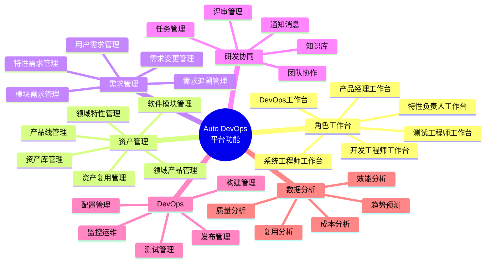
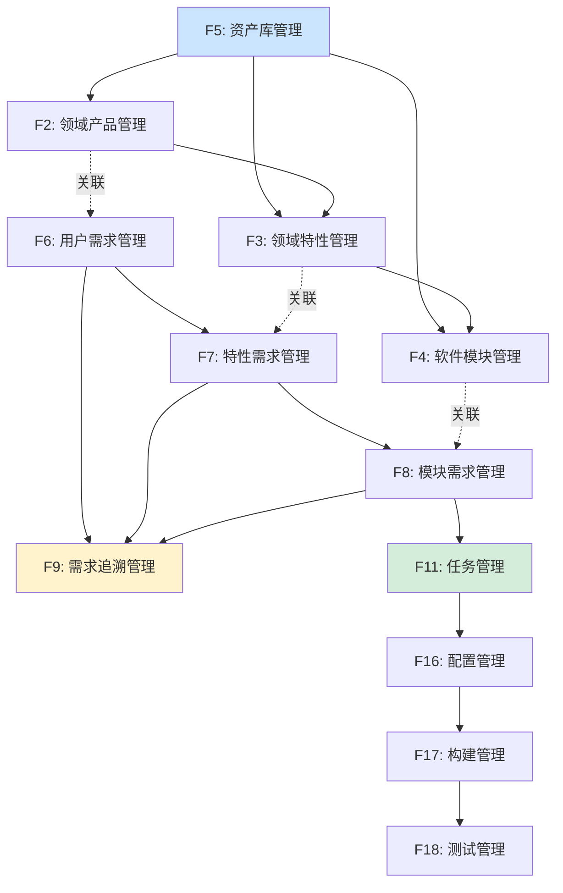

# Auto DevOps平台 - 全景功能架构

> **文档版本**: v1.0  
> **创建日期**: 2025-01-02  
> **基于**: 业务架构和平台架构设计

---

## 📋 目录

1. [功能架构全景](#一功能架构全景)
2. [核心功能域](#二核心功能域)
3. [功能模块清单](#三功能模块清单)
4. [功能优先级](#四功能优先级)
5. [功能依赖关系](#五功能依赖关系)

---

## 一、功能架构全景

### 1.1 四层功能架构

```
┌─────────────────────────────────────────────────────────────┐
│                    L1: 用户交互层                            │
│  ┌──────────────────────────────────────────────────────┐  │
│  │  角色工作台  │  协同看板  │  数据大屏  │  移动端    │  │
│  └──────────────────────────────────────────────────────┘  │
└─────────────────────────────────────────────────────────────┘
                        ↓
┌─────────────────────────────────────────────────────────────┐
│                    L2: 业务功能层                            │
│  ┌─────────────┬─────────────┬─────────────┬─────────────┐ │
│  │ 资产管理域  │  需求管理域  │  协同管理域  │  过程管理域 │ │
│  └─────────────┴─────────────┴─────────────┴─────────────┘ │
└─────────────────────────────────────────────────────────────┘
                        ↓
┌─────────────────────────────────────────────────────────────┐
│                    L3: 平台服务层                            │
│  ┌─────────────┬─────────────┬─────────────┬─────────────┐ │
│  │  工作流引擎  │  规则引擎   │  搜索引擎   │  分析引擎  │ │
│  │  消息中心   │  权限中心   │  文档中心   │  AI引擎    │ │
│  └─────────────┴─────────────┴─────────────┴─────────────┘ │
└─────────────────────────────────────────────────────────────┘
                        ↓
┌─────────────────────────────────────────────────────────────┐
│                    L4: 数据存储层                            │
│  ┌─────────────┬─────────────┬─────────────┬─────────────┐ │
│  │ 关系数据库  │  图数据库   │  时序数据库  │  对象存储  │ │
│  └─────────────┴─────────────┴─────────────┴─────────────┘ │
└─────────────────────────────────────────────────────────────┘
```

### 1.2 功能全景图



---

## 二、核心功能域

### 2.1 资产管理域

#### F1: 产品线管理

**功能描述**: 管理领域产品线的全生命周期

**核心能力**:
```yaml
产品线创建:
  - 定义产品线基本信息
  - 设置战略目标和核心能力
  - 规划产品组合
  - 分配资源和预算

产品线规划:
  - 制定技术路线图
  - 规划产品发布计划
  - 定义复用策略
  - 管理产品组合

产品线分析:
  - 复用率分析
  - 成本收益分析
  - 产品对比分析
  - 趋势预测

产品线演进:
  - 版本管理
  - 技术演进
  - 资产优化
  - 架构升级
```

#### F2: 领域产品管理

**功能描述**: 管理领域产品的规划、配置和交付

**核心能力**:
```yaml
产品创建:
  - 产品立项申请
  - 产品基本信息定义
  - 选择产品线和平台
  - 设置产品属性

产品配置:
  - 特性选择
    - 必选特性配置
    - 可选特性选择
    - 变体配置
  - 依赖检查
    - 自动依赖解析
    - 冲突检测
    - 约束验证
  - 配置生成
    - 生成BOM清单
    - 导出配置文件
    - 创建基线

产品开发跟踪:
  - 进度看板
  - 里程碑管理
  - 风险跟踪
  - 资源监控

产品发布:
  - 发布计划
  - 发布审批
  - 交付物管理
  - 应用跟踪
```

#### F3: 领域特性管理

**功能描述**: 管理可复用的领域特性

**核心能力**:
```yaml
特性定义:
  - 特性基本信息
  - 特性分类
  - 复杂度评估
  - 价值评分

特性设计:
  - 逻辑架构设计
  - 接口定义
  - 依赖管理
  - 变体点定义

特性开发:
  - 任务分解
  - 开发跟踪
  - 代码关联
  - 构建集成

特性复用:
  - 复用检索
  - 适配评估
  - 变体创建
  - 复用统计
```

#### F4: 软件模块管理

**功能描述**: 管理软件模块的开发和部署

**核心能力**:
```yaml
模块定义:
  - 模块基本信息
  - 职责定义
  - 技术栈选择
  - 部署目标

模块设计:
  - 接口设计
  - 组件划分
  - 依赖管理
  - 架构视图

模块开发:
  - 代码仓库关联
  - 分支管理
  - 构建配置
  - 质量监控

模块部署:
  - 部署配置
  - 环境管理
  - 版本管理
  - 运行监控
```

#### F5: 资产库管理

**功能描述**: 统一管理和检索所有资产

**核心能力**:
```yaml
资产编目:
  - 资产分类体系
  - 元数据管理
  - 标签管理
  - 资产索引

资产检索:
  - 全文搜索
  - 多维过滤
  - 相似度推荐
  - 智能推荐

资产评估:
  - 质量评分
  - 成熟度评估
  - 适配度分析
  - 对比分析

资产统计:
  - 资产清单
  - 复用统计
  - 热度分析
  - 趋势分析
```

### 2.2 需求管理域

#### F6: 用户需求管理

**功能描述**: 管理来自用户和干系人的需求

**核心能力**:
```yaml
需求录入:
  - 需求创建
  - 来源记录
  - 干系人管理
  - 附件上传

需求分析:
  - 需求评审
  - 价值评估
  - 优先级排序
  - 可行性分析

需求分解:
  - 自动分解建议
  - 手动分解
  - 分解规则配置
  - 分解验证

需求跟踪:
  - 状态跟踪
  - 进度跟踪
  - 变更历史
  - 验证记录
```

#### F7: 特性需求管理

**功能描述**: 管理特性级别的技术需求

**核心能力**:
```yaml
需求定义:
  - 功能规格
  - 非功能需求
  - 验收标准
  - 测试策略

需求设计:
  - 技术方案
  - 接口设计
  - 数据模型
  - 时序图

需求分配:
  - 模块分配
  - 团队分配
  - 工作量估算
  - 排期规划

需求验证:
  - 测试用例关联
  - 测试执行
  - 结果记录
  - 验收确认
```

#### F8: 模块需求管理

**功能描述**: 管理模块级别的实现需求

**核心能力**:
```yaml
需求拆解:
  - 任务拆解
  - Story拆分
  - AC定义
  - DoD定义

任务管理:
  - 任务分配
  - 状态跟踪
  - 进度更新
  - 工时记录

实现跟踪:
  - 代码关联
  - 提交跟踪
  - 构建关联
  - 测试关联

需求验收:
  - 单元测试
  - 集成测试
  - 验收测试
  - 文档完善
```

#### F9: 需求追溯管理

**功能描述**: 建立和维护需求的追溯关系

**核心能力**:
```yaml
追溯链管理:
  - 自动建立追溯链
  - 手动维护追溯
  - 追溯关系验证
  - 追溯链可视化

追溯查询:
  - 正向追溯（需求→代码）
  - 反向追溯（代码→需求）
  - 横向追溯（需求←→测试）
  - 影响分析

覆盖率分析:
  - 需求覆盖率
  - 测试覆盖率
  - 代码覆盖率
  - 差距分析

追溯报告:
  - 追溯矩阵
  - 覆盖率报告
  - 孤儿项报告
  - 合规报告
```

#### F10: 需求变更管理

**功能描述**: 管理需求的变更全流程

**核心能力**:
```yaml
变更申请:
  - 变更请求创建
  - 变更理由说明
  - 影响范围预估
  - 优先级评定

变更评审:
  - 技术评审
  - 影响分析
  - 工作量评估
  - 风险评估

变更审批:
  - 审批流程配置
  - 多级审批
  - 审批记录
  - 通知提醒

变更实施:
  - 变更计划
  - 实施跟踪
  - 验证确认
  - 变更关闭
```

### 2.3 研发协同域

#### F11: 任务管理

**功能描述**: 管理研发任务的全生命周期

**核心能力**:
```yaml
任务创建:
  - 快速创建
  - 模板创建
  - 批量创建
  - 从需求创建

任务分配:
  - 手动分配
  - 智能推荐
  - 负载均衡
  - 技能匹配

任务跟踪:
  - 看板视图
  - 列表视图
  - 甘特图
  - 燃尽图

任务协作:
  - 任务讨论
  - 附件共享
  - @提醒
  - 关联任务
```

#### F12: 评审管理

**功能描述**: 管理各类评审活动

**核心能力**:
```yaml
评审类型:
  - 需求评审
  - 设计评审
  - 代码评审
  - 测试评审

评审发起:
  - 评审申请
  - 评审人选择
  - 评审材料准备
  - 会议预约

评审执行:
  - 评审checklist
  - 问题记录
  - 评审意见
  - 评审决议

评审跟踪:
  - 问题跟踪
  - 整改验证
  - 评审报告
  - 评审统计
```

#### F13: 协同看板

**功能描述**: 可视化团队协作状态

**核心能力**:
```yaml
看板类型:
  - 需求看板
  - 任务看板
  - 缺陷看板
  - 发布看板

看板配置:
  - 泳道配置
  - 列配置
  - 卡片配置
  - 规则配置

看板操作:
  - 拖拽更新
  - 快速编辑
  - 批量操作
  - 过滤排序

看板分析:
  - 流动效率
  - 瓶颈分析
  - WIP限制
  - 周期时间
```

#### F14: 通知消息

**功能描述**: 及时通知和消息推送

**核心能力**:
```yaml
消息类型:
  - 任务通知
  - 评审通知
  - 审批通知
  - 系统通知

推送渠道:
  - 站内消息
  - 邮件
  - 企业微信
  - 钉钉

消息管理:
  - 消息中心
  - 未读提醒
  - 消息过滤
  - 历史查询

订阅设置:
  - 订阅管理
  - 通知偏好
  - 免打扰
  - 消息模板
```

#### F15: 知识库

**功能描述**: 团队知识沉淀和共享

**核心能力**:
```yaml
文档管理:
  - 文档创建
  - 目录组织
  - 版本管理
  - 权限控制

文档编辑:
  - Markdown编辑器
  - 富文本编辑器
  - 在线协作
  - 评论批注

文档检索:
  - 全文搜索
  - 标签搜索
  - 分类浏览
  - 最近访问

知识图谱:
  - 文档关联
  - 知识地图
  - 推荐阅读
  - 知识沉淀
```

### 2.4 过程管理域

#### F16: 配置管理

**功能描述**: 管理代码和配置的版本控制

**核心能力**:
```yaml
版本控制:
  - Git集成
  - 仓库管理
  - 分支管理
  - 标签管理

分支策略:
  - 分支模型配置
  - 分支保护
  - 合并策略
  - 冲突解决

基线管理:
  - 基线创建
  - 基线冻结
  - 基线对比
  - 基线回溯

变更控制:
  - 变更申请
  - 变更评审
  - 变更追踪
  - 变更审计
```

#### F17: 构建管理

**功能描述**: 管理代码构建和制品生成

**核心能力**:
```yaml
构建配置:
  - Pipeline定义
  - 构建参数配置
  - 环境变量
  - 依赖配置

构建执行:
  - 自动触发
  - 手动触发
  - 定时构建
  - 并行构建

构建监控:
  - 构建状态
  - 构建日志
  - 构建时长
  - 构建趋势

制品管理:
  - 制品存储
  - 制品版本
  - 制品下载
  - 制品清理
```

#### F18: 测试管理

**功能描述**: 管理测试活动全流程

**核心能力**:
```yaml
测试计划:
  - 计划创建
  - 测试策略
  - 资源分配
  - 进度规划

用例管理:
  - 用例设计
  - 用例评审
  - 用例维护
  - 用例执行

测试执行:
  - 手工测试
  - 自动化测试
  - 性能测试
  - 兼容性测试

缺陷管理:
  - 缺陷提交
  - 缺陷分配
  - 缺陷跟踪
  - 缺陷分析
```

#### F19: 发布管理

**功能描述**: 管理软件发布全流程

**核心能力**:
```yaml
发布计划:
  - 发布排期
  - 发布范围
  - 发布checklist
  - 回滚预案

发布审批:
  - 审批流程
  - 审批记录
  - 审批通知
  - 决策记录

发布执行:
  - 部署执行
  - 灰度发布
  - 蓝绿部署
  - 金丝雀发布

发布监控:
  - 发布状态
  - 监控指标
  - 告警处理
  - 回滚执行
```

#### F20: 监控运维

**功能描述**: 监控系统运行状态

**核心能力**:
```yaml
系统监控:
  - 服务监控
  - 资源监控
  - 性能监控
  - 日志监控

告警管理:
  - 告警规则
  - 告警通知
  - 告警处理
  - 告警统计

运维操作:
  - 环境管理
  - 配置更新
  - 数据备份
  - 故障恢复
```

### 2.5 数据分析域

#### F21: 效能分析

**功能描述**: 分析研发效能指标

**核心能力**:
```yaml
研发效能:
  - 速度指标
  - 质量指标
  - 效率指标
  - 对比分析

交付效能:
  - Lead Time
  - Cycle Time
  - 部署频率
  - 变更失败率

团队效能:
  - 团队产出
  - 团队速度
  - 团队负载
  - 团队健康度
```

#### F22: 质量分析

**功能描述**: 分析质量相关指标

**核心能力**:
```yaml
代码质量:
  - 代码规范
  - 复杂度
  - 重复度
  - 技术债务

测试质量:
  - 覆盖率
  - 缺陷率
  - 缺陷密度
  - 测试有效性

产品质量:
  - 线上缺陷
  - 用户反馈
  - 性能指标
  - 稳定性
```

#### F23: 复用分析

**功能描述**: 分析资产复用情况

**核心能力**:
```yaml
复用统计:
  - 资产复用率
  - 代码复用率
  - 复用次数
  - 复用趋势

复用收益:
  - 时间节省
  - 成本节省
  - 质量提升
  - ROI分析

复用热力图:
  - 热门资产
  - 冷门资产
  - 复用网络
  - 复用路径
```

#### F24: 趋势预测

**功能描述**: 基于数据的趋势预测

**核心能力**:
```yaml
质量预测:
  - 缺陷预测
  - 质量趋势
  - 风险预警
  - 建议措施

进度预测:
  - 完成时间预测
  - 资源需求预测
  - 风险识别
  - 应对建议

成本预测:
  - 成本趋势
  - 超支预警
  - 成本优化建议
```

---

## 三、功能模块清单

### 3.1 按优先级分类

#### P0 - 核心必备功能
```
F1  - 产品线管理
F2  - 领域产品管理
F3  - 领域特性管理
F4  - 软件模块管理
F5  - 资产库管理
F6  - 用户需求管理
F7  - 特性需求管理
F8  - 模块需求管理
F9  - 需求追溯管理
F11 - 任务管理
F16 - 配置管理
F17 - 构建管理
F18 - 测试管理
```

#### P1 - 重要支撑功能
```
F10 - 需求变更管理
F12 - 评审管理
F13 - 协同看板
F14 - 通知消息
F19 - 发布管理
F21 - 效能分析
F22 - 质量分析
F23 - 复用分析
```

#### P2 - 增强功能
```
F15 - 知识库
F20 - 监控运维
F24 - 趋势预测
```

---

## 四、功能优先级

### 4.1 MVP功能范围（Phase 1: 0-6个月）

```yaml
目标: 建立核心资产管理和需求追溯能力

核心功能:
  资产管理:
    - F2: 领域产品管理 (基础版)
    - F3: 领域特性管理 (基础版)
    - F4: 软件模块管理 (基础版)
    - F5: 资产库管理 (检索+基础编目)
  
  需求管理:
    - F6: 用户需求管理 (CRUD+基础分解)
    - F7: 特性需求管理 (CRUD+分配)
    - F8: 模块需求管理 (CRUD+任务关联)
    - F9: 需求追溯管理 (基础追溯链)
  
  协同:
    - F11: 任务管理 (基础看板)
    - F14: 通知消息 (站内消息)
  
  DevOps:
    - F16: 配置管理 (Git集成)
    - F17: 构建管理 (基础Pipeline)

预期价值:
  - 支撑3个领域产品开发
  - 需求100%可追溯
  - 资产复用率达到40%
```

### 4.2 迭代增强（Phase 2: 6-12个月）

```yaml
目标: 完善协同和DevOps能力

增强功能:
  资产管理:
    - F1: 产品线管理
    - F5: 资产库管理 (智能推荐)
  
  需求管理:
    - F10: 需求变更管理
  
  协同:
    - F12: 评审管理
    - F13: 协同看板 (多种看板)
  
  DevOps:
    - F18: 测试管理 (自动化测试)
    - F19: 发布管理 (自动发布)
  
  数据分析:
    - F21: 效能分析
    - F22: 质量分析
    - F23: 复用分析

预期价值:
  - 支撑10+个领域产品
  - 资产复用率达到60%
  - 交付周期缩短50%
```

### 4.3 生态完善（Phase 3: 12-18个月）

```yaml
目标: 构建完整数字化研发生态

完善功能:
  协同:
    - F15: 知识库
  
  DevOps:
    - F20: 监控运维
  
  数据分析:
    - F24: 趋势预测 (AI驱动)

预期价值:
  - 资产复用率达到80%
  - 智能化推荐和预测
  - 成为行业标杆
```

---

## 五、功能依赖关系

### 5.1 功能依赖图



### 5.2 模块间依赖说明

```yaml
强依赖 (必须先实现):
  F2 依赖 F5: 产品管理需要资产库支撑
  F3 依赖 F5: 特性管理需要资产库支撑
  F7 依赖 F6: 特性需求从用户需求分解而来
  F8 依赖 F7: 模块需求从特性需求分解而来
  F17 依赖 F16: 构建需要配置管理支撑

弱依赖 (可以后补):
  F9 依赖 F6/F7/F8: 追溯需要需求数据
  F11 依赖 F8: 任务从模块需求产生
  F23 依赖 F5: 复用分析需要资产数据

关联关系 (双向关联):
  F2 ←→ F6: 产品和用户需求相互关联
  F3 ←→ F7: 特性和特性需求相互关联
  F4 ←→ F8: 模块和模块需求相互关联
```

---

**文档维护**:
- 负责人: 产品架构团队
- 更新频率: 月度更新
- 最后更新: 2025-01-02

