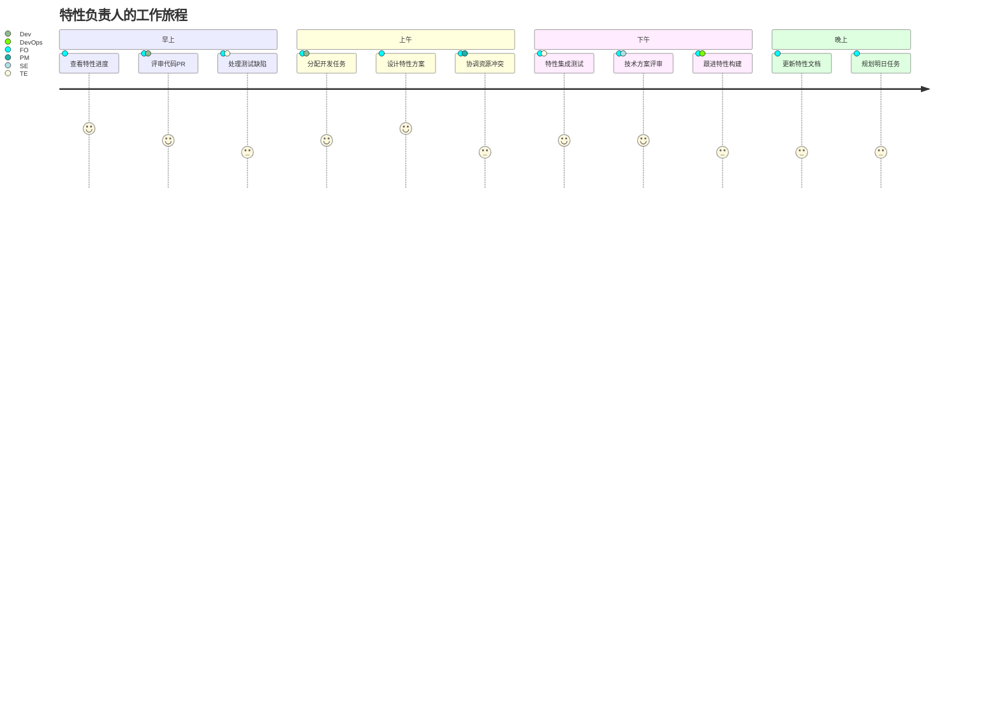
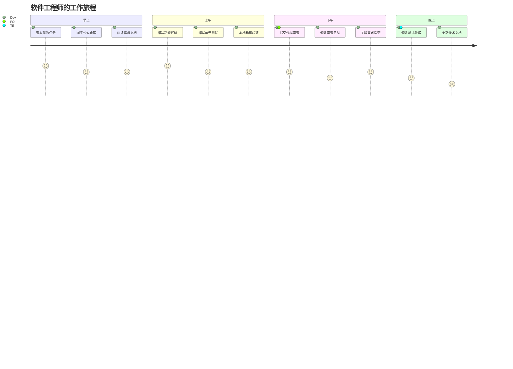
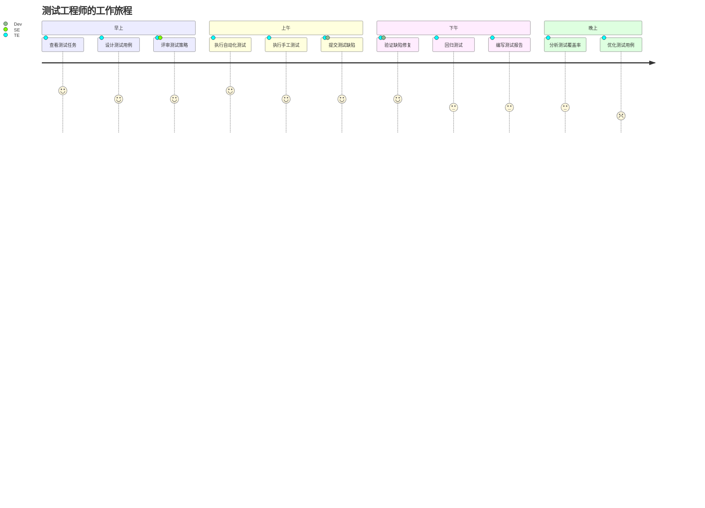

# Auto DevOps平台 - 用户故事地图

> **文档版本**: v1.0  
> **创建日期**: 2025-01-02  
> **目标**: 从用户视角梳理平台功能的用户故事

---

## 📋 目录

1. [用户故事地图概述](#一用户故事地图概述)
2. [按角色的用户旅程](#二按角色的用户旅程)
3. [用户故事地图](#三用户故事地图)
4. [故事优先级](#四故事优先级)

---

## 一、用户故事地图概述

### 1.1 什么是用户故事地图

用户故事地图是一种可视化工具，帮助团队：
- 从用户视角理解产品功能
- 识别用户工作流程
- 按优先级组织用户故事
- 规划迭代和发布

### 1.2 地图结构

```
用户活动 (User Activities)        ← 用户的主要工作流程
     ↓
用户任务 (User Tasks)             ← 完成活动的具体任务
     ↓
用户故事 (User Stories)           ← 实现任务的功能故事
     ↓
按优先级分层 (Walking Skeleton)    ← MVP → V1.0 → V2.0
```

---

## 二、按角色的用户旅程

### 2.1 领域产品经理的一天


**关键痛点**:
- 😫 需求来自多个渠道，难以统一管理
- 😫 不知道哪些资产可复用
- 😫 产品配置复杂，容易出错
- 😫 无法实时掌握产品进度

**期望价值**:
- ✅ 统一的需求管理入口
- ✅ 智能推荐可复用资产
- ✅ 可视化的产品配置工具
- ✅ 实时的进度跟踪看板

### 2.2 系统工程师的一天


**关键痛点**:
- 😫 需求分解缺乏工具支撑
- 😫 追溯关系手工维护，容易遗漏
- 😫 影响分析耗时费力
- 😫 技术方案难以可视化

**期望价值**:
- ✅ 自动化需求分解建议
- ✅ 自动建立追溯关系
- ✅ 一键影响分析
- ✅ 可视化架构设计工具

### 2.3 特性负责人的一天



**关键痛点**:
- 😫 团队协作工具割裂
- 😫 任务状态难以同步
- 😫 代码审查流程繁琐
- 😫 特性依赖不清晰

**期望价值**:
- ✅ 统一的协作平台
- ✅ 实时的任务看板
- ✅ 集成的代码审查
- ✅ 清晰的依赖管理

### 2.4 软件工程师的一天



**关键痛点**:
- 😫 不清楚需求的上下文
- 😫 构建环境配置复杂
- 😫 不知道改动的影响范围
- 😫 提交代码后缺乏反馈

**期望价值**:
- ✅ 完整的需求追溯链
- ✅ 一键构建环境
- ✅ 自动影响分析
- ✅ 实时构建反馈

### 2.5 测试工程师的一天



**关键痛点**:
- 😫 测试用例与需求脱节
- 😫 缺陷跟踪流程繁琐
- 😫 测试环境不稳定
- 😫 测试数据难以准备

**期望价值**:
- ✅ 用例与需求自动关联
- ✅ 便捷的缺陷管理
- ✅ 稳定的测试环境
- ✅ 测试数据管理

---

## 三、用户故事地图

### 3.1 核心用户活动

```
┌────────────────────────────────────────────────────────────────────┐
│                          用户活动层                                 │
└────────────────────────────────────────────────────────────────────┘

   规划产品 → 分析需求 → 设计方案 → 开发实现 → 测试验证 → 发布交付
```

### 3.2 完整用户故事地图

```
═══════════════════════════════════════════════════════════════════════
                           用户故事地图
═══════════════════════════════════════════════════════════════════════

活动1: 规划产品
├─ 任务1.1: 创建产品线
│  ├─ MVP: 作为领域架构师，我想创建产品线，以便规划领域范围
│  ├─ V1:  作为领域架构师，我想规划技术路线图，以便指导技术演进
│  └─ V2:  作为领域架构师，我想分析复用收益，以便优化复用策略
│
├─ 任务1.2: 创建领域产品
│  ├─ MVP: 作为产品经理，我想创建领域产品，以便启动产品开发
│  ├─ MVP: 作为产品经理，我想选择产品线和平台，以便复用资产
│  ├─ V1:  作为产品经理，我想配置产品特性，以便定制产品方案
│  └─ V1:  作为产品经理，我想看到特性依赖关系，以便避免配置错误
│
└─ 任务1.3: 规划产品路线图
   ├─ V1:  作为产品经理，我想规划版本路线图，以便管理发布节奏
   └─ V2:  作为产品经理，我想看到跨产品依赖，以便协调发布计划

───────────────────────────────────────────────────────────────────────

活动2: 分析需求
├─ 任务2.1: 收集用户需求
│  ├─ MVP: 作为产品经理，我想创建用户需求，以便记录需求信息
│  ├─ MVP: 作为产品经理，我想记录需求来源，以便追溯需求出处
│  └─ V1:  作为产品经理，我想导入外部需求，以便批量录入
│
├─ 任务2.2: 分析需求可行性
│  ├─ MVP: 作为系统工程师，我想查看需求详情，以便理解需求内容
│  ├─ MVP: 作为系统工程师，我想评估技术可行性，以便决策是否接受
│  └─ V1:  作为系统工程师，我想估算工作量，以便资源规划
│
├─ 任务2.3: 搜索可复用资产
│  ├─ MVP: 作为系统工程师，我想搜索资产库，以便查找可复用资产
│  ├─ MVP: 作为系统工程师，我想查看资产详情，以便评估是否适用
│  ├─ V1:  作为系统工程师，我想看到智能推荐，以便快速找到合适资产
│  └─ V2:  作为系统工程师，我想看到相似度评分，以便选择最佳资产
│
└─ 任务2.4: 分解用户需求
   ├─ MVP: 作为系统工程师，我想将用户需求分解为特性需求，以便分配开发
   ├─ V1:  作为系统工程师，我想看到分解建议，以便提高分解效率
   └─ V1:  作为系统工程师，我想验证分解完整性，以便确保需求不遗漏

───────────────────────────────────────────────────────────────────────

活动3: 设计方案
├─ 任务3.1: 设计特性方案
│  ├─ MVP: 作为特性负责人，我想查看特性需求，以便理解需求内容
│  ├─ MVP: 作为特性负责人，我想设计逻辑架构，以便规划技术方案
│  ├─ V1:  作为特性负责人，我想定义变体点，以便支持产品差异化
│  └─ V1:  作为特性负责人，我想管理特性依赖，以便协调开发顺序
│
├─ 任务3.2: 评审技术方案
│  ├─ MVP: 作为系统工程师，我想发起技术评审，以便验证方案合理性
│  ├─ V1:  作为系统工程师，我想记录评审意见，以便跟踪问题整改
│  └─ V1:  作为系统工程师，我想生成评审报告，以便归档留存
│
├─ 任务3.3: 分解特性需求
│  ├─ MVP: 作为特性负责人，我想将特性需求分解为模块需求，以便分配任务
│  ├─ MVP: 作为特性负责人，我想估算工作量，以便排期规划
│  └─ V1:  作为特性负责人，我想定义验收标准，以便明确完成定义
│
└─ 任务3.4: 设计模块接口
   ├─ MVP: 作为软件工程师，我想定义模块接口，以便模块间协作
   ├─ V1:  作为软件工程师，我想生成接口文档，以便团队查阅
   └─ V1:  作为软件工程师，我想mock接口，以便并行开发

───────────────────────────────────────────────────────────────────────

活动4: 开发实现
├─ 任务4.1: 管理开发任务
│  ├─ MVP: 作为开发工程师，我想查看我的任务，以便知道要做什么
│  ├─ MVP: 作为开发工程师，我想更新任务状态，以便同步进度
│  ├─ V1:  作为开发工程师，我想看到任务看板，以便了解团队进度
│  └─ V1:  作为开发工程师，我想看到任务依赖，以便合理安排顺序
│
├─ 任务4.2: 开发代码
│  ├─ MVP: 作为开发工程师，我想克隆代码仓库，以便开始开发
│  ├─ MVP: 作为开发工程师，我想创建分支，以便隔离开发
│  ├─ MVP: 作为开发工程师，我想提交代码，以便保存进度
│  └─ V1:  作为开发工程师，我想自动触发构建，以便快速验证
│
├─ 任务4.3: 代码审查
│  ├─ MVP: 作为开发工程师，我想发起代码审查，以便提交代码
│  ├─ MVP: 作为特性负责人，我想审查代码，以便确保代码质量
│  ├─ V1:  作为特性负责人，我想看到代码diff，以便理解变更
│  └─ V1:  作为特性负责人，我想看到质量报告，以便评估代码
│
└─ 任务4.4: 构建打包
   ├─ MVP: 作为DevOps工程师，我想配置构建脚本，以便自动构建
   ├─ MVP: 作为DevOps工程师，我想触发构建，以便生成制品
   ├─ V1:  作为DevOps工程师，我想查看构建日志，以便排查问题
   └─ V1:  作为DevOps工程师，我想管理制品版本，以便版本控制

───────────────────────────────────────────────────────────────────────

活动5: 测试验证
├─ 任务5.1: 设计测试用例
│  ├─ MVP: 作为测试工程师，我想创建测试用例，以便规划测试
│  ├─ MVP: 作为测试工程师，我想关联需求，以便确保需求覆盖
│  ├─ V1:  作为测试工程师，我想复用用例模板，以便提高效率
│  └─ V1:  作为测试工程师，我想生成用例报告，以便评审
│
├─ 任务5.2: 执行测试
│  ├─ MVP: 作为测试工程师，我想执行手工测试，以便验证功能
│  ├─ MVP: 作为测试工程师，我想记录测试结果，以便追踪状态
│  ├─ V1:  作为测试工程师，我想执行自动化测试，以便提高效率
│  └─ V1:  作为测试工程师，我想查看测试报告，以便分析质量
│
├─ 任务5.3: 管理缺陷
│  ├─ MVP: 作为测试工程师，我想提交缺陷，以便通知开发修复
│  ├─ MVP: 作为开发工程师，我想查看缺陷详情，以便理解问题
│  ├─ MVP: 作为开发工程师，我想修复缺陷，以便关闭缺陷
│  └─ V1:  作为测试工程师，我想验证缺陷修复，以便确认关闭
│
└─ 任务5.4: 需求验证
   ├─ MVP: 作为测试工程师，我想验证需求，以便确认需求实现
   ├─ V1:  作为产品经理，我想验收需求，以便批准发布
   └─ V1:  作为产品经理，我想查看验证报告，以便决策

───────────────────────────────────────────────────────────────────────

活动6: 发布交付
├─ 任务6.1: 创建发布计划
│  ├─ MVP: 作为产品经理，我想创建发布计划，以便组织发布
│  ├─ MVP: 作为产品经理，我想选择发布内容，以便确定范围
│  └─ V1:  作为产品经理，我想查看发布checklist，以便确保就绪
│
├─ 任务6.2: 发布审批
│  ├─ V1:  作为产品经理，我想发起发布审批，以便获得批准
│  ├─ V1:  作为质量工程师，我想审批发布，以便确保质量
│  └─ V1:  作为领域架构师，我想审批发布，以便技术把关
│
├─ 任务6.3: 执行发布
│  ├─ MVP: 作为DevOps工程师，我想执行部署，以便发布软件
│  ├─ V1:  作为DevOps工程师，我想灰度发布，以便降低风险
│  └─ V1:  作为DevOps工程师，我想监控发布，以便及时处理问题
│
└─ 任务6.4: 发布后跟踪
   ├─ V1:  作为DevOps工程师，我想监控系统状态，以便发现问题
   ├─ V1:  作为产品经理，我想收集用户反馈，以便改进产品
   └─ V2:  作为产品经理，我想分析使用数据，以便优化产品

═══════════════════════════════════════════════════════════════════════
```

---

## 四、故事优先级

### 4.1 MVP范围（Walking Skeleton）

**目标**: 打通端到端流程，支撑基础研发活动

```yaml
规划产品 (6个故事):
  - ✅ 创建产品线
  - ✅ 创建领域产品
  - ✅ 选择产品线和平台

分析需求 (8个故事):
  - ✅ 创建用户需求
  - ✅ 记录需求来源
  - ✅ 查看需求详情
  - ✅ 评估技术可行性
  - ✅ 搜索资产库
  - ✅ 查看资产详情
  - ✅ 分解用户需求

设计方案 (7个故事):
  - ✅ 查看特性需求
  - ✅ 设计逻辑架构
  - ✅ 发起技术评审
  - ✅ 分解特性需求
  - ✅ 估算工作量
  - ✅ 定义模块接口

开发实现 (10个故事):
  - ✅ 查看我的任务
  - ✅ 更新任务状态
  - ✅ 克隆代码仓库
  - ✅ 创建分支
  - ✅ 提交代码
  - ✅ 发起代码审查
  - ✅ 审查代码
  - ✅ 配置构建脚本
  - ✅ 触发构建

测试验证 (8个故事):
  - ✅ 创建测试用例
  - ✅ 关联需求
  - ✅ 执行手工测试
  - ✅ 记录测试结果
  - ✅ 提交缺陷
  - ✅ 查看缺陷详情
  - ✅ 修复缺陷
  - ✅ 验证需求

发布交付 (4个故事):
  - ✅ 创建发布计划
  - ✅ 选择发布内容
  - ✅ 执行部署

总计: 43个用户故事
```

### 4.2 V1.0范围（First Usable Release）

**目标**: 完善核心功能，提升用户体验

```yaml
规划产品 (+5个故事):
  - 规划技术路线图
  - 配置产品特性
  - 看到特性依赖关系
  - 规划版本路线图

分析需求 (+5个故事):
  - 导入外部需求
  - 估算工作量
  - 看到智能推荐
  - 看到分解建议
  - 验证分解完整性

设计方案 (+7个故事):
  - 定义变体点
  - 管理特性依赖
  - 记录评审意见
  - 生成评审报告
  - 定义验收标准
  - 生成接口文档
  - mock接口

开发实现 (+7个故事):
  - 看到任务看板
  - 看到任务依赖
  - 自动触发构建
  - 看到代码diff
  - 看到质量报告
  - 查看构建日志
  - 管理制品版本

测试验证 (+6个故事):
  - 复用用例模板
  - 生成用例报告
  - 执行自动化测试
  - 查看测试报告
  - 验证缺陷修复

发布交付 (+7个故事):
  - 查看发布checklist
  - 发起发布审批
  - 审批发布(质量)
  - 审批发布(技术)
  - 灰度发布
  - 监控发布
  - 监控系统状态

总计: +37个用户故事 (累计80个)
```

### 4.3 V2.0范围（Optimized Release）

**目标**: 智能化、数据驱动

```yaml
规划产品 (+2个故事):
  - 分析复用收益
  - 看到跨产品依赖

分析需求 (+1个故事):
  - 看到相似度评分

发布交付 (+2个故事):
  - 收集用户反馈
  - 分析使用数据

数据分析 (+15个故事):
  - 效能分析看板
  - 质量趋势分析
  - 复用热力图
  - 成本分析
  - 趋势预测
  - ... (详见数据分析功能域)

总计: +20个用户故事 (累计100个)
```

---

**文档维护**:
- 负责人: 产品团队
- 更新频率: 迭代更新
- 最后更新: 2025-01-02

