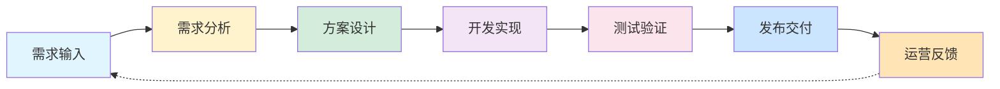
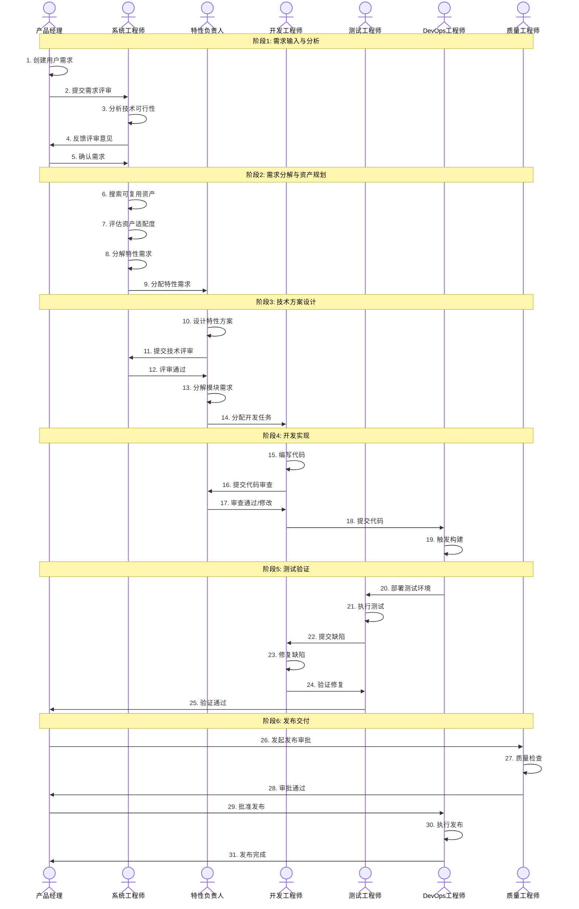
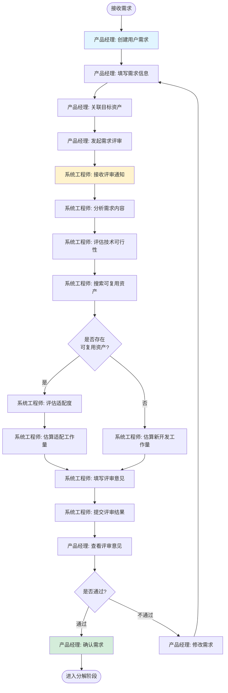
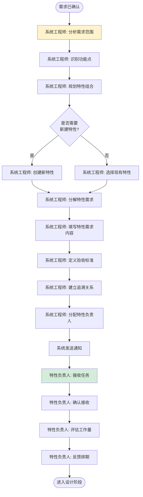
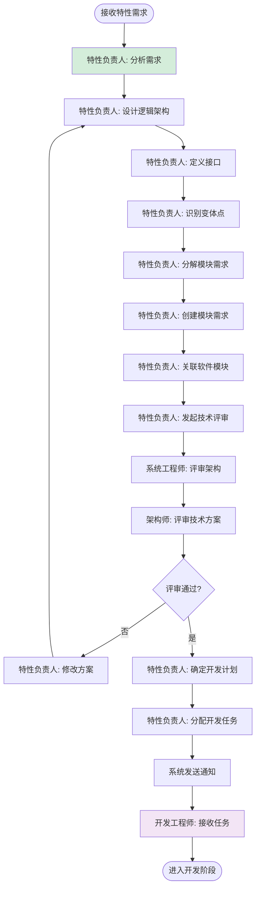
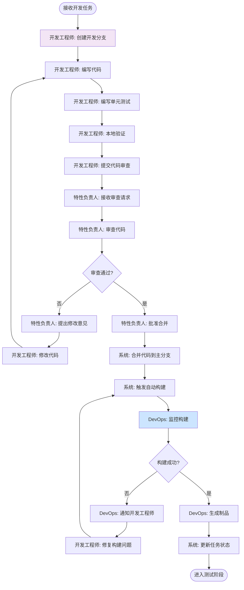
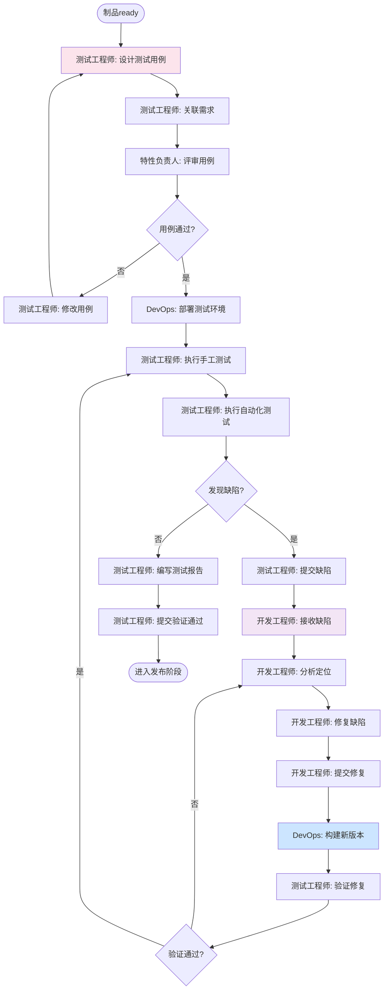
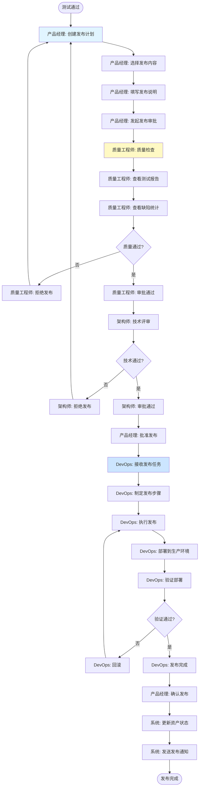
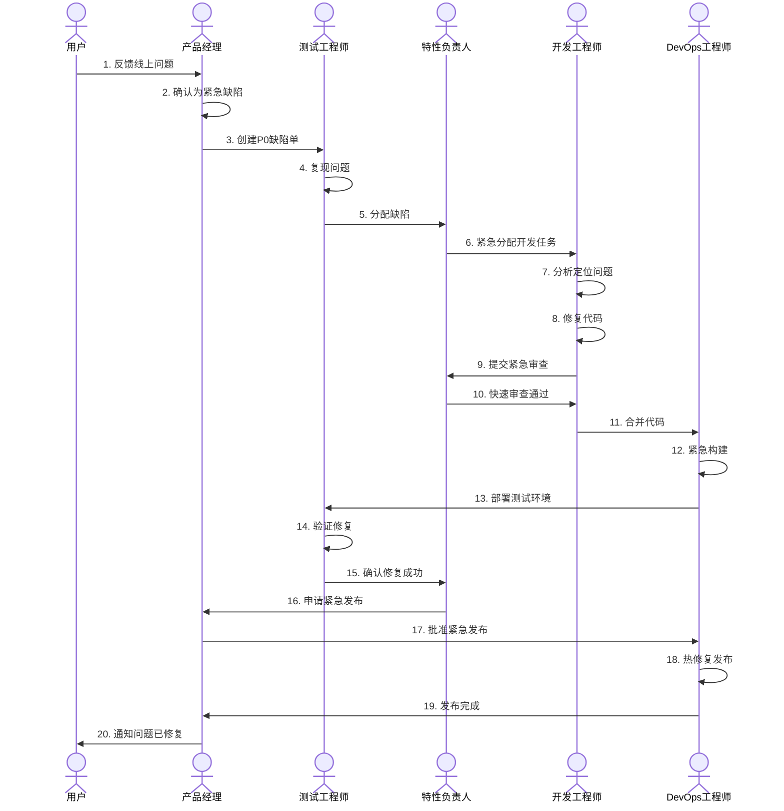

# Auto DevOps平台 - 端到端多角色协同流程

> **文档版本**: v1.0  
> **创建日期**: 2025-01-02  
> **目标**: 设计汽车研发多角色协同的端到端全流程

---

## 📋 目录

1. [协同流程概述](#一协同流程概述)
2. [完整端到端流程](#二完整端到端流程)
3. [分阶段协同详解](#三分阶段协同详解)
4. [角色工作台设计](#四角色工作台设计)
5. [协同机制设计](#五协同机制设计)
6. [典型场景流程](#六典型场景流程)

---

## 一、协同流程概述

### 1.1 端到端流程全景



### 1.2 参与角色矩阵

| 阶段 | 主导角色 | 协同角色 | 交付物 |
|------|---------|---------|--------|
| **需求输入** | 产品经理 | 干系人、系统工程师 | 用户需求文档 |
| **需求分析** | 系统工程师 | 产品经理、架构师 | 需求分析报告、特性需求 |
| **方案设计** | 特性负责人 | 系统工程师、算法工程师 | 技术方案、接口设计 |
| **开发实现** | 软件工程师 | 特性负责人、算法工程师 | 源代码、单元测试 |
| **测试验证** | 测试工程师 | 开发工程师、特性负责人 | 测试报告、缺陷列表 |
| **发布交付** | DevOps工程师 | 产品经理、质量工程师 | 发布包、部署文档 |
| **运营反馈** | 产品经理 | 所有角色 | 反馈报告、改进建议 |

---

## 二、完整端到端流程

### 2.1 全流程泳道图



### 2.2 流程时序与里程碑

```
时间轴: ═══════════════════════════════════════════════════════════════
         Week1-2    Week3-4    Week5-8    Week9-12   Week13-14  Week15-16

里程碑:   M1          M2         M3          M4         M5         M6
         需求确认    方案评审   开发完成    测试完成   审批通过   发布上线
           ▼          ▼          ▼          ▼          ▼          ▼
活动:    需求分析    设计方案   开发实现   测试验证   发布准备   正式发布
         
负载:    PM██       SE██       Dev████    TE████     QE██       DevOps██
         SE████     FO████     FO██       FO██       PM██       PM██
                    Dev██      Dev██      Dev██      DevOps██   

产出:    用户需求    技术方案   代码+      测试报告   审批记录   发布包
         特性需求    接口设计   单元测试   缺陷列表   发布计划   部署文档
```

---

## 三、分阶段协同详解

### 3.1 阶段1: 需求输入与分析（Week 1-2）

#### 3.1.1 活动流程



#### 3.1.2 角色协作细节

**产品经理工作内容**:
```yaml
输入:
  - 整车需求文档
  - 干系人需求
  - 市场调研报告

活动:
  1. 录入用户需求
     - 填写需求标题和描述
     - 选择需求类型和优先级
     - 记录需求来源
     - 上传需求附件
  
  2. 关联目标资产
     - 选择目标产品
     - 选择目标特性（如果已知）
     - 设置业务价值评分
  
  3. 发起需求评审
     - 选择评审人（系统工程师、架构师）
     - 设置评审期限
     - 填写评审要点

输出:
  - 用户需求记录 (UR-XXX)
  - 评审申请

使用功能:
  - 用户需求管理
  - 评审管理
  - 通知消息
```

**系统工程师工作内容**:
```yaml
输入:
  - 用户需求记录
  - 评审申请

活动:
  1. 需求分析
     - 理解需求背景和目标
     - 识别关键功能点
     - 分析约束条件
  
  2. 技术可行性评估
     - 评估技术复杂度
     - 识别技术风险
     - 评估是否有现成方案
  
  3. 资产检索
     - 在资产库搜索相关资产
     - 评估资产适配度
     - 估算适配工作量
  
  4. 提交评审意见
     - 技术可行性结论
     - 工作量估算
     - 建议的实现方案
     - 识别的风险

输出:
  - 需求评审意见
  - 工作量估算
  - 可复用资产清单

使用功能:
  - 需求管理
  - 资产库检索
  - 评审管理
  - 工作量估算工具
```

#### 3.1.3 关键协同点

```
协同点1: 需求澄清
├─ 触发: 系统工程师发现需求不清晰
├─ 方式: 在需求下评论提问
├─ 响应: 产品经理回复或更新需求
└─ 时限: 24小时内响应

协同点2: 可行性讨论
├─ 触发: 技术可行性存疑
├─ 方式: 发起在线会议或面对面讨论
├─ 参与: 产品经理、系统工程师、架构师
└─ 产出: 会议纪要、更新需求或评审意见

协同点3: 评审反馈
├─ 触发: 系统工程师提交评审意见
├─ 方式: 系统自动通知产品经理
├─ 响应: 产品经理查看并确认
└─ 决策: 通过、修改或拒绝
```

### 3.2 阶段2: 需求分解与资产规划（Week 3-4）

#### 3.2.1 活动流程



#### 3.2.2 角色协作细节

**系统工程师工作内容**:
```yaml
输入:
  - 已确认的用户需求
  - 可复用资产清单

活动:
  1. 需求分解
     - 将用户需求分解为特性需求
     - 每个特性需求对应一个领域特性
     - 使用分解模板或智能建议
  
  2. 创建特性需求
     - 填写特性需求描述
     - 引用用户需求（建立追溯）
     - 定义功能规格
     - 定义非功能需求
     - 定义验收标准
  
  3. 关联特性
     - 选择已有特性或创建新特性
     - 配置特性变体（如需要）
     - 管理特性依赖关系
  
  4. 分配负责人
     - 选择特性负责人
     - 设置优先级和期限
     - 添加备注说明

输出:
  - 特性需求列表 (FR-XXX)
  - 需求追溯关系 (UR → FR)
  - 任务分配记录

使用功能:
  - 需求分解工具
  - 特性需求管理
  - 追溯管理
  - 任务分配
```

**特性负责人工作内容**:
```yaml
输入:
  - 特性需求
  - 分配通知

活动:
  1. 理解需求
     - 查看特性需求详情
     - 查看追溯链（关联的用户需求）
     - 查看验收标准
  
  2. 初步评估
     - 评估技术复杂度
     - 识别技术依赖
     - 评估团队能力
  
  3. 工作量估算
     - 分解主要任务
     - 估算开发工作量
     - 估算测试工作量
     - 预留buffer
  
  4. 排期反馈
     - 提出预计开始时间
     - 提出预计完成时间
     - 标识资源需求

输出:
  - 工作量估算
  - 排期计划
  - 资源需求

使用功能:
  - 特性需求管理
  - 追溯查询
  - 工作量估算工具
  - 任务管理
```

#### 3.2.3 关键协同点

```
协同点1: 需求分解评审
├─ 触发: 系统工程师完成需求分解
├─ 方式: 发起评审会议
├─ 参与: 产品经理、系统工程师、特性负责人
├─ 评审内容:
│  ├─ 分解是否完整
│  ├─ 特性粒度是否合理
│  ├─ 依赖关系是否清晰
│  └─ 验收标准是否明确
└─ 产出: 评审通过的特性需求列表

协同点2: 工作量确认
├─ 触发: 特性负责人提交工作量估算
├─ 方式: 系统通知 + 在线确认
├─ 参与: 系统工程师、产品经理
├─ 内容:
│  ├─ 工作量是否合理
│  ├─ 排期是否可接受
│  └─ 资源是否可满足
└─ 决策: 确认或协商调整

协同点3: 任务交接
├─ 触发: 特性需求分配完成
├─ 方式: Kick-off会议
├─ 参与: 系统工程师、特性负责人、团队成员
├─ 内容:
│  ├─ 需求背景和目标
│  ├─ 技术约束和依赖
│  ├─ 质量要求
│  └─ 交付时间
└─ 产出: 会议纪要、问题清单
```

### 3.3 阶段3: 技术方案设计（Week 5-6）

#### 3.3.1 活动流程



#### 3.3.2 角色协作细节

**特性负责人工作内容**:
```yaml
输入:
  - 特性需求 (FR-XXX)
  - 相关资产信息

活动:
  1. 技术方案设计
     - 设计逻辑架构
       - 识别逻辑组件
       - 定义组件职责
       - 设计组件交互
     - 定义接口
       - 服务接口
       - 事件接口
       - 数据接口
     - 识别变体点
       - 可变功能点
       - 配置参数
       - 约束规则
  
  2. 模块需求分解
     - 将特性需求分解为模块需求
     - 每个模块需求关联一个软件模块
     - 定义模块间依赖
  
  3. 创建模块需求
     - 填写模块需求描述
     - 定义接口需求
     - 定义性能需求
     - 定义验收标准
     - 估算Story Point
  
  4. 发起技术评审
     - 准备评审材料（架构图、接口定义）
     - 选择评审人
     - 预约评审会议
  
  5. 分配开发任务
     - 根据模块需求创建开发任务
     - 分配给开发工程师
     - 设置优先级和期限

输出:
  - 逻辑架构设计
  - 接口定义文档
  - 模块需求列表 (MR-XXX)
  - 开发任务列表
  - 追溯关系 (FR → MR)

使用功能:
  - 特性设计工具
  - 架构设计工具
  - 接口设计工具
  - 模块需求管理
  - 任务管理
  - 评审管理
```

**系统工程师&架构师工作内容**:
```yaml
输入:
  - 技术方案文档
  - 评审邀请

活动:
  1. 评审准备
     - 查看技术方案
     - 了解需求背景
     - 准备评审问题
  
  2. 参与评审
     - 评审架构设计
       - 架构合理性
       - 模块划分
       - 接口设计
     - 评审技术选型
       - 技术栈选择
       - 依赖管理
     - 识别风险
       - 技术风险
       - 集成风险
       - 性能风险
  
  3. 提供建议
     - 架构优化建议
     - 技术方案改进
     - 风险应对措施
  
  4. 评审决策
     - 通过
     - 有条件通过
     - 不通过（需重新设计）

输出:
  - 评审意见
  - 评审记录
  - 待办问题清单

使用功能:
  - 评审管理
  - 文档查看
  - 评论讨论
```

**开发工程师工作内容**:
```yaml
输入:
  - 开发任务
  - 模块需求
  - 接口定义

活动:
  1. 任务认领
     - 查看任务详情
     - 查看模块需求
     - 查看接口定义
     - 确认任务可行性
  
  2. 任务确认
     - 与特性负责人讨论细节
     - 确认技术方案
     - 确认验收标准
     - 确认工作量和期限

输出:
  - 任务确认
  - 问题清单

使用功能:
  - 任务管理
  - 需求查看
  - 追溯查询
  - 讨论评论
```

#### 3.3.3 关键协同点

```
协同点1: 技术方案评审
├─ 时机: 完成逻辑架构设计后
├─ 形式: 技术评审会
├─ 参与者:
│  ├─ 特性负责人（讲解方案）
│  ├─ 系统工程师（评审）
│  ├─ 架构师（评审）
│  └─ 相关特性负责人（协同评审）
├─ 评审内容:
│  ├─ 架构设计合理性
│  ├─ 接口定义完整性
│  ├─ 技术选型合理性
│  ├─ 依赖管理清晰性
│  └─ 风险识别充分性
└─ 产出: 评审通过 + 问题清单

协同点2: 模块分工确认
├─ 时机: 评审通过后
├─ 形式: 团队会议
├─ 参与者:
│  ├─ 特性负责人
│  └─ 开发团队成员
├─ 确认内容:
│  ├─ 模块职责边界
│  ├─ 接口定义
│  ├─ 开发顺序
│  └─ 时间安排
└─ 产出: 任务分配确认

协同点3: 接口对接
├─ 时机: 开发启动前
├─ 形式: 接口对齐会
├─ 参与者:
│  └─ 相关模块的开发工程师
├─ 确认内容:
│  ├─ 接口定义理解一致
│  ├─ 数据格式约定
│  ├─ 异常处理约定
│  └─ Mock数据准备
└─ 产出: 接口对接清单
```

### 3.4 阶段4: 开发实现（Week 7-10）

#### 3.4.1 活动流程



#### 3.4.2 角色协作细节

**开发工程师工作内容**:
```yaml
输入:
  - 开发任务
  - 模块需求
  - 接口定义
  - 代码规范

活动:
  1. 环境准备
     - 克隆代码仓库
     - 创建功能分支
     - 配置开发环境
  
  2. 编码实现
     - 按照接口定义实现功能
     - 遵守代码规范
     - 添加必要注释
     - 处理异常情况
  
  3. 单元测试
     - 编写单元测试用例
     - 执行单元测试
     - 确保测试覆盖率
     - 修复测试失败
  
  4. 本地验证
     - 本地编译
     - 功能验证
     - 集成测试
  
  5. 提交审查
     - 提交代码到远程分支
     - 创建Pull/Merge Request
     - 填写提交说明
     - 关联模块需求
     - 请求特性负责人审查
  
  6. 响应审查
     - 查看审查意见
     - 回复审查评论
     - 修改代码
     - 重新提交

输出:
  - 功能代码
  - 单元测试代码
  - 代码提交记录
  - Pull Request

使用功能:
  - 任务管理
  - 代码仓库管理
  - 构建工具
  - 代码审查工具
  - 追溯管理（关联需求）
```

**特性负责人工作内容**:
```yaml
输入:
  - 代码审查请求
  - 代码diff
  - 提交说明

活动:
  1. 代码审查
     - 检查代码质量
       - 代码规范
       - 命名规范
       - 注释完整性
     - 检查功能实现
       - 功能完整性
       - 边界条件处理
       - 异常处理
     - 检查测试
       - 测试覆盖率
       - 测试用例合理性
     - 检查安全
       - 安全漏洞
       - 敏感信息
  
  2. 提出意见
     - 在代码行添加评论
     - 提出修改建议
     - 标记必须修改/建议修改
  
  3. 审查决策
     - 批准合并
     - 请求修改
     - 拒绝合并

输出:
  - 审查意见
  - 审查决策
  - 审查记录

使用功能:
  - 代码审查工具
  - 代码质量分析
  - 测试覆盖率查看
```

**DevOps工程师工作内容**:
```yaml
输入:
  - 代码提交
  - 构建配置

活动:
  1. 监控构建
     - 监控自动触发的构建
     - 查看构建日志
     - 识别构建失败原因
  
  2. 构建问题处理
     - 分析构建失败
     - 通知相关开发人员
     - 必要时修复构建脚本
  
  3. 制品管理
     - 存储构建制品
     - 标记制品版本
     - 清理过期制品

输出:
  - 构建日志
  - 构建制品
  - 构建报告

使用功能:
  - 构建管理
  - 制品管理
  - 通知消息
```

#### 3.4.3 关键协同点

```
协同点1: 代码审查沟通
├─ 触发: 特性负责人提出修改意见
├─ 方式: 
│  ├─ 在线评论
│  └─ 必要时面对面讨论
├─ 内容:
│  ├─ 澄清审查意见
│  ├─ 讨论实现方式
│  └─ 达成一致
└─ 时限: 4小时内响应

协同点2: 构建失败处理
├─ 触发: 构建失败
├─ 流程:
│  ├─ DevOps工程师分析失败原因
│  ├─ 通知相关开发工程师
│  ├─ 开发工程师修复问题
│  └─ 重新触发构建
└─ 时限: 2小时内修复

协同点3: 跨模块集成
├─ 触发: 多个模块需要联调
├─ 方式: 集成测试环境联调
├─ 参与: 相关模块的开发工程师
├─ 内容:
│  ├─ 接口联调
│  ├─ 数据对接
│  └─ 问题解决
└─ 产出: 集成测试通过
```

### 3.5 阶段5: 测试验证（Week 11-13）

#### 3.5.1 活动流程



#### 3.5.2 角色协作细节

**测试工程师工作内容**:
```yaml
输入:
  - 模块需求
  - 验收标准
  - 构建制品

活动:
  1. 测试准备
     - 设计测试用例
       - 功能测试用例
       - 边界值测试
       - 异常测试
       - 性能测试（如需要）
     - 关联需求
       - 建立用例与需求的追溯
       - 确保需求覆盖
     - 准备测试数据
  
  2. 用例评审
     - 提交用例评审
     - 响应评审意见
     - 修改用例
  
  3. 测试执行
     - 手工测试
       - 按用例执行
       - 记录测试结果
     - 自动化测试
       - 配置自动化用例
       - 执行自动化测试
       - 查看测试报告
  
  4. 缺陷管理
     - 发现缺陷
     - 复现缺陷
     - 提交缺陷报告
       - 缺陷标题和描述
       - 重现步骤
       - 实际结果vs期望结果
       - 附件（截图、日志）
       - 严重程度和优先级
     - 跟踪缺陷修复
     - 验证缺陷修复
       - 回归测试
       - 确认修复
       - 关闭缺陷
  
  5. 测试报告
     - 统计测试数据
     - 分析测试结果
     - 编写测试报告
     - 提交验证结论

输出:
  - 测试用例
  - 测试结果
  - 缺陷报告
  - 测试报告
  - 追溯关系 (MR → TestCase)

使用功能:
  - 测试用例管理
  - 测试执行
  - 缺陷管理
  - 追溯管理
  - 测试报告生成
```

**开发工程师工作内容**:
```yaml
输入:
  - 缺陷报告

活动:
  1. 缺陷分析
     - 查看缺陷详情
     - 复现缺陷
     - 定位问题代码
     - 分析根因
  
  2. 缺陷修复
     - 修改代码
     - 单元测试
     - 本地验证
  
  3. 提交修复
     - 提交代码
     - 更新缺陷状态
     - 添加修复说明
     - 关联代码提交
  
  4. 响应验证
     - 协助测试验证
     - 回答测试问题

输出:
  - 修复代码
  - 缺陷修复说明

使用功能:
  - 缺陷管理
  - 代码管理
  - 构建工具
```

**DevOps工程师工作内容**:
```yaml
输入:
  - 构建制品
  - 部署请求

活动:
  1. 环境管理
     - 准备测试环境
     - 配置环境参数
     - 检查环境健康
  
  2. 部署制品
     - 部署应用
     - 部署配置
     - 验证部署
  
  3. 支持测试
     - 监控环境状态
     - 收集日志
     - 处理环境问题

输出:
  - 测试环境
  - 部署记录
  - 环境日志

使用功能:
  - 环境管理
  - 部署管理
  - 监控告警
```

#### 3.5.3 关键协同点

```
协同点1: 测试用例评审
├─ 触发: 测试工程师完成用例设计
├─ 方式: 线上评审或评审会
├─ 参与: 测试工程师、特性负责人、开发工程师
├─ 评审内容:
│  ├─ 用例覆盖完整性
│  ├─ 用例步骤合理性
│  ├─ 验收标准一致性
│  └─ 测试数据充分性
└─ 产出: 评审通过的测试用例

协同点2: 缺陷澄清
├─ 触发: 开发工程师无法复现缺陷
├─ 方式: 在线讨论或会议
├─ 参与: 测试工程师、开发工程师
├─ 内容:
│  ├─ 澄清缺陷步骤
│  ├─ 演示缺陷复现
│  ├─ 提供更多信息
│  └─ 讨论是否为缺陷
└─ 产出: 更新的缺陷报告或关闭缺陷

协同点3: 缺陷验证协作
├─ 触发: 开发工程师修复缺陷
├─ 流程:
│  ├─ 开发工程师更新缺陷状态为"已修复"
│  ├─ 系统通知测试工程师
│  ├─ 测试工程师验证修复
│  ├─ 验证通过 → 关闭缺陷
│  └─ 验证不通过 → 重新打开缺陷
└─ 时限: 24小时内验证

协同点4: 测试阻塞处理
├─ 触发: 测试环境问题或严重缺陷阻塞测试
├─ 方式: 拉群快速响应
├─ 参与: 测试工程师、开发工程师、DevOps工程师、特性负责人
├─ 内容:
│  ├─ 问题描述
│  ├─ 影响范围
│  ├─ 解决方案
│  └─ 责任人和时限
└─ 时限: 2小时内响应
```

### 3.6 阶段6: 发布交付（Week 14-16）

#### 3.6.1 活动流程



#### 3.6.2 角色协作细节

**产品经理工作内容**:
```yaml
输入:
  - 测试报告
  - 验证通过的需求

活动:
  1. 发布准备
     - 创建发布计划
       - 发布版本号
       - 发布时间
       - 发布范围
     - 选择发布内容
       - 选择要发布的特性
       - 选择要发布的缺陷修复
       - 排除不发布的内容
     - 编写发布说明
       - 新增功能
       - 改进优化
       - 缺陷修复
       - 已知问题
       - 升级注意事项
  
  2. 发布审批
     - 发起审批流程
     - 上传发布材料
     - 跟踪审批进度
  
  3. 发布确认
     - 接收发布完成通知
     - 验证发布结果
     - 确认发布完成

输出:
  - 发布计划
  - 发布说明
  - 发布审批记录
  - 发布确认

使用功能:
  - 发布管理
  - 审批流程
  - 通知消息
```

**质量工程师工作内容**:
```yaml
输入:
  - 发布审批请求
  - 测试报告
  - 缺陷统计

活动:
  1. 质量检查
     - 查看测试报告
       - 测试覆盖率
       - 测试通过率
       - 测试执行情况
     - 查看缺陷统计
       - 遗留缺陷数量
       - 遗留缺陷严重程度
       - 缺陷关闭率
     - 查看质量指标
       - 代码质量
       - 测试质量
       - 技术债务
  
  2. 风险评估
     - 识别发布风险
     - 评估风险等级
     - 提出风险应对
  
  3. 审批决策
     - 通过: 质量符合发布标准
     - 有条件通过: 需满足特定条件
     - 拒绝: 质量不符合发布标准

输出:
  - 质量检查报告
  - 审批意见
  - 风险清单

使用功能:
  - 质量分析
  - 测试报告查看
  - 审批管理
```

**架构师工作内容**:
```yaml
输入:
  - 发布审批请求
  - 技术方案文档

活动:
  1. 技术评审
     - 评审技术方案变更
     - 评审架构影响
     - 评审技术债务
  
  2. 风险评估
     - 技术风险
     - 兼容性风险
     - 性能风险
  
  3. 审批决策
     - 通过: 技术方案合理
     - 有条件通过: 需满足特定条件
     - 拒绝: 技术方案不合理

输出:
  - 技术评审意见
  - 审批决策

使用功能:
  - 审批管理
  - 文档查看
```

**DevOps工程师工作内容**:
```yaml
输入:
  - 发布批准
  - 发布计划
  - 构建制品

活动:
  1. 发布准备
     - 制定发布步骤
     - 准备发布环境
     - 备份当前版本
     - 准备回滚方案
  
  2. 执行发布
     - 部署到生产环境
     - 执行数据库迁移（如需要）
     - 更新配置
     - 重启服务
  
  3. 发布验证
     - 健康检查
     - 烟雾测试
     - 监控关键指标
     - 查看日志
  
  4. 发布监控
     - 监控系统状态
     - 监控性能指标
     - 监控错误日志
     - 处理告警
  
  5. 回滚（如需要）
     - 停止当前版本
     - 恢复备份版本
     - 恢复数据（如需要）
     - 验证回滚成功

输出:
  - 发布记录
  - 发布日志
  - 监控报告

使用功能:
  - 发布管理
  - 部署执行
  - 监控告警
  - 日志查看
```

#### 3.6.3 关键协同点

```
协同点1: 发布审批
├─ 触发: 产品经理发起发布审批
├─ 流程:
│  ├─ 产品经理提交审批
│  ├─ 质量工程师审批
│  ├─ 架构师审批
│  └─ 产品经理批准发布
├─ 时限: 每级审批24小时内完成
└─ 产出: 审批记录

协同点2: 发布窗口协调
├─ 触发: 确定发布时间
├─ 方式: 发布协调会
├─ 参与: 产品经理、DevOps工程师、运维团队
├─ 内容:
│  ├─ 确定发布窗口
│  ├─ 协调资源
│  ├─ 确定发布步骤
│  └─ 确定应急预案
└─ 产出: 发布排期

协同点3: 发布验证
├─ 触发: 发布部署完成
├─ 参与: DevOps工程师、测试工程师、产品经理
├─ 验证内容:
│  ├─ 基本功能验证
│  ├─ 关键流程验证
│  ├─ 性能指标验证
│  └─ 监控数据验证
└─ 决策: 确认成功或触发回滚

协同点4: 发布后支持
├─ 时段: 发布后24-48小时
├─ 方式: 值班支持
├─ 参与: 全体团队成员轮值
├─ 内容:
│  ├─ 监控系统状态
│  ├─ 处理用户反馈
│  ├─ 快速修复问题
│  └─ 记录问题和改进
└─ 产出: 发布后报告
```

---

## 四、角色工作台设计

### 4.1 产品经理工作台

```
┌─────────────────────────────────────────────────────────────┐
│                    产品经理工作台                            │
└─────────────────────────────────────────────────────────────┘

┌─────────────┬─────────────────────────────────────────────┐
│  快速入口    │                                              │
│             │  ┌────────────┐  ┌────────────┐              │
│  • 创建需求  │  │ 我的产品   │  │  待办事项  │              │
│  • 创建产品  │  │            │  │            │              │
│  • 查看看板  │  │  3个产品   │  │  8个待办   │              │
│  • 查看报表  │  └────────────┘  └────────────┘              │
│             │                                              │
└─────────────┴─────────────────────────────────────────────┘

┌─────────────────────────────────────────────────────────────┐
│  产品进度看板                                                 │
│  ┌──────────┬──────────┬──────────┬──────────┐             │
│  │  待开发   │  开发中   │  测试中   │  已完成   │             │
│  │          │          │          │          │             │
│  │  需求A   │  需求B   │  需求C   │  需求D   │             │
│  │  需求E   │  需求F   │  需求G   │          │             │
│  │          │          │          │          │             │
│  └──────────┴──────────┴──────────┴──────────┘             │
└─────────────────────────────────────────────────────────────┘

┌─────────────────────────────────────────────────────────────┐
│  最近活动                                                     │
│  • 特性需求FR-001已完成测试 (2小时前)                         │
│  • 用户需求UR-005等待您的评审 (4小时前)                       │
│  • 产品NOA-V2.0发布审批通过 (昨天)                           │
└─────────────────────────────────────────────────────────────┘
```

### 4.2 系统工程师工作台

```
┌─────────────────────────────────────────────────────────────┐
│                  系统工程师工作台                             │
└─────────────────────────────────────────────────────────────┘

┌─────────────┬─────────────────────────────────────────────┐
│  快速入口    │                                              │
│             │  ┌────────────┐  ┌────────────┐              │
│  • 需求分解  │  │ 待评审需求  │  │  追溯覆盖率 │              │
│  • 资产检索  │  │            │  │            │              │
│  • 影响分析  │  │  5个需求   │  │    95%     │              │
│  • 技术评审  │  └────────────┘  └────────────┘              │
│             │                                              │
└─────────────┴─────────────────────────────────────────────┘

┌─────────────────────────────────────────────────────────────┐
│  需求追溯视图                                                 │
│  ┌──────────────────────────────────────────────────────┐   │
│  │  UR-001: NOA自动驾驶功能                              │   │
│  │    ├─ FR-001: 融合感知 (已完成)                      │   │
│  │    │   ├─ MR-001: 视觉感知模块 (测试中)              │   │
│  │    │   └─ MR-002: 激光雷达模块 (已完成)              │   │
│  │    └─ FR-002: 路径规划 (开发中)                      │   │
│  │        ├─ MR-003: 全局规划 (开发中)                  │   │
│  │        └─ MR-004: 局部规划 (待开发)                  │   │
│  └──────────────────────────────────────────────────────┘   │
└─────────────────────────────────────────────────────────────┘

┌─────────────────────────────────────────────────────────────┐
│  技术评审任务                                                 │
│  • 特性FR-005技术方案评审 (明天 10:00)                        │
│  • 架构设计评审 - NOA V3.0 (本周五)                           │
└─────────────────────────────────────────────────────────────┘
```

### 4.3 特性负责人工作台

```
┌─────────────────────────────────────────────────────────────┐
│                  特性负责人工作台                             │
└─────────────────────────────────────────────────────────────┘

┌─────────────┬─────────────────────────────────────────────┐
│  快速入口    │                                              │
│             │  ┌────────────┐  ┌────────────┐              │
│  • 我的特性  │  │ 团队任务   │  │  代码审查  │              │
│  • 任务分配  │  │            │  │            │              │
│  • 代码审查  │  │  12个任务  │  │  3个PR     │              │
│  • 特性测试  │  └────────────┘  └────────────┘              │
│             │                                              │
└─────────────┴─────────────────────────────────────────────┘

┌─────────────────────────────────────────────────────────────┐
│  团队任务看板                                                 │
│  ┌──────────┬──────────┬──────────┬──────────┐             │
│  │  待办     │  进行中   │  审查中   │  已完成   │             │
│  │          │          │          │          │             │
│  │  任务A   │  任务B   │  任务C   │  任务D   │             │
│  │  (张三)  │  (李四)  │  (王五)  │          │             │
│  │  任务E   │  任务F   │          │          │             │
│  │  (待分配) │  (赵六)  │          │          │             │
│  └──────────┴──────────┴──────────┴──────────┘             │
└─────────────────────────────────────────────────────────────┘

┌─────────────────────────────────────────────────────────────┐
│  待处理事项                                                   │
│  • PR#123 等待您的审查 (张三, 2小时前)                        │
│  • PR#124 等待您的审查 (李四, 4小时前)                        │
│  • 任务E需要分配负责人 (昨天)                                 │
│  • 特性测试环境部署失败 (今天 09:00)                          │
└─────────────────────────────────────────────────────────────┘
```

### 4.4 开发工程师工作台

```
┌─────────────────────────────────────────────────────────────┐
│                  开发工程师工作台                             │
└─────────────────────────────────────────────────────────────┘

┌─────────────┬─────────────────────────────────────────────┐
│  快速入口    │                                              │
│             │  ┌────────────┐  ┌────────────┐              │
│  • 我的任务  │  │ 进行中任务  │  │  构建状态  │              │
│  • 创建分支  │  │            │  │            │              │
│  • 提交PR    │  │  2个任务   │  │    成功    │              │
│  • 查看缺陷  │  └────────────┘  └────────────┘              │
│             │                                              │
└─────────────┴─────────────────────────────────────────────┘

┌─────────────────────────────────────────────────────────────┐
│  我的任务                                                     │
│  ┌──────────────────────────────────────────────────────┐   │
│  │  任务MR-001: 实现视觉感知模块                         │   │
│  │  状态: 进行中  |  优先级: 高  |  剩余: 3天            │   │
│  │  ├─ 需求: FR-001 融合感知                            │   │
│  │  ├─ 分支: feature/perception-vision                  │   │
│  │  ├─ 进度: 60%                                        │   │
│  │  └─ 待办:                                            │   │
│  │      • 完成相机标定                                  │   │
│  │      • 编写单元测试                                  │   │
│  └──────────────────────────────────────────────────────┘   │
└─────────────────────────────────────────────────────────────┘

┌─────────────────────────────────────────────────────────────┐
│  代码审查反馈                                                 │
│  • PR#122: 请修复代码规范问题 (特性负责人, 1小时前)           │
│  • PR#120: LGTM, 已批准合并 (特性负责人, 昨天)               │
└─────────────────────────────────────────────────────────────┘

┌─────────────────────────────────────────────────────────────┐
│  我的缺陷                                                     │
│  • Bug#45: 相机初始化失败 (严重, 待修复)                     │
│  • Bug#42: 内存泄漏 (一般, 修复中)                           │
└─────────────────────────────────────────────────────────────┘
```

### 4.5 测试工程师工作台

```
┌─────────────────────────────────────────────────────────────┐
│                  测试工程师工作台                             │
└─────────────────────────────────────────────────────────────┘

┌─────────────┬─────────────────────────────────────────────┐
│  快速入口    │                                              │
│             │  ┌────────────┐  ┌────────────┐              │
│  • 测试用例  │  │ 待测试任务  │  │  未关闭缺陷 │              │
│  • 执行测试  │  │            │  │            │              │
│  • 提交缺陷  │  │  5个任务   │  │  8个缺陷   │              │
│  • 测试报告  │  └────────────┘  └────────────┘              │
│             │                                              │
└─────────────┴─────────────────────────────────────────────┘

┌─────────────────────────────────────────────────────────────┐
│  测试执行看板                                                 │
│  ┌──────────┬──────────┬──────────┬──────────┐             │
│  │  待执行   │  执行中   │  待验证   │  已完成   │             │
│  │          │          │          │          │             │
│  │  用例A   │  用例B   │  用例C   │  用例D   │             │
│  │  用例E   │  用例F   │  (缺陷修复)│         │             │
│  │          │          │          │          │             │
│  └──────────┴──────────┴──────────┴──────────┘             │
└─────────────────────────────────────────────────────────────┘

┌─────────────────────────────────────────────────────────────┐
│  缺陷跟踪                                                     │
│  • Bug#45: 相机初始化失败 (严重, 待修复, 张三)                │
│  • Bug#46: UI显示错位 (一般, 待验证, 李四)                   │
│  • Bug#47: 性能问题 (一般, 修复中, 王五)                     │
└─────────────────────────────────────────────────────────────┘

┌─────────────────────────────────────────────────────────────┐
│  测试进度统计                                                 │
│  总用例: 120  |  已执行: 85  |  通过: 78  |  失败: 7        │
│  ████████████████████░░░░  执行率: 71%                      │
└─────────────────────────────────────────────────────────────┘
```

### 4.6 DevOps工程师工作台

```
┌─────────────────────────────────────────────────────────────┐
│                 DevOps工程师工作台                            │
└─────────────────────────────────────────────────────────────┘

┌─────────────┬─────────────────────────────────────────────┐
│  快速入口    │                                              │
│             │  ┌────────────┐  ┌────────────┐              │
│  • 构建管理  │  │ 构建队列   │  │  系统状态  │              │
│  • 环境管理  │  │            │  │            │              │
│  • 发布管理  │  │  2个构建   │  │    正常    │              │
│  • 监控告警  │  └────────────┘  └────────────┘              │
│             │                                              │
└─────────────┴─────────────────────────────────────────────┘

┌─────────────────────────────────────────────────────────────┐
│  构建状态                                                     │
│  ┌──────────────────────────────────────────────────────┐   │
│  │  ✅ Build#1234: feature-perception  (5分钟前)        │   │
│  │  🔄 Build#1235: feature-planning (构建中...)         │   │
│  │  ❌ Build#1233: feature-control (失败, 1小时前)      │   │
│  └──────────────────────────────────────────────────────┘   │
└─────────────────────────────────────────────────────────────┘

┌─────────────────────────────────────────────────────────────┐
│  发布计划                                                     │
│  • NOA V2.1 - 预计明天18:00发布                              │
│  • LCC V1.5 - 预计本周五20:00发布                            │
└─────────────────────────────────────────────────────────────┘

┌─────────────────────────────────────────────────────────────┐
│  告警信息                                                     │
│  • ⚠️ 测试环境CPU使用率85% (10分钟前)                         │
│  • ⚠️ 生产环境磁盘空间不足 (1小时前)                          │
└─────────────────────────────────────────────────────────────┘
```

---

## 五、协同机制设计

### 5.1 通知机制

```yaml
通知类型:
  任务通知:
    - 任务分配
    - 任务更新
    - 任务@提醒
    - 任务过期提醒
  
  评审通知:
    - 评审请求
    - 评审意见
    - 评审通过/拒绝
  
  审批通知:
    - 审批请求
    - 审批结果
  
  缺陷通知:
    - 缺陷分配
    - 缺陷状态变更
    - 缺陷待验证
  
  构建通知:
    - 构建成功/失败
    - 部署完成
  
  发布通知:
    - 发布审批
    - 发布完成

通知渠道:
  站内消息: 所有通知
  邮件: 重要通知（审批、发布）
  企业微信/钉钉: 紧急通知（构建失败、发布问题）

通知规则:
  实时通知: 紧急事项
  批量通知: 每小时汇总非紧急通知
  免打扰: 支持设置免打扰时段
```

### 5.2 评审机制

```yaml
评审类型:
  需求评审:
    - 参与者: 产品经理、系统工程师、架构师
    - 时机: 需求创建后
    - 产出: 评审意见、是否通过
  
  技术评审:
    - 参与者: 特性负责人、系统工程师、架构师
    - 时机: 完成技术方案后
    - 产出: 评审意见、问题清单
  
  代码审查:
    - 参与者: 特性负责人、资深开发
    - 时机: 提交代码后
    - 产出: 审查意见、是否批准
  
  测试用例评审:
    - 参与者: 测试工程师、特性负责人
    - 时机: 用例设计完成后
    - 产出: 评审意见、是否通过
  
  发布评审:
    - 参与者: 产品经理、质量工程师、架构师
    - 时机: 发布前
    - 产出: 审批决策

评审流程:
  1. 发起评审: 创建评审请求
  2. 通知评审人: 系统自动通知
  3. 评审执行: 评审人查看材料并评审
  4. 提交意见: 记录评审意见
  5. 整改跟踪: 跟踪问题整改
  6. 评审决策: 通过/有条件通过/拒绝
```

### 5.3 协同规则

```yaml
响应时限:
  紧急问题: 2小时内响应
  一般问题: 24小时内响应
  评审请求: 48小时内完成
  缺陷修复: 根据严重程度（P0: 4小时, P1: 24小时, P2: 3天）

沟通规范:
  在线评论: 日常沟通
  即时消息: 需要快速响应的问题
  会议: 复杂问题讨论、评审
  邮件: 正式通知、重要决策

工作交接:
  任务交接: 明确任务内容、验收标准、时限
  问题升级: 无法解决的问题及时升级
  知识共享: 重要决策和方案记录到知识库

质量门禁:
  代码提交: 必须通过代码审查
  集成合并: 必须通过构建和单元测试
  测试验证: 必须通过所有测试用例
  发布上线: 必须通过质量检查和审批
```

---

## 六、典型场景流程

### 6.1 场景: 紧急缺陷修复



**关键协同点**:
- 全程拉群快速响应
- 简化审查流程但不跳过
- 实时同步进度
- 发布后持续监控

### 6.2 场景: 跨特性依赖协调

```
背景: 特性A依赖特性B的接口

协同流程:
1. 特性A负责人发现依赖特性B
2. 在系统中建立依赖关系
3. 系统自动通知特性B负责人
4. 特性B负责人确认依赖
5. 双方协商接口定义
6. 特性B负责人提供Mock接口
7. 特性A基于Mock接口开发
8. 特性B完成后，特性A集成真实接口
9. 联调测试
10. 集成完成

协同要点:
- 提前沟通接口定义
- 提供Mock支持并行开发
- 定期同步进度
- 联调测试确保集成
```

---

**文档维护**:
- 负责人: 产品架构团队
- 更新频率: 季度更新
- 最后更新: 2025-01-02

