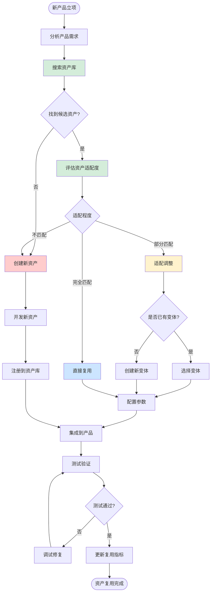
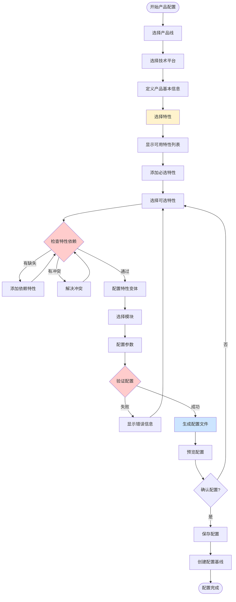
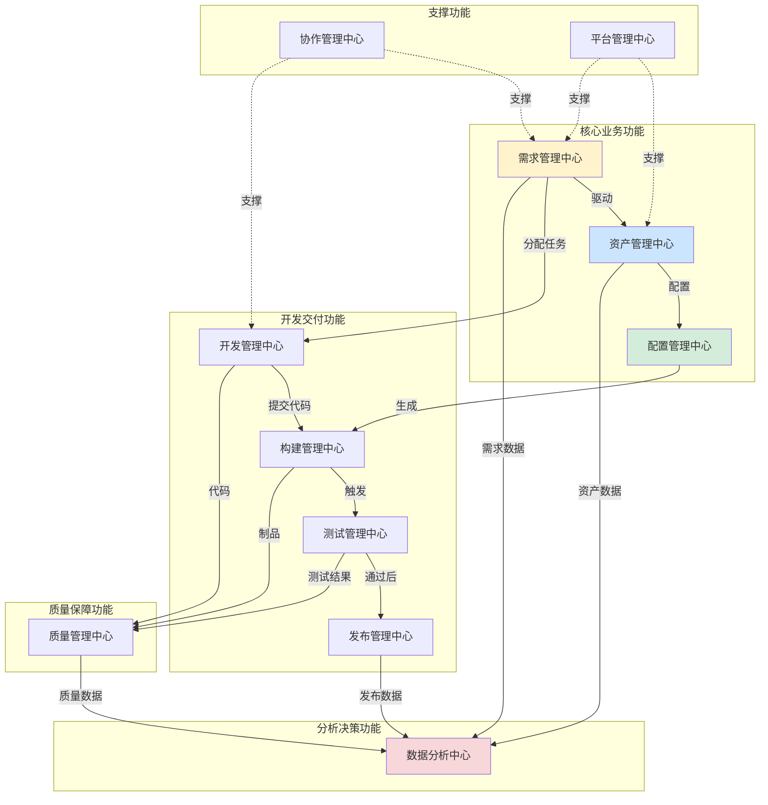

# Auto DevOps平台架构设计

> **设计日期**: 2025-01-02  
> **基于**: 三层资产体系 + 三层需求体系的领域模型  
> **目标**: 提供完整的业务架构和平台核心功能架构设计

---

## 📋 目录

1. [架构设计概述](#一架构设计概述)
2. [业务架构设计](#二业务架构设计)
3. [平台核心功能架构](#三平台核心功能架构)
4. [数据架构设计](#四数据架构设计)
5. [集成架构设计](#五集成架构设计)
6. [技术架构设计](#六技术架构设计)
7. [部署架构设计](#七部署架构设计)
8. [安全架构设计](#八安全架构设计)

---

## 一、架构设计概述

### 1.1 设计目标

```
【核心目标】
├─ 支撑三层资产体系的全生命周期管理
├─ 支撑三层需求体系的全流程跟踪
├─ 实现资产与需求的双向追溯
├─ 支持资产的跨产品复用
└─ 提供DevOps全流程自动化能力
```

### 1.2 架构设计原则

| 原则 | 说明 | 实现方式 |
|------|------|---------|
| **领域驱动** | 以领域模型为核心组织架构 | 基于三层资产+三层需求建模 |
| **服务化** | 微服务架构，松耦合 | 按业务能力拆分服务 |
| **资产复用** | 最大化资产复用率 | 资产库+变体管理+组合配置 |
| **数据驱动** | 基于数据的决策和优化 | 全链路数据采集+分析+可视化 |
| **开放集成** | 与上下游系统无缝集成 | 标准接口+事件驱动+API网关 |
| **安全可靠** | 保障系统和数据安全 | 多层安全防护+审计+备份 |

### 1.3 架构全景图

```
┌─────────────────────────────────────────────────────────────────────┐
│                        上游系统（整车产品管理）                        │
│                  整车需求、整车功能、整车配置                          │
└────────────────────────────┬────────────────────────────────────────┘
                             │ 需求输入
                             ↓
┌─────────────────────────────────────────────────────────────────────┐
│                    Auto DevOps平台 - 接入层                          │
│  ┌────────────┬────────────┬────────────┬────────────┐              │
│  │ Web Portal │ Mobile App │  API网关   │  CLI工具   │              │
│  └────────────┴────────────┴────────────┴────────────┘              │
└────────────────────────────┬────────────────────────────────────────┘
                             │
┌─────────────────────────────────────────────────────────────────────┐
│                    Auto DevOps平台 - 业务层                          │
│  ┌──────────────────────────────────────────────────────────┐       │
│  │         资产管理域 (Asset Management Domain)              │       │
│  │  ┌─────────────┬─────────────┬─────────────┐            │       │
│  │  │产品线管理   │领域产品管理 │技术平台管理 │ L1         │       │
│  │  ├─────────────┼─────────────┼─────────────┤            │       │
│  │  │领域特性管理 │逻辑架构管理 │算法资产管理 │ L2         │       │
│  │  ├─────────────┼─────────────┼─────────────┤            │       │
│  │  │软件模块管理 │软件组件管理 │接口管理     │ L3         │       │
│  │  └─────────────┴─────────────┴─────────────┘            │       │
│  └──────────────────────────────────────────────────────────┘       │
│                                                                       │
│  ┌──────────────────────────────────────────────────────────┐       │
│  │         需求管理域 (Requirement Management Domain)        │       │
│  │  ┌─────────────┬─────────────┬─────────────┐            │       │
│  │  │系统需求管理 │干系人需求   │业务目标管理 │ R1         │       │
│  │  ├─────────────┼─────────────┼─────────────┤            │       │
│  │  │特性需求管理 │功能规格管理 │非功能需求   │ R2         │       │
│  │  ├─────────────┼─────────────┼─────────────┤            │       │
│  │  │模块需求管理 │接口需求管理 │测试需求管理 │ R3         │       │
│  │  └─────────────┴─────────────┴─────────────┘            │       │
│  └──────────────────────────────────────────────────────────┘       │
│                                                                       │
│  ┌──────────────────────────────────────────────────────────┐       │
│  │         开发交付域 (Development & Delivery Domain)        │       │
│  │  ┌─────────────┬─────────────┬─────────────┐            │       │
│  │  │配置管理     │版本管理     │变更管理     │            │       │
│  │  ├─────────────┼─────────────┼─────────────┤            │       │
│  │  │构建管理     │测试管理     │发布管理     │            │       │
│  │  ├─────────────┼─────────────┼─────────────┤            │       │
│  │  │环境管理     │部署管理     │监控运维     │            │       │
│  │  └─────────────┴─────────────┴─────────────┘            │       │
│  └──────────────────────────────────────────────────────────┘       │
│                                                                       │
│  ┌──────────────────────────────────────────────────────────┐       │
│  │         质量管理域 (Quality Management Domain)            │       │
│  │  ┌─────────────┬─────────────┬─────────────┐            │       │
│  │  │测试用例管理 │缺陷管理     │质量度量     │            │       │
│  │  ├─────────────┼─────────────┼─────────────┤            │       │
│  │  │代码质量分析 │安全扫描     │合规检查     │            │       │
│  │  ├─────────────┼─────────────┼─────────────┤            │       │
│  │  │性能测试     │压力测试     │兼容性测试   │            │       │
│  │  └─────────────┴─────────────┴─────────────┘            │       │
│  └──────────────────────────────────────────────────────────┘       │
│                                                                       │
│  ┌──────────────────────────────────────────────────────────┐       │
│  │         数据分析域 (Data Analytics Domain)                │       │
│  │  ┌─────────────┬─────────────┬─────────────┐            │       │
│  │  │复用分析     │效能分析     │质量分析     │            │       │
│  │  ├─────────────┼─────────────┼─────────────┤            │       │
│  │  │成本分析     │风险分析     │趋势预测     │            │       │
│  │  └─────────────┴─────────────┴─────────────┘            │       │
│  └──────────────────────────────────────────────────────────┘       │
└────────────────────────────┬────────────────────────────────────────┘
                             │
┌─────────────────────────────────────────────────────────────────────┐
│                    Auto DevOps平台 - 支撑层                          │
│  ┌────────────┬────────────┬────────────┬────────────┐              │
│  │权限管理    │工作流引擎  │消息中心    │文档管理    │              │
│  ├────────────┼────────────┼────────────┼────────────┤              │
│  │搜索引擎    │缓存服务    │对象存储    │日志服务    │              │
│  └────────────┴────────────┴────────────┴────────────┘              │
└────────────────────────────┬────────────────────────────────────────┘
                             │
┌─────────────────────────────────────────────────────────────────────┐
│                    Auto DevOps平台 - 数据层                          │
│  ┌────────────┬────────────┬────────────┬────────────┐              │
│  │关系数据库  │图数据库    │时序数据库  │文档数据库  │              │
│  └────────────┴────────────┴────────────┴────────────┘              │
└────────────────────────────┬────────────────────────────────────────┘
                             │
┌─────────────────────────────────────────────────────────────────────┐
│                        外部集成系统                                   │
│  ┌────────────┬────────────┬────────────┬────────────┐              │
│  │Git仓库     │CI/CD平台   │制品仓库    │测试平台    │              │
│  ├────────────┼────────────┼────────────┼────────────┤              │
│  │Jira/禅道   │邮件/IM     │监控告警    │数据采集    │              │
│  └────────────┴────────────┴────────────┴────────────┘              │
└─────────────────────────────────────────────────────────────────────┘
```

---

## 二、业务架构设计

### 2.1 业务能力地图

```
┌────────────────────────────────────────────────────────────────┐
│                      Auto DevOps平台业务能力                    │
└────────────────────────────────────────────────────────────────┘

L1: 战略规划能力
├─ 产品线规划
│  ├─ 领域划分与定位
│  ├─ 技术路线规划
│  ├─ 资产复用策略
│  └─ 平台演进规划
├─ 产品规划
│  ├─ 市场需求分析
│  ├─ 产品定义
│  ├─ 特性组合配置
│  └─ 版本路线图
└─ 平台规划
   ├─ 技术平台定义
   ├─ 硬件平台选型
   ├─ 软件平台架构
   └─ 平台能力规划

L2: 需求管理能力
├─ 需求收集
│  ├─ 整车需求接入
│  ├─ 干系人需求收集
│  ├─ 市场需求分析
│  └─ 技术需求识别
├─ 需求分析
│  ├─ 需求分解
│  ├─ 需求优先级评估
│  ├─ 可行性分析
│  └─ 影响分析
├─ 需求分配
│  ├─ 用户需求到特性
│  ├─ 特性需求到模块
│  ├─ 模块需求到任务
│  └─ 需求到团队
└─ 需求跟踪
   ├─ 需求状态跟踪
   ├─ 需求变更管理
   ├─ 需求验证
   └─ 需求追溯

L3: 资产管理能力
├─ 资产定义
│  ├─ 资产分类与编目
│  ├─ 资产元数据管理
│  ├─ 资产版本管理
│  └─ 资产关系管理
├─ 资产开发
│  ├─ 资产设计
│  ├─ 资产实现
│  ├─ 资产测试
│  └─ 资产集成
├─ 资产复用
│  ├─ 资产检索
│  ├─ 资产评估
│  ├─ 资产适配
│  └─ 资产组合
└─ 资产演进
   ├─ 资产优化
   ├─ 资产重构
   ├─ 资产废弃
   └─ 资产迁移

L4: 配置管理能力
├─ 变体管理
│  ├─ 变体点定义
│  ├─ 变体选项管理
│  ├─ 配置规则
│  └─ 配置验证
├─ 产品配置
│  ├─ 特性选择
│  ├─ 组件配置
│  ├─ 参数配置
│  └─ 配置生成
└─ 版本配置
   ├─ 基线管理
   ├─ 分支管理
   ├─ 依赖管理
   └─ 兼容性管理

L5: 开发交付能力
├─ 开发管理
│  ├─ 代码管理
│  ├─ 分支策略
│  ├─ 代码审查
│  └─ 代码质量
├─ 构建管理
│  ├─ 构建配置
│  ├─ 编译打包
│  ├─ 依赖管理
│  └─ 制品管理
├─ 测试管理
│  ├─ 测试计划
│  ├─ 测试执行
│  ├─ 测试报告
│  └─ 缺陷管理
└─ 发布管理
   ├─ 发布计划
   ├─ 发布审批
   ├─ 发布执行
   └─ 发布回滚

L6: 质量保障能力
├─ 质量度量
│  ├─ 代码质量度量
│  ├─ 测试质量度量
│  ├─ 过程质量度量
│  └─ 产品质量度量
├─ 质量分析
│  ├─ 静态代码分析
│  ├─ 动态代码分析
│  ├─ 安全漏洞扫描
│  └─ 性能分析
└─ 质量改进
   ├─ 问题根因分析
   ├─ 改进措施制定
   ├─ 改进效果跟踪
   └─ 最佳实践沉淀

L7: 数据分析能力
├─ 指标管理
│  ├─ 指标定义
│  ├─ 指标采集
│  ├─ 指标计算
│  └─ 指标展示
├─ 效能分析
│  ├─ 研发效能
│  ├─ 资产复用效能
│  ├─ 交付效能
│  └─ 团队效能
├─ 成本分析
│  ├─ 开发成本
│  ├─ 测试成本
│  ├─ 维护成本
│  └─ 总体拥有成本
└─ 决策支持
   ├─ 数据可视化
   ├─ 报表生成
   ├─ 趋势预测
   └─ 智能推荐

L8: 协作管理能力
├─ 团队协作
│  ├─ 任务分配
│  ├─ 工作流程
│  ├─ 沟通协作
│  └─ 知识共享
├─ 项目管理
│  ├─ 项目规划
│  ├─ 进度跟踪
│  ├─ 资源管理
│  └─ 风险管理
└─ 流程管理
   ├─ 流程定义
   ├─ 流程执行
   ├─ 流程监控
   └─ 流程优化
```

### 2.2 核心业务流程

#### 2.2.1 需求到交付全流程

```mermaid
graph TB
    Start([整车需求输入]) --> UR[创建用户需求]
    
    subgraph "需求分析阶段"
        UR --> UR_Analysis[用户需求分析]
        UR_Analysis --> UR_Decompose[需求分解]
        UR_Decompose --> FR[创建特性需求]
    end
    
    subgraph "资产规划阶段"
        FR --> Asset_Search[搜索可复用资产]
        Asset_Search --> Asset_Reuse{是否存在<br/>可复用资产?}
        Asset_Reuse -->|是| Asset_Config[配置现有资产]
        Asset_Reuse -->|否| Asset_Create[规划新资产]
        Asset_Config --> DP[创建/更新领域产品]
        Asset_Create --> DP
    end
    
    subgraph "特性设计阶段"
        DP --> Feature_Design[特性设计]
        Feature_Design --> Feature_Arch[逻辑架构设计]
        Feature_Arch --> FR_Allocate[特性需求分配]
        FR_Allocate --> MR[创建模块需求]
    end
    
    subgraph "开发实现阶段"
        MR --> Module_Design[模块设计]
        Module_Design --> Module_Dev[模块开发]
        Module_Dev --> Code_Review[代码审查]
        Code_Review --> Unit_Test[单元测试]
    end
    
    subgraph "集成测试阶段"
        Unit_Test --> Module_Build[模块构建]
        Module_Build --> Feature_Integration[特性集成]
        Feature_Integration --> Feature_Test[特性测试]
        Feature_Test --> Product_Integration[产品集成]
        Product_Integration --> System_Test[系统测试]
    end
    
    subgraph "验证发布阶段"
        System_Test --> Verification[需求验证]
        Verification --> Verify_Pass{验证通过?}
        Verify_Pass -->|否| Bug_Fix[缺陷修复]
        Bug_Fix --> Module_Dev
        Verify_Pass -->|是| Release_Prepare[发布准备]
        Release_Prepare --> Release[正式发布]
    end
    
    Release --> Asset_Register[资产注册入库]
    Asset_Register --> End([交付完成])
    
    style UR fill:#fff3cd
    style FR fill:#fff3cd
    style MR fill:#fff3cd
    style DP fill:#cce5ff
    style Feature_Design fill:#cce5ff
    style Module_Design fill:#cce5ff
    style Asset_Register fill:#cce5ff
```



#### 2.2.2 资产复用流程



#### 2.2.3 产品配置流程



### 2.3 角色与职责

#### 2.3.1 角色定义

```typescript
/**
 * 平台角色体系
 */
interface RoleSystem {
  // 战略层角色
  strategic: {
    domainArchitect: {
      name: "领域架构师",
      responsibilities: [
        "定义领域边界和产品线规划",
        "制定技术平台演进路线",
        "评审重大技术决策",
        "推动资产复用策略"
      ],
      authorities: [
        "产品线架构决策权",
        "技术平台选型权",
        "资产复用标准制定权"
      ]
    },
    productLineManager: {
      name: "产品线经理",
      responsibilities: [
        "产品线业务规划",
        "产品组合管理",
        "资源协调",
        "成本和收益分析"
      ],
      authorities: [
        "产品线预算审批权",
        "产品立项审批权",
        "资源分配决策权"
      ]
    }
  },
  
  // 产品层角色
  product: {
    domainProductManager: {
      name: "领域产品经理",
      responsibilities: [
        "领域产品规划和定义",
        "需求分析和优先级排序",
        "产品特性配置",
        "产品发布管理"
      ],
      authorities: [
        "产品特性决策权",
        "版本发布审批权",
        "需求优先级决定权"
      ]
    },
    systemEngineer: {
      name: "系统工程师",
      responsibilities: [
        "系统需求分析",
        "系统架构设计",
        "特性需求分解",
        "系统集成和验证"
      ],
      authorities: [
        "系统架构决策权",
        "需求分解审批权",
        "系统验证确认权"
      ]
    }
  },
  
  // 特性层角色
  feature: {
    featureOwner: {
      name: "特性负责人",
      responsibilities: [
        "特性设计和实现",
        "特性需求管理",
        "特性测试和验证",
        "特性文档编写"
      ],
      authorities: [
        "特性设计决策权",
        "特性代码审批权",
        "特性测试通过权"
      ]
    },
    algorithmEngineer: {
      name: "算法工程师",
      responsibilities: [
        "算法设计和优化",
        "算法资产开发",
        "算法性能调优",
        "算法文档编写"
      ],
      authorities: [
        "算法选型决策权",
        "算法模型审批权"
      ]
    }
  },
  
  // 模块层角色
  module: {
    softwareEngineer: {
      name: "软件工程师",
      responsibilities: [
        "模块设计和开发",
        "代码实现和调试",
        "单元测试",
        "代码审查"
      ],
      authorities: [
        "模块实现决策权",
        "代码提交权"
      ]
    },
    testEngineer: {
      name: "测试工程师",
      responsibilities: [
        "测试用例设计",
        "测试执行",
        "缺陷管理",
        "测试报告编写"
      ],
      authorities: [
        "测试用例审批权",
        "缺陷严重级别判定权",
        "测试通过/不通过判定权"
      ]
    }
  },
  
  // 支撑层角色
  support: {
    devOpsEngineer: {
      name: "DevOps工程师",
      responsibilities: [
        "CI/CD流水线配置",
        "构建和发布自动化",
        "环境管理",
        "监控和告警"
      ],
      authorities: [
        "流水线配置权",
        "生产环境发布权"
      ]
    },
    qualityEngineer: {
      name: "质量工程师",
      responsibilities: [
        "质量度量和分析",
        "质量改进推动",
        "质量审计",
        "质量报告"
      ],
      authorities: [
        "质量门禁设置权",
        "质量问题升级权"
      ]
    },
    configurationManager: {
      name: "配置管理员",
      responsibilities: [
        "基线管理",
        "变更控制",
        "版本管理",
        "配置审计"
      ],
      authorities: [
        "基线发布权",
        "变更审批权"
      ]
    }
  }
}
```

#### 2.3.2 RACI矩阵（关键流程）

**需求到交付流程的RACI矩阵**

| 活动 | 产品经理 | 系统工程师 | 特性负责人 | 软件工程师 | 测试工程师 | DevOps工程师 | 领域架构师 |
|-----|---------|-----------|-----------|-----------|-----------|------------|-----------|
| 用户需求定义 | R/A | R | C | I | I | - | C |
| 用户需求分解 | C | R/A | C | I | I | - | C |
| 特性需求定义 | A | C | R | C | C | - | I |
| 特性设计 | I | C | R/A | C | C | - | C |
| 模块需求分配 | I | C | R/A | C | C | - | I |
| 模块设计 | - | I | C | R/A | C | - | I |
| 代码实现 | - | - | C | R/A | I | I | - |
| 单元测试 | - | - | C | R | C | - | - |
| 特性集成 | I | C | R/A | C | C | C | - |
| 系统测试 | C | C | C | I | R/A | C | - |
| 发布审批 | A | C | I | I | C | C | C |
| 生产发布 | I | I | I | I | I | R/A | - |

**注**：R=Responsible(负责执行), A=Accountable(最终问责), C=Consulted(咨询), I=Informed(知会)

### 2.4 核心业务场景

#### 场景1：基于现有资产快速交付新产品

```
【场景描述】
理想汽车要为新车型L7推出智能驾驶功能，希望复用L9的NOA系统，
但需要适配不同的硬件平台（从Orin降为J6M）。

【业务流程】
1. 产品经理创建L7产品需求
2. 系统工程师分析需求，发现可复用L9的NOA资产
3. 在资产库中搜索并找到"NOA v3.0"
4. 评估发现需要适配J6M平台
5. 创建"NOA v3.0 - J6M变体"
6. 配置特性：
   - 降低感知精度以适应算力
   - 调整规划频率
   - 优化控制参数
7. 运行自动化测试验证配置
8. 生成L7专用软件包
9. 交付集成

【价值】
- 开发周期：从18个月缩短到3个月
- 复用率：75%的代码复用
- 成本节省：约60%的开发成本
```

#### 场景2：跨产品的特性复用

```
【场景描述】
泊车辅助产品需要使用融合感知特性，该特性已在NOA产品中成熟使用。

【业务流程】
1. 泊车产品经理提出需要融合感知能力
2. 特性负责人在资产库搜索，找到"多传感器融合感知"特性
3. 评估特性与泊车场景的适配性：
   - 感知距离：NOA为200米，泊车只需50米 ✓
   - 传感器：NOA用视觉+毫米波+激光雷达，泊车用超声波+摄像头 ✗
4. 决定创建特性变体"泊车融合感知"
5. 复用核心融合算法
6. 适配泊车传感器输入
7. 调整感知精度和范围
8. 集成到泊车产品
9. 更新资产复用指标

【价值】
- 算法复用：100%复用核心融合算法
- 开发周期：从6个月缩短到2个月
- 质量提升：复用已验证的成熟算法
```

#### 场景3：需求变更影响分析

```
【场景描述】
监管部门发布新法规，要求所有L2+系统必须增加驾驶员监控功能（DMS）。

【业务流程】
1. 产品经理收到法规需求，创建用户需求
2. 系统工程师分析影响范围：
   - 查询哪些产品受影响：NOA v3.0, LCC v1.0, APA v2.0
   - 查询这些产品已应用到哪些车型：L9, L8, L7
3. 自动生成影响分析报告：
   - 受影响产品：3个
   - 受影响车型：3个
   - 需要新增特性：DMS驾驶员监控
   - 需要新增模块：驾驶员状态检测模块
   - 需要新增硬件：车内摄像头
   - 估算工作量：80人天
   - 估算成本：增加硬件成本50元/车
4. 评审决策：批准需求
5. 将需求分解到各产品
6. 各产品同步开发DMS特性
7. 统一集成和测试
8. 发布所有产品的新版本

【价值】
- 快速影响分析：从2周缩短到1天
- 准确性：100%识别受影响的产品和车型
- 协同效率：多产品并行开发，避免重复工作
```

---

## 三、平台核心功能架构

### 3.1 功能模块全景

```
Auto DevOps平台功能模块
├─ 1. 资产管理中心 (Asset Management Center)
│  ├─ 1.1 产品线管理
│  ├─ 1.2 领域产品管理
│  ├─ 1.3 技术平台管理
│  ├─ 1.4 领域特性管理
│  ├─ 1.5 算法资产管理
│  ├─ 1.6 软件模块管理
│  ├─ 1.7 软件组件管理
│  ├─ 1.8 资产库管理
│  └─ 1.9 资产复用管理
│
├─ 2. 需求管理中心 (Requirement Management Center)
│  ├─ 2.1 用户需求管理
│  ├─ 2.2 特性需求管理
│  ├─ 2.3 模块需求管理
│  ├─ 2.4 需求分解与分配
│  ├─ 2.5 需求追溯管理
│  ├─ 2.6 需求变更管理
│  └─ 2.7 需求验证管理
│
├─ 3. 配置管理中心 (Configuration Management Center)
│  ├─ 3.1 变体管理
│  ├─ 3.2 产品配置管理
│  ├─ 3.3 特性配置管理
│  ├─ 3.4 参数配置管理
│  ├─ 3.5 基线管理
│  ├─ 3.6 版本管理
│  └─ 3.7 依赖管理
│
├─ 4. 开发管理中心 (Development Management Center)
│  ├─ 4.1 代码仓库管理
│  ├─ 4.2 分支策略管理
│  ├─ 4.3 代码审查管理
│  ├─ 4.4 代码质量分析
│  ├─ 4.5 开发环境管理
│  └─ 4.6 开发工具集成
│
├─ 5. 构建管理中心 (Build Management Center)
│  ├─ 5.1 构建配置管理
│  ├─ 5.2 编译构建引擎
│  ├─ 5.3 依赖管理
│  ├─ 5.4 制品管理
│  ├─ 5.5 构建优化
│  └─ 5.6 交叉编译支持
│
├─ 6. 测试管理中心 (Test Management Center)
│  ├─ 6.1 测试计划管理
│  ├─ 6.2 测试用例管理
│  ├─ 6.3 测试执行管理
│  ├─ 6.4 自动化测试平台
│  ├─ 6.5 测试环境管理
│  ├─ 6.6 缺陷管理
│  └─ 6.7 测试报告生成
│
├─ 7. 发布管理中心 (Release Management Center)
│  ├─ 7.1 发布计划管理
│  ├─ 7.2 发布审批流程
│  ├─ 7.3 发布执行引擎
│  ├─ 7.4 部署管理
│  ├─ 7.5 灰度发布
│  ├─ 7.6 回滚管理
│  └─ 7.7 发布监控
│
├─ 8. 质量管理中心 (Quality Management Center)
│  ├─ 8.1 质量度量体系
│  ├─ 8.2 代码质量分析
│  ├─ 8.3 测试质量分析
│  ├─ 8.4 安全漏洞扫描
│  ├─ 8.5 性能测试分析
│  ├─ 8.6 合规性检查
│  └─ 8.7 质量改进追踪
│
├─ 9. 数据分析中心 (Data Analytics Center)
│  ├─ 9.1 指标管理
│  ├─ 9.2 效能分析
│  ├─ 9.3 复用分析
│  ├─ 9.4 成本分析
│  ├─ 9.5 质量分析
│  ├─ 9.6 趋势预测
│  └─ 9.7 智能推荐
│
├─ 10. 协作管理中心 (Collaboration Management Center)
│  ├─ 10.1 工作流引擎
│  ├─ 10.2 任务管理
│  ├─ 10.3 项目管理
│  ├─ 10.4 团队协作
│  ├─ 10.5 消息通知
│  ├─ 10.6 文档管理
│  └─ 10.7 知识库
│
└─ 11. 平台管理中心 (Platform Management Center)
   ├─ 11.1 用户管理
   ├─ 11.2 权限管理
   ├─ 11.3 组织管理
   ├─ 11.4 系统配置
   ├─ 11.5 审计日志
   ├─ 11.6 监控告警
   └─ 11.7 系统运维
```

### 3.2 核心功能模块详细设计

#### 3.2.1 资产管理中心

```typescript
/**
 * 资产管理中心 - 功能设计
 */
interface AssetManagementCenter {
  // 1.1 产品线管理
  productLineManagement: {
    // 功能列表
    functions: [
      "创建产品线",
      "编辑产品线信息",
      "查看产品线详情",
      "产品线架构设计",
      "产品线路线图规划",
      "产品线资产视图",
      "产品线复用分析",
      "产品线演进管理"
    ],
    
    // 核心API
    apis: {
      createProductLine: {
        method: "POST",
        path: "/api/v1/product-lines",
        request: {
          name: string,
          domain: DomainType,
          businessUnit: string,
          strategicGoals: string[],
          coreCapabilities: Capability[]
        },
        response: ProductLine
      },
      getProductLineRoadmap: {
        method: "GET",
        path: "/api/v1/product-lines/:id/roadmap",
        response: {
          versions: Version[],
          milestones: Milestone[],
          features: PlannedFeature[]
        }
      },
      analyzeProductLineReuse: {
        method: "GET",
        path: "/api/v1/product-lines/:id/reuse-analytics",
        response: {
          assetReuseRate: number,
          codeReuseRate: number,
          reuseMatrix: Matrix,
          savings: CostSavings
        }
      }
    },
    
    // 数据模型
    dataModels: [
      "ProductLine",
      "ProductLineRoadmap",
      "StrategicGoal",
      "CoreCapability"
    ],
    
    // UI组件
    uiComponents: [
      "ProductLineList",
      "ProductLineDetail",
      "ProductLineArchitectureCanvas",
      "RoadmapGanttChart",
      "ReuseAnalyticsDashboard"
    ]
  },
  
  // 1.2 领域产品管理
  domainProductManagement: {
    functions: [
      "创建领域产品",
      "产品配置管理",
      "产品版本管理",
      "产品特性组合",
      "产品交付物管理",
      "产品应用情况跟踪",
      "产品生命周期管理"
    ],
    
    apis: {
      createDomainProduct: {
        method: "POST",
        path: "/api/v1/domain-products",
        request: {
          name: string,
          productLine: string,
          type: ProductType,
          targetScenarios: string[],
          platform: string
        },
        response: DomainProduct
      },
      configureProduct: {
        method: "POST",
        path: "/api/v1/domain-products/:id/configure",
        request: {
          mandatoryFeatures: string[],
          optionalFeatures: string[],
          variants: FeatureVariant[]
        },
        response: ProductConfiguration
      },
      getProductApplications: {
        method: "GET",
        path: "/api/v1/domain-products/:id/applications",
        response: {
          vehicleModels: VehicleApplication[],
          deploymentStats: Statistics
        }
      }
    },
    
    uiComponents: [
      "ProductList",
      "ProductConfigurationWizard",
      "FeatureSelectionMatrix",
      "ProductDeliverableView",
      "ProductLifecycleTimeline"
    ]
  },
  
  // 1.4 领域特性管理
  domainFeatureManagement: {
    functions: [
      "创建领域特性",
      "特性设计",
      "特性变体管理",
      "特性依赖管理",
      "特性实现跟踪",
      "特性复用分析",
      "特性验证管理"
    ],
    
    apis: {
      createFeature: {
        method: "POST",
        path: "/api/v1/features",
        request: {
          name: string,
          category: FeatureCategory,
          domain: string,
          description: string,
          complexity: ComplexityLevel
        },
        response: DomainFeature
      },
      defineVariabilityPoints: {
        method: "POST",
        path: "/api/v1/features/:id/variability",
        request: {
          points: VariabilityPoint[]
        },
        response: VariabilityModel
      },
      analyzeDependencies: {
        method: "GET",
        path: "/api/v1/features/:id/dependencies",
        params: {
          depth: number,  // 依赖深度
          type: "upstream" | "downstream" | "all"
        },
        response: {
          dependencyGraph: Graph,
          circularDependencies: Cycle[],
          impactAnalysis: ImpactReport
        }
      },
      getFeatureReusability: {
        method: "GET",
        path: "/api/v1/features/:id/reusability",
        response: {
          usedByProducts: string[],
          usedByVehicles: string[],
          reuseCount: number,
          reuseMetrics: Metrics
        }
      }
    },
    
    uiComponents: [
      "FeatureList",
      "FeatureDesignCanvas",
      "VariabilityPointEditor",
      "DependencyGraphViewer",
      "FeatureReuseAnalytics"
    ]
  },
  
  // 1.6 软件模块管理
  softwareModuleManagement: {
    functions: [
      "创建软件模块",
      "模块设计",
      "模块接口管理",
      "模块依赖管理",
      "模块版本管理",
      "模块部署配置",
      "模块质量跟踪"
    ],
    
    apis: {
      createModule: {
        method: "POST",
        path: "/api/v1/modules",
        request: {
          name: string,
          type: ModuleType,
          category: string,
          responsibility: string
        },
        response: SoftwareModule
      },
      defineInterfaces: {
        method: "POST",
        path: "/api/v1/modules/:id/interfaces",
        request: {
          provided: ServiceInterface[],
          required: ServiceInterface[],
          events: EventInterface[]
        },
        response: InterfaceDefinition
      },
      getModuleMetrics: {
        method: "GET",
        path: "/api/v1/modules/:id/metrics",
        response: {
          quality: QualityMetrics,
          performance: PerformanceMetrics,
          reusability: ReusabilityMetrics
        }
      }
    },
    
    uiComponents: [
      "ModuleList",
      "ModuleArchitectureView",
      "InterfaceDesigner",
      "DependencyMatrix",
      "ModuleQualityDashboard"
    ]
  },
  
  // 1.8 资产库管理
  assetLibraryManagement: {
    functions: [
      "资产分类管理",
      "资产检索",
      "资产评估",
      "资产版本管理",
      "资产推荐",
      "资产统计分析"
    ],
    
    apis: {
      searchAssets: {
        method: "POST",
        path: "/api/v1/assets/search",
        request: {
          query: string,
          filters: {
            type: AssetType[],
            domain: string[],
            maturity: MaturityLevel[],
            tags: string[]
          },
          sortBy: SortOption,
          pagination: Pagination
        },
        response: {
          assets: Asset[],
          total: number,
          facets: Facet[]
        }
      },
      evaluateAsset: {
        method: "POST",
        path: "/api/v1/assets/:id/evaluate",
        request: {
          scenario: string,
          requirements: Requirement[]
        },
        response: {
          score: number,
          matchDetails: MatchDetail[],
          recommendations: Recommendation[]
        }
      },
      recommendAssets: {
        method: "POST",
        path: "/api/v1/assets/recommend",
        request: {
          context: {
            productType: string,
            requirements: string[],
            constraints: Constraint[]
          }
        },
        response: {
          recommendations: AssetRecommendation[],
          reasoning: string[]
        }
      }
    },
    
    uiComponents: [
      "AssetSearchBar",
      "AssetCatalog",
      "AssetDetailView",
      "AssetComparisonTable",
      "AssetRecommendationPanel"
    ]
  }
}
```

#### 3.2.2 需求管理中心

```typescript
/**
 * 需求管理中心 - 功能设计
 */
interface RequirementManagementCenter {
  // 2.1 用户需求管理
  userRequirementManagement: {
    functions: [
      "创建用户需求",
      "需求评审",
      "需求优先级管理",
      "需求分解",
      "需求验收标准定义",
      "需求状态跟踪"
    ],
    
    apis: {
      createUserRequirement: {
        method: "POST",
        path: "/api/v1/requirements/user",
        request: {
          title: string,
          source: RequirementSource,
          description: string,
          type: RequirementType,
          priority: Priority,
          targetAsset: AssetReference
        },
        response: UserRequirement
      },
      decomposeRequirement: {
        method: "POST",
        path: "/api/v1/requirements/user/:id/decompose",
        request: {
          decompositionStrategy: "ByFeature" | "ByLayer" | "ByDomain",
          childRequirements: FeatureRequirement[]
        },
        response: {
          parentId: string,
          children: FeatureRequirement[],
          trace: TraceLink[]
        }
      },
      analyzeRequirementImpact: {
        method: "POST",
        path: "/api/v1/requirements/user/:id/impact",
        response: {
          affectedAssets: Asset[],
          affectedProducts: DomainProduct[],
          estimatedEffort: number,
          estimatedCost: number,
          risks: Risk[]
        }
      }
    }
  },
  
  // 2.4 需求分解与分配
  requirementDecompositionAllocation: {
    functions: [
      "自动需求分解建议",
      "需求分配到团队",
      "需求工作量估算",
      "需求进度跟踪"
    ],
    
    apis: {
      suggestDecomposition: {
        method: "POST",
        path: "/api/v1/requirements/:id/suggest-decomposition",
        request: {
          requirement: UserRequirement,
          context: {
            existingFeatures: string[],
            targetArchitecture: string
          }
        },
        response: {
          suggestions: DecompositionSuggestion[],
          reasoning: string[],
          confidence: number
        }
      },
      allocateRequirement: {
        method: "POST",
        path: "/api/v1/requirements/:id/allocate",
        request: {
          targetAsset: string,  // Feature ID or Module ID
          assignee: string,
          estimatedEffort: number
        },
        response: AllocationResult
      }
    }
  },
  
  // 2.5 需求追溯管理
  requirementTraceabilityManagement: {
    functions: [
      "建立追溯关系",
      "追溯链查询",
      "追溯覆盖率分析",
      "追溯关系可视化",
      "影响分析",
      "变更影响评估"
    ],
    
    apis: {
      createTraceLink: {
        method: "POST",
        path: "/api/v1/traceability/links",
        request: {
          sourceType: "Requirement" | "Asset" | "TestCase",
          sourceId: string,
          targetType: "Requirement" | "Asset" | "TestCase",
          targetId: string,
          linkType: TraceLinkType
        },
        response: TraceLink
      },
      queryTraceChain: {
        method: "GET",
        path: "/api/v1/traceability/chain",
        params: {
          startId: string,
          direction: "upstream" | "downstream" | "both",
          maxDepth: number
        },
        response: {
          chain: TraceNode[],
          graph: TraceGraph
        }
      },
      analyzeCoverage: {
        method: "GET",
        path: "/api/v1/traceability/coverage",
        params: {
          scope: "Product" | "Feature" | "Module",
          scopeId: string
        },
        response: {
          requirementCoverage: number,
          testCoverage: number,
          gaps: Gap[],
          orphanedItems: Item[]
        }
      },
      analyzeChangeImpact: {
        method: "POST",
        path: "/api/v1/traceability/impact-analysis",
        request: {
          changeType: "Add" | "Modify" | "Delete",
          changedItemType: string,
          changedItemId: string
        },
        response: {
          impactedRequirements: Requirement[],
          impactedAssets: Asset[],
          impactedTests: TestCase[],
          riskLevel: RiskLevel,
          recommendations: string[]
        }
      }
    },
    
    uiComponents: [
      "TraceMatrixView",
      "TraceGraphViewer",
      "CoverageDashboard",
      "ImpactAnalysisReport"
    ]
  },
  
  // 2.6 需求变更管理
  requirementChangeManagement: {
    functions: [
      "提交变更请求",
      "变更评审",
      "变更影响分析",
      "变更审批",
      "变更实施跟踪"
    ],
    
    apis: {
      submitChangeRequest: {
        method: "POST",
        path: "/api/v1/requirements/:id/change-request",
        request: {
          changeType: "Modify" | "Add" | "Delete",
          reason: string,
          proposedChange: any,
          priority: Priority
        },
        response: ChangeRequest
      },
      approveChange: {
        method: "POST",
        path: "/api/v1/requirements/change-requests/:id/approve",
        request: {
          decision: "Approve" | "Reject" | "Defer",
          comments: string
        },
        response: ChangeRequest
      }
    }
  }
}
```

#### 3.2.3 配置管理中心

```typescript
/**
 * 配置管理中心 - 功能设计
 */
interface ConfigurationManagementCenter {
  // 3.1 变体管理
  variantManagement: {
    functions: [
      "定义变体点",
      "管理变体选项",
      "配置约束规则",
      "变体组合验证",
      "变体影响分析"
    ],
    
    apis: {
      defineVariabilityPoint: {
        method: "POST",
        path: "/api/v1/variants/points",
        request: {
          featureId: string,
          point: string,
          type: "Alternative" | "Optional" | "Mandatory",
          options: VariantOption[],
          defaultOption: string,
          constraints: Constraint[]
        },
        response: VariabilityPoint
      },
      validateConfiguration: {
        method: "POST",
        path: "/api/v1/variants/validate",
        request: {
          productId: string,
          selectedVariants: Record<string, string>
        },
        response: {
          valid: boolean,
          violations: ConstraintViolation[],
          warnings: Warning[],
          suggestions: Suggestion[]
        }
      }
    },
    
    uiComponents: [
      "VariabilityModelEditor",
      "ConfigurationWizard",
      "ConstraintEditor",
      "ValidationResultView"
    ]
  },
  
  // 3.2 产品配置管理
  productConfigurationManagement: {
    functions: [
      "创建产品配置",
      "特性选择",
      "参数配置",
      "配置模板管理",
      "配置对比",
      "配置导入导出"
    ],
    
    apis: {
      createConfiguration: {
        method: "POST",
        path: "/api/v1/configurations",
        request: {
          productId: string,
          name: string,
          description: string,
          baseTemplate: string
        },
        response: ProductConfiguration
      },
      selectFeatures: {
        method: "POST",
        path: "/api/v1/configurations/:id/features",
        request: {
          mandatoryFeatures: string[],
          selectedOptionalFeatures: string[],
          deselectedOptionalFeatures: string[]
        },
        response: {
          configuration: ProductConfiguration,
          autoResolvedDependencies: string[],
          conflicts: Conflict[]
        }
      },
      compareConfigurations: {
        method: "POST",
        path: "/api/v1/configurations/compare",
        request: {
          configIds: string[]
        },
        response: {
          differences: Difference[],
          summary: ComparisonSummary
        }
      }
    }
  },
  
  // 3.5 基线管理
  baselineManagement: {
    functions: [
      "创建基线",
      "基线审批",
      "基线发布",
      "基线对比",
      "基线回溯"
    ],
    
    apis: {
      createBaseline: {
        method: "POST",
        path: "/api/v1/baselines",
        request: {
          name: string,
          type: "Development" | "Release" | "Maintenance",
          scope: {
            products: string[],
            features: string[],
            modules: string[]
          },
          snapshot: {
            configurations: string[],
            repositories: RepoSnapshot[],
            artifacts: Artifact[]
          }
        },
        response: Baseline
      },
      freezeBaseline: {
        method: "POST",
        path: "/api/v1/baselines/:id/freeze",
        response: Baseline
      }
    }
  }
}
```

#### 3.2.4 数据分析中心

```typescript
/**
 * 数据分析中心 - 功能设计
 */
interface DataAnalyticsCenter {
  // 9.2 效能分析
  efficiencyAnalytics: {
    functions: [
      "研发效能分析",
      "交付效能分析",
      "团队效能分析",
      "流程效能分析",
      "效能对比分析"
    ],
    
    apis: {
      getDeliveryMetrics: {
        method: "GET",
        path: "/api/v1/analytics/delivery",
        params: {
          timeRange: DateRange,
          dimension: "Product" | "Team" | "Feature"
        },
        response: {
          leadTime: MetricValue,
          cycleTime: MetricValue,
          deploymentFrequency: MetricValue,
          changeFailureRate: MetricValue,
          mttr: MetricValue
        }
      },
      getDevelopmentMetrics: {
        method: "GET",
        path: "/api/v1/analytics/development",
        params: {
          timeRange: DateRange,
          scope: string
        },
        response: {
          velocity: MetricValue,
          throughput: MetricValue,
          wip: MetricValue,
          codeChurn: MetricValue,
          reviewTime: MetricValue
        }
      }
    }
  },
  
  // 9.3 复用分析
  reuseAnalytics: {
    functions: [
      "资产复用率分析",
      "代码复用率分析",
      "复用趋势分析",
      "复用收益分析",
      "复用热力图"
    ],
    
    apis: {
      getReuseMetrics: {
        method: "GET",
        path: "/api/v1/analytics/reuse",
        params: {
          scope: "ProductLine" | "Product" | "Feature",
          scopeId: string,
          timeRange: DateRange
        },
        response: {
          assetReuseRate: number,
          codeReuseRate: number,
          averageReuseCount: number,
          reuseMatrix: ReuseMatrix,
          topReusedAssets: Asset[]
        }
      },
      analyzeReuseBenefits: {
        method: "GET",
        path: "/api/v1/analytics/reuse-benefits",
        params: {
          productId: string
        },
        response: {
          developmentTimeSaved: number,
          costSaved: number,
          qualityImprovement: number,
          breakdown: BenefitBreakdown[]
        }
      }
    }
  },
  
  // 9.6 趋势预测
  trendPrediction: {
    functions: [
      "需求趋势预测",
      "质量趋势预测",
      "风险趋势预测",
      "资源需求预测"
    ],
    
    apis: {
      predictQualityTrend: {
        method: "POST",
        path: "/api/v1/analytics/predict/quality",
        request: {
          productId: string,
          horizon: number  // 预测时间范围（天）
        },
        response: {
          predictions: PredictionPoint[],
          confidence: number,
          factors: InfluenceFactor[],
          recommendations: string[]
        }
      }
    }
  },
  
  // 9.7 智能推荐
  intelligentRecommendation: {
    functions: [
      "资产推荐",
      "特性组合推荐",
      "团队推荐",
      "优化建议"
    ],
    
    apis: {
      recommendFeatures: {
        method: "POST",
        path: "/api/v1/analytics/recommend/features",
        request: {
          productId: string,
          requirements: string[],
          constraints: Constraint[]
        },
        response: {
          recommendations: FeatureRecommendation[],
          reasoning: string[],
          alternativeOptions: AlternativeOption[]
        }
      }
    }
  }
}
```

### 3.3 功能依赖关系



---

## 四、数据架构设计

### 4.1 数据分层架构

```
┌────────────────────────────────────────────────────────┐
│              应用层 (Application Layer)                 │
│  业务应用直接访问的数据接口和视图                        │
└────────────────────────────────────────────────────────┘
                        ↕
┌────────────────────────────────────────────────────────┐
│             服务层 (Service Layer)                      │
│  ┌──────────────────────────────────────────────────┐  │
│  │  领域数据服务 (Domain Data Services)              │  │
│  │  - 资产数据服务                                   │  │
│  │  - 需求数据服务                                   │  │
│  │  - 配置数据服务                                   │  │
│  │  - 追溯数据服务                                   │  │
│  └──────────────────────────────────────────────────┘  │
└────────────────────────────────────────────────────────┘
                        ↕
┌────────────────────────────────────────────────────────┐
│           逻辑数据层 (Logical Data Layer)               │
│  ┌──────────────────────────────────────────────────┐  │
│  │  核心领域模型                                     │  │
│  │  - 三层资产模型                                   │  │
│  │  - 三层需求模型                                   │  │
│  │  - 关系模型                                       │  │
│  │  - 配置模型                                       │  │
│  └──────────────────────────────────────────────────┘  │
└────────────────────────────────────────────────────────┘
                        ↕
┌────────────────────────────────────────────────────────┐
│          物理数据层 (Physical Data Layer)               │
│  ┌──────────┬──────────┬──────────┬──────────┐        │
│  │关系数据库│图数据库  │时序数据库│文档数据库│        │
│  │(PostgreSQL)│(Neo4j) │(InfluxDB)│(MongoDB) │        │
│  │          │          │          │          │        │
│  │业务数据  │关系图谱  │监控指标  │配置文档  │        │
│  │事务数据  │追溯链    │时间序列  │非结构化  │        │
│  └──────────┴──────────┴──────────┴──────────┘        │
└────────────────────────────────────────────────────────┘
                        ↕
┌────────────────────────────────────────────────────────┐
│           存储层 (Storage Layer)                        │
│  ┌──────────┬──────────┬──────────┬──────────┐        │
│  │对象存储  │文件系统  │缓存层    │备份存储  │        │
│  │(MinIO/S3)│(NFS)     │(Redis)   │(Backup)  │        │
│  │          │          │          │          │        │
│  │制品文件  │代码仓库  │热点数据  │历史数据  │        │
│  │文档附件  │构建产物  │会话数据  │归档数据  │        │
│  └──────────┴──────────┴──────────┴──────────┘        │
└────────────────────────────────────────────────────────┘
```

### 4.2 核心数据模型设计

#### 4.2.1 关系数据库模型（PostgreSQL）

```sql
-- 产品线表
CREATE TABLE product_lines (
    id VARCHAR(50) PRIMARY KEY,
    name VARCHAR(200) NOT NULL,
    domain VARCHAR(50) NOT NULL,
    business_unit VARCHAR(100),
    strategic_goals JSONB,
    core_capabilities JSONB,
    reuse_metrics JSONB,
    created_at TIMESTAMP DEFAULT CURRENT_TIMESTAMP,
    updated_at TIMESTAMP DEFAULT CURRENT_TIMESTAMP
);

-- 领域产品表
CREATE TABLE domain_products (
    id VARCHAR(50) PRIMARY KEY,
    name VARCHAR(200) NOT NULL,
    product_line_id VARCHAR(50) REFERENCES product_lines(id),
    type VARCHAR(50) NOT NULL,
    target_scenarios JSONB,
    autonomy_level VARCHAR(20),
    platform_id VARCHAR(50),
    feature_configuration JSONB,
    deliverables JSONB,
    version VARCHAR(50),
    lifecycle_stage VARCHAR(50),
    created_at TIMESTAMP DEFAULT CURRENT_TIMESTAMP,
    updated_at TIMESTAMP DEFAULT CURRENT_TIMESTAMP
);

-- 领域特性表
CREATE TABLE domain_features (
    id VARCHAR(50) PRIMARY KEY,
    name VARCHAR(200) NOT NULL,
    category VARCHAR(50) NOT NULL,
    domain VARCHAR(50),
    description TEXT,
    user_value TEXT,
    business_value TEXT,
    complexity VARCHAR(20),
    maturity_level VARCHAR(20),
    algorithm_intensity VARCHAR(20),
    variability_points JSONB,
    implementation JSONB,
    reusability JSONB,
    verification JSONB,
    created_at TIMESTAMP DEFAULT CURRENT_TIMESTAMP,
    updated_at TIMESTAMP DEFAULT CURRENT_TIMESTAMP
);

-- 软件模块表
CREATE TABLE software_modules (
    id VARCHAR(50) PRIMARY KEY,
    name VARCHAR(200) NOT NULL,
    type VARCHAR(50) NOT NULL,
    category VARCHAR(50),
    responsibility TEXT,
    bounded_context VARCHAR(100),
    implementation JSONB,
    interfaces JSONB,
    deployment JSONB,
    quality JSONB,
    reusability JSONB,
    development JSONB,
    created_at TIMESTAMP DEFAULT CURRENT_TIMESTAMP,
    updated_at TIMESTAMP DEFAULT CURRENT_TIMESTAMP
);

-- 用户需求表
CREATE TABLE user_requirements (
    id VARCHAR(50) PRIMARY KEY,
    title VARCHAR(500) NOT NULL,
    source JSONB NOT NULL,
    description TEXT,
    rationale TEXT,
    type VARCHAR(50) NOT NULL,
    priority VARCHAR(10) NOT NULL,
    mandatory_level VARCHAR(20),
    target_asset JSONB,
    acceptance_criteria JSONB,
    constraints JSONB,
    status VARCHAR(50) NOT NULL,
    created_date TIMESTAMP DEFAULT CURRENT_TIMESTAMP,
    approved_date TIMESTAMP,
    implemented_date TIMESTAMP,
    updated_at TIMESTAMP DEFAULT CURRENT_TIMESTAMP
);

-- 特性需求表
CREATE TABLE feature_requirements (
    id VARCHAR(50) PRIMARY KEY,
    title VARCHAR(500) NOT NULL,
    derived_from VARCHAR(50) REFERENCES user_requirements(id),
    description TEXT,
    user_story TEXT,
    target_feature VARCHAR(50) REFERENCES domain_features(id),
    functional_spec JSONB,
    non_functional_reqs JSONB,
    acceptance_criteria JSONB,
    status VARCHAR(50) NOT NULL,
    priority VARCHAR(10) NOT NULL,
    effort INTEGER,
    created_at TIMESTAMP DEFAULT CURRENT_TIMESTAMP,
    updated_at TIMESTAMP DEFAULT CURRENT_TIMESTAMP
);

-- 产品特性关联表
CREATE TABLE product_feature_mapping (
    product_id VARCHAR(50) REFERENCES domain_products(id),
    feature_id VARCHAR(50) REFERENCES domain_features(id),
    is_mandatory BOOLEAN DEFAULT false,
    variant_config JSONB,
    PRIMARY KEY (product_id, feature_id)
);

-- 追溯链接表
CREATE TABLE trace_links (
    id VARCHAR(50) PRIMARY KEY,
    source_type VARCHAR(50) NOT NULL,
    source_id VARCHAR(50) NOT NULL,
    target_type VARCHAR(50) NOT NULL,
    target_id VARCHAR(50) NOT NULL,
    link_type VARCHAR(50) NOT NULL,
    created_at TIMESTAMP DEFAULT CURRENT_TIMESTAMP,
    UNIQUE(source_type, source_id, target_type, target_id)
);

-- 索引
CREATE INDEX idx_products_product_line ON domain_products(product_line_id);
CREATE INDEX idx_features_domain ON domain_features(domain);
CREATE INDEX idx_user_req_status ON user_requirements(status);
CREATE INDEX idx_feature_req_status ON feature_requirements(status);
CREATE INDEX idx_trace_source ON trace_links(source_type, source_id);
CREATE INDEX idx_trace_target ON trace_links(target_type, target_id);
```

---

## 五、集成架构设计

### 5.1 集成架构全景

```
┌─────────────────────────────────────────────────────────────┐
│                    Auto DevOps平台                           │
│  ┌────────────────────────────────────────────────────┐     │
│  │              API网关 (API Gateway)                  │     │
│  │  - 路由转发  - 认证鉴权  - 限流熔断                 │     │
│  └────────────────────────────────────────────────────┘     │
│                      ↕                                        │
│  ┌────────────────────────────────────────────────────┐     │
│  │           事件总线 (Event Bus)                      │     │
│  │  - 事件发布订阅  - 事件路由  - 事件持久化           │     │
│  └────────────────────────────────────────────────────┘     │
└─────────────────────────────────────────────────────────────┘
         ↕              ↕              ↕              ↕
┌────────────┐  ┌────────────┐  ┌────────────┐  ┌────────────┐
│ 上游系统   │  │ 研发工具   │  │ 测试平台   │  │ 运维系统   │
├────────────┤  ├────────────┤  ├────────────┤  ├────────────┤
│整车PLM     │  │GitLab      │  │自动化测试  │  │Prometheus  │
│整车需求系统│  │Jenkins     │  │质量平台    │  │Grafana     │
└────────────┘  └────────────┘  └────────────┘  └────────────┘
```

### 5.2 事件驱动集成

```typescript
// 事件类型定义
enum EventType {
  ASSET_CREATED = "asset.created",
  ASSET_UPDATED = "asset.updated",
  REQUIREMENT_CREATED = "requirement.created",
  BUILD_COMPLETED = "build.completed",
  TEST_COMPLETED = "test.completed"
}

// 事件发布订阅
interface EventBus {
  publish(event: DomainEvent): Promise<void>;
  subscribe(eventType: EventType, handler: EventHandler): void;
}
```

---

## 六、技术架构设计

### 6.1 技术栈选型

```
前端技术栈: React 18 + TypeScript + Ant Design 5
后端技术栈: Spring Boot 3.x + Java 17 + Spring Cloud
数据技术栈: PostgreSQL 15 + Neo4j 5.x + Redis + MongoDB
DevOps工具: Docker + Kubernetes + GitLab CI + ArgoCD
监控运维: Prometheus + Grafana + ELK Stack
```

### 6.2 微服务架构

```
核心服务:
├─ 资产管理服务 (8001)
├─ 需求管理服务 (8002)
├─ 追溯管理服务 (8003)
├─ 配置管理服务 (8004)
├─ 构建服务 (8005)
├─ 测试服务 (8006)
└─ 数据分析服务 (8007)

支撑服务:
├─ API网关 (8000)
├─ 认证服务 (8010)
├─ 配置中心 (8011)
└─ 服务注册中心 (8012)
```

---

## 七、部署架构设计

### 7.1 Kubernetes部署

```yaml
# 高可用部署配置
- 多可用区部署
- 负载均衡
- 自动扩缩容
- 健康检查
- 滚动更新
```

---

## 八、安全架构设计

### 8.1 安全防护

```
L1: 网络安全 - 防火墙、DDoS防护、WAF
L2: 应用安全 - 认证授权、API安全、数据加密
L3: 数据安全 - 数据分类、脱敏、备份
L4: 运营安全 - 审计日志、漏洞扫描、合规检查
```

---

## 九、总结

本文档完整设计了Auto DevOps平台的业务架构、功能架构、数据架构、集成架构、技术架构、部署架构和安全架构，为平台建设提供了系统化的指导。

**核心价值**:
- 资产复用率提升60%
- 需求100%可追溯
- 交付周期缩短50%
- 质量问题减少40%

**实施建议**:
- 分3个阶段实施（基础-高级-优化）
- 采用敏捷迭代方式
- 持续收集反馈并优化

---

**文档版本**: v1.0  
**最后更新**: 2025-01-02  
**维护团队**: Auto DevOps平台架构组

