# Auto DevOps平台 - 完整业务架构图

> **文档版本**: v2.0  
> **创建日期**: 2025-01-05  
> **基于**: 业务架构设计文档v2.0

---

## 📋 目录

1. [综合业务架构全景图](#一综合业务架构全景图)
2. [8层业务能力架构图](#二8层业务能力架构图)
3. [8角色协作架构图](#三8角色协作架构图)
4. [9阶段价值流架构图](#四9阶段价值流架构图)
5. [74页面功能架构图](#五74页面功能架构图)
6. [7层需求追溯架构图](#六7层需求追溯架构图)
7. [3层价值网络架构图](#七3层价值网络架构图)
8. [DevOps全流程架构图](#八devops全流程架构图)
9. [数据分析架构图](#九数据分析架构图)
10. [技术架构分层图](#十技术架构分层图)

---

## 一、综合业务架构全景图

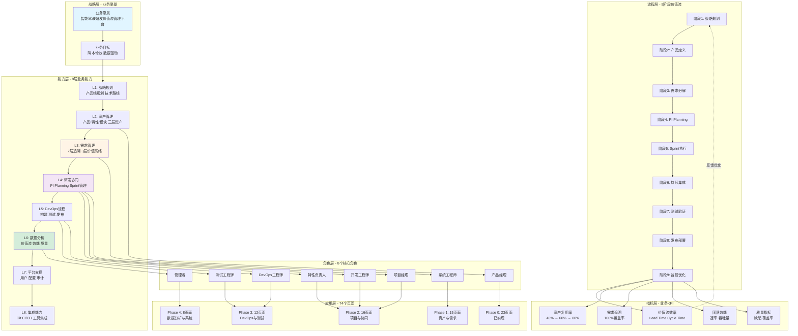

---

## 二、8层业务能力架构图

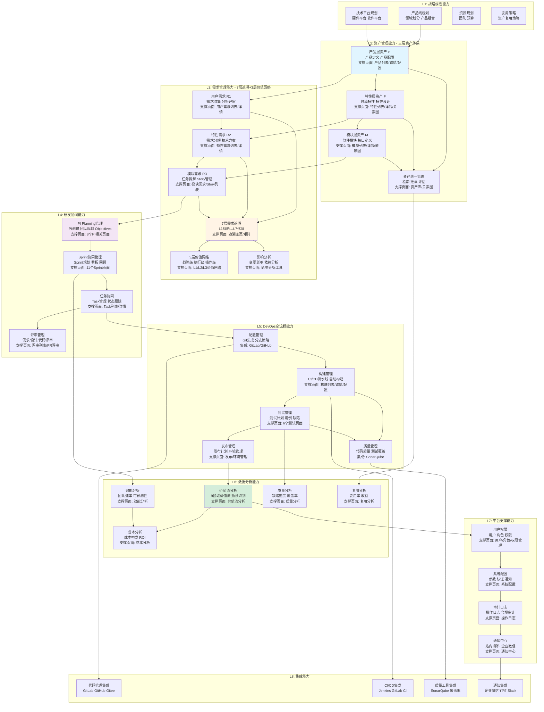

---

## 三、8角色协作架构图

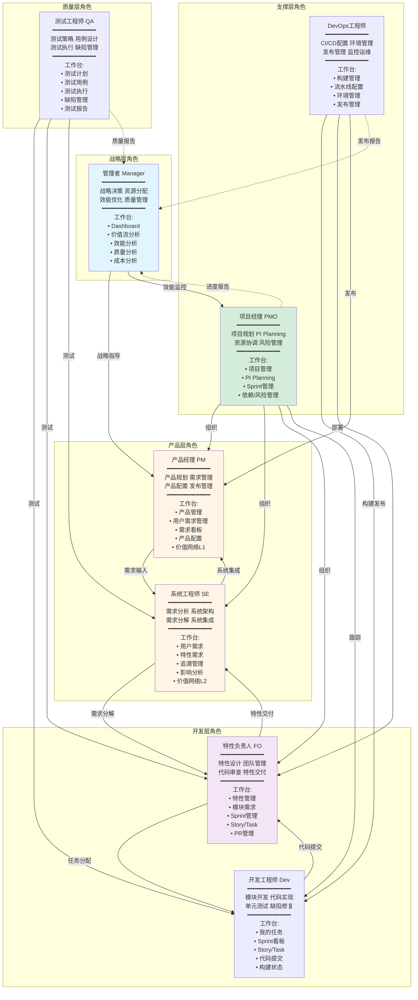

---

## 四、9阶段价值流架构图

```mermaid
graph LR
    Start([业务触发]) --> S1
    
    subgraph S1["阶段1: 战略规划<br/>━━━━━━━━━━<br/>角色: 管理者 产品线经理<br/>产出: 产品立项批准"]
        S1_1[产品线规划]
        S1_2[战略制定]
        S1_3[资源分配]
    end
    
    subgraph S2["阶段2: 产品定义<br/>━━━━━━━━━━<br/>角色: 产品经理<br/>产出: PRD 产品配置"]
        S2_1[产品创建]
        S2_2[用户需求]
        S2_3[产品配置]
    end
    
    subgraph S3["阶段3: 需求分解<br/>━━━━━━━━━━<br/>角色: 系统工程师<br/>产出: 系统设计 追溯矩阵"]
        S3_1[需求分析]
        S3_2[特性需求]
        S3_3[模块需求]
        S3_4[追溯建立]
    end
    
    subgraph S4["阶段4: PI Planning<br/>━━━━━━━━━━<br/>角色: 项目经理 所有团队<br/>产出: PI计划 依赖/风险"]
        S4_1[PI创建]
        S4_2[团队规划]
        S4_3[Objectives]
        S4_4[依赖管理]
    end
    
    subgraph S5["阶段5: Sprint执行<br/>━━━━━━━━━━<br/>角色: FO Dev QA<br/>产出: 可工作软件增量"]
        S5_1[Sprint规划]
        S5_2[Story开发]
        S5_3[Task执行]
        S5_4[代码审查]
    end
    
    subgraph S6["阶段6: 持续集成<br/>━━━━━━━━━━<br/>角色: DevOps Dev<br/>产出: 构建产物 测试报告"]
        S6_1[自动构建]
        S6_2[自动测试]
        S6_3[质量分析]
    end
    
    subgraph S7["阶段7: 测试验证<br/>━━━━━━━━━━<br/>角色: 测试工程师<br/>产出: 测试报告 缺陷列表"]
        S7_1[测试计划]
        S7_2[测试执行]
        S7_3[缺陷管理]
    end
    
    subgraph S8["阶段8: 发布部署<br/>━━━━━━━━━━<br/>角色: DevOps PMO<br/>产出: 发布版本 部署记录"]
        S8_1[发布计划]
        S8_2[部署执行]
        S8_3[发布验证]
    end
    
    subgraph S9["阶段9: 监控优化<br/>━━━━━━━━━━<br/>角色: 管理者 DevOps<br/>产出: 分析报告 改进建议"]
        S9_1[价值流分析]
        S9_2[效能分析]
        S9_3[质量分析]
        S9_4[持续改进]
    end
    
    S1 --> S2 --> S3 --> S4 --> S5 --> S6 --> S7 --> S8 --> S9
    S9 -.反馈优化.-> S1
    
    S9 --> End([持续迭代])
    
    style S1 fill:#e1f5ff
    style S3 fill:#fff4e6
    style S5 fill:#f3e5f5
    style S9 fill:#d4edda
```

### 价值流关键指标

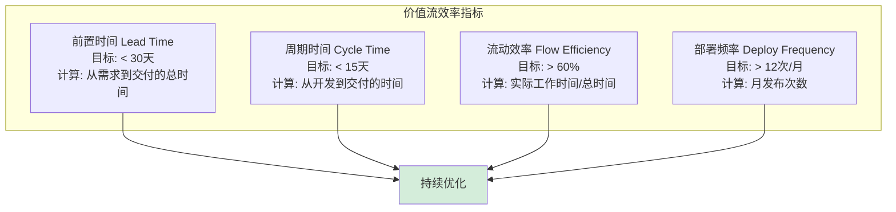

---

## 五、74页面功能架构图

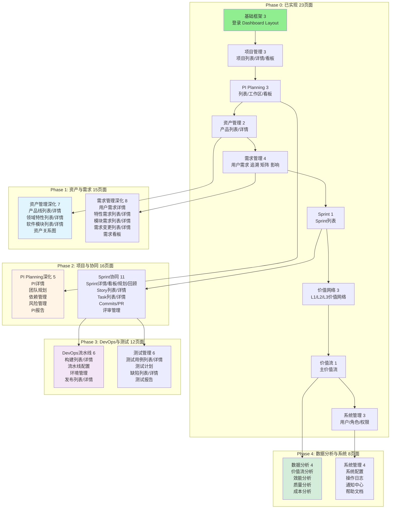

### 页面与角色映射

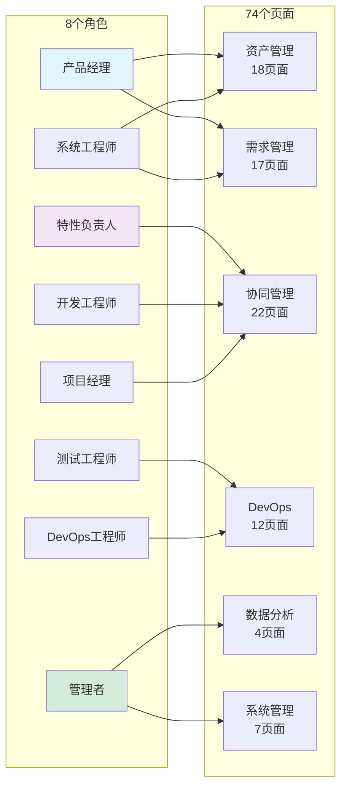

---

## 六、7层需求追溯架构图

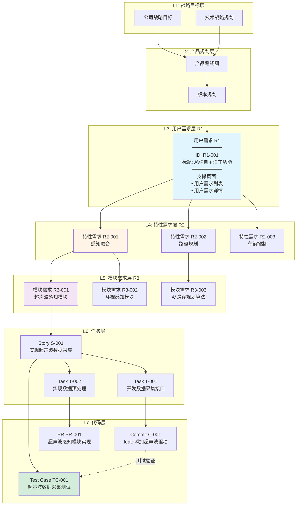

### 追溯关系类型

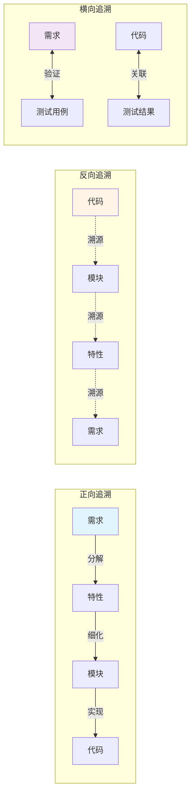

---

## 七、3层价值网络架构图

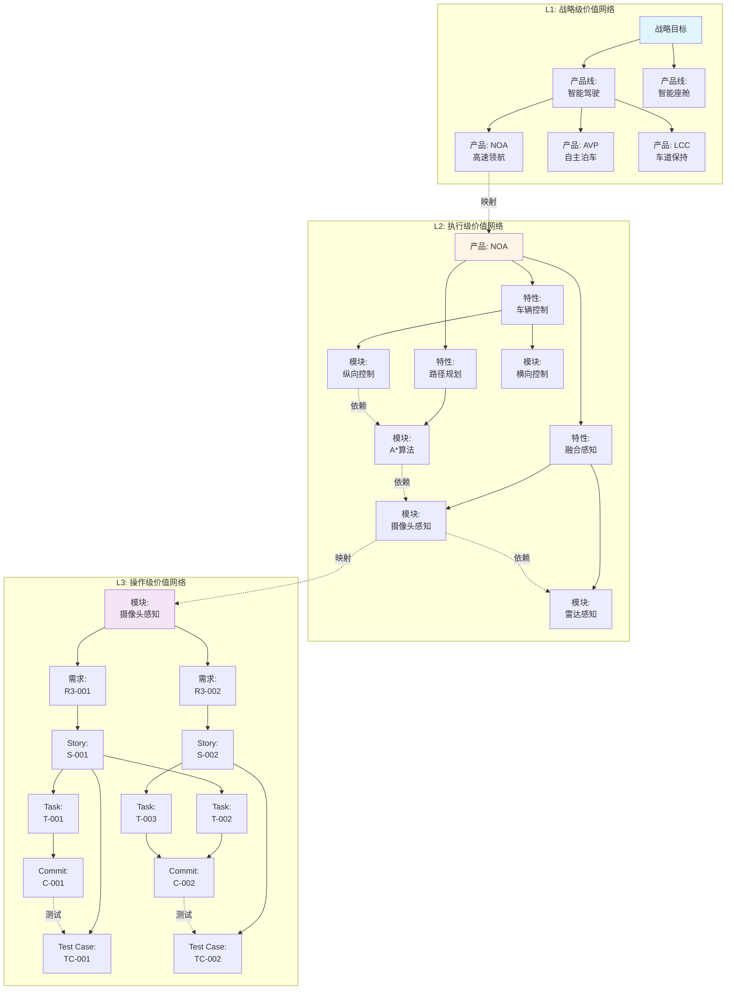

### 价值网络分析

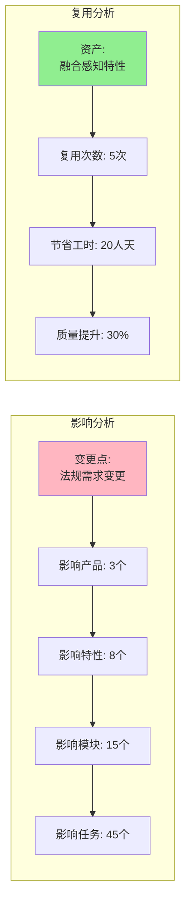

---

## 八、DevOps全流程架构图

```mermaid
graph LR
    subgraph "配置管理"
        Git[Git仓库]
        Branch[分支管理<br/>main/develop/feature]
        PR[Pull Request<br/>代码审查]
    end
    
    subgraph "持续集成 CI"
        Trigger[触发构建<br/>push/merge]
        Build[编译构建<br/>编译检查]
        UnitTest[单元测试<br/>覆盖率检查]
        Quality[代码质量<br/>SonarQube]
        Artifact[制品管理<br/>Docker镜像]
    end
    
    subgraph "持续测试"
        IntTest[集成测试<br/>API测试]
        E2ETest[E2E测试<br/>UI自动化]
        PerfTest[性能测试<br/>压力测试]
        SecTest[安全测试<br/>漏洞扫描]
    end
    
    subgraph "持续部署 CD"
        Dev[开发环境<br/>自动部署]
        Test[测试环境<br/>自动部署]
        Stage[预发布环境<br/>手动审批]
        Prod[生产环境<br/>灰度发布]
    end
    
    subgraph "监控运维"
        Monitor[监控告警<br/>Prometheus]
        Log[日志分析<br/>ELK]
        Trace[链路追踪<br/>Jaeger]
        Rollback[快速回滚<br/>一键回滚]
    end
    
    Git --> Branch --> PR
    PR --> Trigger
    
    Trigger --> Build --> UnitTest --> Quality --> Artifact
    
    Artifact --> IntTest --> E2ETest --> PerfTest --> SecTest
    
    SecTest --> Dev --> Test --> Stage --> Prod
    
    Prod --> Monitor
    Prod --> Log
    Prod --> Trace
    Monitor -.问题.-> Rollback
    
    Rollback -.回退.-> Stage
    
    style Trigger fill:#e1f5ff
    style Artifact fill:#fff4e6
    style Prod fill:#90EE90
    style Rollback fill:#FFB6C1
```

### DevOps关键指标

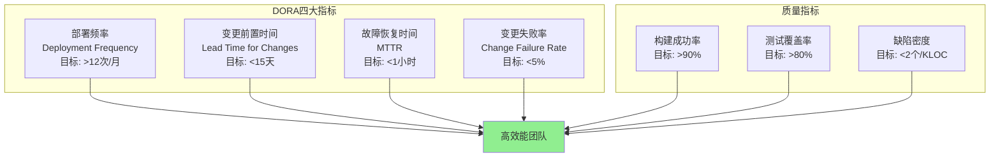

---

## 九、数据分析架构图

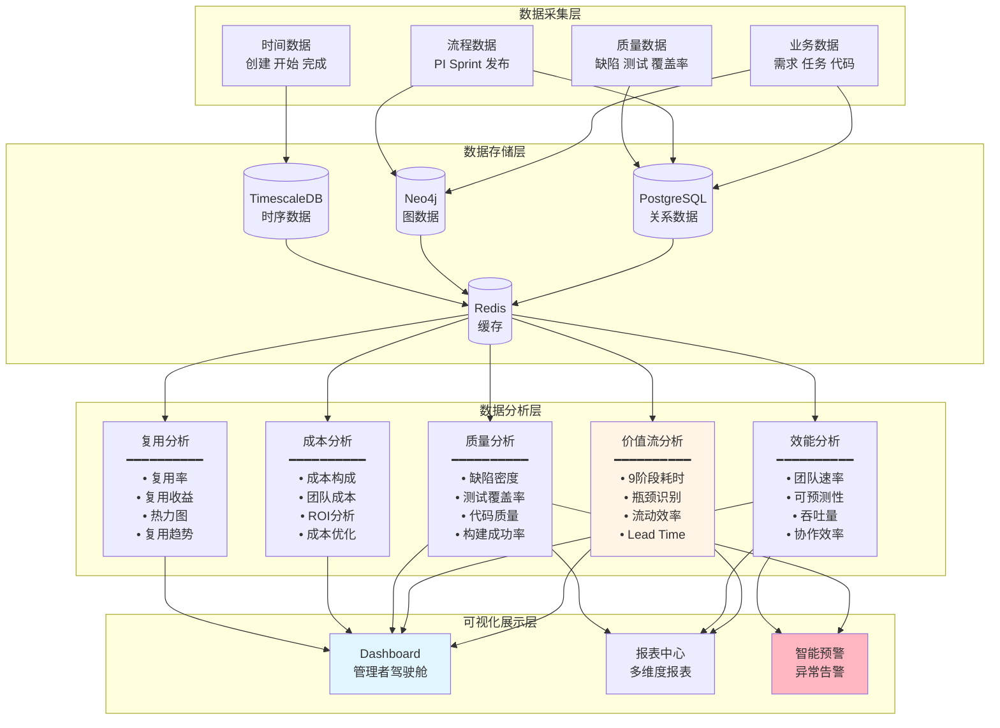

### 分析维度矩阵

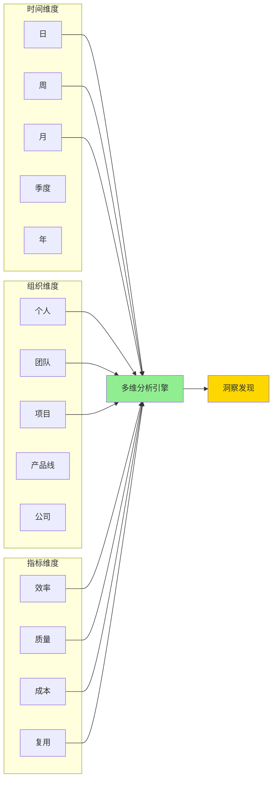

---

## 十、技术架构分层图

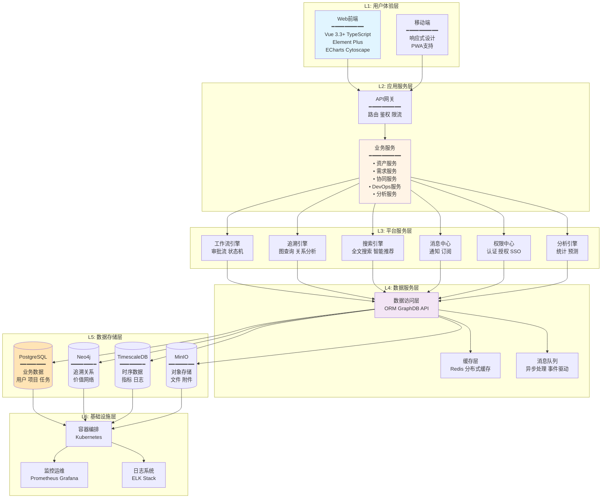

### 技术栈详细清单

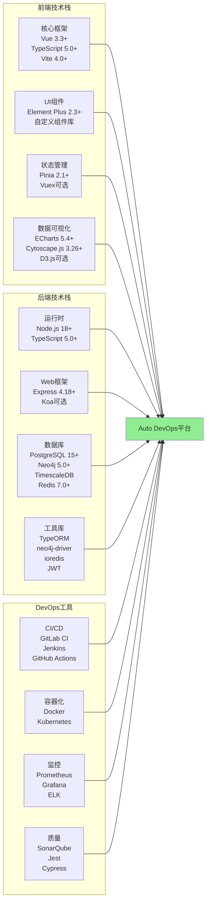

---

## 📊 架构图使用说明

### 1. 综合业务架构全景图
**用途**: 理解平台的整体架构，从战略到实施的完整视图
**适用**: 管理层、新成员、对外宣讲

### 2. 8层业务能力架构图
**用途**: 详细了解每层业务能力及其依赖关系
**适用**: 产品设计、需求分析、能力规划

### 3. 8角色协作架构图
**用途**: 理解角色职责和协作关系
**适用**: 团队协作、职责划分、培训

### 4. 9阶段价值流架构图
**用途**: 端到端业务流程和价值流转
**适用**: 流程优化、效能分析、瓶颈识别

### 5. 74页面功能架构图
**用途**: 页面功能分布和实施进度
**适用**: 开发规划、进度跟踪、验收

### 6. 7层需求追溯架构图
**用途**: 需求追溯关系和覆盖率
**适用**: 需求管理、影响分析、合规审计

### 7. 3层价值网络架构图
**用途**: 战略到执行的价值网络关系
**适用**: 影响分析、复用分析、依赖管理

### 8. DevOps全流程架构图
**用途**: CI/CD流程和质量保障
**适用**: DevOps实施、自动化配置、质量管理

### 9. 数据分析架构图
**用途**: 数据分析体系和指标看板
**适用**: 效能分析、质量分析、决策支持

### 10. 技术架构分层图
**用途**: 技术架构和技术栈选型
**适用**: 技术方案、开发实施、运维部署

---

## 🎯 关键架构决策

### 1. 分层架构设计
- **决策**: 采用清晰的分层架构（L1-L8业务能力 + L1-L6技术架构）
- **理由**: 职责清晰、易于扩展、便于维护

### 2. 角色驱动设计
- **决策**: 8个核心角色，每个角色有专属工作台
- **理由**: 提高协作效率、降低学习成本、提升用户体验

### 3. 价值流优先
- **决策**: 9阶段端到端价值流作为核心主线
- **理由**: 端到端可视化、持续优化、数据驱动

### 4. 图数据库追溯
- **决策**: 使用Neo4j存储7层追溯关系和3层价值网络
- **理由**: 复杂关系查询高效、影响分析快速、可视化友好

### 5. 微服务架构
- **决策**: 采用微服务架构，服务按业务域划分
- **理由**: 独立部署、弹性伸缩、技术异构

---

## 📚 相关文档

- **业务架构v2.0**: `Architecture/00-BUSINESS_ARCHITECTURE_V2.md`
- **领域模型设计**: `Architecture/00-DOMAIN_MODEL_DESIGN.md`
- **功能架构**: `Architecture/02-FUNCTIONAL_ARCHITECTURE.md`
- **平台架构**: `Architecture/05-PLATFORM_ARCHITECTURE_DESIGN.md`
- **价值流设计**: `../platform-rd-process/03-VALUE_STREAM_WITH_PI_PLANNING.md`
- **追溯设计**: `../platform-rd-process/03-TRACEABILITY_AND_VALUE_NETWORK.md`

---

**📄 本文档**: `Architecture/BUSINESS_ARCHITECTURE_DIAGRAM.md`  
**📅 创建日期**: 2025-01-05  
**🏷️ 版本**: v2.0  
**✅ 状态**: 完整的业务架构图（10个视角）

**🎉 10个视角的完整业务架构图，支持多场景使用！**

