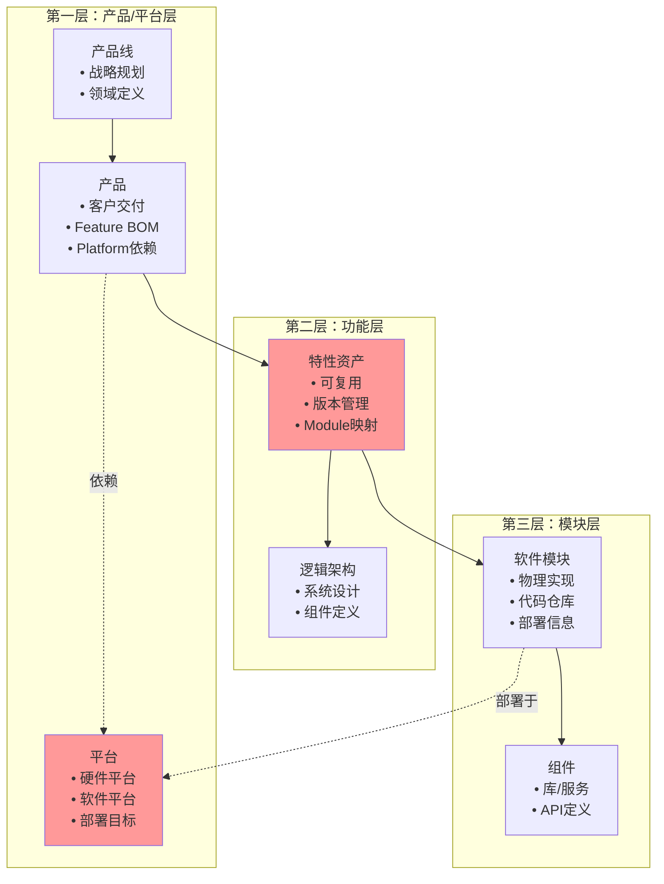
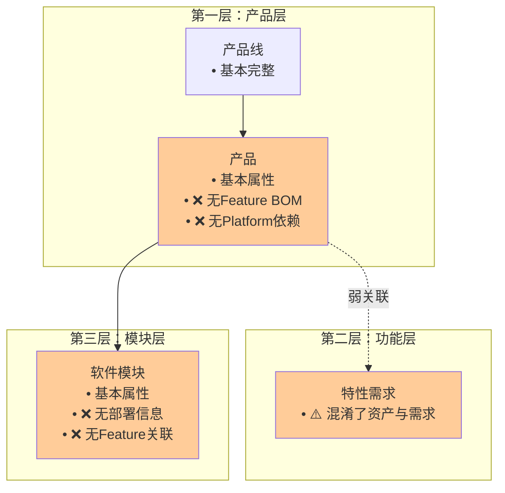
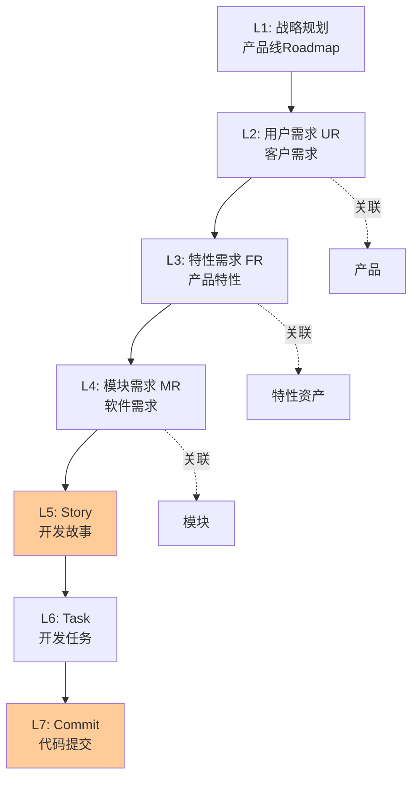
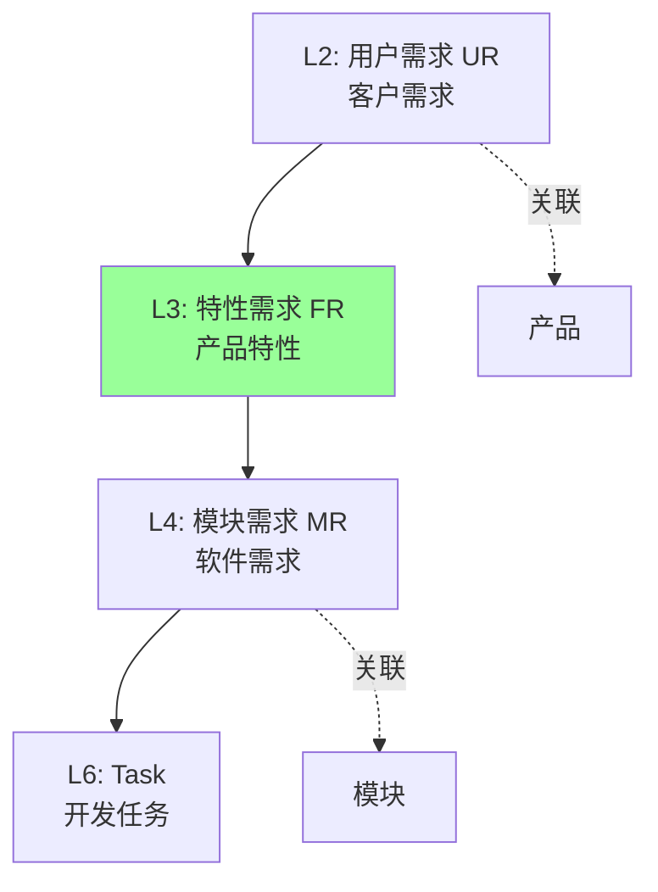
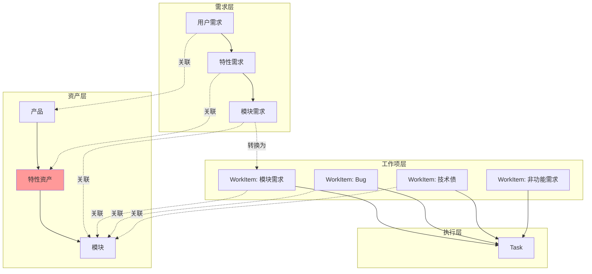
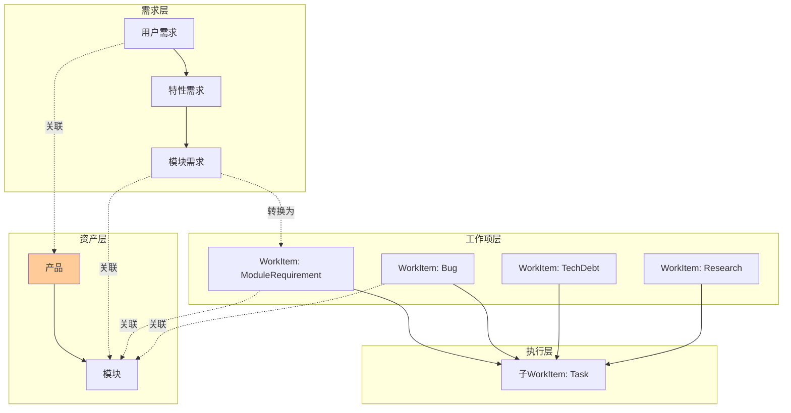
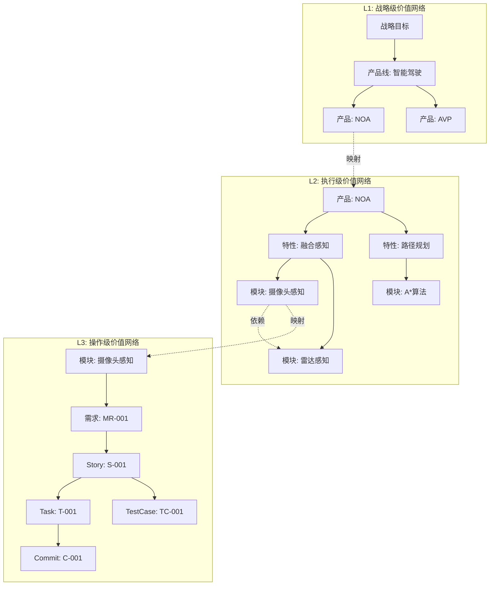

# Auto DevOps平台 - V2与V3架构综合对比分析

> **文档版本**: v1.0  
> **创建日期**: 2026-01-10  
> **目的**: 全面分析v2设计，确保v3涵盖所有核心要素

---

## 📋 目录

1. [执行摘要](#一-执行摘要)
2. [三层资产体系对比](#二-三层资产体系对比)
3. [需求追溯体系对比](#三-需求追溯体系对比)
4. [工作项与需求/资产/项目关系](#四-工作项与需求资产项目关系)
5. [三层价值网络对比](#五-三层价值网络对比)
6. [数据模型关系对比](#六-数据模型关系对比)
7. [功能架构对比](#七-功能架构对比)
8. [关键差距与改进建议](#八-关键差距与改进建议)
9. [V3补充设计方案](#九-v3补充设计方案)

---

## 一、 执行摘要

### 1.1 分析结论

| 维度 | V2设计 | V3当前状态 | 完成度 | 评级 |
|------|--------|-----------|--------|------|
| **三层资产体系** | 完整定义 | 部分实现 | 45% | ⚠️ C |
| **需求追溯体系** | 7层追溯 | 4层追溯 | 57% | ⚠️ C |
| **工作项统一模型** | Work Item体系 | 已实现 | 95% | ✅ A |
| **三层价值网络** | L1/L2/L3完整 | 未实现 | 0% | ❌ F |
| **数据关系模型** | 30+关系 | 15+关系 | 50% | ⚠️ C |
| **功能架构** | 8层能力 | 6层能力 | 75% | ⚠️ B |
| **价值流设计** | 9阶段完整 | 已实现 | 100% | ✅ A+ |
| **团队-模块绑定** | 完整设计 | 已实现 | 100% | ✅ A+ |

**总体评估**: **C+ (65%)**

### 1.2 关键发现

#### ✅ V3的亮点（超越V2）
1. **工作项统一模型** - V3的WorkItem设计更加统一和灵活
2. **价值流实现** - V3完整实现了端到端价值流可视化
3. **团队-模块责任绑定** - V3明确了团队与模块的责任关系
4. **PI Planning流程** - V3优化了PI Planning工作流
5. **前端页面实现** - V3实现了关键的业务页面

#### ⚠️ V3的重大缺失（相比V2）
1. **Feature资产实体** - 完全缺失，无法进行产品配置管理
2. **Feature BOM** - 无法描述产品由哪些特性组成
3. **Platform实体** - 缺失硬件/软件平台管理
4. **三层价值网络** - L1/L2/L3价值网络未实现
5. **需求层级** - 缺少Story层（但这是V3有意简化的）
6. **Feature-Module关系** - 无法追溯特性到模块实现

#### 🎯 核心问题
**V3缺少了V2中最核心的"资产复用"理念的实现基础**：
- 没有Feature资产 → 无法复用功能
- 没有Feature BOM → 无法配置产品
- 没有Platform → 无法软硬件解耦
- 没有价值网络 → 无法可视化业务架构

---

## 二、 三层资产体系对比

### 2.1 V2的三层资产设计



### 2.2 V3的当前实现



### 2.3 详细对比表

#### 2.3.1 产品/平台层

| 实体 | V2设计 | V3实现 | 完成度 | 关键差距 |
|------|--------|--------|--------|----------|
| **ProductLine** | ✅ 完整 | ✅ 完整 | 100% | 无 |
| **Product** | • type<br/>• domain<br/>• featureBOM[]<br/>• platformIds[]<br/>• roadmap | • 基本属性<br/>• ❌ 无featureBOM<br/>• ❌ 无platformIds<br/>• ❌ 无roadmap | 60% | **Feature BOM是核心缺失** |
| **Platform** | ✅ 完整设计<br/>• 硬件平台<br/>• 软件平台<br/>• 部署目标 | ❌ **完全缺失** | 0% | **无法软硬件解耦** |
| **ProductVersion** | ✅ 完整 | ✅ 基本完整 | 85% | features是文本非实体ID |

**产品层完成度**: **61%**

#### 2.3.2 功能层

| 实体 | V2设计 | V3实现 | 完成度 | 关键差距 |
|------|--------|--------|--------|----------|
| **Feature（资产）** | ✅ 独立实体<br/>• 版本管理<br/>• 可复用<br/>• modules[]<br/>• dependencies[] | ❌ **完全缺失** | 0% | **无法进行资产复用**<br/>**无法配置产品** |
| **FeatureRequirement（需求）** | ✅ 需求实体<br/>• 关联Feature<br/>• 验收标准 | ✅ 实现为Requirement | 90% | 未关联Feature资产 |
| **LogicalArchitecture** | ✅ 逻辑架构设计 | ❌ 未实现 | 0% | 缺少系统设计层 |

**功能层完成度**: **30%**

#### 2.3.3 模块层

| 实体 | V2设计 | V3实现 | 完成度 | 关键差距 |
|------|--------|--------|--------|----------|
| **Module** | • 基本属性<br/>• deployTarget<br/>• platformId<br/>• techStack<br/>• hardwareReq<br/>• featureIds[] | • 基本属性<br/>• ❌ 无deployTarget<br/>• ❌ 无platformId<br/>• ❌ 无techStack<br/>• ❌ 无featureIds | 55% | **无法追溯到Feature**<br/>**无部署信息** |
| **Component** | ✅ 组件设计 | ⚠️ 简单实现 | 40% | 缺少详细设计 |
| **ModuleRequirement** | ✅ 完整 | ✅ 实现为Requirement | 100% | 无 |

**模块层完成度**: **65%**

### 2.4 关键差距总结

#### P0 - 严重缺失（阻碍核心能力）

| 缺失项 | 影响 | 典型场景 | 优先级 |
|--------|------|----------|--------|
| **Feature资产实体** | 无法复用功能<br/>无法配置产品<br/>无法版本管理 | "AVP特性被5个产品使用，如何统一升级？" | 🔥 P0 |
| **Product.featureBOM** | 无法描述产品组成<br/>无法支持变体配置 | "旗舰版和标准版有哪些功能差异？" | 🔥 P0 |
| **Platform实体** | 软硬件耦合<br/>无法多平台部署 | "这个模块能否移植到Orin-X平台？" | 🔥 P0 |
| **Feature→Module映射** | 无法追溯实现<br/>无法影响分析 | "AVP特性修改会影响哪些模块？" | 🔥 P0 |

---

## 三、 需求追溯体系对比

### 3.1 V2的7层需求追溯



### 3.2 V3的4层需求追溯（简化版）



### 3.3 对比分析

| 层级 | V2设计 | V3实现 | 变更原因 | 影响评估 |
|------|--------|--------|----------|----------|
| **L1: 战略规划** | ✅ ProductLine Roadmap | ⚠️ 隐含在ProductLine | V3简化 | 影响：战略追溯不够明确 |
| **L2: 用户需求** | ✅ UR | ✅ UR | 一致 | 完整 |
| **L3: 特性需求** | ✅ FR（关联Feature资产） | ✅ FR（❌未关联Feature） | V3缺失Feature | **影响：无法追溯到资产** |
| **L4: 模块需求** | ✅ MR | ✅ MR | 一致 | 完整 |
| **L5: Story** | ✅ Story | ❌ **取消** | V3有意简化 | 影响：敏捷开发细粒度降低 |
| **L6: Task** | ✅ Task | ✅ Task | 一致 | 完整 |
| **L7: Commit** | ✅ Commit | ❌ **未实现** | V3未实现 | 影响：代码追溯不完整 |

**追溯完整度**: 
- V2: 100% (7/7层)
- V3: 57% (4/7层)

### 3.4 追溯场景对比

#### 场景1: 用户需求到代码实现

**V2追溯路径**:
```
UR-001 → FR-001 → Feature(AVP) → Module(ParkingPerception) → MR-001 → Story-001 → Task-001 → Commit-abc123
        关联Product         关联Feature资产         实现Module
```

**V3追溯路径**:
```
UR-001 → FR-001 → ❌ ？？？ → Module(ParkingPerception) → MR-001 → Task-001 → ❌ ？？？
        关联Product                                实现Module
```

**V3的断点**:
1. ❌ FR无法追溯到Feature资产
2. ❌ Task无法追溯到Commit

#### 场景2: Feature到产品配置

**V2追溯路径**:
```
Feature(AVP) → Product.featureBOM → 产品1(标配), 产品2(选配), 产品3(标配)
```

**V3追溯路径**:
```
❌ Feature不存在 → 无法查询
```

---

## 四、 工作项与需求/资产/项目关系

### 4.1 V2的Work Item设计

V2在v3.0版本中引入了Work Item统一管理体系：

```typescript
// V2的WorkItem类型定义
type WorkItemType = 
  | 'module_requirement'  // 模块需求
  | 'bugfix'              // 缺陷修复
  | 'tech_debt'           // 技术债
  | 'non_functional'      // 非功能需求
  | 'optimization'        // 优化改进
  | 'research'            // 技术调研
```

**V2的工作项流转**:
```
工作项（任意类型） → 拆分为Task → 分配到Sprint → 团队执行
```

### 4.2 V3的Work Item实现

V3完整实现了WorkItem作为基础模型：

```typescript
// V3的WorkItem定义（Architecture/v3/04-task/TASK_ARCHITECTURE.md）
interface WorkItem {
  id: string;
  type: WorkItemType;
  title: string;
  status: WorkItemStatus;
  
  // 层级关系
  parentWorkItemId?: string;     // 父工作项
  childWorkItemIds: string[];    // 子工作项列表
  
  // 关联关系
  moduleId?: string;             // 关联模块
  requirementId?: string;        // 关联需求
  sprintId?: string;             // 关联Sprint
  teamId?: string;               // 负责团队
  
  // 工作量
  storyPoints?: number;
  estimatedHours?: number;
}

type WorkItemType = 
  | 'Task'                 // 任务
  | 'ModuleRequirement'    // 模块需求
  | 'Bug'                  // 缺陷
  | 'TechDebt'             // 技术债
  | 'Research'             // 调研
  | 'Subtask'              // 子任务
  | 'TechnicalTask'        // 技术任务
  | 'TestTask'             // 测试任务
```

### 4.3 V2 vs V3 Work Item对比

| 维度 | V2设计 | V3实现 | 评估 |
|------|--------|--------|------|
| **统一模型** | ✅ WorkItem | ✅ WorkItem | 一致 |
| **类型支持** | 6种类型 | 8种类型 | ✅ V3更丰富 |
| **层级关系** | ⚠️ 未明确 | ✅ parent/child | ✅ V3更清晰 |
| **与需求关联** | ✅ | ✅ requirementId | 一致 |
| **与模块关联** | ✅ moduleId | ✅ moduleId | 一致 |
| **与团队关联** | ✅ 团队-模块绑定 | ✅ teamId | 一致 |
| **与Sprint关联** | ✅ | ✅ sprintId | 一致 |
| **拆分机制** | WorkItem→Task | WorkItem→子WorkItem | ✅ V3更灵活 |

**评估**: **V3的WorkItem设计优于V2** ✅

### 4.4 Work Item与三层资产的关系

#### V2的设计



**V2的关系**:
- WorkItem ↔ Module: 通过moduleId关联
- WorkItem ↔ Requirement: 模块需求类型的WorkItem关联MR
- WorkItem ↔ Feature: **通过Module间接关联**（Module.featureIds[]）
- WorkItem ↔ Product: **通过Feature间接关联**（Product.featureBOM[]）

#### V3的当前实现



**V3的关系**:
- ✅ WorkItem ↔ Module: 通过moduleId关联
- ✅ WorkItem ↔ Requirement: 通过requirementId关联
- ❌ WorkItem ↔ Feature: **断链**（Feature不存在）
- ❌ WorkItem ↔ Product: **弱关联**（需通过Module.productId）

### 4.5 关键差距

| 关系 | V2 | V3 | 差距 |
|------|----|----|------|
| WorkItem → Module | ✅ | ✅ | 无 |
| WorkItem → Feature | ✅ 间接 | ❌ 断链 | **无法追溯到Feature** |
| WorkItem → Product | ✅ 间接 | ⚠️ 弱关联 | **追溯路径不完整** |
| WorkItem → Platform | ✅ 间接 | ❌ 断链 | **无法评估平台影响** |

---

## 五、 三层价值网络对比

### 5.1 V2的三层价值网络设计

V2完整定义了三层价值网络：



### 5.2 V3的当前实现

❌ **V3完全未实现三层价值网络**

V3在`Architecture/v3`中没有对应的价值网络设计文档或功能实现。

### 5.3 详细对比

| 价值网络层 | V2设计 | V3实现 | 页面支持 | 数据支持 |
|-----------|--------|--------|----------|----------|
| **L1: 战略级** | ✅ 完整设计<br/>• 战略目标<br/>• 产品线<br/>• 产品 | ❌ 未实现 | ❌ 无 | ❌ 无 |
| **L2: 执行级** | ✅ 完整设计<br/>• 产品<br/>• Feature<br/>• Module<br/>• 依赖关系 | ❌ 未实现 | ❌ 无 | ❌ 无 |
| **L3: 操作级** | ✅ 完整设计<br/>• Module<br/>• 需求<br/>• Story<br/>• Task<br/>• Commit<br/>• TestCase | ❌ 未实现 | ❌ 无 | ⚠️ 部分有 |

**实现度**: **0%**

### 5.4 价值网络的业务价值

V2设计的价值网络可以支持以下关键场景：

#### 场景1: 影响分析
```
需求变更 → 影响产品？ → 影响Feature？ → 影响Module？ → 影响Task？
```

#### 场景2: 复用分析
```
Feature(AVP) → 被哪些Product使用？ → 复用次数？ → 节省工时？
```

#### 场景3: 战略对齐
```
战略目标 → 产品线Roadmap → 产品Version → Feature开发 → 进度？
```

**V3当前无法支持这些场景** ❌

---

## 六、 数据模型关系对比

### 6.1 V2定义的核心关系（30+）

#### 资产层关系

| 关系 | 基数 | V2设计 | V3实现 | 状态 |
|------|------|--------|--------|------|
| ProductLine → Product | 1:N | ✅ | ✅ | ✅ 完整 |
| Product → Feature BOM | 1:N | ✅ | ❌ | ❌ **缺失** |
| Product → Platform | M:N | ✅ | ❌ | ❌ **缺失** |
| Product → Module | 1:N | ✅ | ✅ | ✅ 完整 |
| Feature → Module | M:N | ✅ | ❌ | ❌ **缺失** |
| Feature → Feature | M:N | ✅ | ❌ | ❌ **缺失** |
| Module → Platform | M:1 | ✅ | ❌ | ❌ **缺失** |
| Module → Component | 1:N | ✅ | ⚠️ | ⚠️ 简单 |

**资产层完成度**: **37.5%** (3/8)

#### 需求层关系

| 关系 | 基数 | V2设计 | V3实现 | 状态 |
|------|------|--------|--------|------|
| UR → FR | 1:N | ✅ | ✅ | ✅ 完整 |
| FR → MR | 1:N | ✅ | ✅ | ✅ 完整 |
| MR → Story | 1:N | ✅ | ❌ | ❌ V3取消 |
| Story → Task | 1:N | ✅ | ❌ | ❌ V3取消 |
| MR → Task | 1:N | V2有Story | ✅ | ✅ V3直连 |
| UR → Product | N:1 | ✅ | ✅ | ✅ 完整 |
| FR → Feature | N:1 | ✅ | ❌ | ❌ **缺失** |
| MR → Module | N:1 | ✅ | ✅ | ✅ 完整 |

**需求层完成度**: **62.5%** (5/8)

#### 执行层关系

| 关系 | 基数 | V2设计 | V3实现 | 状态 |
|------|------|--------|--------|------|
| Task → Commit | 1:N | ✅ | ❌ | ❌ **缺失** |
| Commit → Build | 1:1 | ✅ | ❌ | ❌ **缺失** |
| Build → Artifact | 1:1 | ✅ | ✅ | ✅ 完整 |
| TestCase → MR | N:1 | ✅ | ✅ | ✅ 完整 |
| Defect → MR | N:1 | ✅ | ✅ | ✅ 完整 |
| Sprint → MR | N:N | ✅ | ✅ | ✅ 完整 |

**执行层完成度**: **66.7%** (4/6)

#### 项目层关系

| 关系 | 基数 | V2设计 | V3实现 | 状态 |
|------|------|--------|--------|------|
| VehicleProject → DomainProject | 1:N | ✅ | ✅ | ✅ 完整 |
| DomainProject → PI | 1:N | ✅ | ✅ | ✅ 完整 |
| PI → Sprint | 1:N | ✅ | ✅ | ✅ 完整 |
| PI → PIObjective | 1:N | ✅ | ✅ | ✅ 完整 |
| PIObjective → FR | N:N | ✅ | ✅ | ✅ 完整 |

**项目层完成度**: **100%** (5/5)

### 6.2 关系完整度总览

```
层级           │ V2关系数 │ V3实现数 │ 完成度 │ 评级
──────────────┼─────────┼─────────┼───────┼─────
资产层         │    8    │    3    │ 37.5% │  D
需求层         │    8    │    5    │ 62.5% │  C
执行层         │    6    │    4    │ 66.7% │  C+
项目层         │    5    │    5    │  100% │  A+
──────────────┼─────────┼─────────┼───────┼─────
**总体**       │  **27** │  **17** │**63%**│ **C**
```

### 6.3 关键断链分析

#### 断链1: 需求 → Feature资产

```
当前: FR (特性需求) ❌ → Feature资产（不存在）
影响: 无法追溯需求到可复用资产
场景: "ACC需求在其他产品中是否已实现？"
```

#### 断链2: Feature → Module

```
当前: ❌ Feature不存在 → Module
影响: 无法知道Feature由哪些模块实现
场景: "AVP特性修改会影响哪些模块和团队？"
```

#### 断链3: Product → Feature

```
当前: Product ❌ → Feature BOM（不存在）
影响: 无法管理产品配置
场景: "旗舰版和标准版有什么功能差异？"
```

#### 断链4: Module → Platform

```
当前: Module ❌ → Platform（不存在）
影响: 软硬件耦合，无法多平台部署
场景: "这个模块能否移植到Horizon J6M芯片？"
```

#### 断链5: Task → Commit

```
当前: Task ❌ → Commit（未实现）
影响: 无法精确追溯代码
场景: "这个任务修改了哪些代码文件？"
```

---

## 七、 功能架构对比

### 7.1 V2的8层业务能力

```
L1: 战略规划能力
  - 产品线规划
  - 技术平台规划
  - 资源规划
  - 复用策略

L2: 资产管理能力 - 三层资产体系
  - 产品层资产（Product, Platform）
  - 特性层资产（Feature, LogicalArch）
  - 模块层资产（Module, Component）
  - 资产统一管理（检索, 推荐, 评估）

L3: 需求管理能力 - 7层追溯+3层价值网络
  - 7层需求追溯（L1→L7）
  - 用户需求/特性需求/模块需求
  - 3层价值网络（L1/L2/L3）
  - 影响分析

L4: 研发协同能力
  - PI Planning管理
  - Sprint协同管理
  - 任务协同
  - 评审管理

L5: DevOps全流程能力
  - 配置管理
  - 构建管理
  - 测试管理
  - 发布管理
  - 质量管理

L6: 数据分析能力
  - 价值流分析
  - 效能分析
  - 质量分析
  - 成本分析
  - 复用分析

L7: 平台支撑能力
  - 用户权限
  - 系统配置
  - 审计日志
  - 通知中心

L8: 集成能力
  - 代码管理集成
  - CI/CD集成
  - 质量工具集成
  - 通知集成
```

### 7.2 V3的当前实现

```
✅ L1: 战略规划能力（70%）
  ✅ 产品线规划
  ❌ 技术平台规划（Platform缺失）
  ⚠️ 资源规划（基本）
  ❌ 复用策略（Feature缺失）

⚠️ L2: 资产管理能力（45%）
  ✅ 产品管理
  ❌ 平台管理（Platform缺失）
  ❌ 特性资产（Feature缺失）
  ✅ 模块管理
  ⚠️ 资产统一管理（简单）

⚠️ L3: 需求管理能力（60%）
  ✅ 三层需求（UR/FR/MR）
  ✅ 需求追溯
  ❌ 价值网络（未实现）
  ⚠️ 影响分析（简单）

✅ L4: 研发协同能力（95%）
  ✅ PI Planning管理
  ✅ Sprint协同管理
  ✅ 任务协同
  ✅ WorkItem管理

⚠️ L5: DevOps能力（70%）
  ✅ 配置管理（前端）
  ✅ 构建管理（前端）
  ✅ 测试管理（前端）
  ✅ 发布管理（前端）
  ⚠️ 质量管理（简单）

✅ L6: 数据分析能力（80%）
  ✅ 价值流分析（页面）
  ✅ 效能分析（页面）
  ✅ 质量分析（页面）
  ⚠️ 成本分析（简单）
  ❌ 复用分析（Feature缺失）

✅ L7: 平台支撑能力（85%）
  ✅ 用户权限（前端）
  ✅ 系统配置（前端）
  ✅ 通知中心（前端）
  ⚠️ 审计日志（简单）

⚠️ L8: 集成能力（40%）
  ⚠️ 代码管理集成（前端）
  ⚠️ CI/CD集成（前端）
  ❌ 质量工具集成
  ❌ 通知集成
```

### 7.3 能力完成度对比

| 能力层 | V2设计 | V3实现 | 完成度 | 评级 | 关键差距 |
|--------|--------|--------|--------|------|----------|
| L1: 战略规划 | 完整 | 部分 | 70% | B | Platform、复用策略 |
| L2: 资产管理 | 完整 | 部分 | 45% | C- | **Feature、Platform** |
| L3: 需求管理 | 完整 | 部分 | 60% | C | **价值网络** |
| L4: 研发协同 | 完整 | 完整 | 95% | A | 无 |
| L5: DevOps | 完整 | 前端 | 70% | B | 后端集成 |
| L6: 数据分析 | 完整 | 前端 | 80% | B+ | 复用分析 |
| L7: 平台支撑 | 完整 | 前端 | 85% | B+ | 审计深度 |
| L8: 集成 | 完整 | 简单 | 40% | D | 工具集成 |

**总体能力完成度**: **68%** (C+)

---

## 八、 关键差距与改进建议

### 8.1 P0级差距（阻碍核心能力）

#### 差距1: Feature资产体系缺失 🔥

**影响**:
- ❌ 无法进行资产复用
- ❌ 无法管理产品配置
- ❌ 无法追溯特性到模块
- ❌ 无法评估复用收益

**典型场景受阻**:
1. "AVP特性在5个产品中使用，如何统一升级？" - **无法回答**
2. "旗舰版比标准版多了哪些功能？" - **无法回答**
3. "这个Feature依赖哪些其他Feature？" - **无法回答**
4. "Feature A修改会影响哪些产品和模块？" - **无法分析**

**业务价值损失**:
- 无法实现"资产复用率60%"的目标
- 产品配置管理完全缺失
- 研发效率提升受限

#### 差距2: Platform实体缺失 🔥

**影响**:
- ❌ 软硬件耦合，无法解耦
- ❌ 无法支持多平台部署
- ❌ 无法管理平台依赖
- ❌ 无法进行平台迁移评估

**典型场景受阻**:
1. "这个模块能否移植到Orin-X平台？" - **无法回答**
2. "QNX升级到7.1会影响哪些模块？" - **无法分析**
3. "产品A需要哪些硬件平台支持？" - **无法查询**

**业务价值损失**:
- 无法支持产品线工程的平台化策略
- 平台迁移成本和风险不可控

#### 差距3: Product → Feature BOM缺失 🔥

**影响**:
- ❌ 无法描述产品由哪些特性组成
- ❌ 无法支持产品变体配置
- ❌ 无法管理标配/选配
- ❌ 无法进行产品对比

**典型场景受阻**:
1. "标准版、高配版、旗舰版的功能差异？" - **无法对比**
2. "产品A包含哪些Feature？" - **无法查询**
3. "ACC特性是标配还是选配？" - **无法判断**

**业务价值损失**:
- 产品管理和配置能力缺失
- 无法支持个性化配置
- 影响产品规划和销售

#### 差距4: Feature → Module关系缺失 🔥

**影响**:
- ❌ 无法追溯Feature到实现
- ❌ 无法进行Feature级影响分析
- ❌ 无法评估Feature开发工作量
- ❌ 无法分配Feature到团队

**典型场景受阻**:
1. "AVP特性由哪些模块实现？" - **无法查询**
2. "修改AVP会影响哪些团队？" - **无法分析**
3. "实现这个Feature需要开发哪些模块？" - **无法规划**

**业务价值损失**:
- Feature级的项目管理不可行
- 影响分析和风险评估不完整
- 团队协作规划困难

### 8.2 P1级差距（重要但可延后）

#### 差距5: 三层价值网络未实现 ⚠️

**影响**:
- 无法可视化业务架构
- 影响分析不够直观
- 战略对齐度不可见

**建议**: Phase 2实现

#### 差距6: Story层取消 ⚠️

**影响**:
- 敏捷开发细粒度降低
- 从MR直接到Task，跨度较大

**建议**: 可接受，WorkItem模型已补偿

#### 差距7: Commit实体未实现 ⚠️

**影响**:
- Task到代码的追溯断链
- 代码变更影响分析不完整

**建议**: Phase 2实现

### 8.3 改进优先级矩阵

```
              │ 业务价值 │ 技术复杂度 │ 优先级 │ 建议阶段
──────────────┼─────────┼───────────┼───────┼─────────
Feature资产    │  🔥🔥🔥🔥🔥 │     高     │  P0    │ 立即
Platform实体   │  🔥🔥🔥🔥   │     中     │  P0    │ 立即
Feature BOM    │  🔥🔥🔥🔥🔥 │     中     │  P0    │ 立即
Feature→Module │  🔥🔥🔥🔥   │     低     │  P0    │ 立即
价值网络       │  🔥🔥🔥    │     高     │  P1    │ Phase 2
Commit实体     │  🔥🔥     │     中     │  P1    │ Phase 2
LogicalArch    │  🔥🔥     │     高     │  P2    │ Phase 3
```

---

## 九、 V3补充设计方案

### 9.1 Feature资产体系补充设计

#### 9.1.1 Feature实体定义

```typescript
/**
 * 特性资产 (Feature Asset)
 * 
 * 定位: 可复用的功能单元，是产品的组成部分
 * 生命周期: 独立版本演进，可跨产品复用
 */
interface Feature {
  // 基本信息
  id: string;                    // FEAT-AVP-001
  code: string;                  // AVP
  name: string;                  // 自动代客泊车
  version: string;               // 1.5.0
  
  // 分类
  type: FeatureType;             // Functional | NonFunctional
  domain: Domain;                // ADAS | IVI | BCM
  category: FeatureCategory;     // Common | Variant | Custom
  
  // 复杂度与规模
  complexity: Complexity;        // High | Medium | Low
  estimatedStoryPoints: number;  // 估算工作量（SP）
  
  // 配置属性
  isStandard: boolean;           // 是否可作为标配
  isOptional: boolean;           // 是否可作为选配
  isConfigurable: boolean;       // 是否支持配置
  
  // 依赖与冲突
  dependencies: FeatureDependency[];  // 依赖的其他Feature
  conflicts: string[];           // 冲突的Feature ID
  
  // 实现映射
  moduleIds: string[];           // 实现此Feature的Module列表
  logicalComponents: string[];   // 逻辑组件（可选）
  
  // 技术约束
  platformRequirements?: string[];  // 需要的Platform
  hardwareRequirements?: {
    sensors?: string[];          // 需要的传感器
    computePower?: string;       // 算力要求
  };
  
  // 质量属性
  performanceRequirements?: {
    latency?: string;            // 延迟要求
    throughput?: string;         // 吞吐量要求
    accuracy?: string;           // 准确率要求
  };
  
  // 复用信息
  reuseCount: number;            // 被复用次数
  products: string[];            // 使用此Feature的产品ID
  
  // 管理信息
  owner: string;                 // 特性负责人
  ownerTeam: string;             // 负责团队
  status: AssetStatus;           // Active | Deprecated | Draft
  maturityLevel: MaturityLevel;  // 成熟度级别
  
  // 版本历史
  versionHistory: FeatureVersion[];
  
  // 关联
  relatedRequirements: string[]; // 关联的FR ID
  
  // 元数据
  createdAt: Date;
  updatedAt: Date;
  createdBy: string;
}

// Feature类型
enum FeatureType {
  Functional = 'functional',         // 功能型特性
  NonFunctional = 'non_functional'   // 非功能型特性
}

// Feature类别
enum FeatureCategory {
  Common = 'common',      // 通用特性（所有产品共享）
  Variant = 'variant',    // 变体特性（可配置）
  Custom = 'custom'       // 定制特性（特定产品）
}

// 复杂度
enum Complexity {
  High = 'high',
  Medium = 'medium',
  Low = 'low'
}

// 成熟度级别
enum MaturityLevel {
  Prototype = 'prototype',  // 原型
  Alpha = 'alpha',          // Alpha
  Beta = 'beta',            // Beta
  GA = 'ga',                // General Availability
  Mature = 'mature',        // 成熟
  Legacy = 'legacy'         // 遗留
}

// Feature依赖
interface FeatureDependency {
  featureId: string;
  dependencyType: 'require' | 'optional' | 'enhance';
  reason?: string;
}

// Feature版本
interface FeatureVersion {
  version: string;
  releaseDate: Date;
  changes: string;
  status: 'draft' | 'released' | 'deprecated';
}
```

#### 9.1.2 Feature BOM定义

```typescript
/**
 * Feature BOM (Bill of Materials)
 * 
 * 定义产品包含哪些Feature，以及每个Feature的配置规则
 */
interface FeatureBOM {
  id: string;
  productId: string;             // 所属产品
  featureId: string;             // Feature ID
  
  // 配置规则
  isStandard: boolean;           // 是否标配
  isOptional: boolean;           // 是否可选配
  isDefault: boolean;            // 是否默认启用
  
  // 变体规则
  variantRules?: VariantRule[];  // 变体规则
  
  // 配置参数
  configurationParameters?: Record<string, any>;  // 配置参数
  
  // 优先级
  priority: number;              // 优先级（用于冲突解决）
  
  // 版本约束
  versionConstraint?: string;    // Feature版本约束（如：>=1.5.0）
  
  // 许可与授权
  requiresLicense?: boolean;     // 是否需要许可
  licenseType?: string;          // 许可类型
  
  createdAt: Date;
  updatedAt: Date;
}

// 变体规则
interface VariantRule {
  condition: string;             // 条件表达式
  action: 'include' | 'exclude'; // 动作
  reason?: string;               // 原因说明
}

// 示例：变体规则
const variantRuleExample: VariantRule = {
  condition: "vehicleModel === '旗舰版' AND region === 'CN'",
  action: 'include',
  reason: '旗舰版中国市场标配AVP'
};
```

#### 9.1.3 Feature与其他实体的关系

```typescript
// 1. Feature → Module (M:N)
interface Feature {
  moduleIds: string[];  // 实现此Feature的Module
}

interface Module {
  featureIds: string[];  // 支持哪些Feature
}

// 2. Feature → Feature (依赖/冲突)
interface Feature {
  dependencies: FeatureDependency[];
  conflicts: string[];
}

// 3. Product → Feature (通过BOM)
interface Product {
  featureBOM: FeatureBOM[];  // 产品包含的Feature
}

// 4. FeatureRequirement → Feature
interface FeatureRequirement extends Requirement {
  relatedFeatureId?: string;  // 关联的Feature资产
}

// 5. Feature → Platform
interface Feature {
  platformRequirements?: string[];  // 需要的Platform
}
```

### 9.2 Platform实体补充设计

#### 9.2.1 Platform实体定义

```typescript
/**
 * 平台 (Platform)
 * 
 * 定义硬件平台和软件平台，支持软硬件解耦
 */
interface Platform {
  // 基本信息
  id: string;                // PLT-ORIN-X
  code: string;              // ORIN-X
  name: string;              // NVIDIA Orin-X
  version: string;           // 1.0
  
  // 分类
  type: PlatformType;        // Hardware | Software | Development
  category: PlatformCategory; // Chip | OS | Middleware | Framework
  
  // 硬件平台（type=Hardware）
  hardwareSpecs?: {
    architecture: string;    // ARM64 | x86_64
    cpu: string;             // Cortex-A78AE
    gpu?: string;            // Ampere GPU
    computePower: string;    // 254 TOPS
    memory: string;          // 32GB
    storage: string;         // 64GB
  };
  
  // 软件平台（type=Software）
  softwareSpecs?: {
    os: string;              // QNX | Linux | Android
    osVersion: string;       // 7.1
    kernel?: string;         // Linux 5.10
    runtime?: string;        // Python 3.9
  };
  
  // 兼容性
  compatibility: {
    supportedPlatforms?: string[];  // 兼容的其他Platform
    requiredPlatforms?: string[];   // 依赖的Platform
  };
  
  // 使用情况
  products: string[];        // 使用此Platform的产品
  modules: string[];         // 部署在此Platform的模块
  
  // 供应商
  vendor: string;            // NVIDIA | QNX | ...
  supportContact?: string;   // 技术支持联系方式
  
  // 状态
  status: PlatformStatus;    // Active | Deprecated | EOL
  eolDate?: Date;            // End of Life日期
  
  // 成本
  unitCost?: number;         // 单位成本
  licenseCost?: number;      // 许可成本
  
  // 元数据
  createdAt: Date;
  updatedAt: Date;
}

enum PlatformType {
  Hardware = 'hardware',
  Software = 'software',
  Development = 'development'
}

enum PlatformCategory {
  // 硬件
  Chip = 'chip',
  SoC = 'soc',
  ECU = 'ecu',
  // 软件
  OS = 'os',
  Middleware = 'middleware',
  Framework = 'framework',
  // 开发
  IDE = 'ide',
  Toolchain = 'toolchain'
}

enum PlatformStatus {
  Active = 'active',
  Deprecated = 'deprecated',
  EOL = 'eol'
}
```

#### 9.2.2 Module部署信息扩展

```typescript
/**
 * 扩展Module实体，增加部署信息
 */
interface Module {
  // ... 原有属性 ...
  
  // 部署信息
  deployment: ModuleDeployment;
}

interface ModuleDeployment {
  // 目标平台
  targetPlatformId: string;      // 主目标Platform
  compatiblePlatformIds?: string[];  // 兼容的Platform
  
  // 技术栈
  techStack: {
    language: string;            // C++ | Python | Rust
    languageVersion: string;     // C++17
    framework?: string;          // ROS2 | AUTOSAR
    frameworkVersion?: string;   // ROS2 Foxy
    buildSystem: string;         // CMake | Bazel
  };
  
  // 部署位置
  deployLocation: string;        // /opt/adas/perception
  executableName?: string;       // perception_node
  
  // 硬件需求
  hardwareRequirements: {
    cpu: string;                 // ARM Cortex-A78
    minMemory: string;           // 512MB
    recommendedMemory: string;   // 1GB
    minStorage: string;          // 100MB
    computePower?: string;       // 10 TOPS
    sensors?: string[];          // 需要的传感器
  };
  
  // 性能指标
  performanceProfile: {
    cpuUsage?: string;           // <30%
    memoryUsage?: string;        // <500MB
    latency?: string;            // <100ms
    throughput?: string;         // 30fps
  };
  
  // 运行时
  runtime: {
    processType: 'daemon' | 'service' | 'application';
    startupMode: 'auto' | 'manual';
    dependencies?: string[];     // 依赖的其他进程/服务
  };
}
```

### 9.3 三层价值网络补充设计

#### 9.3.1 价值网络数据模型

```typescript
/**
 * L1: 战略级价值网络节点
 */
interface StrategyNode {
  id: string;
  type: 'strategy' | 'product_line' | 'product';
  name: string;
  description?: string;
  children: string[];  // 子节点ID
  metrics?: {
    value: number;
    target: number;
    unit: string;
  };
}

/**
 * L2: 执行级价值网络节点
 */
interface ExecutionNode {
  id: string;
  type: 'product' | 'feature' | 'module';
  name: string;
  children: string[];
  dependencies?: {
    nodeId: string;
    type: 'require' | 'optional' | 'conflict';
  }[];
  status: 'planning' | 'developing' | 'testing' | 'released';
}

/**
 * L3: 操作级价值网络节点
 */
interface OperationalNode {
  id: string;
  type: 'module' | 'requirement' | 'workitem' | 'task' | 'commit' | 'testcase';
  name: string;
  children: string[];
  status: string;
  assignee?: string;
  progress?: number;
}

/**
 * 价值网络图
 */
interface ValueNetwork {
  id: string;
  level: 'L1' | 'L2' | 'L3';
  name: string;
  nodes: (StrategyNode | ExecutionNode | OperationalNode)[];
  edges: ValueNetworkEdge[];
}

interface ValueNetworkEdge {
  source: string;
  target: string;
  type: 'decompose' | 'depend' | 'implement' | 'verify';
  label?: string;
}
```

#### 9.3.2 价值网络可视化组件

```vue
<!-- ValueNetworkL1.vue -->
<template>
  <div class="value-network-l1">
    <h2>L1: 战略级价值网络</h2>
    <el-card>
      <!-- 使用 Vue Flow 或 Cytoscape.js 渲染 -->
      <div ref="networkContainer" class="network-graph"></div>
    </el-card>
  </div>
</template>

<!-- ValueNetworkL2.vue -->
<template>
  <div class="value-network-l2">
    <h2>L2: 执行级价值网络</h2>
    <!-- 产品 → Feature → Module 关系图 -->
  </div>
</template>

<!-- ValueNetworkL3.vue -->
<template>
  <div class="value-network-l3">
    <h2>L3: 操作级价值网络</h2>
    <!-- Module → Requirement → WorkItem → Task 关系图 -->
  </div>
</template>
```

### 9.4 实施路线图

#### Phase 1: Feature资产体系（2周）

**Week 1: 模型设计与数据准备**
- Day 1-2: Feature实体设计与评审
- Day 3-4: Feature BOM设计
- Day 5: 数据模型文档更新

**Week 2: 实现与集成**
- Day 1-2: 创建Feature mock数据
- Day 3-4: 实现Feature管理页面
- Day 5: 集成到产品页面

**交付物**:
- ✅ Feature实体定义
- ✅ Feature BOM数据结构
- ✅ Feature管理页面
- ✅ Feature-Module关系图
- ✅ 10+ Feature示例数据

#### Phase 2: Platform实体（1周）

**Day 1-2: Platform实体设计**
- Platform数据模型
- 硬件平台/软件平台分类

**Day 3-4: Module部署信息扩展**
- 扩展Module实体
- 添加部署信息字段

**Day 5: 数据准备与页面**
- Platform mock数据
- Platform管理页面

**交付物**:
- ✅ Platform实体
- ✅ Module.deployment字段
- ✅ 5+ Platform示例数据

#### Phase 3: 价值网络可视化（2周）

**Week 1: L1/L2网络**
- L1战略级网络
- L2执行级网络

**Week 2: L3网络与集成**
- L3操作级网络
- 三层网络导航

**交付物**:
- ✅ ValueNetworkL1组件
- ✅ ValueNetworkL2组件
- ✅ ValueNetworkL3组件
- ✅ 价值网络数据生成

### 9.5 数据示例

#### Feature数据示例

```json
{
  "id": "FEAT-AVP-001",
  "code": "AVP",
  "name": "自动代客泊车",
  "version": "1.5.0",
  "type": "functional",
  "domain": "ADAS",
  "category": "variant",
  "complexity": "high",
  "estimatedStoryPoints": 80,
  "isStandard": false,
  "isOptional": true,
  "isConfigurable": true,
  "dependencies": [
    {
      "featureId": "FEAT-MAP-001",
      "dependencyType": "require",
      "reason": "需要高精地图支持"
    },
    {
      "featureId": "FEAT-USS-001",
      "dependencyType": "require",
      "reason": "需要超声波雷达"
    }
  ],
  "conflicts": ["FEAT-MANUAL-PARK-001"],
  "moduleIds": [
    "MOD-PARK-PER-001",
    "MOD-PARK-PLAN-001",
    "MOD-PARK-CTRL-001"
  ],
  "platformRequirements": ["PLT-ORIN-X"],
  "performanceRequirements": {
    "latency": "<500ms",
    "accuracy": ">95%"
  },
  "reuseCount": 5,
  "products": ["PROD-ADAS-FLAG", "PROD-ADAS-HIGH"],
  "owner": "Zhang San",
  "ownerTeam": "TEAM-PARKING",
  "status": "active",
  "maturityLevel": "ga",
  "versionHistory": [
    {
      "version": "1.0.0",
      "releaseDate": "2024-01-15",
      "changes": "初始版本",
      "status": "released"
    },
    {
      "version": "1.5.0",
      "releaseDate": "2024-06-20",
      "changes": "支持垂直车位",
      "status": "released"
    }
  ]
}
```

#### Platform数据示例

```json
{
  "id": "PLT-ORIN-X",
  "code": "ORIN-X",
  "name": "NVIDIA Orin-X",
  "version": "1.0",
  "type": "hardware",
  "category": "soc",
  "hardwareSpecs": {
    "architecture": "ARM64",
    "cpu": "12-core ARM Cortex-A78AE",
    "gpu": "2048-core Ampere GPU",
    "computePower": "254 TOPS",
    "memory": "32GB LPDDR5",
    "storage": "64GB eMMC"
  },
  "compatibility": {
    "requiredPlatforms": ["PLT-QNX-7.1"],
    "supportedPlatforms": ["PLT-LINUX-5.10"]
  },
  "products": ["PROD-ADAS-FLAG", "PROD-ADAS-HIGH"],
  "modules": [
    "MOD-PER-CAM-001",
    "MOD-PER-LIDAR-001",
    "MOD-PLAN-001"
  ],
  "vendor": "NVIDIA",
  "status": "active",
  "unitCost": 800,
  "createdAt": "2024-01-01T00:00:00Z"
}
```

#### Feature BOM数据示例

```json
{
  "id": "BOM-001",
  "productId": "PROD-ADAS-FLAG",
  "featureId": "FEAT-AVP-001",
  "isStandard": true,
  "isOptional": false,
  "isDefault": true,
  "variantRules": [
    {
      "condition": "region === 'CN'",
      "action": "include",
      "reason": "中国市场标配"
    },
    {
      "condition": "vehiclePrice < 300000",
      "action": "exclude",
      "reason": "仅30万以上车型"
    }
  ],
  "configurationParameters": {
    "maxParkingAttempts": 3,
    "supportedSpotTypes": ["vertical", "horizontal", "diagonal"]
  },
  "priority": 10,
  "versionConstraint": ">=1.5.0",
  "requiresLicense": true,
  "licenseType": "OTA_SUBSCRIPTION"
}
```

---

## 十、 总结与建议

### 10.1 核心发现

**V3的优势**:
1. ✅ WorkItem统一模型设计优秀
2. ✅ 价值流实现完整
3. ✅ 团队-模块责任绑定清晰
4. ✅ PI Planning流程完善
5. ✅ 前端页面实现丰富

**V3的关键缺失**:
1. ❌ Feature资产体系完全缺失
2. ❌ Platform实体缺失
3. ❌ 三层价值网络未实现
4. ❌ 产品配置管理能力缺失
5. ❌ 资产复用理念未落地

### 10.2 行动建议

#### 立即行动（P0）

1. **补充Feature资产体系**
   - 创建Feature实体
   - 设计Feature BOM
   - 实现Feature管理页面
   - 建立Feature-Module关系

2. **补充Platform实体**
   - 定义Platform模型
   - 扩展Module部署信息
   - 创建Platform管理页面

3. **更新Architecture/v3文档**
   - 补充Feature设计章节
   - 补充Platform设计章节
   - 更新数据关系图

#### 近期规划（P1）

4. **实现三层价值网络**
   - L1战略级网络
   - L2执行级网络
   - L3操作级网络

5. **完善追溯链路**
   - 实现Commit实体
   - 建立Task-Commit关系
   - 完善代码追溯

#### 中期规划（P2）

6. **LogicalArchitecture**
   - 系统架构设计
   - 逻辑组件定义

7. **复用度量与分析**
   - Feature复用分析
   - 资产价值评估

### 10.3 关键成功因素

1. **保持V3的优势** - WorkItem统一模型、价值流实现等
2. **补齐V2的精华** - Feature资产、Platform、价值网络
3. **渐进式实施** - 按Phase逐步补充，避免大爆炸式改动
4. **数据先行** - 先准备mock数据，验证模型合理性
5. **可视化优先** - 通过可视化增强理解和使用体验

### 10.4 最终目标

**实现一个"V3+"版本，融合V2和V3的最佳实践**:
- ✅ V3的工作项统一模型
- ✅ V3的价值流实现
- ✅ V3的团队-模块责任绑定
- ✅ V2的Feature资产体系
- ✅ V2的Platform平台化
- ✅ V2的三层价值网络
- ✅ V2的完整追溯链路

**最终完成度目标**: **95%+**

---

## 附录

### A. V2核心文档索引

- `Architecture/v2/01-business/BUSINESS_ARCHITECTURE_V3.md`
- `Architecture/v2/01-business/BUSINESS_ARCHITECTURE_DIAGRAM.md`
- `Architecture/v2/02-domain/DOMAIN_MODEL_DESIGN.md`
- `Architecture/v2/04-task/TASK_BASED_ARCHITECTURE_V3.md`
- `Architecture/v2/05-data/DATA_RELATIONSHIP_ANALYSIS.md`
- `Architecture/v2/07-specialized/PRODUCT_FEATURE_MANAGEMENT.md`

### B. V3核心文档索引

- `Architecture/v3/README.md`
- `Architecture/v3/01-business/BUSINESS_ARCHITECTURE.md`
- `Architecture/v3/02-domain/DOMAIN_MODEL.md`
- `Architecture/v3/04-task/TASK_ARCHITECTURE.md`
- `Architecture/v3/06-value-stream/VALUE_STREAM_OVERVIEW.md`

### C. 术语表

| 术语 | 英文 | 定义 |
|------|------|------|
| 特性资产 | Feature Asset | 可复用的功能单元，独立版本演进 |
| Feature BOM | Feature Bill of Materials | 产品包含的特性清单 |
| 平台 | Platform | 硬件或软件平台，支持模块部署 |
| 工作项 | Work Item | 统一的任务管理模型 |
| 价值网络 | Value Network | 业务架构的可视化网络 |

---

**文档结束**

