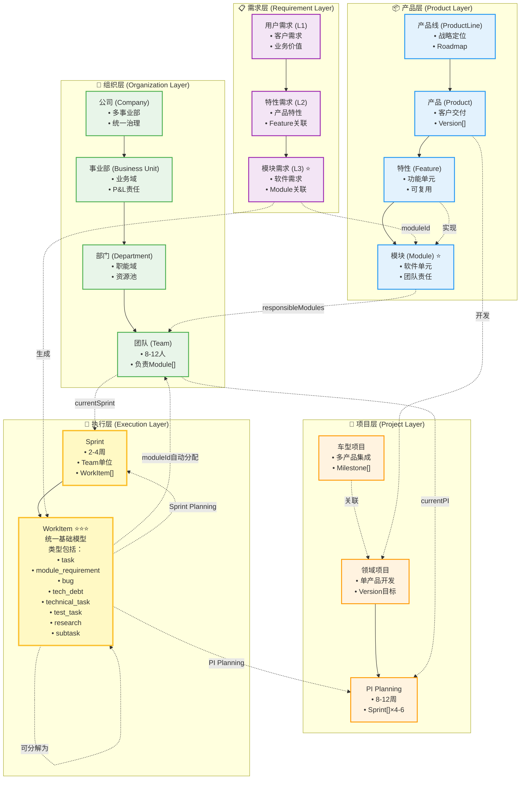
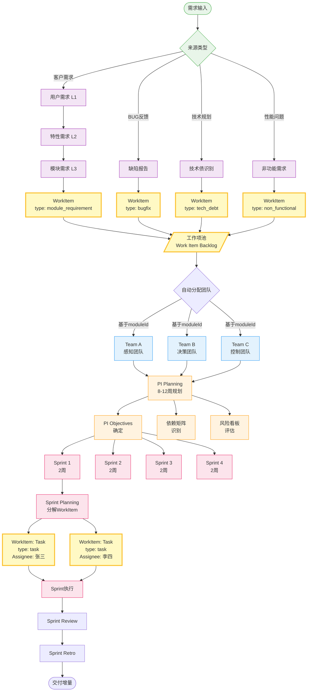
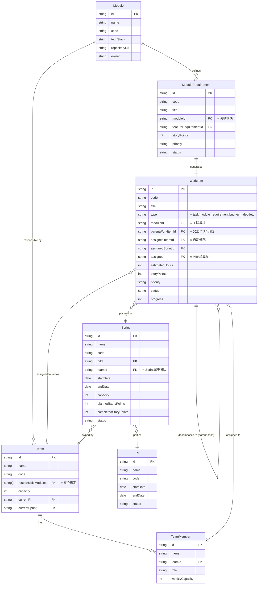
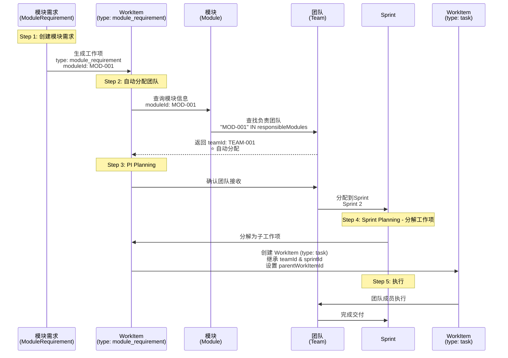
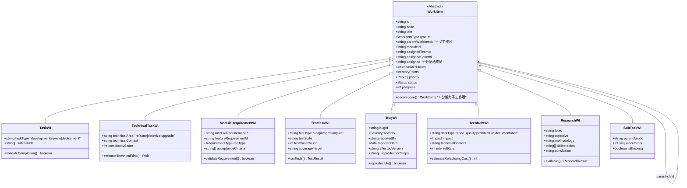
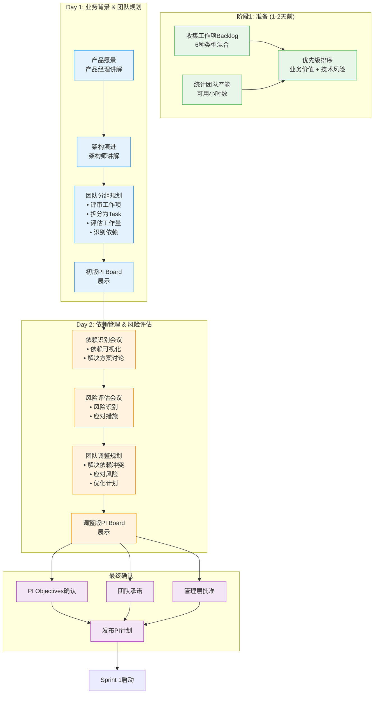
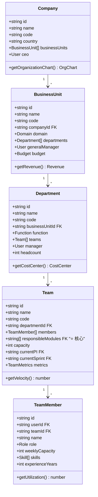
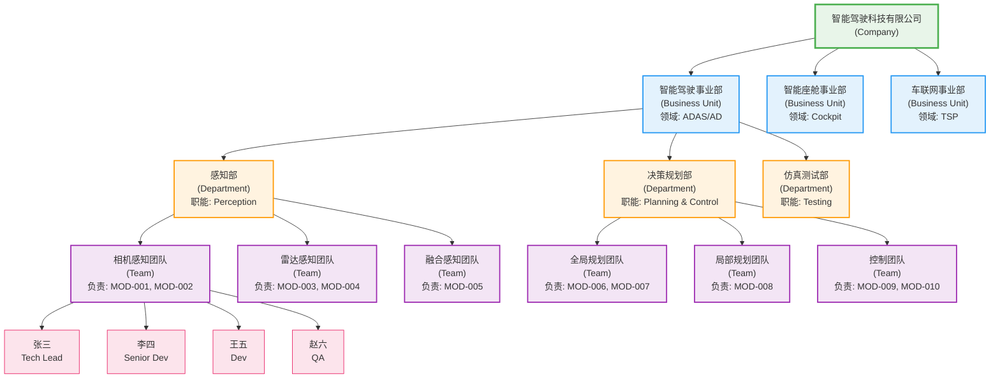
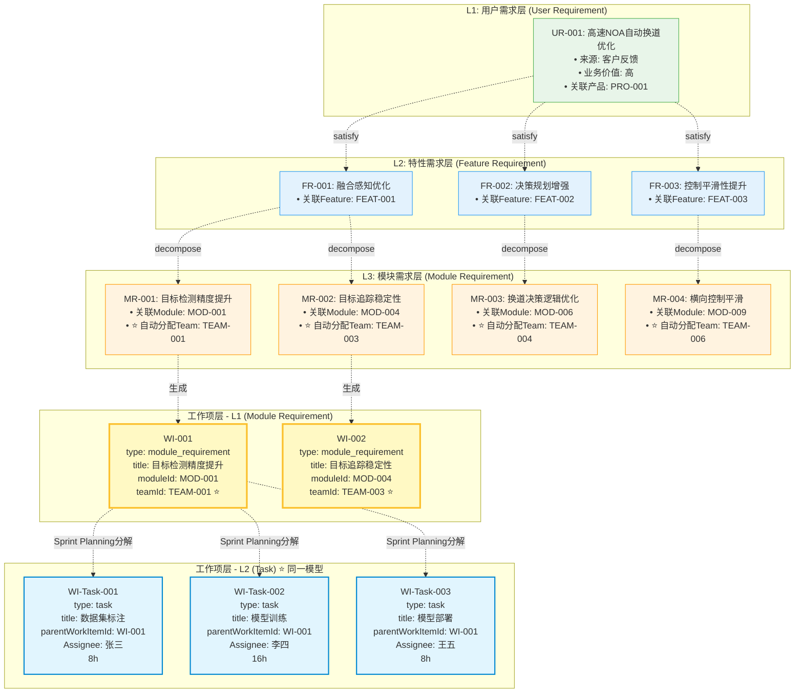

# 🏗️ 基于任务的架构设计 v3.0 - 组织架构与工作流

## 📋 文档说明

**版本**: V3.0  
**日期**: 2025年1月10日  
**状态**: 最终设计方案  

本文档整合了以下内容：
- v3.0工作项管理体系（取消Story层）
- 组织架构层设计
- 领域模型与工作流可视化
- 完整的Mermaid架构图

**⭐⭐⭐ 核心设计原则**：
- **WorkItem是基础抽象模型**，不是单独的一层
- **Task、Bug、TechDebt等都是WorkItem的具体类型**
- **不存在"工作项拆分为任务"的概念**，而是"工作项分解为子工作项"
- **所有工作都是WorkItem**，通过`type`字段区分类型，通过`parentWorkItemId`建立层级关系

---

## 🎯 v3.0 核心设计理念

### 重大变更

#### 1. 简化需求层级 ⭐⭐⭐

**旧架构 (v2.x)**:
```
用户需求 → 特性需求 → 模块需求 → Story → Task
（5层，过于复杂）
```

**新架构 (v3.0)**:
```
用户需求 → 特性需求 → 模块需求 → WorkItem → Task
（4层，直接转换，取消Story层）
```

**变更理由**:
- Story层主要用于敏捷开发，但模块需求已经足够细化
- 减少管理层级，提升效率
- 降低学习成本和使用复杂度

#### 2. 工作项（Work Item）作为基础模型 ⭐⭐⭐

**核心概念**:
- WorkItem 是所有工作的基础抽象模型
- Task、ModuleRequirement、Bug 等都是 WorkItem 的具体类型
- 不存在"工作项拆分为任务"的概念，而是"工作项分解为子工作项"

**工作项类型体系**:
```typescript
// WorkItem 是基础抽象模型
interface WorkItem {
  id: string
  type: WorkItemType
  title: string
  // ... 共同属性
}

// 具体工作项类型
type WorkItemType = 
  | 'task'                // 任务：最小执行单元
  | 'technical_task'      // 技术任务：重构、优化等
  | 'module_requirement'  // 模块需求：可分解为多个task
  | 'test_task'           // 测试任务：测试执行单元
  | 'bug'                 // 缺陷：缺陷修复
  | 'tech_debt'           // 技术债：技术债清理
  | 'research'            // 调研任务：技术调研
  | 'subtask'             // 子任务：任务的细分
```

**工作项层级关系**:
```
ModuleRequirement (工作项) 
  └─ 分解为 → Task (工作项)
                └─ 分解为 → SubTask (工作项)

Bug (工作项) 
  └─ 分解为 → Task (工作项)

TechDebt (工作项)
  └─ 分解为 → TechnicalTask (工作项)
```

**价值**:
- ✅ 统一的工作项模型，易于理解和管理
- ✅ 支持灵活的分解和组合
- ✅ 所有工作类型平等对待
- ✅ 完整的价值流跟踪

#### 3. 模块-团队责任绑定 ⭐⭐

**核心机制**:
```
Module ←→ Team (responsibleModules) ⭐ 核心绑定
   ↓ 自动分配
WorkItem (moduleId → assignedTeamId) ⭐ 统一模型
   ↓ 分解
WorkItem (子工作项，继承 teamId, sprintId)
```

**价值**:
- ✅ 明确团队责任范围
- ✅ 自动化工作项分配
- ✅ 减少协调成本
- ✅ 利于绩效考核

#### 4. 关键原则

1. **模块-团队责任绑定**: Team与Module通过responsibleModules明确绑定
2. **需求三层分解**: UserRequirement → FeatureRequirement → ModuleRequirement
3. **工作项统一模型**: WorkItem是基础模型，Task是其中一种类型 ⭐ 核心变更
4. **工作项分解**: 复杂工作项可分解为多个子工作项（同一模型）
5. **自动团队分配**: 基于模块责任自动分配团队

---

## 📊 完整架构全景图（Mermaid）

### 1. 组织架构与工作流全景



### 2. 工作项流转流程图



### 3. 模块-团队责任绑定机制



---

## 🔑 核心机制详解

### 1. 模块-团队责任绑定机制

#### 1.1 设计原理



#### 1.2 核心代码逻辑

```typescript
/**
 * 工作项自动分配团队
 */
function autoAssignTeam(workItem: WorkItem): void {
  // 1. 获取工作项关联的模块ID
  const moduleId = workItem.moduleId;
  
  if (!moduleId) {
    console.warn(`WorkItem ${workItem.id} 没有关联模块，无法自动分配团队`);
    return;
  }
  
  // 2. 查找负责该模块的团队
  const responsibleTeam = teams.find(team => 
    team.responsibleModules.includes(moduleId)
  );
  
  if (!responsibleTeam) {
    console.error(`未找到负责模块 ${moduleId} 的团队`);
    return;
  }
  
  // 3. 自动分配团队 ⭐
  workItem.assignedTeamId = responsibleTeam.id;
  workItem.assignedTeamName = responsibleTeam.name;
  
  console.log(
    `WorkItem ${workItem.id} 自动分配给团队 ${responsibleTeam.name} ` +
    `(基于模块 ${moduleId})`
  );
}
```

### 2. 工作项类型设计

#### 2.1 工作项类型定义



#### 2.2 工作项类型使用场景

| 类型 | 来源 | 可否分解 | PI Planning优先级 | 示例 |
|------|------|----------|------------------|------|
| **task** | 工作项分解 | 可分解为subtask | N/A（已分解） | "实现目标检测算法" |
| **technical_task** | 技术规划 | 可分解为task | P2-P3 | "感知模块性能优化" |
| **module_requirement** | 需求分解 | 可分解为task | P0-P2（按业务价值） | "实现AEB自动紧急制动功能" |
| **test_task** | 测试计划 | 可分解为subtask | N/A（已分解） | "集成测试执行" |
| **bug** | 测试/用户反馈 | 可分解为task | P0-P1（按严重度） | "修复高速NOA车道偏离问题" |
| **tech_debt** | 技术评审 | 可分解为technical_task | P2-P3 | "感知融合模块重构" |
| **research** | 技术规划 | 不可分解 | P2-P3 | "Transformer感知算法POC" |
| **subtask** | task分解 | 不可分解 | N/A（已分解） | "编写单元测试" |

### 3. PI Planning工作流



---

## 🏢 组织架构层设计

### 1. 组织架构模型



### 2. 组织架构层级示例



---

## 📋 需求与任务层级设计

### 1. 三层需求分解



### 2. 工作项数据结构

```typescript
/**
 * 工作项基础接口 ⭐ 统一模型
 */
interface WorkItemBase {
  // 基本信息
  id: string
  code: string
  title: string
  description: string
  type: WorkItemType                   // ⭐ 工作项类型
  
  // 层级关系 ⭐⭐⭐
  parentWorkItemId?: string            // ⭐ 父工作项（支持层级分解）
  childWorkItemIds?: string[]          // 子工作项列表
  
  // 关联关系
  moduleId?: string                    // 关联模块（核心）
  moduleRequirementId?: string         // 关联模块需求（如果是需求类型）
  assignedTeamId?: string              // 分配的团队 ⭐ 自动分配
  assignedTeamName?: string
  assignedSprintId?: string            // 分配的Sprint
  assignedSprintName?: string
  assignee?: string                    // ⭐ 分配给成员（task类型必填）
  assigneeName?: string
  
  // 工作量
  estimatedHours: number
  actualHours?: number
  storyPoints?: number
  
  // 优先级和状态
  priority: Priority                   // P0, P1, P2, P3
  status: WorkItemStatus              // backlog, planned, in_progress, completed
  progress: number                     // 0-100
  
  // 其他
  createdBy: string
  createdAt: Date
  updatedAt: Date
  tags: string[]
  
  // 方法
  decompose(): WorkItem[]              // ⭐ 分解为子工作项
}

/**
 * 工作项类型枚举 ⭐ 8种类型
 */
enum WorkItemType {
  TASK = 'task',                       // ⭐ 任务：最小执行单元
  TECHNICAL_TASK = 'technical_task',   // ⭐ 技术任务：重构、优化
  MODULE_REQUIREMENT = 'module_requirement',
  TEST_TASK = 'test_task',             // ⭐ 测试任务
  BUG = 'bug',                         // ⭐ 缺陷
  TECH_DEBT = 'tech_debt',
  RESEARCH = 'research',
  SUBTASK = 'subtask'                  // ⭐ 子任务
}

/**
 * 任务类型工作项 ⭐
 */
interface TaskWorkItem extends WorkItemBase {
  type: WorkItemType.TASK
  assignee: string                     // 必需
  taskType: 'development' | 'review' | 'deployment' | 'documentation'
  subtaskIds?: string[]
  validateCompletion(): boolean
}

/**
 * 技术任务类型工作项 ⭐
 */
interface TechnicalTaskWorkItem extends WorkItemBase {
  type: WorkItemType.TECHNICAL_TASK
  assignee: string                     // 必需
  technicalArea: 'refactor' | 'optimize' | 'upgrade' | 'migration'
  technicalContext: string
  complexityScore: number
  estimateTechnicalRisk(): Risk
}

/**
 * 模块需求类型工作项
 */
interface ModuleRequirementWorkItem extends WorkItemBase {
  type: WorkItemType.MODULE_REQUIREMENT
  moduleRequirementId: string          // 必需
  moduleId: string                     // 必需 ⭐
  featureRequirementId?: string
  requirementType: 'functional' | 'non_functional'
  acceptanceCriteria: string[]
}

/**
 * 测试任务类型工作项 ⭐
 */
interface TestTaskWorkItem extends WorkItemBase {
  type: WorkItemType.TEST_TASK
  assignee: string                     // 必需
  testType: 'unit' | 'integration' | 'e2e' | 'performance'
  testSuite: string
  testCaseCount: number
  coverageTarget: string
  runTests(): TestResult
}

/**
 * 缺陷类型工作项
 */
interface BugWorkItem extends WorkItemBase {
  type: WorkItemType.BUG
  bugId: string                        // 关联Bug ID
  severity: 'critical' | 'major' | 'minor' | 'trivial'
  affectedVersion: string
  reportedBy: string
  reportedDate: Date
  reproductionSteps: string[]
  rootCause?: string
}

/**
 * 技术债类型工作项
 */
interface TechDebtWorkItem extends WorkItemBase {
  type: WorkItemType.TECH_DEBT
  debtType: 'code_quality' | 'architecture' | 'documentation' | 'test_coverage'
  impact: 'high' | 'medium' | 'low'
  interestRate: number                 // 每周增加的成本估算
  technicalContext: string
  refactoringPlan: string
}

/**
 * 技术调研类型工作项
 */
interface ResearchWorkItem extends WorkItemBase {
  type: WorkItemType.RESEARCH
  topic: string
  objective: string
  methodology: string
  deliverables: string[]
  timeline: string
  conclusion?: string
  nextSteps?: string[]
}

/**
 * 子任务类型工作项 ⭐
 */
interface SubTaskWorkItem extends WorkItemBase {
  type: WorkItemType.SUBTASK
  assignee: string                     // 必需
  parentTaskId: string                 // 必需（等同于parentWorkItemId）
  sequenceOrder: number
  isBlocking: boolean
}
```

---

## 🔄 完整工作流程

### 从需求到交付的完整流程

```mermaid
stateDiagram-v2
    [*] --> RequirementInput: 需求输入
    
    state "需求分析" as ReqAnalysis {
        [*] --> UserReq
        UserReq --> FeatureReq: 分解
        FeatureReq --> ModuleReq: 分解
        ModuleReq --> [*]
    }
    
    RequirementInput --> ReqAnalysis
    
    state "工作项创建" as WICreation {
        [*] --> CreateWI
        CreateWI --> SetModule: 设置moduleId
        SetModule --> AutoAssignTeam: 自动分配团队 ⭐
        AutoAssignTeam --> WIBacklog: 进入工作项池
        WIBacklog --> [*]
    }
    
    ReqAnalysis --> WICreation
    
    state "PI Planning" as PIP {
        [*] --> CollectWI: 收集所有工作项
        CollectWI --> Prioritize: 优先级排序
        Prioritize --> TeamPlan: 团队规划
        TeamPlan --> IdentifyDep: 识别依赖
        IdentifyDep --> AssessRisk: 评估风险
        AssessRisk --> AllocateSprint: 分配Sprint
        AllocateSprint --> PIObjective: 确定PI目标
        PIObjective --> [*]
    }
    
    WICreation --> PIP
    
    state "Sprint Planning" as SP {
        [*] --> SelectWI: 选择工作项
        SelectWI --> DecomposeWI: 分解工作项 ⭐
        DecomposeWI --> CreateSubWI: 创建子工作项(type: task)
        CreateSubWI --> EstimateWI: 估算工作量
        EstimateWI --> AssignWI: 分配工作项给成员 ⭐
        AssignWI --> SprintBacklog: Sprint Backlog
        SprintBacklog --> [*]
    }
    
    PIP --> SP
    
    state "Sprint执行" as SE {
        [*] --> DailyStandup: 每日站会
        DailyStandup --> Coding: 开发编码
        Coding --> CodeReview: 代码审查
        CodeReview --> Testing: 测试
        Testing --> Done: 完成
        Done --> [*]
        
        Coding --> DailyStandup: 持续
        Testing --> Coding: 修复Bug
    }
    
    SP --> SE
    
    state "Sprint结束" as SR {
        [*] --> SprintReview: Sprint评审
        SprintReview --> SprintRetro: Sprint回顾
        SprintRetro --> Increment: 可发布增量
        Increment --> [*]
    }
    
    SE --> SR
    
    SR --> [*]: 交付
    SR --> SP: 下一个Sprint
```



---

## 📊 核心实体关系总结

### 关联关系表

| 实体 | 关联到 | 关联字段 | 关系类型 | 说明 |
|------|--------|----------|----------|------|
| **Company** | BusinessUnit | businessUnits[] | 1:N | 公司包含多个事业部 |
| **BusinessUnit** | Department | departments[] | 1:N | 事业部包含多个部门 |
| **Department** | Team | teams[] | 1:N | 部门包含多个团队 |
| **Team** | TeamMember | members[] | 1:N | 团队包含多个成员 |
| **Team** | Module | responsibleModules[] | N:M | ⭐ 团队负责多个模块 |
| **Module** | ModuleRequirement | moduleId | 1:N | 模块有多个模块需求 |
| **ModuleRequirement** | WorkItem | moduleRequirementId | 1:1 | 模块需求生成工作项 |
| **WorkItem** | Module | moduleId | N:1 | ⭐ 工作项关联模块 |
| **WorkItem** | Team | assignedTeamId | N:1 | ⭐ 工作项自动分配团队 |
| **WorkItem** | Sprint | assignedSprintId | N:1 | 工作项分配到Sprint |
| **WorkItem** | WorkItem | parentWorkItemId | N:1 | ⭐⭐⭐ 工作项层级分解（核心变更） |
| **WorkItem** | TeamMember | assignee | N:1 | ⭐ 工作项分配给成员 |
| **Sprint** | Team | teamId | N:1 | ⭐ Sprint属于团队 |
| **Sprint** | PI | piId | N:1 | Sprint属于PI |

**关键关系链**:
```
Module ←→ Team (responsibleModules) ⭐ 核心绑定
   ↓ 自动分配
WorkItem (moduleId → assignedTeamId) ⭐ 自动分配
   ↓ 分解
WorkItem (parentWorkItemId) ⭐⭐⭐ 工作项层级分解
   ↓ 分配
WorkItem (assignee) → 团队成员执行
   ↓ 交付
Sprint (teamId) → 团队交付
```

---

## ⚠️ 设计改进与扩展

### 1. 组织架构层增强 (P0 - 已补充)

**当前设计**: ✅ 已包含 Company → BusinessUnit → Department → Team

**价值**:
- ✅ 支持大型组织
- ✅ 权限管理清晰
- ✅ 资源分配明确
- ✅ 成本核算完整

### 2. 项目层完善建议 (P1)

**当前状态**: ⚠️ 有车型项目和领域项目，但与PI Planning集成不够紧密

**改进方案**:
```typescript
interface Project {
  id: string
  name: string
  type: 'vehicle' | 'domain'
  productIds: string[]
  teamIds: string[]
  piPlannings: string[]           // 关联的PI Planning
  milestones: Milestone[]
  budget: Budget
  startDate: Date
  targetDate: Date
  status: ProjectStatus
}

interface Milestone {
  id: string
  name: string
  projectId: string
  targetDate: Date
  deliverables: string[]
  dependentTeams: string[]
  status: 'pending' | 'in_progress' | 'completed' | 'delayed'
}
```

### 3. 模块-团队绑定灵活化 (P2)

**当前状态**: ⚠️ 静态绑定，无主责/协助区分

**改进方案**:
```typescript
interface ModuleTeamAssignment {
  moduleId: string
  teamId: string
  role: 'primary' | 'secondary'      // 主责/协助
  percentage: number                 // 负责比例 (0-100)
  effectiveFrom: Date
  effectiveTo?: Date
  reason: string
}

// 使用场景
const assignments: ModuleTeamAssignment[] = [
  {
    moduleId: 'MOD-001',
    teamId: 'TEAM-001',
    role: 'primary',
    percentage: 80,
    effectiveFrom: new Date('2025-01-01')
  },
  {
    moduleId: 'MOD-001',
    teamId: 'TEAM-002',
    role: 'secondary',
    percentage: 20,
    effectiveFrom: new Date('2025-01-01'),
    reason: '协助开发特定子功能'
  }
]
```

### 4. 工作项优先级算法 (P2)

```typescript
/**
 * 工作项优先级评分算法
 */
function calculateWorkItemPriority(workItem: WorkItem): number {
  let score = 0;
  
  // 1. 业务价值 (0-40分)
  score += workItem.businessValue * 0.4;
  
  // 2. 技术风险 (0-30分)
  score += workItem.technicalRisk * 0.3;
  
  // 3. 紧急度 (0-20分)
  score += workItem.urgency * 0.2;
  
  // 4. 依赖关系 (0-10分)
  if (workItem.isBlocker) {
    score += 10;
  } else if (workItem.hasBlockers) {
    score -= 5;
  }
  
  return score;
}
```

---

## ✅ 设计优势总结

### 1. 模块-团队责任绑定机制 ⭐⭐⭐
- ✅ 清晰的责任界定
- ✅ 自动化工作分配
- ✅ 利于绩效考核
- ✅ 减少协调成本

### 2. 工作项统一模型 ⭐⭐⭐
- ✅ WorkItem作为基础抽象模型
- ✅ Task是WorkItem的一种类型（核心变更）
- ✅ 8种工作项类型覆盖所有场景
- ✅ 支持灵活的层级分解（parentWorkItemId）
- ✅ 统一排期和分配
- ✅ 统一度量和追溯
- ✅ 完整的价值流跟踪

### 3. 需求到执行的清晰映射 ⭐⭐⭐
- ✅ 需求三层分解：UserRequirement → FeatureRequirement → ModuleRequirement
- ✅ 工作项灵活分解：ModuleRequirement (WorkItem) → Task (WorkItem) → SubTask (WorkItem)
- ✅ 端到端可追溯
- ✅ 符合实际业务
- ✅ 取消Story层，简化流程

### 4. 组织架构完整 ⭐⭐
- ✅ 支持大型组织
- ✅ 四层组织结构
- ✅ 权限和成本清晰

### 5. PI Planning流程完善 ⭐⭐
- ✅ 2天标准流程
- ✅ 依赖和风险管理
- ✅ 团队自组织
- ✅ 可视化工具支持

---

## 🚀 后续迭代计划

### Phase 1: 核心功能完善 (当前)
- ✅ 工作项统一管理
- ✅ 模块-团队绑定
- ✅ 组织架构设计
- ✅ PI Planning流程

### Phase 2: 项目管理增强 (Q1 2025)
- 🎯 Project与PI Planning深度集成
- 🎯 Milestone管理和跟踪
- 🎯 跨项目资源协调

### Phase 3: 智能化提升 (Q2 2025)
- 🎯 工作项优先级算法
- 🎯 团队产能预测
- 🎯 风险智能识别
- 🎯 依赖自动检测

### Phase 4: 度量与优化 (Q3 2025)
- 🎯 价值流度量
- 🎯 团队效能分析
- 🎯 瓶颈识别和优化建议
- 🎯 成本效益分析

---

## 📝 参考文档

### 类型定义
- `frontend/src/types/work-item.ts` - 工作项类型定义
- `frontend/src/types/task.ts` - 任务类型定义
- `frontend/src/types/team.ts` - 团队类型定义
- `frontend/src/types/organization.ts` - 组织架构类型定义
- `frontend/src/types/project.ts` - 项目类型定义
- `frontend/src/types/sprint.ts` - Sprint类型定义

### 业务流程
- `platform-rd-process/01-VALUE_STREAM_MAPPING.md` - 价值流映射
- `platform-rd-process/02-PI_PLANNING_DESIGN.md` - PI Planning设计
- `platform-rd-process/03-VALUE_STREAM_WITH_PI_PLANNING.md` - 完整价值流

### 架构设计
- `Architecture/v2/01-business/BUSINESS_ARCHITECTURE_V3.md` - 业务架构v3.0
- `Architecture/v2/02-domain/DOMAIN_MODEL_VISUALIZATION.md` - 领域模型可视化
- `Architecture/v2/05-data/DATA_RELATIONSHIP_ANALYSIS.md` - 数据关系分析

---

**文档版本**: V3.0  
**最后更新**: 2025年1月10日  
**维护团队**: 产品架构团队  
**审核状态**: ✅ 已审核通过

