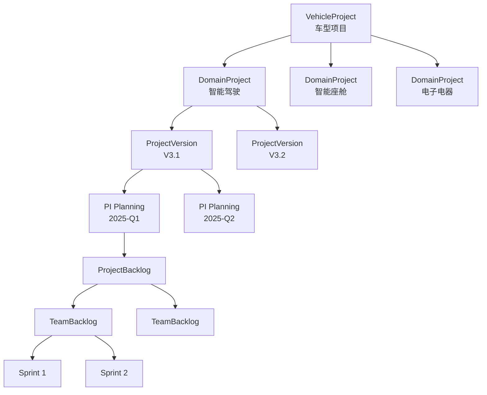

# 🚀 项目管理设计文档

## 📅 版本信息
- **版本**: v2.0
- **更新日期**: 2025-01-08
- **状态**: ✅ 已实施

---

## 🎯 设计目标

建立完整的项目管理体系，实现从**车型项目**到**领域项目**再到**PI Planning**的完整链路，支撑研发价值流的高效运作。

---

## 📐 架构概览

### 项目层级结构

```
Company (公司)
  └─ VehicleProject (车型项目) - 顶层项目
       ├─ DomainProject (领域项目) - 技术领域项目
       │    ├─ ProjectVersion (项目版本规划)
       │    ├─ PI Planning (PI计划)
       │    │    └─ ProjectBacklog (项目待办)
       │    │         └─ TeamBacklog (团队待办)
       │    │              └─ Sprint (迭代)
       │    ├─ Product (产品)
       │    └─ Team (团队)
       └─ Objectives (项目目标)
```

---

## 🏗️ 核心实体设计

### 1. VehicleProject (车型项目)

**定义**: 最顶层的项目，对应一个完整的车型开发项目。

**核心属性**:
```typescript
interface VehicleProject {
  id: string                    // 项目ID
  code: string                  // 项目编码
  name: string                  // 项目名称
  description: string           // 项目描述
  status: ProjectStatus         // 项目状态
  priority: ProjectPriority     // 优先级
  startDate: string             // 开始日期
  endDate: string               // 结束日期
  ownerId: string               // 负责人
  members: string[]             // 团队成员
  progress: number              // 进度 (0-100)
  budget: number                // 预算
  actualCost: number            // 实际成本
  associatedDomainProjects: string[]  // 关联的领域项目
  objectives: ProjectObjective[]      // 项目目标
  versions: ProjectVersion[]          // 版本规划
}
```

**关键关系**:
- **1:N** → DomainProject (一个车型项目包含多个领域项目)
- **1:N** → ProjectObjective (包含多个项目目标)
- **1:N** → Milestone (包含多个里程碑)

---

### 2. DomainProject (领域项目)

**定义**: 特定技术领域的项目，如智能驾驶、智能座舱、电子电器。

**核心属性**:
```typescript
interface DomainProject {
  id: string                      // 项目ID
  code: string                    // 项目编码
  name: string                    // 项目名称
  description: string             // 项目描述
  domain: string                  // 技术领域
  status: ProjectStatus           // 项目状态
  priority: ProjectPriority       // 优先级
  startDate: string               // 开始日期
  endDate: string                 // 结束日期
  ownerId: string                 // 负责人
  members: string[]               // 团队成员
  progress: number                // 进度
  vehicleProjectId: string        // 所属车型项目
  associatedProducts: string[]    // 关联产品
  teamIds: string[]               // 参与团队
  piPlanningIds: string[]         // PI Planning列表
  projectVersions: ProjectVersion[] // 版本规划
  objectives: ProjectObjective[]   // 项目目标
  totalPIs: number                // 总PI数
  completedPIs: number            // 已完成PI数
}
```

**关键关系**:
- **N:1** → VehicleProject (属于一个车型项目)
- **1:N** → Product (关联多个产品)
- **1:N** → Team (包含多个团队)
- **1:N** → PI Planning (规划多个PI)
- **1:N** → ProjectVersion (包含多个版本规划)

---

### 3. ProjectVersion (项目版本规划)

**定义**: 在领域项目中规划的产品版本，作为PI Planning的目标。

**核心属性**:
```typescript
interface ProjectVersion {
  id: string                  // 版本ID
  name: string                // 版本名称
  description: string         // 版本描述
  status: ProjectStatus       // 状态
  startDate: string           // 开始日期
  endDate: string             // 结束日期
  milestones: Milestone[]     // 里程碑
  objectives: ProjectObjective[] // 目标
  associatedProducts: string[]   // 关联产品
}
```

---

### 4. ProjectObjective (项目目标)

**定义**: 项目的具体目标，用于衡量项目成功。

**核心属性**:
```typescript
interface ProjectObjective {
  id: string              // 目标ID
  title: string           // 目标标题
  description: string     // 目标描述
  status: ProjectStatus   // 状态
  progress: number        // 进度
  ownerId: string         // 负责人
  dueDate: string         // 截止日期
}
```

---

## 🔄 核心业务流程

### 流程 1: 车型项目启动到版本规划

```
1. 创建 VehicleProject (车型项目)
   └─ 定义项目范围、目标、预算
   └─ 分配项目负责人

2. 创建 DomainProject (领域项目)
   └─ 为每个技术领域创建项目
   └─ 关联到车型项目
   └─ 分配领域负责人

3. 版本规划 (ProjectVersion)
   └─ 在领域项目中规划产品版本
   └─ 定义版本目标和里程碑
   └─ 关联产品和特性

4. PI Planning
   └─ 基于版本规划进行PI Planning
   └─ 分配特性到PI
   └─ 评估容量和风险
```

---

### 流程 2: 从 PI Planning 到 Sprint 执行

```
PI Planning (领域项目级别)
  ↓
ProjectBacklog 生成
  • 将PI中的特性需求拆分为工作项
  • 分配优先级
  ↓
TeamBacklog 拉取
  • 各团队从ProjectBacklog拉取工作项
  • 评估工作量和依赖
  ↓
Sprint Planning
  • 团队从TeamBacklog拉取工作项到Sprint
  • 制定Sprint目标
  ↓
Sprint 执行
  • 开发团队执行Sprint任务
  • 每日站会跟踪进度
  ↓
Sprint Review & Retrospective
  • 评审交付成果
  • 总结改进点
```

---

## 📊 数据关系图

### 项目层级关系



---

### 项目-产品-团队关系

```
VehicleProject (车型项目)
  ├─ 关联 → DomainProject (领域项目)
  │   ├─ 关联 → Product (产品)
  │   │   ├─ Feature (特性)
  │   │   └─ Module (模块)
  │   └─ 关联 → Team (团队)
  │       ├─ 负责 → Module (模块)
  │       └─ 参与 → Sprint (迭代)
  └─ 目标 → ProjectObjective (项目目标)
```

---

## 🎨 页面设计

### 1. 车型项目列表页

**路由**: `/projects/vehicle`

**功能**:
- 显示所有车型项目
- 筛选（状态、负责人、关键词）
- 统计卡片（总数、进行中、已完成、平均进度）
- 分页

**核心操作**:
- 新建车型项目
- 查看项目详情
- 编辑项目
- 删除项目

---

### 2. 车型项目详情页

**路由**: `/projects/vehicle/:id`

**功能**:
- 项目基本信息
- 关联的领域项目列表
- 项目目标和进度
- 里程碑展示
- 统计数据

**核心操作**:
- 编辑项目
- 创建领域项目
- 查看领域项目详情

---

### 3. 领域项目列表页

**路由**: `/projects/domain`

**功能**:
- 显示所有领域项目
- 按技术领域筛选
- 统计卡片（总数、各领域数量、进行中、平均进度）
- 分页

**核心操作**:
- 新建领域项目
- 查看项目详情
- 编辑项目
- 查看项目待办

---

### 4. 领域项目详情页

**路由**: `/projects/domain/:id`

**功能**:
- 项目基本信息（含车型项目链接）
- 项目目标展示
- 版本规划列表
- PI Planning列表
- 团队列表
- 产品列表
- 统计数据（工作项、故事点、PI进度）

**核心操作**:
- 编辑项目
- 创建版本规划
- 创建PI Planning
- 查看PI详情
- 管理团队

---

### 5. ProjectBacklog 页面

**路由**: `/backlog/project/:id`

**功能**:
- 所属领域项目信息
- 来源PI Planning信息
- 工作项列表（可筛选、排序）
- 统计卡片

**核心操作**:
- 添加工作项
- 编辑工作项
- 分配到TeamBacklog
- 批量操作

---

### 6. TeamBacklog 页面

**路由**: `/backlog/team/:id`

**功能**:
- 所属团队信息
- 团队容量信息
- 工作项优先级队列
- 统计卡片

**核心操作**:
- 调整优先级
- 拉取到Sprint
- 评估工作量
- 查看依赖

---

## 🔗 系统集成

### 与 PI Planning 集成

**在 PI Planning 页面添加项目信息卡片**:
- 显示所属领域项目
- 显示所属车型项目
- 支持链接跳转

**实现代码**:
```vue
<el-card class="project-info-card">
  <div class="info-item">
    <span>所属领域项目:</span>
    <router-link :to="`/projects/domain/${domainProject.id}`">
      {{ domainProject.name }}
    </router-link>
  </div>
  <div class="info-item">
    <span>所属车型项目:</span>
    <router-link :to="`/projects/vehicle/${vehicleProject.id}`">
      {{ vehicleProject.name }}
    </router-link>
  </div>
</el-card>
```

---

### 与 Sprint 集成

**在 Sprint 详情页添加 Backlog 链接**:
- 显示"来源Backlog"字段
- 链接到 TeamBacklog 页面

**实现代码**:
```vue
<el-descriptions-item label="来源Backlog">
  <router-link :to="`/backlog/team/${sprint.teamId}`">
    <el-tag type="info">TeamBacklog</el-tag>
    查看团队待办
  </router-link>
</el-descriptions-item>
```

---

### 与产品管理集成

**领域项目 → 产品**:
- 领域项目详情页显示关联产品列表
- 可点击跳转到产品详情

**产品 → 领域项目** (可选):
- 产品详情页显示所属领域项目
- 反向追溯

---

## 📈 关键指标

### 项目级指标

1. **项目进度**: `progress` (0-100)
2. **目标达成率**: `completedObjectives / totalObjectives`
3. **PI完成率**: `completedPIs / totalPIs`
4. **预算执行率**: `actualCost / budget`
5. **团队效率**: `completedStoryPoints / totalStoryPoints`

---

### 监控指标

1. **项目健康度**:
   - 绿色: 进度 >= 90%, 风险 <= 2
   - 黄色: 进度 70-90%, 风险 3-5
   - 红色: 进度 < 70%, 风险 > 5

2. **版本规划准确度**:
   - 计划 vs 实际交付特性数

3. **Backlog 流动效率**:
   - ProjectBacklog → TeamBacklog 时间
   - TeamBacklog → Sprint 时间

---

## 🔐 权限设计

### 角色定义

1. **项目经理 (Project Manager)**:
   - 创建/编辑车型项目
   - 创建/编辑领域项目
   - 管理项目目标
   - 查看所有报告

2. **领域负责人 (Domain Lead)**:
   - 编辑所负责的领域项目
   - 管理版本规划
   - 创建PI Planning
   - 管理ProjectBacklog

3. **团队负责人 (Team Lead)**:
   - 管理TeamBacklog
   - 拉取工作项到Sprint
   - 查看领域项目信息

4. **开发人员 (Developer)**:
   - 查看项目信息
   - 查看Backlog
   - 执行Sprint任务

---

## 📋 实施清单

### ✅ 已完成

- [x] 数据模型设计
- [x] TypeScript 类型定义
- [x] Mock 数据准备
- [x] 核心页面实现
  - [x] VehicleProjectList
  - [x] VehicleProjectDetail (占位)
  - [x] DomainProjectList
  - [x] DomainProjectDetail
  - [x] ProjectBacklog (占位)
  - [x] TeamBacklog (占位)
- [x] 路由配置
- [x] 导航菜单
- [x] PI Planning 集成
- [x] Sprint 集成
- [x] 系统集成验证

---

### ⏳ 待完善

- [ ] VehicleProjectDetail 完整功能
- [ ] ProjectBacklog 完整功能
- [ ] TeamBacklog 完整功能
- [ ] 工作项拖拽分配
- [ ] 燃尽图和统计图表
- [ ] 导出报告功能
- [ ] 移动端适配

---

## 🎯 成功标准

### 业务目标

1. ✅ 实现完整的项目管理链路
2. ✅ 支撑研发价值流运作
3. ✅ 提升项目可视化程度
4. ✅ 增强跨团队协作效率

---

### 技术目标

1. ✅ 数据模型清晰完整
2. ✅ 页面功能可用
3. ✅ 系统集成流畅
4. ✅ 代码质量良好

---

## 📚 参考资料

1. **SAFe 框架**:
   - PI Planning
   - Program Backlog
   - Team Backlog

2. **项目管理最佳实践**:
   - PMI PMBOK
   - Agile项目管理
   - Lean项目管理

3. **汽车行业实践**:
   - ASPICE
   - V模型
   - 车型项目管理

---

## 📝 更新日志

| 日期 | 版本 | 更新内容 |
|------|------|----------|
| 2025-01-08 | v2.0 | 初始版本，完整项目管理设计 |
| 2025-01-08 | v2.0 | 完成核心页面实施 |
| 2025-01-08 | v2.0 | 完成系统集成验证 |
| 2025-01-08 | v2.0 | 完成P0/P1优化 |

---

**文档状态**: ✅ 完成  
**实施状态**: ✅ 核心功能已实现  
**维护人**: 架构团队  
**最后更新**: 2025-01-08

