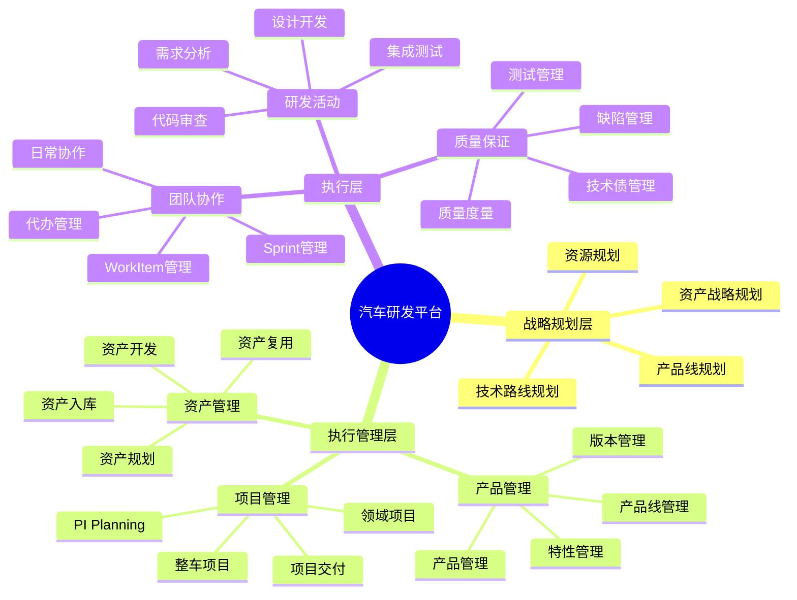
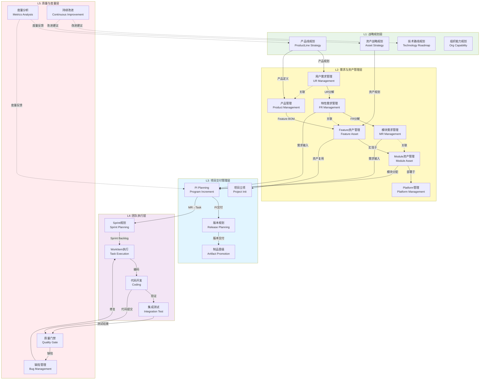
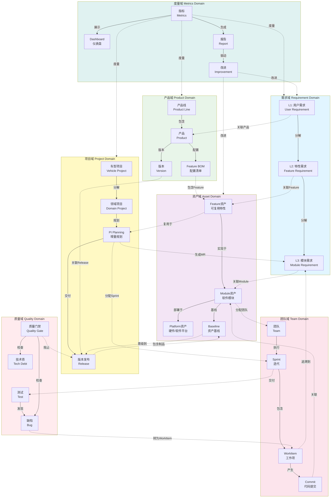
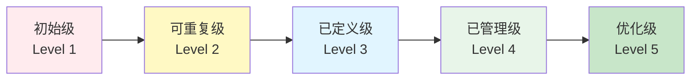
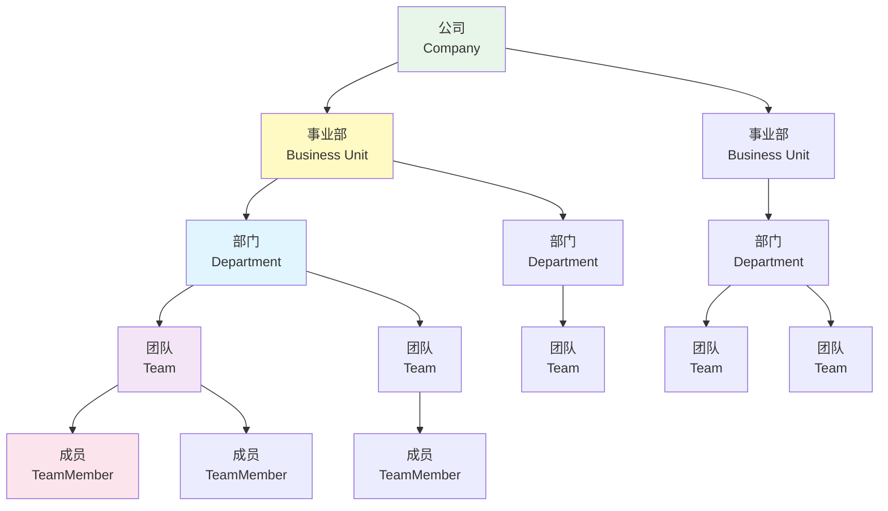
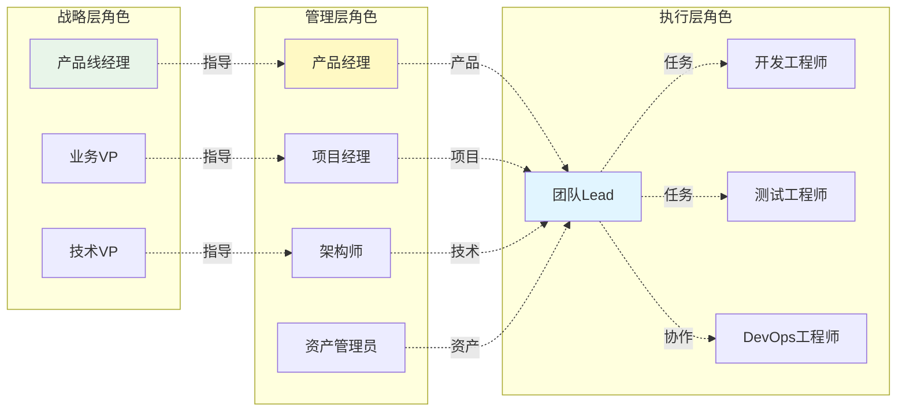
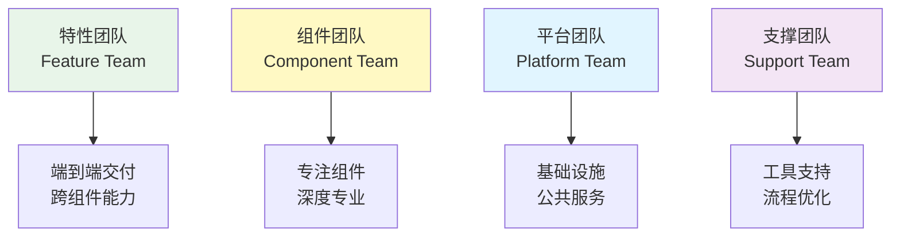
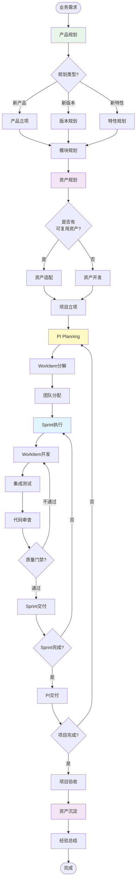
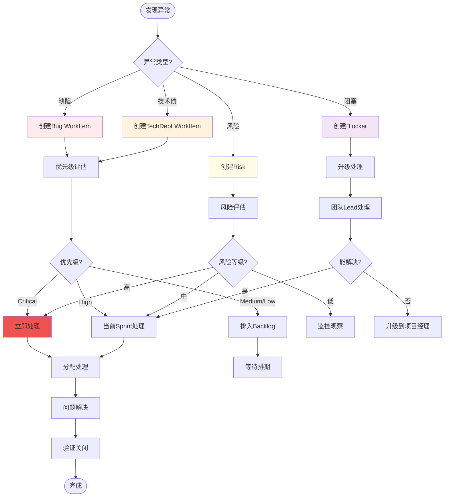

# 业务架构设计

> **关注点**: 业务能力模型与业务流程  
> **目标**: 支撑汽车研发业务的平台架构

---

## 📋 目录

1. [业务架构概述](#一业务架构概述)
2. [核心业务域](#二核心业务域)
3. [业务能力模型](#三业务能力模型)
4. [组织架构设计](#四组织架构设计)
5. [业务流程设计](#五业务流程设计)

---

## 一、业务架构概述

### 1.1 业务架构全景



### 1.2 业务架构分层（融合三层需求与三层资产）



**分层说明**：

| 层级 | 关注点 | 核心活动 | 关键输出 |
|------|--------|---------|---------|
| **L1: 战略规划层** | 长期规划 | 产品线规划、技术路线、资产战略 | 产品路线图、技术选型、资产规划 |
| **L2: 需求与资产管理层** | 需求分解与资产复用 | UR→FR→MR分解、Feature资产管理 | 三层需求、三层资产、Feature BOM |
| **L3: 项目交付管理层** | 项目执行 | PI Planning、版本规划、制品晋级 | PI Backlog、版本计划、交付制品 |
| **L4: 团队执行层** | 日常开发 | Sprint执行、编码、测试 | 代码、测试用例、增量软件 |
| **L5: 质量与度量层** | 质量保障 | 质量门禁、缺陷管理、度量分析 | 质量报告、改进建议 |

---

## 二、核心业务域

### 2.1 七大核心业务域（完整关系）



### 2.2 业务域职责

| 业务域 | 核心职责 | 关键实体 | 主要用户 |
|-------|---------|---------|---------|
| **需求域** | 三层需求管理（UR/FR/MR）、需求分解、需求追溯 | UserRequirement, FeatureRequirement, ModuleRequirement | 产品经理、SE、FO |
| **产品域** | 产品规划、版本管理、Feature BOM配置 | ProductLine, Product, Version, FeatureBOM | 产品经理、架构师 |
| **资产域** | 三层资产管理（Feature/Module/Platform）、资产复用 | Feature, Module, Platform, AssetBaseline | 架构师、资产管理员 |
| **项目域** | 项目立项、PI规划、迭代执行、项目交付 | VehicleProject, DomainProject, PIPlanning, Sprint | 项目经理、团队Lead |
| **团队域** | 团队组建、Sprint执行、WorkItem管理、协作 | Team, TeamMember, Sprint, WorkItem | 团队Lead、工程师 |
| **质量域** | 测试管理、缺陷管理、技术债管理、质量保证 | TestCase, Bug, TechDebt, QualityMetric | 测试工程师、QA |
| **度量域** | 指标定义、数据采集、分析报告、持续改进 | Metric, Dashboard, Report, KPI | 管理层、PMO |

**核心关系**：
- **需求域 ←→ 资产域**：需求通过relatedAssetId关联资产，需求跟随产品，资产独立演进
- **产品域 → 资产域**：Product通过Feature BOM包含Feature，Feature实现于Module
- **资产域 → 团队域**：Module绑定Team，MR自动分配到Team

---

## 三、业务能力模型

### 3.1 业务能力地图（融合三层需求与三层资产）

```mermaid
graph TB
    subgraph 一级能力
        C0[需求管理能力]
        C1[产品管理能力]
        C2[资产管理能力]
        C3[项目管理能力]
        C4[团队协作能力]
        C5[质量保证能力]
        C6[度量分析能力]
    end
    
    subgraph C0_子能力[需求管理能力 ⭐新增]
        C01[用户需求管理<br/>UR Management]
        C02[特性需求管理<br/>FR Management]
        C03[模块需求管理<br/>MR Management]
        C04[需求分解<br/>Requirement Decomposition]
        C05[需求追溯<br/>Traceability]
        C06[需求变更<br/>Change Management]
        C07[需求验收<br/>Acceptance]
    end
    
    subgraph C1_子能力[产品管理能力]
        C11[产品线规划<br/>Product Line Planning]
        C12[产品规划<br/>Product Planning]
        C13[版本管理<br/>Version Management]
        C14[Feature BOM配置<br/>BOM Configuration]
        C15[产品发布<br/>Product Release]
        C16[产品度量<br/>Product Metrics]
    end
    
    subgraph C2_子能力[资产管理能力 ⭐增强]
        C21[Feature资产管理<br/>Feature Asset]
        C22[Module资产管理<br/>Module Asset]
        C23[Platform管理<br/>Platform Management]
        C24[资产复用<br/>Asset Reuse]
        C25[资产基线<br/>Baseline Management]
        C26[资产晋级<br/>Artifact Promotion]
        C27[资产度量<br/>Asset Metrics]
    end
    
    subgraph C3_子能力[项目管理能力]
        C31[车型项目管理<br/>Vehicle Project]
        C32[领域项目管理<br/>Domain Project]
        C33[PI Planning<br/>Program Increment]
        C34[版本规划<br/>Release Planning]
        C35[制品晋级<br/>Artifact Promotion]
        C36[项目交付<br/>Delivery]
        C37[风险管理<br/>Risk Management]
    end
    
    subgraph C4_子能力[团队协作能力]
        C41[Sprint规划<br/>Sprint Planning]
        C42[WorkItem管理<br/>WorkItem Management]
        C43[项目代办<br/>Project Backlog]
        C44[团队代办<br/>Team Backlog]
        C45[日常协作<br/>Collaboration]
        C46[知识共享<br/>Knowledge Sharing]
    end
    
    subgraph C5_子能力[质量保证能力]
        C51[测试管理<br/>Test Management]
        C52[缺陷管理<br/>Bug Management]
        C53[技术债管理<br/>Tech Debt]
        C54[代码审查<br/>Code Review]
        C55[质量门禁<br/>Quality Gate]
        C56[自动化测试<br/>Test Automation]
    end
    
    subgraph C6_子能力[度量分析能力]
        C61[指标定义<br/>Metrics Definition]
        C62[数据采集<br/>Data Collection]
        C63[数据分析<br/>Data Analysis]
        C64[可视化<br/>Visualization]
        C65[报告生成<br/>Report Generation]
        C66[持续改进<br/>Continuous Improvement]
    end
    
    C0 --> C0_子能力
    C1 --> C1_子能力
    C2 --> C2_子能力
    C3 --> C3_子能力
    C4 --> C4_子能力
    C5 --> C5_子能力
    C6 --> C6_子能力
    
    %% 能力间关联
    C01 -.输入.-> C12
    C02 -.输入.-> C14
    C03 -.输入.-> C33
    C05 -.支撑.-> C36
    
    C14 -.输入.-> C21
    C15 -.输入.-> C35
    
    C21 -.输入.-> C33
    C22 -.输入.-> C41
    C25 -.输入.-> C35
    
    C33 -.输入.-> C43
    C33 -.输入.-> C44
    C35 -.输入.-> C36
    
    C41 -.输入.-> C42
    C42 -.输入.-> C51
    
    C55 -.反馈.-> C35
    C55 -.反馈.-> C36
    
    C61 -.度量.-> C0
    C61 -.度量.-> C1
    C61 -.度量.-> C2
    C61 -.度量.-> C3
    C66 -.改进.-> C0
    C66 -.改进.-> C2
    
    style C0 fill:#e1f5ff
    style C1 fill:#e8f5e9
    style C2 fill:#f3e5f5
    style C3 fill:#fff9c4
    style C4 fill:#fce4ec
    style C5 fill:#ffebee
    style C6 fill:#e0f2f1
```



**能力说明**：

| 一级能力 | 二级能力数 | 核心价值 | V3新增/增强 |
|---------|-----------|---------|------------|
| **需求管理能力** | 7个 | 三层需求管理、需求追溯 | ⭐ 新增 |
| **产品管理能力** | 6个 | 产品规划、Feature BOM配置 | 增强BOM |
| **资产管理能力** | 7个 | Feature/Module/Platform管理、资产复用 | ⭐ 大幅增强 |
| **项目管理能力** | 7个 | 车型/领域项目、PI Planning、制品晋级 | 增强晋级 |
| **团队协作能力** | 6个 | Sprint、WorkItem、Backlog管理 | 增强Backlog |
| **质量保证能力** | 6个 | 测试、缺陷、质量门禁 | - |
| **度量分析能力** | 6个 | 指标、分析、持续改进 | - |

### 3.2 能力成熟度模型



| 级别 | 特征 | 产品管理能力 | 项目管理能力 | 资产管理能力 |
|-----|------|-------------|-------------|-------------|
| **Level 1<br/>初始级** | 流程混乱<br/>依赖个人 | • 无产品规划<br/>• 需求随意变更 | • 无项目计划<br/>• 进度不可控 | • 无资产管理<br/>• 重复开发 |
| **Level 2<br/>可重复级** | 建立基本流程<br/>可重复 | • 有产品规划<br/>• 需求有评审 | • 有项目计划<br/>• 有进度跟踪 | • 有资产库<br/>• 偶尔复用 |
| **Level 3<br/>已定义级** | 流程标准化<br/>全面覆盖 | • 版本管理完善<br/>• 特性可追溯 | • PI Planning标准化<br/>• 风险可控 | • 资产分类管理<br/>• 主动复用 |
| **Level 4<br/>已管理级** | 数据驱动<br/>量化管理 | • 数据驱动决策<br/>• 版本质量可量化 | • 项目度量完善<br/>• 预测准确 | • 资产度量完善<br/>• 复用率高 |
| **Level 5<br/>优化级** | 持续优化<br/>自动化 | • 自动化程度高<br/>• 持续改进 | • 自动化交付<br/>• DevOps成熟 | • 智能推荐<br/>• 自动化复用 |

---

## 四、组织架构设计

### 4.1 组织结构模型



### 4.2 角色与职责



**角色详细职责**:

| 角色 | 主要职责 | 关键活动 | 输出 |
|-----|---------|---------|------|
| **产品线经理** | 产品线战略规划<br/>产品线路线图 | • 市场分析<br/>• 产品线规划<br/>• 资源分配 | 产品线战略<br/>产品路线图 |
| **产品经理** | 产品规划<br/>特性管理<br/>版本管理 | • 需求分析<br/>• 特性设计<br/>• 版本规划<br/>• PI Planning | 产品需求<br/>特性列表<br/>版本计划 |
| **项目经理** | 项目规划<br/>进度管理<br/>风险管理 | • 项目立项<br/>• PI Planning<br/>• 进度跟踪<br/>• 风险控制 | 项目计划<br/>PI计划<br/>风险报告 |
| **架构师** | 技术架构<br/>模块设计<br/>资产规划 | • 架构设计<br/>• 模块规划<br/>• 技术选型<br/>• 资产规划 | 架构文档<br/>模块设计<br/>资产规划 |
| **团队Lead** | 团队管理<br/>Sprint执行<br/>工作分配 | • Sprint规划<br/>• 任务分配<br/>• 团队协调<br/>• 技术指导 | Sprint计划<br/>任务分配<br/>团队报告 |
| **开发工程师** | 代码实现<br/>单元测试<br/>代码审查 | • 需求分析<br/>• 编码开发<br/>• 单元测试<br/>• Code Review | 代码<br/>测试用例<br/>技术文档 |
| **测试工程师** | 测试设计<br/>测试执行<br/>缺陷管理 | • 测试设计<br/>• 测试执行<br/>• 缺陷跟踪<br/>• 质量报告 | 测试用例<br/>测试报告<br/>缺陷列表 |
| **资产管理员** | 资产审核<br/>资产入库<br/>资产度量 | • 资产审核<br/>• 资产入库<br/>• 资产维护<br/>• 度量分析 | 资产库<br/>度量报告<br/>复用指南 |

### 4.3 团队模型

**团队类型**:



**团队规模与配置**:

| 团队类型 | 规模 | 角色配置 | 职责 |
|---------|-----|---------|------|
| **特性团队** | 7-9人 | 1 Lead + 5 开发 + 2 测试 | 端到端交付特性<br/>跨模块协作 |
| **组件团队** | 5-7人 | 1 Lead + 4 开发 + 1 测试 | 专注单一组件<br/>深度开发 |
| **平台团队** | 8-10人 | 1 Lead + 5 开发 + 2 DevOps + 1 测试 | 基础设施<br/>公共服务 |
| **支撑团队** | 3-5人 | 1 Lead + 2 工具开发 + 1 流程专家 | 工具链<br/>流程优化 |

---

## 五、业务流程设计

### 5.1 端到端业务流程



### 5.2 关键业务场景

#### 场景1: 新产品开发（融合三层需求与三层资产）

```yaml
场景: 新产品开发流程
触发: 市场机会、技术创新
参与角色: 产品线经理、产品经理、SE、架构师、项目经理

主流程:
  1. 市场分析与立项
     - 输入: 市场调研报告
     - 活动: 可行性分析、商业论证
     - 输出: 产品立项书
     - 负责人: 产品线经理
  
  2. 用户需求规划（UR）
     - 输入: 产品立项书
     - 活动: 用户需求收集、需求分析、优先级排序
     - 输出: 用户需求列表（10+ UR）
     - 负责人: 产品经理
     - 关联: UR.productId → Product
  
  3. 特性需求分解（FR）
     - 输入: 用户需求列表
     - 活动: UR分解为FR、Feature资产评估、Make or Reuse决策
     - 输出: 特性需求列表（30+ FR）
     - 负责人: SE + 架构师
     - 关联: FR.relatedFeatureAssetId → Feature（可复用）
     - 决策: 
       * 有可复用Feature → 关联到现有Feature
       * 无可复用Feature → 规划新Feature开发
  
  4. Feature资产规划
     - 输入: 特性需求列表
     - 活动: Feature BOM配置、Feature依赖分析、平台选型
     - 输出: Product Feature BOM（旗舰版/高配版/标准版配置）
     - 负责人: 架构师
     - 关联: Product → FeatureBOM → Feature
  
  5. 模块需求分解（MR）
     - 输入: 特性需求、Feature-Module映射
     - 活动: FR分解为MR、模块设计、团队分配
     - 输出: 模块需求列表（50+ MR）
     - 负责人: FO（功能负责人）
     - 关联: MR.moduleId → Module → Team（自动分配）
  
  6. 项目启动
     - 输入: 需求Backlog（UR/FR/MR）、资产规划（Feature/Module/Platform）
     - 活动: 项目立项、团队组建、资源分配
     - 输出: 项目计划
     - 负责人: 项目经理
  
  7. PI Planning
     - 输入: 项目计划、FR/MR Backlog
     - 活动: PI目标制定、MR分解为Task、团队分配
     - 输出: PI Backlog（MR → Task）、团队迭代计划
     - 负责人: 产品经理 + 项目经理
     - WorkItem: MR (type=module_requirement) → Task (type=task/technical_task/test_task)
  
  8. Sprint迭代开发
     - 输入: 团队Sprint Backlog（Task）
     - 活动: Sprint执行、代码开发、单元测试、Code Review
     - 输出: 可工作软件增量
     - 负责人: 团队Lead
     - 追溯: Task → Commit → Module → Feature
  
  9. Feature集成验证
     - 输入: Module增量
     - 活动: Feature级集成测试、性能测试
     - 输出: Feature验证报告
     - 负责人: 测试工程师
     - 验证: Feature是否满足FR的验收标准
  
  10. 产品交付与资产沉淀
      - 输入: Feature集成验收通过
      - 活动: 产品集成、用户验收、上线部署、资产入库
      - 输出: 正式版本、Feature资产库更新
      - 负责人: 项目经理 + 资产管理员
      - 资产: Feature.reuseCount++, Feature.products.push(newProduct)

度量指标:
  - Time to Market: 从立项到上线 < 6个月
  - Feature资产复用率: ≥ 60%（5-10个产品）
  - 需求追溯完整度: 100%（UR→FR→MR→Task→Commit）
  - 首次质量合格率: ≥ 90%
  - 客户满意度: ≥ 4.0/5.0

追溯链路示例:
  UR-PARK-001（一键自动泊车）
    → FR-PARK-001（自动寻找车位）→ FEAT-AVP-001（AVP资产）
      → MR-PARK-PER-001（车位检测算法）→ MOD-PARK-PER-001
        → TASK-PARK-001（超声波融合）→ Commit-abc123
        → TASK-PARK-002（车位识别）→ Commit-def456
```

#### 场景2: 资产复用开发

```yaml
场景: 基于资产复用的快速开发
触发: 新项目需要类似功能
参与角色: 产品经理、架构师、团队Lead、开发工程师

主流程:
  1. 需求分析
     - 输入: 新功能需求
     - 活动: 需求分析、可行性评估
     - 输出: 需求文档
     - 负责人: 产品经理
  
  2. 资产搜索
     - 输入: 需求文档
     - 活动: 资产库搜索、匹配度评估
     - 输出: 候选资产列表
     - 负责人: 架构师
  
  3. 复用决策
     - 输入: 候选资产列表
     - 活动: 功能匹配度、性能评估、成本分析
     - 输出: 复用方案（Direct/Adapted/Reject）
     - 负责人: 架构师 + 团队Lead
  
  4. 资产适配（如需要）
     - 输入: 资产源代码、适配需求
     - 活动: 接口适配、功能扩展、集成测试
     - 输出: 适配后的资产
     - 负责人: 开发工程师
  
  5. 集成开发
     - 输入: 资产（原始或适配后）
     - 活动: 集成到项目、接口对接、联调测试
     - 输出: 功能实现
     - 负责人: 开发工程师
  
  6. 验证与反馈
     - 输入: 功能实现
     - 活动: 功能测试、性能测试、用户验收
     - 输出: 测试报告、复用反馈
     - 负责人: 测试工程师
  
  7. 资产更新（可选）
     - 输入: 复用反馈、改进建议
     - 活动: 资产优化、版本更新
     - 输出: 新版本资产
     - 负责人: 资产管理员

度量指标:
  - 复用工时节省: 平均节省 30-50% 工时
  - 适配成本: < 20% 重新开发成本
  - 资产质量满意度: ≥ 4.0/5.0
  - 集成时间: < 3天
```

### 5.3 异常处理流程



---

## 六、总结

### 业务架构核心价值

```
✓ 业务全景清晰 ⭐⭐⭐
  • 六大核心业务域
  • 清晰的业务分层
  • 端到端业务流程

✓ 组织架构完善 ⭐⭐⭐
  • 4层组织结构
  • 8个核心角色
  • 4种团队类型

✓ 能力模型完整 ⭐⭐⭐
  • 7大一级能力
  • 30+子能力
  • 5级成熟度模型

✓ 流程标准化 ⭐⭐⭐
  • 端到端业务流程
  • 典型业务场景
  • 异常处理机制
```

---

**文档维护**:
- 创建: 2026-01-10
- 版本: 最新
- 负责人: 业务架构团队

