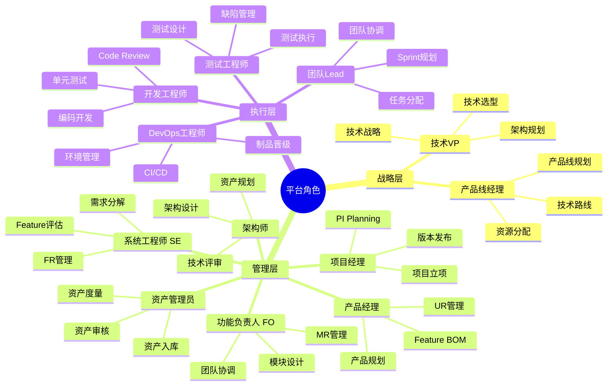
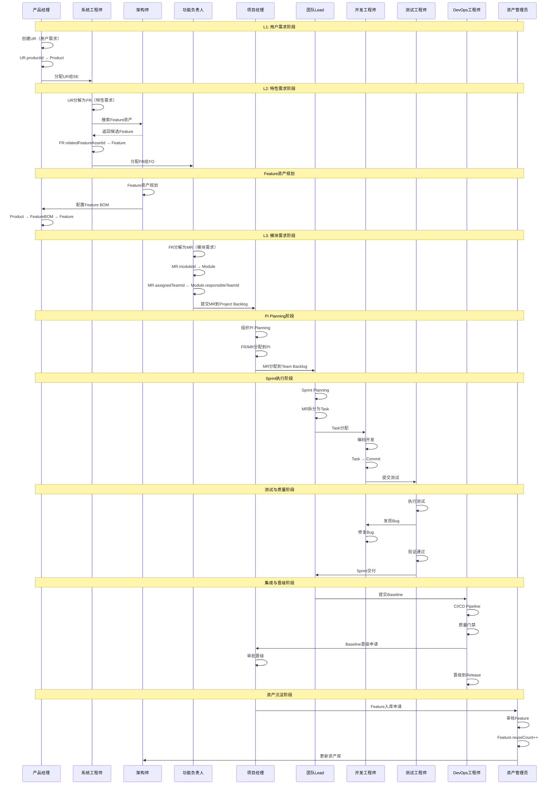
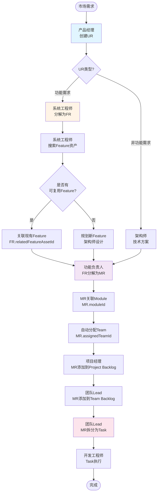
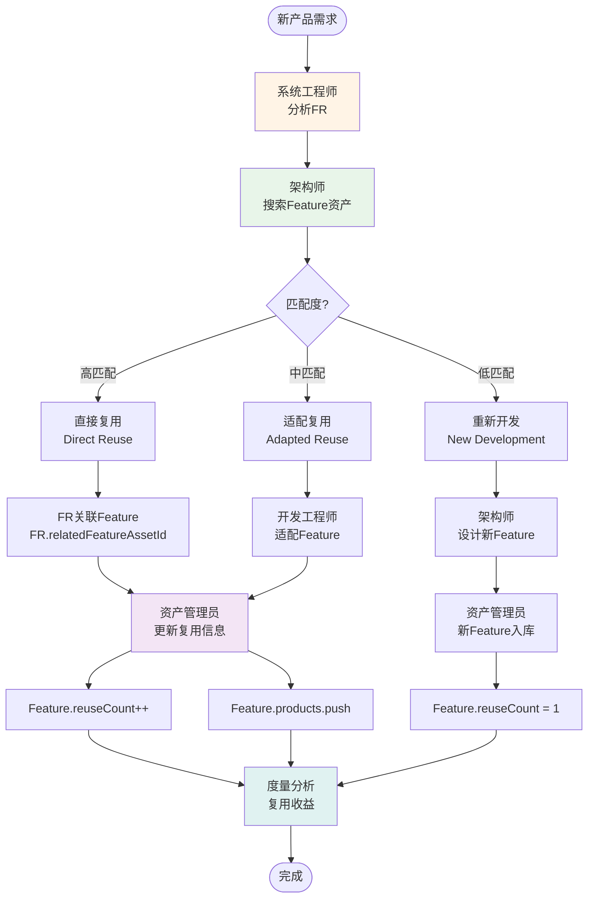
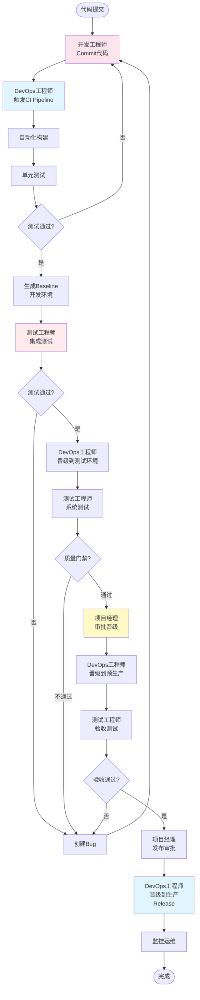
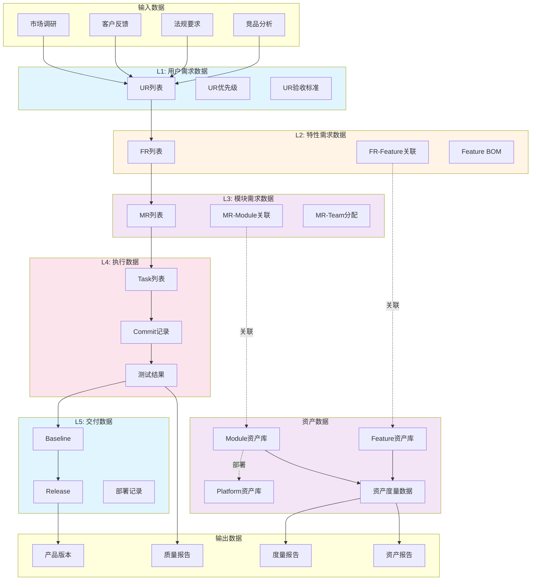

# 基于角色的流程与数据设计

> **文档版本**: v1.0  
> **创建日期**: 2026-01-11  
> **目的**: 定义平台角色、核心数据输入输出、功能支撑流程

---

## 📋 目录

1. [角色与职责](#一角色与职责)
2. [核心流程设计](#二核心流程设计)
3. [数据流设计](#三数据流设计)
4. [功能支撑矩阵](#四功能支撑矩阵)

---

## 一、角色与职责

### 1.1 角色全景



### 1.2 角色详细定义

#### 1.2.1 产品经理 (Product Manager)

**核心职责**：
- L1需求管理：用户需求（UR）收集、分析、优先级排序
- 产品规划：产品路线图、版本规划
- Feature BOM配置：定义产品包含哪些Feature
- PI Planning参与：确定PI目标和优先级

**输入数据**：
- 市场调研报告
- 客户反馈
- 竞品分析
- 法规要求

**输出数据**：
- 用户需求列表（UR）
- 产品规划文档
- Feature BOM配置
- PI目标

**使用功能**：
- UR管理（创建/编辑/审批）
- 产品管理（产品规划/版本管理）
- Feature BOM配置界面
- PI Planning看板

**典型工作流**：
```
1. 收集用户需求 → 创建UR
2. UR优先级排序 → 产品规划
3. UR分解为FR → 协同SE
4. 配置Feature BOM → 定义产品配置
5. 参与PI Planning → 确定PI目标
```

---

#### 1.2.2 系统工程师 (System Engineer, SE)

**核心职责**：
- L2需求管理：特性需求（FR）分解、分析
- Feature资产评估：Make or Reuse决策
- 需求追溯：维护UR→FR→MR追溯链路
- 需求验收：FR级验收

**输入数据**：
- 用户需求列表（UR）
- Feature资产库
- 技术约束

**输出数据**：
- 特性需求列表（FR）
- Feature复用决策
- 需求追溯矩阵

**使用功能**：
- FR管理（创建/编辑/审批）
- Feature资产搜索
- 需求分解流程可视化
- 需求追溯图

**典型工作流**：
```
1. 接收UR → 分析需求
2. UR分解为FR → 创建FR
3. 搜索Feature资产 → 评估复用可行性
4. 决策Make or Reuse → 关联Feature或规划新Feature
5. 维护追溯关系 → UR↔FR↔Feature
```

---

#### 1.2.3 功能负责人 (Feature Owner, FO)

**核心职责**：
- L3需求管理：模块需求（MR）分解、分析
- 模块设计：Module级设计
- 团队协调：协调多个Team完成Feature
- MR验收：Module级验收

**输入数据**：
- 特性需求列表（FR）
- Module资产库
- Team能力矩阵

**输出数据**：
- 模块需求列表（MR）
- Module设计文档
- Team分配方案

**使用功能**：
- MR管理（创建/编辑/审批）
- Module资产管理
- Team Backlog管理
- 需求追溯图

**典型工作流**：
```
1. 接收FR → 分析Feature实现
2. FR分解为MR → 创建MR
3. MR关联Module → 自动分配Team
4. MR拆分为Task → 添加到Team Backlog
5. 验收Module → 确认MR完成
```

---

#### 1.2.4 项目经理 (Project Manager)

**核心职责**：
- 项目立项：车型项目、领域项目立项
- PI Planning：组织PI Planning会议
- 版本规划：Release Planning
- 进度跟踪：监控项目进度和风险

**输入数据**：
- 产品规划
- 需求Backlog（FR/MR）
- 资产规划（Feature/Module）
- Team容量

**输出数据**：
- 项目计划
- PI Backlog
- Sprint分配
- 版本计划

**使用功能**：
- 项目管理（车型项目/领域项目）
- PI Planning看板
- Project Backlog管理
- 版本管理

**典型工作流**：
```
1. 项目立项 → 创建车型项目/领域项目
2. 组织PI Planning → 确定PI目标
3. FR/MR分配到PI → 创建Project Backlog
4. MR分配到Sprint → 团队认领
5. 监控进度 → 项目看板
6. 版本发布 → Release管理
```

---

#### 1.2.5 架构师 (Architect)

**核心职责**：
- 架构设计：系统架构、模块架构
- 资产规划：Feature资产规划、Module规划
- Platform管理：平台选型、平台迁移评估
- 技术评审：架构评审、代码评审

**输入数据**：
- 产品规划
- 特性需求（FR）
- 技术约束
- 现有资产库

**输出数据**：
- 架构设计文档
- Feature资产规划
- Module设计
- Platform选型方案

**使用功能**：
- Feature资产管理
- Module资产管理
- Platform管理
- 资产关系图

**典型工作流**：
```
1. 分析FR → 架构设计
2. Feature规划 → 创建Feature资产
3. Module规划 → 创建Module资产
4. Platform选型 → 评估兼容性
5. Feature BOM设计 → 产品配置
6. 技术评审 → 架构审查
```

---

#### 1.2.6 资产管理员 (Asset Manager)

**核心职责**：
- 资产入库：Feature/Module资产入库
- 资产审核：资产质量审核
- 资产度量：复用率、收益分析
- 资产维护：资产版本管理

**输入数据**：
- 待入库资产
- 资产使用数据
- 复用反馈

**输出数据**：
- 资产库
- 资产度量报告
- 复用指南

**使用功能**：
- Feature资产管理
- Module资产管理
- 资产复用分析
- 资产度量Dashboard

**典型工作流**：
```
1. 接收入库申请 → 审核资产
2. 资产入库 → 更新资产库
3. 度量复用率 → 生成报告
4. 推荐复用 → 复用指南
5. 资产优化 → 版本更新
```

---

#### 1.2.7 团队Lead (Team Lead)

**核心职责**：
- Sprint规划：Sprint Planning
- 任务分配：Task分配给Team成员
- 团队协调：日常站会、问题解决
- 技术指导：Code Review、技术支持

**输入数据**：
- Team Backlog（MR/Task）
- Team容量
- Sprint目标

**输出数据**：
- Sprint计划
- Task分配
- Sprint报告

**使用功能**：
- Team Backlog管理
- Sprint管理
- WorkItem管理
- 团队工作全景

**典型工作流**：
```
1. 接收Team Backlog → MR列表
2. Sprint Planning → 选择MR
3. MR拆分为Task → 创建Task
4. Task分配 → 分配给成员
5. 日常站会 → 跟踪进度
6. Sprint Review → 演示增量
7. Sprint Retrospective → 总结改进
```

---

#### 1.2.8 开发工程师 (Developer)

**核心职责**：
- 编码开发：实现Task
- 单元测试：编写单元测试
- Code Review：代码审查
- 技术文档：编写技术文档

**输入数据**：
- Task（分配的工作项）
- Module设计文档
- 技术规范

**输出数据**：
- 代码（Commit）
- 单元测试
- 技术文档

**使用功能**：
- WorkItem列表（我的Task）
- 代码仓库集成
- Code Review工具
- 技术文档管理

**典型工作流**：
```
1. 接收Task → 理解需求
2. 编码开发 → 实现功能
3. 单元测试 → 编写测试
4. 提交代码 → Commit关联Task
5. Code Review → 审查代码
6. 修复问题 → 响应Review意见
7. 完成Task → 更新状态
```

---

#### 1.2.9 测试工程师 (Test Engineer)

**核心职责**：
- 测试设计：测试用例设计
- 测试执行：功能测试、集成测试
- 缺陷管理：Bug跟踪、验证
- 质量报告：测试报告、质量分析

**输入数据**：
- 需求（UR/FR/MR）
- 测试计划
- 代码增量

**输出数据**：
- 测试用例
- 测试报告
- 缺陷列表

**使用功能**：
- 测试管理
- 缺陷管理
- 测试报告
- 需求追溯

**典型工作流**：
```
1. 接收需求 → 分析测试需求
2. 设计测试用例 → 关联需求
3. 执行测试 → 记录结果
4. 发现缺陷 → 创建Bug
5. 验证修复 → 关闭Bug
6. 生成报告 → 质量分析
```

---

#### 1.2.10 DevOps工程师 (DevOps Engineer)

**核心职责**：
- CI/CD管理：持续集成、持续交付
- 环境管理：开发/测试/生产环境
- 制品晋级：Baseline晋级到Release
- 监控运维：系统监控、问题排查

**输入数据**：
- 代码提交（Commit）
- Baseline
- 晋级申请

**输出数据**：
- 构建产物
- 部署日志
- 监控数据

**使用功能**：
- CI/CD Pipeline
- 环境管理
- 制品晋级管理
- 监控Dashboard

**典型工作流**：
```
1. 监听代码提交 → 触发CI
2. 执行构建 → 生成制品
3. 自动化测试 → 质量门禁
4. Baseline晋级 → 审批流程
5. 部署到环境 → 验证
6. 监控系统 → 告警响应
```

---

## 二、核心流程设计

### 2.1 端到端研发流程（基于角色）



### 2.2 需求分解流程（三层需求）



### 2.3 资产复用流程



### 2.4 制品晋级流程



---

## 三、数据流设计

### 3.1 核心数据流图



### 3.2 角色-数据矩阵

| 角色 | 输入数据 | 输出数据 | 关键数据字段 |
|------|---------|---------|-------------|
| **产品经理** | 市场调研、客户反馈 | UR列表、Feature BOM | UR.productId, Product.featureBOM |
| **系统工程师** | UR列表、Feature资产库 | FR列表、Feature复用决策 | FR.relatedFeatureAssetId |
| **功能负责人** | FR列表、Module资产库 | MR列表、Team分配 | MR.moduleId, MR.assignedTeamId |
| **项目经理** | 需求Backlog、资产规划 | PI Backlog、版本计划 | PIPlanning.frIds, PIPlanning.mrIds |
| **架构师** | 产品规划、FR | Feature资产、Module设计 | Feature.moduleIds, Module.deployment |
| **资产管理员** | 资产使用数据 | 资产库、度量报告 | Feature.reuseCount, Feature.products |
| **团队Lead** | Team Backlog | Sprint计划、Task分配 | Sprint.taskIds, Task.assignee |
| **开发工程师** | Task | Commit、单元测试 | Commit.taskId, Commit.moduleId |
| **测试工程师** | 需求、代码增量 | 测试用例、Bug | TestCase.requirementId, Bug.severity |
| **DevOps工程师** | Commit、Baseline | 构建产物、Release | Baseline.commits, Release.baselines |

---

## 四、功能支撑矩阵

### 4.1 角色-功能矩阵

| 功能模块 | 产品经理 | SE | FO | 项目经理 | 架构师 | 资产管理员 | 团队Lead | 开发 | 测试 | DevOps |
|---------|---------|----|----|---------|--------|-----------|---------|-----|-----|--------|
| **需求管理** | | | | | | | | | | |
| UR管理 | ✅ 创建/编辑 | ✅ 查看 | 查看 | 查看 | 查看 | - | - | - | ✅ 查看 | - |
| FR管理 | ✅ 审批 | ✅ 创建/编辑 | ✅ 查看 | 查看 | ✅ 评审 | - | - | - | ✅ 查看 | - |
| MR管理 | 查看 | ✅ 审批 | ✅ 创建/编辑 | 查看 | ✅ 评审 | - | ✅ 查看 | ✅ 查看 | ✅ 查看 | - |
| 需求分解流程 | ✅ 发起 | ✅ 执行 | ✅ 执行 | 查看 | ✅ 评审 | - | - | - | - | - |
| 需求追溯 | ✅ 查看 | ✅ 维护 | ✅ 维护 | ✅ 查看 | ✅ 查看 | - | 查看 | 查看 | ✅ 查看 | - |
| **产品管理** | | | | | | | | | | |
| 产品规划 | ✅ 创建/编辑 | 查看 | 查看 | ✅ 查看 | ✅ 评审 | - | - | - | - | - |
| Feature BOM配置 | ✅ 配置 | ✅ 建议 | 查看 | 查看 | ✅ 设计 | - | - | - | - | - |
| 版本管理 | ✅ 规划 | 查看 | 查看 | ✅ 管理 | 查看 | - | 查看 | - | - | ✅ 发布 |
| **资产管理** | | | | | | | | | | |
| Feature资产管理 | 查看 | ✅ 搜索 | 查看 | 查看 | ✅ 创建/编辑 | ✅ 审核 | - | - | - | - |
| Module资产管理 | - | 查看 | ✅ 查看 | 查看 | ✅ 创建/编辑 | ✅ 审核 | 查看 | 查看 | - | - |
| Platform管理 | - | 查看 | 查看 | 查看 | ✅ 管理 | ✅ 审核 | - | 查看 | - | ✅ 部署 |
| 资产复用分析 | 查看 | ✅ 分析 | 查看 | 查看 | ✅ 分析 | ✅ 度量 | - | - | - | - |
| **项目管理** | | | | | | | | | | |
| 车型项目管理 | ✅ 参与 | 查看 | 查看 | ✅ 管理 | 查看 | - | 查看 | - | - | - |
| 领域项目管理 | 查看 | 查看 | ✅ 参与 | ✅ 管理 | 查看 | - | 查看 | - | - | - |
| PI Planning | ✅ 参与 | ✅ 参与 | ✅ 参与 | ✅ 组织 | 查看 | - | ✅ 参与 | - | - | - |
| Project Backlog | ✅ 优先级 | 查看 | ✅ 添加MR | ✅ 管理 | 查看 | - | 查看 | - | - | - |
| 版本规划 | ✅ 参与 | 查看 | 查看 | ✅ 规划 | 查看 | - | 查看 | - | - | ✅ 执行 |
| **团队协作** | | | | | | | | | | |
| Team Backlog | - | - | ✅ 添加MR | 查看 | - | - | ✅ 管理 | ✅ 查看 | - | - |
| Sprint管理 | - | - | 查看 | 查看 | - | - | ✅ 规划 | ✅ 执行 | ✅ 测试 | - |
| WorkItem管理 | - | - | 查看 | 查看 | - | - | ✅ 分配 | ✅ 执行 | ✅ 验证 | - |
| 团队工作全景 | 查看 | 查看 | ✅ 查看 | ✅ 查看 | 查看 | - | ✅ 管理 | ✅ 查看 | 查看 | - |
| **质量保证** | | | | | | | | | | |
| 测试管理 | - | - | - | 查看 | - | - | 查看 | 查看 | ✅ 管理 | - |
| 缺陷管理 | 查看 | 查看 | 查看 | ✅ 查看 | 查看 | - | ✅ 处理 | ✅ 修复 | ✅ 管理 | - |
| 质量门禁 | 查看 | 查看 | 查看 | ✅ 审批 | ✅ 评审 | - | 查看 | 查看 | ✅ 执行 | ✅ 配置 |
| **DevOps** | | | | | | | | | | |
| CI/CD Pipeline | - | - | - | 查看 | 查看 | - | 查看 | ✅ 触发 | 查看 | ✅ 管理 |
| 制品晋级 | - | - | - | ✅ 审批 | 查看 | - | 查看 | 查看 | ✅ 验证 | ✅ 执行 |
| 环境管理 | - | - | - | 查看 | 查看 | - | - | - | 查看 | ✅ 管理 |

**图例**：
- ✅ 创建/编辑：主要责任人，可创建和编辑
- ✅ 管理：管理权限，包括审批、分配等
- ✅ 查看：只读权限
- 查看：次要查看权限
- -：无权限或不相关

### 4.2 典型场景的功能支撑

#### 场景1：新产品开发

**涉及角色**：产品经理、SE、架构师、FO、项目经理、团队Lead、开发、测试、DevOps

**功能支撑链路**：
```
1. 产品经理 → UR管理 → 创建UR
2. 产品经理 → 产品规划 → 定义产品
3. SE → 需求分解流程 → UR分解为FR
4. 架构师 → Feature资产管理 → 搜索/创建Feature
5. 产品经理 → Feature BOM配置 → 配置产品
6. FO → 需求分解流程 → FR分解为MR
7. FO → Module资产管理 → 关联Module
8. 项目经理 → PI Planning → 组织规划
9. 项目经理 → Project Backlog → 管理FR/MR
10. 团队Lead → Team Backlog → 接收MR
11. 团队Lead → Sprint管理 → 规划Sprint
12. 团队Lead → WorkItem管理 → MR拆分为Task
13. 开发 → WorkItem管理 → 执行Task
14. 开发 → CI/CD Pipeline → 提交代码
15. 测试 → 测试管理 → 执行测试
16. DevOps → 制品晋级 → 晋级Baseline
17. 项目经理 → 版本管理 → 发布版本
```

#### 场景2：Feature资产复用

**涉及角色**：SE、架构师、资产管理员

**功能支撑链路**：
```
1. SE → FR管理 → 创建FR
2. SE → Feature资产管理 → 搜索Feature
3. 架构师 → 资产复用分析 → 评估复用可行性
4. SE → FR管理 → FR.relatedFeatureAssetId关联
5. 资产管理员 → Feature资产管理 → 更新复用信息
6. 资产管理员 → 资产复用分析 → 度量复用收益
```

---

## 五、总结

### 5.1 核心价值

```
✅ 角色职责清晰
   • 10个核心角色
   • 明确的输入输出
   • 清晰的功能权限

✅ 流程端到端
   • 需求分解流程（UR→FR→MR）
   • 资产复用流程
   • 制品晋级流程
   • 端到端研发流程

✅ 数据流完整
   • L1→L5数据流
   • 需求数据→资产数据
   • 执行数据→交付数据

✅ 功能支撑完善
   • 角色-功能矩阵
   • 典型场景支撑
   • 权限清晰定义
```

---

**文档版本**: v1.0  
**创建日期**: 2026-01-11  
**维护团队**: 业务架构团队  
**状态**: ✅ 完成

