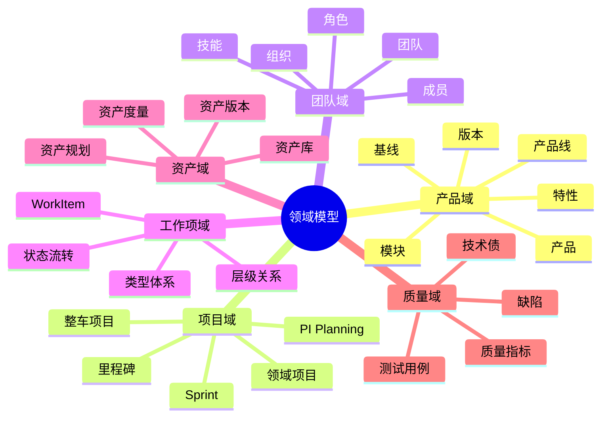
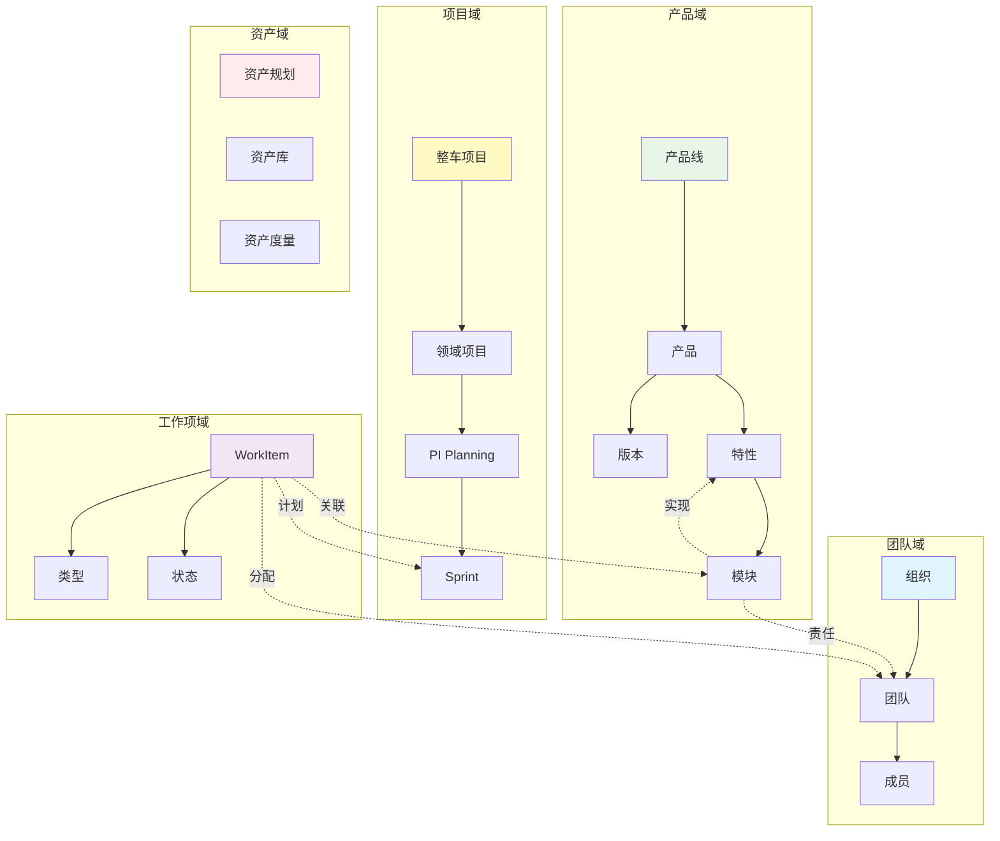
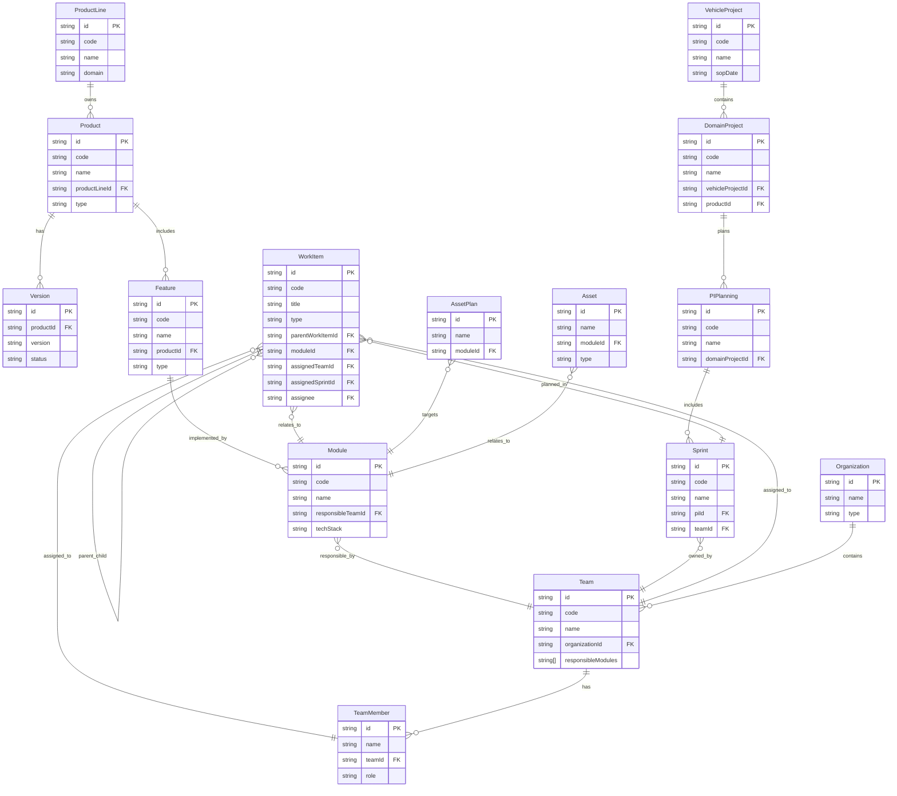
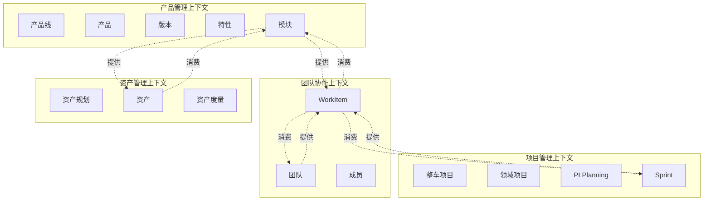

# 领域模型设计

> **关注点**: 核心实体与关系模型  
> **目标**: 清晰的领域边界与数据结构

---

## 📋 目录

1. [领域模型概述](#一领域模型概述)
2. [核心实体设计](#二核心实体设计)
3. [实体关系模型](#三实体关系模型)
4. [领域边界](#四领域边界)
5. [数据字典](#五数据字典)

---

## 一、领域模型概述

### 1.1 领域模型全景



### 1.2 核心领域划分



---

## 二、核心实体设计

### 2.1 产品域实体

#### ProductLine (产品线)

```typescript
interface ProductLine {
  // 基本信息
  id: string                    // 产品线ID: PL-001
  code: string                  // 产品线编码: ADAS
  name: string                  // 产品线名称: 智能驾驶产品线
  description: string           // 描述
  
  // 业务信息
  domain: Domain                // 业务域: ADAS | IVI | BCM
  businessUnit: string          // 所属事业部
  
  // 关联关系
  productIds: string[]          // 包含的产品列表
  
  // 管理信息
  owner: string                 // 负责人
  status: Status                // 状态: active | archived
  
  // 元数据
  createdAt: string
  updatedAt: string
}

type Domain = 'ADAS' | 'IVI' | 'BCM' | 'VCU' | 'BMS'
type Status = 'active' | 'maintenance' | 'deprecated' | 'archived'
```

#### Product (产品)

```typescript
interface Product {
  // 基本信息
  id: string                    // 产品ID: PROD-001
  code: string                  // 产品编码: NOA
  name: string                  // 产品名称: 高速领航辅助
  description: string
  
  // 分类
  productLineId: string         // 所属产品线
  type: ProductType             // 产品类型
  domain: Domain                // 业务域
  
  // 关联关系
  versionIds: string[]          // 版本列表
  featureIds: string[]          // 特性列表
  moduleIds: string[]           // 模块列表
  
  // 管理信息
  owner: string                 // 产品经理
  status: Status                // 状态
  
  // 元数据
  createdAt: string
  updatedAt: string
}

type ProductType = 'platform' | 'application' | 'service'
```

#### Version (版本)

```typescript
interface Version {
  // 基本信息
  id: string                    // 版本ID: VER-001
  productId: string             // 所属产品
  version: string               // 版本号: v3.0.0
  name: string                  // 版本名称: NOA v3.0
  description: string
  
  // 版本信息
  releaseDate: string           // 发布日期
  milestone: string             // 里程碑
  
  // 关联关系
  featureIds: string[]          // 包含的特性
  baselineId?: string           // 关联基线
  
  // 状态
  status: VersionStatus         // 版本状态
  progress: number              // 完成进度 0-100
  
  // 质量指标
  qualityScore?: number         // 质量评分
  testCoverage?: number         // 测试覆盖率
  
  // 元数据
  createdAt: string
  updatedAt: string
}

type VersionStatus = 'planning' | 'developing' | 'testing' | 'released' | 'deprecated'
```

#### Feature (特性)

```typescript
interface Feature {
  // 基本信息
  id: string                    // 特性ID: FEAT-001
  code: string                  // 特性编码: ACC
  name: string                  // 特性名称: 自适应巡航
  description: string
  
  // 分类
  productId: string             // 所属产品
  type: FeatureType             // 特性类型
  category: string              // 特性分类
  
  // 复杂度
  complexity: Complexity        // 复杂度: high | medium | low
  priority: Priority            // 优先级
  
  // 关联关系
  moduleIds: string[]           // 实现模块列表
  dependsOn: string[]           // 依赖的特性
  
  // 管理信息
  owner: string                 // 负责人
  status: Status                // 状态
  
  // 元数据
  createdAt: string
  updatedAt: string
}

type FeatureType = 'functional' | 'non_functional' | 'technical'
type Complexity = 'high' | 'medium' | 'low'
type Priority = 'critical' | 'high' | 'medium' | 'low'
```

#### Module (模块)

```typescript
interface Module {
  // 基本信息
  id: string                    // 模块ID: MOD-001
  code: string                  // 模块编码: PERCEPTION
  name: string                  // 模块名称: 感知模块
  description: string
  
  // 技术信息
  techStack: TechStack          // 技术栈
  language: Language            // 编程语言
  framework?: string            // 框架
  
  // 代码仓库
  repositoryUrl: string         // 仓库地址
  repositoryBranch: string      // 主分支
  
  // 关联关系
  featureIds: string[]          // 支持的特性
  productIds: string[]          // 用于的产品
  
  // 团队责任
  responsibleTeamId: string     // 负责团队 ⭐ 核心关系
  owner: string                 // 模块负责人
  
  // 状态
  status: Status                // 状态
  healthScore?: number          // 健康度评分
  
  // 元数据
  createdAt: string
  updatedAt: string
}

type TechStack = 'cpp' | 'python' | 'rust' | 'java' | 'typescript'
type Language = 'C++' | 'Python' | 'Rust' | 'Java' | 'TypeScript'
```

### 2.2 项目域实体

#### VehicleProject (整车项目)

```typescript
interface VehicleProject {
  // 基本信息
  id: string                    // 项目ID: VP-001
  code: string                  // 项目编码: XC90-2026
  name: string                  // 项目名称: XC90 2026款
  description: string
  
  // 项目信息
  vehicleModel: string          // 车型
  sopDate: string               // SOP日期
  
  // 关联关系
  domainProjectIds: string[]    // 领域项目列表
  milestoneIds: string[]        // 里程碑列表
  
  // 进度
  progress: number              // 整体进度 0-100
  status: ProjectStatus         // 项目状态
  riskLevel: RiskLevel          // 风险等级
  
  // 管理信息
  projectManager: string        // 项目经理
  
  // 元数据
  createdAt: string
  updatedAt: string
}

type ProjectStatus = 'planning' | 'executing' | 'testing' | 'completed' | 'cancelled'
type RiskLevel = 'low' | 'medium' | 'high' | 'critical'
```

#### DomainProject (领域项目)

```typescript
interface DomainProject {
  // 基本信息
  id: string                    // 项目ID: DP-001
  code: string                  // 项目编码: ADAS-XC90
  name: string                  // 项目名称: XC90 ADAS项目
  description: string
  
  // 关联关系
  vehicleProjectId: string      // 所属整车项目
  productId: string             // 开发的产品
  versionId: string             // 目标版本
  
  // PI Planning
  piPlanningIds: string[]       // PI Planning列表
  
  // 进度
  progress: number              // 进度 0-100
  status: ProjectStatus         // 状态
  
  // 管理信息
  projectManager: string        // 项目经理
  
  // 元数据
  startDate: string
  endDate: string
  createdAt: string
  updatedAt: string
}
```

#### PIPlanning (PI Planning)

```typescript
interface PIPlanning {
  // 基本信息
  id: string                    // PI ID: PI-2026-Q1
  code: string                  // PI编码
  name: string                  // PI名称
  description: string
  
  // 关联关系
  domainProjectId: string       // 所属领域项目
  sprintIds: string[]           // Sprint列表
  
  // PI Objectives
  objectives: PIObjective[]     // PI目标列表
  
  // 时间
  startDate: string
  endDate: string
  duration: number              // 周期（周）
  
  // 状态
  status: PIStatus              // PI状态
  
  // 元数据
  createdAt: string
  updatedAt: string
}

interface PIObjective {
  id: string
  title: string
  description: string
  businessValue: number         // 业务价值 1-10
  confidence: number            // 信心度 0-100
  teamIds: string[]             // 负责团队
  workItemIds: string[]         // 关联WorkItem
}

type PIStatus = 'planning' | 'in_progress' | 'completed' | 'cancelled'
```

#### Sprint

```typescript
interface Sprint {
  // 基本信息
  id: string                    // Sprint ID: SPR-001
  code: string                  // Sprint编码
  name: string                  // Sprint名称: Sprint-3
  description: string
  
  // 关联关系
  piId: string                  // 所属PI
  teamId: string                // 所属团队 ⭐ Sprint属于团队
  
  // 时间
  startDate: string
  endDate: string
  duration: number              // 周期（天）
  
  // 容量
  capacity: number              // 团队容量（SP）
  plannedStoryPoints: number    // 计划SP
  completedStoryPoints: number  // 完成SP
  remainingStoryPoints: number  // 剩余SP
  
  // 状态
  status: SprintStatus          // Sprint状态
  
  // 元数据
  createdAt: string
  updatedAt: string
}

type SprintStatus = 'planning' | 'active' | 'completed' | 'cancelled'
```

### 2.3 团队域实体

#### Organization (组织)

```typescript
interface Organization {
  // 基本信息
  id: string                    // 组织ID: ORG-001
  name: string                  // 组织名称: 智能驾驶事业部
  code: string                  // 组织编码
  type: OrgType                 // 组织类型
  
  // 层级关系
  parentId?: string             // 父组织
  childIds: string[]            // 子组织
  
  // 关联关系
  teamIds: string[]             // 团队列表
  
  // 管理信息
  leader: string                // 负责人
  
  // 元数据
  createdAt: string
  updatedAt: string
}

type OrgType = 'company' | 'business_unit' | 'department' | 'group'
```

#### Team (团队)

```typescript
interface Team {
  // 基本信息
  id: string                    // 团队ID: TEAM-001
  code: string                  // 团队编码: PERCEPTION
  name: string                  // 团队名称: 感知团队
  description: string
  
  // 组织关系
  organizationId: string        // 所属组织
  
  // 模块责任 ⭐⭐⭐ 核心关系
  responsibleModules: string[]  // 负责的模块列表
  
  // 成员
  memberIds: string[]           // 团队成员列表
  leaderId: string              // 团队Lead
  
  // 容量
  capacity: TeamCapacity        // 团队容量
  
  // 当前工作
  currentPI?: string            // 当前PI
  currentSprint?: string        // 当前Sprint
  
  // 元数据
  createdAt: string
  updatedAt: string
}

interface TeamCapacity {
  sprintCapacity: number        // Sprint容量（SP）
  velocity: number              // 历史速率
  utilizationRate: number       // 利用率 0-100
}
```

#### TeamMember (团队成员)

```typescript
interface TeamMember {
  // 基本信息
  id: string                    // 成员ID: USER-001
  name: string                  // 姓名
  email: string                 // 邮箱
  avatar?: string               // 头像
  
  // 团队信息
  teamId: string                // 所属团队
  role: MemberRole              // 角色
  
  // 技能
  skills: Skill[]               // 技能列表
  
  // 容量
  weeklyCapacity: number        // 周容量（小时）
  currentWorkload: number       // 当前工作量
  
  // 状态
  status: MemberStatus          // 状态
  
  // 元数据
  joinDate: string
  createdAt: string
  updatedAt: string
}

type MemberRole = 'lead' | 'developer' | 'tester' | 'architect' | 'devops'
type MemberStatus = 'active' | 'leave' | 'resigned'

interface Skill {
  name: string                  // 技能名称: C++
  level: SkillLevel             // 技能等级
  years: number                 // 工作年限
}

type SkillLevel = 'expert' | 'proficient' | 'competent' | 'beginner'
```

### 2.4 工作项域实体

#### WorkItem (工作项) ⭐⭐⭐ 核心实体

```typescript
interface WorkItem {
  // 基本信息
  id: string                    // 工作项ID: WI-001
  code: string                  // 工作项编码: TASK-2026-001
  title: string                 // 标题
  description: string           // 描述
  
  // 类型 ⭐ WorkItem类型体系
  type: WorkItemType            // 工作项类型
  
  // 层级关系 ⭐ 父子关系
  parentWorkItemId?: string     // 父工作项ID
  childWorkItemIds: string[]    // 子工作项ID列表
  
  // 关联关系
  moduleId?: string             // 关联模块
  featureId?: string            // 关联特性
  productId?: string            // 关联产品
  
  // 分配信息
  assignedTeamId?: string       // 分配团队 ⭐ 自动分配
  assignedSprintId?: string     // 分配Sprint
  assignee?: string             // 分配人（task类型必填）
  
  // 工作量
  estimatedHours: number        // 预估工时
  actualHours?: number          // 实际工时
  storyPoints?: number          // 故事点
  
  // 优先级与状态
  priority: Priority            // 优先级
  status: WorkItemStatus        // 状态
  progress: number              // 进度 0-100
  
  // 时间追踪
  createdAt: string
  createdBy: string
  updatedAt: string
  updatedBy: string
  startedAt?: string
  completedAt?: string
  
  // 度量
  leadTime?: number             // 前置时间（小时）
  cycleTime?: number            // 周期时间（小时）
  
  // 元数据
  tags: string[]                // 标签
  attachments: string[]         // 附件
}

// WorkItem类型体系 ⭐⭐⭐
type WorkItemType = 
  | 'task'                      // 任务：最小执行单元，必须分配给成员
  | 'technical_task'            // 技术任务：重构、优化等
  | 'module_requirement'        // 模块需求：可分解为多个task
  | 'test_task'                 // 测试任务：测试执行单元
  | 'bug'                       // 缺陷：缺陷修复
  | 'tech_debt'                 // 技术债：技术债清理
  | 'research'                  // 调研任务：技术调研
  | 'subtask'                   // 子任务：任务的细分

type WorkItemStatus = 
  | 'pending'                   // 待开始
  | 'in_progress'               // 进行中
  | 'completed'                 // 已完成
  | 'cancelled'                 // 已取消
  | 'blocked'                   // 阻塞
```

### 2.5 资产域实体

#### AssetPlan (资产规划)

```typescript
interface AssetPlan {
  // 基本信息
  id: string                    // 规划ID: AP-001
  name: string                  // 规划名称
  description: string
  
  // 关联关系
  moduleId: string              // 目标模块
  featureId: string             // 目标特性
  
  // 规划信息
  targetVersion: string         // 目标版本
  plannedDate: string           // 计划日期
  
  // 状态
  status: PlanStatus            // 状态
  
  // 管理信息
  owner: string                 // 负责人
  
  // 元数据
  createdAt: string
  updatedAt: string
}

type PlanStatus = 'draft' | 'approved' | 'in_progress' | 'completed' | 'cancelled'
```

#### Asset (资产)

```typescript
interface Asset {
  // 基本信息
  id: string                    // 资产ID: ASSET-001
  name: string                  // 资产名称
  code: string                  // 资产编码
  description: string
  
  // 分类
  type: AssetType               // 资产类型
  category: string              // 资产分类
  
  // 版本
  version: string               // 版本号
  
  // 关联关系
  moduleId: string              // 关联模块
  featureId?: string            // 关联特性
  
  // 质量指标
  qualityScore: number          // 质量评分 0-100
  testCoverage: number          // 测试覆盖率
  
  // 复用信息
  reuseCount: number            // 复用次数
  reuseProjects: string[]       // 复用项目列表
  
  // 状态
  status: AssetStatus           // 状态
  
  // 管理信息
  owner: string                 // 负责人
  
  // 元数据
  createdAt: string
  updatedAt: string
}

type AssetType = 'module' | 'component' | 'library' | 'service' | 'tool'
type AssetStatus = 'draft' | 'review' | 'approved' | 'published' | 'deprecated'
```

---

## 三、实体关系模型

### 3.1 完整ERD图



### 3.2 核心关系说明

#### 关系1: Module ← → Team (模块-团队责任绑定) ⭐⭐⭐

```typescript
// 核心关系：模块由团队负责
Module.responsibleTeamId → Team.id
Team.responsibleModules[] → Module.id[]

// 示例
const team_perception = {
  id: "TEAM-001",
  name: "感知团队",
  responsibleModules: [
    "MOD-CAMERA",
    "MOD-LIDAR",
    "MOD-RADAR",
    "MOD-FUSION"
  ]
}

const module_camera = {
  id: "MOD-CAMERA",
  name: "摄像头感知模块",
  responsibleTeamId: "TEAM-001"
}
```

**价值**:
- 明确团队责任范围
- 自动化WorkItem分配
- 支持绩效考核

#### 关系2: WorkItem → WorkItem (父子关系) ⭐⭐⭐

```typescript
// WorkItem分解关系
WorkItem.parentWorkItemId → WorkItem.id
WorkItem.childWorkItemIds[] → WorkItem.id[]

// 示例：模块需求分解为任务
const workitem_requirement = {
  id: "WI-001",
  type: "module_requirement",
  title: "实现路径规划算法",
  childWorkItemIds: ["WI-002", "WI-003", "WI-004"]
}

const workitem_task1 = {
  id: "WI-002",
  type: "task",
  title: "实现A*算法",
  parentWorkItemId: "WI-001",
  assignee: "USER-001"
}

const workitem_task2 = {
  id: "WI-003",
  type: "task",
  title: "实现RRT算法",
  parentWorkItemId: "WI-001",
  assignee: "USER-002"
}
```

**价值**:
- 灵活的层级分解
- 统一的工作项模型
- 完整的追溯链路

#### 关系3: WorkItem → Module → Team (自动分配) ⭐⭐⭐

```typescript
// 自动分配流程
WorkItem.moduleId → Module.id
Module.responsibleTeamId → Team.id
WorkItem.assignedTeamId = Module.responsibleTeamId  // 自动分配

// 示例
const workitem = {
  id: "WI-001",
  type: "module_requirement",
  title: "优化感知性能",
  moduleId: "MOD-CAMERA",           // 关联模块
  assignedTeamId: "TEAM-001"        // 自动分配到感知团队
}
```

---

## 四、领域边界

### 4.1 限界上下文



### 4.2 上下文映射

| 上下文 | 核心实体 | 边界 | 依赖关系 |
|-------|---------|------|---------|
| **产品管理** | ProductLine, Product, Version, Feature, Module | 产品定义与规划 | 被项目管理、团队协作依赖 |
| **项目管理** | VehicleProject, DomainProject, PIPlanning, Sprint | 项目计划与执行 | 依赖产品管理，被团队协作依赖 |
| **团队协作** | Team, TeamMember, WorkItem | 团队工作与任务 | 依赖产品管理、项目管理 |
| **资产管理** | AssetPlan, Asset, AssetMetric | 资产复用与度量 | 依赖产品管理 |

---

## 五、数据字典

### 5.1 枚举类型

```typescript
// 业务域
enum Domain {
  ADAS = 'ADAS',              // 智能驾驶
  IVI = 'IVI',                // 智能座舱
  BCM = 'BCM',                // 车身控制
  VCU = 'VCU',                // 整车控制
  BMS = 'BMS'                 // 电池管理
}

// 状态
enum Status {
  ACTIVE = 'active',          // 活跃
  MAINTENANCE = 'maintenance', // 维护中
  DEPRECATED = 'deprecated',   // 已废弃
  ARCHIVED = 'archived'        // 已归档
}

// 优先级
enum Priority {
  CRITICAL = 'critical',       // 紧急
  HIGH = 'high',               // 高
  MEDIUM = 'medium',           // 中
  LOW = 'low'                  // 低
}

// 复杂度
enum Complexity {
  HIGH = 'high',               // 高
  MEDIUM = 'medium',           // 中
  LOW = 'low'                  // 低
}

// WorkItem类型
enum WorkItemType {
  TASK = 'task',                           // 任务
  TECHNICAL_TASK = 'technical_task',       // 技术任务
  MODULE_REQUIREMENT = 'module_requirement', // 模块需求
  TEST_TASK = 'test_task',                 // 测试任务
  BUG = 'bug',                             // 缺陷
  TECH_DEBT = 'tech_debt',                 // 技术债
  RESEARCH = 'research',                   // 调研
  SUBTASK = 'subtask'                      // 子任务
}

// WorkItem状态
enum WorkItemStatus {
  PENDING = 'pending',         // 待开始
  IN_PROGRESS = 'in_progress', // 进行中
  COMPLETED = 'completed',     // 已完成
  CANCELLED = 'cancelled',     // 已取消
  BLOCKED = 'blocked'          // 阻塞
}
```

### 5.2 常用字段说明

| 字段名 | 类型 | 说明 | 示例 |
|-------|------|------|------|
| `id` | string | 实体唯一标识 | PROD-001 |
| `code` | string | 业务编码 | NOA |
| `name` | string | 名称 | 高速领航辅助 |
| `description` | string | 描述 | 支持0-130km/h全速域... |
| `status` | enum | 状态 | active |
| `priority` | enum | 优先级 | high |
| `owner` | string | 负责人 | USER-001 |
| `createdAt` | string | 创建时间 | 2026-01-10T10:00:00Z |
| `updatedAt` | string | 更新时间 | 2026-01-10T12:00:00Z |

---

## 六、总结

### 领域模型核心价值

```
✓ 清晰的领域划分 ⭐⭐⭐
  • 6大核心领域
  • 30+核心实体
  • 清晰的边界定义

✓ 统一的WorkItem模型 ⭐⭐⭐
  • 8种工作项类型
  • 父子层级关系
  • 灵活的分解机制

✓ 模块-团队责任绑定 ⭐⭐⭐
  • 明确责任范围
  • 自动化分配
  • 支持绩效考核

✓ 完整的关系模型 ⭐⭐⭐
  • 产品-特性-模块
  • 项目-PI-Sprint
  • WorkItem-Team-Member
```

---

**文档维护**:
- 创建: 2026-01-10
- 版本: 最新
- 负责人: 架构团队

