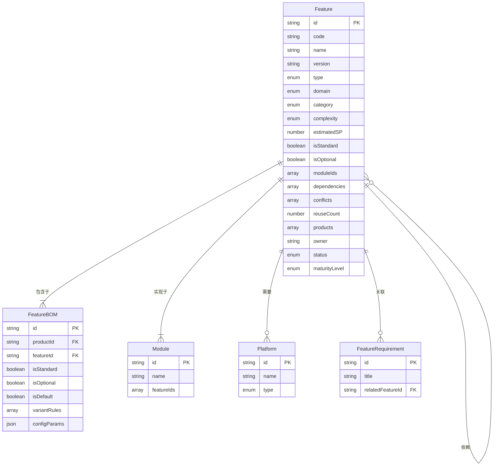

# Feature资产设计

> **文档版本**: v1.0  
> **创建日期**: 2026-01-10  
> **目的**: 定义Feature（特性）资产的完整设计

---

## 一、概述

### 1.1 什么是Feature资产

**Feature（特性资产）** 是可复用的功能单元，是产品的组成部分。

**核心理念**：
- ✅ Feature是**资产**，不是需求
- ✅ Feature可以**跨产品复用**
- ✅ Feature有**独立的版本演进**
- ✅ Feature可以**配置和组装**

### 1.2 Feature vs FeatureRequirement

| 维度 | Feature（资产） | FeatureRequirement（需求） |
|------|----------------|--------------------------|
| **定位** | 可复用的功能单元 | 对功能的具体要求 |
| **生命周期** | 独立版本演进 | 跟随需求生命周期 |
| **复用性** | 可跨产品复用 | 特定于某个产品 |
| **技术实现** | 包含实现信息（模块、接口） | 不涉及技术实现 |
| **BOM管理** | 可配置、可组装 | 不参与BOM |

**示例对比**：

```typescript
// Feature资产: "AVP自动泊车特性 v1.5"
{
  id: "FEAT-AVP-001",
  name: "AVP自动泊车",
  version: "1.5.0",
  moduleIds: ["MOD-PARK-PER", "MOD-PARK-PLAN", "MOD-PARK-CTRL"],
  dependencies: ["FEAT-MAP-001", "FEAT-USS-001"],
  status: "active",
  reuseCount: 5  // 被5个产品使用
}

// FeatureRequirement: "支持垂直和水平车位泊车"
{
  id: "FR-PARK-001",
  title: "支持垂直和水平车位泊车",
  parentURId: "UR-PARK-001",
  relatedFeatureId: "FEAT-AVP-001",  // 关联Feature资产
  acceptanceCriteria: "Given车位>2.4m, When启动, Then成功率>95%",
  status: "已实现"
}
```

---

## 二、Feature实体设计

### 2.1 数据模型

```typescript
/**
 * Feature资产实体
 */
interface Feature {
  // ========== 基本信息 ==========
  id: string;                    // FEAT-AVP-001
  code: string;                  // AVP
  name: string;                  // 自动代客泊车
  nameEn?: string;               // Automated Valet Parking
  version: string;               // 1.5.0
  description: string;           // 特性描述
  
  // ========== 分类 ==========
  type: FeatureType;             // Functional | NonFunctional
  domain: Domain;                // ADAS | IVI | BCM | ...
  category: FeatureCategory;     // Common | Variant | Custom
  
  // ========== 复杂度与规模 ==========
  complexity: Complexity;        // High | Medium | Low
  estimatedStoryPoints: number;  // 估算工作量（SP）
  
  // ========== 配置属性 ==========
  isStandard: boolean;           // 是否可作为标配
  isOptional: boolean;           // 是否可作为选配
  isConfigurable: boolean;       // 是否支持配置
  
  // ========== 依赖与冲突 ==========
  dependencies: FeatureDependency[];  // 依赖的其他Feature
  conflicts: string[];           // 冲突的Feature ID
  
  // ========== 实现映射 ==========
  moduleIds: string[];           // 实现此Feature的Module列表
  logicalComponents?: string[];  // 逻辑组件（可选）
  
  // ========== 技术约束 ==========
  platformRequirements?: string[];  // 需要的Platform
  hardwareRequirements?: {
    sensors?: string[];          // 需要的传感器
    computePower?: string;       // 算力要求
    memory?: string;             // 内存要求
  };
  
  // ========== 质量属性 ==========
  performanceRequirements?: {
    latency?: string;            // 延迟要求
    throughput?: string;         // 吞吐量要求
    accuracy?: string;           // 准确率要求
  };
  
  safetyLevel?: SafetyLevel;     // 安全等级（ASIL-A/B/C/D）
  
  // ========== 复用信息 ==========
  reuseCount: number;            // 被复用次数
  products: string[];            // 使用此Feature的产品ID
  
  // ========== 管理信息 ==========
  owner: string;                 // 特性负责人
  ownerTeam: string;             // 负责团队
  status: AssetStatus;           // Active | Deprecated | Draft
  maturityLevel: MaturityLevel;  // 成熟度级别
  
  // ========== 版本历史 ==========
  versionHistory: FeatureVersion[];
  
  // ========== 关联 ==========
  relatedRequirements: string[]; // 关联的FeatureRequirement ID
  
  // ========== 商业信息 ==========
  licenseCost?: number;          // 许可成本
  developmentCost?: number;      // 开发成本
  maintenanceCost?: number;      // 维护成本
  
  // ========== 元数据 ==========
  createdAt: Date;
  updatedAt: Date;
  createdBy: string;
  updatedBy: string;
}

// ========== 枚举类型 ==========

enum FeatureType {
  Functional = 'functional',         // 功能型特性
  NonFunctional = 'non_functional'   // 非功能型特性
}

enum FeatureCategory {
  Common = 'common',      // 通用特性（所有产品共享）
  Variant = 'variant',    // 变体特性（可配置）
  Custom = 'custom'       // 定制特性（特定产品）
}

enum Complexity {
  High = 'high',
  Medium = 'medium',
  Low = 'low'
}

enum AssetStatus {
  Draft = 'draft',           // 草稿
  Active = 'active',         // 活跃
  Deprecated = 'deprecated', // 已弃用
  Archived = 'archived'      // 已归档
}

enum MaturityLevel {
  Prototype = 'prototype',  // 原型
  Alpha = 'alpha',          // Alpha
  Beta = 'beta',            // Beta
  GA = 'ga',                // General Availability
  Mature = 'mature',        // 成熟
  Legacy = 'legacy'         // 遗留
}

enum SafetyLevel {
  QM = 'qm',           // Quality Management
  ASIL_A = 'asil_a',
  ASIL_B = 'asil_b',
  ASIL_C = 'asil_c',
  ASIL_D = 'asil_d'
}

// ========== 辅助类型 ==========

interface FeatureDependency {
  featureId: string;
  dependencyType: 'require' | 'optional' | 'enhance';
  reason?: string;
}

interface FeatureVersion {
  version: string;
  releaseDate: Date;
  changes: string;
  status: 'draft' | 'released' | 'deprecated';
  releaseNotes?: string;
}
```

### 2.2 Mermaid可视化



---

## 三、Feature BOM设计

### 3.1 Feature BOM概念

**Feature BOM (Bill of Materials)** 定义产品包含哪些Feature，以及每个Feature的配置规则。

### 3.2 数据模型

```typescript
/**
 * Feature BOM
 */
interface FeatureBOM {
  // ========== 基本信息 ==========
  id: string;
  productId: string;             // 所属产品
  featureId: string;             // Feature ID
  
  // ========== 配置规则 ==========
  isStandard: boolean;           // 是否标配
  isOptional: boolean;           // 是否可选配
  isDefault: boolean;            // 是否默认启用
  
  // ========== 变体规则 ==========
  variantRules?: VariantRule[];  // 变体规则
  
  // ========== 配置参数 ==========
  configurationParameters?: Record<string, any>;  // 配置参数
  
  // ========== 优先级 ==========
  priority: number;              // 优先级（用于冲突解决）
  
  // ========== 版本约束 ==========
  versionConstraint?: string;    // Feature版本约束（如：>=1.5.0）
  
  // ========== 许可与授权 ==========
  requiresLicense?: boolean;     // 是否需要许可
  licenseType?: string;          // 许可类型
  
  // ========== 元数据 ==========
  createdAt: Date;
  updatedAt: Date;
}

/**
 * 变体规则
 */
interface VariantRule {
  condition: string;             // 条件表达式
  action: 'include' | 'exclude'; // 动作
  reason?: string;               // 原因说明
}
```

### 3.3 变体规则示例

```typescript
// 示例1: 基于车型的变体规则
{
  condition: "vehicleModel === '旗舰版'",
  action: "include",
  reason: "旗舰版标配AVP"
}

// 示例2: 基于市场的变体规则
{
  condition: "region === 'CN' AND vehiclePrice > 300000",
  action: "include",
  reason: "中国市场30万以上车型标配"
}

// 示例3: 基于传感器的变体规则
{
  condition: "hasUltrasonicRadar === false",
  action: "exclude",
  reason: "AVP需要超声波雷达"
}
```

---

## 四、Feature关系设计

### 4.1 Feature → Module (M:N)

```typescript
// Feature实体
interface Feature {
  moduleIds: string[];  // 实现此Feature的Module
}

// Module实体
interface Module {
  featureIds: string[];  // 支持哪些Feature
}

// 示例
const featureAVP: Feature = {
  id: "FEAT-AVP-001",
  name: "AVP自动泊车",
  moduleIds: [
    "MOD-PARK-PER-001",  // 泊车感知模块
    "MOD-PARK-PLAN-001", // 泊车规划模块
    "MOD-PARK-CTRL-001"  // 泊车控制模块
  ]
};

const moduleParkingPerception: Module = {
  id: "MOD-PARK-PER-001",
  name: "泊车感知模块",
  featureIds: [
    "FEAT-AVP-001",      // 支持AVP
    "FEAT-PARK-ASSIST"   // 支持泊车辅助
  ]
};
```

### 4.2 Feature → Feature (依赖)

```typescript
const featureAVP: Feature = {
  id: "FEAT-AVP-001",
  name: "AVP自动泊车",
  dependencies: [
    {
      featureId: "FEAT-MAP-001",
      dependencyType: "require",
      reason: "需要高精地图支持"
    },
    {
      featureId: "FEAT-USS-001",
      dependencyType: "require",
      reason: "需要超声波雷达"
    },
    {
      featureId: "FEAT-SLAM-001",
      dependencyType: "optional",
      reason: "可选SLAM增强定位"
    }
  ],
  conflicts: ["FEAT-MANUAL-PARK"]  // 与手动泊车冲突
};
```

### 4.3 Product → Feature (通过BOM)

```typescript
const productAdas: Product = {
  id: "PROD-ADAS-FLAG",
  name: "ADAS旗舰版",
  featureBOM: [
    {
      featureId: "FEAT-AVP-001",
      isStandard: true,
      isOptional: false,
      isDefault: true
    },
    {
      featureId: "FEAT-NOA-001",
      isStandard: true,
      isOptional: false,
      isDefault: true
    },
    {
      featureId: "FEAT-ACC-001",
      isStandard: true,
      isOptional: false,
      isDefault: true
    }
  ]
};
```

### 4.4 FeatureRequirement → Feature

```typescript
const featureRequirement: FeatureRequirement = {
  id: "FR-PARK-001",
  title: "支持垂直和水平车位泊车",
  level: "feature",
  parentURId: "UR-PARK-001",
  relatedFeatureId: "FEAT-AVP-001",  // 关联Feature资产
  acceptanceCriteria: [
    "Given 车位尺寸>2.4m",
    "When 启动泊车",
    "Then 成功率>95%"
  ]
};
```

---

## 五、Feature典型场景

### 5.1 场景1: Feature复用

**问题**: "AVP特性被哪些产品使用？如何统一升级？"

**解决方案**:

```typescript
// 1. 查询Feature的使用情况
const feature = getFeature("FEAT-AVP-001");
console.log(feature.reuseCount);  // 5
console.log(feature.products);    // ["PROD-ADAS-FLAG", "PROD-ADAS-HIGH", ...]

// 2. 升级Feature版本
feature.version = "1.6.0";
feature.versionHistory.push({
  version: "1.6.0",
  releaseDate: new Date(),
  changes: "支持斜列车位",
  status: "released"
});

// 3. 影响分析
const affectedProducts = getProductsByFeature("FEAT-AVP-001");
const affectedModules = feature.moduleIds;
// 通知: 5个产品、3个模块受影响
```

### 5.2 场景2: 产品配置

**问题**: "旗舰版和标准版有什么功能差异？"

**解决方案**:

```typescript
const flagshipFeatures = getFeaturesByProduct("PROD-ADAS-FLAG");
const standardFeatures = getFeaturesByProduct("PROD-ADAS-STD");

const diff = {
  onlyInFlagship: flagshipFeatures.filter(f => 
    !standardFeatures.some(sf => sf.id === f.id)
  ),
  onlyInStandard: standardFeatures.filter(f => 
    !flagshipFeatures.some(ff => ff.id === f.id)
  ),
  common: flagshipFeatures.filter(f => 
    standardFeatures.some(sf => sf.id === f.id)
  )
};

// 结果:
// onlyInFlagship: [AVP, NOA高速, 自动变道]
// onlyInStandard: []
// common: [ACC, LKA, AEB]
```

### 5.3 场景3: 依赖检查

**问题**: "能否为某产品添加AVP特性？"

**解决方案**:

```typescript
function canAddFeature(productId: string, featureId: string): ValidationResult {
  const feature = getFeature(featureId);
  const product = getProduct(productId);
  
  // 1. 检查依赖
  for (const dep of feature.dependencies) {
    if (dep.dependencyType === 'require') {
      const hasFeature = product.featureBOM.some(
        bom => bom.featureId === dep.featureId
      );
      if (!hasFeature) {
        return {
          valid: false,
          reason: `缺少依赖特性: ${dep.featureId}`
        };
      }
    }
  }
  
  // 2. 检查冲突
  for (const conflictId of feature.conflicts) {
    const hasConflict = product.featureBOM.some(
      bom => bom.featureId === conflictId
    );
    if (hasConflict) {
      return {
        valid: false,
        reason: `与已有特性冲突: ${conflictId}`
      };
    }
  }
  
  // 3. 检查平台
  if (feature.platformRequirements) {
    const productPlatforms = getProductPlatforms(productId);
    const missingPlatforms = feature.platformRequirements.filter(
      p => !productPlatforms.includes(p)
    );
    if (missingPlatforms.length > 0) {
      return {
        valid: false,
        reason: `缺少平台: ${missingPlatforms.join(', ')}`
      };
    }
  }
  
  return { valid: true };
}
```

### 5.4 场景4: Feature级影响分析

**问题**: "修改AVP特性会影响哪些团队？"

**解决方案**:

```typescript
function analyzeFeatureImpact(featureId: string) {
  const feature = getFeature(featureId);
  
  // 1. 受影响的模块
  const modules = feature.moduleIds.map(id => getModule(id));
  
  // 2. 受影响的团队
  const teams = modules.map(m => m.ownerTeam).filter(unique);
  
  // 3. 受影响的产品
  const products = feature.products.map(id => getProduct(id));
  
  // 4. 受影响的工作项
  const workItems = getWorkItemsByModuleIds(feature.moduleIds);
  
  return {
    affectedModules: modules.length,
    affectedTeams: teams,
    affectedProducts: products.length,
    affectedWorkItems: workItems.length,
    estimatedEffort: feature.estimatedStoryPoints * modules.length
  };
}

// 结果:
// {
//   affectedModules: 3,
//   affectedTeams: ["感知团队", "规划团队", "控制团队"],
//   affectedProducts: 5,
//   affectedWorkItems: 12,
//   estimatedEffort: 240 SP
// }
```

---

## 六、数据示例

### 6.1 智能驾驶Feature示例

```json
[
  {
    "id": "FEAT-AVP-001",
    "code": "AVP",
    "name": "自动代客泊车",
    "version": "1.5.0",
    "type": "functional",
    "domain": "ADAS",
    "category": "variant",
    "complexity": "high",
    "estimatedStoryPoints": 80,
    "isStandard": false,
    "isOptional": true,
    "isConfigurable": true,
    "dependencies": [
      {
        "featureId": "FEAT-MAP-001",
        "dependencyType": "require",
        "reason": "需要高精地图"
      }
    ],
    "moduleIds": [
      "MOD-PARK-PER-001",
      "MOD-PARK-PLAN-001",
      "MOD-PARK-CTRL-001"
    ],
    "platformRequirements": ["PLT-ORIN-X"],
    "performanceRequirements": {
      "latency": "<500ms",
      "accuracy": ">95%"
    },
    "safetyLevel": "asil_b",
    "reuseCount": 5,
    "products": ["PROD-ADAS-FLAG", "PROD-ADAS-HIGH"],
    "owner": "Zhang San",
    "ownerTeam": "TEAM-PARKING",
    "status": "active",
    "maturityLevel": "ga"
  },
  {
    "id": "FEAT-NOA-001",
    "code": "NOA",
    "name": "高速NOA领航辅助",
    "version": "2.0.0",
    "type": "functional",
    "domain": "ADAS",
    "category": "variant",
    "complexity": "high",
    "estimatedStoryPoints": 120,
    "dependencies": [
      {
        "featureId": "FEAT-PERC-001",
        "dependencyType": "require"
      },
      {
        "featureId": "FEAT-PLAN-001",
        "dependencyType": "require"
      }
    ],
    "moduleIds": [
      "MOD-PER-CAM-001",
      "MOD-PLAN-001",
      "MOD-CTRL-001"
    ],
    "reuseCount": 3,
    "status": "active",
    "maturityLevel": "ga"
  },
  {
    "id": "FEAT-ACC-001",
    "code": "ACC",
    "name": "自适应巡航控制",
    "version": "3.0.0",
    "type": "functional",
    "domain": "ADAS",
    "category": "common",
    "complexity": "medium",
    "estimatedStoryPoints": 50,
    "isStandard": true,
    "reuseCount": 10,
    "status": "active",
    "maturityLevel": "mature"
  }
]
```

---

## 七、实施计划

### 7.1 数据准备（Week 1）

- [ ] 创建 `biz-data/mock/feature/features.json`（20+ Feature）
- [ ] 创建 `biz-data/mock/feature/feature-bom.json`（Product-Feature映射）
- [ ] 扩展 `biz-data/mock/modules.json`（添加featureIds）
- [ ] 扩展 `biz-data/mock/products.json`（添加featureBOM）

### 7.2 页面实现（Week 2）

- [ ] Feature列表页面 `frontend/src/views/Feature/List.vue`
- [ ] Feature详情页面 `frontend/src/views/Feature/Detail.vue`
- [ ] Feature-Module关系图组件
- [ ] Product页面集成Feature BOM展示

### 7.3 工具函数

- [ ] `getFeaturesByProduct(productId)`
- [ ] `getProductsByFeature(featureId)`
- [ ] `analyzeFeatureImpact(featureId)`
- [ ] `validateFeatureDependencies(productId, featureId)`
- [ ] `compareProductFeatures(product1, product2)`

---

## 八、验收标准

### 8.1 数据验收

- [ ] 20+ Feature实体数据
- [ ] 涵盖ADAS/IVI/BCM等领域
- [ ] 包含common/variant/custom三种类别
- [ ] Feature-Module双向关系完整
- [ ] 每个Product有完整的Feature BOM

### 8.2 功能验收

- [ ] 可以查询"Feature被哪些产品使用"
- [ ] 可以对比"旗舰版vs标准版功能差异"
- [ ] 可以分析"Feature修改的影响范围"
- [ ] 可以验证"产品能否添加某Feature"

### 8.3 页面验收

- [ ] Feature列表页面可用
- [ ] Feature详情页面完整
- [ ] Feature-Module关系可视化
- [ ] Product页面展示Feature BOM

---

**文档版本**: v1.0  
**状态**: ✅ 设计完成，待实施

