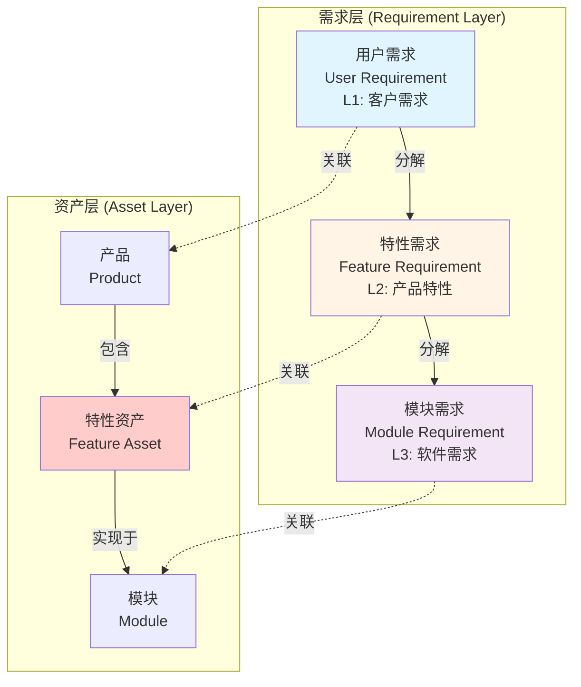

# 三层需求体系设计

> **文档版本**: v1.0  
> **创建日期**: 2026-01-10  
> **目的**: 定义三层需求体系（用户需求-特性需求-模块需求）及其与资产的关系

---

## 一、概述

### 1.1 三层需求 vs 三层资产

**核心理念：需求与资产分离**



**关键区别**：

| 维度 | 需求 (Requirement) | 资产 (Asset) |
|------|-------------------|--------------|
| **定位** | 描述"要什么" | 描述"是什么" |
| **生命周期** | 跟随项目/版本 | 独立演进 |
| **复用性** | 特定于某个产品 | 可跨产品复用 |
| **管理方式** | 需求管理 | 资产管理 |
| **版本** | 随产品版本 | 独立版本管理 |

**示例对比**：

```typescript
// 用户需求 (Requirement)
{
  id: "UR-PARK-001",
  title: "用户需要一键自动泊车功能",
  type: "user_requirement",
  productId: "PROD-ADAS-FLAG",  // 特定于旗舰版产品
  priority: "P0",
  status: "approved"
}

// vs

// 产品 (Asset)
{
  id: "PROD-ADAS-FLAG",
  name: "ADAS旗舰版",
  version: "2.0.0",
  featureBOM: ["FEAT-AVP-001", ...]  // 包含的特性资产
}
```

---

## 二、三层需求详细设计

### 2.1 L1: 用户需求 (User Requirement)

#### 2.1.1 定义

**用户需求 (UR)** 是从用户/客户视角描述的需求，通常来自市场调研、客户反馈、法规要求。

#### 2.1.2 数据模型

```typescript
/**
 * 用户需求 (User Requirement)
 */
interface UserRequirement {
  // ========== 基本信息 ==========
  id: string;                    // UR-PARK-001
  title: string;                 // 一键自动泊车
  description: string;           // 详细描述
  
  // ========== 分类 ==========
  type: URType;                  // Strategic | Experience | Regulatory
  source: RequirementSource;     // Customer | Market | Regulation | Internal
  
  // ========== 关联 ==========
  productId: string;             // 关联的产品
  relatedProductAssetId?: string; // 关联的产品资产（可选）
  
  // ========== 优先级与价值 ==========
  priority: Priority;            // P0 | P1 | P2 | P3
  businessValue: number;         // 业务价值评分 1-100
  marketImpact: string;          // 市场影响描述
  
  // ========== 干系人 ==========
  stakeholders: string[];        // 干系人列表
  owner: string;                 // 需求负责人（通常是PM）
  
  // ========== 验收标准 ==========
  acceptanceCriteria: string[];  // 验收标准
  successMetrics?: {
    metric: string;              // 指标名称
    target: string;              // 目标值
  }[];
  
  // ========== 分解 ==========
  childFeatureRequirements: string[]; // 分解的特性需求
  
  // ========== 追溯 ==========
  parentStrategyId?: string;     // 上级战略目标
  
  // ========== 状态 ==========
  status: RequirementStatus;     // Draft | Approved | In_Progress | Completed | Cancelled
  
  // ========== 元数据 ==========
  createdAt: Date;
  updatedAt: Date;
  createdBy: string;
  approvedBy?: string;
  approvedAt?: Date;
}

// ========== 枚举类型 ==========

enum URType {
  Strategic = 'strategic',      // 战略型（如：进入新市场）
  Experience = 'experience',    // 体验型（如：提升用户体验）
  Regulatory = 'regulatory'     // 合规型（如：满足法规要求）
}

enum RequirementSource {
  Customer = 'customer',        // 客户需求
  Market = 'market',            // 市场需求
  Regulation = 'regulation',    // 法规要求
  Internal = 'internal'         // 内部需求
}

enum Priority {
  P0 = 'p0',  // 必须
  P1 = 'p1',  // 重要
  P2 = 'p2',  // 应该
  P3 = 'p3'   // 可选
}

enum RequirementStatus {
  Draft = 'draft',
  Approved = 'approved',
  InProgress = 'in_progress',
  Completed = 'completed',
  Cancelled = 'cancelled'
}
```

#### 2.1.3 示例

```json
{
  "id": "UR-PARK-001",
  "title": "用户需要一键自动泊车功能",
  "description": "用户希望在停车场通过手机APP或车内按钮一键启动，车辆自动寻找车位并完成泊车",
  "type": "experience",
  "source": "customer",
  "productId": "PROD-ADAS-FLAG",
  "priority": "p0",
  "businessValue": 90,
  "marketImpact": "差异化竞争优势，提升高端市场占有率",
  "stakeholders": ["PM-Zhang", "SE-Li", "Marketing-Wang"],
  "owner": "PM-Zhang",
  "acceptanceCriteria": [
    "用户可通过APP远程启动泊车",
    "支持垂直、水平、斜列车位",
    "泊车成功率>95%",
    "泊车时间<3分钟"
  ],
  "successMetrics": [
    {
      "metric": "用户满意度",
      "target": ">4.5分/5分"
    },
    {
      "metric": "功能使用率",
      "target": ">60%"
    }
  ],
  "childFeatureRequirements": ["FR-PARK-001", "FR-PARK-002", "FR-PARK-003"],
  "status": "approved"
}
```

---

### 2.2 L2: 特性需求 (Feature Requirement)

#### 2.2.1 定义

**特性需求 (FR)** 是从产品特性视角描述的需求，将用户需求分解为具体的产品特性要求。

**关键点**：
- FR是**需求**，不是资产
- FR可以**关联**Feature资产，但不等于Feature
- 一个Feature资产可以被多个FR引用

#### 2.2.2 数据模型

```typescript
/**
 * 特性需求 (Feature Requirement)
 */
interface FeatureRequirement {
  // ========== 基本信息 ==========
  id: string;                    // FR-PARK-001
  title: string;                 // 自动寻找车位
  description: string;           // 详细描述
  
  // ========== 分类 ==========
  type: FRType;                  // Functional | NonFunctional
  category: string;              // 功能分类
  
  // ========== 关联 ==========
  parentUserRequirementId: string;     // 上级用户需求
  relatedFeatureAssetId?: string;      // 关联的Feature资产（可选）
  productId: string;                   // 所属产品
  
  // ========== 优先级 ==========
  priority: Priority;            // P0 | P1 | P2 | P3
  
  // ========== 验收标准 ==========
  acceptanceCriteria: AcceptanceCriteria[];
  
  // ========== 性能指标 ==========
  performanceRequirements?: {
    latency?: string;            // 延迟要求
    throughput?: string;         // 吞吐量要求
    accuracy?: string;           // 准确率要求
    reliability?: string;        // 可靠性要求
  };
  
  // ========== 分解 ==========
  childModuleRequirements: string[];   // 分解的模块需求
  
  // ========== 依赖 ==========
  dependencies?: {
    requirementId: string;
    type: 'require' | 'optional';
  }[];
  
  // ========== 负责人 ==========
  owner: string;                 // 需求负责人（通常是SE）
  
  // ========== 状态 ==========
  status: RequirementStatus;
  
  // ========== 元数据 ==========
  createdAt: Date;
  updatedAt: Date;
}

// ========== 辅助类型 ==========

enum FRType {
  Functional = 'functional',
  NonFunctional = 'non_functional'
}

interface AcceptanceCriteria {
  given: string;                 // Given前置条件
  when: string;                  // When触发条件
  then: string;                  // Then预期结果
}
```

#### 2.2.3 特性需求 vs 特性资产

```typescript
// 特性需求 (Requirement)
{
  id: "FR-PARK-001",
  title: "支持垂直和水平车位自动泊车",
  type: "functional",
  parentUserRequirementId: "UR-PARK-001",
  relatedFeatureAssetId: "FEAT-AVP-001",  // 关联到AVP特性资产
  productId: "PROD-ADAS-FLAG",            // 特定于旗舰版
  acceptanceCriteria: [
    {
      given: "车位尺寸>2.4m",
      when: "启动自动泊车",
      then: "成功率>95%"
    }
  ],
  status: "approved"
}

// vs

// 特性资产 (Asset)
{
  id: "FEAT-AVP-001",
  code: "AVP",
  name: "自动代客泊车",
  version: "1.5.0",                       // 独立版本
  moduleIds: ["MOD-PARK-PER", "MOD-PARK-PLAN", "MOD-PARK-CTRL"],
  reuseCount: 5,                          // 被5个产品复用
  products: ["PROD-ADAS-FLAG", "PROD-ADAS-HIGH", ...],
  status: "active",
  maturityLevel: "ga"
}
```

**关系说明**：
- FR通过`relatedFeatureAssetId`关联到Feature资产
- 多个产品的FR可以关联到同一个Feature资产
- Feature资产独立演进，FR跟随产品版本

---

### 2.3 L3: 模块需求 (Module Requirement)

#### 2.3.1 定义

**模块需求 (MR)** 是软件级别的需求，描述具体模块要实现的功能。

**V3简化**：
- V2: MR → Story → Task
- V3: MR → Task（直接拆分，取消Story层）

#### 2.3.2 数据模型

```typescript
/**
 * 模块需求 (Module Requirement)
 */
interface ModuleRequirement {
  // ========== 基本信息 ==========
  id: string;                    // MR-PARK-PER-001
  title: string;                 // 实现车位检测算法
  description: string;           // 详细描述
  
  // ========== 分类 ==========
  type: MRType;                  // Functional | Technical
  
  // ========== 关联 ==========
  parentFeatureRequirementId: string;  // 上级特性需求
  moduleId: string;                    // 实现的模块
  relatedModuleAssetId?: string;       // 关联的Module资产（通常就是moduleId）
  
  // ========== 优先级与工作量 ==========
  priority: Priority;            // P0 | P1 | P2 | P3
  storyPoints: number;           // 故事点估算
  estimatedHours?: number;       // 预估工时
  
  // ========== 验收标准 ==========
  acceptanceCriteria: AcceptanceCriteria[];
  
  // ========== 技术约束 ==========
  technicalConstraints?: {
    language?: string;           // 编程语言
    framework?: string;          // 框架要求
    performance?: string;        // 性能要求
  };
  
  // ========== 分解 ==========
  taskIds: string[];             // 拆分的任务（V3直接到Task）
  
  // ========== 实现追溯 ==========
  commitIds?: string[];          // 关联的代码提交
  testCaseIds?: string[];        // 关联的测试用例
  
  // ========== 负责 ==========
  owner: string;                 // 负责人（通常是FO或Dev）
  assignedTeam: string;          // 分配的团队
  
  // ========== 状态 ==========
  status: RequirementStatus;
  
  // ========== Sprint ==========
  sprintId?: string;             // 分配的Sprint
  piId?: string;                 // 所属PI
  
  // ========== 元数据 ==========
  createdAt: Date;
  updatedAt: Date;
}

enum MRType {
  Functional = 'functional',     // 功能需求
  Technical = 'technical'        // 技术需求
}
```

---

## 三、需求与资产的关系设计

### 3.1 关系总览

```mermaid
erDiagram
    UserRequirement ||--|{ FeatureRequirement : "分解"
    FeatureRequirement ||--|{ ModuleRequirement : "分解"
    ModuleRequirement ||--|{ Task : "拆分"
    
    UserRequirement }o--|| Product : "关联"
    FeatureRequirement }o--o| Feature : "关联"
    ModuleRequirement }o--|| Module : "关联"
    
    Product ||--|{ Feature : "包含(BOM)"
    Feature ||--|{ Module : "实现于"
    Module ||--|| Platform : "部署于"
    
    UserRequirement {
        string id PK
        string title
        string productId FK
        string relatedProductAssetId FK_OPT
        array childFeatureRequirements
        enum status
    }
    
    FeatureRequirement {
        string id PK
        string title
        string parentUserRequirementId FK
        string relatedFeatureAssetId FK_OPT
        string productId FK
        array childModuleRequirements
        enum status
    }
    
    ModuleRequirement {
        string id PK
        string title
        string parentFeatureRequirementId FK
        string moduleId FK
        array taskIds
        number storyPoints
        enum status
    }
    
    Product {
        string id PK
        string name
        array featureBOM
    }
    
    Feature {
        string id PK
        string code
        string name
        string version
        array moduleIds
        number reuseCount
        array products
    }
    
    Module {
        string id PK
        string name
        array featureIds
        object deployment
    }
```

### 3.2 关键关系说明

#### 3.2.1 需求分解关系

```
UR (1) → (N) FR
FR (1) → (N) MR
MR (1) → (N) Task

示例:
UR-PARK-001: 一键自动泊车
├─ FR-PARK-001: 自动寻找车位
│  ├─ MR-PARK-PER-001: 实现车位检测算法
│  │  ├─ TASK-001: 实现超声波数据融合
│  │  └─ TASK-002: 实现车位识别
│  └─ MR-PARK-PER-002: 实现障碍物检测
├─ FR-PARK-002: 路径规划
│  └─ MR-PARK-PLAN-001: 实现泊车路径规划
└─ FR-PARK-003: 车辆控制
   └─ MR-PARK-CTRL-001: 实现低速控制
```

#### 3.2.2 需求与资产关联

```
UR ─┬─ 关联 → Product（产品资产）
    └─ 分解 → FR ─┬─ 关联 → Feature（特性资产）
                  └─ 分解 → MR ─┬─ 关联 → Module（模块资产）
                                └─ 拆分 → Task（工作项）

示例:
UR-PARK-001
├─ 关联产品: PROD-ADAS-FLAG
└─ 分解为:
   FR-PARK-001
   ├─ 关联特性资产: FEAT-AVP-001（可复用）
   └─ 分解为:
      MR-PARK-PER-001
      ├─ 关联模块: MOD-PARK-PER-001
      └─ 拆分为:
         TASK-001, TASK-002
```

#### 3.2.3 资产复用示例

```typescript
// Feature资产被多个需求引用
const featureAVP = {
  id: "FEAT-AVP-001",
  name: "AVP自动泊车",
  reuseCount: 3,
  products: ["PROD-ADAS-FLAG", "PROD-ADAS-HIGH", "PROD-NOA-001"]
};

// 3个不同产品的特性需求都关联到同一个Feature资产
const frFlag = {
  id: "FR-FLAG-AVP",
  title: "旗舰版AVP功能",
  productId: "PROD-ADAS-FLAG",
  relatedFeatureAssetId: "FEAT-AVP-001"  // 关联到同一个Feature
};

const frHigh = {
  id: "FR-HIGH-AVP",
  title: "高配版AVP功能（选配）",
  productId: "PROD-ADAS-HIGH",
  relatedFeatureAssetId: "FEAT-AVP-001"  // 关联到同一个Feature
};

const frNOA = {
  id: "FR-NOA-AVP",
  title: "NOA产品集成AVP",
  productId: "PROD-NOA-001",
  relatedFeatureAssetId: "FEAT-AVP-001"  // 关联到同一个Feature
};
```

---

## 四、完整追溯链路

### 4.1 端到端追溯

```
L0: 战略目标
  ↓
L1: 用户需求 (UR)  ←→ Product（产品资产）
  ↓
L2: 特性需求 (FR)  ←→ Feature（特性资产）
  ↓
L3: 模块需求 (MR)  ←→ Module（模块资产）
  ↓                   ↓
L4: 任务 (Task)    Platform（平台资产）
  ↓
L5: 代码提交 (Commit)
  ↓
L6: 测试用例 (TestCase)
  ↓
L7: 交付物 (Artifact)
```

### 4.2 双向追溯示例

#### 正向追溯（需求到实现）

```typescript
function traceRequirementToImplementation(urId: string) {
  const ur = getUserRequirement(urId);
  const product = getProduct(ur.productId);
  
  // L1 → L2
  const frs = ur.childFeatureRequirements.map(id => getFeatureRequirement(id));
  
  // L2 → Feature资产
  const features = frs
    .filter(fr => fr.relatedFeatureAssetId)
    .map(fr => getFeature(fr.relatedFeatureAssetId));
  
  // L2 → L3
  const mrs = frs.flatMap(fr => 
    fr.childModuleRequirements.map(id => getModuleRequirement(id))
  );
  
  // L3 → Module资产
  const modules = mrs.map(mr => getModule(mr.moduleId));
  
  // L3 → L4
  const tasks = mrs.flatMap(mr => 
    mr.taskIds.map(id => getTask(id))
  );
  
  // L4 → L5
  const commits = mrs.flatMap(mr => 
    mr.commitIds?.map(id => getCommit(id)) || []
  );
  
  return {
    userRequirement: ur,
    product,
    featureRequirements: frs,
    featureAssets: features,
    moduleRequirements: mrs,
    modules,
    tasks,
    commits,
    // 影响分析
    affectedTeams: unique(modules.map(m => m.ownerTeam)),
    totalStoryPoints: sum(mrs.map(mr => mr.storyPoints))
  };
}
```

#### 反向追溯（实现到需求）

```typescript
function traceImplementationToRequirement(moduleId: string) {
  const module = getModule(moduleId);
  
  // Module → Feature资产
  const features = module.featureIds.map(id => getFeature(id));
  
  // Module → L3
  const mrs = getModuleRequirementsByModule(moduleId);
  
  // L3 → L2
  const frs = mrs.map(mr => 
    getFeatureRequirement(mr.parentFeatureRequirementId)
  );
  
  // L2 → L1
  const urs = frs.map(fr => 
    getUserRequirement(fr.parentUserRequirementId)
  );
  
  // L1 → Product
  const products = urs.map(ur => getProduct(ur.productId));
  
  return {
    module,
    featureAssets: features,
    moduleRequirements: mrs,
    featureRequirements: frs,
    userRequirements: urs,
    products,
    // 复用分析
    usedByProducts: unique(products.map(p => p.name))
  };
}
```

---

## 五、典型场景

### 5.1 场景1: 需求分解

**需求**: 产品经理提出"一键自动泊车"用户需求

**分解流程**:

```
1. PM创建UR
   UR-PARK-001: 一键自动泊车
   └─ 关联产品: PROD-ADAS-FLAG

2. SE分解为FR
   ├─ FR-PARK-001: 自动寻找车位
   │  └─ 关联Feature资产: FEAT-AVP-001
   ├─ FR-PARK-002: 路径规划
   │  └─ 关联Feature资产: FEAT-PLAN-001
   └─ FR-PARK-003: 车辆控制
      └─ 关联Feature资产: FEAT-CTRL-001

3. FO/Dev分解为MR
   FR-PARK-001 → MR
   ├─ MR-PARK-PER-001: 车位检测（8 SP）
   │  └─ 分配到: MOD-PARK-PER-001, TEAM-PERCEPTION
   └─ MR-PARK-PER-002: 障碍物检测（5 SP）
      └─ 分配到: MOD-PARK-PER-001, TEAM-PERCEPTION

4. Dev拆分为Task
   MR-PARK-PER-001 → Task
   ├─ TASK-001: 超声波数据融合
   └─ TASK-002: 车位识别算法
```

### 5.2 场景2: 资产复用

**需求**: 高配版产品也需要AVP功能

**复用流程**:

```
1. 已有旗舰版需求和资产
   FR-FLAG-AVP (旗舰版) ─→ FEAT-AVP-001 (特性资产)

2. 创建高配版需求，关联到同一个Feature资产
   FR-HIGH-AVP (高配版) ─→ FEAT-AVP-001 (复用)

3. 根据高配版差异，创建新的MR
   FR-HIGH-AVP → MR-HIGH-AVP-001
   └─ moduleId: MOD-PARK-PER-001 (复用同一个模块)
   └─ 差异: 降低配置参数，减少传感器

4. Feature资产的reuseCount++
   FEAT-AVP-001.reuseCount: 1 → 2
   FEAT-AVP-001.products: ["PROD-ADAS-FLAG", "PROD-ADAS-HIGH"]
```

### 5.3 场景3: 影响分析

**问题**: "如果Feature AVP升级到v1.6，会影响哪些需求和产品？"

```typescript
function analyzeFeatureUpgradeImpact(featureId: string, newVersion: string) {
  const feature = getFeature(featureId);
  
  // 1. 找到所有关联此Feature的FR
  const frs = getFeatureRequirementsByFeatureAsset(featureId);
  
  // 2. 找到所有受影响的产品
  const products = unique(frs.map(fr => getProduct(fr.productId)));
  
  // 3. 找到所有受影响的MR
  const mrs = frs.flatMap(fr => 
    fr.childModuleRequirements.map(id => getModuleRequirement(id))
  );
  
  // 4. 找到所有受影响的团队
  const teams = unique(mrs.map(mr => getTeam(mr.assignedTeam)));
  
  return {
    featureName: feature.name,
    currentVersion: feature.version,
    targetVersion: newVersion,
    affectedProducts: products.length,
    affectedProductNames: products.map(p => p.name),
    affectedFeatureRequirements: frs.length,
    affectedModuleRequirements: mrs.length,
    affectedTeams: teams.map(t => t.name),
    estimatedEffort: sum(mrs.map(mr => mr.storyPoints)),
    recommendedActions: [
      "通知所有受影响的产品经理",
      "评估兼容性影响",
      "更新所有关联的MR",
      "安排回归测试"
    ]
  };
}
```

---

## 六、数据示例

详见:
- `biz-data/mock/requirement/user-requirements.json`
- `biz-data/mock/requirement/feature-requirements.json`
- `biz-data/mock/requirement/module-requirements.json`

---

## 七、实施指南

### 7.1 需求管理流程

```
1. 用户需求阶段
   PM创建UR → 评审 → 关联Product → 批准

2. 特性需求阶段
   SE分解UR为FR → 关联Feature资产 → 技术评审 → 批准

3. 模块需求阶段
   FO分解FR为MR → 关联Module → 估算SP → 分配Team → 批准

4. 任务拆分阶段
   Dev拆分MR为Task → 分配到Sprint → 开发实现

5. 实现追溯
   Task → Commit → Build → TestCase → Artifact
```

### 7.2 注意事项

1. **需求与资产分离**
   - 需求描述"要什么"
   - 资产描述"是什么"
   - 通过ID关联，不混淆

2. **关联是可选的**
   - FR可以不关联Feature资产（新功能）
   - 关联后可以分析复用情况

3. **一对多关系**
   - 一个Feature资产可以被多个FR引用
   - 一个Module可以被多个MR引用

4. **版本管理**
   - 需求版本跟随产品版本
   - 资产版本独立演进

---

## 八、验收标准

- [ ] 三层需求数据完整（UR/FR/MR各10+）
- [ ] 需求分解关系清晰（parent-child）
- [ ] 需求与资产关联正确（relatedAssetId）
- [ ] 可以正向追溯（UR→FR→MR→Task→Commit）
- [ ] 可以反向追溯（Commit→Task→MR→FR→UR）
- [ ] 可以分析资产复用（Feature被多个FR引用）
- [ ] 可以分析影响范围（Feature升级影响）

---

**文档版本**: v1.0  
**状态**: ✅ 设计完成，待数据补充

