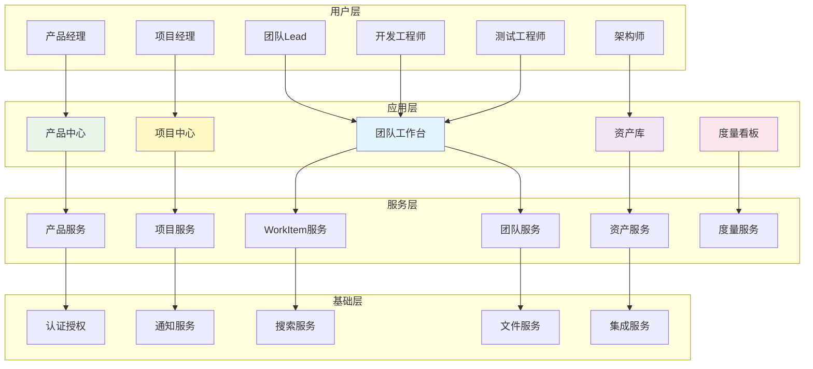
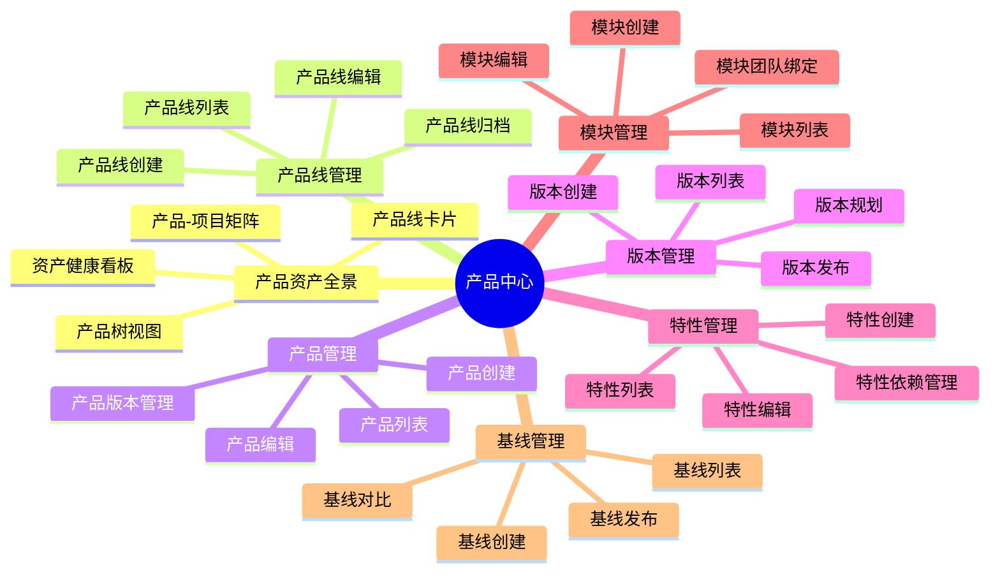
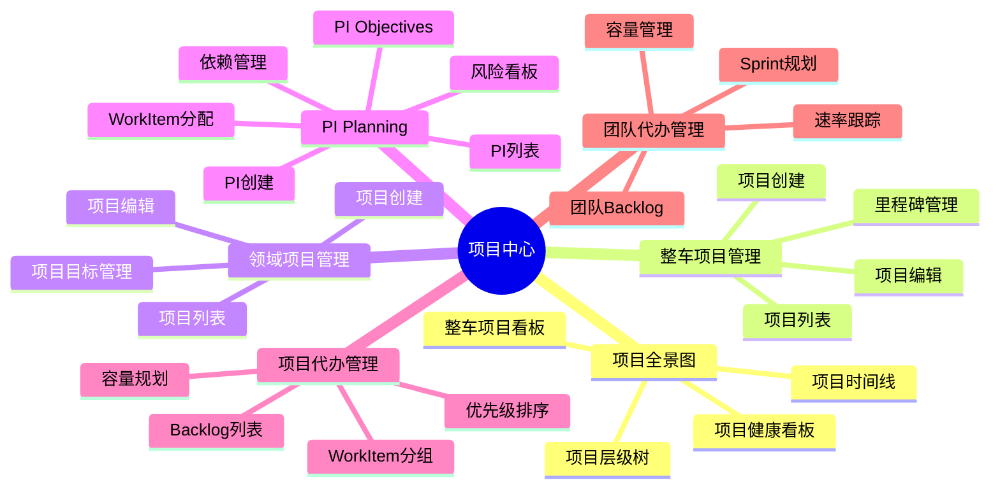
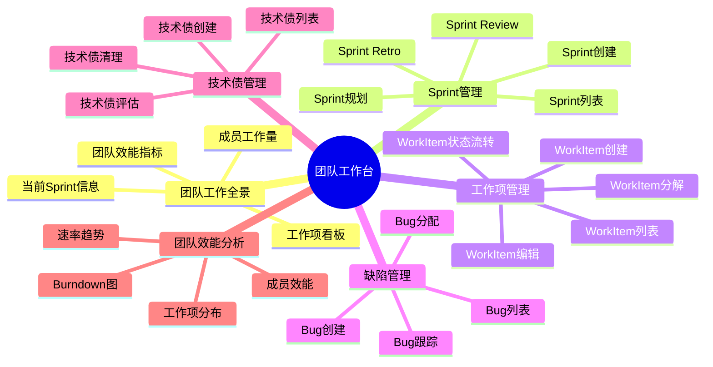
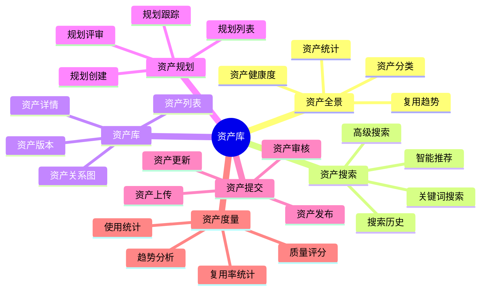
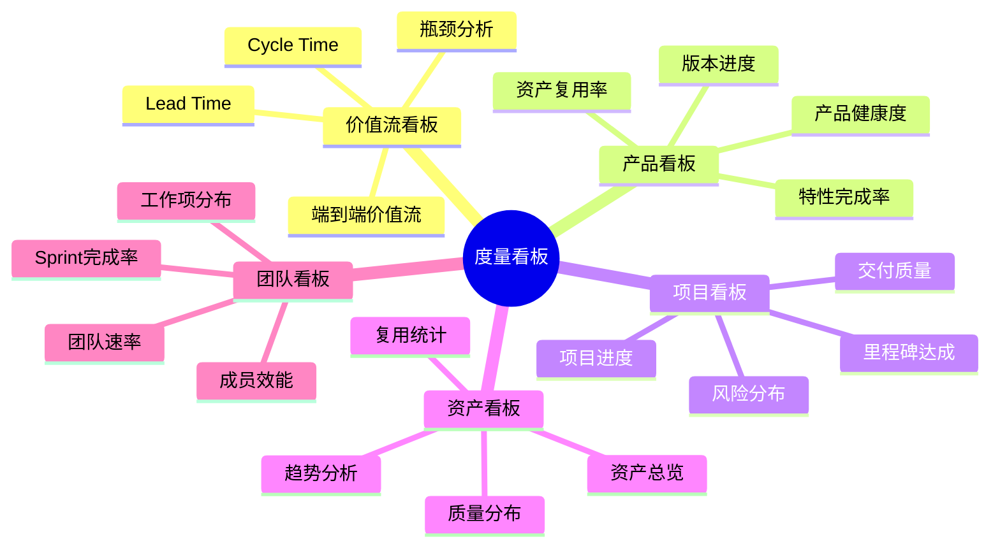
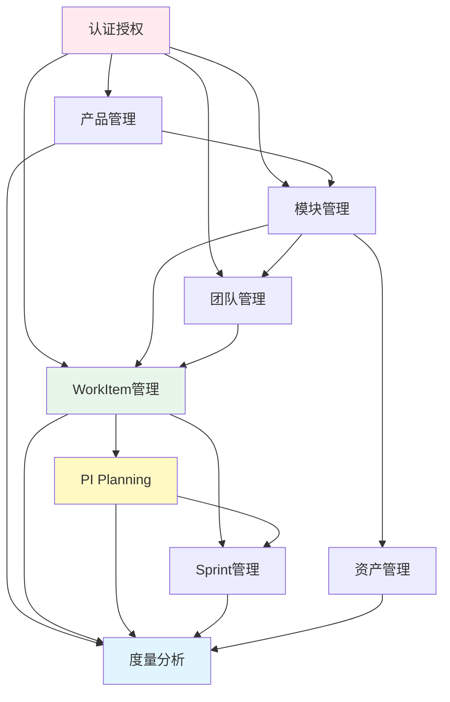

# 功能架构设计

> **关注点**: 平台功能模块与能力  
> **目标**: 完整的功能清单与依赖关系

---

## 📋 目录

1. [功能架构概述](#一功能架构概述)
2. [功能模块划分](#二功能模块划分)
3. [核心功能设计](#三核心功能设计)
4. [功能依赖关系](#四功能依赖关系)
5. [功能路线图](#五功能路线图)

---

## 一、功能架构概述

### 1.1 功能架构全景



### 1.2 功能分层模型

```
┌─────────────────────────────────────────────────────────┐
│                    用户界面层                            │
│  产品中心 | 项目中心 | 团队工作台 | 资产库 | 度量看板     │
├─────────────────────────────────────────────────────────┤
│                    业务服务层                            │
│  产品服务 | 项目服务 | WorkItem服务 | 团队服务 | 资产服务│
├─────────────────────────────────────────────────────────┤
│                    平台服务层                            │
│  认证授权 | 通知服务 | 搜索服务 | 文件服务 | 集成服务    │
├─────────────────────────────────────────────────────────┤
│                    数据访问层                            │
│  数据库 | 缓存 | 消息队列 | 对象存储                    │
└─────────────────────────────────────────────────────────┘
```

---

## 二、功能模块划分

### 2.1 产品中心功能



#### 产品中心功能清单

| 功能模块 | 子功能 | 说明 | 优先级 |
|---------|-------|------|--------|
| **产品资产全景** | 产品线卡片展示 | 横向滚动卡片，显示产品线统计 | P0 |
| | 产品树视图 | 3级树：产品线→产品→版本 | P0 |
| | 产品-项目矩阵 | 显示产品在项目中的应用情况 | P1 |
| | 资产健康看板 | 统计产品、版本、特性、复用率 | P1 |
| **产品线管理** | 产品线CRUD | 创建、查看、编辑、删除产品线 | P0 |
| | 产品线路线图 | 产品线发展规划 | P2 |
| **产品管理** | 产品CRUD | 创建、查看、编辑、删除产品 | P0 |
| | 产品配置 | 产品特性配置、模块配置 | P1 |
| | 产品BOM | 产品物料清单管理 | P2 |
| **版本管理** | 版本CRUD | 创建、查看、编辑、删除版本 | P0 |
| | 版本规划 | 版本特性规划、里程碑规划 | P1 |
| | 版本发布 | 版本发布流程、发布记录 | P1 |
| **特性管理** | 特性CRUD | 创建、查看、编辑、删除特性 | P0 |
| | 特性依赖 | 特性依赖关系管理 | P1 |
| | 特性复用 | 特性复用追踪 | P2 |
| **模块管理** | 模块CRUD | 创建、查看、编辑、删除模块 | P0 |
| | 模块-团队绑定 | 模块责任团队绑定 | P0 ⭐ |
| | 模块健康度 | 模块质量、复用度评估 | P2 |
| **基线管理** | 基线CRUD | 创建、查看、编辑、删除基线 | P1 |
| | 基线对比 | 基线版本对比 | P2 |
| | 基线发布 | 基线发布流程 | P1 |

### 2.2 项目中心功能



#### 项目中心功能清单

| 功能模块 | 子功能 | 说明 | 优先级 |
|---------|-------|------|--------|
| **项目全景图** | 整车项目看板 | 卡片式展示整车项目 | P0 |
| | 项目时间线 | 项目里程碑时间线 | P1 |
| | 项目层级树 | 3级树：整车→领域→PI | P0 |
| | 项目健康看板 | 项目统计、交付率、风险 | P1 |
| **整车项目** | 项目CRUD | 创建、查看、编辑、删除 | P0 |
| | 里程碑管理 | 里程碑创建、跟踪 | P1 |
| | 项目集成 | 多领域项目集成管理 | P2 |
| **领域项目** | 项目CRUD | 创建、查看、编辑、删除 | P0 |
| | 项目目标 | 项目目标设定、跟踪 | P1 |
| | 版本关联 | 关联产品版本 | P0 |
| **PI Planning** | PI CRUD | 创建、查看、编辑、删除PI | P0 |
| | PI Objectives | PI目标管理 | P0 ⭐ |
| | WorkItem分配 | 拖拽式WorkItem分配 | P0 ⭐ |
| | 依赖管理 | WorkItem依赖关系 | P1 |
| | 风险看板 | 风险识别、评估、跟踪 | P1 |
| | 容量规划 | 团队容量与WorkItem匹配 | P1 |
| **项目代办** | Backlog列表 | 项目级Backlog | P0 |
| | WorkItem分组 | 按模块、优先级分组 | P1 |
| | 优先级排序 | 拖拽排序 | P1 |
| | 统计分析 | Backlog统计、趋势 | P2 |
| **团队代办** | 团队Backlog | 团队级Backlog | P0 |
| | Sprint规划 | Sprint WorkItem规划 | P0 |
| | 容量管理 | 团队容量管理 | P1 |
| | 速率跟踪 | 团队速率跟踪 | P1 |

### 2.3 团队工作台功能



#### 团队工作台功能清单

| 功能模块 | 子功能 | 说明 | 优先级 |
|---------|-------|------|--------|
| **团队工作全景** | 当前Sprint信息 | Sprint进度、剩余天数、完成率 | P0 |
| | 工作项看板 | 3列看板：待开始、进行中、已完成 | P0 ⭐ |
| | 拖拽更新状态 | 拖拽WorkItem改变状态 | P0 ⭐ |
| | 成员工作量 | 成员任务数、SP、利用率 | P1 |
| | 团队效能指标 | 速率、完成率、Bug数、周期 | P1 |
| **Sprint管理** | Sprint CRUD | 创建、查看、编辑、删除Sprint | P0 |
| | Sprint规划 | Sprint Planning会议支持 | P1 |
| | Sprint Review | Sprint评审记录 | P2 |
| | Sprint Retro | Sprint回顾记录 | P2 |
| **WorkItem管理** | WorkItem CRUD | 创建、查看、编辑、删除 | P0 |
| | WorkItem分解 | 分解为子WorkItem | P0 ⭐ |
| | 状态流转 | 状态变更、进度更新 | P0 |
| | 工作量估算 | 工时、SP估算 | P1 |
| | 关联关系 | 依赖、阻塞关系 | P1 |
| **缺陷管理** | Bug CRUD | 创建、查看、编辑、删除Bug | P0 |
| | Bug分配 | Bug分配给成员 | P0 |
| | Bug跟踪 | Bug状态跟踪 | P1 |
| | Bug统计 | Bug趋势、分布 | P2 |
| **技术债管理** | 技术债CRUD | 创建、查看、编辑、删除 | P1 |
| | 技术债评估 | 影响度、紧急度评估 | P1 |
| | 技术债清理 | 清理计划、进度跟踪 | P2 |
| **团队效能** | 速率趋势 | 团队速率历史趋势 | P1 |
| | Burndown图 | Sprint Burndown Chart | P1 |
| | 工作项分布 | 按类型、状态分布 | P2 |
| | 成员效能 | 成员工作量、效率 | P2 |

### 2.4 资产库功能



#### 资产库功能清单

| 功能模块 | 子功能 | 说明 | 优先级 |
|---------|-------|------|--------|
| **资产全景** | 资产统计 | 资产总数、分类统计 | P1 |
| | 资产分类 | 按类型、领域分类 | P1 |
| | 资产健康度 | 质量评分、复用率 | P2 |
| | 复用趋势 | 复用趋势图表 | P2 |
| **资产搜索** | 关键词搜索 | 全文搜索 | P0 ⭐ |
| | 高级搜索 | 多条件组合搜索 | P1 |
| | 智能推荐 | 基于需求推荐资产 | P2 |
| | 搜索历史 | 搜索记录、热门搜索 | P2 |
| **资产库** | 资产列表 | 资产浏览、筛选 | P0 |
| | 资产详情 | 资产完整信息展示 | P0 |
| | 资产版本 | 版本历史、版本对比 | P1 |
| | 资产关系图 | 资产依赖关系可视化 | P1 |
| **资产规划** | 规划CRUD | 创建、查看、编辑、删除 | P1 |
| | 规划评审 | 规划评审流程 | P2 |
| | 规划跟踪 | 规划执行跟踪 | P2 |
| **资产提交** | 资产上传 | 上传资产文件、文档 | P1 |
| | 资产审核 | 资产质量审核流程 | P1 |
| | 资产发布 | 资产发布到资产库 | P1 |
| | 资产更新 | 资产版本更新 | P1 |
| **资产度量** | 复用率统计 | 资产复用次数、复用率 | P1 |
| | 质量评分 | 资产质量评分 | P2 |
| | 使用统计 | 资产使用情况统计 | P2 |
| | 趋势分析 | 复用趋势、质量趋势 | P2 |

### 2.5 度量看板功能



#### 度量看板功能清单

| 功能模块 | 子功能 | 说明 | 优先级 |
|---------|-------|------|--------|
| **价值流看板** | 端到端价值流 | 从需求到交付的价值流 | P1 |
| | Lead Time | 前置时间统计 | P1 |
| | Cycle Time | 周期时间统计 | P1 |
| | 瓶颈分析 | 价值流瓶颈识别 | P2 |
| **产品看板** | 产品健康度 | 产品质量、进度健康度 | P1 |
| | 版本进度 | 版本开发进度 | P1 |
| | 特性完成率 | 特性完成统计 | P2 |
| | 资产复用率 | 产品资产复用率 | P2 |
| **项目看板** | 项目进度 | 项目整体进度 | P0 |
| | 里程碑达成 | 里程碑达成情况 | P1 |
| | 风险分布 | 项目风险分布 | P1 |
| | 交付质量 | 交付质量指标 | P2 |
| **资产看板** | 资产总览 | 资产数量、分类统计 | P1 |
| | 复用统计 | 资产复用统计 | P1 |
| | 质量分布 | 资产质量分布 | P2 |
| | 趋势分析 | 资产趋势分析 | P2 |
| **团队看板** | 团队速率 | 团队速率统计 | P1 |
| | Sprint完成率 | Sprint完成率统计 | P1 |
| | 工作项分布 | 工作项类型、状态分布 | P2 |
| | 成员效能 | 成员工作量、效率 | P2 |

---

## 三、核心功能设计

### 3.1 WorkItem管理功能 ⭐⭐⭐

#### 功能概述

WorkItem管理是平台的核心功能，支持8种工作项类型的统一管理。

#### 核心能力

```yaml
1. WorkItem创建
   - 支持8种类型创建
   - 表单验证
   - 自动编号
   - 自动分配团队（基于moduleId）

2. WorkItem分解
   - 父子关系建立
   - 子WorkItem继承属性
   - 层级可视化

3. WorkItem状态流转
   - 5种状态：pending → in_progress → completed
   - 状态变更记录
   - 状态变更通知

4. WorkItem分配
   - 分配团队（自动/手动）
   - 分配Sprint
   - 分配成员（task类型必填）

5. WorkItem查询
   - 多条件筛选
   - 全文搜索
   - 高级查询

6. WorkItem统计
   - 按类型统计
   - 按状态统计
   - 按团队统计
   - 趋势分析
```

#### 关键接口

```typescript
// 创建WorkItem
POST /api/work-items
Request: {
  title: string
  type: WorkItemType
  moduleId?: string
  parentWorkItemId?: string
  assignee?: string  // task类型必填
  estimatedHours: number
  storyPoints?: number
  priority: Priority
}
Response: WorkItem

// 分解WorkItem
POST /api/work-items/{id}/decompose
Request: {
  childWorkItems: CreateWorkItemInput[]
}
Response: WorkItem[]

// 更新状态
PUT /api/work-items/{id}/status
Request: {
  status: WorkItemStatus
}
Response: WorkItem

// 分配
PUT /api/work-items/{id}/assign
Request: {
  assignedTeamId?: string
  assignedSprintId?: string
  assignee?: string
}
Response: WorkItem
```

### 3.2 PI Planning功能 ⭐⭐⭐

#### 功能概述

PI Planning是敏捷大规模框架的核心活动，支持8-12周的增量规划。

#### 核心能力

```yaml
1. PI创建与配置
   - PI基本信息
   - 时间周期设置
   - 参与团队配置

2. PI Objectives管理
   - Objectives创建
   - 业务价值评分
   - 信心度评估
   - 团队分配

3. WorkItem分配
   - WorkItem池展示
   - 拖拽分配到团队
   - 容量可视化
   - 超载提醒

4. 依赖管理
   - 依赖关系识别
   - 依赖矩阵可视化
   - 依赖风险评估

5. 风险管理
   - 风险识别
   - 风险评估
   - 风险看板
   - 缓解措施

6. PI发布
   - 生成PI Backlog
   - 生成团队迭代计划
   - 发布通知
```

#### 关键界面

```
PI Planning主界面:
┌─────────────────────────────────────────────────────────┐
│ PI-2026-Q1 Planning                        [保存] [发布] │
├─────────────────────────────────────────────────────────┤
│ Tab: [PI Objectives] [WorkItem分配] [依赖] [风险] [日程] │
│                                                          │
│ WorkItem分配 Tab:                                        │
│ ┌────────────┬──────────────────────────────────────┐  │
│ │WorkItem池  │ 团队分配                              │  │
│ │            │                                       │  │
│ │🔲 WI-001   │ 【感知团队】 容量: 60 SP              │  │
│ │  路口识别  │ 已分配: 45 SP (75%) ████████░░        │  │
│ │  13 SP     │ ┌───────────────────────┐            │  │
│ │            │ │ ✓ WI-002 融合感知 13SP │            │  │
│ │🔲 WI-003   │ │ ✓ WI-005 场景识别 20SP │            │  │
│ │  轨迹规划  │ │ ✓ BUG-010 修复 12SP    │            │  │
│ │  8 SP      │ └───────────────────────┘            │  │
│ │            │                                       │  │
│ │[拖拽到→]   │ 【规划团队】 容量: 55 SP              │  │
│ │            │ 已分配: 40 SP (73%) ███████░░░        │  │
│ │            │ ...                                   │  │
│ └────────────┴──────────────────────────────────────┘  │
└─────────────────────────────────────────────────────────┘
```

### 3.3 资产搜索功能 ⭐⭐⭐

#### 功能概述

资产搜索是资产复用的关键功能，支持智能搜索和推荐。

#### 核心能力

```yaml
1. 关键词搜索
   - 全文搜索
   - 模糊匹配
   - 高亮显示

2. 高级搜索
   - 多条件组合
   - 资产类型筛选
   - 领域筛选
   - 质量评分筛选
   - 复用次数筛选

3. 搜索结果排序
   - 相关度排序
   - 质量评分排序
   - 复用次数排序
   - 更新时间排序

4. 智能推荐（未来）
   - 基于需求推荐
   - 基于历史推荐
   - 相似资产推荐

5. 搜索统计
   - 搜索历史
   - 热门搜索
   - 搜索趋势
```

---

## 四、功能依赖关系

### 4.1 功能依赖图



### 4.2 功能优先级矩阵

| 功能模块 | 优先级 | 依赖 | 复杂度 | 工作量（人天） |
|---------|-------|------|--------|--------------|
| 认证授权 | P0 | 无 | 中 | 10 |
| 产品管理 | P0 | 认证授权 | 中 | 15 |
| 模块管理 | P0 | 产品管理 | 中 | 10 |
| 团队管理 | P0 | 认证授权 | 低 | 8 |
| WorkItem管理 | P0 ⭐ | 模块、团队 | 高 | 25 |
| Sprint管理 | P0 | WorkItem | 中 | 12 |
| PI Planning | P1 | WorkItem | 高 | 20 |
| 资产搜索 | P1 | 模块 | 中 | 15 |
| 资产管理 | P1 | 模块 | 中 | 18 |
| 度量分析 | P2 | 所有 | 中 | 20 |

---

## 五、功能路线图

### 5.1 MVP版本（3个月）

```yaml
目标: 核心功能可用，支持基本工作流

功能范围:
  产品中心:
    - 产品管理 ✓
    - 模块管理 ✓
    - 模块-团队绑定 ✓
  
  项目中心:
    - 领域项目管理 ✓
    - Sprint管理 ✓
  
  团队工作台:
    - WorkItem管理 ✓
    - WorkItem看板 ✓
    - Sprint看板 ✓
  
  基础功能:
    - 认证授权 ✓
    - 基础搜索 ✓
    - 通知服务 ✓

交付标准:
  - 支持1个产品线、3个产品
  - 支持5个团队并行工作
  - WorkItem创建、分配、状态流转正常
  - Sprint规划和执行流程完整
```

### 5.2 V1.0版本（6个月）

```yaml
目标: 完整的敏捷开发平台

新增功能:
  产品中心:
    - 产品资产全景 ✓
    - 版本管理 ✓
    - 特性管理 ✓
    - 基线管理 ✓
  
  项目中心:
    - 项目全景图 ✓
    - 整车项目管理 ✓
    - PI Planning ✓
    - 项目代办管理 ✓
    - 团队代办管理 ✓
  
  资产库:
    - 资产搜索 ✓
    - 资产库 ✓
    - 资产规划 ✓
  
  度量看板:
    - 项目看板 ✓
    - 团队看板 ✓

交付标准:
  - 支持PI Planning完整流程
  - 支持资产搜索和复用
  - 基础度量看板可用
  - 集成GitLab/JIRA
```

### 5.3 V2.0版本（12个月）

```yaml
目标: 智能化、自动化平台

新增功能:
  智能化:
    - 智能WorkItem分解 ✓
    - 智能工作量估算 ✓
    - 智能资产推荐 ✓
    - 智能风险预测 ✓
  
  自动化:
    - 自动化测试集成 ✓
    - 自动化部署 ✓
    - 自动化质量门禁 ✓
  
  高级度量:
    - 价值流看板 ✓
    - 产品看板 ✓
    - 资产看板 ✓
    - 预测性分析 ✓

交付标准:
  - AI辅助WorkItem管理
  - 完整的DevOps流水线
  - 预测性风险管理
  - 成为行业标杆
```

---

## 六、总结

### 功能架构核心价值

```
✓ 完整的功能清单 ⭐⭐⭐
  • 5大功能中心
  • 100+子功能
  • 清晰的优先级

✓ 核心功能突出 ⭐⭐⭐
  • WorkItem统一管理
  • PI Planning支持
  • 资产搜索复用

✓ 清晰的路线图 ⭐⭐⭐
  • MVP → V1.0 → V2.0
  • 分阶段交付
  • 持续演进

✓ 功能依赖清晰 ⭐⭐
  • 依赖关系图
  • 优先级矩阵
  • 工作量评估
```

---

**文档维护**:
- 创建: 2026-01-10
- 版本: 最新
- 负责人: 产品团队

