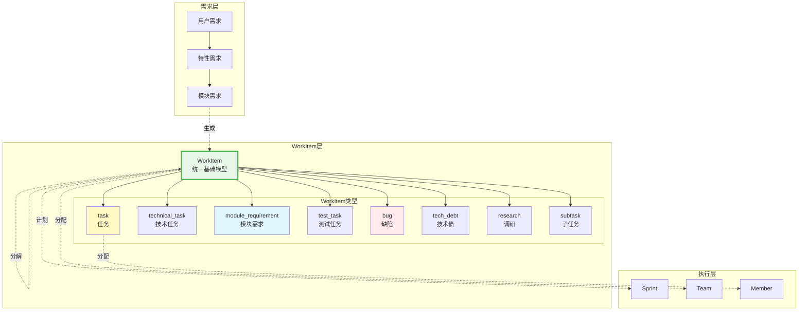
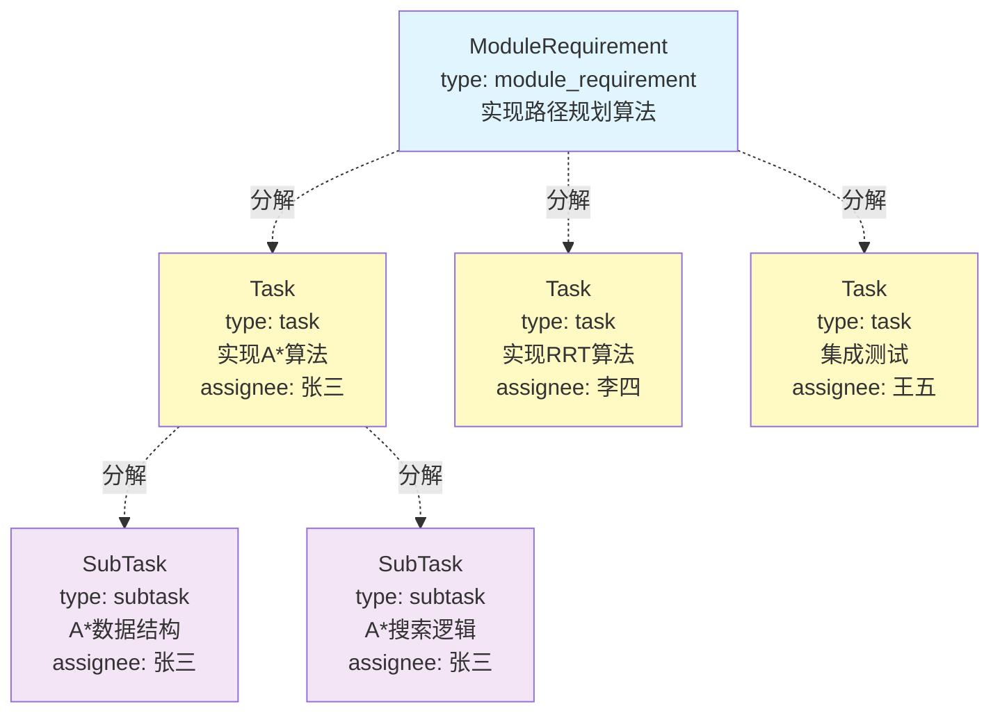
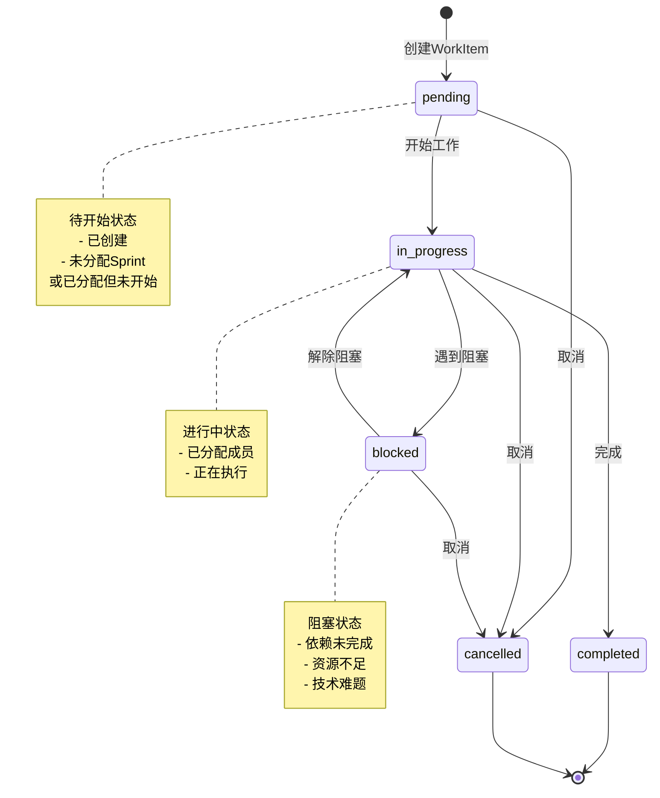
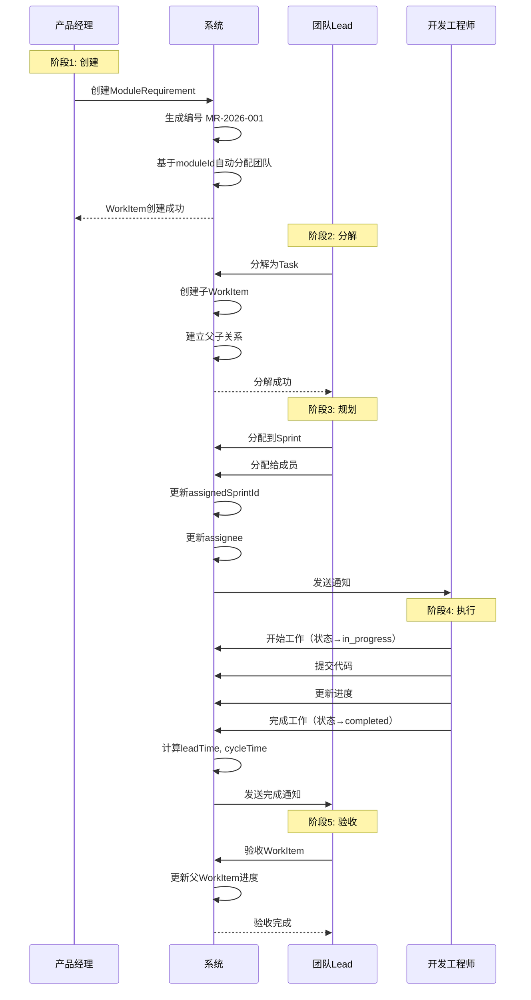
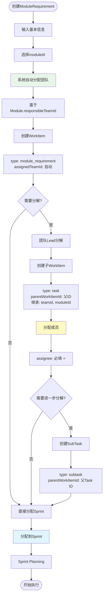
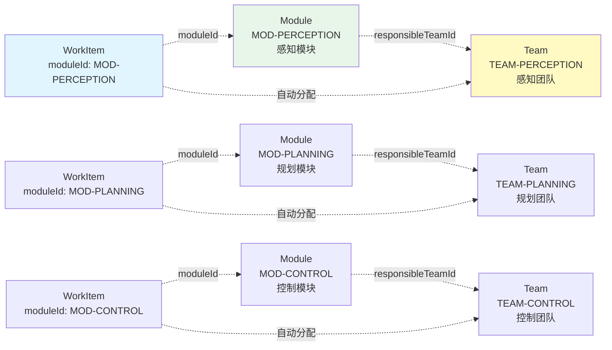

# 任务架构设计

> **关注点**: WorkItem统一模型与工作流  
> **目标**: 灵活的任务管理体系

---

## 📋 目录

1. [任务架构概述](#一任务架构概述)
2. [WorkItem统一模型](#二workitem统一模型)
3. [WorkItem工作流](#三workitem工作流)
4. [模块-团队责任绑定](#四模块-团队责任绑定)
5. [核心算法](#五核心算法)

---

## 一、任务架构概述

### 1.1 核心设计理念 ⭐⭐⭐

```
WorkItem是基础抽象模型，不是单独的一层
├─ Task、Bug、TechDebt等都是WorkItem的具体类型
├─ 不存在"工作项拆分为任务"的概念
├─ 而是"工作项分解为子工作项"
└─ 所有工作都是WorkItem，通过type字段区分类型
```

### 1.2 架构全景



---

## 二、WorkItem统一模型

### 2.1 WorkItem基础模型

```typescript
/**
 * WorkItem - 工作项基础模型
 * 
 * 核心理念：
 * - WorkItem是所有工作的基础抽象模型
 * - Task、Bug、TechDebt等都是WorkItem的具体类型
 * - 通过type字段区分不同类型
 * - 通过parentWorkItemId建立层级关系
 */
interface WorkItem {
  // ========== 基本信息 ==========
  id: string                    // 工作项ID: WI-001
  code: string                  // 工作项编码: TASK-2026-001
  title: string                 // 标题
  description: string           // 描述
  
  // ========== 类型 ⭐⭐⭐ ==========
  type: WorkItemType            // 工作项类型（核心字段）
  
  // ========== 层级关系 ⭐⭐⭐ ==========
  parentWorkItemId?: string     // 父工作项ID
  childWorkItemIds: string[]    // 子工作项ID列表
  
  // ========== 关联关系 ==========
  moduleId?: string             // 关联模块
  featureId?: string            // 关联特性
  productId?: string            // 关联产品
  
  // ========== 分配信息 ⭐⭐⭐ ==========
  assignedTeamId?: string       // 分配团队（基于moduleId自动分配）
  assignedSprintId?: string     // 分配Sprint
  assignee?: string             // 分配人（task类型必填）
  
  // ========== 工作量 ==========
  estimatedHours: number        // 预估工时
  actualHours?: number          // 实际工时
  storyPoints?: number          // 故事点
  
  // ========== 优先级与状态 ==========
  priority: Priority            // 优先级
  status: WorkItemStatus        // 状态
  progress: number              // 进度 0-100
  
  // ========== 时间追踪 ==========
  createdAt: string
  createdBy: string
  updatedAt: string
  updatedBy: string
  startedAt?: string
  completedAt?: string
  
  // ========== 度量 ==========
  leadTime?: number             // 前置时间（小时）
  cycleTime?: number            // 周期时间（小时）
  
  // ========== 元数据 ==========
  tags: string[]                // 标签
  attachments: string[]         // 附件
}
```

### 2.2 WorkItem类型体系 ⭐⭐⭐

```typescript
/**
 * WorkItem类型枚举
 * 
 * 8种工作项类型，涵盖所有工作场景
 */
enum WorkItemType {
  // 1. 任务 - 最小执行单元
  TASK = 'task',
  
  // 2. 技术任务 - 重构、优化等技术工作
  TECHNICAL_TASK = 'technical_task',
  
  // 3. 模块需求 - 可分解为多个task
  MODULE_REQUIREMENT = 'module_requirement',
  
  // 4. 测试任务 - 测试执行单元
  TEST_TASK = 'test_task',
  
  // 5. 缺陷 - 缺陷修复
  BUG = 'bug',
  
  // 6. 技术债 - 技术债清理
  TECH_DEBT = 'tech_debt',
  
  // 7. 调研任务 - 技术调研
  RESEARCH = 'research',
  
  // 8. 子任务 - 任务的细分
  SUBTASK = 'subtask'
}
```

#### 类型详细说明

| 类型 | 说明 | 典型场景 | 是否可分解 | 是否必须分配人 |
|-----|------|---------|-----------|--------------|
| **task** | 任务：最小执行单元 | 实现一个函数、修复一个bug | 可分解为subtask | 是 ⭐ |
| **technical_task** | 技术任务：技术性工作 | 代码重构、性能优化 | 可分解为subtask | 是 |
| **module_requirement** | 模块需求：较大的需求 | 实现一个模块功能 | 可分解为task | 否 |
| **test_task** | 测试任务：测试执行 | 执行测试用例、自动化测试 | 可分解为subtask | 是 |
| **bug** | 缺陷：缺陷修复 | 修复崩溃、修复逻辑错误 | 可分解为task | 否 |
| **tech_debt** | 技术债：技术债清理 | 清理过时代码、升级依赖 | 可分解为technical_task | 否 |
| **research** | 调研：技术调研 | 技术选型、可行性研究 | 可分解为task | 否 |
| **subtask** | 子任务：任务细分 | 任务的更细粒度分解 | 不再分解 | 是 |

### 2.3 WorkItem层级关系



**层级关系示例**:

```typescript
// 模块需求（父WorkItem）
const workitem_requirement: WorkItem = {
  id: "WI-001",
  code: "MR-2026-001",
  title: "实现路径规划算法",
  type: "module_requirement",
  moduleId: "MOD-PLANNING",
  assignedTeamId: "TEAM-PLANNING",  // 自动分配
  childWorkItemIds: ["WI-002", "WI-003", "WI-004"],
  storyPoints: 21,
  status: "in_progress",
  // ...
}

// 任务1（子WorkItem）
const workitem_task1: WorkItem = {
  id: "WI-002",
  code: "TASK-2026-001",
  title: "实现A*算法",
  type: "task",
  parentWorkItemId: "WI-001",
  moduleId: "MOD-PLANNING",
  assignedTeamId: "TEAM-PLANNING",  // 继承
  assignedSprintId: "SPR-001",
  assignee: "USER-001",  // task必须分配人 ⭐
  estimatedHours: 16,
  storyPoints: 8,
  status: "in_progress",
  childWorkItemIds: ["WI-005", "WI-006"],  // 可进一步分解
  // ...
}

// 子任务（孙WorkItem）
const workitem_subtask1: WorkItem = {
  id: "WI-005",
  code: "SUBTASK-2026-001",
  title: "A*数据结构设计",
  type: "subtask",
  parentWorkItemId: "WI-002",
  moduleId: "MOD-PLANNING",
  assignedTeamId: "TEAM-PLANNING",
  assignedSprintId: "SPR-001",
  assignee: "USER-001",  // subtask必须分配人
  estimatedHours: 4,
  status: "completed",
  // ...
}
```

### 2.4 WorkItem状态模型

```typescript
/**
 * WorkItem状态枚举
 */
enum WorkItemStatus {
  PENDING = 'pending',         // 待开始
  IN_PROGRESS = 'in_progress', // 进行中
  COMPLETED = 'completed',     // 已完成
  CANCELLED = 'cancelled',     // 已取消
  BLOCKED = 'blocked'          // 阻塞
}
```

#### 状态流转图



---

## 三、WorkItem工作流

### 3.1 WorkItem生命周期



### 3.2 WorkItem分解流程



### 3.3 WorkItem自动分配机制 ⭐⭐⭐

```typescript
/**
 * WorkItem自动分配团队算法
 * 
 * 核心逻辑：基于moduleId自动分配团队
 */
function autoAssignTeam(workItem: WorkItem): string | null {
  // 1. 检查是否有moduleId
  if (!workItem.moduleId) {
    return null  // 无moduleId，无法自动分配
  }
  
  // 2. 查找模块
  const module = findModuleById(workItem.moduleId)
  if (!module) {
    throw new Error(`Module not found: ${workItem.moduleId}`)
  }
  
  // 3. 获取负责团队
  const teamId = module.responsibleTeamId
  if (!teamId) {
    throw new Error(`Module ${module.id} has no responsible team`)
  }
  
  // 4. 返回团队ID
  return teamId
}

/**
 * 创建WorkItem时自动分配
 */
function createWorkItem(input: CreateWorkItemInput): WorkItem {
  const workItem: WorkItem = {
    id: generateId(),
    code: generateCode(input.type),
    ...input,
    assignedTeamId: autoAssignTeam({ moduleId: input.moduleId } as WorkItem),
    childWorkItemIds: [],
    status: 'pending',
    progress: 0,
    createdAt: new Date().toISOString(),
    createdBy: getCurrentUser().id
  }
  
  // 保存到数据库
  saveWorkItem(workItem)
  
  // 发送通知
  notifyTeam(workItem.assignedTeamId, workItem)
  
  return workItem
}
```

---

## 四、模块-团队责任绑定

### 4.1 核心机制



### 4.2 数据模型

```typescript
/**
 * Module - 模块实体
 */
interface Module {
  id: string
  code: string
  name: string
  
  // ⭐⭐⭐ 核心字段：负责团队
  responsibleTeamId: string
  
  // 其他字段...
}

/**
 * Team - 团队实体
 */
interface Team {
  id: string
  code: string
  name: string
  
  // ⭐⭐⭐ 核心字段：负责的模块列表
  responsibleModules: string[]
  
  // 其他字段...
}

/**
 * WorkItem - 工作项实体
 */
interface WorkItem {
  id: string
  code: string
  title: string
  type: WorkItemType
  
  // ⭐⭐⭐ 核心字段：关联模块
  moduleId?: string
  
  // ⭐⭐⭐ 核心字段：分配团队（自动）
  assignedTeamId?: string
  
  // 其他字段...
}
```

### 4.3 绑定关系示例

```typescript
// 示例：感知团队负责4个模块
const team_perception: Team = {
  id: "TEAM-001",
  code: "PERCEPTION",
  name: "感知团队",
  responsibleModules: [
    "MOD-CAMERA",      // 摄像头模块
    "MOD-LIDAR",       // 激光雷达模块
    "MOD-RADAR",       // 毫米波雷达模块
    "MOD-FUSION"       // 传感器融合模块
  ],
  // ...
}

// 模块：摄像头感知
const module_camera: Module = {
  id: "MOD-CAMERA",
  code: "CAMERA",
  name: "摄像头感知模块",
  responsibleTeamId: "TEAM-001",  // 感知团队负责
  // ...
}

// WorkItem：优化摄像头性能
const workitem: WorkItem = {
  id: "WI-001",
  code: "TASK-2026-001",
  title: "优化摄像头感知性能",
  type: "technical_task",
  moduleId: "MOD-CAMERA",           // 关联摄像头模块
  assignedTeamId: "TEAM-001",       // 自动分配到感知团队 ⭐
  assignee: "USER-001",
  // ...
}
```

---

## 五、核心算法

### 5.1 WorkItem分解算法

```typescript
/**
 * WorkItem分解算法
 * 
 * @param parentWorkItem 父WorkItem
 * @param childInputs 子WorkItem输入列表
 * @returns 创建的子WorkItem列表
 */
function decomposeWorkItem(
  parentWorkItem: WorkItem,
  childInputs: CreateWorkItemInput[]
): WorkItem[] {
  const childWorkItems: WorkItem[] = []
  
  for (const input of childInputs) {
    // 1. 创建子WorkItem
    const childWorkItem: WorkItem = {
      id: generateId(),
      code: generateCode(input.type),
      ...input,
      
      // 2. 建立父子关系
      parentWorkItemId: parentWorkItem.id,
      
      // 3. 继承父WorkItem属性
      moduleId: input.moduleId || parentWorkItem.moduleId,
      featureId: input.featureId || parentWorkItem.featureId,
      productId: input.productId || parentWorkItem.productId,
      assignedTeamId: parentWorkItem.assignedTeamId,
      
      // 4. 初始化状态
      childWorkItemIds: [],
      status: 'pending',
      progress: 0,
      createdAt: new Date().toISOString(),
      createdBy: getCurrentUser().id
    }
    
    // 5. 验证：task类型必须有assignee
    if (childWorkItem.type === 'task' && !childWorkItem.assignee) {
      throw new Error(`Task type WorkItem must have assignee`)
    }
    
    // 6. 保存子WorkItem
    saveWorkItem(childWorkItem)
    childWorkItems.push(childWorkItem)
  }
  
  // 7. 更新父WorkItem的childWorkItemIds
  parentWorkItem.childWorkItemIds = childWorkItems.map(c => c.id)
  updateWorkItem(parentWorkItem)
  
  // 8. 发送通知
  for (const child of childWorkItems) {
    if (child.assignee) {
      notifyUser(child.assignee, child)
    }
  }
  
  return childWorkItems
}
```

### 5.2 WorkItem进度计算算法

```typescript
/**
 * WorkItem进度计算算法
 * 
 * 规则：
 * - 叶子节点：手动更新进度
 * - 非叶子节点：根据子WorkItem自动计算
 */
function calculateWorkItemProgress(workItem: WorkItem): number {
  // 1. 如果是叶子节点，返回当前进度
  if (workItem.childWorkItemIds.length === 0) {
    return workItem.progress
  }
  
  // 2. 如果有子WorkItem，根据子WorkItem计算
  const children = findWorkItemsByIds(workItem.childWorkItemIds)
  
  if (children.length === 0) {
    return workItem.progress
  }
  
  // 3. 计算方式：按storyPoints加权平均
  let totalStoryPoints = 0
  let completedStoryPoints = 0
  
  for (const child of children) {
    const childProgress = calculateWorkItemProgress(child)  // 递归计算
    const childSP = child.storyPoints || 1
    
    totalStoryPoints += childSP
    completedStoryPoints += childSP * (childProgress / 100)
  }
  
  // 4. 计算进度百分比
  const progress = totalStoryPoints > 0
    ? Math.round((completedStoryPoints / totalStoryPoints) * 100)
    : 0
  
  // 5. 更新WorkItem进度
  workItem.progress = progress
  updateWorkItem(workItem)
  
  return progress
}

/**
 * 更新WorkItem状态时自动更新进度
 */
function updateWorkItemStatus(
  workItemId: string,
  newStatus: WorkItemStatus
): void {
  const workItem = findWorkItemById(workItemId)
  
  // 1. 更新状态
  workItem.status = newStatus
  
  // 2. 根据状态自动更新进度
  if (newStatus === 'completed') {
    workItem.progress = 100
    workItem.completedAt = new Date().toISOString()
  } else if (newStatus === 'in_progress' && workItem.progress === 0) {
    workItem.progress = 10  // 开始工作，进度设为10%
    workItem.startedAt = new Date().toISOString()
  }
  
  // 3. 保存
  updateWorkItem(workItem)
  
  // 4. 递归更新父WorkItem进度
  if (workItem.parentWorkItemId) {
    const parent = findWorkItemById(workItem.parentWorkItemId)
    calculateWorkItemProgress(parent)
  }
}
```

### 5.3 WorkItem时间度量算法

```typescript
/**
 * 计算WorkItem的Lead Time和Cycle Time
 * 
 * Lead Time: 从创建到完成的时间
 * Cycle Time: 从开始到完成的时间
 */
function calculateWorkItemMetrics(workItem: WorkItem): void {
  if (workItem.status !== 'completed') {
    return  // 只计算已完成的WorkItem
  }
  
  const createdAt = new Date(workItem.createdAt)
  const startedAt = workItem.startedAt ? new Date(workItem.startedAt) : null
  const completedAt = new Date(workItem.completedAt!)
  
  // 1. 计算Lead Time（小时）
  workItem.leadTime = (completedAt.getTime() - createdAt.getTime()) / (1000 * 60 * 60)
  
  // 2. 计算Cycle Time（小时）
  if (startedAt) {
    workItem.cycleTime = (completedAt.getTime() - startedAt.getTime()) / (1000 * 60 * 60)
  }
  
  // 3. 保存
  updateWorkItem(workItem)
}

/**
 * 团队平均Cycle Time计算
 */
function calculateTeamAverageCycleTime(
  teamId: string,
  startDate: Date,
  endDate: Date
): number {
  // 1. 查询团队在时间范围内完成的WorkItem
  const workItems = findCompletedWorkItemsByTeam(teamId, startDate, endDate)
  
  if (workItems.length === 0) {
    return 0
  }
  
  // 2. 计算平均Cycle Time
  const totalCycleTime = workItems.reduce((sum, wi) => sum + (wi.cycleTime || 0), 0)
  const avgCycleTime = totalCycleTime / workItems.length
  
  return Math.round(avgCycleTime * 10) / 10  // 保留1位小数
}
```

---

## 六、总结

### 任务架构核心价值

```
✓ WorkItem统一模型 ⭐⭐⭐
  • 8种工作项类型
  • 统一的基础模型
  • 灵活的层级分解

✓ 模块-团队责任绑定 ⭐⭐⭐
  • 明确责任范围
  • 自动化分配
  • 减少协调成本

✓ 完整的工作流 ⭐⭐⭐
  • 创建→分解→规划→执行→验收
  • 状态流转清晰
  • 进度自动计算

✓ 度量体系完善 ⭐⭐
  • Lead Time
  • Cycle Time
  • 团队速率
```

---

**文档维护**:
- 创建: 2026-01-10
- 版本: 最新
- 负责人: 架构团队

