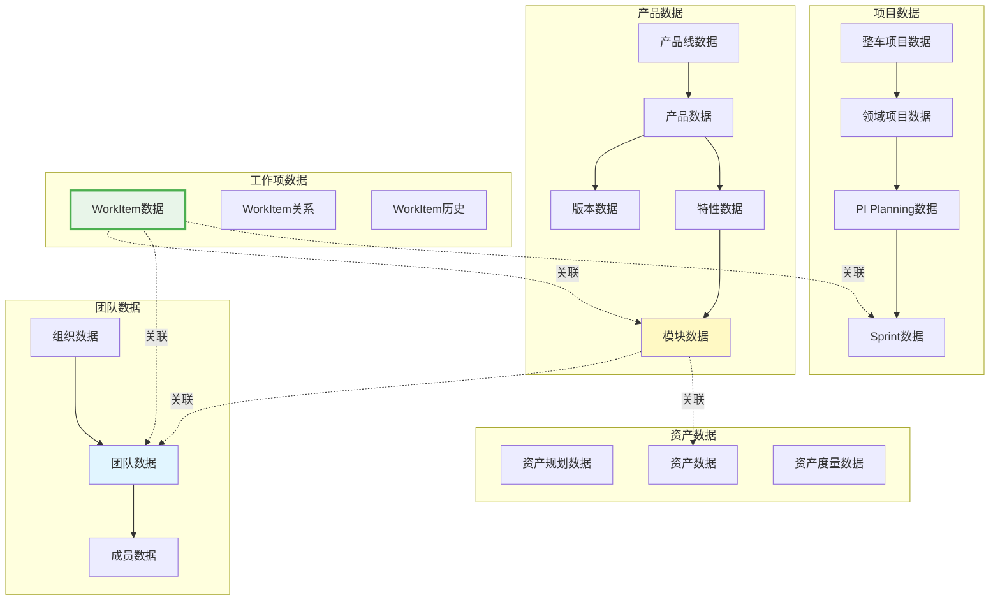
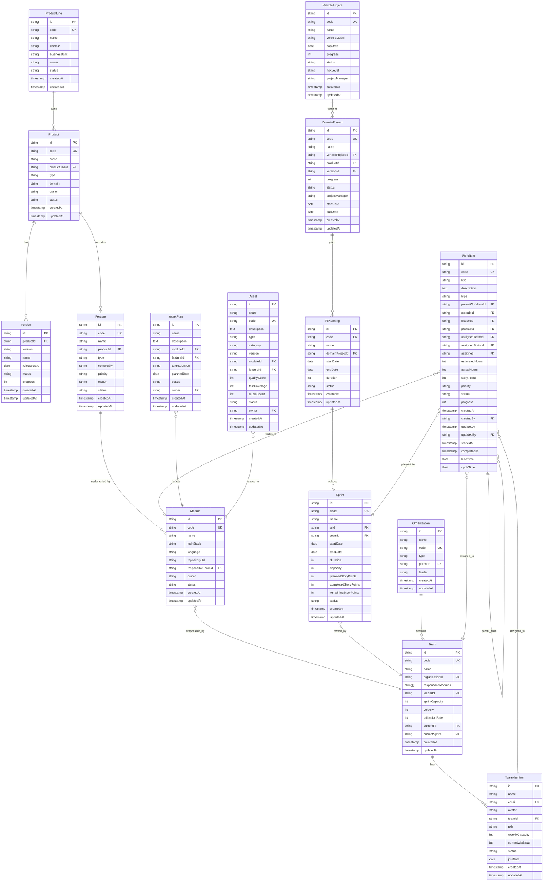
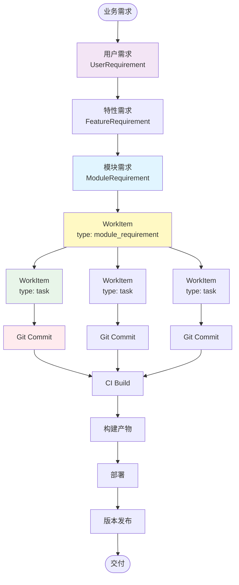

# 数据架构设计

> **关注点**: 数据模型与关系设计  
> **目标**: 完整的数据结构与追溯链路

---

## 📋 目录

1. [数据架构概述](#一数据架构概述)
2. [核心数据模型](#二核心数据模型)
3. [数据关系设计](#三数据关系设计)
4. [追溯链路设计](#四追溯链路设计)
5. [数据完整性约束](#五数据完整性约束)

---

## 一、数据架构概述

### 1.1 数据架构全景



### 1.2 数据分层模型

```
┌─────────────────────────────────────────────────────────┐
│                    应用数据层                            │
│  视图数据 | 聚合数据 | 统计数据 | 报表数据               │
├─────────────────────────────────────────────────────────┤
│                    业务数据层                            │
│  产品数据 | 项目数据 | 工作项数据 | 团队数据 | 资产数据  │
├─────────────────────────────────────────────────────────┤
│                    关系数据层                            │
│  实体关系 | 层级关系 | 依赖关系 | 追溯关系               │
├─────────────────────────────────────────────────────────┤
│                    基础数据层                            │
│  用户数据 | 权限数据 | 配置数据 | 元数据                 │
└─────────────────────────────────────────────────────────┘
```

---

## 二、核心数据模型

### 2.1 完整ERD图



### 2.2 核心表结构

#### 产品域表

```sql
-- 产品线表
CREATE TABLE product_lines (
  id VARCHAR(50) PRIMARY KEY,
  code VARCHAR(50) UNIQUE NOT NULL,
  name VARCHAR(200) NOT NULL,
  description TEXT,
  domain VARCHAR(50) NOT NULL,
  business_unit VARCHAR(100),
  owner VARCHAR(50) NOT NULL,
  status VARCHAR(20) NOT NULL DEFAULT 'active',
  created_at TIMESTAMP NOT NULL DEFAULT CURRENT_TIMESTAMP,
  updated_at TIMESTAMP NOT NULL DEFAULT CURRENT_TIMESTAMP ON UPDATE CURRENT_TIMESTAMP,
  INDEX idx_domain (domain),
  INDEX idx_status (status),
  INDEX idx_owner (owner)
);

-- 产品表
CREATE TABLE products (
  id VARCHAR(50) PRIMARY KEY,
  code VARCHAR(50) UNIQUE NOT NULL,
  name VARCHAR(200) NOT NULL,
  description TEXT,
  product_line_id VARCHAR(50) NOT NULL,
  type VARCHAR(50) NOT NULL,
  domain VARCHAR(50) NOT NULL,
  owner VARCHAR(50) NOT NULL,
  status VARCHAR(20) NOT NULL DEFAULT 'active',
  created_at TIMESTAMP NOT NULL DEFAULT CURRENT_TIMESTAMP,
  updated_at TIMESTAMP NOT NULL DEFAULT CURRENT_TIMESTAMP ON UPDATE CURRENT_TIMESTAMP,
  FOREIGN KEY (product_line_id) REFERENCES product_lines(id),
  INDEX idx_product_line (product_line_id),
  INDEX idx_type (type),
  INDEX idx_status (status)
);

-- 版本表
CREATE TABLE versions (
  id VARCHAR(50) PRIMARY KEY,
  product_id VARCHAR(50) NOT NULL,
  version VARCHAR(50) NOT NULL,
  name VARCHAR(200) NOT NULL,
  description TEXT,
  release_date DATE,
  milestone VARCHAR(100),
  status VARCHAR(20) NOT NULL DEFAULT 'planning',
  progress INT NOT NULL DEFAULT 0,
  quality_score INT,
  test_coverage INT,
  created_at TIMESTAMP NOT NULL DEFAULT CURRENT_TIMESTAMP,
  updated_at TIMESTAMP NOT NULL DEFAULT CURRENT_TIMESTAMP ON UPDATE CURRENT_TIMESTAMP,
  FOREIGN KEY (product_id) REFERENCES products(id),
  UNIQUE KEY uk_product_version (product_id, version),
  INDEX idx_status (status),
  INDEX idx_release_date (release_date)
);

-- 特性表
CREATE TABLE features (
  id VARCHAR(50) PRIMARY KEY,
  code VARCHAR(50) UNIQUE NOT NULL,
  name VARCHAR(200) NOT NULL,
  description TEXT,
  product_id VARCHAR(50) NOT NULL,
  type VARCHAR(50) NOT NULL,
  category VARCHAR(100),
  complexity VARCHAR(20) NOT NULL,
  priority VARCHAR(20) NOT NULL,
  owner VARCHAR(50) NOT NULL,
  status VARCHAR(20) NOT NULL DEFAULT 'active',
  created_at TIMESTAMP NOT NULL DEFAULT CURRENT_TIMESTAMP,
  updated_at TIMESTAMP NOT NULL DEFAULT CURRENT_TIMESTAMP ON UPDATE CURRENT_TIMESTAMP,
  FOREIGN KEY (product_id) REFERENCES products(id),
  INDEX idx_product (product_id),
  INDEX idx_type (type),
  INDEX idx_priority (priority),
  INDEX idx_status (status)
);

-- 模块表 ⭐⭐⭐ 核心表
CREATE TABLE modules (
  id VARCHAR(50) PRIMARY KEY,
  code VARCHAR(50) UNIQUE NOT NULL,
  name VARCHAR(200) NOT NULL,
  description TEXT,
  tech_stack VARCHAR(50) NOT NULL,
  language VARCHAR(50) NOT NULL,
  framework VARCHAR(100),
  repository_url VARCHAR(500) NOT NULL,
  repository_branch VARCHAR(100) NOT NULL DEFAULT 'main',
  responsible_team_id VARCHAR(50) NOT NULL,  -- ⭐ 核心字段：负责团队
  owner VARCHAR(50) NOT NULL,
  status VARCHAR(20) NOT NULL DEFAULT 'active',
  health_score INT,
  created_at TIMESTAMP NOT NULL DEFAULT CURRENT_TIMESTAMP,
  updated_at TIMESTAMP NOT NULL DEFAULT CURRENT_TIMESTAMP ON UPDATE CURRENT_TIMESTAMP,
  FOREIGN KEY (responsible_team_id) REFERENCES teams(id),
  INDEX idx_responsible_team (responsible_team_id),  -- ⭐ 核心索引
  INDEX idx_tech_stack (tech_stack),
  INDEX idx_status (status)
);
```

#### 工作项域表 ⭐⭐⭐

```sql
-- WorkItem表 - 核心表
CREATE TABLE work_items (
  id VARCHAR(50) PRIMARY KEY,
  code VARCHAR(50) UNIQUE NOT NULL,
  title VARCHAR(500) NOT NULL,
  description TEXT,
  
  -- 类型 ⭐
  type VARCHAR(50) NOT NULL,  -- task, technical_task, module_requirement, etc.
  
  -- 层级关系 ⭐
  parent_work_item_id VARCHAR(50),
  
  -- 关联关系
  module_id VARCHAR(50),
  feature_id VARCHAR(50),
  product_id VARCHAR(50),
  
  -- 分配信息 ⭐
  assigned_team_id VARCHAR(50),
  assigned_sprint_id VARCHAR(50),
  assignee VARCHAR(50),
  
  -- 工作量
  estimated_hours INT NOT NULL DEFAULT 0,
  actual_hours INT,
  story_points INT,
  
  -- 优先级与状态
  priority VARCHAR(20) NOT NULL,
  status VARCHAR(20) NOT NULL DEFAULT 'pending',
  progress INT NOT NULL DEFAULT 0,
  
  -- 时间追踪
  created_at TIMESTAMP NOT NULL DEFAULT CURRENT_TIMESTAMP,
  created_by VARCHAR(50) NOT NULL,
  updated_at TIMESTAMP NOT NULL DEFAULT CURRENT_TIMESTAMP ON UPDATE CURRENT_TIMESTAMP,
  updated_by VARCHAR(50) NOT NULL,
  started_at TIMESTAMP,
  completed_at TIMESTAMP,
  
  -- 度量
  lead_time FLOAT,
  cycle_time FLOAT,
  
  -- 外键约束
  FOREIGN KEY (parent_work_item_id) REFERENCES work_items(id),
  FOREIGN KEY (module_id) REFERENCES modules(id),
  FOREIGN KEY (feature_id) REFERENCES features(id),
  FOREIGN KEY (product_id) REFERENCES products(id),
  FOREIGN KEY (assigned_team_id) REFERENCES teams(id),
  FOREIGN KEY (assigned_sprint_id) REFERENCES sprints(id),
  FOREIGN KEY (assignee) REFERENCES team_members(id),
  
  -- 索引 ⭐ 核心查询优化
  INDEX idx_type (type),
  INDEX idx_parent (parent_work_item_id),
  INDEX idx_module (module_id),
  INDEX idx_assigned_team (assigned_team_id),
  INDEX idx_assigned_sprint (assigned_sprint_id),
  INDEX idx_assignee (assignee),
  INDEX idx_status (status),
  INDEX idx_priority (priority),
  INDEX idx_created_at (created_at),
  INDEX idx_completed_at (completed_at),
  
  -- 复合索引
  INDEX idx_team_sprint (assigned_team_id, assigned_sprint_id),
  INDEX idx_team_status (assigned_team_id, status),
  INDEX idx_sprint_status (assigned_sprint_id, status)
);

-- WorkItem子表：用于存储子WorkItem ID列表（JSON）
CREATE TABLE work_item_children (
  work_item_id VARCHAR(50) NOT NULL,
  child_work_item_id VARCHAR(50) NOT NULL,
  sort_order INT NOT NULL DEFAULT 0,
  PRIMARY KEY (work_item_id, child_work_item_id),
  FOREIGN KEY (work_item_id) REFERENCES work_items(id) ON DELETE CASCADE,
  FOREIGN KEY (child_work_item_id) REFERENCES work_items(id) ON DELETE CASCADE,
  INDEX idx_child (child_work_item_id)
);

-- WorkItem标签表
CREATE TABLE work_item_tags (
  work_item_id VARCHAR(50) NOT NULL,
  tag VARCHAR(100) NOT NULL,
  PRIMARY KEY (work_item_id, tag),
  FOREIGN KEY (work_item_id) REFERENCES work_items(id) ON DELETE CASCADE,
  INDEX idx_tag (tag)
);

-- WorkItem附件表
CREATE TABLE work_item_attachments (
  id VARCHAR(50) PRIMARY KEY,
  work_item_id VARCHAR(50) NOT NULL,
  file_name VARCHAR(500) NOT NULL,
  file_url VARCHAR(1000) NOT NULL,
  file_size BIGINT NOT NULL,
  file_type VARCHAR(100),
  uploaded_by VARCHAR(50) NOT NULL,
  uploaded_at TIMESTAMP NOT NULL DEFAULT CURRENT_TIMESTAMP,
  FOREIGN KEY (work_item_id) REFERENCES work_items(id) ON DELETE CASCADE,
  INDEX idx_work_item (work_item_id)
);

-- WorkItem历史表
CREATE TABLE work_item_history (
  id VARCHAR(50) PRIMARY KEY,
  work_item_id VARCHAR(50) NOT NULL,
  field_name VARCHAR(100) NOT NULL,
  old_value TEXT,
  new_value TEXT,
  changed_by VARCHAR(50) NOT NULL,
  changed_at TIMESTAMP NOT NULL DEFAULT CURRENT_TIMESTAMP,
  FOREIGN KEY (work_item_id) REFERENCES work_items(id) ON DELETE CASCADE,
  INDEX idx_work_item (work_item_id),
  INDEX idx_changed_at (changed_at)
);
```

---

## 三、数据关系设计

### 3.1 核心关系图

```mermaid
graph TB
    subgraph 产品关系
        PL[ProductLine] -->|1:N| P[Product]
        P -->|1:N| V[Version]
        P -->|1:N| F[Feature]
        F -->|M:N| M[Module]
    end
    
    subgraph 项目关系
        VP[VehicleProject] -->|1:N| DP[DomainProject]
        DP -->|1:N| PI[PIPlanning]
        PI -->|1:N| S[Sprint]
    end
    
    subgraph 团队关系
        O[Organization] -->|1:N| T[Team]
        T -->|1:N| TM[TeamMember]
    end
    
    subgraph 核心关系 ⭐⭐⭐
        M -.responsibleTeamId.-> T
        T -.responsibleModules[].-> M
        
        WI[WorkItem] -.moduleId.-> M
        WI -.assignedTeamId.-> T
        WI -.assignedSprintId.-> S
        WI -.assignee.-> TM
        WI -.parentWorkItemId.-> WI
    end
    
    style M fill:#fff9c4
    style T fill:#e1f5ff
    style WI fill:#e8f5e9,stroke:#4caf50,stroke-width:3px
```

### 3.2 关系类型说明

| 关系类型 | 说明 | 示例 | 实现方式 |
|---------|------|------|---------|
| **1:1** | 一对一关系 | User ← → UserProfile | 外键 + UNIQUE约束 |
| **1:N** | 一对多关系 | Product → Version | 外键 |
| **M:N** | 多对多关系 | Feature ← → Module | 中间表 |
| **Self-Reference** | 自引用关系 | WorkItem → WorkItem | 外键指向自身 |
| **Composition** | 组合关系 | Product → Feature | 外键 + CASCADE删除 |
| **Aggregation** | 聚合关系 | Team → Module | 外键，独立生命周期 |

### 3.3 关系完整性约束

```sql
-- 1. 模块-团队责任绑定约束 ⭐⭐⭐
-- 确保模块必须有负责团队
ALTER TABLE modules
  ADD CONSTRAINT fk_module_team
  FOREIGN KEY (responsible_team_id)
  REFERENCES teams(id)
  ON DELETE RESTRICT;  -- 不允许删除有模块的团队

-- 2. WorkItem层级约束
-- 确保WorkItem不能引用自己作为父
CREATE TRIGGER trg_workitem_no_self_parent
BEFORE INSERT ON work_items
FOR EACH ROW
BEGIN
  IF NEW.parent_work_item_id = NEW.id THEN
    SIGNAL SQLSTATE '45000'
    SET MESSAGE_TEXT = 'WorkItem cannot be its own parent';
  END IF;
END;

-- 3. WorkItem分配约束
-- task类型必须有assignee
CREATE TRIGGER trg_workitem_task_assignee
BEFORE INSERT ON work_items
FOR EACH ROW
BEGIN
  IF NEW.type = 'task' AND NEW.assignee IS NULL THEN
    SIGNAL SQLSTATE '45000'
    SET MESSAGE_TEXT = 'Task type WorkItem must have assignee';
  END IF;
END;

-- 4. Sprint容量约束
-- Sprint的plannedStoryPoints不能超过capacity
CREATE TRIGGER trg_sprint_capacity
BEFORE UPDATE ON sprints
FOR EACH ROW
BEGIN
  IF NEW.planned_story_points > NEW.capacity THEN
    SIGNAL SQLSTATE '45000'
    SET MESSAGE_TEXT = 'Planned story points exceed sprint capacity';
  END IF;
END;
```

---

## 四、追溯链路设计

### 4.1 完整追溯链路



### 4.2 追溯链路实现

```typescript
/**
 * 追溯链路查询
 * 
 * 从WorkItem向上追溯到用户需求
 */
interface TraceabilityChain {
  workItem: WorkItem
  moduleRequirement?: ModuleRequirement
  featureRequirement?: FeatureRequirement
  userRequirement?: UserRequirement
  feature?: Feature
  product?: Product
  productLine?: ProductLine
}

async function getTraceabilityChain(workItemId: string): Promise<TraceabilityChain> {
  // 1. 查询WorkItem
  const workItem = await findWorkItemById(workItemId)
  
  // 2. 向上追溯到根WorkItem（module_requirement）
  let rootWorkItem = workItem
  while (rootWorkItem.parentWorkItemId) {
    rootWorkItem = await findWorkItemById(rootWorkItem.parentWorkItemId)
  }
  
  // 3. 查询模块需求
  const moduleRequirement = rootWorkItem.type === 'module_requirement'
    ? await findModuleRequirementByWorkItemId(rootWorkItem.id)
    : undefined
  
  // 4. 查询特性需求
  const featureRequirement = moduleRequirement
    ? await findFeatureRequirementById(moduleRequirement.parentFRId)
    : undefined
  
  // 5. 查询用户需求
  const userRequirement = featureRequirement
    ? await findUserRequirementById(featureRequirement.parentURId)
    : undefined
  
  // 6. 查询特性
  const feature = workItem.featureId
    ? await findFeatureById(workItem.featureId)
    : undefined
  
  // 7. 查询产品
  const product = workItem.productId
    ? await findProductById(workItem.productId)
    : undefined
  
  // 8. 查询产品线
  const productLine = product
    ? await findProductLineById(product.productLineId)
    : undefined
  
  return {
    workItem,
    moduleRequirement,
    featureRequirement,
    userRequirement,
    feature,
    product,
    productLine
  }
}

/**
 * 影响分析
 * 
 * 从需求向下分析影响范围
 */
interface ImpactAnalysis {
  requirement: ModuleRequirement
  workItems: WorkItem[]
  teams: Team[]
  sprints: Sprint[]
  commits: Commit[]
  affectedModules: Module[]
}

async function analyzeImpact(requirementId: string): Promise<ImpactAnalysis> {
  // 1. 查询需求
  const requirement = await findModuleRequirementById(requirementId)
  
  // 2. 查询关联的WorkItem
  const workItems = await findWorkItemsByRequirementId(requirementId)
  
  // 3. 查询涉及的团队
  const teamIds = [...new Set(workItems.map(wi => wi.assignedTeamId).filter(Boolean))]
  const teams = await findTeamsByIds(teamIds as string[])
  
  // 4. 查询涉及的Sprint
  const sprintIds = [...new Set(workItems.map(wi => wi.assignedSprintId).filter(Boolean))]
  const sprints = await findSprintsByIds(sprintIds as string[])
  
  // 5. 查询关联的代码提交
  const commits = await findCommitsByWorkItemIds(workItems.map(wi => wi.id))
  
  // 6. 查询影响的模块
  const moduleIds = [...new Set(workItems.map(wi => wi.moduleId).filter(Boolean))]
  const affectedModules = await findModulesByIds(moduleIds as string[])
  
  return {
    requirement,
    workItems,
    teams,
    sprints,
    commits,
    affectedModules
  }
}
```

### 4.3 追溯链路表设计

```sql
-- 追溯关系表
CREATE TABLE traceability_links (
  id VARCHAR(50) PRIMARY KEY,
  source_type VARCHAR(50) NOT NULL,  -- WorkItem, Commit, Build, etc.
  source_id VARCHAR(50) NOT NULL,
  target_type VARCHAR(50) NOT NULL,  -- ModuleRequirement, Feature, etc.
  target_id VARCHAR(50) NOT NULL,
  link_type VARCHAR(50) NOT NULL,    -- implements, tests, depends_on, etc.
  created_at TIMESTAMP NOT NULL DEFAULT CURRENT_TIMESTAMP,
  created_by VARCHAR(50) NOT NULL,
  INDEX idx_source (source_type, source_id),
  INDEX idx_target (target_type, target_id),
  INDEX idx_link_type (link_type)
);

-- 示例：WorkItem实现ModuleRequirement
INSERT INTO traceability_links (
  id, source_type, source_id, target_type, target_id, link_type, created_by
) VALUES (
  'TL-001', 'WorkItem', 'WI-001', 'ModuleRequirement', 'MR-001', 'implements', 'SYSTEM'
);

-- 示例：Commit关联WorkItem
INSERT INTO traceability_links (
  id, source_type, source_id, target_type, target_id, link_type, created_by
) VALUES (
  'TL-002', 'Commit', 'abc123', 'WorkItem', 'WI-001', 'implements', 'USER-001'
);
```

---

## 五、数据完整性约束

### 5.1 实体完整性

```sql
-- 主键约束（所有表）
ALTER TABLE work_items ADD PRIMARY KEY (id);

-- 唯一约束
ALTER TABLE work_items ADD UNIQUE KEY uk_code (code);
ALTER TABLE modules ADD UNIQUE KEY uk_code (code);
ALTER TABLE teams ADD UNIQUE KEY uk_code (code);

-- 非空约束
ALTER TABLE work_items MODIFY COLUMN title VARCHAR(500) NOT NULL;
ALTER TABLE work_items MODIFY COLUMN type VARCHAR(50) NOT NULL;
ALTER TABLE work_items MODIFY COLUMN priority VARCHAR(20) NOT NULL;
ALTER TABLE work_items MODIFY COLUMN status VARCHAR(20) NOT NULL;
```

### 5.2 参照完整性

```sql
-- 外键约束
ALTER TABLE work_items
  ADD CONSTRAINT fk_workitem_parent
  FOREIGN KEY (parent_work_item_id)
  REFERENCES work_items(id)
  ON DELETE CASCADE;  -- 删除父WorkItem时级联删除子WorkItem

ALTER TABLE work_items
  ADD CONSTRAINT fk_workitem_module
  FOREIGN KEY (module_id)
  REFERENCES modules(id)
  ON DELETE SET NULL;  -- 删除模块时设置为NULL

ALTER TABLE work_items
  ADD CONSTRAINT fk_workitem_team
  FOREIGN KEY (assigned_team_id)
  REFERENCES teams(id)
  ON DELETE SET NULL;

ALTER TABLE work_items
  ADD CONSTRAINT fk_workitem_sprint
  FOREIGN KEY (assigned_sprint_id)
  REFERENCES sprints(id)
  ON DELETE SET NULL;

ALTER TABLE work_items
  ADD CONSTRAINT fk_workitem_assignee
  FOREIGN KEY (assignee)
  REFERENCES team_members(id)
  ON DELETE SET NULL;
```

### 5.3 域完整性

```sql
-- CHECK约束
ALTER TABLE work_items
  ADD CONSTRAINT chk_type
  CHECK (type IN ('task', 'technical_task', 'module_requirement', 'test_task', 
                  'bug', 'tech_debt', 'research', 'subtask'));

ALTER TABLE work_items
  ADD CONSTRAINT chk_priority
  CHECK (priority IN ('critical', 'high', 'medium', 'low'));

ALTER TABLE work_items
  ADD CONSTRAINT chk_status
  CHECK (status IN ('pending', 'in_progress', 'completed', 'cancelled', 'blocked'));

ALTER TABLE work_items
  ADD CONSTRAINT chk_progress
  CHECK (progress >= 0 AND progress <= 100);

ALTER TABLE work_items
  ADD CONSTRAINT chk_estimated_hours
  CHECK (estimated_hours >= 0);

ALTER TABLE work_items
  ADD CONSTRAINT chk_story_points
  CHECK (story_points IS NULL OR (story_points >= 0 AND story_points <= 100));
```

### 5.4 业务规则约束

```sql
-- 业务规则1：task类型必须有assignee
CREATE TRIGGER trg_task_must_have_assignee
BEFORE INSERT ON work_items
FOR EACH ROW
BEGIN
  IF NEW.type = 'task' AND NEW.assignee IS NULL THEN
    SIGNAL SQLSTATE '45000'
    SET MESSAGE_TEXT = 'Task type WorkItem must have assignee';
  END IF;
END;

-- 业务规则2：completed状态的WorkItem进度必须是100
CREATE TRIGGER trg_completed_progress_100
BEFORE UPDATE ON work_items
FOR EACH ROW
BEGIN
  IF NEW.status = 'completed' AND NEW.progress != 100 THEN
    SET NEW.progress = 100;
  END IF;
END;

-- 业务规则3：WorkItem不能循环引用
CREATE TRIGGER trg_no_circular_reference
BEFORE INSERT ON work_items
FOR EACH ROW
BEGIN
  DECLARE parent_id VARCHAR(50);
  DECLARE depth INT DEFAULT 0;
  
  SET parent_id = NEW.parent_work_item_id;
  
  WHILE parent_id IS NOT NULL AND depth < 100 DO
    IF parent_id = NEW.id THEN
      SIGNAL SQLSTATE '45000'
      SET MESSAGE_TEXT = 'Circular reference detected in WorkItem hierarchy';
    END IF;
    
    SELECT parent_work_item_id INTO parent_id
    FROM work_items
    WHERE id = parent_id;
    
    SET depth = depth + 1;
  END WHILE;
END;
```

---

## 六、总结

### 数据架构核心价值

```
✓ 完整的数据模型 ⭐⭐⭐
  • 6大领域数据
  • 30+核心表
  • 清晰的ERD图

✓ 核心关系清晰 ⭐⭐⭐
  • 模块-团队责任绑定
  • WorkItem层级关系
  • 完整的外键约束

✓ 追溯链路完整 ⭐⭐⭐
  • 需求→WorkItem→代码
  • 双向追溯
  • 影响分析

✓ 数据完整性保障 ⭐⭐⭐
  • 实体完整性
  • 参照完整性
  • 域完整性
  • 业务规则约束
```

---

**文档维护**:
- 创建: 2026-01-10
- 版本: 最新
- 负责人: 数据架构团队

