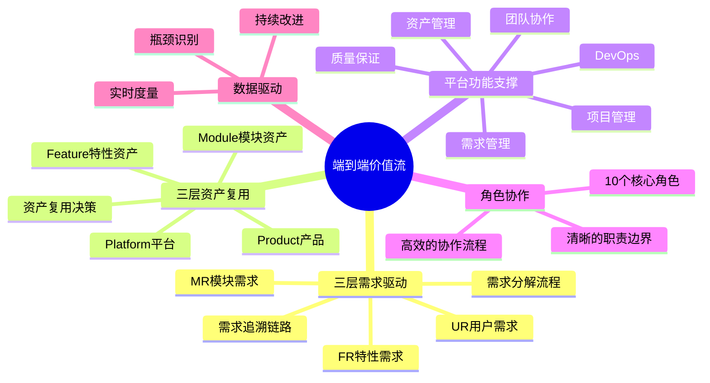
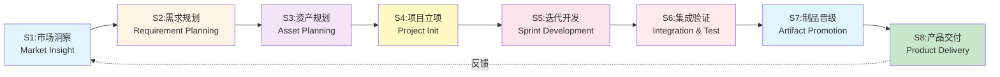
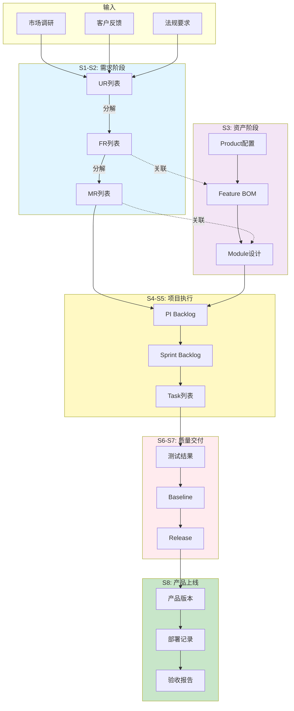
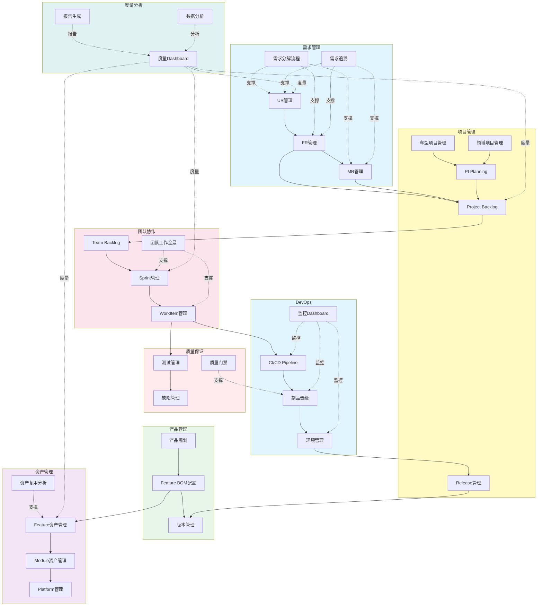
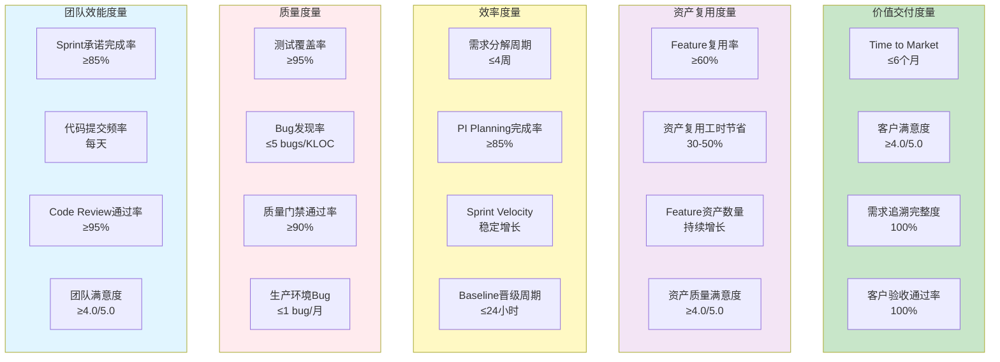

# 端到端研发价值流设计

> **文档版本**: v3.1  
> **创建日期**: 2026-01-11  
> **设计理念**: 基于三层需求、三层资产、平台功能支撑的端到端价值流

---

## 📋 目录

1. [价值流概述](#一价值流概述)
2. [价值流全景](#二价值流全景)
3. [八大核心阶段](#三八大核心阶段)
4. [平台功能支撑](#四平台功能支撑)
5. [度量体系](#五度量体系)

---

## 一、价值流概述

### 1.1 端到端价值流定义

**从市场需求到产品交付的完整价值创造过程**

```yaml
起点: 市场需求、客户反馈、法规要求
终点: 产品上线、客户验收、价值实现

核心目标:
  - 缩短Time to Market
  - 提升Feature资产复用率≥60%
  - 确保端到端追溯完整度100%
  - 实现制品自动化晋级
```

### 1.2 核心设计原则



---

## 二、价值流全景

### 2.1 八大核心阶段



### 2.2 端到端数据流



---

## 三、八大核心阶段

### S1: 市场洞察 (Market Insight)

**目标**: 识别市场机会，定义产品方向

```yaml
阶段概述:
  周期: 持续进行
  负责角色: 产品线经理、产品经理
  核心活动: 市场调研、竞品分析、客户访谈、趋势分析

输入数据:
  - 市场调研报告
  - 客户反馈数据
  - 竞品分析报告
  - 行业法规文件
  - 技术趋势报告

核心活动:
  1. 市场机会识别
     - 分析市场趋势
     - 识别目标客户痛点
     - 评估商业价值
  
  2. 竞品分析
     - 竞品功能对比
     - 技术路线分析
     - 定价策略研究
  
  3. 客户需求收集
     - 客户访谈
     - 问卷调查
     - 使用数据分析

输出数据:
  - 市场机会清单
  - 产品规划草案
  - 初步UR列表

平台功能:
  - 市场分析工具
  - 客户反馈管理
  - 竞品跟踪系统

度量指标:
  - 市场机会识别数量
  - 客户访谈覆盖率
  - 需求响应速度
```

### S2: 需求规划 (Requirement Planning)

**目标**: 三层需求分解，建立需求-资产关联

```yaml
阶段概述:
  周期: 2-4周/次
  负责角色: 产品经理、系统工程师、功能负责人
  核心活动: UR→FR→MR分解、需求优先级排序、需求-资产关联

┌─────────────────────────────────────────────────────────┐
│              S2.1: L1 用户需求管理 (UR)                  │
│                                                          │
│  负责人: 产品经理                                         │
│  输入: 市场机会清单                                       │
│  输出: UR列表                                            │
│  平台: UR管理功能                                         │
│                                                          │
│  活动:                                                   │
│  1. 创建UR                                               │
│     - 填写UR标题、描述、验收标准                          │
│     - 关联Product: UR.productId → Product               │
│     - 设置优先级、业务价值                                │
│                                                          │
│  2. UR优先级排序                                         │
│     - WSJF评分 (加权最短作业优先)                        │
│     - 业务价值、时间敏感性、风险降低                      │
│                                                          │
│  3. UR评审与批准                                         │
│     - 产品经理组织评审会议                                │
│     - 技术VP、架构师参与评审                              │
│     - 批准后进入FR分解                                    │
└─────────────────────────────────────────────────────────┘

┌─────────────────────────────────────────────────────────┐
│             S2.2: L2 特性需求分解 (FR)                   │
│                                                          │
│  负责人: 系统工程师 (SE)                                  │
│  输入: UR列表、Feature资产库                              │
│  输出: FR列表、Feature复用决策                            │
│  平台: FR管理、Feature资产搜索                            │
│                                                          │
│  活动:                                                   │
│  1. UR分解为FR                                           │
│     - 分析UR,识别功能特性                                │
│     - 创建FR,填写详细描述                                 │
│     - FR.parentURId → UR                                │
│                                                          │
│  2. Feature资产搜索与评估                                │
│     - 搜索Feature资产库                                   │
│     - 评估Feature匹配度                                   │
│     - Make or Reuse决策                                 │
│                                                          │
│  3. FR-Feature关联                                       │
│     - 可复用: FR.relatedFeatureAssetId → Feature         │
│     - 新建Feature: 提交Feature规划请求给架构师            │
│                                                          │
│  4. FR评审与批准                                         │
│     - SE组织FR评审                                       │
│     - 产品经理、架构师参与评审                            │
│     - 批准后进入MR分解                                    │
└─────────────────────────────────────────────────────────┘

┌─────────────────────────────────────────────────────────┐
│             S2.3: L3 模块需求分解 (MR)                   │
│                                                          │
│  负责人: 功能负责人 (FO)                                  │
│  输入: FR列表、Module资产库                               │
│  输出: MR列表、Team自动分配                               │
│  平台: MR管理、Module资产管理                             │
│                                                          │
│  活动:                                                   │
│  1. FR分解为MR                                           │
│     - 分析FR,识别模块需求                                │
│     - 创建MR,填写技术规格                                 │
│     - MR.parentFRId → FR                                │
│                                                          │
│  2. MR-Module关联                                        │
│     - MR.moduleId → Module                              │
│     - MR.assignedTeamId ← Module.responsibleTeamId      │
│     - 自动分配到Team Backlog                             │
│                                                          │
│  3. MR工作量估算                                         │
│     - 估算Story Points                                   │
│     - 估算开发工时                                        │
│     - 识别技术风险                                        │
│                                                          │
│  4. MR评审与批准                                         │
│     - FO组织MR评审                                       │
│     - SE、架构师、团队Lead参与                            │
│     - 批准后加入Project Backlog                          │
└─────────────────────────────────────────────────────────┘

输入数据:
  - 市场机会清单
  - 客户需求原始数据
  - Feature资产库
  - Module资产库

输出数据:
  - UR列表 (10+ items)
  - FR列表 (30+ items)
  - MR列表 (50+ items)
  - 需求追溯矩阵 (UR↔FR↔MR)
  - Feature复用决策报告

平台功能:
  ✅ UR管理 (创建/编辑/审批/优先级排序)
  ✅ FR管理 (创建/编辑/审批/Feature关联)
  ✅ MR管理 (创建/编辑/审批/Module关联)
  ✅ 需求分解流程可视化
  ✅ Feature资产搜索与推荐
  ✅ 需求追溯图

度量指标:
  - 需求分解完整度: UR→FR→MR 100%
  - Feature复用率: ≥60%
  - 需求分解周期: ≤4周
  - 需求变更率: ≤15%
```

### S3: 资产规划 (Asset Planning)

**目标**: Feature资产规划、Feature BOM配置、Platform选型

```yaml
阶段概述:
  周期: 与需求规划并行
  负责角色: 架构师、产品经理、资产管理员
  核心活动: Feature设计、Module规划、Platform选型、Feature BOM配置

┌─────────────────────────────────────────────────────────┐
│            S3.1: Feature资产规划                         │
│                                                          │
│  负责人: 架构师                                          │
│  输入: FR列表、Feature复用决策                            │
│  输出: Feature资产、Feature设计文档                       │
│  平台: Feature资产管理                                    │
│                                                          │
│  活动:                                                   │
│  1. Feature设计                                          │
│     - 分析FR,设计Feature架构                             │
│     - 定义Feature边界、接口                              │
│     - 识别Feature依赖关系                                │
│                                                          │
│  2. Feature-Module映射                                   │
│     - Feature.moduleIds → [Module1, Module2, ...]       │
│     - 定义Module职责                                     │
│                                                          │
│  3. Feature版本管理                                      │
│     - Feature.version (语义化版本)                       │
│     - 向后兼容性评估                                      │
│                                                          │
│  4. Feature入库                                          │
│     - 提交资产管理员审核                                  │
│     - 更新Feature资产库                                   │
│     - Feature.reuseCount = 1                            │
└─────────────────────────────────────────────────────────┘

┌─────────────────────────────────────────────────────────┐
│            S3.2: Feature BOM配置                         │
│                                                          │
│  负责人: 产品经理 + 架构师                                │
│  输入: Product定义、Feature资产库                         │
│  输出: Feature BOM配置                                    │
│  平台: Feature BOM配置界面                                │
│                                                          │
│  活动:                                                   │
│  1. 产品配置策略                                         │
│     - 旗舰版 (Full Features)                            │
│     - 高配版 (Selected Features)                        │
│     - 标准版 (Basic Features)                           │
│                                                          │
│  2. Feature选择与配置                                    │
│     - Product → FeatureBOM → [Feature1, Feature2, ...]  │
│     - 配置Feature参数                                     │
│     - 定义Variant规则                                    │
│                                                          │
│  3. Feature依赖检查                                      │
│     - 检查Feature.dependencies是否满足                   │
│     - 检查Feature.conflicts是否冲突                      │
│     - 自动补齐依赖Feature                                │
│                                                          │
│  4. BOM评审与批准                                        │
│     - 产品经理组织BOM评审                                │
│     - 架构师验证技术可行性                                │
│     - 批准后锁定BOM配置                                   │
└─────────────────────────────────────────────────────────┘

┌─────────────────────────────────────────────────────────┐
│            S3.3: Module资产规划                          │
│                                                          │
│  负责人: 架构师                                          │
│  输入: Feature设计、MR列表                                │
│  输出: Module资产、Module设计文档                         │
│  平台: Module资产管理                                     │
│                                                          │
│  活动:                                                   │
│  1. Module设计                                           │
│     - Module功能设计                                     │
│     - Module接口定义                                     │
│     - Module技术选型                                     │
│                                                          │
│  2. Module-Team绑定                                      │
│     - Module.responsibleTeamId → Team                   │
│     - MR自动分配到Team                                   │
│                                                          │
│  3. Module-Platform关联                                  │
│     - Module.deployment.platformId → Platform           │
│     - 定义部署要求                                        │
└─────────────────────────────────────────────────────────┘

┌─────────────────────────────────────────────────────────┐
│            S3.4: Platform选型与管理                      │
│                                                          │
│  负责人: 架构师                                          │
│  输入: Module设计、技术约束                               │
│  输出: Platform选型方案                                   │
│  平台: Platform管理                                       │
│                                                          │
│  活动:                                                   │
│  1. Platform需求分析                                     │
│     - 硬件Platform (芯片、传感器)                        │
│     - 软件Platform (OS、中间件)                          │
│     - 开发Platform (IDE、工具链)                         │
│                                                          │
│  2. Platform兼容性评估                                   │
│     - Platform.compatibility评分                        │
│     - 成本分析                                           │
│     - 风险评估                                           │
│                                                          │
│  3. Platform迁移规划                                     │
│     - 跨Platform迁移成本                                 │
│     - 迁移路径设计                                        │
└─────────────────────────────────────────────────────────┘

输入数据:
  - FR列表
  - MR列表
  - Feature复用决策
  - 现有资产库

输出数据:
  - Feature资产 (20+ features)
  - Feature BOM配置 (3个产品版本)
  - Module资产 (50+ modules)
  - Platform选型方案 (5+ platforms)
  - 资产依赖关系图

平台功能:
  ✅ Feature资产管理 (创建/编辑/版本管理)
  ✅ Feature BOM配置界面
  ✅ Module资产管理
  ✅ Platform管理
  ✅ 资产依赖关系图
  ✅ 资产复用分析

度量指标:
  - Feature资产数量
  - Feature复用率 ≥60%
  - Feature BOM配置完整度 100%
  - Platform兼容性评分 ≥85分
```

### S4: 项目立项与PI Planning (Project Init & PI Planning)

**目标**: 项目启动、PI规划、MR分配到Sprint

```yaml
阶段概述:
  周期: 每个PI开始前 (8-12周)
  负责角色: 项目经理、产品经理、团队Lead
  核心活动: 项目立项、PI Planning、MR分配、团队容量规划

┌─────────────────────────────────────────────────────────┐
│            S4.1: 项目立项                                │
│                                                          │
│  负责人: 项目经理                                        │
│  输入: 产品规划、需求Backlog、资产规划                   │
│  输出: 项目计划、项目团队                                │
│  平台: 项目管理 (车型项目/领域项目)                      │
│                                                          │
│  活动:                                                   │
│  1. 项目立项申请                                         │
│     - 创建车型项目 (VehicleProject)                      │
│     - 或创建领域项目 (DomainProject)                     │
│     - 填写项目目标、范围、资源需求                        │
│                                                          │
│  2. 项目团队组建                                         │
│     - 识别所需Team (基于Module-Team绑定)                 │
│     - 评估Team容量                                       │
│     - 协调资源分配                                        │
│                                                          │
│  3. Project Backlog初始化                               │
│     - 添加FR到Project Backlog                           │
│     - 添加MR到Project Backlog                           │
│     - 优先级排序                                         │
│                                                          │
│  4. 项目批准                                             │
│     - 项目评审会议                                        │
│     - 高层批准                                           │
│     - 启动项目                                           │
└─────────────────────────────────────────────────────────┘

┌─────────────────────────────────────────────────────────┐
│            S4.2: PI Planning                            │
│                                                          │
│  负责人: 项目经理 (主持)                                 │
│  参与者: 产品经理、SE、FO、团队Lead、架构师              │
│  输入: Project Backlog (FR/MR)、Team容量                 │
│  输出: PI Backlog、Sprint分配、依赖矩阵                  │
│  平台: PI Planning看板                                   │
│                                                          │
│  活动:                                                   │
│  1. PI目标设定                                           │
│     - 产品经理阐述PI目标                                 │
│     - 展示FR优先级                                       │
│     - 识别PI关键交付                                     │
│                                                          │
│  2. MR分解与估算                                         │
│     - FO讲解MR技术细节                                   │
│     - 团队Lead估算Story Points                           │
│     - 识别技术风险                                        │
│                                                          │
│  3. MR分配到Sprint                                       │
│     - 评估Team容量                                       │
│     - MR.assignedSprintId → Sprint                      │
│     - MR自动添加到Team Backlog                           │
│                                                          │
│  4. 依赖识别与管理                                       │
│     - 识别Team间依赖                                     │
│     - 创建依赖矩阵                                        │
│     - 制定协作计划                                        │
│                                                          │
│  5. PI承诺                                               │
│     - 各Team承诺PI目标                                   │
│     - 确认资源可用性                                      │
│     - 锁定PI计划                                         │
└─────────────────────────────────────────────────────────┘

┌─────────────────────────────────────────────────────────┐
│            S4.3: Team Backlog准备                        │
│                                                          │
│  负责人: 团队Lead                                        │
│  输入: 分配的MR列表                                       │
│  输出: Team Backlog (MR)                                │
│  平台: Team Backlog管理                                  │
│                                                          │
│  活动:                                                   │
│  1. 接收MR                                               │
│     - MR自动进入Team Backlog                            │
│     - 按Sprint分组                                       │
│                                                          │
│  2. MR优先级排序                                         │
│     - 基于Sprint目标                                     │
│     - 考虑依赖关系                                        │
│                                                          │
│  3. 准备Sprint Planning                                 │
│     - 确认Team成员可用性                                 │
│     - 准备技术资料                                        │
└─────────────────────────────────────────────────────────┘

输入数据:
  - 产品规划
  - FR列表 (Project Backlog)
  - MR列表 (Project Backlog)
  - Feature BOM配置
  - Module资产库
  - Team容量数据

输出数据:
  - 项目计划
  - PI Backlog (FR/MR)
  - Sprint分配
  - Team Backlog (MR)
  - 依赖矩阵
  - PI目标承诺

平台功能:
  ✅ 车型项目管理
  ✅ 领域项目管理
  ✅ PI Planning看板
  ✅ Project Backlog管理
  ✅ Team Backlog管理
  ✅ 依赖管理
  ✅ 容量规划

度量指标:
  - PI Planning参与度 100%
  - PI目标承诺完成率 ≥85%
  - 依赖识别完整度 100%
  - Team Backlog准备度 100%
```

### S5: 迭代开发 (Sprint Development)

**目标**: Sprint执行、MR→Task分解、编码开发

```yaml
阶段概述:
  周期: 2-4周/Sprint
  负责角色: 团队Lead、开发工程师、测试工程师
  核心活动: Sprint Planning、Task执行、日常站会、Code Review

┌─────────────────────────────────────────────────────────┐
│            S5.1: Sprint Planning                        │
│                                                          │
│  负责人: 团队Lead                                        │
│  参与者: 团队全体成员                                     │
│  输入: Team Backlog (MR)                                │
│  输出: Sprint Backlog (Task)                            │
│  平台: Sprint管理、WorkItem管理                          │
│                                                          │
│  活动:                                                   │
│  1. 选择MR进入Sprint                                     │
│     - 基于Sprint目标                                     │
│     - 考虑Team容量                                       │
│     - 确认MR就绪 (Ready for Dev)                         │
│                                                          │
│  2. MR分解为Task                                         │
│     - MR (type=module_requirement) → Task               │
│     - Task类型:                                          │
│       * task (编码任务)                                  │
│       * technical_task (技术任务)                        │
│       * test_task (测试任务)                             │
│       * subtask (子任务)                                 │
│     - Task.parentWorkItemId → MR                        │
│                                                          │
│  3. Task估算与分配                                       │
│     - 估算Task工时                                       │
│     - Task.assignee → TeamMember                        │
│     - 确认Task可完成性                                    │
│                                                          │
│  4. Sprint目标承诺                                       │
│     - Team承诺Sprint目标                                 │
│     - 确认Sprint Backlog                                │
│     - 开始Sprint                                         │
└─────────────────────────────────────────────────────────┘

┌─────────────────────────────────────────────────────────┐
│            S5.2: Task执行                               │
│                                                          │
│  负责人: 开发工程师                                      │
│  输入: 分配的Task                                        │
│  输出: 代码Commit、单元测试                              │
│  平台: WorkItem列表、代码仓库集成                        │
│                                                          │
│  活动:                                                   │
│  1. 接收Task                                             │
│     - 查看Task详情                                       │
│     - 理解需求和验收标准                                  │
│     - Task状态: Todo → InProgress                       │
│                                                          │
│  2. 编码开发                                             │
│     - 拉取代码分支                                        │
│     - 实现Task功能                                       │
│     - 编写单元测试                                        │
│                                                          │
│  3. 代码提交                                             │
│     - Commit代码                                         │
│     - Commit.taskId → Task                              │
│     - Commit.moduleId → Module                          │
│     - 推送到代码仓库                                      │
│                                                          │
│  4. 触发CI Pipeline                                      │
│     - 自动触发构建                                        │
│     - 自动运行单元测试                                    │
│     - 代码质量检查                                        │
└─────────────────────────────────────────────────────────┘

┌─────────────────────────────────────────────────────────┐
│            S5.3: 日常站会 (Daily Standup)                │
│                                                          │
│  负责人: 团队Lead                                        │
│  参与者: 团队全体成员                                     │
│  频率: 每日                                              │
│  平台: 团队工作全景                                       │
│                                                          │
│  活动:                                                   │
│  1. 每人回答3个问题                                      │
│     - 昨天完成了什么?                                    │
│     - 今天计划做什么?                                    │
│     - 有什么阻塞吗?                                      │
│                                                          │
│  2. 更新WorkItem状态                                     │
│     - 更新Task进度                                       │
│     - 识别风险和阻塞                                      │
│                                                          │
│  3. 协调与解决问题                                       │
│     - 团队Lead协调资源                                   │
│     - 升级阻塞问题                                        │
└─────────────────────────────────────────────────────────┘

┌─────────────────────────────────────────────────────────┐
│            S5.4: Code Review                            │
│                                                          │
│  负责人: 团队Lead + 开发工程师                           │
│  输入: 代码Commit                                        │
│  输出: Code Review意见、批准/拒绝                        │
│  平台: Code Review工具                                   │
│                                                          │
│  活动:                                                   │
│  1. 创建Merge Request                                    │
│     - 开发工程师创建MR                                   │
│     - 关联Task和Commit                                   │
│                                                          │
│  2. Code Review                                          │
│     - 审查代码质量                                        │
│     - 审查单元测试覆盖率                                  │
│     - 审查编码规范                                        │
│                                                          │
│  3. 修复Review意见                                       │
│     - 开发工程师修复问题                                 │
│     - 重新提交Code Review                                │
│                                                          │
│  4. 批准合并                                             │
│     - 团队Lead或高级工程师批准                           │
│     - 合并到主分支                                        │
│     - Task状态: InProgress → Done                       │
└─────────────────────────────────────────────────────────┘

输入数据:
  - Team Backlog (MR)
  - Module设计文档
  - 技术规范

输出数据:
  - Sprint Backlog (Task)
  - 代码Commit (关联Task和Module)
  - 单元测试用例
  - Code Review记录
  - Sprint报告

平台功能:
  ✅ Sprint管理 (Planning/Daily/Review/Retrospective)
  ✅ WorkItem管理 (Task列表/看板/甘特图)
  ✅ 团队工作全景 (当前Sprint/成员工作量/Burndown图)
  ✅ 代码仓库集成 (Git集成/Commit关联)
  ✅ Code Review工具
  ✅ CI Pipeline可视化

度量指标:
  - Sprint承诺完成率 ≥85%
  - Task完成率 ≥90%
  - 代码提交频率 (每天)
  - Code Review通过率 ≥95%
  - 单元测试覆盖率 ≥80%
  - Sprint Velocity (Story Points/Sprint)
```

### S6: 集成验证 (Integration & Test)

**目标**: 集成测试、系统测试、缺陷管理

```yaml
阶段概述:
  周期: Sprint内持续 + Sprint结束后
  负责角色: 测试工程师、DevOps工程师、团队Lead
  核心活动: 集成测试、系统测试、缺陷管理、质量门禁

┌─────────────────────────────────────────────────────────┐
│            S6.1: 集成测试                                │
│                                                          │
│  负责人: 测试工程师                                      │
│  输入: 代码Commit、Module增量                            │
│  输出: 测试报告、缺陷列表                                │
│  平台: 测试管理、缺陷管理                                │
│                                                          │
│  活动:                                                   │
│  1. 测试用例设计                                         │
│     - 基于MR设计测试用例                                 │
│     - TestCase.requirementId → MR                       │
│     - 覆盖功能测试、集成测试                              │
│                                                          │
│  2. 测试环境准备                                         │
│     - DevOps部署测试环境                                 │
│     - 准备测试数据                                        │
│                                                          │
│  3. 执行测试                                             │
│     - 执行测试用例                                        │
│     - 记录测试结果                                        │
│     - 截图和日志收集                                      │
│                                                          │
│  4. 缺陷管理                                             │
│     - 发现Bug → 创建Bug WorkItem                        │
│     - Bug.severity (Critical/High/Medium/Low)           │
│     - Bug.relatedModuleId → Module                      │
│     - Bug分配给开发工程师                                │
└─────────────────────────────────────────────────────────┘

┌─────────────────────────────────────────────────────────┐
│            S6.2: Bug修复循环                             │
│                                                          │
│  负责人: 开发工程师                                      │
│  输入: Bug WorkItem                                      │
│  输出: Bug修复Commit                                     │
│  平台: 缺陷管理、WorkItem管理                            │
│                                                          │
│  活动:                                                   │
│  1. 接收Bug                                              │
│     - 查看Bug详情                                        │
│     - Bug优先级排序                                      │
│     - Bug.priority (P0立即修复/P1当前Sprint/P2/P3)      │
│                                                          │
│  2. Bug修复                                              │
│     - 定位Bug根因                                        │
│     - 修复代码                                           │
│     - 添加回归测试                                        │
│                                                          │
│  3. 提交验证                                             │
│     - Commit代码                                         │
│     - Commit.bugId → Bug                                │
│     - Bug状态: Open → Fixed                             │
│                                                          │
│  4. 测试验证                                             │
│     - 测试工程师验证修复                                  │
│     - 验证通过: Bug状态 → Closed                        │
│     - 验证失败: Bug状态 → Reopen                        │
└─────────────────────────────────────────────────────────┘

┌─────────────────────────────────────────────────────────┐
│            S6.3: 系统测试                                │
│                                                          │
│  负责人: 测试工程师                                      │
│  输入: Baseline (Sprint交付)                             │
│  输出: 系统测试报告                                      │
│  平台: 测试管理、自动化测试                              │
│                                                          │
│  活动:                                                   │
│  1. Feature级测试                                        │
│     - 验证Feature功能完整性                              │
│     - 验证FR的验收标准                                    │
│                                                          │
│  2. 性能测试                                             │
│     - 性能指标验证                                        │
│     - 压力测试                                           │
│     - 资源消耗分析                                        │
│                                                          │
│  3. 兼容性测试                                           │
│     - Platform兼容性验证                                 │
│     - 多环境测试                                         │
│                                                          │
│  4. 测试报告                                             │
│     - 生成测试报告                                        │
│     - 质量评估                                           │
└─────────────────────────────────────────────────────────┘

┌─────────────────────────────────────────────────────────┐
│            S6.4: 质量门禁                                │
│                                                          │
│  负责人: DevOps工程师 + 测试工程师                       │
│  输入: 测试结果、代码质量指标                            │
│  输出: 质量门禁Pass/Fail                                 │
│  平台: 质量门禁管理、CI/CD Pipeline                      │
│                                                          │
│  活动:                                                   │
│  1. 质量门禁检查                                         │
│     - 单元测试覆盖率 ≥80%                                │
│     - 集成测试通过率 ≥95%                                │
│     - 代码质量评分 ≥B                                    │
│     - Critical Bug数量 = 0                              │
│     - High Bug数量 ≤3                                   │
│                                                          │
│  2. 质量门禁判定                                         │
│     - 所有指标达标 → Pass                                │
│     - 任一指标不达标 → Fail                              │
│                                                          │
│  3. 失败处理                                             │
│     - 阻止晋级到下一阶段                                  │
│     - 反馈问题给Team                                     │
│     - 修复后重新验证                                      │
└─────────────────────────────────────────────────────────┘

输入数据:
  - 代码Commit
  - Module增量
  - Baseline
  - MR列表 (验收标准)

输出数据:
  - 测试用例 (100+ cases)
  - 测试报告
  - Bug列表
  - 质量门禁结果
  - Sprint验收报告

平台功能:
  ✅ 测试管理 (用例设计/执行/报告)
  ✅ 缺陷管理 (Bug创建/分配/跟踪/关闭)
  ✅ 自动化测试集成
  ✅ 质量门禁配置与监控
  ✅ 测试环境管理

度量指标:
  - 测试用例覆盖率 ≥95%
  - 测试通过率 ≥95%
  - Bug发现率 (Bug/KLOC)
  - Bug修复周期 (小时)
  - 质量门禁通过率 ≥90%
```

### S7: 制品晋级 (Artifact Promotion)

**目标**: Baseline晋级、环境部署、Release发布

```yaml
阶段概述:
  周期: Sprint结束后 + PI结束后
  负责角色: DevOps工程师、项目经理
  核心活动: Baseline晋级、环境部署、Release审批

┌─────────────────────────────────────────────────────────┐
│            S7.1: Baseline生成                            │
│                                                          │
│  负责人: DevOps工程师                                    │
│  输入: 通过质量门禁的Commit                              │
│  输出: Baseline (开发环境)                               │
│  平台: CI/CD Pipeline、制品库                            │
│                                                          │
│  活动:                                                   │
│  1. 自动构建                                             │
│     - 监听代码Commit                                     │
│     - 触发CI Pipeline                                    │
│     - 编译、打包                                         │
│                                                          │
│  2. Baseline生成                                         │
│     - Baseline.commits → [Commit1, Commit2, ...]        │
│     - Baseline.modules → [Module1, Module2, ...]        │
│     - Baseline.version (自动递增)                        │
│                                                          │
│  3. 部署到开发环境                                       │
│     - 自动部署                                           │
│     - 验证部署成功                                        │
└─────────────────────────────────────────────────────────┘

┌─────────────────────────────────────────────────────────┐
│            S7.2: 晋级到测试环境                          │
│                                                          │
│  负责人: DevOps工程师                                    │
│  输入: Baseline (通过质量门禁)                           │
│  输出: Baseline (测试环境)                               │
│  平台: 制品晋级管理                                       │
│                                                          │
│  活动:                                                   │
│  1. 晋级申请                                             │
│     - DevOps工程师发起晋级申请                           │
│     - 附加质量门禁报告                                    │
│                                                          │
│  2. 自动晋级                                             │
│     - 质量门禁通过 → 自动晋级                            │
│     - 部署到测试环境                                      │
│                                                          │
│  3. 测试环境验证                                         │
│     - 测试工程师执行系统测试                              │
│     - 验证Baseline稳定性                                 │
└─────────────────────────────────────────────────────────┘

┌─────────────────────────────────────────────────────────┐
│            S7.3: 晋级到预生产环境                        │
│                                                          │
│  负责人: DevOps工程师                                    │
│  输入: Baseline (测试环境验证通过)                       │
│  输出: Baseline (预生产环境)                             │
│  平台: 制品晋级管理                                       │
│                                                          │
│  活动:                                                   │
│  1. 晋级申请                                             │
│     - DevOps工程师发起晋级申请                           │
│     - 附加系统测试报告                                    │
│                                                          │
│  2. 晋级审批                                             │
│     - 团队Lead审批                                       │
│     - 批准后晋级                                         │
│                                                          │
│  3. 部署到预生产                                         │
│     - 部署Baseline                                       │
│     - 验证部署成功                                        │
│                                                          │
│  4. 预生产验证                                           │
│     - 测试工程师执行验收测试                              │
│     - 模拟生产环境测试                                    │
└─────────────────────────────────────────────────────────┘

┌─────────────────────────────────────────────────────────┐
│            S7.4: Release发布                             │
│                                                          │
│  负责人: 项目经理 (审批) + DevOps工程师 (执行)           │
│  输入: Baseline (预生产验证通过)                         │
│  输出: Release (生产环境)                                │
│  平台: 版本管理、Release管理                             │
│                                                          │
│  活动:                                                   │
│  1. Release规划                                          │
│     - 项目经理创建Release计划                            │
│     - Release.baselines → [Baseline1, Baseline2, ...]   │
│     - Release.version (v1.0.0)                          │
│     - 制定发布计划                                        │
│                                                          │
│  2. Release审批                                          │
│     - 项目经理发起Release审批                            │
│     - 产品经理验证功能完整性                              │
│     - 技术VP批准发布                                     │
│                                                          │
│  3. Release发布                                          │
│     - DevOps工程师执行发布                               │
│     - 晋级到生产环境                                      │
│     - 监控发布过程                                        │
│                                                          │
│  4. Release验证                                          │
│     - 验证生产环境运行状态                                │
│     - 监控系统指标                                        │
│     - 确认Release成功                                    │
└─────────────────────────────────────────────────────────┘

输入数据:
  - 代码Commit
  - 质量门禁结果
  - 测试报告
  - 晋级审批

输出数据:
  - Baseline (开发/测试/预生产)
  - Release (生产)
  - 部署日志
  - 发布报告

平台功能:
  ✅ CI/CD Pipeline (构建/测试/部署)
  ✅ 制品库管理
  ✅ 制品晋级管理 (申请/审批/晋级)
  ✅ 环境管理 (开发/测试/预生产/生产)
  ✅ Release管理 (规划/审批/发布)
  ✅ 监控Dashboard

度量指标:
  - 构建成功率 ≥95%
  - Baseline晋级周期 (小时)
  - Release发布频率 (次/月)
  - 发布成功率 100%
  - 环境部署时间 (分钟)
```

### S8: 产品交付与资产沉淀 (Product Delivery & Asset Precipitation)

**目标**: 产品上线、客户验收、Feature资产沉淀

```yaml
阶段概述:
  周期: PI结束后
  负责角色: 项目经理、产品经理、资产管理员
  核心活动: 产品上线、客户验收、Feature入库、经验总结

┌─────────────────────────────────────────────────────────┐
│            S8.1: 产品上线                                │
│                                                          │
│  负责人: 项目经理 + DevOps工程师                         │
│  输入: Release (生产环境)                                │
│  输出: 产品版本上线                                      │
│  平台: Release管理、监控系统                             │
│                                                          │
│  活动:                                                   │
│  1. 上线准备                                             │
│     - 制定上线计划                                        │
│     - 准备回滚方案                                        │
│     - 通知相关方                                         │
│                                                          │
│  2. 产品上线                                             │
│     - 执行上线部署                                        │
│     - 监控系统指标                                        │
│     - 验证功能可用性                                      │
│                                                          │
│  3. 上线验证                                             │
│     - 冒烟测试                                           │
│     - 关键功能验证                                        │
│     - 确认上线成功                                        │
└─────────────────────────────────────────────────────────┘

┌─────────────────────────────────────────────────────────┐
│            S8.2: 客户验收                                │
│                                                          │
│  负责人: 产品经理                                        │
│  输入: 产品版本、UR验收标准                              │
│  输出: 验收报告、客户满意度                              │
│  平台: 需求追溯、验收管理                                │
│                                                          │
│  活动:                                                   │
│  1. UR验收                                               │
│     - 验证UR的验收标准                                   │
│     - 追溯UR→FR→MR→Task→Commit                          │
│     - 确认UR完成                                         │
│                                                          │
│  2. 客户演示                                             │
│     - 产品功能演示                                        │
│     - 客户试用                                           │
│     - 收集客户反馈                                        │
│                                                          │
│  3. 验收签字                                             │
│     - 客户验收通过                                        │
│     - 签署验收报告                                        │
│     - UR状态 → Accepted                                 │
│                                                          │
│  4. 满意度调研                                           │
│     - 客户满意度调查                                      │
│     - 分析反馈意见                                        │
│     - 改进计划                                           │
└─────────────────────────────────────────────────────────┘

┌─────────────────────────────────────────────────────────┐
│            S8.3: Feature资产沉淀                         │
│                                                          │
│  负责人: 资产管理员 + 架构师                             │
│  输入: Feature实现、使用数据                             │
│  输出: Feature资产库更新                                 │
│  平台: Feature资产管理、资产度量                         │
│                                                          │
│  活动:                                                   │
│  1. Feature资产审核                                      │
│     - 审核Feature代码质量                                │
│     - 审核Feature文档完整性                              │
│     - 审核Feature测试覆盖率                              │
│                                                          │
│  2. Feature资产入库                                      │
│     - 更新Feature资产库                                  │
│     - Feature.reuseCount++                              │
│     - Feature.products.push(newProduct)                 │
│     - Feature.status → Active                           │
│                                                          │
│  3. Feature资产推广                                      │
│     - 编写复用指南                                        │
│     - 分享最佳实践                                        │
│     - 推荐给其他项目                                      │
└─────────────────────────────────────────────────────────┘

┌─────────────────────────────────────────────────────────┐
│            S8.4: 经验总结与改进                          │
│                                                          │
│  负责人: 项目经理 + 团队Lead                             │
│  输入: 项目数据、度量指标                                │
│  输出: 项目总结报告、改进计划                            │
│  平台: 度量Dashboard、报告生成                           │
│                                                          │
│  活动:                                                   │
│  1. 项目回顾会议                                         │
│     - 总结项目成果                                        │
│     - 分析成功经验                                        │
│     - 识别改进点                                         │
│                                                          │
│  2. 度量分析                                             │
│     - Time to Market                                    │
│     - Feature复用率                                      │
│     - 需求追溯完整度                                      │
│     - 质量指标                                           │
│     - 团队Velocity                                       │
│                                                          │
│  3. 改进计划                                             │
│     - 制定改进计划                                        │
│     - 分配改进责任人                                      │
│     - 跟踪改进进度                                        │
│                                                          │
│  4. 知识沉淀                                             │
│     - 编写项目文档                                        │
│     - 分享经验教训                                        │
│     - 更新最佳实践库                                      │
└─────────────────────────────────────────────────────────┘

输入数据:
  - Release (生产)
  - UR验收标准
  - Feature实现
  - 项目数据

输出数据:
  - 产品版本
  - 验收报告
  - 客户满意度调查
  - Feature资产库更新
  - 项目总结报告
  - 改进计划

平台功能:
  ✅ Release管理
  ✅ 需求追溯 (UR→FR→MR→Task→Commit)
  ✅ 验收管理
  ✅ Feature资产管理 (入库/复用统计)
  ✅ 度量Dashboard
  ✅ 报告生成
  ✅ 知识库

度量指标:
  - 客户验收通过率 100%
  - 客户满意度 ≥4.0/5.0
  - Feature资产复用率 ≥60%
  - Time to Market (月)
  - 需求追溯完整度 100%
```

---

## 四、平台功能支撑

### 4.1 平台功能全景



### 4.2 阶段-功能矩阵

| 阶段 | 核心功能 | 关键页面 | 数据输入 | 数据输出 |
|------|---------|---------|---------|---------|
| **S1: 市场洞察** | 市场分析、客户反馈管理 | 市场分析Dashboard、客户反馈列表 | 市场调研、客户访谈 | 市场机会清单 |
| **S2: 需求规划** | UR/FR/MR管理、需求分解流程、需求追溯 | UR列表、FR列表、MR列表、需求分解流程图、需求追溯图 | 市场机会、Feature资产库 | UR/FR/MR列表、需求追溯矩阵 |
| **S3: 资产规划** | Feature资产管理、Feature BOM配置、Module/Platform管理 | Feature列表、Feature详情、Feature BOM配置、Module列表、Platform列表 | FR列表、MR列表 | Feature资产、Feature BOM、Module资产 |
| **S4: 项目立项与PI Planning** | 项目管理、PI Planning、Project/Team Backlog | 车型项目、领域项目、PI Planning看板、Project Backlog、Team Backlog | FR/MR列表、Team容量 | PI计划、Sprint分配 |
| **S5: 迭代开发** | Sprint管理、WorkItem管理、代码仓库集成、Code Review | Sprint看板、WorkItem列表、团队工作全景、Code Review页面 | Team Backlog (MR)、Module设计 | Sprint Backlog (Task)、Commit |
| **S6: 集成验证** | 测试管理、缺陷管理、质量门禁 | 测试用例、测试报告、Bug列表、质量门禁Dashboard | Commit、Module增量 | 测试报告、Bug列表、质量门禁结果 |
| **S7: 制品晋级** | CI/CD Pipeline、制品晋级、环境管理、Release管理 | Pipeline可视化、制品晋级申请、环境列表、Release列表 | Commit、Baseline | Baseline、Release |
| **S8: 产品交付** | Release管理、需求追溯、Feature资产管理、度量Dashboard | Release详情、验收管理、Feature资产库、项目总结报告 | Release、UR验收标准 | 验收报告、Feature资产更新、项目总结 |

---

## 五、度量体系

### 5.1 端到端度量指标



### 5.2 阶段度量指标

| 阶段 | 关键度量指标 | 目标值 | 数据来源 |
|------|-------------|--------|---------|
| **S1: 市场洞察** | 市场机会识别数量、客户访谈覆盖率、需求响应速度 | 10+机会/季度、≥80%、≤7天 | 市场分析系统 |
| **S2: 需求规划** | 需求分解完整度、Feature复用率、需求分解周期、需求变更率 | 100%、≥60%、≤4周、≤15% | 需求管理系统 |
| **S3: 资产规划** | Feature资产数量、Feature BOM配置完整度、Platform兼容性评分 | 20+、100%、≥85分 | 资产管理系统 |
| **S4: 项目立项与PI Planning** | PI Planning参与度、PI目标承诺完成率、依赖识别完整度 | 100%、≥85%、100% | PI Planning系统 |
| **S5: 迭代开发** | Sprint承诺完成率、Task完成率、代码提交频率、单元测试覆盖率、Sprint Velocity | ≥85%、≥90%、每天、≥80%、稳定 | Sprint管理系统 |
| **S6: 集成验证** | 测试用例覆盖率、测试通过率、Bug发现率、质量门禁通过率 | ≥95%、≥95%、合理、≥90% | 测试管理系统 |
| **S7: 制品晋级** | 构建成功率、Baseline晋级周期、Release发布频率、发布成功率 | ≥95%、≤24小时、合理、100% | CI/CD系统 |
| **S8: 产品交付** | 客户验收通过率、客户满意度、Feature资产复用率、Time to Market、需求追溯完整度 | 100%、≥4.0/5.0、≥60%、≤6个月、100% | 度量系统 |

### 5.3 度量Dashboard

```yaml
度量Dashboard设计:

1. 价值交付Dashboard
   - Time to Market趋势图
   - 客户满意度趋势图
   - 需求追溯完整度
   - 客户验收通过率

2. 资产复用Dashboard
   - Feature复用率趋势图
   - 资产数量增长趋势
   - Top 10复用Feature
   - 资产复用收益分析

3. 项目进度Dashboard
   - PI进度燃尽图
   - Sprint Velocity趋势
   - 项目健康度评分
   - 风险与阻塞

4. 质量Dashboard
   - 测试覆盖率趋势
   - Bug趋势图
   - 质量门禁通过率
   - 技术债统计

5. 团队效能Dashboard
   - 团队Velocity对比
   - 团队工作量分布
   - 团队满意度
   - 团队成长曲线
```

---

## 六、总结

### 6.1 端到端价值流核心价值

```
✅ 完整拉通 ⭐⭐⭐⭐⭐
   • 从市场需求到产品交付
   • 8个阶段端到端覆盖
   • 10个角色协作清晰
   • 数据流完整可追溯

✅ 三层需求驱动 ⭐⭐⭐⭐⭐
   • UR→FR→MR完整分解流程
   • 需求-资产关联清晰
   • 需求追溯100%完整

✅ 三层资产复用 ⭐⭐⭐⭐⭐
   • Product→Feature→Module→Platform
   • Feature复用率≥60%
   • 资产复用工时节省30-50%

✅ 平台功能全面支撑 ⭐⭐⭐⭐⭐
   • 8大功能模块
   • 30+核心页面
   • 完整的角色权限
   • 端到端数据流

✅ 度量体系完善 ⭐⭐⭐⭐⭐
   • 5大度量维度
   • 20+关键指标
   • 实时Dashboard
   • 持续改进机制
```

### 6.2 关键成功因素

```
1. 角色协作 ⭐⭐⭐
   • 10个核心角色明确职责
   • RACI矩阵清晰
   • 高效协作流程

2. 平台支撑 ⭐⭐⭐
   • 30+核心功能
   • 自动化程度高
   • 用户体验好

3. 数据驱动 ⭐⭐⭐
   • 实时度量指标
   • 可视化Dashboard
   • 数据分析洞察

4. 持续改进 ⭐⭐⭐
   • 定期回顾总结
   • 瓶颈识别与优化
   • 经验沉淀与复用

5. 文化建设 ⭐⭐⭐
   • 资产复用文化
   • 质量第一文化
   • 持续学习文化
```

---

**文档版本**: v3.1  
**创建日期**: 2026-01-11  
**维护团队**: 业务架构团队 + 平台架构团队  
**状态**: ✅ 完成
