# 产品资产流 v3.0 - Product Asset Stream

> **文档版本**: v3.0  
> **创建日期**: 2026-01-10  
> **视角**: 产品经理、架构师  
> **关注点**: 资产复用、资产健康度、版本演进

---

## 📋 目录

1. [产品资产流概述](#一产品资产流概述)
2. [资产流全景图](#二资产流全景图)
3. [资产流各阶段详解](#三资产流各阶段详解)
4. [平台功能映射](#四平台功能映射)
5. [资产度量体系](#五资产度量体系)
6. [典型场景](#六典型场景)

---

## 一、产品资产流概述

### 1.1 什么是产品资产流

产品资产流是从**资产规划**到**资产复用**的完整过程，关注**资产的创建、演进、复用和健康度管理**。

```
产品资产流核心理念:
━━━━━━━━━━━━━━━━━━━━━━━━━━━━━━━━━━━━━━━━━━━━━━━━━

1. 资产先行 ⭐⭐⭐
   • 优先搜索资产库
   • 复用优于新建
   • 适配优于重写

2. 分层管理 ⭐⭐
   • 产品线 → 产品 → 版本 → 特性 → 模块
   • 清晰的资产层次
   • 明确的资产关系

3. 健康监控 ⭐⭐
   • 资产使用率追踪
   • 资产质量监控
   • 资产演进规划

4. 持续演进 ⭐
   • 版本化管理
   • 向后兼容
   • 平滑升级
```

### 1.2 资产层次模型

```
┌─────────────────────────────────────────────────────────────┐
│                    产品资产层次模型 v3.0                     │
├─────────────────────────────────────────────────────────────┤
│                                                              │
│  Level 1: 产品线（Product Line）                             │
│  ┌──────────────────────────────────────────────────────┐ │
│  │ • 定义产品家族                                        │ │
│  │ • 管理产品组合                                        │ │
│  │ • 制定演进战略                                        │ │
│  │ 示例: 智能驾驶、智能座舱、动力系统                     │ │
│  └──────────────────────────────────────────────────────┘ │
│                           ↓                                  │
│  Level 2: 产品（Product）                                    │
│  ┌──────────────────────────────────────────────────────┐ │
│  │ • 定义核心功能                                        │ │
│  │ • 管理产品版本                                        │ │
│  │ • 规划产品路线图                                      │ │
│  │ 示例: NOA高速领航、LCC车道保持、APA自动泊车           │ │
│  └──────────────────────────────────────────────────────┘ │
│                           ↓                                  │
│  Level 3: 版本（Version/Release）                            │
│  ┌──────────────────────────────────────────────────────┐ │
│  │ • 版本特性定义                                        │ │
│  │ • 版本发布计划                                        │ │
│  │ • 版本兼容性管理                                      │ │
│  │ 示例: NOA v3.0, NOA v3.1, LCC v2.0                    │ │
│  └──────────────────────────────────────────────────────┘ │
│                           ↓                                  │
│  Level 4: 特性（Feature）                                    │
│  ┌──────────────────────────────────────────────────────┐ │
│  │ • 用户可感知功能                                      │ │
│  │ • 端到端功能实现                                      │ │
│  │ • 特性依赖管理                                        │ │
│  │ 示例: 融合感知、路径规划、控制决策                     │ │
│  └──────────────────────────────────────────────────────┘ │
│                           ↓                                  │
│  Level 5: 模块（Module）⭐ 资产复用单元                      │
│  ┌──────────────────────────────────────────────────────┐ │
│  │ • 可独立开发测试                                      │ │
│  │ • 明确接口定义                                        │ │
│  │ • 跨特性复用                                          │ │
│  │ 示例: 多传感器融合模块、轨迹规划模块、控制执行模块     │ │
│  └──────────────────────────────────────────────────────┘ │
│                                                              │
└─────────────────────────────────────────────────────────────┘
```

### 1.3 资产流vs其他价值流

| 维度 | 产品资产流 | 项目交付流 | 产品研发流 |
|------|----------|----------|-----------|
| **视角** | 产品经理、架构师 | 项目经理、团队Lead | 开发工程师、测试工程师 |
| **关注点** | 资产复用率、资产健康度 | 交付进度、质量、风险 | 研发效率、代码质量 |
| **核心实体** | Module、Feature、Version | Project、PI、Sprint | WorkItem、Team、Code |
| **度量指标** | 资产复用率、资产使用率 | 按时交付率、缺陷率 | Lead Time、Cycle Time |
| **优化目标** | 提升复用、降低重复开发 | 准时交付、满足需求 | 提升效能、保证质量 |

---

## 二、资产流全景图

### 2.1 端到端资产流

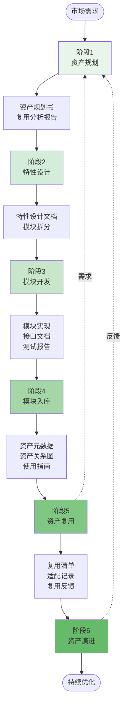

### 2.2 资产生命周期

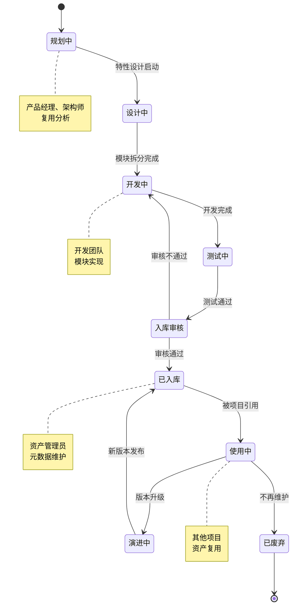

### 2.3 资产复用决策树

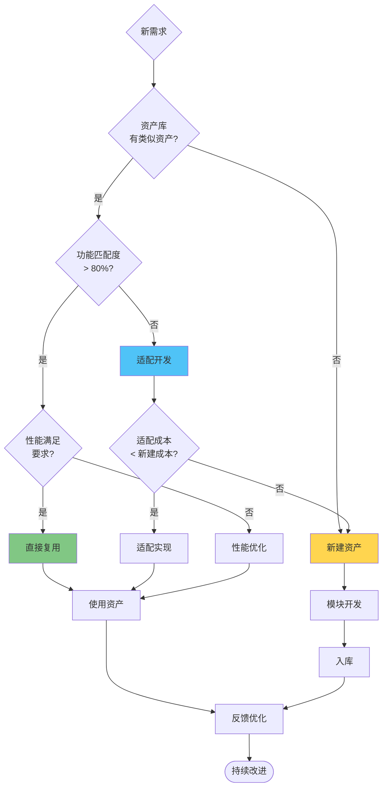

---

## 三、资产流各阶段详解

### 3.1 阶段1: 资产规划

#### 活动流程图

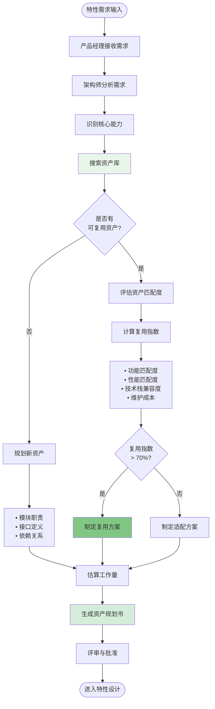

#### 关键活动

**活动1: 资产搜索与匹配**

**输入**:
- 特性需求描述
- 用户需求文档
- 功能规格说明

**过程**:

```typescript
// 资产搜索算法
interface AssetSearchResult {
  asset: Module
  matchScore: number
  matchDetails: {
    functionalMatch: number    // 功能匹配度 0-100
    performanceMatch: number   // 性能匹配度 0-100
    techStackMatch: number     // 技术栈兼容度 0-100
    maintenanceCost: number    // 维护成本评估 0-100
  }
  reuseRecommendation: 'reuse' | 'adapt' | 'create_new'
}

function searchAssets(requirement: string): AssetSearchResult[] {
  // 1. 关键词提取
  const keywords = extractKeywords(requirement)
  
  // 2. 语义搜索
  const candidates = semanticSearch(keywords, assetLibrary)
  
  // 3. 评分
  const results = candidates.map(asset => {
    const score = calculateMatchScore(asset, requirement)
    return {
      asset,
      matchScore: score.total,
      matchDetails: score.details,
      reuseRecommendation: getRecommendation(score.total)
    }
  })
  
  // 4. 排序
  return results.sort((a, b) => b.matchScore - a.matchScore)
}

// 匹配度计算
function calculateMatchScore(asset: Module, requirement: string) {
  const functional = calculateFunctionalMatch(asset, requirement) // 40%
  const performance = calculatePerformanceMatch(asset, requirement) // 30%
  const techStack = calculateTechStackMatch(asset, requirement)   // 20%
  const maintenance = 100 - asset.maintenanceCost                // 10%
  
  const total = 
    functional * 0.4 + 
    performance * 0.3 + 
    techStack * 0.2 + 
    maintenance * 0.1
  
  return {
    total,
    details: { functional, performance, techStack, maintenance }
  }
}

// 复用建议
function getRecommendation(score: number): string {
  if (score >= 80) return 'reuse'      // 直接复用
  if (score >= 60) return 'adapt'      // 适配后复用
  return 'create_new'                  // 新建
}
```

**输出**:
- 资产搜索报告
- 匹配度评估
- 复用建议

**活动2: 制定资产规划**

**输入**:
- 资产搜索报告
- 特性需求

**过程**:

```yaml
资产规划书模板:
  
  项目信息:
    项目名称: NOA城市领航 v4.0
    特性名称: 城市路口通行决策
    负责人: 张三（架构师）
    日期: 2026-01-10
  
  需求分析:
    功能需求:
      - 识别复杂路口（T字路口、十字路口、环岛）
      - 分析交通信号灯状态
      - 预测其他车辆意图
      - 生成通行决策
    
    性能需求:
      - 决策延迟 < 100ms
      - 准确率 > 95%
      - CPU占用 < 30%
  
  资产复用分析:
    方案1 - 直接复用 ⭐ 推荐
      模块: 路口决策模块 v2.1
      来源: NOA高速领航 v3.2
      匹配度: 85%
      复用方式: 直接集成，配置调整
      工作量: 3人天
      风险: 低
    
    方案2 - 适配复用
      模块: 通用决策模块 v1.0
      来源: LCC车道保持 v2.0
      匹配度: 65%
      适配内容:
        - 增加路口类型识别
        - 优化决策算法
      工作量: 15人天
      风险: 中
    
    方案3 - 新建
      工作量: 40人天
      风险: 高
      理由: 城市场景复杂，性能要求高
  
  推荐方案:
    选择: 方案1 - 直接复用
    理由:
      - 高匹配度（85%）
      - 低开发成本（3人天）
      - 已验证稳定性
      - 快速交付
  
  后续计划:
    1. 模块集成测试（2天）
    2. 性能调优（1天）
    3. 功能验证（2天）
  
  资产演进规划:
    v2.2版本计划:
      - 支持更多路口类型
      - 提升决策准确率到98%
      - 优化CPU占用到20%
```

**输出**:
- 资产规划书
- 工作量估算
- 风险评估

#### 平台功能映射

| 活动 | 功能模块 | 页面/操作 | 数据输入 | 数据输出 |
|------|---------|----------|---------|---------|
| 资产搜索 | F003-资产管理 | `/assets/search` | 搜索关键词、需求描述 | 资产列表、匹配度评分 |
| 匹配度评估 | F003-资产管理 | `/assets/{id}/evaluation` | 资产ID、需求规格 | 匹配度报告、复用建议 |
| 制定规划 | F003-资产管理 | `/assets/planning/create` | 特性需求、复用方案 | 资产规划书 |
| 规划评审 | F003-资产管理 | `/assets/planning/{id}/review` | 规划书ID、评审意见 | 评审结果、批准状态 |

---

### 3.2 阶段2: 特性设计

#### 活动流程图

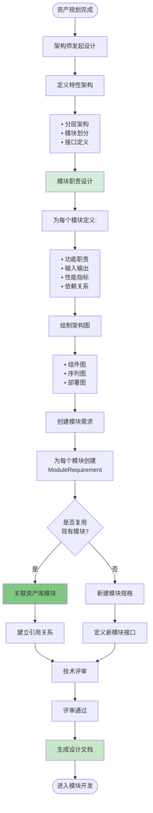

#### 关键活动

**活动1: 模块划分**

```typescript
// 模块划分原则
interface ModuleDesignPrinciples {
  singleResponsibility: boolean  // 单一职责
  highCohesion: boolean          // 高内聚
  lowCoupling: boolean           // 低耦合
  reusable: boolean              // 可复用
  testable: boolean              // 可测试
}

// 模块设计
interface ModuleDesign {
  id: string
  name: string
  responsibility: string         // 职责描述
  
  // 接口定义
  interfaces: {
    input: InterfaceSpec[]       // 输入接口
    output: InterfaceSpec[]      // 输出接口
  }
  
  // 依赖关系
  dependencies: {
    moduleId: string
    type: 'compile' | 'runtime'
    version: string
  }[]
  
  // 性能指标
  performance: {
    latency: number              // 延迟要求（ms）
    throughput: number           // 吞吐量要求（TPS）
    memory: number               // 内存要求（MB）
    cpu: number                  // CPU占用（%）
  }
  
  // 复用信息
  reuseInfo?: {
    sourceModule: string         // 源模块
    reuseType: 'direct' | 'adapted' | 'new'
    changes: string[]            // 变更内容
  }
}
```

**示例: NOA城市领航特性模块划分**

```yaml
特性: NOA城市领航 v4.0
架构师: 李四
日期: 2026-01-10

模块列表:

  1. 感知融合模块
     职责: 多传感器数据融合，生成环境模型
     输入:
       - 摄像头数据流
       - 毫米波雷达数据
       - 激光雷达数据
     输出:
       - 环境感知结果（障碍物、车道线、交通标志）
     性能:
       - 延迟 < 50ms
       - 准确率 > 95%
     复用: 直接复用感知融合模块 v3.0
  
  2. 路口决策模块 ⭐
     职责: 城市路口通行决策
     输入:
       - 环境感知结果
       - 高精地图数据
       - 车辆状态
     输出:
       - 通行决策（通过/等待/减速）
       - 轨迹规划参考
     性能:
       - 决策延迟 < 100ms
       - 准确率 > 95%
     复用: 直接复用路口决策模块 v2.1
  
  3. 轨迹规划模块
     职责: 生成车辆行驶轨迹
     输入:
       - 通行决策
       - 环境模型
       - 目标路径
     输出:
       - 规划轨迹（路径点序列）
     性能:
       - 规划时间 < 80ms
       - 舒适度评分 > 8/10
     复用: 适配轨迹规划模块 v2.0
     适配内容:
       - 增加路口场景规划算法
       - 优化轨迹平滑度
  
  4. 控制执行模块
     职责: 执行轨迹跟踪控制
     输入:
       - 规划轨迹
       - 车辆状态
     输出:
       - 控制指令（方向盘角度、加速度）
     性能:
       - 控制周期 10ms
       - 跟踪误差 < 10cm
     复用: 新建模块
     理由: 城市场景控制精度要求更高

依赖关系:
  感知融合 → 路口决策 → 轨迹规划 → 控制执行

技术栈:
  - 开发语言: C++17
  - 框架: ROS2
  - 深度学习: TensorRT
  - 仿真: CARLA

工作量估算:
  - 模块1（复用）: 3人天
  - 模块2（复用）: 3人天
  - 模块3（适配）: 15人天
  - 模块4（新建）: 40人天
  - 集成测试: 10人天
  总计: 71人天
```

**活动2: 创建ModuleRequirement（WorkItem）**

```typescript
// 为每个模块创建WorkItem
function createModuleRequirements(moduleDesigns: ModuleDesign[]) {
  return moduleDesigns.map(design => {
    const workItem: WorkItem = {
      id: generateId(),
      code: generateCode('MR'), // MR-2026-001
      title: `${design.name} - 开发实现`,
      type: 'module_requirement', // ⭐ WorkItem类型
      
      // 关联关系
      moduleId: design.id,
      featureId: design.featureId,
      
      // 层级关系（顶层WorkItem，无父节点）
      parentWorkItemId: null,
      childWorkItemIds: [], // 后续Sprint Planning会分解
      
      // 描述信息
      description: design.responsibility,
      acceptanceCriteria: design.acceptanceCriteria,
      
      // 工作量
      estimatedHours: design.estimatedHours,
      storyPoints: design.storyPoints,
      
      // 状态
      priority: design.priority,
      status: 'pending',
      progress: 0,
      
      // 复用信息
      reuseInfo: design.reuseInfo,
      
      // 自动分配团队（基于模块责任）
      assignedTeamId: getTeamByModule(design.id),
      assignedSprintId: null, // PI Planning时分配
      
      // 创建信息
      createdBy: 'architect',
      createdAt: new Date()
    }
    
    return workItem
  })
}
```

#### 平台功能映射

| 活动 | 功能模块 | 页面/操作 | 数据输入 | 数据输出 |
|------|---------|----------|---------|---------|
| 特性架构设计 | F002-特性管理 | `/features/{id}/architecture` | 特性需求、资产规划 | 架构设计文档 |
| 模块划分 | F005-模块管理 | `/modules/design` | 特性架构、模块职责 | 模块设计列表 |
| 创建ModuleRequirement | F010-工作项管理 | `/work-items/create` | 模块设计、工作量 | WorkItem(module_requirement) |
| 技术评审 | F002-特性管理 | `/features/{id}/review` | 设计文档、评审人 | 评审结果、改进建议 |

---

### 3.3 阶段3: 模块开发

#### 活动流程图

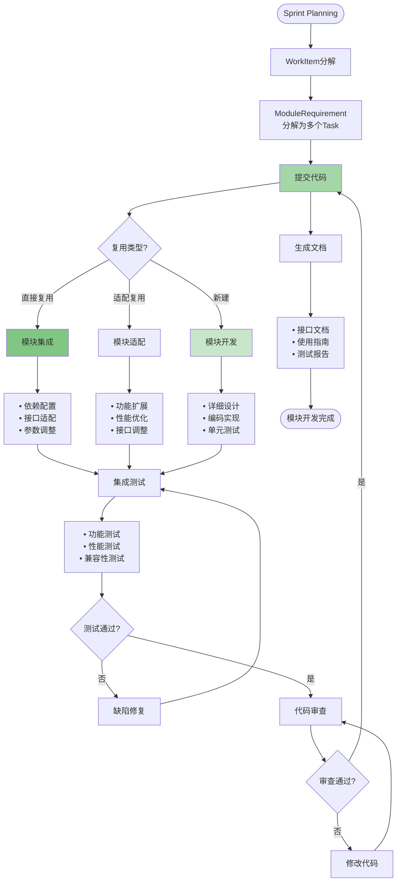

#### 关键活动

**活动1: WorkItem分解（Sprint Planning）**

```typescript
// Sprint Planning: ModuleRequirement分解为Task
function decomposeModuleRequirement(
  moduleRequirement: WorkItem
): WorkItem[] {
  // 模块需求分解为多个开发任务
  const tasks: WorkItem[] = []
  
  // 1. 详细设计Task
  tasks.push({
    id: generateId(),
    code: generateCode('TASK'),
    title: `${moduleRequirement.title} - 详细设计`,
    type: 'task', // ⭐ Task是WorkItem的一种类型
    
    // 层级关系 ⭐⭐⭐
    parentWorkItemId: moduleRequirement.id, // 父WorkItem
    childWorkItemIds: [],
    
    // 关联关系（继承自父WorkItem）
    moduleId: moduleRequirement.moduleId,
    featureId: moduleRequirement.featureId,
    assignedTeamId: moduleRequirement.assignedTeamId,
    assignedSprintId: getCurrentSprint().id,
    
    // 分配给具体成员 ⭐
    assignee: 'developer_zhang',
    
    estimatedHours: 8,
    storyPoints: 2,
    
    status: 'pending',
    priority: 'high'
  })
  
  // 2. 编码实现Task
  tasks.push({
    id: generateId(),
    code: generateCode('TASK'),
    title: `${moduleRequirement.title} - 编码实现`,
    type: 'task',
    
    parentWorkItemId: moduleRequirement.id,
    assignee: 'developer_zhang',
    
    estimatedHours: 40,
    storyPoints: 13,
    
    status: 'pending',
    priority: 'high'
  })
  
  // 3. 单元测试Task
  tasks.push({
    id: generateId(),
    code: generateCode('TASK'),
    title: `${moduleRequirement.title} - 单元测试`,
    type: 'test_task', // ⭐ 测试任务也是WorkItem的一种类型
    
    parentWorkItemId: moduleRequirement.id,
    assignee: 'developer_zhang',
    
    estimatedHours: 16,
    storyPoints: 5,
    
    status: 'pending',
    priority: 'medium'
  })
  
  // 4. 文档编写Task
  tasks.push({
    id: generateId(),
    code: generateCode('TASK'),
    title: `${moduleRequirement.title} - 接口文档`,
    type: 'task',
    
    parentWorkItemId: moduleRequirement.id,
    assignee: 'developer_zhang',
    
    estimatedHours: 8,
    storyPoints: 2,
    
    status: 'pending',
    priority: 'low'
  })
  
  // 更新父WorkItem的子任务列表
  moduleRequirement.childWorkItemIds = tasks.map(t => t.id)
  
  return tasks
}
```

**活动2: 模块开发（不同复用类型）**

**类型1: 直接复用**

```yaml
场景: 复用现有模块，无需修改

步骤:
  1. 从资产库下载模块
     - 模块代码仓库地址
     - 模块版本号
     - 依赖清单
  
  2. 配置集成
     - 添加依赖到项目
     - 配置参数文件
     - 适配接口调用
  
  3. 集成测试
     - 功能测试
     - 性能测试
     - 兼容性测试
  
  4. 文档更新
     - 集成说明
     - 配置文档

工作量: 3-5人天
风险: 低
```

**类型2: 适配复用**

```yaml
场景: 复用现有模块，需要适配修改

步骤:
  1. Fork模块代码
     - 创建适配分支
     - 保留原始追溯
  
  2. 功能扩展
     - 新增接口
     - 扩展功能
     - 优化算法
  
  3. 测试验证
     - 原有功能回归测试
     - 新增功能测试
     - 性能对比测试
  
  4. 文档更新
     - 变更说明
     - 接口文档
     - 迁移指南

工作量: 10-20人天
风险: 中
```

**类型3: 新建开发**

```yaml
场景: 全新开发模块

步骤:
  1. 详细设计
     - 类图设计
     - 接口定义
     - 数据结构设计
  
  2. 编码实现
     - TDD开发
     - 代码规范
     - 代码审查
  
  3. 单元测试
     - 测试用例设计
     - 覆盖率 > 80%
     - 性能测试
  
  4. 集成测试
     - 功能测试
     - 系统测试
     - 压力测试
  
  5. 文档编写
     - 设计文档
     - 接口文档
     - 使用指南
     - 测试报告

工作量: 30-50人天
风险: 高
```

#### 平台功能映射

| 活动 | 功能模块 | 页面/操作 | 数据输入 | 数据输出 |
|------|---------|----------|---------|---------|
| WorkItem分解 | F010-工作项管理 | `/work-items/{id}/decompose` | ModuleRequirement ID | Task列表 |
| 任务领取 | F010-工作项管理 | `/work-items/{id}/assign` | Task ID、开发者 | 任务分配记录 |
| 代码提交 | F011-代码管理 | Git操作 | 代码变更 | Commit记录 |
| 代码审查 | F011-代码管理 | `/code-review/create` | Merge Request | 审查意见 |
| 测试管理 | F012-测试管理 | `/test/cases` | 测试用例、测试结果 | 测试报告 |

---

### 3.4 阶段4: 模块入库

#### 活动流程图

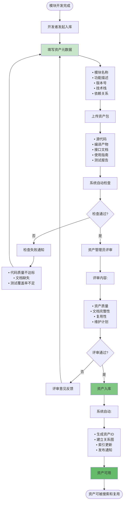

#### 关键活动

**活动1: 填写资产元数据**

```typescript
// 资产元数据
interface AssetMetadata {
  // 基本信息
  id: string
  code: string                    // AS-2026-001
  name: string                    // 模块名称
  version: string                 // 版本号（语义化版本）
  description: string             // 功能描述
  
  // 分类信息
  productLineId: string           // 所属产品线
  productId: string               // 所属产品
  category: string                // 分类（感知/规划/控制）
  tags: string[]                  // 标签
  
  // 技术信息
  techStack: {
    language: string[]            // 开发语言
    framework: string[]           // 框架
    tools: string[]               // 工具
  }
  
  // 依赖关系
  dependencies: {
    moduleId: string
    version: string
    type: 'compile' | 'runtime'
  }[]
  
  // 接口定义
  interfaces: {
    name: string
    type: 'input' | 'output'
    protocol: string              // ROS/HTTP/gRPC
    dataFormat: string            // JSON/Protobuf
    schema: object                // 数据结构
  }[]
  
  // 质量指标
  quality: {
    codeQuality: number           // 代码质量评分 0-100
    testCoverage: number          // 测试覆盖率 0-100
    documentationScore: number    // 文档评分 0-100
    performanceScore: number      // 性能评分 0-100
  }
  
  // 资产包信息
  artifacts: {
    sourceCode: string            // 源代码仓库
    binaryPackage: string         // 编译产物
    documentation: string         // 文档地址
    testReport: string            // 测试报告
  }
  
  // 使用信息
  usage: {
    projectCount: number          // 使用项目数
    downloadCount: number         // 下载次数
    starCount: number             // 收藏数
    issueCount: number            // 问题数
  }
  
  // 维护信息
  maintenance: {
    owner: string                 // 负责人
    team: string                  // 负责团队
    supportLevel: 'active' | 'maintenance' | 'deprecated'
    lastUpdated: Date
  }
  
  // 复用信息
  reuseGuidance: {
    scenarios: string[]           // 适用场景
    limitations: string[]         // 限制条件
    examples: string[]            // 使用示例
    migration: string             // 迁移指南
  }
}
```

**活动2: 资产质量检查**

```typescript
// 自动质量检查
interface QualityCheck {
  codeQuality: {
    passed: boolean
    issues: {
      sonarQube: number           // SonarQube扫描问题数
      complexity: number          // 圈复杂度
      duplications: number        // 重复代码率
    }
    threshold: {
      issues: 0
      complexity: 15
      duplications: 3              // %
    }
  }
  
  testing: {
    passed: boolean
    coverage: {
      line: number
      branch: number
      function: number
    }
    threshold: {
      line: 80
      branch: 75
      function: 80
    }
  }
  
  documentation: {
    passed: boolean
    completeness: {
      readme: boolean
      api: boolean
      examples: boolean
      changelog: boolean
    }
  }
  
  performance: {
    passed: boolean
    benchmarks: {
      latency: number             // ms
      throughput: number          // ops/s
      memory: number              // MB
    }
    threshold: {
      latency: 100
      throughput: 1000
      memory: 512
    }
  }
}

// 执行质量检查
async function performQualityCheck(
  asset: AssetMetadata
): Promise<QualityCheck> {
  const results = {
    codeQuality: await checkCodeQuality(asset),
    testing: await checkTestCoverage(asset),
    documentation: await checkDocumentation(asset),
    performance: await checkPerformance(asset)
  }
  
  return results
}

// 判断是否通过
function isQualityCheckPassed(check: QualityCheck): boolean {
  return (
    check.codeQuality.passed &&
    check.testing.passed &&
    check.documentation.passed &&
    check.performance.passed
  )
}
```

**活动3: 建立资产关系图**

```typescript
// 资产关系
interface AssetRelationship {
  fromAsset: string               // 源资产ID
  toAsset: string                 // 目标资产ID
  relationType: RelationType
  version: string                 // 关系版本
  metadata: object                // 关系元数据
}

enum RelationType {
  DEPENDS_ON = 'depends_on',      // 依赖关系
  DERIVED_FROM = 'derived_from',  // 派生关系
  REPLACES = 'replaces',          // 替代关系
  INTEGRATES_WITH = 'integrates_with', // 集成关系
  PART_OF = 'part_of'             // 组成关系
}

// 构建资产关系图
function buildAssetGraph(assets: AssetMetadata[]) {
  const graph = new Graph()
  
  // 添加节点
  assets.forEach(asset => {
    graph.addNode({
      id: asset.id,
      label: asset.name,
      type: asset.category,
      metadata: asset
    })
  })
  
  // 添加边（关系）
  assets.forEach(asset => {
    // 依赖关系
    asset.dependencies.forEach(dep => {
      graph.addEdge({
        from: asset.id,
        to: dep.moduleId,
        type: 'depends_on',
        version: dep.version
      })
    })
    
    // 派生关系（如果是适配的模块）
    if (asset.reuseInfo?.sourceModule) {
      graph.addEdge({
        from: asset.id,
        to: asset.reuseInfo.sourceModule,
        type: 'derived_from',
        changes: asset.reuseInfo.changes
      })
    }
  })
  
  return graph
}
```

#### 平台功能映射

| 活动 | 功能模块 | 页面/操作 | 数据输入 | 数据输出 |
|------|---------|----------|---------|---------|
| 发起入库 | F003-资产管理 | `/assets/submit` | 模块信息 | 入库申请 |
| 填写元数据 | F003-资产管理 | `/assets/metadata/edit` | 资产信息、文档 | 资产元数据 |
| 质量检查 | F003-资产管理 | 自动触发 | 资产包 | 质量检查报告 |
| 资产评审 | F003-资产管理 | `/assets/{id}/review` | 资产ID、评审意见 | 评审结果 |
| 资产入库 | F003-资产管理 | 自动触发 | 评审通过 | 资产ID、关系图 |
| 资产发布 | F003-资产管理 | `/assets/{id}/publish` | 资产ID | 发布通知 |

---

*(继续下一个阶段...)*

### 3.5 阶段5: 资产复用

#### 活动流程图

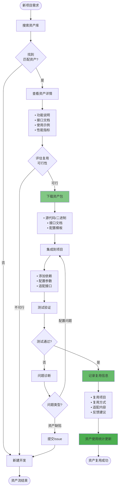

#### 关键活动

**活动1: 资产搜索与选择**

```typescript
// 资产搜索过滤器
interface AssetSearchFilter {
  // 基本过滤
  keywords?: string               // 关键词
  category?: string               // 分类
  tags?: string[]                 // 标签
  productLine?: string            // 产品线
  
  // 技术栈过滤
  language?: string[]             // 编程语言
  framework?: string[]            // 框架
  
  // 质量过滤
  minQualityScore?: number        // 最低质量分
  minTestCoverage?: number        // 最低测试覆盖率
  minStars?: number               // 最低收藏数
  
  // 维护状态过滤
  supportLevel?: ('active' | 'maintenance' | 'deprecated')[]
  
  // 性能要求
  maxLatency?: number             // 最大延迟
  minThroughput?: number          // 最小吞吐量
  
  // 排序
  sortBy?: 'relevance' | 'quality' | 'popularity' | 'updated'
  sortOrder?: 'asc' | 'desc'
}

// 搜索结果
interface AssetSearchResult {
  assets: AssetMetadata[]
  total: number
  facets: {
    categories: { name: string; count: number }[]
    languages: { name: string; count: number }[]
    quality: { range: string; count: number }[]
  }
}

// 搜索资产
async function searchAssets(
  filter: AssetSearchFilter
): Promise<AssetSearchResult> {
  // 实现搜索逻辑
  // ...
}
```

**活动2: 资产集成**

```yaml
资产集成步骤:

  1. 依赖管理
     方式: 根据技术栈选择
     
     C++ (CMake):
       # CMakeLists.txt
       find_package(PerceptionModule 3.0 REQUIRED)
       target_link_libraries(my_app PerceptionModule::PerceptionModule)
     
     Python (pip):
       # requirements.txt
       perception-module==3.0.0
     
     ROS2 (package.xml):
       <depend>perception_module</depend>
  
  2. 配置参数
     配置文件: config/perception_module.yaml
     
     perception:
       camera:
         resolution: [1920, 1080]
         fps: 30
       radar:
         range: 200  # meters
         fov: 120    # degrees
       fusion:
         algorithm: "kalman_filter"
         confidence_threshold: 0.8
  
  3. 接口适配
     代码示例 (C++):
     
     #include <perception_module/perception.h>
     
     // 创建感知实例
     auto perception = PerceptionModule::create(config);
     
     // 订阅传感器数据
     perception->subscribeCameraData(camera_topic);
     perception->subscribeRadarData(radar_topic);
     
     // 注册回调
     perception->registerCallback([](const PerceptionResult& result) {
       // 处理感知结果
       handlePerceptionResult(result);
     });
     
     // 启动感知
     perception->start();
  
  4. 测试验证
     单元测试:
       - 接口调用测试
       - 数据格式验证
       - 异常处理测试
     
     集成测试:
       - 端到端功能测试
       - 性能基准测试
       - 压力测试
```

**活动3: 复用反馈**

```typescript
// 复用反馈
interface AssetUsageFeedback {
  // 基本信息
  assetId: string
  projectId: string
  userId: string
  usageDate: Date
  
  // 复用方式
  reuseType: 'direct' | 'adapted' | 'inspired'
  
  // 适配内容（如果有）
  adaptations?: {
    type: 'interface' | 'config' | 'algorithm'
    description: string
    effort: number                // 工作量（小时）
  }[]
  
  // 质量反馈
  qualityFeedback: {
    functionalityRating: number   // 功能性评分 1-5
    performanceRating: number     // 性能评分 1-5
    documentationRating: number   // 文档评分 1-5
    easeOfUseRating: number       // 易用性评分 1-5
  }
  
  // 问题反馈
  issues?: {
    type: 'bug' | 'performance' | 'documentation' | 'compatibility'
    severity: 'critical' | 'major' | 'minor'
    description: string
  }[]
  
  // 改进建议
  improvements?: string[]
  
  // 效益评估
  benefits: {
    timeSaved: number             // 节省时间（小时）
    costSaved: number             // 节省成本（元）
    qualityImproved: boolean      // 质量提升
  }
}

// 提交复用反馈
async function submitUsageFeedback(
  feedback: AssetUsageFeedback
): Promise<void> {
  // 1. 保存反馈
  await saveFeedback(feedback)
  
  // 2. 更新资产统计
  await updateAssetStatistics(feedback.assetId, {
    usageCount: 1,
    averageRating: feedback.qualityFeedback,
    totalTimeSaved: feedback.benefits.timeSaved
  })
  
  // 3. 通知资产负责人
  if (feedback.issues && feedback.issues.length > 0) {
    await notifyAssetOwner(feedback.assetId, feedback.issues)
  }
  
  // 4. 触发改进流程（如果有严重问题）
  const criticalIssues = feedback.issues?.filter(i => i.severity === 'critical')
  if (criticalIssues && criticalIssues.length > 0) {
    await triggerImprovementWorkflow(feedback.assetId, criticalIssues)
  }
}
```

#### 平台功能映射

| 活动 | 功能模块 | 页面/操作 | 数据输入 | 数据输出 |
|------|---------|----------|---------|---------|
| 搜索资产 | F003-资产管理 | `/assets/search` | 搜索条件、过滤器 | 资产列表、匹配度 |
| 查看详情 | F003-资产管理 | `/assets/{id}` | 资产ID | 资产详情、文档 |
| 下载资产 | F003-资产管理 | `/assets/{id}/download` | 资产ID、版本 | 资产包 |
| 集成指导 | F003-资产管理 | `/assets/{id}/integration` | 资产ID、项目信息 | 集成文档、示例代码 |
| 提交反馈 | F003-资产管理 | `/assets/{id}/feedback` | 资产ID、反馈信息 | 反馈记录 |
| 提交Issue | F003-资产管理 | `/assets/{id}/issues/create` | 资产ID、问题描述 | Issue ID |

---

### 3.6 阶段6: 资产演进

#### 活动流程图

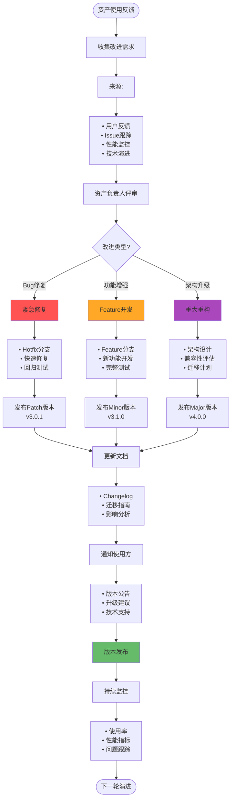

#### 关键活动

**活动1: 版本管理策略**

```yaml
语义化版本控制 (Semantic Versioning):

  版本格式: MAJOR.MINOR.PATCH
  
  示例: v3.2.1
    - MAJOR: 3 (主版本号)
    - MINOR: 2 (次版本号)
    - PATCH: 1 (修订号)
  
  版本递增规则:
    1. MAJOR: 不兼容的API变更
       示例: v2.x → v3.0
       场景:
         - 接口签名变更
         - 删除废弃API
         - 架构重构
       
    2. MINOR: 向后兼容的功能新增
       示例: v3.1 → v3.2
       场景:
         - 新增接口
         - 功能增强
         - 性能优化
       
    3. PATCH: 向后兼容的Bug修复
       示例: v3.2.0 → v3.2.1
       场景:
         - Bug修复
         - 安全补丁
         - 文档更新
  
  版本生命周期:
    - Active: 主动开发，持续更新
      示例: v3.x
      支持: 全功能支持
      
    - Maintenance: 维护模式，仅修复严重Bug
      示例: v2.x
      支持: 安全补丁和严重Bug修复
      周期: 1年
      
    - Deprecated: 已废弃，不再维护
      示例: v1.x
      支持: 无
      建议: 尽快迁移到新版本
  
  版本兼容性:
    - 向后兼容（Backward Compatible）:
      新版本可以无缝替换旧版本
      示例: v3.1可以替换v3.0
      
    - 向前兼容（Forward Compatible）:
      旧版本可以处理新版本的数据
      示例: v3.0可以读取v3.1的配置（降级使用）
```

**活动2: 变更管理**

```typescript
// 版本变更记录
interface VersionChange {
  version: string                 // 新版本号
  releaseDate: Date               // 发布日期
  type: 'major' | 'minor' | 'patch'
  
  // 变更内容
  changes: {
    type: 'feature' | 'bugfix' | 'improvement' | 'deprecation' | 'breaking'
    description: string
    issueIds: string[]            // 关联Issue
    pullRequests: string[]        // 关联PR
  }[]
  
  // 兼容性信息
  compatibility: {
    backwardCompatible: boolean
    minimumVersion: string        // 最低兼容版本
    deprecatedAPIs: string[]      // 废弃的API
    removedAPIs: string[]         // 移除的API
  }
  
  // 迁移指南
  migration: {
    required: boolean             // 是否需要迁移
    difficulty: 'easy' | 'medium' | 'hard'
    steps: string[]               // 迁移步骤
    estimatedEffort: number       // 预估工作量（小时）
    examples: string[]            // 迁移示例
  }
  
  // 影响分析
  impact: {
    affectedProjects: string[]    // 受影响的项目
    riskLevel: 'low' | 'medium' | 'high'
    testingRequired: boolean
  }
}

// 生成Changelog
function generateChangelog(changes: VersionChange[]): string {
  let changelog = '# Changelog\n\n'
  
  changes.forEach(change => {
    changelog += `## [${change.version}] - ${change.releaseDate.toISOString().split('T')[0]}\n\n`
    
    // 按类型分组
    const byType = groupBy(change.changes, 'type')
    
    if (byType.feature) {
      changelog += '### ✨ Features\n\n'
      byType.feature.forEach(c => {
        changelog += `- ${c.description}\n`
      })
      changelog += '\n'
    }
    
    if (byType.bugfix) {
      changelog += '### 🐛 Bug Fixes\n\n'
      byType.bugfix.forEach(c => {
        changelog += `- ${c.description}\n`
      })
      changelog += '\n'
    }
    
    if (byType.improvement) {
      changelog += '### 🚀 Improvements\n\n'
      byType.improvement.forEach(c => {
        changelog += `- ${c.description}\n`
      })
      changelog += '\n'
    }
    
    if (byType.breaking) {
      changelog += '### ⚠️ BREAKING CHANGES\n\n'
      byType.breaking.forEach(c => {
        changelog += `- ${c.description}\n`
      })
      changelog += '\n'
    }
    
    if (byType.deprecation) {
      changelog += '### 📛 Deprecations\n\n'
      byType.deprecation.forEach(c => {
        changelog += `- ${c.description}\n`
      })
      changelog += '\n'
    }
  })
  
  return changelog
}
```

**活动3: 资产升级支持**

```typescript
// 资产升级计划
interface AssetUpgradePlan {
  // 当前状态
  currentVersion: string
  targetVersion: string
  
  // 升级类型
  upgradeType: 'patch' | 'minor' | 'major'
  
  // 影响评估
  impact: {
    breakingChanges: boolean
    apiChanges: string[]
    configChanges: string[]
    databaseChanges: string[]
    dependencyChanges: string[]
  }
  
  // 升级步骤
  steps: {
    order: number
    title: string
    description: string
    commands: string[]
    validation: string
    rollback: string
  }[]
  
  // 测试计划
  testing: {
    unitTests: boolean
    integrationTests: boolean
    regressionTests: boolean
    performanceTests: boolean
  }
  
  // 回滚计划
  rollback: {
    possible: boolean
    steps: string[]
    dataBackup: string[]
  }
  
  // 支持信息
  support: {
    documentationUrl: string
    migrationGuideUrl: string
    examplesUrl: string
    contactEmail: string
  }
}

// 生成升级计划
function generateUpgradePlan(
  asset: AssetMetadata,
  fromVersion: string,
  toVersion: string
): AssetUpgradePlan {
  const changes = getChangesBetweenVersions(asset, fromVersion, toVersion)
  
  return {
    currentVersion: fromVersion,
    targetVersion: toVersion,
    upgradeType: determineUpgradeType(fromVersion, toVersion),
    impact: analyzeImpact(changes),
    steps: generateUpgradeSteps(changes),
    testing: defineTestingStrategy(changes),
    rollback: planRollback(changes),
    support: getSupportInfo(asset)
  }
}
```

#### 平台功能映射

| 活动 | 功能模块 | 页面/操作 | 数据输入 | 数据输出 |
|------|---------|----------|---------|---------|
| 收集反馈 | F003-资产管理 | `/assets/{id}/feedbacks` | 资产ID | 反馈列表、统计 |
| Issue跟踪 | F003-资产管理 | `/assets/{id}/issues` | 资产ID | Issue列表、优先级 |
| 版本规划 | F003-资产管理 | `/assets/{id}/versions/plan` | 资产ID、改进需求 | 版本计划 |
| 版本开发 | F010-工作项管理 | `/work-items` | 版本计划 | WorkItem列表 |
| 版本发布 | F003-资产管理 | `/assets/{id}/versions/release` | 版本ID、变更记录 | 发布公告 |
| 升级指导 | F003-资产管理 | `/assets/{id}/upgrade` | 当前版本、目标版本 | 升级计划、迁移指南 |

---

## 四、平台功能映射

### 4.1 角色-页面映射

| 角色 | 主要页面 | 关键功能 |
|------|---------|---------|
| **产品经理** | `/assets/planning` | 资产规划、复用分析 |
| **架构师** | `/assets/design` | 特性设计、模块划分 |
| **开发工程师** | `/work-items/my-tasks` | 任务开发、代码提交 |
| **资产管理员** | `/assets/management` | 资产入库、质量审核 |
| **项目经理** | `/assets/usage` | 资产使用统计、效益分析 |

### 4.2 完整页面列表

```
产品资产管理页面:
├── /assets/overview              # 资产全景（产品资产流首页）
├── /assets/search                # 资产搜索
├── /assets/{id}                  # 资产详情
├── /assets/planning              # 资产规划
├── /assets/design                # 特性设计
├── /assets/submit                # 资产入库
├── /assets/management            # 资产管理
├── /assets/{id}/review           # 资产评审
├── /assets/{id}/download         # 资产下载
├── /assets/{id}/feedback         # 复用反馈
├── /assets/{id}/versions         # 版本管理
├── /assets/{id}/upgrade          # 升级指导
├── /assets/metrics               # 资产度量
└── /assets/library               # 资产库（关系图）
```

### 4.3 数据流图

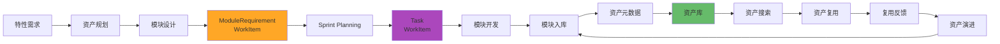

---

## 五、资产度量体系

### 5.1 核心度量指标

```
资产度量指标体系:
━━━━━━━━━━━━━━━━━━━━━━━━━━━━━━━━━━━━━━━━━━━━━━━━━

【资产数量指标】
• 资产总数（Total Assets）
• 新增资产数（New Assets per Month）
• 资产增长率（Asset Growth Rate）

【资产质量指标】⭐
• 平均代码质量评分（Average Code Quality Score）
• 平均测试覆盖率（Average Test Coverage）
• 平均文档评分（Average Documentation Score）
• 缺陷密度（Defect Density）

【资产复用指标】⭐⭐⭐
• 资产复用率（Asset Reuse Rate）
  计算公式: (复用模块数 / 总模块数) × 100%
  
• 资产使用率（Asset Usage Rate）
  计算公式: (被使用的资产数 / 总资产数) × 100%
  
• 平均复用次数（Average Reuse Count）
  计算公式: 总复用次数 / 资产总数
  
• 复用节省工时（Time Saved by Reuse）
  计算公式: Σ(复用次数 × 单次节省工时)

【资产健康指标】⭐
• 活跃资产比例（Active Asset Ratio）
  计算公式: (活跃维护的资产数 / 总资产数) × 100%
  
• 废弃资产比例（Deprecated Asset Ratio）
  计算公式: (废弃资产数 / 总资产数) × 100%
  
• 平均资产年龄（Average Asset Age）
  计算公式: Σ资产年龄 / 资产总数
  
• 资产更新频率（Asset Update Frequency）
  计算公式: 总更新次数 / (资产总数 × 月数)

【资产效益指标】⭐⭐
• 资产ROI（Return on Investment）
  计算公式: (复用节省成本 - 资产开发成本) / 资产开发成本
  
• 平均复用成本（Average Reuse Cost）
  计算公式: 总适配成本 / 总复用次数
  
• 资产价值指数（Asset Value Index）
  计算公式: 复用次数 × 质量评分 / 维护成本
```

### 5.2 度量看板

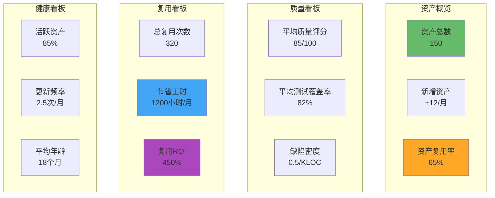

---

## 六、典型场景

### 6.1 场景1: 直接复用资产

```yaml
场景描述:
  新项目需要车道保持功能，
  资产库中已有成熟的LCC模块

流程:
  1. 产品经理创建特性需求
     页面: /features/create
     输入: 特性描述、功能需求
     输出: 特性ID

  2. 架构师搜索资产库
     页面: /assets/search
     输入: "车道保持 LCC"
     输出: 匹配资产列表
     
  3. 评估资产匹配度
     页面: /assets/LCC-v2.0
     查看: 功能说明、性能指标、使用案例
     匹配度: 95%
     决策: 直接复用
     
  4. 制定资产规划
     页面: /assets/planning/create
     方案: 直接复用 LCC v2.0
     工作量: 3人天
     
  5. PI Planning分配
     创建: ModuleRequirement WorkItem
     分配: 自动分配到车控团队
     Sprint: PI-2026-Q1 Sprint-1
     
  6. Sprint Planning拆分
     ModuleRequirement → 3个Task:
       - Task-001: 模块集成（1天）
       - Task-002: 参数配置（1天）
       - Task-003: 集成测试（1天）
     
  7. 开发集成
     页面: /work-items/Task-001
     操作: 下载资产包、添加依赖、配置参数
     
  8. 测试验证
     页面: /test/cases
     测试: 功能测试、性能测试
     结果: 通过
     
  9. 提交反馈
     页面: /assets/LCC-v2.0/feedback
     评分: 功能5分、性能5分、文档4分
     节省: 40人天
     
  10. 项目交付
      产出: 包含LCC功能的车型
      复用成功率: 100%

效益:
  • 节省开发时间: 40人天
  • 节省成本: 约8万元（按200元/小时计算）
  • 交付周期缩短: 6周
  • 质量风险降低: 已验证的成熟模块
```

### 6.2 场景2: 适配复用资产

```yaml
场景描述:
  新项目需要城市路口决策功能，
  资产库有高速路口决策模块，需要适配

流程:
  1. 搜索资产
     搜索: "路口决策"
     结果: 高速路口决策模块 v2.1
     匹配度: 70%
     
  2. 制定适配方案
     页面: /assets/planning/create
     适配内容:
       - 增加城市路口类型识别
       - 优化复杂场景决策算法
       - 提升决策准确率
     工作量: 15人天
     
  3. PI Planning
     创建: ModuleRequirement WorkItem
     类型: 'module_requirement'
     复用信息:
       sourceModule: "高速路口决策 v2.1"
       reuseType: "adapted"
     
  4. Sprint Planning拆分
     ModuleRequirement → 5个Task:
       - Task-001: Fork原模块代码（0.5天）
       - Task-002: 路口类型识别增强（5天）
       - Task-003: 决策算法优化（6天）
       - Task-004: 性能测试（2天）
       - Task-005: 文档更新（1.5天）
     
  5. 适配开发
     基础: 复用70%的原有代码
     新增: 30%的适配代码
     
  6. 测试验证
     回归测试: 原有功能不受影响
     新功能测试: 城市路口决策准确率达95%
     
  7. 模块入库
     页面: /assets/submit
     新资产: 城市路口决策模块 v1.0
     关系: derived_from 高速路口决策 v2.1
     
  8. 反馈
     适配成本: 15人天
     新建成本: 40人天
     节省: 25人天 (62.5%)

效益:
  • 节省开发时间: 25人天
  • 节省成本: 约5万元
  • 质量保证: 基于成熟模块
  • 资产增值: 新增一个城市场景资产
```

### 6.3 场景3: 新建资产

```yaml
场景描述:
  新项目需要全新的端到端决策功能，
  资产库中没有类似资产

流程:
  1. 搜索资产
     搜索: "端到端决策"
     结果: 无匹配资产
     决策: 新建开发
     
  2. 制定资产规划
     页面: /assets/planning/create
     新建理由:
       - 全新技术路线（端到端神经网络）
       - 无类似资产可复用
       - 战略性核心能力
     工作量: 60人天
     
  3. 特性设计
     页面: /features/{id}/architecture
     架构设计:
       - 感知→端到端决策→控制
       - 基于Transformer的决策网络
       - 实时推理优化
     
  4. 模块设计
     页面: /modules/design
     模块列表:
       - 端到端决策网络模块
       - 推理优化模块
       - 决策可解释模块
     
  5. 创建WorkItem
     类型: module_requirement
     拆分: 20个Task
     
  6. Sprint开发（3个Sprint）
     Sprint-1: 基础框架搭建
     Sprint-2: 核心算法实现
     Sprint-3: 优化和测试
     
  7. 模块入库
     页面: /assets/submit
     元数据:
       - 名称: 端到端决策模块 v1.0
       - 分类: 决策规划
       - 技术栈: Python, PyTorch, TensorRT
       - 质量评分: 88/100
     
  8. 资产发布
     页面: /assets/{id}/publish
     发布: 内部资产库
     宣传: 技术分享会
     
  9. 首次复用
     项目: 下一个车型项目
     复用方式: 直接复用
     节省: 60人天

长期效益:
  • 建立核心技术资产
  • 预期复用次数: 10+
  • 预期总节省: 600人天
  • 技术竞争力提升
```

---

## 七、总结

### 7.1 产品资产流核心价值

```
✓ 资产复用优先 ⭐⭐⭐
  • 搜索-评估-复用的标准流程
  • 复用率目标: 60%+
  • 节省开发成本: 40%+

✓ 分层资产管理 ⭐⭐
  • 产品线 → 产品 → 版本 → 特性 → 模块
  • 清晰的资产层次
  • 明确的复用单元（模块）

✓ 资产质量保证 ⭐⭐
  • 入库质量门禁
  • 持续健康监控
  • 版本化演进

✓ 闭环反馈机制 ⭐
  • 复用反馈收集
  • 问题快速响应
  • 持续改进迭代
```

### 7.2 与WorkItem模型的集成

```
产品资产流中的WorkItem:

1. ModuleRequirement (module_requirement)
   • 模块需求WorkItem
   • 关联模块ID
   • 自动分配团队
   • 分解为Task

2. Task (task)
   • 具体开发任务
   • 分配给开发者
   • 关联父ModuleRequirement
   • 类型: 设计/编码/测试/文档

3. TechnicalTask (technical_task)
   • 技术类任务
   • 如: 性能优化、架构重构

4. Bug (bug)
   • 资产缺陷修复
   • 优先级驱动

资产流与WorkItem的映射:
  资产规划 → 不创建WorkItem（前期分析）
  特性设计 → 不创建WorkItem（设计阶段）
  模块开发 → 创建ModuleRequirement → 分解为Task
  模块入库 → WorkItem完成，资产元数据入库
  资产复用 → 新项目创建新的WorkItem
  资产演进 → 创建Bug/TechnicalTask WorkItem
```

---

**文档维护**:
- 创建: 2026-01-10
- 更新: -
- 负责人: 产品架构团队
- 版本: v3.0

**相关文档**:
- [00-VALUE_STREAM_OVERVIEW_V3.md](./00-VALUE_STREAM_OVERVIEW_V3.md)
- [02-PROJECT_DELIVERY_STREAM_V3.md](./02-PROJECT_DELIVERY_STREAM_V3.md)
- [03-PRODUCT_DEVELOPMENT_STREAM_V3.md](./03-PRODUCT_DEVELOPMENT_STREAM_V3.md)
- [TASK_BASED_ARCHITECTURE_V3.md](../../Architecture/v2/04-task/TASK_BASED_ARCHITECTURE_V3.md)

