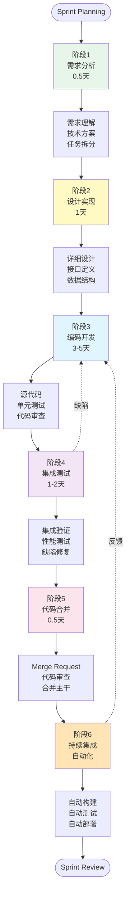
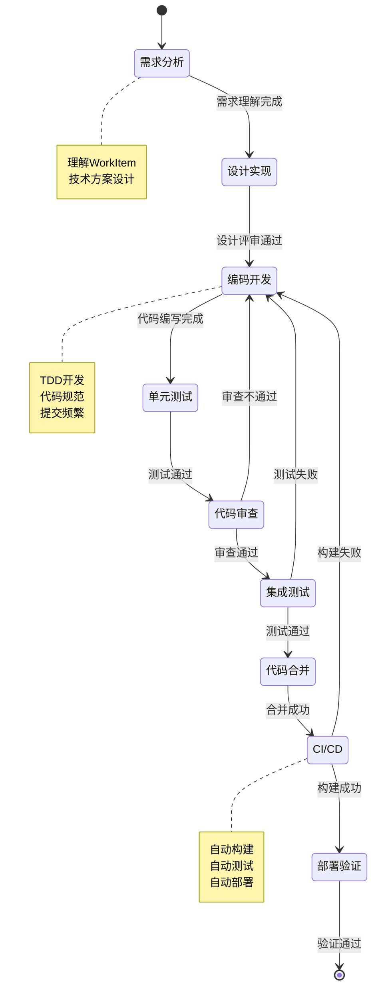
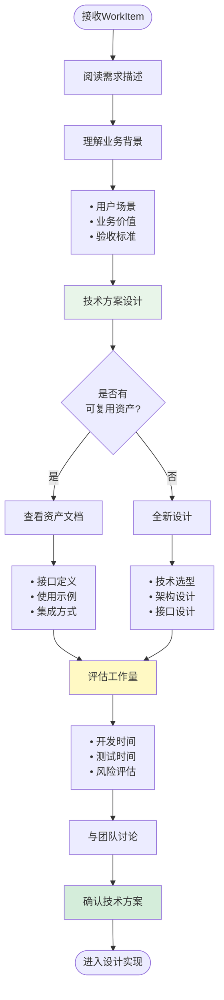
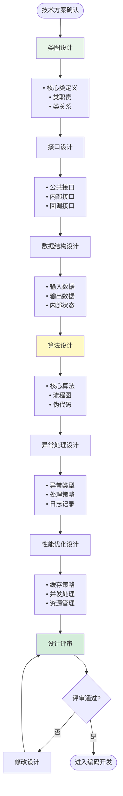
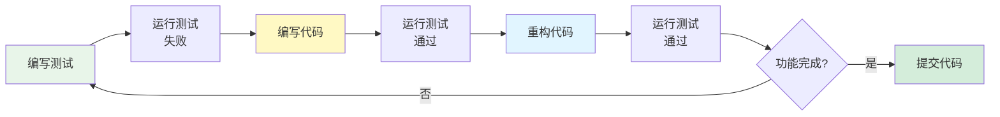
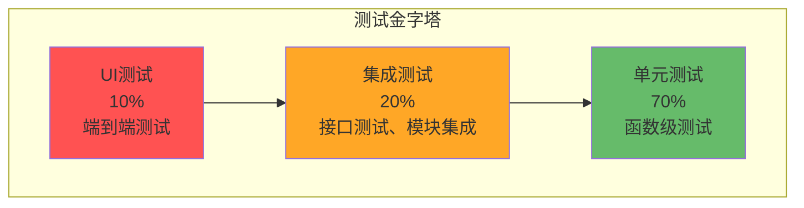
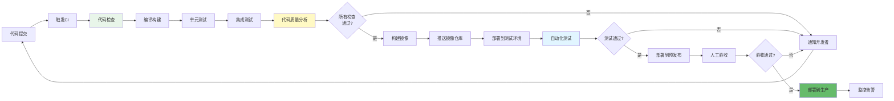
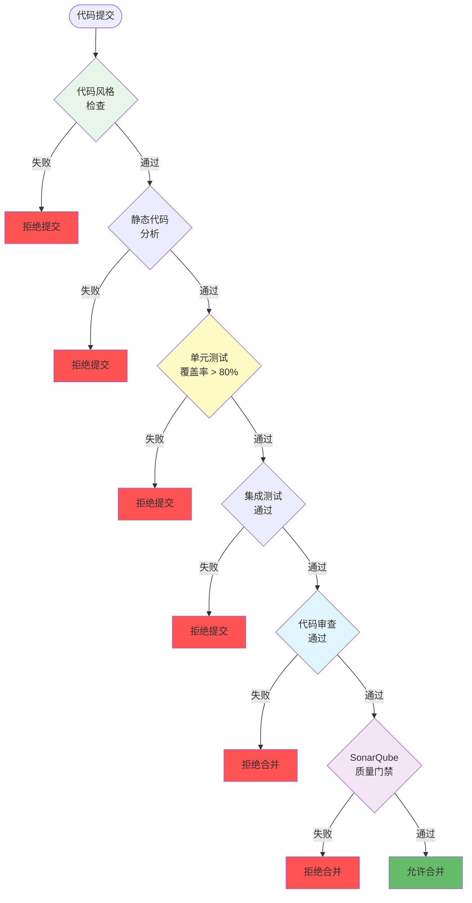
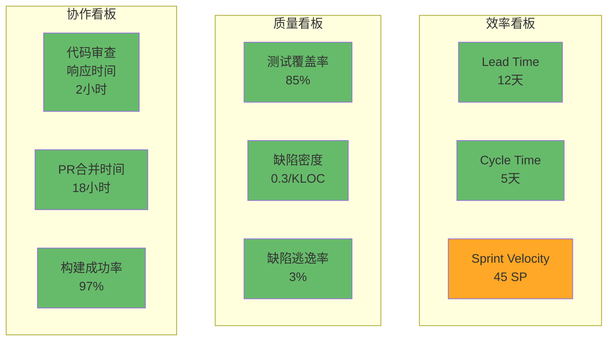

# 产品研发流 - Product Development Stream

> **视角**: 开发工程师、测试工程师  
> **关注点**: 研发效率、代码质量、技术债、团队协作

---

## 📋 目录

1. [研发流概述](#一研发流概述)
2. [研发流全景图](#二研发流全景图)
3. [核心阶段详解](#三核心阶段详解)
4. [CI/CD流程](#四cicd流程)
5. [质量保证体系](#五质量保证体系)
6. [度量指标](#六度量指标)

---

## 一、研发流概述

### 1.1 什么是产品研发流

产品研发流是从**需求理解**到**代码上线**的完整开发过程，关注**开发效率、代码质量和团队协作**。

```
产品研发流核心理念:
━━━━━━━━━━━━━━━━━━━━━━━━━━━━━━━━━━━━━━━━━━━━━━━━━

1. 敏捷开发 ⭐⭐⭐
   • 2周Sprint迭代
   • 增量交付
   • 快速反馈

2. 质量内建 ⭐⭐⭐
   • TDD开发
   • 代码审查
   • 自动化测试

3. 持续集成 ⭐⭐
   • 频繁提交
   • 自动构建
   • 快速反馈

4. DevOps文化 ⭐
   • 开发运维一体
   • 自动化部署
   • 监控告警
```

### 1.2 研发流与其他价值流的关系

```
┌─────────────────────────────────────────────────────────────┐
│                    三大价值流协同                            │
├─────────────────────────────────────────────────────────────┤
│                                                              │
│  产品资产流（产品经理视角）                                   │
│    ↓ 提供                                                    │
│  • 资产库                                                    │
│  • 复用模块                                                  │
│  • 接口文档                                                  │
│                                                              │
│  项目交付流（项目经理视角）                                   │
│    ↓ 提供                                                    │
│  • WorkItem池                                                │
│  • Sprint计划                                                │
│  • 交付目标                                                  │
│                                                              │
│  产品研发流（开发工程师视角）⭐                               │
│    ↓ 执行                                                    │
│  • 代码开发                                                  │
│  • 测试验证                                                  │
│  • 持续集成                                                  │
│    ↓ 产出                                                    │
│  • 可交付增量                                                │
│  • 测试报告                                                  │
│  • 技术文档                                                  │
│                                                              │
└─────────────────────────────────────────────────────────────┘
```

---

## 二、研发流全景图

### 2.1 端到端研发流程



### 2.2 开发工作流



---

## 三、核心阶段详解

### 3.1 阶段1: 需求分析

#### 活动流程



#### 关键活动

**活动1: 理解WorkItem**

```typescript
// WorkItem信息
interface WorkItemInfo {
  id: string
  code: string
  title: string
  type: WorkItemType
  
  // 需求描述
  description: string
  acceptanceCriteria: string[]
  
  // 关联信息
  moduleId?: string
  featureId?: string
  parentWorkItemId?: string
  
  // 资产信息
  reuseInfo?: {
    sourceModule: string
    reuseType: 'direct' | 'adapted' | 'new'
  }
  
  // 工作量
  estimatedHours: number
  storyPoints?: number
  
  // 分配信息
  assignee: string
  assignedTeamId: string
  assignedSprintId: string
}

// 开发者分析WorkItem
function analyzeWorkItem(workItem: WorkItemInfo) {
  // 1. 阅读需求描述
  const requirements = parseRequirements(workItem.description)
  
  // 2. 理解验收标准
  const acceptanceCriteria = workItem.acceptanceCriteria
  
  // 3. 检查是否有复用资产
  if (workItem.reuseInfo) {
    // 查看资产文档
    const asset = getAssetById(workItem.reuseInfo.sourceModule)
    const assetDoc = asset.documentation
    
    // 评估复用方式
    if (workItem.reuseInfo.reuseType === 'direct') {
      // 直接复用：查看集成文档
      return {
        approach: 'integrate',
        effort: 'low',
        tasks: ['集成配置', '接口适配', '测试验证']
      }
    } else if (workItem.reuseInfo.reuseType === 'adapted') {
      // 适配复用：查看源码，规划适配
      return {
        approach: 'adapt',
        effort: 'medium',
        tasks: ['Fork代码', '功能扩展', '测试验证', '文档更新']
      }
    }
  } else {
    // 全新开发
    return {
      approach: 'new',
      effort: 'high',
      tasks: ['详细设计', '编码实现', '单元测试', '集成测试', '文档编写']
    }
  }
}
```

**活动2: 技术方案设计**

```yaml
技术方案模板:

  WorkItem: TASK-2026-001 - 城市路口决策模块开发
  
  需求概述:
    实现城市路口通行决策功能，支持T字路口、十字路口、环岛等场景
  
  技术方案:
    1. 架构设计
       - 输入: 环境感知结果、高精地图、车辆状态
       - 处理: 路口类型识别 → 交通规则分析 → 决策生成
       - 输出: 通行决策（通过/等待/减速）、轨迹规划参考
    
    2. 技术选型
       - 开发语言: C++17
       - 框架: ROS2
       - 深度学习: TensorRT
       - 测试框架: Google Test
    
    3. 接口设计
       ```cpp
       class IntersectionDecisionModule {
       public:
         // 初始化
         bool initialize(const Config& config);
         
         // 决策接口
         DecisionResult makeDecision(
           const PerceptionResult& perception,
           const HDMap& map,
           const VehicleState& state
         );
         
         // 回调注册
         void registerCallback(DecisionCallback callback);
       };
       ```
    
    4. 数据结构
       ```cpp
       struct DecisionResult {
         DecisionType type;      // PASS, WAIT, SLOW_DOWN
         float confidence;       // 0.0-1.0
         Trajectory reference;   // 参考轨迹
         std::string reason;     // 决策原因
       };
       ```
    
    5. 性能指标
       - 决策延迟: < 100ms
       - 准确率: > 95%
       - CPU占用: < 30%
       - 内存占用: < 512MB
  
  工作量估算:
    - 详细设计: 8小时
    - 编码实现: 40小时
    - 单元测试: 16小时
    - 集成测试: 8小时
    - 文档编写: 8小时
    总计: 80小时 (10人天)
  
  风险评估:
    - 高风险: 复杂路口场景识别准确率
    - 中风险: 实时性能优化
    - 低风险: 接口集成
  
  依赖关系:
    - 依赖: 感知融合模块 v3.0（已完成）
    - 依赖: 高精地图服务 v2.1（已完成）
```

---

### 3.2 阶段2: 设计实现

#### 详细设计



#### 设计文档示例

```cpp
/**
 * @file intersection_decision_module.h
 * @brief 城市路口决策模块
 * @author 张三
 * @date 2026-01-10
 */

#pragma once

#include <memory>
#include <functional>
#include "perception/perception_result.h"
#include "map/hd_map.h"
#include "vehicle/vehicle_state.h"

namespace decision {

/**
 * @brief 决策类型
 */
enum class DecisionType {
  PASS,        // 通过
  WAIT,        // 等待
  SLOW_DOWN    // 减速
};

/**
 * @brief 决策结果
 */
struct DecisionResult {
  DecisionType type;           // 决策类型
  float confidence;            // 置信度 [0.0, 1.0]
  Trajectory reference;        // 参考轨迹
  std::string reason;          // 决策原因
  uint64_t timestamp_us;       // 时间戳（微秒）
};

/**
 * @brief 决策回调函数
 */
using DecisionCallback = std::function<void(const DecisionResult&)>;

/**
 * @brief 路口决策模块
 * 
 * 功能:
 *  - 识别路口类型（T字路口、十字路口、环岛）
 *  - 分析交通信号灯状态
 *  - 预测其他车辆意图
 *  - 生成通行决策
 * 
 * 性能指标:
 *  - 决策延迟: < 100ms
 *  - 准确率: > 95%
 *  - CPU占用: < 30%
 */
class IntersectionDecisionModule {
 public:
  /**
   * @brief 构造函数
   */
  IntersectionDecisionModule();
  
  /**
   * @brief 析构函数
   */
  ~IntersectionDecisionModule();
  
  /**
   * @brief 初始化模块
   * @param config 配置参数
   * @return true 初始化成功, false 初始化失败
   */
  bool initialize(const Config& config);
  
  /**
   * @brief 生成决策
   * @param perception 感知结果
   * @param map 高精地图
   * @param state 车辆状态
   * @return 决策结果
   */
  DecisionResult makeDecision(
    const perception::PerceptionResult& perception,
    const map::HDMap& map,
    const vehicle::VehicleState& state
  );
  
  /**
   * @brief 注册决策回调
   * @param callback 回调函数
   */
  void registerCallback(DecisionCallback callback);
  
 private:
  /**
   * @brief 识别路口类型
   */
  IntersectionType identifyIntersectionType(
    const map::HDMap& map,
    const vehicle::VehicleState& state
  );
  
  /**
   * @brief 分析交通信号灯
   */
  TrafficLightState analyzeTrafficLight(
    const perception::PerceptionResult& perception
  );
  
  /**
   * @brief 预测其他车辆意图
   */
  std::vector<VehicleIntent> predictVehicleIntents(
    const perception::PerceptionResult& perception
  );
  
  /**
   * @brief 生成决策
   */
  DecisionResult generateDecision(
    IntersectionType type,
    TrafficLightState light,
    const std::vector<VehicleIntent>& intents
  );
  
 private:
  class Impl;
  std::unique_ptr<Impl> impl_;  // PIMPL模式
};

}  // namespace decision
```

---

### 3.3 阶段3: 编码开发

#### TDD开发流程



#### 开发规范

```yaml
代码规范:

  1. 命名规范
     - 类名: PascalCase (IntersectionDecisionModule)
     - 函数名: camelCase (makeDecision)
     - 变量名: snake_case (decision_result)
     - 常量名: UPPER_SNAKE_CASE (MAX_RETRY_COUNT)
  
  2. 注释规范
     - 文件头注释: 文件说明、作者、日期
     - 类注释: 类功能、使用示例
     - 函数注释: Doxygen格式
     - 复杂逻辑: 行内注释
  
  3. 代码风格
     - 缩进: 2空格
     - 行宽: 80字符
     - 大括号: K&R风格
     - 空行: 逻辑块之间空一行
  
  4. 错误处理
     - 使用异常处理关键错误
     - 返回错误码处理一般错误
     - 日志记录所有错误
     - 不吞噬异常
  
  5. 性能优化
     - 避免不必要的拷贝（使用引用、移动语义）
     - 合理使用缓存
     - 避免过早优化
     - 性能关键路径优化

提交规范:

  1. 提交频率
     - 每完成一个小功能就提交
     - 每天至少提交一次
     - 下班前必须提交
  
  2. 提交信息格式
     ```
     <type>(<scope>): <subject>
     
     <body>
     
     <footer>
     ```
     
     类型(type):
       - feat: 新功能
       - fix: Bug修复
       - docs: 文档更新
       - style: 代码格式调整
       - refactor: 重构
       - test: 测试相关
       - chore: 构建/工具相关
     
     示例:
       feat(decision): 实现路口类型识别功能
       
       - 支持T字路口识别
       - 支持十字路口识别
       - 支持环岛识别
       
       Closes #123
  
  3. 代码审查
     - 提交前自我审查
     - 创建Merge Request
     - 至少1人审查通过
     - 通过CI检查
```

---

### 3.4 阶段4: 集成测试

#### 测试金字塔



#### 测试策略

```yaml
测试策略:

  1. 单元测试（70%）
     工具: Google Test
     覆盖率: > 80%
     
     测试内容:
       - 每个公共函数
       - 边界条件
       - 异常情况
       - 性能测试
     
     示例:
       ```cpp
       TEST(IntersectionDecisionModuleTest, IdentifyTIntersection) {
         // Arrange
         IntersectionDecisionModule module;
         module.initialize(config);
         HDMap map = createTIntersectionMap();
         VehicleState state = createVehicleState();
         
         // Act
         auto type = module.identifyIntersectionType(map, state);
         
         // Assert
         EXPECT_EQ(type, IntersectionType::T_INTERSECTION);
       }
       ```
  
  2. 集成测试（20%）
     工具: ROS2 Test Framework
     
     测试内容:
       - 模块间接口
       - 数据流
       - 异常传播
       - 性能指标
     
     场景:
       - 正常场景: 各种路口类型
       - 异常场景: 传感器故障、地图缺失
       - 边界场景: 复杂路口、遮挡情况
  
  3. 端到端测试（10%）
     工具: CARLA仿真器
     
     测试内容:
       - 完整功能流程
       - 用户场景
       - 系统稳定性
     
     场景:
       - 城市路口通行
       - 交通信号灯识别
       - 其他车辆避让

性能测试:

  1. 延迟测试
     指标: 决策延迟 < 100ms
     方法: 高频调用，统计P50/P95/P99
  
  2. 吞吐量测试
     指标: > 10 decisions/second
     方法: 并发调用，统计TPS
  
  3. 稳定性测试
     指标: 7x24小时无崩溃
     方法: 长时间运行，监控内存泄漏
  
  4. 压力测试
     指标: CPU < 30%, Memory < 512MB
     方法: 极限场景，监控资源占用
```

---

## 四、CI/CD流程

### 4.1 CI/CD全景图



### 4.2 CI配置示例

```yaml
# .gitlab-ci.yml

stages:
  - check
  - build
  - test
  - quality
  - package
  - deploy

variables:
  DOCKER_REGISTRY: "registry.example.com"
  PROJECT_NAME: "intersection-decision"

# 代码检查
code-check:
  stage: check
  script:
    - echo "Running code style check..."
    - cpplint --recursive src/
    - echo "Running static analysis..."
    - cppcheck --enable=all src/
  only:
    - merge_requests
    - main

# 编译构建
build:
  stage: build
  script:
    - echo "Building project..."
    - mkdir build && cd build
    - cmake ..
    - make -j$(nproc)
  artifacts:
    paths:
      - build/
    expire_in: 1 hour
  only:
    - merge_requests
    - main

# 单元测试
unit-test:
  stage: test
  dependencies:
    - build
  script:
    - echo "Running unit tests..."
    - cd build
    - ctest --output-on-failure
    - gcovr -r .. --html --html-details -o coverage.html
  coverage: '/lines: \d+\.\d+%/'
  artifacts:
    paths:
      - build/coverage.html
    reports:
      junit: build/test-results.xml
  only:
    - merge_requests
    - main

# 集成测试
integration-test:
  stage: test
  dependencies:
    - build
  script:
    - echo "Running integration tests..."
    - ./scripts/run_integration_tests.sh
  only:
    - merge_requests
    - main

# 代码质量分析
sonarqube:
  stage: quality
  script:
    - echo "Running SonarQube analysis..."
    - sonar-scanner \
        -Dsonar.projectKey=${PROJECT_NAME} \
        -Dsonar.sources=src/ \
        -Dsonar.host.url=${SONAR_URL} \
        -Dsonar.login=${SONAR_TOKEN}
  only:
    - main

# 构建Docker镜像
docker-build:
  stage: package
  dependencies:
    - build
  script:
    - echo "Building Docker image..."
    - docker build -t ${DOCKER_REGISTRY}/${PROJECT_NAME}:${CI_COMMIT_SHA} .
    - docker tag ${DOCKER_REGISTRY}/${PROJECT_NAME}:${CI_COMMIT_SHA} \
                  ${DOCKER_REGISTRY}/${PROJECT_NAME}:latest
    - docker push ${DOCKER_REGISTRY}/${PROJECT_NAME}:${CI_COMMIT_SHA}
    - docker push ${DOCKER_REGISTRY}/${PROJECT_NAME}:latest
  only:
    - main

# 部署到测试环境
deploy-test:
  stage: deploy
  script:
    - echo "Deploying to test environment..."
    - kubectl set image deployment/${PROJECT_NAME} \
        ${PROJECT_NAME}=${DOCKER_REGISTRY}/${PROJECT_NAME}:${CI_COMMIT_SHA} \
        -n test
    - kubectl rollout status deployment/${PROJECT_NAME} -n test
  environment:
    name: test
    url: https://test.example.com
  only:
    - main

# 部署到生产环境（手动触发）
deploy-prod:
  stage: deploy
  script:
    - echo "Deploying to production..."
    - kubectl set image deployment/${PROJECT_NAME} \
        ${PROJECT_NAME}=${DOCKER_REGISTRY}/${PROJECT_NAME}:${CI_COMMIT_SHA} \
        -n prod
    - kubectl rollout status deployment/${PROJECT_NAME} -n prod
  environment:
    name: production
    url: https://prod.example.com
  when: manual
  only:
    - main
```

---

## 五、质量保证体系

### 5.1 质量门禁



### 5.2 代码质量指标

```yaml
代码质量指标:

  1. 代码覆盖率
     - 行覆盖率: ≥ 80%
     - 分支覆盖率: ≥ 75%
     - 函数覆盖率: ≥ 80%
     工具: gcovr, lcov
  
  2. 代码复杂度
     - 圈复杂度: ≤ 15
     - 认知复杂度: ≤ 20
     - 函数行数: ≤ 50
     工具: lizard, SonarQube
  
  3. 代码重复率
     - 重复代码率: < 3%
     - 重复块大小: < 10行
     工具: SonarQube
  
  4. 代码规范
     - 命名规范: 100%
     - 注释完整性: ≥ 90%
     - 代码风格: 0违规
     工具: cpplint, clang-format
  
  5. 代码缺陷
     - 严重缺陷: 0
     - 一般缺陷: < 5/KLOC
     - 代码异味: < 10
     工具: SonarQube, cppcheck
  
  6. 技术债
     - 技术债比例: < 5%
     - 技术债偿还: 每Sprint 20%
     工具: SonarQube

SonarQube质量门禁:

  条件:
    - 新代码覆盖率: ≥ 80%
    - 新代码重复率: < 3%
    - 可维护性评级: ≥ A
    - 可靠性评级: ≥ A
    - 安全性评级: ≥ A
    - 严重Bug: 0
    - 严重漏洞: 0
  
  结果:
    - 通过: 允许合并
    - 失败: 拒绝合并，需要修复
```

---

## 六、度量指标

### 6.1 研发效率指标

```yaml
研发效率指标:

  1. Lead Time（前置时间）
     定义: WorkItem创建到完成的时间
     目标: < 2周
     计算: 完成时间 - 创建时间
     
     分解:
       - 等待时间: 创建到开始
       - 开发时间: 开始到完成
       - 阻塞时间: 因依赖/问题导致的等待
  
  2. Cycle Time（周期时间）
     定义: WorkItem开始到完成的时间
     目标: < 1周
     计算: 完成时间 - 开始时间
     
     分解:
       - 编码时间
       - 测试时间
       - 审查时间
       - 修复时间
  
  3. Throughput（吞吐量）
     定义: 单位时间完成的WorkItem数
     目标: 稳定或上升
     计算: 完成WorkItem数 / 时间周期
  
  4. Sprint Velocity（团队速率）
     定义: 每个Sprint完成的Story Points
     目标: 稳定在一定范围
     计算: Σ完成WorkItem的Story Points
  
  5. 代码提交频率
     定义: 每天的代码提交次数
     目标: ≥ 3次/人/天
     计算: 提交次数 / 开发人数 / 天数
  
  6. 构建成功率
     定义: CI构建成功的比例
     目标: ≥ 95%
     计算: 成功构建次数 / 总构建次数 × 100%
  
  7. 部署频率
     定义: 部署到生产环境的频率
     目标: 每周 ≥ 1次
     计算: 部署次数 / 周数

代码质量指标:

  1. 缺陷密度
     定义: 每千行代码的缺陷数
     目标: < 0.5/KLOC
     计算: 缺陷数 / (代码行数 / 1000)
  
  2. 缺陷逃逸率
     定义: 生产环境发现的缺陷比例
     目标: < 5%
     计算: 生产缺陷数 / 总缺陷数 × 100%
  
  3. 测试覆盖率
     定义: 测试代码覆盖的比例
     目标: ≥ 80%
     计算: 覆盖代码行数 / 总代码行数 × 100%
  
  4. 代码审查覆盖率
     定义: 经过审查的代码比例
     目标: 100%
     计算: 审查代码行数 / 新增代码行数 × 100%
  
  5. 自动化测试比例
     定义: 自动化测试占总测试的比例
     目标: ≥ 90%
     计算: 自动化测试用例数 / 总测试用例数 × 100%
  
  6. 平均修复时间（MTTR）
     定义: 缺陷从发现到修复的平均时间
     目标: < 1天（P0/P1）
     计算: Σ修复时间 / 缺陷数

团队协作指标:

  1. 代码审查响应时间
     定义: 从提交审查到首次反馈的时间
     目标: < 4小时
     计算: 首次反馈时间 - 提交时间
  
  2. Pull Request合并时间
     定义: 从创建PR到合并的时间
     目标: < 1天
     计算: 合并时间 - 创建时间
  
  3. 团队沟通频率
     定义: 团队成员之间的沟通次数
     目标: 每天 ≥ 3次
     工具: Slack, 会议记录
  
  4. 知识分享次数
     定义: 技术分享、代码Review的次数
     目标: 每周 ≥ 2次
     记录: 分享会议、Review记录
```

### 6.2 度量看板



---

## 七、最佳实践

### 7.1 开发最佳实践

```yaml
最佳实践:

  1. TDD开发
     - 先写测试，后写代码
     - 小步快跑，频繁提交
     - 持续重构，保持代码整洁
  
  2. 代码审查
     - 每个PR必须审查
     - 审查关注点：逻辑、性能、安全、可维护性
     - 及时反馈，建设性意见
     - 审查通过才能合并
  
  3. 持续集成
     - 频繁提交代码（每天≥3次）
     - 每次提交触发CI
     - 快速反馈（< 10分钟）
     - 构建失败立即修复
  
  4. 自动化测试
     - 单元测试覆盖率 > 80%
     - 集成测试覆盖关键路径
     - 端到端测试覆盖核心场景
     - 性能测试定期执行
  
  5. 技术债管理
     - 识别技术债，记录到Backlog
     - 每Sprint预留20%时间偿还技术债
     - 优先偿还高风险技术债
     - 定期技术债Review
  
  6. 文档编写
     - 代码即文档（清晰的命名、注释）
     - API文档自动生成（Doxygen）
     - 架构文档及时更新
     - 使用指南、故障排查文档
  
  7. 性能优化
     - 性能测试先行
     - 找到瓶颈再优化
     - 优化后验证效果
     - 避免过早优化
  
  8. 安全编码
     - 输入验证
     - 输出编码
     - 错误处理
     - 日志脱敏
     - 依赖安全扫描
```

---

## 八、总结

### 产品研发流核心价值

```
✓ 敏捷开发 ⭐⭐⭐
  • 2周Sprint迭代
  • 增量交付
  • 快速反馈

✓ 质量内建 ⭐⭐⭐
  • TDD开发
  • 代码审查100%
  • 自动化测试 > 90%

✓ 持续集成 ⭐⭐
  • 频繁提交
  • 自动构建
  • 快速反馈 < 10分钟

✓ DevOps文化 ⭐
  • 开发运维一体
  • 自动化部署
  • 监控告警
```

---

**文档维护**:
- 创建: 2026-01-10
- 版本: 最新
- 负责人: 研发效能团队

