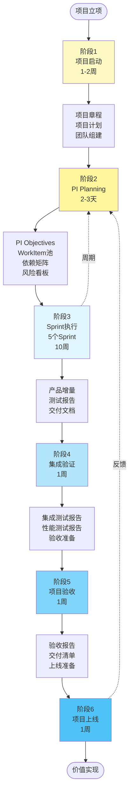
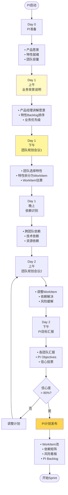
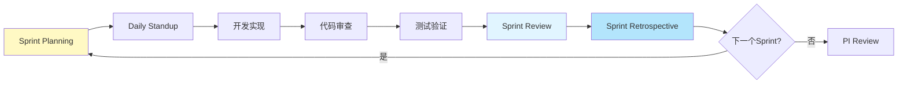
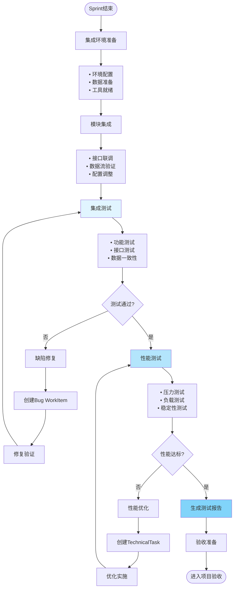
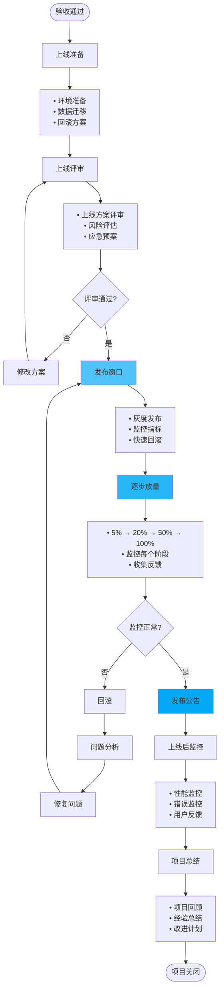

# 项目交付流 v3.0 - Project Delivery Stream

> **文档版本**: v3.0  
> **创建日期**: 2026-01-10  
> **视角**: 项目经理、团队Lead  
> **关注点**: 交付进度、质量、风险、干系人满意度

---

## 📋 核心概要

### 项目交付流定位

项目交付流是从**项目启动**到**项目上线**的完整过程，关注**多团队协作、进度管理、风险控制和交付质量**。

```
项目交付流核心理念:
━━━━━━━━━━━━━━━━━━━━━━━━━━━━━━━━━━━━━━━━━━━━━━━━━

1. 整车-领域两层项目 ⭐⭐⭐
   • VehicleProject: 整车项目（端到端交付）
   • DomainProject: 领域项目（专业领域）
   • PI Planning协同

2. PI驱动交付 ⭐⭐⭐
   • 8-12周PI周期
   • PI Objectives明确
   • 增量交付

3. 多团队协同 ⭐⭐
   • Team自组织
   • 依赖管理
   • 集成验证

4. 风险前置管理 ⭐
   • 风险识别
   • 缓解计划
   • 持续跟踪
```

---

## 一、项目交付流全景图

### 1.1 端到端交付流程



### 1.2 项目层次模型

```
┌───────────────────────────────────────────────────────────────────┐
│                     项目层次模型 v3.0                              │
├───────────────────────────────────────────────────────────────────┤
│                                                                    │
│  Level 1: 整车项目（Vehicle Project）                              │
│  ┌────────────────────────────────────────────────────────────┐ │
│  │ • 车型级项目                                                │ │
│  │ • 端到端交付                                                │ │
│  │ • 多领域协同                                                │ │
│  │ 示例: 某车型智能驾驶系统                                     │ │
│  └────────────────────────────────────────────────────────────┘ │
│                           ↓ 1:N                                   │
│  Level 2: 领域项目（Domain Project）                               │
│  ┌────────────────────────────────────────────────────────────┐ │
│  │ • 专业领域项目                                              │ │
│  │ • 单一团队或团队群                                          │ │
│  │ • 特性级交付                                                │ │
│  │ 示例: NOA领航项目、座舱交互项目                             │ │
│  └────────────────────────────────────────────────────────────┘ │
│                           ↓ 1:N                                   │
│  Level 3: PI Planning                                              │
│  ┌────────────────────────────────────────────────────────────┐ │
│  │ • 8-12周计划                                                │ │
│  │ • 工作项分配                                                │ │
│  │ • 团队对齐                                                  │ │
│  │ 示例: PI-2026-Q1                                            │ │
│  └────────────────────────────────────────────────────────────┘ │
│                           ↓ 1:N                                   │
│  Level 4: Sprint                                                   │
│  ┌────────────────────────────────────────────────────────────┐ │
│  │ • 2-4周迭代                                                 │ │
│  │ • 增量交付                                                  │ │
│  │ • 团队执行                                                  │ │
│  │ 示例: Sprint-1, Sprint-2                                    │ │
│  └────────────────────────────────────────────────────────────┘ │
│                           ↓ 1:N                                   │
│  Level 5: WorkItem（8种类型）⭐                                    │
│  ┌────────────────────────────────────────────────────────────┐ │
│  │ • Task、ModuleRequirement、Bug等                            │ │
│  │ • 团队成员执行                                              │ │
│  │ • 最小交付单元                                              │ │
│  └────────────────────────────────────────────────────────────┘ │
│                                                                    │
└───────────────────────────────────────────────────────────────────┘
```

---

## 二、项目交付流各阶段

### 2.1 阶段1: 项目启动

#### 关键活动

```yaml
活动1: 项目立项
  负责人: 项目经理
  输入:
    - 整车需求
    - 产品版本计划
    - 资源预算
  
  输出:
    - 项目章程
    - 项目范围说明书
    - 项目目标（SMART）
  
  页面: /projects/vehicle/create

活动2: 领域项目分解
  负责人: 项目经理、领域架构师
  过程:
    1. 识别涉及的专业领域
       - 智能驾驶
       - 智能座舱
       - 动力系统
       - ...
    
    2. 创建领域项目
       - 定义项目范围
       - 分配负责人
       - 估算资源
    
    3. 建立项目关系
       - VehicleProject 1:N DomainProject
       - 依赖关系识别
  
  输出:
    - 领域项目列表
    - 项目关系图
  
  页面: /projects/domain/create

活动3: 团队组建
  负责人: 项目经理、HR
  过程:
    1. 识别所需技能
    2. 分配团队成员
    3. 明确角色职责
    4. 团队启动会
  
  输出:
    - 团队成员列表
    - RACI矩阵
  
  页面: /projects/{id}/team

活动4: 制定项目计划
  负责人: 项目经理
  内容:
    - 项目里程碑
    - 阶段划分
    - PI规划
    - 交付计划
    - 风险管理计划
    - 沟通管理计划
  
  输出:
    - 项目管理计划
    - 项目时间线
  
  页面: /projects/{id}/plan
```

#### WorkItem类型

此阶段通常不创建WorkItem，主要是项目管理活动。

---

### 2.2 阶段2: PI Planning ⭐⭐⭐

#### 关键活动流程



#### PI Planning产出物

```typescript
// PI Planning产出物
interface PIPlanningOutput {
  // PI基本信息
  piId: string
  piName: string               // "PI-2026-Q1"
  startDate: Date
  endDate: Date
  duration: number             // 10周
  
  // PI Objectives
  objectives: {
    id: string
    vehicleProjectId: string
    domainProjectId: string
    description: string
    businessValue: number      // 1-10
    confidence: number         // 信心度 0-100%
  }[]
  
  // WorkItem池
  workItems: WorkItem[]        // ⭐ 统一的WorkItem模型
  
  // 团队迭代计划
  teamIterationPlans: {
    teamId: string
    teamName: string
    capacity: {
      totalStoryPoints: number
      buffer: number           // 预留容量 20%
      committed: number
    }
    sprints: {
      sprintId: string
      workItemIds: string[]
    }[]
  }[]
  
  // 依赖矩阵
  dependencies: {
    id: string
    fromTeam: string
    toTeam: string
    fromWorkItem: string
    toWorkItem: string
    type: 'technical' | 'resource' | 'schedule'
    status: 'identified' | 'resolved' | 'blocked'
    mitigation: string
  }[]
  
  // 风险看板
  risks: {
    id: string
    description: string
    probability: number        // 概率 0-100%
    impact: number             // 影响 1-5
    riskScore: number          // probability × impact
    mitigation: string
    owner: string
    status: 'open' | 'mitigating' | 'closed'
  }[]
  
  // 整体信心度
  overallConfidence: number    // 所有团队平均信心度
}
```

#### 平台功能映射

| 活动 | 功能模块 | 页面/操作 | 数据输入 | 数据输出 |
|------|---------|----------|---------|---------|
| PI准备 | F008-PI Planning | `/pi-planning/{id}/preparation` | 特性Backlog、团队容量 | 准备就绪清单 |
| 业务背景说明 | F008-PI Planning | `/pi-planning/{id}/vision` | 产品愿景、特性列表 | 业务背景文档 |
| 团队规划 | F008-PI Planning | `/pi-planning/{id}/team-planning` | 特性列表 | WorkItem池 |
| 依赖识别 | F008-PI Planning | `/pi-planning/{id}/dependencies` | WorkItem列表、团队关系 | 依赖矩阵 |
| PI目标汇报 | F008-PI Planning | `/pi-planning/{id}/objectives` | 团队计划 | PI Objectives |
| 信心投票 | F008-PI Planning | `/pi-planning/{id}/confidence-vote` | PI计划 | 信心度评分 |
| PI计划发布 | F008-PI Planning | `/pi-planning/{id}/publish` | 所有产出物 | PI Backlog |

---

### 2.3 阶段3: Sprint执行

#### Sprint流程



#### Sprint Planning - WorkItem分解 ⭐⭐⭐

```typescript
// Sprint Planning: 从PI Backlog选择WorkItem并分解
function sprintPlanning(
  team: Team,
  piBacklog: WorkItem[],
  sprint: Sprint
): WorkItem[] {
  // 1. 计算团队容量
  const capacity = calculateTeamCapacity(team, sprint)
  
  // 2. 从PI Backlog选择WorkItem
  const selectedWorkItems = selectWorkItems(
    piBacklog,
    capacity,
    team.id
  )
  
  // 3. 分解WorkItem为子WorkItem（Task）
  const tasks: WorkItem[] = []
  
  selectedWorkItems.forEach(workItem => {
    if (workItem.type === 'module_requirement') {
      // ModuleRequirement分解为多个Task
      const decomposedTasks = decomposeModuleRequirement(workItem)
      tasks.push(...decomposedTasks)
    } else if (workItem.type === 'bug') {
      // Bug可以直接执行，或分解为子Task
      if (workItem.estimatedHours > 8) {
        const bugTasks = decomposeBug(workItem)
        tasks.push(...bugTasks)
      } else {
        // 小Bug直接执行，不分解
        tasks.push(workItem)
      }
    } else if (workItem.type === 'tech_debt') {
      // 技术债分解为TechnicalTask
      const techTasks = decomposeTechDebt(workItem)
      tasks.push(...techTasks)
    }
    
    // 更新父WorkItem
    workItem.childWorkItemIds = tasks
      .filter(t => t.parentWorkItemId === workItem.id)
      .map(t => t.id)
    
    workItem.assignedSprintId = sprint.id
  })
  
  // 4. 任务分配给团队成员
  tasks.forEach(task => {
    if (task.type === 'task' || task.type === 'technical_task') {
      // Task必须分配给具体成员 ⭐
      task.assignee = assignTaskToMember(task, team)
    }
  })
  
  return [...selectedWorkItems, ...tasks]
}

// 示例: ModuleRequirement分解
function decomposeModuleRequirement(
  moduleReq: WorkItem
): WorkItem[] {
  return [
    {
      id: generateId(),
      code: 'TASK-2026-001',
      title: `${moduleReq.title} - 详细设计`,
      type: 'task',
      parentWorkItemId: moduleReq.id,
      moduleId: moduleReq.moduleId,
      assignedTeamId: moduleReq.assignedTeamId,
      assignedSprintId: moduleReq.assignedSprintId,
      assignee: 'developer_zhang',
      estimatedHours: 8,
      storyPoints: 2,
      status: 'pending',
      priority: 'high'
    },
    {
      id: generateId(),
      code: 'TASK-2026-002',
      title: `${moduleReq.title} - 编码实现`,
      type: 'task',
      parentWorkItemId: moduleReq.id,
      moduleId: moduleReq.moduleId,
      assignedTeamId: moduleReq.assignedTeamId,
      assignedSprintId: moduleReq.assignedSprintId,
      assignee: 'developer_zhang',
      estimatedHours: 40,
      storyPoints: 13,
      status: 'pending',
      priority: 'high'
    },
    {
      id: generateId(),
      code: 'TEST-2026-001',
      title: `${moduleReq.title} - 单元测试`,
      type: 'test_task',
      parentWorkItemId: moduleReq.id,
      moduleId: moduleReq.moduleId,
      assignedTeamId: moduleReq.assignedTeamId,
      assignedSprintId: moduleReq.assignedSprintId,
      assignee: 'developer_zhang',
      estimatedHours: 16,
      storyPoints: 5,
      status: 'pending',
      priority: 'medium'
    }
  ]
}
```

#### Sprint交付物

```yaml
Sprint交付物清单:

  技术交付物:
    - 源代码
      • Git仓库地址
      • Commit记录
      • 代码审查记录
    
    - 编译产物
      • 二进制包
      • 容器镜像
      • 部署包
    
    - 自动化测试
      • 单元测试（覆盖率 > 80%）
      • 集成测试
      • 端到端测试
  
  文档交付物:
    - 设计文档
      • 架构设计
      • 接口设计
      • 数据库设计
    
    - 用户文档
      • 用户手册
      • 配置指南
      • 故障排查
    
    - 开发文档
      • API文档
      • 代码注释
      • 开发指南
  
  测试交付物:
    - 测试用例
    - 测试报告
    - 缺陷列表
    - 性能测试报告
  
  Sprint Review产出:
    - 演示记录
    - 反馈收集
    - 改进建议
  
  Sprint Retrospective产出:
    - 回顾总结
    - 改进行动项
    - 下一个Sprint计划调整
```

---

### 2.4 阶段4: 集成验证

#### 集成测试流程



#### 集成测试WorkItem

```typescript
// 集成测试中的WorkItem
interface IntegrationTestWorkItem extends WorkItem {
  type: 'test_task' | 'bug' | 'technical_task'
  
  // 测试任务特有字段
  testType?: 'functional' | 'performance' | 'integration' | 'e2e'
  testScope?: string[]        // 测试范围
  testCases?: string[]        // 测试用例ID
  
  // Bug特有字段
  severity?: 'critical' | 'major' | 'minor' | 'trivial'
  foundInPhase?: 'dev' | 'integration' | 'uat' | 'production'
  
  // 技术任务特有字段
  optimizationTarget?: 'performance' | 'memory' | 'stability'
  baseline?: number           // 优化前基线
  target?: number             // 优化目标
}

// 创建集成测试Bug
function createIntegrationBug(
  defect: DefectInfo,
  sprint: Sprint
): WorkItem {
  return {
    id: generateId(),
    code: generateCode('BUG'),
    title: defect.title,
    type: 'bug', // ⭐ Bug是WorkItem的一种类型
    
    description: defect.description,
    severity: defect.severity,
    foundInPhase: 'integration',
    
    // 关联信息
    moduleId: defect.moduleId,
    parentWorkItemId: null, // Bug通常是顶层WorkItem
    
    // 分配
    assignedTeamId: getTeamByModule(defect.moduleId),
    assignedSprintId: sprint.id,
    assignee: null, // Sprint Planning时分配
    
    // 工作量
    estimatedHours: estimateBugFixEffort(defect.severity),
    storyPoints: estimateBugStoryPoints(defect.severity),
    
    // 优先级（严重Bug优先级高）
    priority: defect.severity === 'critical' ? 'critical' : 'high',
    status: 'pending',
    progress: 0,
    
    createdAt: new Date(),
    createdBy: 'qa_engineer'
  }
}
```

---

### 2.5 阶段5: 项目验收

#### 验收流程

```yaml
验收标准:

  功能验收:
    标准:
      - 所有PI Objectives完成 ≥ 85%
      - 所有WorkItem状态为Completed或Closed
      - 关键功能通过验收测试
    
    验收方法:
      - 功能演示
      - 用户验收测试（UAT）
      - 验收测试报告
    
    页面: /projects/{id}/acceptance/functional

  质量验收:
    标准:
      - 代码质量评分 ≥ 85
      - 测试覆盖率 ≥ 80%
      - 严重缺陷数 = 0
      - 一般缺陷数 < 5
    
    验收方法:
      - 代码审查报告
      - 测试报告
      - 静态代码分析
    
    页面: /projects/{id}/acceptance/quality

  性能验收:
    标准:
      - 响应时间 ≤ 目标值
      - 吞吐量 ≥ 目标值
      - 资源占用 ≤ 限制值
      - 稳定性测试通过
    
    验收方法:
      - 性能测试报告
      - 压力测试报告
      - 长时间稳定性测试
    
    页面: /projects/{id}/acceptance/performance

  文档验收:
    标准:
      - 用户文档完整
      - 技术文档完整
      - 交接文档完整
    
    验收方法:
      - 文档清单检查
      - 文档质量评审
    
    页面: /projects/{id}/acceptance/documentation

验收流程:
  1. 提交验收申请
     负责人: 项目经理
     页面: /projects/{id}/acceptance/submit
  
  2. 验收准备
     - 整理交付物
     - 准备演示
     - 通知干系人
  
  3. 验收会议
     参与人:
       - 项目经理
       - 产品经理
       - 质量经理
       - 客户代表（如适用）
     
     议程:
       - 项目总结
       - 功能演示
       - 测试报告讲解
       - 问题讨论
  
  4. 验收决策
     结果:
       - 通过: 进入上线准备
       - 有条件通过: 整改后上线
       - 不通过: 继续开发迭代
  
  5. 验收报告
     内容:
       - 验收结论
       - 遗留问题
       - 改进建议
     
     页面: /projects/{id}/acceptance/report
```

---

### 2.6 阶段6: 项目上线

#### 上线流程



---

## 三、项目度量体系

### 3.1 项目度量指标

```yaml
进度度量:
  • PI Objectives完成率
    计算: 完成的Objectives数 / 总Objectives数 × 100%
    目标: ≥ 85%
  
  • Sprint Velocity（团队速率）
    计算: 每个Sprint完成的Story Points
    趋势: 稳定或上升
  
  • WorkItem完成率
    计算: 完成的WorkItem数 / 计划WorkItem数 × 100%
    目标: ≥ 90%
  
  • 按时交付率
    计算: 按时交付的里程碑数 / 总里程碑数 × 100%
    目标: ≥ 95%

质量度量:
  • 缺陷密度
    计算: 缺陷数 / 代码行数（KLOC）
    目标: < 0.5/KLOC
  
  • 缺陷逃逸率
    计算: 生产环境发现缺陷数 / 总缺陷数 × 100%
    目标: < 5%
  
  • 测试覆盖率
    计算: 测试代码行数 / 总代码行数 × 100%
    目标: ≥ 80%
  
  • 代码质量评分
    来源: SonarQube
    目标: ≥ A级

效率度量:
  • Lead Time
    计算: WorkItem完成时间 - WorkItem创建时间
    目标: < 2周
  
  • Cycle Time
    计算: WorkItem完成时间 - WorkItem开始时间
    目标: < 1周
  
  • 团队利用率
    计算: 实际工作时间 / 可用工作时间 × 100%
    目标: 75%-85%（预留Buffer）

风险度量:
  • 高风险项数量
    计算: 风险评分 ≥ 15的风险数
    目标: < 3
  
  • 风险解决率
    计算: 已解决风险数 / 总风险数 × 100%
    目标: ≥ 80%
  
  • 依赖阻塞天数
    计算: 因依赖导致的阻塞总天数
    目标: < 5天/PI
```

---

## 四、典型场景

### 场景1: 多团队协同交付整车项目

```yaml
场景:
  某车型智能驾驶系统交付，涉及3个领域项目、5个团队

项目结构:
  VehicleProject: 某车型智能驾驶系统
    ├─ DomainProject: NOA领航项目
    │   ├─ Team: 感知团队
    │   └─ Team: 规划团队
    ├─ DomainProject: LCC车道保持项目
    │   └─ Team: 车控团队
    └─ DomainProject: APA自动泊车项目
        ├─ Team: 泊车感知团队
        └─ Team: 泊车规划团队

PI Planning关键活动:
  1. 特性对齐
     - NOA新增城市路口决策
     - LCC性能优化
     - APA记忆泊车功能
  
  2. 依赖识别
     依赖1: NOA城市路口决策 → 感知团队提供城市场景感知能力
     依赖2: APA记忆泊车 → 规划团队提供轨迹回放接口
  
  3. 容量规划
     - 感知团队: 60 Story Points
     - 规划团队: 55 Story Points
     - 车控团队: 50 Story Points
     - 泊车感知团队: 45 Story Points
     - 泊车规划团队: 40 Story Points
  
  4. WorkItem分配
     - 总WorkItem数: 120
     - 自动分配基于模块责任
  
  5. PI Objectives
     Objective 1: NOA城市路口决策上线（业务价值: 9, 信心度: 75%）
     Objective 2: LCC性能提升20%（业务价值: 7, 信心度: 85%）
     Objective 3: APA记忆泊车Beta版（业务价值: 8, 信心度: 70%）

Sprint执行:
  Sprint-1: 基础框架开发
  Sprint-2: 核心功能实现
  Sprint-3: 功能集成
  Sprint-4: 测试优化
  Sprint-5: 验收准备

集成验证:
  Week 11: 模块集成、接口联调
  依赖解决: 感知团队延期2天，规划团队等待 → 风险缓解启动

项目验收:
  Objective完成率: 2/3 = 67% (Objective 3延期到下一PI)
  WorkItem完成率: 108/120 = 90%
  质量达标: ✓
  
  决策: 有条件通过（Objective 3功能作为可选功能）

项目上线:
  灰度发布: 5% → 20% → 50% → 100%
  监控正常: ✓
  用户反馈: 正面

项目总结:
  成功点:
    - 多团队协同流畅
    - 依赖管理有效
    - 质量达标
  
  改进点:
    - 功能估算偏乐观
    - 测试环境准备延迟
  
  下一PI计划:
    - 完成Objective 3
    - 性能进一步优化
```

---

## 五、总结

### 项目交付流核心价值

```
✓ PI驱动增量交付 ⭐⭐⭐
  • 8-12周PI周期
  • 可预测的交付节奏
  • 增量验证价值

✓ 多团队协同机制 ⭐⭐
  • 依赖可视化管理
  • 风险前置识别
  • 集成持续验证

✓ WorkItem统一管理 ⭐⭐⭐
  • 8种工作项类型
  • 层级分解机制
  • 端到端追溯

✓ 数据驱动决策 ⭐
  • 实时进度监控
  • 多维度度量
  • 持续改进
```

---

**文档维护**:
- 创建: 2026-01-10
- 版本: v3.0
- 负责人: 项目管理办公室（PMO）

**相关文档**:
- [00-VALUE_STREAM_OVERVIEW_V3.md](./00-VALUE_STREAM_OVERVIEW_V3.md)
- [01-PRODUCT_ASSET_STREAM_V3.md](./01-PRODUCT_ASSET_STREAM_V3.md)
- [02-PI_PLANNING_DESIGN_V3.md](../02-PI_PLANNING_DESIGN_V3.md)

