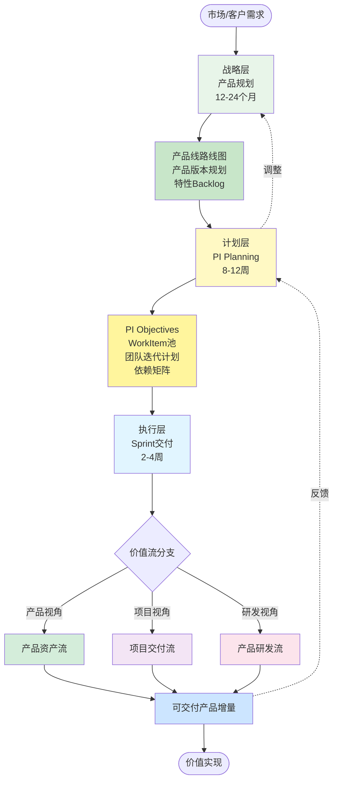
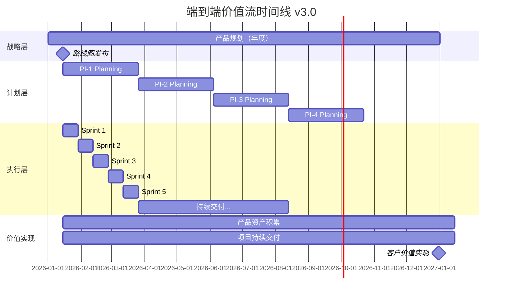
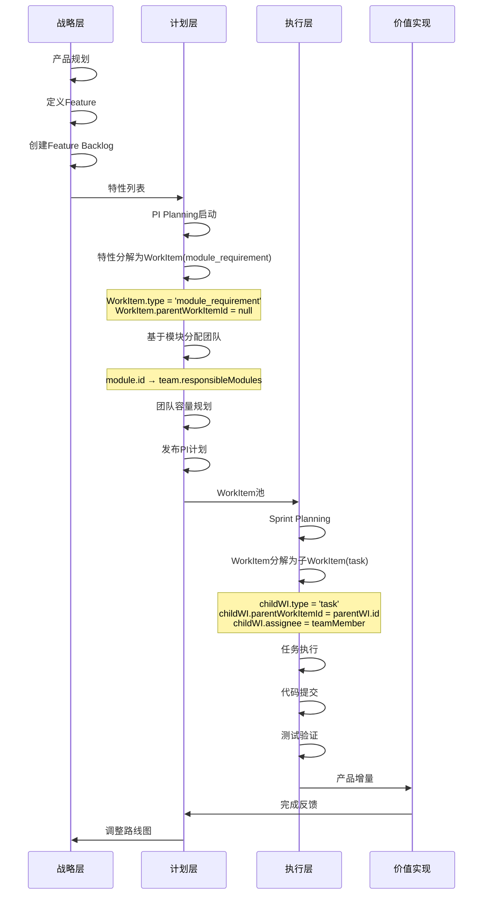
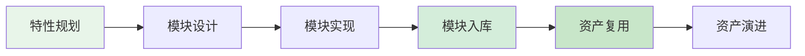
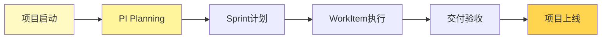
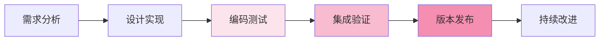
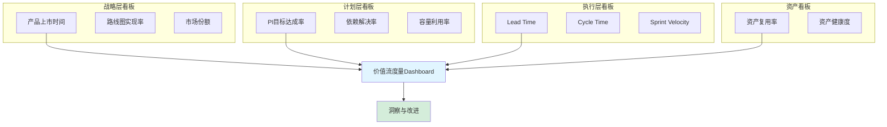
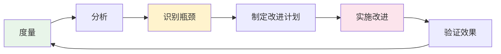

# Auto DevOps平台 - 端到端研发价值流 v3.0

> **文档版本**: v3.0  
> **创建日期**: 2026-01-10  
> **设计理念**: 基于WorkItem统一模型的端到端价值流设计  
> **核心变更**: WorkItem是基础抽象模型，Task是其类型之一

---

## 📋 目录

1. [价值流设计理念](#一价值流设计理念)
2. [价值流全景图](#二价值流全景图)
3. [价值流层次模型](#三价值流层次模型)
4. [三大核心价值流](#四三大核心价值流)
5. [价值流文档导航](#五价值流文档导航)
6. [价值流度量体系](#六价值流度量体系)

---

## 一、价值流设计理念

### 1.1 v3.0 核心设计原则

```
╔══════════════════════════════════════════════════════════════════╗
║                                                                  ║
║              价值流设计原则 v3.0                                  ║
║                                                                  ║
╚══════════════════════════════════════════════════════════════════╝

1. 以价值交付为中心 ⭐⭐⭐
   • 从客户需求到产品交付的端到端流程
   • 每个阶段都创造可度量的价值
   • 最小化等待时间和非增值活动

2. 资产驱动开发 ⭐⭐⭐
   • 产品线 → 产品 → 版本 → 特性 → 模块
   • 资产复用优先于重复开发
   • 资产健康度持续监控

3. WorkItem统一模型 ⭐⭐⭐
   • WorkItem是基础抽象模型
   • 8种工作项类型统一管理
   • 层级分解机制（parentWorkItemId）

4. 三层价值流协同 ⭐⭐
   • 战略层：产品规划（12-24个月）
   • 计划层：PI Planning（8-12周）
   • 执行层：Sprint交付（2-4周）

5. 角色职责清晰 ⭐⭐
   • 8大核心角色
   • 明确的RACI矩阵
   • 协作而非割裂

6. 数据驱动优化 ⭐
   • Lead Time、Cycle Time实时监控
   • 瓶颈识别与持续改进
   • 预测性风险管理
```

### 1.2 v3.0 vs v2.0 核心变更

| 维度 | v2.0 | v3.0 | 变更理由 |
|------|------|------|----------|
| **需求层级** | 用户需求 → 特性 → 模块 → Story → Task | 用户需求 → 特性 → 模块 → WorkItem | 简化层级，Story层冗余 |
| **工作管理** | Story驱动 | WorkItem统一模型 ⭐ | 支持多种工作类型 |
| **Task定位** | Task是独立实体 | Task是WorkItem的一种类型 ⭐⭐⭐ | 概念统一，灵活扩展 |
| **工作项类型** | 仅需求 | 8种类型（task/bug/tech_debt等） | 覆盖全场景 |
| **层级关系** | WorkItem拆分为Task | WorkItem分解为WorkItem（父子关系） ⭐ | 统一模型，递归分解 |
| **团队分配** | 手动分配 | 基于模块自动分配 | 提升效率 |
| **资产管理** | 分散管理 | 统一资产库 | 复用率提升 |

### 1.3 WorkItem统一模型在价值流中的应用

```typescript
// WorkItem是价值流执行层的核心模型
interface WorkItemBase {
  // 基本信息
  id: string
  code: string
  title: string
  type: WorkItemType // ⭐ 8种类型统一管理
  
  // 层级关系 ⭐⭐⭐
  parentWorkItemId?: string    // 父工作项
  childWorkItemIds?: string[]  // 子工作项列表
  
  // 价值流追溯
  moduleId?: string           // 关联模块
  featureId?: string          // 关联特性
  userRequirementId?: string  // 关联用户需求
  
  // 团队分配
  assignedTeamId?: string     // 自动分配
  assignedSprintId?: string   // Sprint分配
  assignee?: string           // 成员分配（task类型必填）
  
  // 工作量
  estimatedHours: number
  storyPoints?: number
  
  // 状态
  priority: Priority
  status: WorkItemStatus
  progress: number
  
  // 时间追踪（价值流度量）
  createdAt: Date
  startedAt?: Date
  completedAt?: Date
  leadTime?: number          // 前置时间
  cycleTime?: number         // 周期时间
  
  // 方法
  decompose(): WorkItem[]    // ⭐ 分解为子工作项
}

// 8种工作项类型
enum WorkItemType {
  TASK = 'task',                      // 任务（最小执行单元）
  TECHNICAL_TASK = 'technical_task',  // 技术任务
  MODULE_REQUIREMENT = 'module_requirement', // 模块需求
  TEST_TASK = 'test_task',           // 测试任务
  BUG = 'bug',                       // 缺陷
  TECH_DEBT = 'tech_debt',           // 技术债
  RESEARCH = 'research',             // 技术调研
  SUBTASK = 'subtask'                // 子任务
}
```

---

## 二、价值流全景图

### 2.1 端到端价值流总览



### 2.2 三层价值流协同模型

```
┌───────────────────────────────────────────────────────────────────────────┐
│                                                                           │
│                      三层价值流协同模型 v3.0                               │
│                                                                           │
├───────────────────────────────────────────────────────────────────────────┤
│                                                                           │
│  【战略层 - Strategic Layer】12-24个月                                     │
│  ┌─────────────────────────────────────────────────────────────────┐   │
│  │ 产品规划价值流                                                     │   │
│  │ ━━━━━━━━━━━━━━━━━━━━━━━━━━━━━━━━━━━━━━━━━━━━━━━━━━━━━━━━━━━   │   │
│  │ 市场分析 → 产品线规划 → 产品版本定义 → 特性规划 → 路线图发布      │   │
│  │                                                                    │   │
│  │ 核心实体：ProductLine → Product → Version → Feature                │   │
│  │ 输出：产品线路线图、产品版本计划、特性Backlog                       │   │
│  │ 角色：产品线经理、产品经理、架构师                                  │   │
│  └─────────────────────────────────────────────────────────────────┘   │
│                              ↓                                            │
│  【计划层 - Planning Layer】8-12周（PI周期）⭐                             │
│  ┌─────────────────────────────────────────────────────────────────┐   │
│  │ PI Planning价值流                                                  │   │
│  │ ━━━━━━━━━━━━━━━━━━━━━━━━━━━━━━━━━━━━━━━━━━━━━━━━━━━━━━━━━━━   │   │
│  │ PI准备 → 多项目对齐 → 工作项分配 → 团队规划 → PI计划发布          │   │
│  │                                                                    │   │
│  │ 核心实体：PI → VehicleProject → DomainProject → WorkItem          │   │
│  │ 输出：PI Objectives、WorkItem池、团队迭代计划、依赖矩阵            │   │
│  │ 角色：产品经理、项目经理、团队Lead、架构师                          │   │
│  └─────────────────────────────────────────────────────────────────┘   │
│                              ↓                                            │
│  【执行层 - Execution Layer】2-4周（Sprint周期）                           │
│  ┌─────────────────────────────────────────────────────────────────┐   │
│  │ Sprint交付价值流（三大分支） ⭐⭐⭐                                │   │
│  │ ━━━━━━━━━━━━━━━━━━━━━━━━━━━━━━━━━━━━━━━━━━━━━━━━━━━━━━━━━━━   │   │
│  │                                                                    │   │
│  │ ┌─────────────────────────────────────────────────────────┐     │   │
│  │ │ 1️⃣ 产品资产流（Product Asset Stream）                    │     │   │
│  │ │    资产规划 → 特性开发 → 模块实现 → 资产入库 → 资产复用   │     │   │
│  │ │    关注：资产复用率、资产健康度、版本演进                 │     │   │
│  │ └─────────────────────────────────────────────────────────┘     │   │
│  │                                                                    │   │
│  │ ┌─────────────────────────────────────────────────────────┐     │   │
│  │ │ 2️⃣ 项目交付流（Project Delivery Stream）                 │     │   │
│  │ │    项目启动 → Sprint计划 → WorkItem执行 → 交付验收 → 上线 │     │   │
│  │ │    关注：交付进度、质量、风险、干系人满意度               │     │   │
│  │ └─────────────────────────────────────────────────────────┘     │   │
│  │                                                                    │   │
│  │ ┌─────────────────────────────────────────────────────────┐     │   │
│  │ │ 3️⃣ 产品研发流（Product Development Stream）              │     │   │
│  │ │    需求分析 → 设计实现 → 编码测试 → 集成验证 → 版本发布   │     │   │
│  │ │    关注：研发效率、代码质量、技术债、团队协作             │     │   │
│  │ └─────────────────────────────────────────────────────────┘     │   │
│  │                                                                    │   │
│  │ 核心实体：Sprint → Team → WorkItem (8种类型) → TeamMember         │   │
│  │ 输出：可交付产品增量、测试报告、文档                               │   │
│  │ 角色：开发工程师、测试工程师、DevOps工程师                         │   │
│  └─────────────────────────────────────────────────────────────────┘   │
│                                                                           │
└───────────────────────────────────────────────────────────────────────────┘
```

### 2.3 价值流时间线



---

## 三、价值流层次模型

### 3.1 三层价值流详解

#### 战略层（Strategic Layer）

**时间跨度**: 12-24个月  
**核心目标**: 产品规划与资产积累  
**关键活动**:

```
1. 市场分析与战略制定
   • 竞争分析
   • 技术趋势研判
   • 客户需求洞察

2. 产品线规划
   • 产品组合定义
   • 产品演进路线图
   • 核心能力规划

3. 产品版本规划
   • 版本特性定义
   • 版本发布计划
   • 资源分配

4. 特性Backlog管理
   • 特性优先级排序
   • 跨产品特性池
   • MoSCoW优先级
```

**输出物**:
- 产品线路线图（Roadmap）
- 产品版本计划
- 特性Backlog（Feature Backlog）
- 资源分配计划

**核心角色**:
- 产品线经理（Product Line Manager）
- 产品经理（Product Manager）
- 架构师（Architect）

#### 计划层（Planning Layer）⭐

**时间跨度**: 8-12周（1个PI周期）  
**核心目标**: 多项目协同与工作项分配  
**关键活动**:

```
1. PI准备
   • 特性就绪度评审
   • 团队容量规划
   • 依赖识别

2. 多项目对齐
   • 整车项目对齐
   • 领域项目对齐
   • 跨团队协作

3. WorkItem分配 ⭐⭐⭐
   • 特性分解为WorkItem
   • 基于模块自动分配团队
   • WorkItem优先级排序

4. 团队迭代规划
   • Sprint规划
   • 容量预留（Buffer）
   • 风险识别

5. PI计划发布
   • PI Objectives确认
   • 依赖矩阵发布
   • 团队信心投票
```

**输出物**:
- PI Objectives（PI目标）
- WorkItem池（WorkItem Backlog）
- 团队迭代计划（Team Iteration Plan）
- 依赖矩阵（Dependency Matrix）
- 风险看板（Risk Board）

**核心角色**:
- 产品经理（Product Manager）
- 项目经理（Project Manager）
- 团队Lead（Team Lead）
- 架构师（Architect）

**WorkItem分配机制** ⭐:

```typescript
// 基于模块自动分配WorkItem到团队
function assignWorkItemToTeam(workItem: WorkItem): Team {
  // 1. 获取WorkItem关联的模块
  const module = getModuleById(workItem.moduleId)
  
  // 2. 查找负责该模块的团队
  const team = getTeamByModule(module.id)
  
  // 3. 自动分配
  workItem.assignedTeamId = team.id
  
  return team
}

// 团队容量检查
function checkTeamCapacity(team: Team, pi: PI): boolean {
  const totalWorkload = calculateTotalWorkload(team.workItems)
  const availableCapacity = team.capacity * pi.sprints.length
  
  return totalWorkload <= availableCapacity * 0.8 // 80%容量
}
```

#### 执行层（Execution Layer）

**时间跨度**: 2-4周（1个Sprint周期）  
**核心目标**: WorkItem执行与价值交付  
**关键活动**:

```
1. Sprint Planning
   • WorkItem选择
   • WorkItem分解为子WorkItem（type: task）
   • 任务分配给团队成员

2. 每日站会
   • 进度同步
   • 障碍识别
   • 协作调整

3. 开发实现
   • 编码
   • 代码审查
   • 单元测试

4. 测试验证
   • 集成测试
   • 系统测试
   • 验收测试

5. Sprint Review
   • 演示
   • 反馈收集
   • 改进计划

6. Sprint Retrospective
   • 回顾总结
   • 持续改进
   • 行动计划
```

**输出物**:
- 可交付产品增量（Product Increment）
- 测试报告（Test Report）
- 技术文档（Documentation）
- 改进行动项（Improvement Actions）

**核心角色**:
- 开发工程师（Developer）
- 测试工程师（QA Engineer）
- DevOps工程师（DevOps Engineer）
- Scrum Master

### 3.2 WorkItem在三层的流转



---

## 四、三大核心价值流

### 4.1 产品资产流（Product Asset Stream）

**视角**: 产品经理、架构师  
**关注点**: 资产复用、资产健康度、版本演进  
**核心实体**: ProductLine → Product → Version → Feature → Module



**详细文档**: [01-PRODUCT_ASSET_STREAM_V3.md](./01-PRODUCT_ASSET_STREAM_V3.md)

### 4.2 项目交付流（Project Delivery Stream）

**视角**: 项目经理、团队Lead  
**关注点**: 交付进度、质量、风险、干系人满意度  
**核心实体**: VehicleProject → DomainProject → PI → Sprint → WorkItem



**详细文档**: [02-PROJECT_DELIVERY_STREAM_V3.md](./02-PROJECT_DELIVERY_STREAM_V3.md)

### 4.3 产品研发流（Product Development Stream）

**视角**: 开发工程师、测试工程师  
**关注点**: 研发效率、代码质量、技术债、团队协作  
**核心实体**: Team → Sprint → WorkItem(8种类型) → TeamMember



**详细文档**: [03-PRODUCT_DEVELOPMENT_STREAM_V3.md](./03-PRODUCT_DEVELOPMENT_STREAM_V3.md)

---

## 五、价值流文档导航

### 5.1 文档结构

```
platform-rd-process/value-stream-v3/
├── 00-VALUE_STREAM_OVERVIEW_V3.md           # 本文档（总览）
├── 01-PRODUCT_ASSET_STREAM_V3.md            # 产品资产流
├── 02-PROJECT_DELIVERY_STREAM_V3.md         # 项目交付流
├── 03-PRODUCT_DEVELOPMENT_STREAM_V3.md      # 产品研发流
├── 04-PLATFORM_IMPLEMENTATION_V3.md         # 平台功能实现方案
│
└── platform-implementation/                  # 平台实现细节
    ├── 01-ROLE_PAGE_MAPPING.md              # 角色-页面映射
    ├── 02-PAGE_OPERATION_FLOW.md            # 页面-操作流程
    ├── 03-DATA_INPUT_OUTPUT.md              # 数据输入输出
    └── 04-INTEGRATION_SCENARIOS.md          # 集成场景
```

### 5.2 阅读指南

#### 快速理解（30分钟）
1. ✅ 阅读本文档（00-VALUE_STREAM_OVERVIEW_V3.md）
2. ✅ 浏览三大价值流的全景图
3. ✅ 理解WorkItem统一模型

#### 深入学习（2小时）
1. ✅ 阅读产品资产流（01-PRODUCT_ASSET_STREAM_V3.md）
2. ✅ 阅读项目交付流（02-PROJECT_DELIVERY_STREAM_V3.md）
3. ✅ 阅读产品研发流（03-PRODUCT_DEVELOPMENT_STREAM_V3.md）

#### 平台实现（3小时）
1. ✅ 阅读平台功能实现方案（04-PLATFORM_IMPLEMENTATION_V3.md）
2. ✅ 学习角色-页面映射
3. ✅ 理解页面操作流程
4. ✅ 掌握数据输入输出

---

## 六、价值流度量体系

### 6.1 度量指标体系

```
┌─────────────────────────────────────────────────────────────┐
│                     价值流度量指标 v3.0                      │
├─────────────────────────────────────────────────────────────┤
│                                                              │
│  【战略层度量】                                               │
│  ━━━━━━━━━━━━━━━━━━━━━━━━━━━━━━━━━━━━━━━━━━━━━━━━━━━━━━   │
│  • 产品上市时间（Time to Market）                           │
│  • 路线图实现率（Roadmap Achievement Rate）                 │
│  • 市场份额（Market Share）                                 │
│  • 客户满意度（Customer Satisfaction）                      │
│                                                              │
│  【计划层度量】                                               │
│  ━━━━━━━━━━━━━━━━━━━━━━━━━━━━━━━━━━━━━━━━━━━━━━━━━━━━━━   │
│  • PI目标达成率（PI Objectives Achievement）                │
│  • 依赖解决率（Dependency Resolution Rate）                 │
│  • 团队信心度（Team Confidence）                            │
│  • 容量利用率（Capacity Utilization）                       │
│  • WorkItem完成率（WorkItem Completion Rate）⭐             │
│                                                              │
│  【执行层度量】                                               │
│  ━━━━━━━━━━━━━━━━━━━━━━━━━━━━━━━━━━━━━━━━━━━━━━━━━━━━━━   │
│  • Lead Time（前置时间）⭐⭐⭐                               │
│  • Cycle Time（周期时间）⭐⭐⭐                              │
│  • Throughput（吞吐量）                                     │
│  • Sprint Velocity（团队速率）                              │
│  • 缺陷逃逸率（Defect Escape Rate）                         │
│  • 代码质量（Code Quality）                                 │
│  • 技术债比例（Technical Debt Ratio）                       │
│  • 自动化覆盖率（Automation Coverage）                      │
│                                                              │
│  【资产度量】                                                 │
│  ━━━━━━━━━━━━━━━━━━━━━━━━━━━━━━━━━━━━━━━━━━━━━━━━━━━━━━   │
│  • 资产复用率（Asset Reuse Rate）⭐⭐                        │
│  • 资产健康度（Asset Health Score）⭐                       │
│  • 资产演进速度（Asset Evolution Speed）                    │
│  • 模块成熟度（Module Maturity）                            │
│                                                              │
└─────────────────────────────────────────────────────────────┘
```

### 6.2 关键度量指标定义

#### Lead Time（前置时间）⭐⭐⭐

```
定义: 从WorkItem创建到完成的总时间

计算公式:
Lead Time = WorkItem完成时间 - WorkItem创建时间

示例:
WorkItem创建: 2026-01-10 09:00
WorkItem完成: 2026-01-17 17:00
Lead Time = 7天 8小时

价值:
• 度量端到端交付效率
• 识别流程瓶颈
• 预测交付时间

目标值:
• Task类型: < 3天
• Module Requirement类型: < 2周
• Bug类型: < 1天（P0/P1）
```

#### Cycle Time（周期时间）⭐⭐⭐

```
定义: 从WorkItem开始执行到完成的时间

计算公式:
Cycle Time = WorkItem完成时间 - WorkItem开始时间

示例:
WorkItem开始: 2026-01-12 09:00
WorkItem完成: 2026-01-17 17:00
Cycle Time = 5天 8小时

价值:
• 度量实际执行效率
• 优化工作流程
• 提升团队产能

目标值:
• Task类型: < 2天
• Module Requirement类型: < 1周
• Bug类型: < 4小时（P0/P1）
```

#### 资产复用率（Asset Reuse Rate）⭐⭐

```
定义: 复用模块占总模块的比例

计算公式:
资产复用率 = (复用模块数 / 总模块数) × 100%

示例:
项目A需要20个模块
其中12个从资产库复用
资产复用率 = (12 / 20) × 100% = 60%

价值:
• 度量资产价值
• 降低研发成本
• 提升交付速度

目标值:
• 短期（6个月）: > 30%
• 中期（12个月）: > 50%
• 长期（18个月）: > 70%
```

### 6.3 度量看板设计



---

## 七、价值流优化策略

### 7.1 持续改进循环



### 7.2 常见瓶颈与优化

| 瓶颈类型 | 表现 | 优化策略 |
|---------|------|---------|
| **等待时间过长** | Lead Time远大于Cycle Time | • 优化审批流程<br/>• 自动化工作流<br/>• 减少交接次数 |
| **WorkItem拆分不当** | 任务粒度过大或过小 | • 制定拆分标准<br/>• 团队培训<br/>• 工具辅助 |
| **资源分配不均** | 部分团队超载 | • 优化容量规划<br/>• 跨团队协作<br/>• 技能提升 |
| **质量问题频发** | 缺陷逃逸率高 | • 左移测试<br/>• 自动化测试<br/>• 代码审查 |
| **技术债累积** | 维护成本高 | • 预留技术债Sprint<br/>• 持续重构<br/>• 架构演进 |

---

## 八、总结

### 8.1 v3.0核心价值

```
✓ WorkItem统一模型 ⭐⭐⭐
  • 8种工作项类型统一管理
  • Task是WorkItem的一种类型
  • 层级分解机制灵活强大

✓ 三层价值流协同 ⭐⭐
  • 战略层：产品规划（12-24个月）
  • 计划层：PI Planning（8-12周）
  • 执行层：Sprint交付（2-4周）

✓ 三大核心价值流 ⭐⭐
  • 产品资产流：关注资产复用与演进
  • 项目交付流：关注进度与质量
  • 产品研发流：关注效率与协作

✓ 端到端度量体系 ⭐
  • Lead Time、Cycle Time实时监控
  • 多维度度量看板
  • 持续改进循环
```

### 8.2 下一步行动

1. 📖 阅读三大价值流详细文档
2. 🛠️ 学习平台功能实现方案
3. 📊 建立度量看板
4. 🚀 启动试点项目
5. 🔄 持续优化改进

---

**文档维护**:
- 创建: 2026-01-10
- 更新: -
- 负责人: 架构团队
- 版本: v3.0

**相关文档**:
- [TASK_BASED_ARCHITECTURE_V3.md](../../Architecture/v2/04-task/TASK_BASED_ARCHITECTURE_V3.md)
- [02-PI_PLANNING_DESIGN_V3.md](../02-PI_PLANNING_DESIGN_V3.md)
- [BUSINESS_ARCHITECTURE_V3.md](../../Architecture/v2/01-business/BUSINESS_ARCHITECTURE_V3.md)

