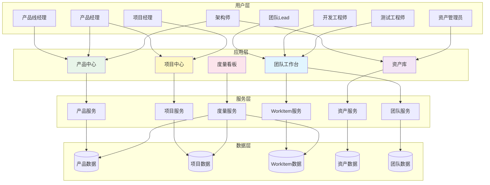
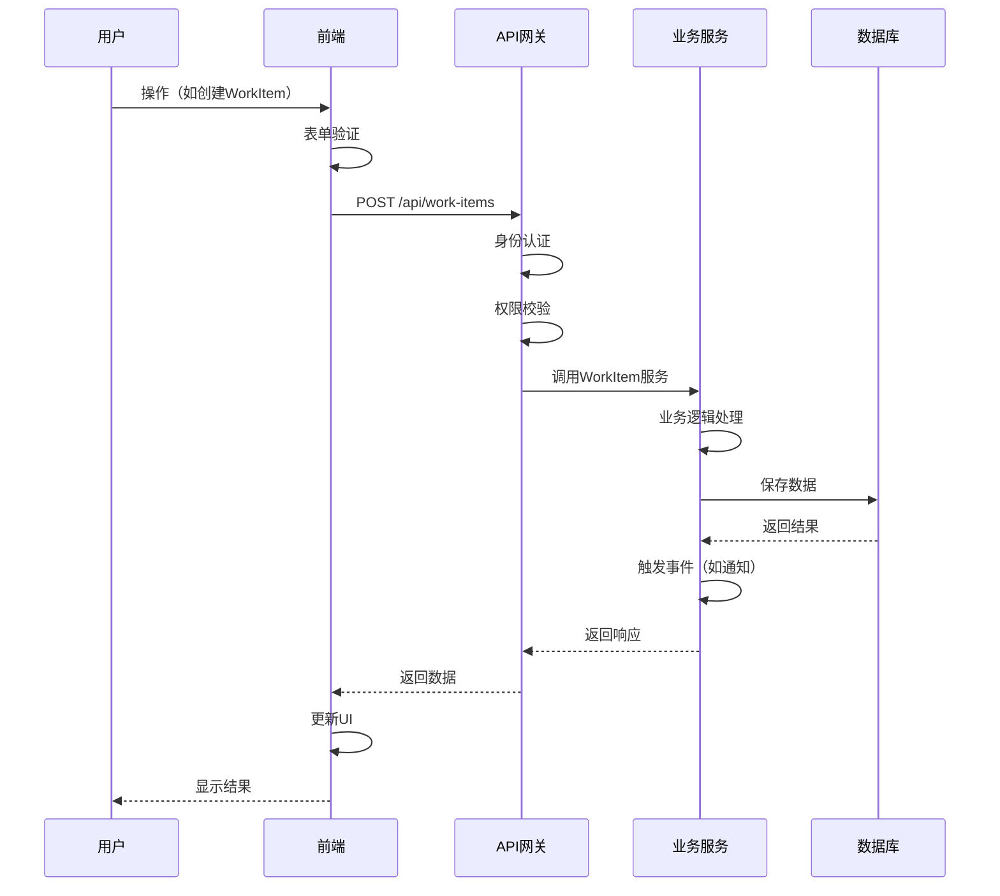
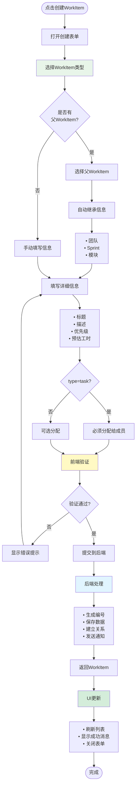

# 平台实现方案

> **关注点**: 角色-页面-操作-数据映射  
> **目标**: 可落地的平台功能设计

---

## 📋 目录

1. [平台实现概述](#一平台实现概述)
2. [角色-页面映射](#二角色-页面映射)
3. [核心页面设计](#三核心页面设计)
4. [数据输入输出](#四数据输入输出)
5. [关键操作流程](#五关键操作流程)
6. [集成场景](#六集成场景)

---

## 一、平台实现概述

### 1.1 平台架构全景



### 1.2 核心功能模块

```
平台功能模块全景:
━━━━━━━━━━━━━━━━━━━━━━━━━━━━━━━━━━━━━━━━━━━━━━━━━

【产品中心】
├─ 产品资产全景          /products/overview
├─ 产品线管理           /products/product-lines
├─ 产品管理             /products/list
├─ 版本管理             /products/versions
├─ 特性管理             /products/features
├─ 模块管理             /products/modules
└─ 基线管理             /products/baselines

【项目中心】
├─ 项目全景图           /projects/overview
├─ 整车项目管理         /projects/vehicle
├─ 领域项目管理         /projects/domain
├─ PI Planning         /projects/pi-planning
├─ 项目代办管理         /backlog/project
└─ 团队代办管理         /backlog/team

【团队工作台】
├─ 团队工作全景         /team/workspace
├─ Sprint管理          /team/sprints
├─ 工作项管理           /team/work-items
├─ 缺陷管理             /team/bugs
├─ 技术债管理           /team/tech-debt
└─ 团队效能分析         /team/metrics

【资产库】
├─ 资产全景             /assets/overview
├─ 资产搜索             /assets/search
├─ 资产库               /assets/library
├─ 资产规划             /assets/planning
├─ 资产提交             /assets/submit
└─ 资产度量             /assets/metrics

【度量看板】
├─ 价值流看板           /dashboards/value-stream
├─ 产品看板             /dashboards/products
├─ 项目看板             /dashboards/projects
├─ 资产看板             /dashboards/assets
└─ 团队看板             /dashboards/teams
```

---

## 二、角色-页面映射

### 2.1 完整角色权限矩阵

| 页面/功能 | 产品线经理 | 产品经理 | 项目经理 | 架构师 | 团队Lead | 开发工程师 | 测试工程师 | 资产管理员 |
|----------|----------|---------|---------|-------|---------|----------|----------|----------|
| **产品中心** |
| 产品资产全景 | ✓ | ✓ | ○ | ✓ | ○ | ○ | ○ | ✓ |
| 产品线管理 | ✓✎ | ○ | ○ | ○ | ○ | ○ | ○ | ○ |
| 产品管理 | ✓✎ | ✓✎ | ○ | ○ | ○ | ○ | ○ | ○ |
| 版本管理 | ✓✎ | ✓✎ | ○ | ○ | ○ | ○ | ○ | ○ |
| 特性管理 | ○ | ✓✎ | ○ | ✓ | ○ | ○ | ○ | ○ |
| 模块管理 | ○ | ○ | ○ | ✓✎ | ○ | ○ | ○ | ○ |
| **项目中心** |
| 项目全景图 | ○ | ✓ | ✓ | ○ | ✓ | ○ | ○ | ○ |
| 整车项目 | ○ | ✓ | ✓✎ | ○ | ○ | ○ | ○ | ○ |
| 领域项目 | ○ | ✓ | ✓✎ | ○ | ✓ | ○ | ○ | ○ |
| PI Planning | ○ | ✓✎ | ✓✎ | ✓ | ✓✎ | ○ | ○ | ○ |
| 项目代办 | ○ | ✓ | ✓✎ | ○ | ✓ | ○ | ○ | ○ |
| 团队代办 | ○ | ○ | ○ | ○ | ✓✎ | ✓ | ✓ | ○ |
| **团队工作台** |
| 团队工作全景 | ○ | ○ | ○ | ○ | ✓ | ✓ | ✓ | ○ |
| Sprint管理 | ○ | ○ | ○ | ○ | ✓✎ | ✓ | ✓ | ○ |
| 工作项管理 | ○ | ○ | ○ | ○ | ✓ | ✓✎ | ✓✎ | ○ |
| 缺陷管理 | ○ | ○ | ○ | ○ | ✓ | ✓ | ✓✎ | ○ |
| 技术债管理 | ○ | ○ | ○ | ✓ | ✓✎ | ✓ | ○ | ○ |
| **资产库** |
| 资产搜索 | ✓ | ✓ | ✓ | ✓ | ✓ | ✓ | ✓ | ✓ |
| 资产库 | ✓ | ✓ | ✓ | ✓ | ✓ | ✓ | ✓ | ✓ |
| 资产规划 | ○ | ✓✎ | ○ | ✓✎ | ○ | ○ | ○ | ○ |
| 资产提交 | ○ | ○ | ○ | ○ | ○ | ✓✎ | ○ | ○ |
| 资产审核 | ○ | ○ | ○ | ○ | ○ | ○ | ○ | ✓✎ |
| **度量看板** |
| 价值流看板 | ✓ | ✓ | ✓ | ✓ | ○ | ○ | ○ | ○ |
| 产品看板 | ✓ | ✓ | ○ | ○ | ○ | ○ | ○ | ○ |
| 项目看板 | ○ | ✓ | ✓ | ○ | ○ | ○ | ○ | ○ |
| 资产看板 | ✓ | ✓ | ○ | ✓ | ○ | ○ | ○ | ✓ |
| 团队看板 | ○ | ○ | ✓ | ○ | ✓ | ○ | ○ | ○ |

**图例**:
- ✓ = 查看权限
- ✎ = 编辑权限
- ○ = 无权限

### 2.2 角色工作台设计

#### 产品经理工作台

```yaml
页面: /workbench/product-manager

核心卡片:
  1. 待办事项
     - 待评审特性: 5个
     - 待规划版本: 2个
     - 待确认需求: 8个
     操作: 点击跳转到对应页面
  
  2. 我的产品
     - 产品列表: NOA、LCC、APA
     - 版本进度: v3.0 85%, v3.1 规划中
     操作: 点击进入产品详情
  
  3. PI Planning
     - 当前PI: PI-2026-Q1
     - 进度: Sprint 3/5
     - PI Objectives完成率: 75%
     操作: 点击进入PI Planning
  
  4. 资产复用统计
     - 本月复用率: 65%
     - 节省工时: 120人天
     - 新增资产: 8个
     操作: 点击查看详情

快捷入口:
  - 创建特性
  - 创建需求
  - 发起PI Planning
  - 查看产品路线图
  - 资产搜索

最近访问:
  - 产品资产全景
  - PI Planning准备
  - 特性需求管理
```

#### 开发工程师工作台

```yaml
页面: /workbench/developer

核心卡片:
  1. 我的任务
     - 进行中: 2个
     - 待开始: 3个
     - 今日到期: 1个
     操作: 拖拽改变状态，点击查看详情
  
  2. 当前Sprint
     - Sprint名称: Sprint-3
     - 剩余天数: 5天
     - 我的Story Points: 13 (已完成8)
     操作: 点击进入Sprint看板
  
  3. 代码审查
     - 待我审查: 3个PR
     - 我的PR待审: 2个PR
     操作: 点击进入代码审查
  
  4. 构建状态
     - 最近构建: 成功 ✓
     - 测试覆盖率: 85%
     - 代码质量: A级
     操作: 点击查看CI/CD详情

快捷入口:
  - 创建WorkItem
  - 提交代码
  - 发起Code Review
  - 查看测试报告
  - 资产搜索

最近访问:
  - 工作项详情 TASK-2026-001
  - Sprint看板
  - 代码审查
```

---

## 三、核心页面设计

### 3.1 产品资产全景页面

**路由**: `/products/overview`  
**角色**: 产品经理、架构师

#### 页面布局

```
┌─────────────────────────────────────────────────────────────┐
│ Header: 产品资产全景                          [搜索框] [筛选] │
├─────────────────────────────────────────────────────────────┤
│                                                              │
│ 【产品线卡片区】（横向滚动）                                  │
│ ┌──────────┐  ┌──────────┐  ┌──────────┐                   │
│ │智能驾驶   │  │智能座舱   │  │动力系统   │  ...             │
│ │产品:5     │  │产品:3     │  │产品:4     │                   │
│ │版本:12    │  │版本:8     │  │版本:10    │                   │
│ │特性:45    │  │特性:28    │  │特性:35    │                   │
│ │健康度:85% │  │健康度:92% │  │健康度:78% │                   │
│ └──────────┘  └──────────┘  └──────────┘                   │
│                                                              │
├─────────────────────────────────────────────────────────────┤
│                                                              │
│ 【产品树 + 详情面板】                                         │
│ ┌────────────────┬──────────────────────────────────────┐  │
│ │产品线树        │ 详情面板                              │  │
│ │                │                                       │  │
│ │▼ 智能驾驶      │ ┌───────────────────────────────────┐│  │
│ │  ▼ NOA        │ │ NOA高速领航                        ││  │
│ │    ● v3.0 ✓   │ │ 状态: 已发布  健康度: 90%          ││  │
│ │    ● v3.1 ⚡  │ │ 版本: v3.1                         ││  │
│ │    ● v3.2 ○   │ │ 负责人: 张三                       ││  │
│ │  ▶ LCC        │ │                                    ││  │
│ │  ▶ APA        │ │ 特性列表:                          ││  │
│ │▶ 智能座舱      │ │ • 融合感知升级 ✓                   ││  │
│ │▶ 动力系统      │ │ • 路径规划优化 ⚡                   ││  │
│ │                │ │ • 控制决策增强 ○                   ││  │
│ │                │ │                                    ││  │
│ │                │ │ [查看详情] [版本历史] [关联项目]   ││  │
│ │                │ └───────────────────────────────────┘│  │
│ └────────────────┴──────────────────────────────────────┘  │
│                                                              │
├─────────────────────────────────────────────────────────────┤
│                                                              │
│ 【产品-项目状态矩阵】                                         │
│ ┌──────────────────────────────────────────────────────┐   │
│ │          │项目A  │项目B  │项目C  │项目D               │   │
│ │──────────┼───────┼───────┼───────┼───────             │   │
│ │NOA v3.0  │v3.0✓  │v3.0✓  │       │                    │   │
│ │          │100%   │100%   │       │                    │   │
│ │NOA v3.1  │v3.1⚡ │       │v3.1○  │v3.1⚡              │   │
│ │          │75%    │       │0%     │65%                 │   │
│ │LCC v2.0  │v2.0✓  │v2.0✓  │v2.0✓  │v2.0✓              │   │
│ │          │100%   │100%   │100%   │100%                │   │
│ └──────────────────────────────────────────────────────┘   │
│                                                              │
├─────────────────────────────────────────────────────────────┤
│                                                              │
│ 【资产健康度看板】                                            │
│ ┌─────────┐ ┌─────────┐ ┌─────────┐ ┌─────────┐          │
│ │总产品数  │ │总版本数  │ │总特性数  │ │资产复用率│          │
│ │   12    │ │   30    │ │  108    │ │   65%   │          │
│ │  ↑ +2   │ │  ↑ +5   │ │  ↑ +12  │ │  ↑ +5%  │          │
│ └─────────┘ └─────────┘ └─────────┘ └─────────┘          │
│                                                              │
└─────────────────────────────────────────────────────────────┘
```

#### 数据接口

```typescript
// 获取产品资产全景数据
GET /api/products/overview

Response: {
  productLines: ProductLine[]     // 产品线列表
  products: Product[]              // 产品列表
  versions: Version[]              // 版本列表
  features: Feature[]              // 特性列表
  projects: Project[]              // 项目列表
  matrix: ProductProjectMatrix[]   // 产品-项目矩阵
  metrics: {
    totalProducts: number
    totalVersions: number
    totalFeatures: number
    reuseRate: number
  }
}

// 产品线数据结构
interface ProductLine {
  id: string
  name: string
  description: string
  productCount: number
  versionCount: number
  featureCount: number
  healthScore: number              // 健康度 0-100
  status: 'active' | 'maintenance' | 'deprecated'
}

// 产品-项目矩阵数据
interface ProductProjectMatrix {
  productId: string
  productName: string
  versionId: string
  versionName: string
  projectId: string
  projectName: string
  appliedVersion: string
  progress: number                  // 进度 0-100
  status: 'completed' | 'in_progress' | 'planned'
}
```

#### 关键操作

```yaml
操作1: 搜索资产
  触发: 输入搜索关键词
  请求: GET /api/products/search?q={keyword}
  响应: 过滤后的产品列表
  UI更新: 更新产品树和详情面板

操作2: 筛选产品
  触发: 选择筛选条件（产品线、状态）
  请求: GET /api/products/filter?productLine={id}&status={status}
  响应: 过滤后的产品列表
  UI更新: 更新所有视图

操作3: 查看产品详情
  触发: 点击产品树节点
  请求: GET /api/products/{id}/detail
  响应: 产品完整信息
  UI更新: 更新详情面板

操作4: 查看关联项目
  触发: 点击"关联项目"按钮
  请求: GET /api/products/{id}/projects
  响应: 使用该产品的项目列表
  UI更新: 弹窗显示项目列表
```

---

### 3.2 PI Planning页面

**路由**: `/projects/pi-planning/{piId}`  
**角色**: 产品经理、项目经理、团队Lead

#### 页面布局

```
┌─────────────────────────────────────────────────────────────┐
│ Header: PI-2026-Q1 Planning                    [保存] [发布] │
├─────────────────────────────────────────────────────────────┤
│                                                              │
│ 【PI信息卡片】                                                │
│ ┌──────────────────────────────────────────────────────┐   │
│ │ PI名称: PI-2026-Q1    周期: 2026-01-15 ~ 2026-03-26  │   │
│ │ 状态: 规划中          团队数: 5个                     │   │
│ │ Sprint数: 5个         总Story Points: 250             │   │
│ └──────────────────────────────────────────────────────┘   │
│                                                              │
├─────────────────────────────────────────────────────────────┤
│                                                              │
│ 【Tab切换】                                                   │
│ [PI Objectives] [WorkItem分配] [依赖管理] [风险看板] [日程]  │
│                                                              │
│ ┌────────────────────────────────────────────────────────┐ │
│ │ Tab 1: PI Objectives                                    │ │
│ │                                                         │ │
│ │ 【Objectives列表】                                       │ │
│ │ ┌─────────────────────────────────────────────────┐    │ │
│ │ │ 1. NOA城市路口决策上线                           │    │ │
│ │ │    业务价值: ⭐⭐⭐⭐⭐⭐⭐⭐⭐                    │    │ │
│ │ │    信心度: 75%  [低] [中] [高]                   │    │ │
│ │ │    负责团队: 感知团队、规划团队                  │    │ │
│ │ │    关联WorkItem: 15个                            │    │ │
│ │ │    [编辑] [查看WorkItem] [删除]                  │    │ │
│ │ └─────────────────────────────────────────────────┘    │ │
│ │ ┌─────────────────────────────────────────────────┐    │ │
│ │ │ 2. LCC性能提升20%                                │    │ │
│ │ │    业务价值: ⭐⭐⭐⭐⭐⭐⭐                       │    │ │
│ │ │    信心度: 85%  [低] [中] [高]                   │    │ │
│ │ │    负责团队: 车控团队                            │    │ │
│ │ │    关联WorkItem: 8个                             │    │ │
│ │ │    [编辑] [查看WorkItem] [删除]                  │    │ │
│ │ └─────────────────────────────────────────────────┘    │ │
│ │                                                         │ │
│ │ [+ 添加Objective]                                        │ │
│ └────────────────────────────────────────────────────────┘ │
│                                                              │
│ ┌────────────────────────────────────────────────────────┐ │
│ │ Tab 2: WorkItem分配（拖拽式）                            │ │
│ │                                                         │ │
│ │ ┌───────────────┬───────────────────────────────────┐  │ │
│ │ │ WorkItem池    │ 团队分配                          │  │ │
│ │ │               │                                   │  │ │
│ │ │ 🔲 MR-001     │ 【感知团队】 容量: 60 SP          │  │ │
│ │ │ 城市路口识别  │ 已分配: 45 SP (75%)               │  │ │
│ │ │ 13 SP         │ ┌─────────────────────┐          │  │ │
│ │ │               │ │ ✓ MR-002 融合感知    │          │  │ │
│ │ │ 🔲 MR-003     │ │   13 SP              │          │  │ │
│ │ │ 轨迹规划优化  │ │ ✓ MR-005 场景识别    │          │  │ │
│ │ │ 8 SP          │ │   20 SP              │          │  │ │
│ │ │               │ │ ✓ BUG-010 修复       │          │  │ │
│ │ │ ...           │ │   12 SP              │          │  │ │
│ │ │               │ └─────────────────────┘          │  │ │
│ │ │               │                                   │  │ │
│ │ │               │ 【规划团队】 容量: 55 SP          │  │ │
│ │ │               │ 已分配: 40 SP (73%)               │  │ │
│ │ │               │ ...                               │  │ │
│ │ └───────────────┴───────────────────────────────────┘  │ │
│ └────────────────────────────────────────────────────────┘ │
│                                                              │
└─────────────────────────────────────────────────────────────┘
```

#### 数据接口

```typescript
// PI Planning数据
GET /api/pi-planning/{piId}

Response: {
  pi: PIInfo
  objectives: PIObjective[]
  workItems: WorkItem[]
  teams: TeamCapacity[]
  dependencies: Dependency[]
  risks: Risk[]
  schedule: PISchedule
}

// 创建PI Objective
POST /api/pi-planning/{piId}/objectives

Request: {
  title: string
  description: string
  businessValue: number        // 1-10
  confidence: number          // 0-100
  teamIds: string[]
}

// 分配WorkItem到团队
POST /api/pi-planning/{piId}/assign

Request: {
  workItemId: string
  teamId: string
  sprintId?: string
}

// 添加依赖关系
POST /api/pi-planning/{piId}/dependencies

Request: {
  fromWorkItemId: string
  toWorkItemId: string
  type: 'technical' | 'resource' | 'schedule'
  description: string
}

// 发布PI计划
POST /api/pi-planning/{piId}/publish

Response: {
  success: boolean
  piBacklog: WorkItem[]
  teamIterationPlans: TeamIterationPlan[]
}
```

---

### 3.3 团队工作台页面

**路由**: `/team/workspace`  
**角色**: 团队Lead、开发工程师、测试工程师

#### 页面布局

```
┌─────────────────────────────────────────────────────────────┐
│ Header: 团队工作台        团队: [感知团队▼]    [搜索] [筛选] │
├─────────────────────────────────────────────────────────────┤
│                                                              │
│ 【当前Sprint信息】                                            │
│ ┌──────────────────────────────────────────────────────┐   │
│ │ Sprint-3  进行中  2026-02-12 ~ 2026-02-26  剩余5天   │   │
│ │ ┌──────┐ ┌──────┐ ┌──────┐ ┌──────┐                 │   │
│ │ │计划SP │ │完成SP │ │进行中 │ │完成率 │                 │   │
│ │ │  60  │ │  35  │ │  15  │ │ 58%  │                 │   │
│ │ └──────┘ └──────┘ └──────┘ └──────┘                 │   │
│ │ [Burndown Chart占位]                                  │   │
│ └──────────────────────────────────────────────────────┘   │
│                                                              │
├─────────────────────────────────────────────────────────────┤
│                                                              │
│ 【工作项看板】（拖拽式）                                      │
│ ┌──────────┬──────────┬──────────┐                        │
│ │ 待开始    │ 进行中    │ 已完成    │                        │
│ │ (12)     │ (8)      │ (25)     │                        │
│ ├──────────┼──────────┼──────────┤                        │
│ │┌────────┐│┌────────┐│┌────────┐│                        │
│ ││🔷 TASK  ││││🔷 TASK  ││││🔷 TASK  ││                        │
│ ││TASK-001 ││││TASK-005 ││││TASK-010 ││                        │
│ ││路口识别 ││││融合感知 ││││控制优化 ││                        │
│ ││张三 8SP ││││李四 13SP││││王五 5SP ││                        │
│ │└────────┘│└────────┘│└────────┘│                        │
│ │┌────────┐│┌────────┐│┌────────┐│                        │
│ ││🔶 BUG   ││││🔶 BUG   ││││...      ││                        │
│ ││BUG-020  ││││BUG-015  ││││         ││                        │
│ ││修复崩溃 ││││性能问题 ││││         ││                        │
│ ││赵六 3SP ││││张三 5SP ││││         ││                        │
│ │└────────┘│└────────┘│         │                        │
│ │...       │...       │         │                        │
│ └──────────┴──────────┴──────────┘                        │
│                                                              │
├─────────────────────────────────────────────────────────────┤
│                                                              │
│ 【团队成员工作量】                                            │
│ ┌──────┐ ┌──────┐ ┌──────┐ ┌──────┐                      │
│ │张三   │ │李四   │ │王五   │ │赵六   │ ...                │
│ │前端   │ │后端   │ │测试   │ │后端   │                    │
│ │任务:3 │ │任务:4 │ │任务:2 │ │任务:3 │                    │
│ │SP:18  │ │SP:26  │ │SP:10  │ │SP:15  │                    │
│ │━━━━━ │ │━━━━━ │ │━━━━━ │ │━━━━━ │                    │
│ │ 60%  │ │ 87%  │ │ 33%  │ │ 50%  │                    │
│ └──────┘ └──────┘ └──────┘ └──────┘                      │
│                                                              │
├─────────────────────────────────────────────────────────────┤
│                                                              │
│ 【团队效能指标】                                              │
│ ┌───────┐ ┌───────┐ ┌───────┐ ┌───────┐                  │
│ │团队速率│ │Sprint │ │活跃Bug │ │平均周期│                  │
│ │  45SP │ │完成率  │ │   5个  │ │  3天   │                  │
│ │ ↑ +3  │ │  92%  │ │ ↓ -2   │ │ ↓ -0.5 │                  │
│ └───────┘ └───────┘ └───────┘ └───────┘                  │
│                                                              │
└─────────────────────────────────────────────────────────────┘
```

#### 数据接口

```typescript
// 获取团队工作台数据
GET /api/team/workspace?teamId={teamId}

Response: {
  team: TeamInfo
  currentSprint: Sprint
  workItems: WorkItem[]
  members: TeamMember[]
  metrics: TeamMetrics
}

// 更新WorkItem状态（拖拽）
PUT /api/work-items/{id}/status

Request: {
  status: 'pending' | 'in_progress' | 'completed'
}

// 分配WorkItem
PUT /api/work-items/{id}/assign

Request: {
  assignee: string              // 成员ID
}

// 更新Story Points
PUT /api/work-items/{id}/story-points

Request: {
  storyPoints: number
}
```

---

## 四、数据输入输出

### 4.1 核心数据流



### 4.2 数据输入规范

```typescript
// 创建WorkItem输入
interface CreateWorkItemInput {
  // 必填字段
  title: string                    // 标题 1-200字符
  type: WorkItemType               // 类型
  priority: Priority               // 优先级
  
  // 可选字段
  description?: string             // 描述
  parentWorkItemId?: string        // 父WorkItem
  moduleId?: string                // 关联模块
  assignee?: string                // 分配给（task类型必填）
  estimatedHours?: number          // 预估工时
  storyPoints?: number             // 故事点
  tags?: string[]                  // 标签
  attachments?: File[]             // 附件
}

// 验证规则
const workItemValidation = {
  title: {
    required: true,
    minLength: 1,
    maxLength: 200,
    pattern: /^[\u4e00-\u9fa5a-zA-Z0-9\s\-_]+$/
  },
  type: {
    required: true,
    enum: ['task', 'module_requirement', 'bug', 'tech_debt', 
           'technical_task', 'test_task', 'research', 'subtask']
  },
  priority: {
    required: true,
    enum: ['critical', 'high', 'medium', 'low']
  },
  assignee: {
    requiredIf: (item) => item.type === 'task',
    validateUser: true
  },
  estimatedHours: {
    min: 0,
    max: 1000
  },
  storyPoints: {
    min: 0,
    max: 100
  }
}
```

### 4.3 数据输出格式

```typescript
// WorkItem输出
interface WorkItemOutput {
  // 基本信息
  id: string
  code: string                     // 自动生成 TASK-2026-001
  title: string
  description: string
  type: WorkItemType
  
  // 层级关系
  parentWorkItemId?: string
  parentWorkItem?: {               // 父WorkItem简要信息
    id: string
    code: string
    title: string
  }
  childWorkItemIds: string[]
  childWorkItemCount: number       // 子WorkItem数量
  
  // 关联关系
  moduleId?: string
  module?: {                       // 关联模块信息
    id: string
    name: string
    productName: string
  }
  featureId?: string
  feature?: {
    id: string
    name: string
  }
  
  // 分配信息
  assignedTeamId?: string
  assignedTeam?: {
    id: string
    name: string
  }
  assignedSprintId?: string
  assignedSprint?: {
    id: string
    name: string
    startDate: string
    endDate: string
  }
  assignee?: string
  assigneeInfo?: {                 // 分配人信息
    id: string
    name: string
    avatar: string
    role: string
  }
  
  // 工作量
  estimatedHours: number
  actualHours?: number             // 实际工时
  storyPoints?: number
  
  // 状态
  priority: Priority
  status: WorkItemStatus
  progress: number
  
  // 时间追踪
  createdAt: string
  createdBy: string
  updatedAt: string
  updatedBy: string
  startedAt?: string
  completedAt?: string
  leadTime?: number                 // 前置时间（小时）
  cycleTime?: number                // 周期时间（小时）
  
  // 统计信息
  commentCount: number
  attachmentCount: number
  dependencyCount: number
  
  // 操作权限
  permissions: {
    canEdit: boolean
    canDelete: boolean
    canAssign: boolean
    canChangeStatus: boolean
  }
}
```

---

## 五、关键操作流程

### 5.1 创建WorkItem流程



### 5.2 资产搜索与复用流程

```mermaid
graph TB
    Start([开始资产搜索]) --> B1[输入搜索关键词]
    
    B1 --> B2[触发搜索]
    B2 --> B3[后端语义搜索]
    
    B3 --> B4[计算匹配度]
    B4 --> B41[• 功能匹配<br/>• 性能匹配<br/>• 技术栈匹配<br/>• 维护成本]
    
    B41 --> B5[返回搜索结果]
    B5 --> B51[排序: 匹配度降序]
    
    B51 --> B6[展示资产列表]
    B6 --> B61[每个资产显示:<br/>• 名称<br/>• 匹配度<br/>• 质量评分<br/>• 使用次数]
    
    B61 --> B7[用户选择资产]
    
    B7 --> B8[查看资产详情]
    B8 --> B81[• 功能说明<br/>• 接口文档<br/>• 使用示例<br/>• 性能指标]
    
    B81 --> B9{决定复用方式}
    
    B9 -->|直接复用| B10[记录复用信息]
    B10 --> B101[• 复用项目<br/>• 复用方式:direct<br/>• 集成方式]
    
    B9 -->|适配复用| B11[记录适配信息]
    B11 --> B111[• 复用项目<br/>• 复用方式:adapted<br/>• 适配内容<br/>• 适配工作量]
    
    B9 -->|不复用| B12[创建新资产]
    
    B101 --> B13[创建WorkItem]
    B111 --> B13
    
    B13 --> B131[WorkItem.reuseInfo = {<br/>  sourceModule: assetId,<br/>  reuseType: 'direct/adapted'<br/>}]
    
    B131 --> B14[开始开发]
    
    B14 --> B15[开发完成后提交反馈]
    B15 --> B151[• 质量评分<br/>• 使用体验<br/>• 改进建议<br/>• 节省工时]
    
    B151 --> B16[更新资产统计]
    
    B16 --> End([完成])
    
    style B3 fill:#e8f5e9
    style B9 fill:#fff9c4
    style B13 fill:#e1f5ff
    style B16 fill:#d4edda
```

---

## 六、集成场景

### 6.1 代码仓库集成（GitLab）

```yaml
集成目标:
  • WorkItem与Git Commit关联
  • Merge Request与代码审查
  • CI/CD状态同步

配置:
  GitLab URL: https://gitlab.example.com
  Access Token: ****
  Webhook URL: https://platform.example.com/api/webhooks/gitlab

Webhook事件:
  1. Push Event
     触发: 代码提交
     处理:
       - 解析Commit Message
       - 提取WorkItem ID（如 "feat: 实现路口识别 #TASK-2026-001"）
       - 关联Commit到WorkItem
       - 更新WorkItem进度
  
  2. Merge Request Event
     触发: 创建/更新/合并MR
     处理:
       - 创建代码审查记录
       - 通知审查人
       - MR合并后更新WorkItem状态为Completed
  
  3. Pipeline Event
     触发: CI/CD执行
     处理:
       - 同步构建状态到WorkItem
       - 测试结果关联
       - 失败时通知负责人

数据同步:
  WorkItem → GitLab Issue:
    - 创建WorkItem时自动创建GitLab Issue
    - 双向同步状态和评论
  
  Branch → WorkItem:
    - 分支命名规范: feature/TASK-2026-001-description
    - 自动关联到对应WorkItem
```

### 6.2 JIRA集成

```yaml
集成目标:
  • 双向同步Work Item
  • 状态映射
  • 数据迁移

配置:
  JIRA URL: https://jira.example.com
  Username: admin
  API Token: ****

数据映射:
  平台WorkItem → JIRA Issue:
    task → Task
    module_requirement → Story
    bug → Bug
    tech_debt → Task (标签: TechDebt)
    technical_task → Sub-task
    test_task → Sub-task
    research → Task (标签: Research)
    subtask → Sub-task
  
  状态映射:
    pending → To Do
    in_progress → In Progress
    completed → Done
  
  优先级映射:
    critical → Highest
    high → High
    medium → Medium
    low → Low

同步策略:
  1. 实时同步（Webhook）
     - JIRA Issue变更 → 同步到平台
     - 平台WorkItem变更 → 同步到JIRA
  
  2. 定时同步（每小时）
     - 批量同步状态
     - 同步评论和附件
  
  3. 冲突处理
     - 时间戳优先
     - 手动解决冲突
```

### 6.3 SonarQube集成

```yaml
集成目标:
  • 代码质量自动分析
  • 质量门禁
  • 技术债识别

配置:
  SonarQube URL: https://sonar.example.com
  Token: ****
  Quality Gate: AutoDevOps-Gate

质量门禁规则:
  - 新代码覆盖率 ≥ 80%
  - 新代码重复率 < 3%
  - 可维护性评级 ≥ A
  - 可靠性评级 ≥ A
  - 安全性评级 ≥ A
  - 严重Bug: 0
  - 严重漏洞: 0

数据同步:
  SonarQube分析结果 → 平台:
    - 代码质量评分 → WorkItem.qualityScore
    - 发现的Bug → 自动创建Bug WorkItem
    - 技术债 → 自动创建TechDebt WorkItem
  
  平台 → SonarQube:
    - WorkItem信息添加到SonarQube标签
    - 缺陷修复状态同步

自动化流程:
  1. 代码提交 → 触发CI
  2. CI执行 → 调用SonarQube扫描
  3. 扫描完成 → SonarQube Webhook通知平台
  4. 平台处理 → 更新WorkItem质量数据
  5. 质量门禁不通过 → 阻止Merge Request
```

### 6.4 Slack/钉钉通知集成

```yaml
通知场景:
  1. WorkItem通知
     - 新建WorkItem: 通知团队频道
     - 分配WorkItem: 通知被分配人
     - 状态变更: 通知相关人员
     - 即将到期: 提前1天通知
  
  2. 代码审查通知
     - 新建MR: 通知审查人
     - 审查评论: 通知MR创建者
     - 审查通过: 通知团队
     - 审查拒绝: 通知MR创建者
  
  3. CI/CD通知
     - 构建失败: 通知提交者
     - 部署成功: 通知团队
     - 质量门禁失败: 通知负责人
  
  4. Sprint通知
     - Sprint开始: 通知团队
     - Sprint结束: 提醒Review
     - Burndown异常: 通知团队Lead

消息格式:
  Slack消息:
    {
      "blocks": [
        {
          "type": "section",
          "text": {
            "type": "mrkdwn",
            "text": "*新WorkItem分配给你*\n<https://platform.example.com/work-items/TASK-2026-001|TASK-2026-001>: 城市路口决策实现"
          }
        },
        {
          "type": "context",
          "elements": [
            {
              "type": "mrkdwn",
              "text": "优先级: High | Story Points: 13 | Sprint: Sprint-3"
            }
          ]
        },
        {
          "type": "actions",
          "elements": [
            {
              "type": "button",
              "text": {
                "type": "plain_text",
                "text": "查看详情"
              },
              "url": "https://platform.example.com/work-items/TASK-2026-001"
            },
            {
              "type": "button",
              "text": {
                "type": "plain_text",
                "text": "开始工作"
              },
              "action_id": "start_work"
            }
          ]
        }
      ]
    }
```

---

## 七、总结

### 平台实现核心价值

```
✓ 角色明确 ⭐⭐⭐
  • 8个核心角色
  • 清晰的权限矩阵
  • 个性化工作台

✓ 流程完整 ⭐⭐⭐
  • 端到端操作流程
  • 数据输入输出规范
  • 关键操作可视化

✓ 集成开放 ⭐⭐
  • GitLab/JIRA集成
  • SonarQube质量集成
  • Slack/钉钉通知

✓ 可落地性强 ⭐⭐⭐
  • 详细的页面设计
  • 完整的API定义
  • 清晰的数据结构
```

---

**文档维护**:
- 创建: 2026-01-10
- 版本: 最新
- 负责人: 平台开发团队

