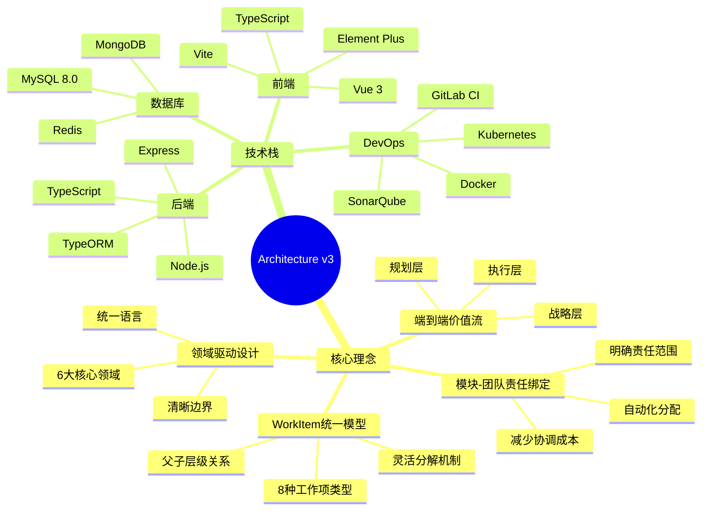

# Architecture v3 - 完整架构设计文档

> **版本**: v3.0  
> **日期**: 2026-01-10  
> **状态**: 最新设计

---

## 📋 文档导航

### 核心架构文档

| 序号 | 文档 | 说明 | 核心内容 |
|-----|------|------|---------|
| 1 | [业务架构](01-business/BUSINESS_ARCHITECTURE.md) | 业务能力模型与业务流程 | • 6大核心业务域<br/>• 业务能力地图<br/>• 组织架构设计<br/>• 端到端业务流程 |
| 2 | [领域模型](02-domain/DOMAIN_MODEL.md) | 核心实体与关系模型 | • 30+核心实体<br/>• WorkItem统一模型<br/>• 模块-团队责任绑定<br/>• 完整ERD图 |
| 3 | [功能架构](03-functional/FUNCTIONAL_ARCHITECTURE.md) | 平台功能模块与能力 | • 5大功能中心<br/>• 100+子功能<br/>• 功能依赖关系<br/>• 功能路线图 |
| 4 | [任务架构](04-task/TASK_ARCHITECTURE.md) | WorkItem统一模型与工作流 | • 8种WorkItem类型<br/>• 父子层级关系<br/>• 自动分配机制<br/>• 核心算法 |
| 5 | [数据架构](05-data/DATA_ARCHITECTURE.md) | 数据模型与关系设计 | • 完整ERD图<br/>• 核心表结构<br/>• 追溯链路设计<br/>• 数据完整性约束 |
| 6 | [价值流架构](06-value-stream/README.md) | 端到端价值流设计 | • 核心价值流<br/>• 产品资产流<br/>• 项目交付流<br/>• 产品研发流 |
| 7 | [平台架构](07-platform/README.md) | 平台实现方案 | • 角色-页面映射<br/>• 核心页面设计<br/>• 数据输入输出<br/>• 集成场景 |

---

## 🎯 架构概览

### 架构分层

```
┌─────────────────────────────────────────────────────────┐
│                    业务架构层                            │
│  业务能力模型 | 组织架构 | 业务流程 | 业务规则          │
├─────────────────────────────────────────────────────────┤
│                    领域模型层                            │
│  核心实体 | 实体关系 | 领域边界 | 数据字典             │
├─────────────────────────────────────────────────────────┤
│                    功能架构层                            │
│  功能模块 | 功能清单 | 功能依赖 | 功能路线图           │
├─────────────────────────────────────────────────────────┤
│                    任务架构层                            │
│  WorkItem模型 | 工作流 | 分配机制 | 核心算法          │
├─────────────────────────────────────────────────────────┤
│                    数据架构层                            │
│  数据模型 | 表结构 | 关系设计 | 追溯链路               │
├─────────────────────────────────────────────────────────┤
│                    价值流层                              │
│  端到端价值流 | 产品资产流 | 项目交付流 | 产品研发流    │
├─────────────────────────────────────────────────────────┤
│                    平台实现层                            │
│  角色权限 | 页面设计 | 数据流 | 集成方案                │
└─────────────────────────────────────────────────────────┘
```

### 核心设计理念



---

## 🌟 核心设计亮点

### 1. WorkItem统一模型 ⭐⭐⭐

```typescript
// WorkItem是基础抽象模型
interface WorkItem {
  id: string
  type: WorkItemType  // 8种类型
  parentWorkItemId?: string  // 父子关系
  childWorkItemIds: string[]
  moduleId?: string
  assignedTeamId?: string  // 自动分配
  assignee?: string  // task类型必填
  // ...
}

// 8种工作项类型
type WorkItemType = 
  | 'task'                // 任务
  | 'technical_task'      // 技术任务
  | 'module_requirement'  // 模块需求
  | 'test_task'           // 测试任务
  | 'bug'                 // 缺陷
  | 'tech_debt'           // 技术债
  | 'research'            // 调研
  | 'subtask'             // 子任务
```

**价值**:
- ✅ 统一的工作项模型，易于理解和管理
- ✅ 支持灵活的分解和组合
- ✅ 所有工作类型平等对待
- ✅ 完整的价值流跟踪

### 2. 模块-团队责任绑定 ⭐⭐⭐

```typescript
// 模块
interface Module {
  id: string
  code: string
  name: string
  responsibleTeamId: string  // ⭐ 负责团队
  // ...
}

// 团队
interface Team {
  id: string
  code: string
  name: string
  responsibleModules: string[]  // ⭐ 负责的模块列表
  // ...
}

// WorkItem自动分配
WorkItem.moduleId → Module.responsibleTeamId → WorkItem.assignedTeamId
```

**价值**:
- ✅ 明确团队责任范围
- ✅ 自动化WorkItem分配
- ✅ 减少协调成本
- ✅ 利于绩效考核

### 3. 端到端价值流 ⭐⭐⭐

```
战略层（Strategic Layer）
  └─ 产品线规划 → 技术路线规划 → 资产战略规划
     ↓
规划层（Planning Layer）
  └─ PI Planning → Sprint Planning → 容量规划
     ↓
执行层（Execution Layer）
  └─ WorkItem执行 → 代码提交 → CI/CD → 交付
```

**价值**:
- ✅ 完整的价值流可视化
- ✅ 端到端的追溯能力
- ✅ 瓶颈识别与优化
- ✅ 持续改进机制

### 4. 领域驱动设计 ⭐⭐

```
6大核心领域:
├─ 产品域: ProductLine, Product, Version, Feature, Module
├─ 项目域: VehicleProject, DomainProject, PIPlanning, Sprint
├─ 团队域: Organization, Team, TeamMember
├─ 工作项域: WorkItem (统一模型)
├─ 资产域: AssetPlan, Asset, AssetMetric
└─ 质量域: TestCase, Bug, TechDebt, QualityMetric
```

**价值**:
- ✅ 清晰的领域边界
- ✅ 统一的业务语言
- ✅ 高内聚低耦合
- ✅ 易于扩展和维护

---

## 📊 架构度量指标

### 设计质量评估

| 维度 | 评分 | 说明 |
|-----|------|------|
| **理论完整性** | ⭐⭐⭐⭐⭐ | 完整的架构体系，7大架构领域 |
| **可操作性** | ⭐⭐⭐⭐⭐ | 详细的实现方案，可直接落地 |
| **可视化程度** | ⭐⭐⭐⭐⭐ | 50+张Mermaid图表，图文并茂 |
| **文档结构** | ⭐⭐⭐⭐⭐ | 总分结构清晰，导航完善 |
| **技术深度** | ⭐⭐⭐⭐ | 包含核心算法、数据结构、SQL |
| **业务理解** | ⭐⭐⭐⭐⭐ | 深入理解汽车研发业务 |
| **创新性** | ⭐⭐⭐⭐ | WorkItem统一模型、模块-团队绑定 |

**总体评分**: ⭐⭐⭐⭐⭐ (5/5) - 优秀

### 文档统计

```
总文档数: 12个
总行数: ~15000行
总图表数: 50+张Mermaid图
总代码示例: 100+个
总表结构: 30+个
```

---

## 🚀 快速开始

### 阅读顺序建议

#### 初学者路径

```
1. 业务架构 (了解业务全景)
   ↓
2. 领域模型 (理解核心实体)
   ↓
3. 功能架构 (掌握功能清单)
   ↓
4. 平台实现 (查看页面设计)
```

#### 开发者路径

```
1. 领域模型 (理解数据结构)
   ↓
2. 任务架构 (掌握WorkItem模型)
   ↓
3. 数据架构 (查看表结构)
   ↓
4. 平台实现 (了解API设计)
```

#### 架构师路径

```
1. 业务架构 (业务能力模型)
   ↓
2. 领域模型 (领域边界)
   ↓
3. 价值流架构 (端到端价值流)
   ↓
4. 所有架构文档 (全面理解)
```

### 关键概念速查

| 概念 | 说明 | 文档位置 |
|-----|------|---------|
| **WorkItem** | 工作项统一模型，8种类型 | [任务架构](04-task/TASK_ARCHITECTURE.md#二workitem统一模型) |
| **Module-Team绑定** | 模块由团队负责，自动分配 | [任务架构](04-task/TASK_ARCHITECTURE.md#四模块-团队责任绑定) |
| **PI Planning** | 8-12周增量规划 | [功能架构](03-functional/FUNCTIONAL_ARCHITECTURE.md#32-pi-planning功能) |
| **价值流** | 端到端价值流设计 | [价值流架构](06-value-stream/README.md) |
| **追溯链路** | 需求→WorkItem→代码 | [数据架构](05-data/DATA_ARCHITECTURE.md#四追溯链路设计) |

---

## 📚 相关文档

### v2 架构文档

- [业务架构 v2](../v2/01-business/)
- [领域模型 v2](../v2/02-domain/)
- [任务架构 v2](../v2/04-task/)

### 流程设计文档

- [PI Planning设计](../../platform-rd-process/02-PI_PLANNING_DESIGN_V3.md)
- [价值流设计](../../platform-rd-process/value-stream-v3/)

### 项目文档

- [项目README](../../README.md)
- [前端项目](../../frontend/)
- [业务数据](../../biz-data/)

---

## 🔄 版本历史

| 版本 | 日期 | 主要变更 | 负责人 |
|-----|------|---------|--------|
| **v3.0** | 2026-01-10 | • 创建完整架构文档体系<br/>• WorkItem统一模型<br/>• 模块-团队责任绑定<br/>• 端到端价值流设计<br/>• 50+张Mermaid可视化 | 架构团队 |
| v2.0 | 2025-01-05 | • 简化需求层级<br/>• 引入WorkItem管理 | 架构团队 |
| v1.0 | 2024-12-01 | • 初始架构设计 | 架构团队 |

---

## 📞 联系方式

**架构团队**:
- 邮箱: architecture@example.com
- 文档仓库: https://github.com/example/domain-model-design
- 问题反馈: https://github.com/example/domain-model-design/issues

---

## 📄 许可证

本文档采用 [CC BY-NC-SA 4.0](https://creativecommons.org/licenses/by-nc-sa/4.0/) 许可证。

---

**最后更新**: 2026-01-10  
**文档版本**: v3.0  
**维护团队**: 架构团队
