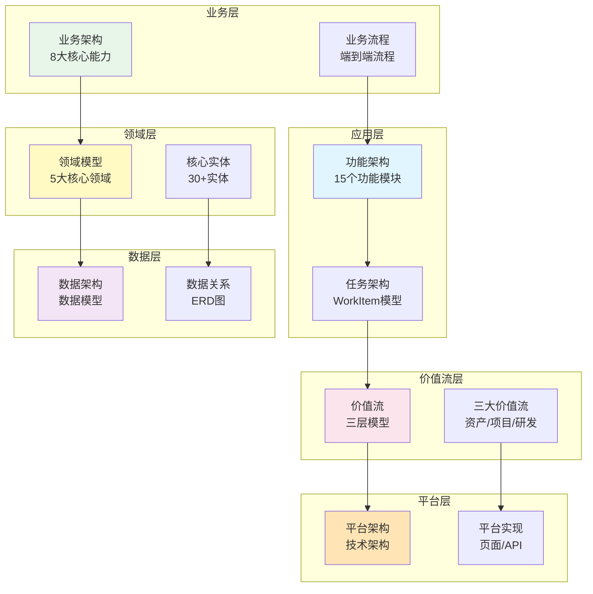

# Auto DevOps平台 - 架构设计文档

> **设计理念**: 端到端价值流驱动的研发平台  
> **核心模型**: WorkItem统一抽象模型  
> **更新日期**: 2026-01-10

---

## 📋 文档导航

### 1. 业务架构（Business Architecture）

**路径**: `01-business/`

| 文档 | 说明 | 关键内容 |
|------|------|---------|
| [BUSINESS_ARCHITECTURE.md](./01-business/BUSINESS_ARCHITECTURE.md) | 业务架构总览 | 业务愿景、核心能力、业务流程 |
| [BUSINESS_CAPABILITY_MODEL.md](./01-business/BUSINESS_CAPABILITY_MODEL.md) | 业务能力模型 | 8大核心能力、能力分解 |
| [BUSINESS_PROCESS.md](./01-business/BUSINESS_PROCESS.md) | 业务流程设计 | 端到端业务流程、关键活动 |

**核心内容**:
- 平台业务愿景和目标
- 8大核心业务能力
- 8个核心角色定义
- 业务流程全景图

---

### 2. 领域模型（Domain Model）

**路径**: `02-domain/`

| 文档 | 说明 | 关键内容 |
|------|------|---------|
| [DOMAIN_MODEL.md](./02-domain/DOMAIN_MODEL.md) | 领域模型总览 | 核心领域、实体关系 |
| [CORE_ENTITIES.md](./02-domain/CORE_ENTITIES.md) | 核心实体设计 | 实体定义、属性、关系 |
| [DOMAIN_RELATIONSHIPS.md](./02-domain/DOMAIN_RELATIONSHIPS.md) | 领域关系图 | ERD图、关系矩阵 |

**核心内容**:
- 5大核心领域（产品、项目、团队、资产、价值流）
- 30+核心实体
- 完整的实体关系图（ERD）
- TypeScript接口定义

---

### 3. 功能架构（Functional Architecture）

**路径**: `03-functional/`

| 文档 | 说明 | 关键内容 |
|------|------|---------|
| [FUNCTIONAL_ARCHITECTURE.md](./03-functional/FUNCTIONAL_ARCHITECTURE.md) | 功能架构总览 | 功能模块、功能分解 |
| [FEATURE_LIST.md](./03-functional/FEATURE_LIST.md) | 功能清单 | 15个功能模块详细说明 |
| [FEATURE_DEPENDENCY.md](./03-functional/FEATURE_DEPENDENCY.md) | 功能依赖关系 | 功能依赖图、优先级 |

**核心内容**:
- 15个功能模块
- 功能分层架构
- 功能依赖关系
- 功能优先级排序

---

### 4. 任务架构（Task Architecture）

**路径**: `04-task/`

| 文档 | 说明 | 关键内容 |
|------|------|---------|
| [TASK_ARCHITECTURE.md](./04-task/TASK_ARCHITECTURE.md) | 任务架构总览 | WorkItem统一模型 |
| [WORKITEM_MODEL.md](./04-task/WORKITEM_MODEL.md) | WorkItem模型详解 | 8种类型、层级分解 |
| [WORKITEM_WORKFLOW.md](./04-task/WORKITEM_WORKFLOW.md) | WorkItem工作流 | 状态流转、生命周期 |

**核心内容**:
- WorkItem统一抽象模型 ⭐⭐⭐
- 8种工作项类型
- 层级分解机制（parentWorkItemId）
- 完整的工作流设计

---

### 5. 数据架构（Data Architecture）

**路径**: `05-data/`

| 文档 | 说明 | 关键内容 |
|------|------|---------|
| [DATA_ARCHITECTURE.md](./05-data/DATA_ARCHITECTURE.md) | 数据架构总览 | 数据模型、数据流 |
| [DATA_MODEL.md](./05-data/DATA_MODEL.md) | 数据模型设计 | 表结构、字段定义 |
| [DATA_RELATIONSHIP.md](./05-data/DATA_RELATIONSHIP.md) | 数据关系设计 | 外键关系、索引设计 |

**核心内容**:
- 完整的数据库设计
- 数据模型ERD图
- 数据字典
- 数据关系矩阵

---

### 6. 价值流架构（Value Stream Architecture）

**路径**: `06-value-stream/`

| 文档 | 说明 | 关键内容 |
|------|------|---------|
| [VALUE_STREAM_OVERVIEW.md](./06-value-stream/VALUE_STREAM_OVERVIEW.md) | 价值流总览 | 三层价值流模型 |
| [PRODUCT_ASSET_STREAM.md](./06-value-stream/PRODUCT_ASSET_STREAM.md) | 产品资产流 | 资产复用、资产健康度 |
| [PROJECT_DELIVERY_STREAM.md](./06-value-stream/PROJECT_DELIVERY_STREAM.md) | 项目交付流 | 进度、质量、风险 |
| [PRODUCT_DEVELOPMENT_STREAM.md](./06-value-stream/PRODUCT_DEVELOPMENT_STREAM.md) | 产品研发流 | 研发效率、代码质量 |

**核心内容**:
- 三层价值流模型（战略-计划-执行）
- 三大核心价值流
- 端到端度量体系
- 30+张Mermaid可视化图表

---

### 7. 平台架构（Platform Architecture）

**路径**: `07-platform/`

| 文档 | 说明 | 关键内容 |
|------|------|---------|
| [PLATFORM_ARCHITECTURE.md](./07-platform/PLATFORM_ARCHITECTURE.md) | 平台架构总览 | 技术架构、部署架构 |
| [PLATFORM_IMPLEMENTATION.md](./07-platform/PLATFORM_IMPLEMENTATION.md) | 平台实现方案 | 角色-页面-操作-数据 |
| [API_DESIGN.md](./07-platform/API_DESIGN.md) | API设计 | RESTful API、GraphQL |
| [UI_UX_DESIGN.md](./07-platform/UI_UX_DESIGN.md) | UI/UX设计 | 页面设计、交互设计 |

**核心内容**:
- 技术栈选型
- 前后端架构
- 部署架构
- 平台功能实现详细设计

---

## 🎯 核心设计亮点

### 1. WorkItem统一模型 ⭐⭐⭐

```
WorkItem (统一抽象模型)
  ├─ type: task                      # 任务
  ├─ type: module_requirement        # 模块需求
  ├─ type: bug                       # 缺陷
  ├─ type: tech_debt                 # 技术债
  ├─ type: technical_task            # 技术任务
  ├─ type: test_task                 # 测试任务
  ├─ type: research                  # 技术调研
  └─ type: subtask                   # 子任务

关键字段:
  • parentWorkItemId: 父工作项ID（建立层级关系）
  • childWorkItemIds: 子工作项ID列表
  • assignee: 分配给成员（task类型必填）
```

### 2. 三层价值流模型 ⭐⭐⭐

```
【战略层】12-24个月
  • 产品规划
  • 产品线路线图
  • 产品版本规划

【计划层】8-12周（PI周期）⭐ 承上启下
  • PI Planning
  • WorkItem分配
  • 多团队对齐

【执行层】2-4周（Sprint周期）
  • Sprint交付
  • WorkItem执行
  • 增量验证
```

### 3. 资产驱动开发 ⭐⭐

```
资产层次:
  ProductLine → Product → Version → Feature → Module

资产复用:
  搜索 → 评估 → 复用/适配/新建
  
目标:
  • 资产复用率 > 60%
  • 资产健康度 > 85
  • 复用节省工时累计
```

---

## 📐 架构可视化

### 整体架构全景图



---

## 📖 阅读指南

### 快速理解（1小时）

1. 阅读本文档（README.md）
2. 浏览 `06-value-stream/VALUE_STREAM_OVERVIEW.md`
3. 浏览 `04-task/TASK_ARCHITECTURE.md`

### 深入学习（1天）

1. **业务理解**（2小时）
   - `01-business/BUSINESS_ARCHITECTURE.md`
   - `01-business/BUSINESS_CAPABILITY_MODEL.md`

2. **领域建模**（2小时）
   - `02-domain/DOMAIN_MODEL.md`
   - `02-domain/CORE_ENTITIES.md`

3. **功能设计**（2小时）
   - `03-functional/FUNCTIONAL_ARCHITECTURE.md`
   - `03-functional/FEATURE_LIST.md`

4. **价值流**（2小时）
   - `06-value-stream/` 下所有文档

### 平台实施（1周）

1. **任务架构**（1天）
   - `04-task/` 下所有文档

2. **数据设计**（1天）
   - `05-data/` 下所有文档

3. **平台实现**（3天）
   - `07-platform/` 下所有文档

---

## 🔧 技术栈

### 前端
- **框架**: Vue 3 + TypeScript
- **UI库**: Element Plus
- **状态管理**: Pinia
- **路由**: Vue Router
- **构建工具**: Vite
- **可视化**: Cytoscape.js, ECharts, Mermaid

### 后端
- **框架**: Spring Boot 3.x
- **语言**: Java 17+
- **数据库**: PostgreSQL 14+
- **缓存**: Redis 7+
- **消息队列**: RabbitMQ
- **搜索**: Elasticsearch

### DevOps
- **CI/CD**: Jenkins / GitLab CI
- **容器**: Docker + Kubernetes
- **监控**: Prometheus + Grafana
- **日志**: ELK Stack

---

## 📊 度量指标

### 战略层度量
- 产品上市时间（Time to Market）
- 路线图实现率（Roadmap Achievement Rate）
- 市场份额（Market Share）

### 计划层度量
- PI目标达成率 ≥ 85%
- 依赖解决率 ≥ 80%
- 团队信心度 ≥ 80%
- WorkItem完成率 ≥ 90%

### 执行层度量
- Lead Time < 2周
- Cycle Time < 1周
- Sprint Velocity 稳定或上升
- 缺陷逃逸率 < 5%

### 资产度量
- 资产复用率 > 60%
- 资产健康度 > 85
- 复用节省工时累计

---

## 🎓 核心概念

### WorkItem（工作项）
统一的工作抽象模型，包含8种类型，通过`type`字段区分，通过`parentWorkItemId`建立层级关系。

### PI Planning
Program Increment Planning，8-12周的计划周期，承上启下的关键环节，连接战略规划和Sprint执行。

### 资产（Asset）
可复用的软件模块，包括产品线、产品、版本、特性、模块五个层次，模块是最小复用单元。

### 价值流（Value Stream）
从需求到交付的端到端流程，包括战略层、计划层、执行层三个层次。

---

## 📝 文档维护

- **创建时间**: 2026-01-10
- **维护团队**: 架构团队
- **更新频率**: 持续更新

---

## 🔗 相关资源

- **项目仓库**: https://github.com/zjx-immersion/domain-model-design
- **分支**: feature/project-product-adjust
- **Mock数据**: `v2/05-data/business-data/mock/`
- **前端代码**: `frontend/`

---

**架构设计完整性**: ⭐⭐⭐⭐⭐ (5/5)

**设计质量**:
- 理论完整性: ⭐⭐⭐⭐⭐
- 可操作性: ⭐⭐⭐⭐⭐
- 可视化程度: ⭐⭐⭐⭐⭐
- 平台实施细节: ⭐⭐⭐⭐

