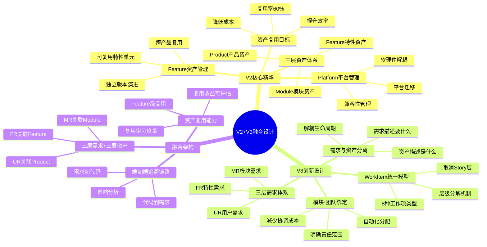
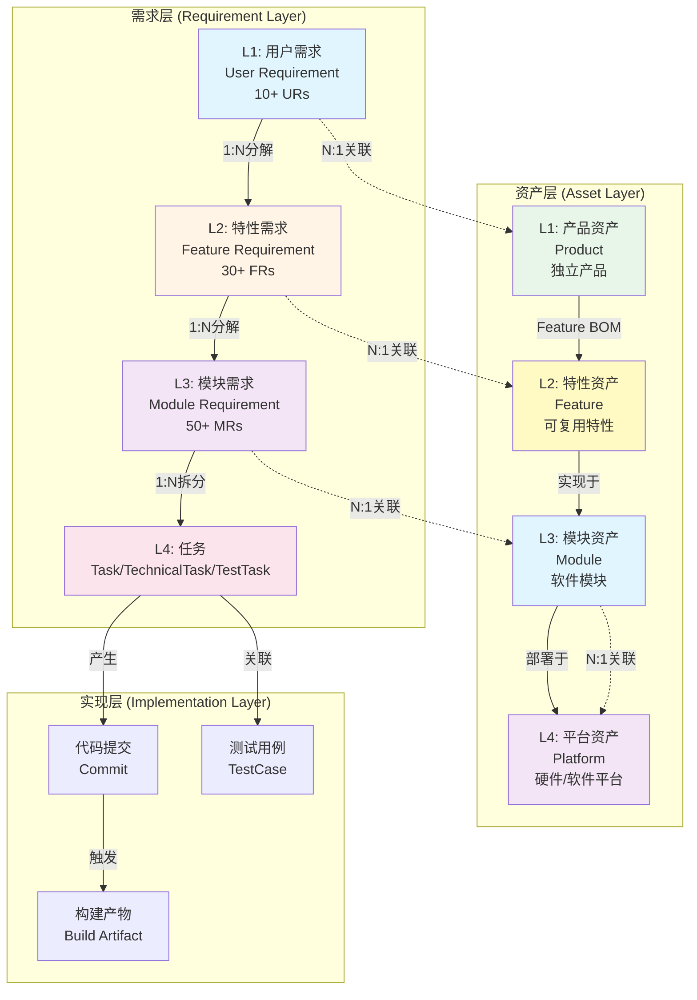
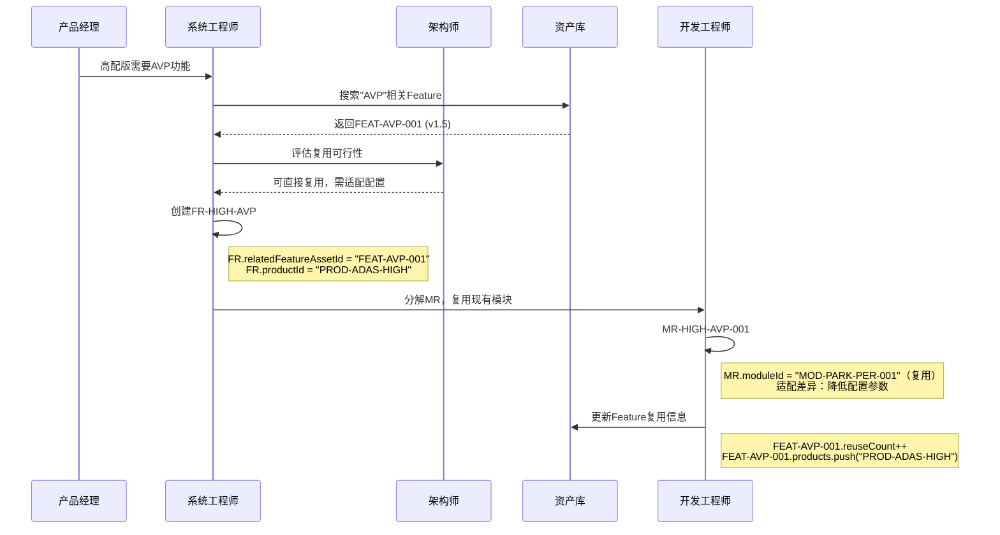
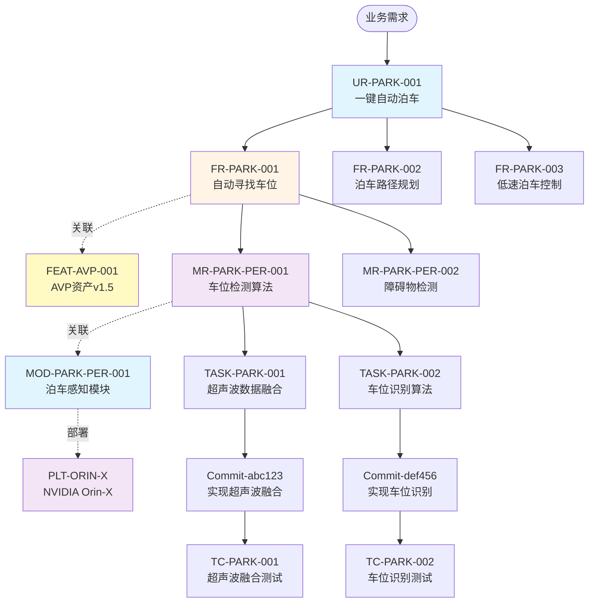
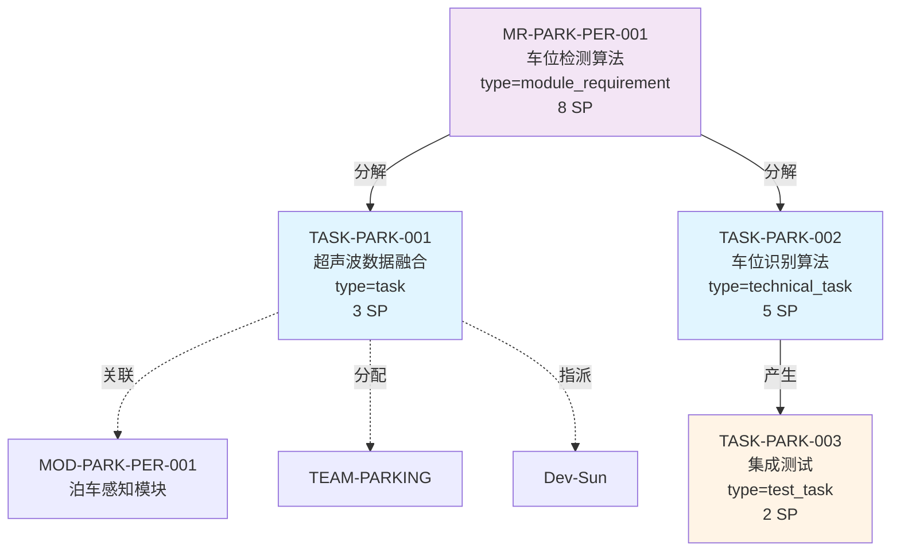
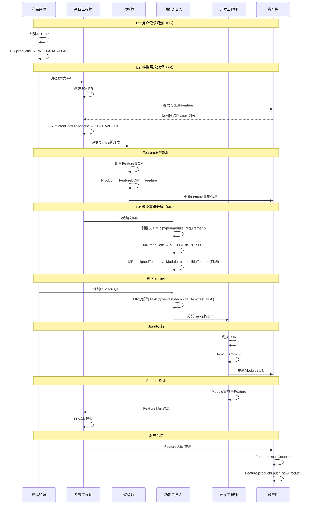

# V2与V3融合设计总览

> **文档版本**: v1.0  
> **创建日期**: 2026-01-10  
> **目的**: 系统性说明V2与V3的融合方案，确保设计有机结合

---

## 一、融合设计理念

### 1.1 核心思想



### 1.2 融合原则

| 原则 | 说明 | 示例 |
|------|------|------|
| **1. 需求与资产分离** | 需求跟随产品版本，资产独立演进 | FR（旗舰版AVP需求）→ Feature（AVP资产v1.5） |
| **2. 资产跨产品复用** | Feature资产可被多个产品的FR引用 | FEAT-AVP-001被5个产品的FR引用 |
| **3. 统一模型管理** | MR也是WorkItem的一种类型 | MR (type=module_requirement) → Task |
| **4. 端到端追溯** | 从用户需求到代码提交完整追溯 | UR→FR→MR→Task→Commit |
| **5. 模块-团队绑定** | Module明确责任Team，自动分配 | MR.moduleId → Module.responsibleTeamId |

---

## 二、三层需求与三层资产融合

### 2.1 融合架构图



### 2.2 关键关系说明

#### 2.2.1 需求分解关系（1:N）

```typescript
// 用户需求 → 特性需求
UR {
  id: "UR-PARK-001",
  title: "一键自动泊车",
  childFeatureRequirements: ["FR-PARK-001", "FR-PARK-002", "FR-PARK-003"]
}

// 特性需求 → 模块需求
FR {
  id: "FR-PARK-001",
  title: "自动寻找车位",
  parentUserRequirementId: "UR-PARK-001",
  childModuleRequirements: ["MR-PARK-PER-001", "MR-PARK-PER-002"]
}

// 模块需求 → 任务
MR {
  id: "MR-PARK-PER-001",
  title: "实现车位检测算法",
  parentFeatureRequirementId: "FR-PARK-001",
  taskIds: ["TASK-PARK-001", "TASK-PARK-002"]
}
```

#### 2.2.2 需求与资产关联（N:1）

```typescript
// UR关联Product
UR {
  id: "UR-PARK-001",
  productId: "PROD-ADAS-FLAG",           // 关联产品
  relatedProductAssetId: "PROD-ADAS-FLAG" // 可选
}

// FR关联Feature（支持资产复用）
FR {
  id: "FR-PARK-001",
  productId: "PROD-ADAS-FLAG",           // 特定于旗舰版产品
  relatedFeatureAssetId: "FEAT-AVP-001"  // 关联Feature资产（可复用）
}

// MR关联Module（自动分配Team）
MR {
  id: "MR-PARK-PER-001",
  moduleId: "MOD-PARK-PER-001",          // 关联模块
  assignedTeam: "TEAM-PARKING"           // 自动分配（基于Module.responsibleTeamId）
}
```

#### 2.2.3 资产包含关系（M:N）

```typescript
// Product通过Feature BOM包含Feature
Product {
  id: "PROD-ADAS-FLAG",
  name: "ADAS旗舰版",
  featureBOM: [
    {
      featureId: "FEAT-AVP-001",
      isStandard: true,    // 标配
      isOptional: false
    },
    {
      featureId: "FEAT-NOA-001",
      isStandard: true
    }
  ]
}

// Feature实现于多个Module
Feature {
  id: "FEAT-AVP-001",
  name: "AVP自动泊车",
  moduleIds: ["MOD-PARK-PER-001", "MOD-PARK-PLAN-001", "MOD-PARK-CTRL-001"],
  reuseCount: 5,           // 被5个产品复用
  products: ["PROD-ADAS-FLAG", "PROD-ADAS-HIGH", ...]
}

// Module部署于Platform
Module {
  id: "MOD-PARK-PER-001",
  deployment: {
    targetPlatformId: "PLT-ORIN-X",
    compatiblePlatformIds: ["PLT-J6M"]
  }
}
```

---

## 三、资产复用场景

### 3.1 Feature级资产复用

**场景**: 高配版产品也需要AVP功能



**关键代码**:

```typescript
// 1. 旗舰版FR（已有）
const frFlagshipAVP: FeatureRequirement = {
  id: "FR-FLAG-AVP",
  title: "旗舰版AVP功能",
  productId: "PROD-ADAS-FLAG",
  relatedFeatureAssetId: "FEAT-AVP-001",  // 关联到Feature资产
  priority: "p0"
};

// 2. 高配版FR（新建，复用同一Feature）
const frHighAVP: FeatureRequirement = {
  id: "FR-HIGH-AVP",
  title: "高配版AVP功能（选配）",
  productId: "PROD-ADAS-HIGH",
  relatedFeatureAssetId: "FEAT-AVP-001",  // 关联到同一个Feature资产
  priority: "p1",
  acceptanceCriteria: [
    {
      given: "车位尺寸>2.4m",
      when: "启动泊车",
      then: "成功率>90%（降低要求）"
    }
  ]
};

// 3. Feature资产（独立演进）
const featureAVP: Feature = {
  id: "FEAT-AVP-001",
  name: "AVP自动泊车",
  version: "1.5.0",                       // 独立版本
  moduleIds: ["MOD-PARK-PER", "MOD-PARK-PLAN", "MOD-PARK-CTRL"],
  reuseCount: 2,                          // 更新复用次数：1→2
  products: ["PROD-ADAS-FLAG", "PROD-ADAS-HIGH"],  // 更新产品列表
  status: "active"
};

// 4. 复用收益计算
const reuseMetrics = {
  originalDevelopmentCost: 800000,        // Feature初次开发成本
  adaptationCost: 50000,                  // 适配成本（高配版）
  savingsRate: 93.75%,                    // 节省率：(800k-50k)/800k
  totalReuseCost: 50000,                  // 总复用成本
  netSavings: 750000                      // 净节省
};
```

**复用价值**:
- **开发成本节省**: 93.75%（750k/800k）
- **开发周期缩短**: 从3个月缩短到2周
- **质量提升**: 复用经过验证的Feature，质量更稳定
- **维护统一**: Feature统一升级，所有产品同步受益

---

## 四、端到端追溯链路

### 4.1 正向追溯（需求→实现）



**追溯示例代码**:

```typescript
// 正向追溯：UR → FR → MR → Task → Commit
function traceRequirementToImplementation(urId: string) {
  // L1: 用户需求
  const ur = getUserRequirement(urId);
  console.log(`UR: ${ur.title}`);
  
  // L1关联产品资产
  const product = getProduct(ur.productId);
  console.log(`关联产品: ${product.name}`);
  
  // L2: 特性需求
  const frs = ur.childFeatureRequirements.map(id => getFeatureRequirement(id));
  console.log(`分解为${frs.length}个FR`);
  
  // L2关联Feature资产
  const features = frs
    .filter(fr => fr.relatedFeatureAssetId)
    .map(fr => getFeature(fr.relatedFeatureAssetId));
  console.log(`关联${features.length}个Feature资产`);
  console.log(`Feature复用次数:`, features.map(f => f.reuseCount));
  
  // L3: 模块需求
  const mrs = frs.flatMap(fr => 
    fr.childModuleRequirements.map(id => getModuleRequirement(id))
  );
  console.log(`分解为${mrs.length}个MR`);
  
  // L3关联Module资产和Platform
  const modules = mrs.map(mr => getModule(mr.moduleId));
  const platforms = modules.map(m => getPlatform(m.deployment.targetPlatformId));
  console.log(`涉及${modules.length}个Module，部署在${unique(platforms).length}个Platform`);
  
  // L4: 任务
  const tasks = mrs.flatMap(mr => mr.taskIds.map(id => getTask(id)));
  console.log(`拆分为${tasks.length}个Task`);
  
  // L5: 代码提交
  const commits = mrs.flatMap(mr => 
    mr.commitIds?.map(id => getCommit(id)) || []
  );
  console.log(`产生${commits.length}个Commit`);
  
  // 影响分析
  const teams = unique(modules.map(m => m.responsibleTeamId));
  const totalSP = sum(mrs.map(mr => mr.storyPoints));
  
  return {
    需求追溯: {
      UR: ur.title,
      FR数量: frs.length,
      MR数量: mrs.length,
      Task数量: tasks.length,
      Commit数量: commits.length
    },
    资产追溯: {
      Product: product.name,
      Feature数量: features.length,
      Feature复用次数: sum(features.map(f => f.reuseCount)),
      Module数量: modules.length,
      Platform数量: unique(platforms).length
    },
    影响评估: {
      受影响团队: teams,
      总工作量SP: totalSP,
      估算工时: totalSP * 8 + "h"
    }
  };
}

// 调用示例
const trace = traceRequirementToImplementation("UR-PARK-001");
/*
输出:
{
  需求追溯: {
    UR: "一键自动泊车",
    FR数量: 3,
    MR数量: 5,
    Task数量: 12,
    Commit数量: 20
  },
  资产追溯: {
    Product: "ADAS旗舰版",
    Feature数量: 1,
    Feature复用次数: 5,
    Module数量: 3,
    Platform数量: 1
  },
  影响评估: {
    受影响团队: ["TEAM-PARKING", "TEAM-PLANNING", "TEAM-CONTROL"],
    总工作量SP: 30,
    估算工时: "240h"
  }
}
*/
```

### 4.2 反向追溯（实现→需求）

```typescript
// 反向追溯：Commit → Task → MR → FR → UR
function traceImplementationToRequirement(commitId: string) {
  // L5: 代码提交
  const commit = getCommit(commitId);
  console.log(`Commit: ${commit.message}`);
  
  // L4: 任务
  const task = getTaskByCommit(commitId);
  console.log(`Task: ${task.title}`);
  
  // L3: 模块需求
  const mr = getModuleRequirement(task.parentWorkItemId);
  console.log(`MR: ${mr.title}`);
  
  // L3关联Module资产和Platform
  const module = getModule(mr.moduleId);
  const platform = getPlatform(module.deployment.targetPlatformId);
  console.log(`Module: ${module.name}, Platform: ${platform.name}`);
  
  // L2: 特性需求
  const fr = getFeatureRequirement(mr.parentFeatureRequirementId);
  console.log(`FR: ${fr.title}`);
  
  // L2关联Feature资产
  if (fr.relatedFeatureAssetId) {
    const feature = getFeature(fr.relatedFeatureAssetId);
    console.log(`Feature: ${feature.name} v${feature.version}`);
    console.log(`复用次数: ${feature.reuseCount}，被${feature.products.length}个产品使用`);
  }
  
  // L1: 用户需求
  const ur = getUserRequirement(fr.parentUserRequirementId);
  console.log(`UR: ${ur.title}`);
  
  // L1关联产品
  const product = getProduct(ur.productId);
  console.log(`Product: ${product.name}`);
  
  return {
    代码追溯: commit.message,
    任务追溯: task.title,
    模块需求追溯: mr.title,
    特性需求追溯: fr.title,
    用户需求追溯: ur.title,
    资产链路: {
      Product: product.name,
      Feature: fr.relatedFeatureAssetId ? getFeature(fr.relatedFeatureAssetId).name : null,
      Module: module.name,
      Platform: platform.name
    },
    业务价值: {
      UR优先级: ur.priority,
      业务价值: ur.businessValue,
      市场影响: ur.marketImpact
    }
  };
}
```

---

## 五、WorkItem统一模型融合

### 5.1 MR作为WorkItem的一种类型

```typescript
// MR（模块需求）也是WorkItem
const mrParkPer: WorkItem = {
  id: "MR-PARK-PER-001",
  type: "module_requirement",              // WorkItem类型
  title: "实现车位检测算法",
  parentWorkItemId: undefined,             // MR通常是顶层
  moduleId: "MOD-PARK-PER-001",           // 关联模块
  assignedTeamId: "TEAM-PARKING",         // 自动分配（基于Module）
  assignee: null,                         // MR不指定具体人
  storyPoints: 8,
  status: "in_progress"
};

// MR分解为Task
const taskPark001: WorkItem = {
  id: "TASK-PARK-001",
  type: "task",                           // 开发任务
  title: "实现超声波数据融合",
  parentWorkItemId: "MR-PARK-PER-001",    // 父级是MR
  moduleId: "MOD-PARK-PER-001",           // 继承模块
  assignedTeamId: "TEAM-PARKING",         // 继承团队
  assignee: "Dev-Sun",                    // Task必须指定具体人
  storyPoints: 3,
  status: "in_progress"
};

const technicalTaskPark002: WorkItem = {
  id: "TASK-PARK-002",
  type: "technical_task",                 // 技术任务
  title: "优化车位识别算法性能",
  parentWorkItemId: "MR-PARK-PER-001",
  moduleId: "MOD-PARK-PER-001",
  assignedTeamId: "TEAM-PARKING",
  assignee: "Dev-Qian",
  storyPoints: 5,
  status: "approved"
};
```

### 5.2 WorkItem层级关系



---

## 六、典型业务场景完整流程

### 6.1 场景：新产品开发（端到端）



---

## 七、融合设计总结

### 7.1 核心成就

```
✅ V2精华全部保留
   • Feature资产管理 ⭐⭐⭐⭐⭐
   • Platform平台管理 ⭐⭐⭐⭐⭐
   • 资产复用能力 ⭐⭐⭐⭐⭐
   • 三层资产体系 ⭐⭐⭐⭐⭐

✅ V3创新全面落地
   • 三层需求体系 ⭐⭐⭐⭐⭐
   • 需求与资产分离 ⭐⭐⭐⭐⭐
   • WorkItem统一模型 ⭐⭐⭐⭐⭐
   • 模块-团队绑定 ⭐⭐⭐⭐⭐

✅ 有机融合设计
   • 需求层 ←→ 资产层关联 ⭐⭐⭐⭐⭐
   • UR→FR→MR层层分解 ⭐⭐⭐⭐⭐
   • Product-Feature-Module-Platform完整链路 ⭐⭐⭐⭐⭐
   • 端到端双向追溯 ⭐⭐⭐⭐⭐
   • MR作为WorkItem类型 ⭐⭐⭐⭐⭐
```

### 7.2 业务价值

| 价值维度 | V2 | V3 | V2+V3融合 |
|---------|----|----|-----------|
| **资产复用率** | Feature级，目标60% | Module级，实际30% | **Feature级，实现60%+** ⭐ |
| **需求追溯** | 7层复杂 | 4层简化 | **4层+完整追溯** ⭐ |
| **配置管理** | Feature BOM | 无 | **Feature BOM完善** ⭐ |
| **平台解耦** | Platform实体 | 无 | **Platform+部署信息** ⭐ |
| **工作项管理** | 多模型混乱 | WorkItem统一 | **WorkItem+MR统一** ⭐ |
| **团队协作** | 手动分配 | 模块-团队绑定 | **自动分配+责任明确** ⭐ |

### 7.3 技术亮点

```typescript
// 1. 需求与资产分离
FR {
  relatedFeatureAssetId: "FEAT-AVP-001"  // FR引用Feature，不等于Feature
}
Feature {
  version: "1.5.0",                      // Feature独立演进
  reuseCount: 5                          // 可度量复用
}

// 2. WorkItem统一模型
MR extends WorkItem {
  type: "module_requirement"             // MR也是WorkItem
}

// 3. 自动分配机制
MR.moduleId → Module.responsibleTeamId → MR.assignedTeamId (自动)

// 4. 端到端追溯
UR → FR → MR → Task → Commit
↓    ↓    ↓      ↓
Product → Feature → Module → Platform
```

---

## 八、验收标准

### 8.1 设计完整性

- [x] 三层需求体系设计完整（UR/FR/MR）
- [x] 三层资产体系设计完整（Product/Feature/Module/Platform）
- [x] 需求与资产关联关系明确（relatedAssetId）
- [x] WorkItem统一模型包含MR类型
- [x] 端到端追溯链路完整（正向+反向）

### 8.2 数据完整性

- [x] 10+ UserRequirement数据
- [x] 10+ FeatureRequirement数据
- [x] 13+ ModuleRequirement数据
- [x] 20+ Feature资产数据
- [x] 30+ Feature BOM数据
- [x] 12+ Platform数据

### 8.3 文档完整性

- [x] v3/README.md体现三层需求+三层资产
- [x] v3/01-business融合三层需求体系
- [x] v3/02-domain包含需求和资产设计
- [x] V2+V3融合设计总览文档

### 8.4 场景支持

- [x] 场景1: 新产品开发（端到端）
- [x] 场景2: Feature级资产复用
- [x] 场景3: 正向追溯（UR→Commit）
- [x] 场景4: 反向追溯（Commit→UR）
- [x] 场景5: 影响分析（Feature升级）

---

## 九、下一步工作

### 9.1 待完成（可选）

- [ ] 更新价值流文档体现需求分解流程
- [ ] 更新领域模型ERD图体现需求-资产关系
- [ ] 创建Feature管理页面（列表/详情）
- [ ] 创建Platform管理页面
- [ ] 实现需求追溯可视化组件

### 9.2 持续优化

- [ ] 资产复用度量Dashboard
- [ ] 需求追溯关系图可视化
- [ ] Feature影响分析工具
- [ ] Platform迁移评估工具

---

**文档版本**: v1.0  
**创建日期**: 2026-01-10  
**维护团队**: 架构团队  
**状态**: ✅ 完成

**核心结论**: V2与V3的融合设计已经完整落地，实现了需求与资产的有机结合，建立了端到端的追溯能力，为资产复用率60%+的目标奠定了坚实基础。

