# AVP自动泊车案例可视化图

> **文档版本**: v1.0  
> **创建时间**: 2026-01-02  
> **对应文档**: 06-AVP_CASE_STUDY.md  
> **案例场景**: AVP自主代客泊车功能

---

## 📊 目录

1. [AVP三层分解结构图](#一-avp三层分解结构图)
2. [AVP完整追溯链](#二-avp完整追溯链)
3. [AVP部署架构图](#三-avp部署架构图)
4. [AVP数据流图](#四-avp数据流图)
5. [软硬件解耦示例](#五-软硬件解耦示例)
6. [资产复用场景](#六-资产复用场景)

---

## 一、 AVP三层分解结构图

### 1.1 产品层到功能层到模块层的完整分解

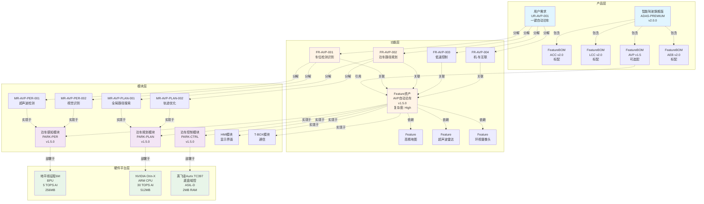

---

## 二、 AVP完整追溯链

### 2.1 从用户需求到代码提交的追溯链

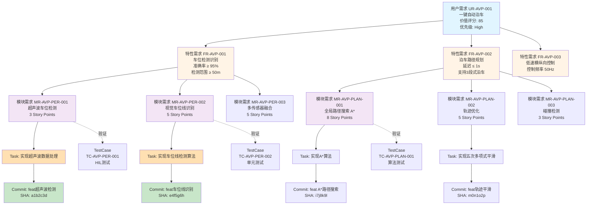

### 2.2 需求与资产的关联关系

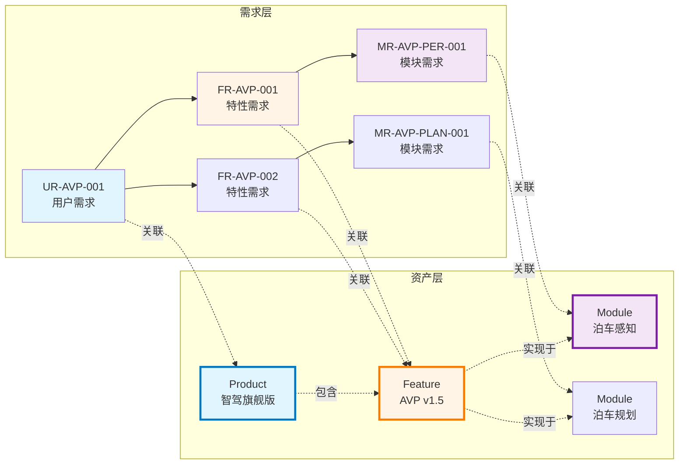

---

## 三、 AVP部署架构图

### 3.1 模块在硬件平台上的部署

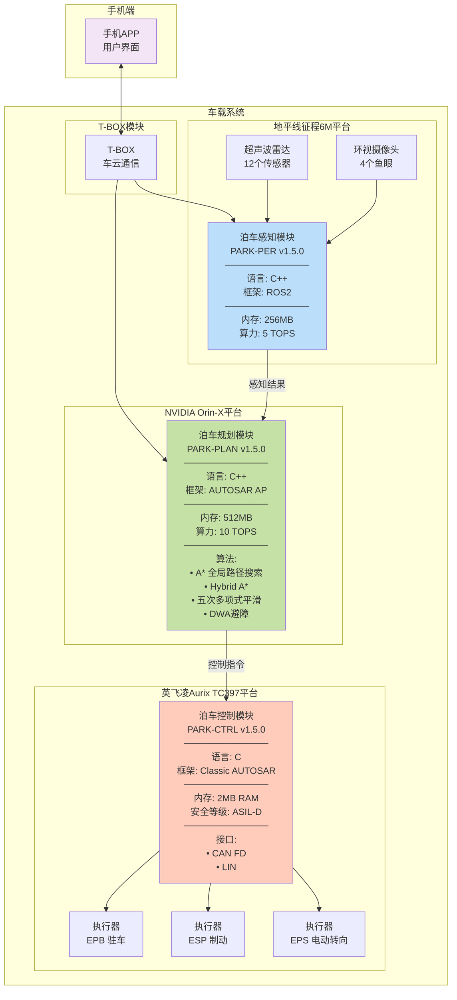

### 3.2 平台技术栈对比

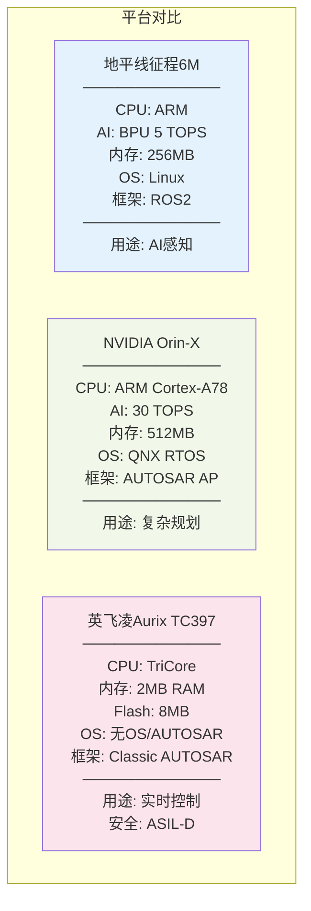

---

## 四、 AVP数据流图

### 4.1 运行时数据流

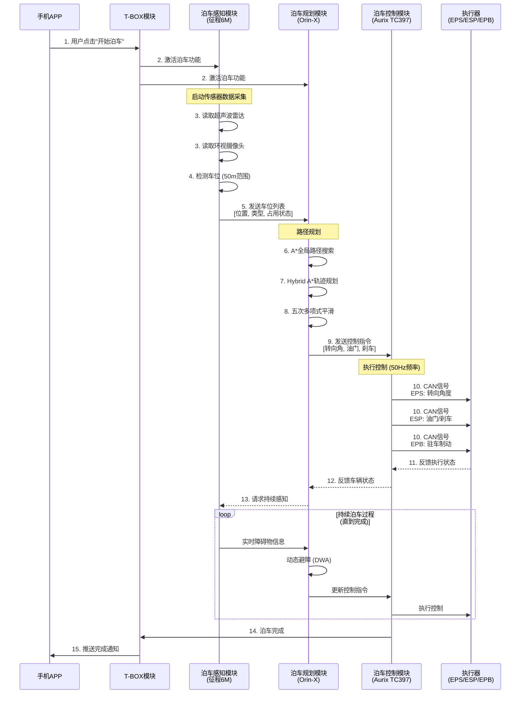

### 4.2 模块间接口定义

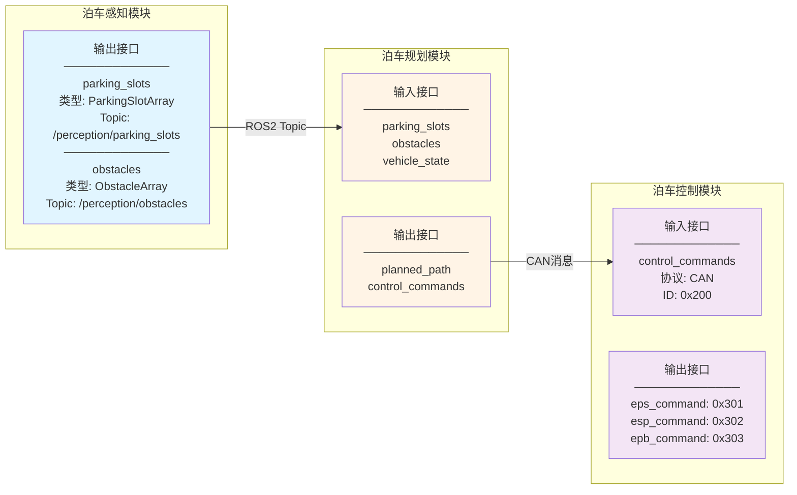

---

## 五、 软硬件解耦示例

### 5.1 平台迁移场景：从Orin-X到Thor

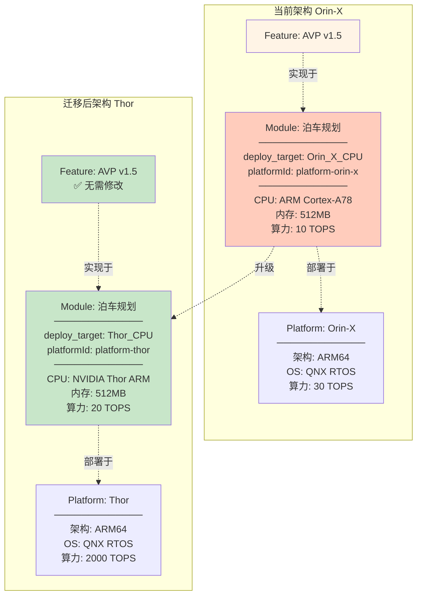

### 5.2 解耦的优势

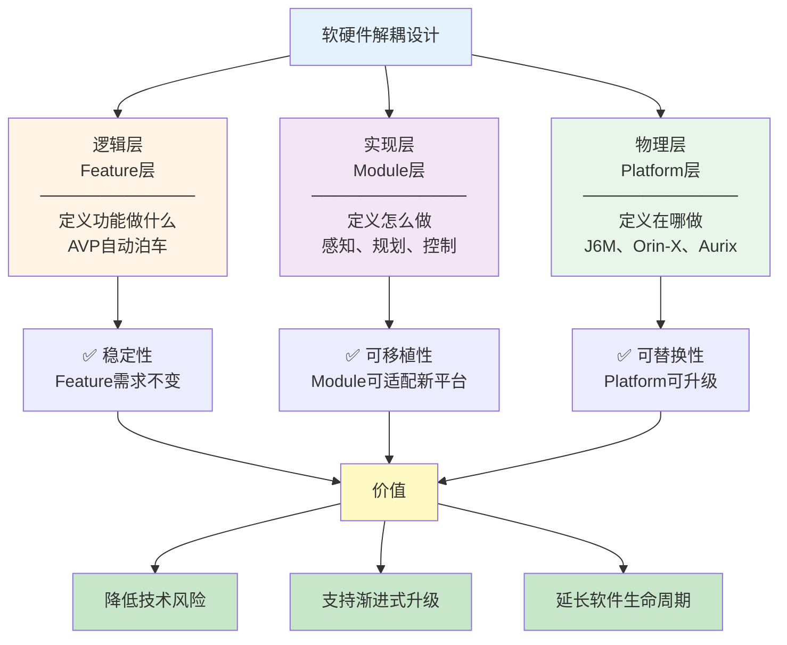

---

## 六、 资产复用场景

### 6.1 跨产品Feature复用

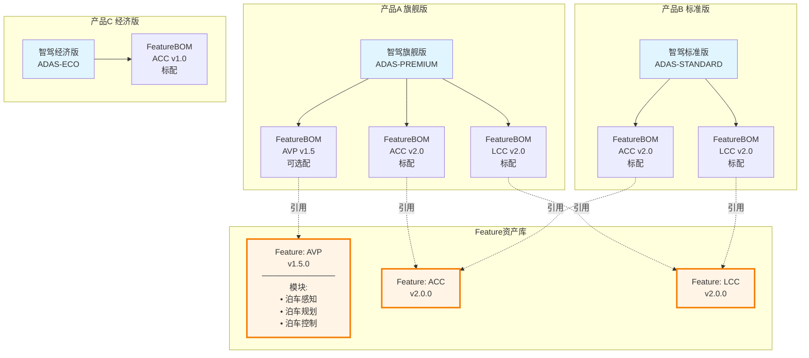

### 6.2 模块在多个Feature间共享

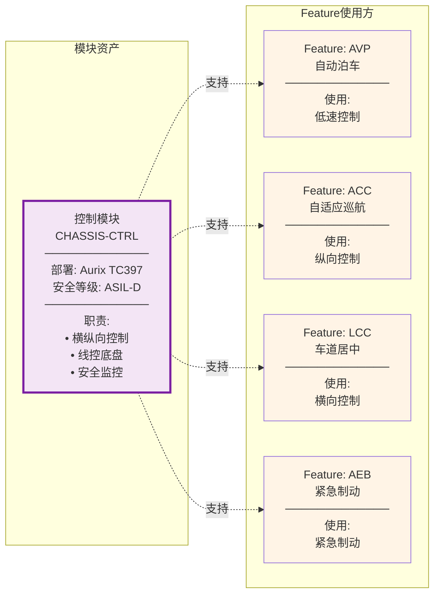

### 6.3 复用的价值分析

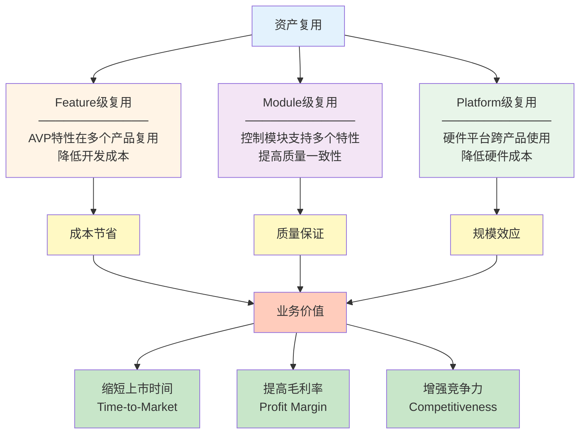

---

## 七、 AVP配置管理

### 7.1 基于硬件配置的Feature启用

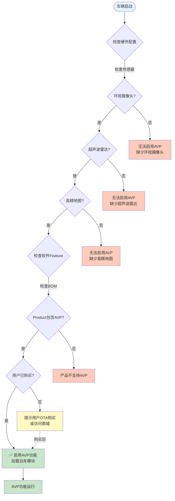

### 7.2 产品配置矩阵

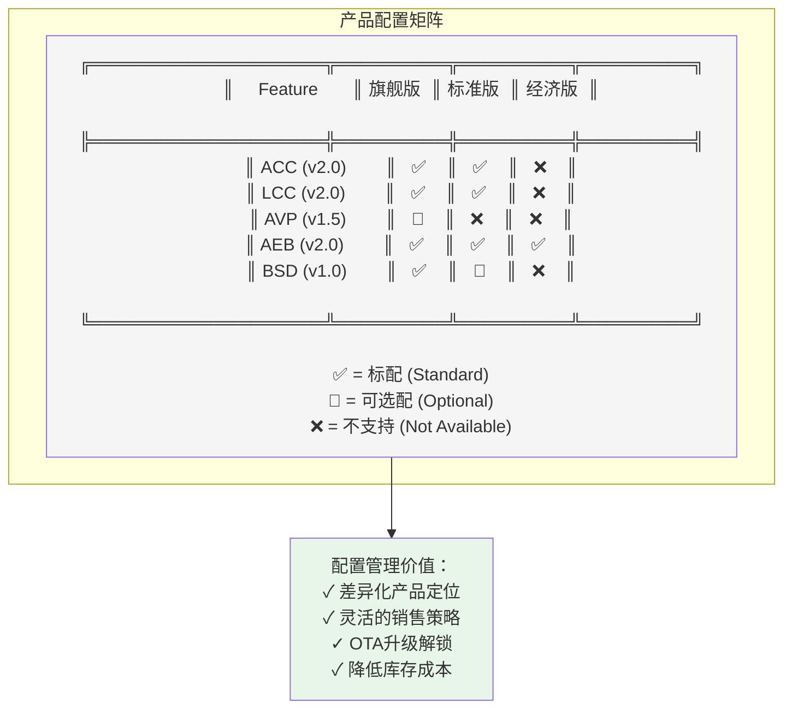

---

## 八、 关键技术细节

### 8.1 AVP算法流程

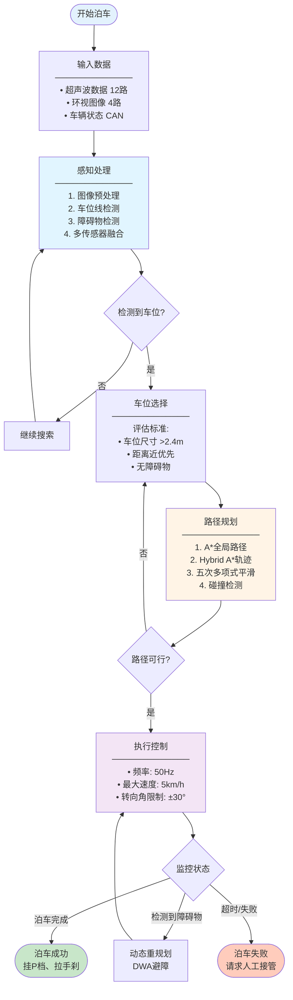

---

## 九、 总结

### 9.1 AVP案例覆盖的关键概念

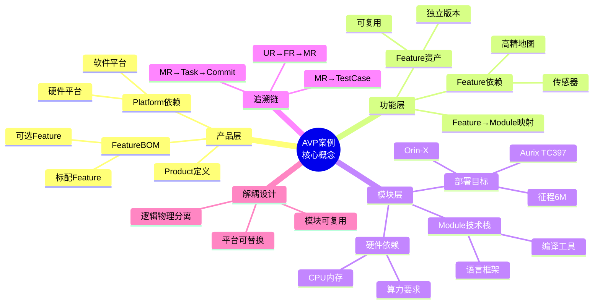

### 9.2 与当前实现的核心差距（可视化视角）

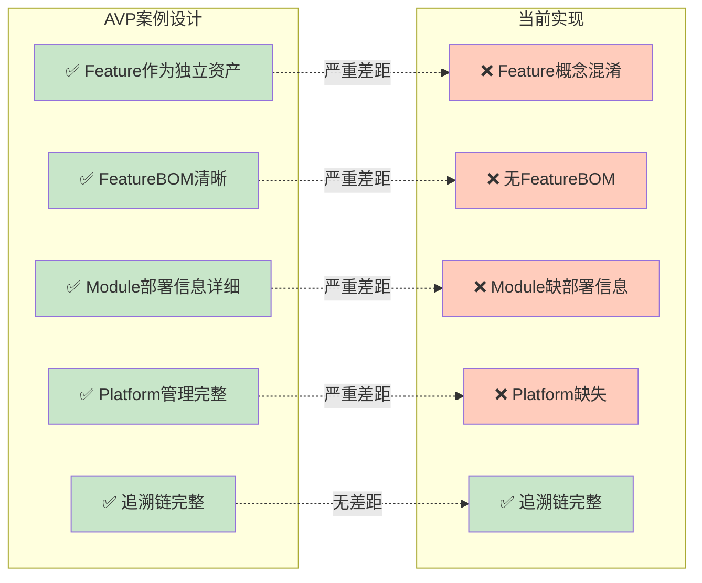

### 9.3 AVP案例的价值

1. **产品线工程** - 通过FeatureBOM实现差异化配置（旗舰版有AVP，标准版无）
2. **软硬件解耦** - 通过deploy_target实现平台迁移（Orin-X → Thor）
3. **模块复用** - 控制模块同时支持AVP、ACC、LCC
4. **完整追溯** - 从用户需求"一键泊车"到代码提交SHA的全链路
5. **配置管理** - 基于硬件配置动态启用Feature，支持OTA解锁

---

**相关文档**:
- [06-AVP_CASE_STUDY.md](./06-AVP_CASE_STUDY.md) - AVP案例详细文字描述
- [01-DOMAIN_MODEL_COMPARISON-visualization.md](./01-DOMAIN_MODEL_COMPARISON-visualization.md) - 领域模型对比可视化
- [05-IMPROVEMENT_PLAN.md](./05-IMPROVEMENT_PLAN.md) - 详细改进方案

