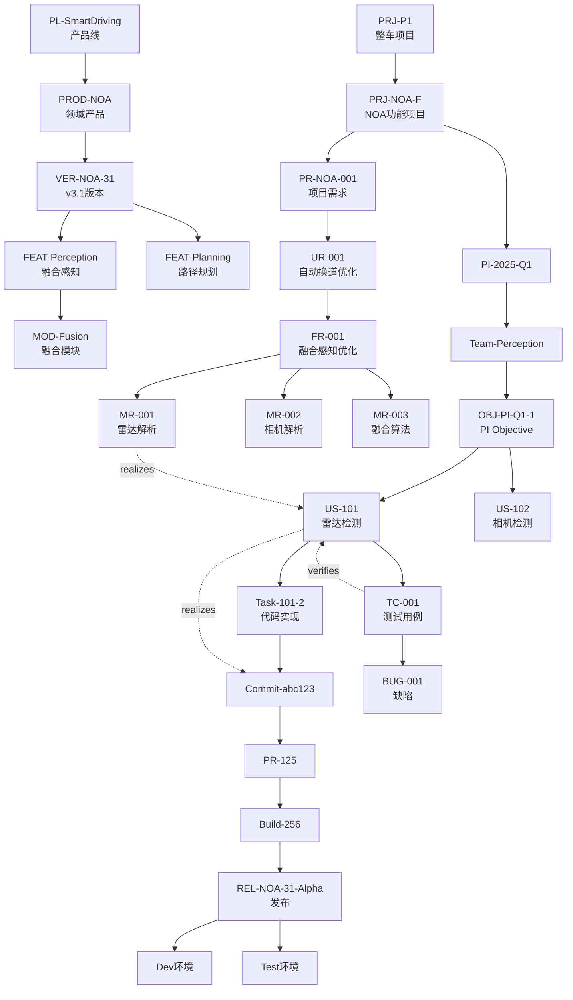

# NOA v3.1 - 完整业务数据实例

> **实例版本**: v3.1  
> **创建日期**: 2025-01-03  
> **用途**: 基于领域模型、价值流、业务架构的完整业务数据实例

---

## 📋 目录

1. [实例概述](#一实例概述)
2. [项目层数据](#二项目层数据)
3. [产品层数据](#三产品层数据)
4. [需求层数据](#四需求层数据)
5. [PI Planning数据](#五pi-planning数据)
6. [迭代研发数据](#六迭代研发数据)
7. [测试数据](#七测试数据)
8. [发布数据](#八发布数据)
9. [数据关系图](#九数据关系图)

---

## 一、实例概述

### 1.1 业务背景

**整车项目**: P1 - 2026款A级智能电动轿车  
**功能项目**: NOA功能项目  
**领域产品**: NOA (Navigation on Autopilot) 领域产品  
**产品版本**: v3.1

**业务目标**:
- 实现高速和城市场景的自动驾驶
- 支持自动换道、自动超车、自动避障
- 达到L2+级别自动驾驶能力

### 1.2 价值流阶段映射

本实例覆盖完整的9阶段价值流：

```
0. 项目立项 → 1. 产品规划 → 2. 需求分析 → 3. 项目协同规划 → 
4. PI Planning → 5. 迭代研发 → 6. 集成晋级 → 7. 测试验证 → 
8. 需求验收 → 9. 发布/交付
```

---

## 二、项目层数据

### 2.1 整车项目 (P1)

```typescript
interface Project {
  id: "PRJ-P1";
  name: "2026款A级智能电动轿车";
  type: "Vehicle"; // 整车项目
  status: "InProgress";
  startDate: "2024-01-01";
  targetDate: "2026-12-31";
  owner: "张总监";
  
  // 项目章程
  charter: {
    vision: "打造智能化、电动化的A级轿车标杆产品";
    objectives: [
      "实现L2+级别自动驾驶",
      "达到500km续航里程",
      "智能座舱体验业界领先"
    ];
    stakeholders: ["董事会", "产品总监", "技术总监", "市场部"];
  };
  
  // 关联产品
  products: ["PROD-NOA", "PROD-Powertrain", "PROD-Cockpit"];
  
  // 项目里程碑
  milestones: [
    {
      id: "MS-P1-M1";
      name: "产品定义完成";
      targetDate: "2024-06-30";
      status: "Completed";
    },
    {
      id: "MS-P1-M2";
      name: "工程样车下线";
      targetDate: "2025-06-30";
      status: "InProgress";
    },
    {
      id: "MS-P1-M3";
      name: "量产准备就绪";
      targetDate: "2026-06-30";
      status: "Planned";
    },
    {
      id: "MS-P1-M4";
      name: "SOP (Start of Production)";
      targetDate: "2026-12-31";
      status: "Planned";
    }
  ];
}
```

### 2.2 NOA功能项目 (NOA-PRJ)

```typescript
interface FunctionProject {
  id: "PRJ-NOA-F";
  name: "NOA功能项目";
  type: "Function"; // 功能项目
  status: "InProgress";
  parentProject: "PRJ-P1";
  
  // 关联产品
  product: "PROD-NOA";
  productVersion: "v3.1";
  
  // 项目需求
  requirements: ["PR-NOA-001", "PR-NOA-002", "PR-NOA-003"];
  
  // 项目团队
  teams: ["Team-Perception", "Team-Planning", "Team-Control"];
  
  // 项目PI
  pis: ["PI-2025-Q1", "PI-2025-Q2"];
}
```

---

## 三、产品层数据

### 3.1 产品线 (ProductLine)

```typescript
interface ProductLine {
  id: "PL-SmartDriving";
  name: "智能驾驶产品线";
  description: "包含ADAS、NOA、自动泊车等智能驾驶产品";
  
  // 产品线路线图
  roadmap: {
    "2024": ["NOA v2.0", "APA v1.0"],
    "2025": ["NOA v3.0", "City NOA v1.0", "APA v2.0"],
    "2026": ["NOA v4.0", "City NOA v2.0", "Full Autopilot v1.0"]
  };
  
  // 关联产品
  products: ["PROD-NOA", "PROD-APA", "PROD-CityNOA"];
}
```

### 3.2 领域产品 (DomainProduct)

```typescript
interface DomainProduct {
  id: "PROD-NOA";
  name: "NOA (Navigation on Autopilot)";
  productLine: "PL-SmartDriving";
  description: "高速和城市场景的自动驾驶功能";
  
  // 产品版本
  currentVersion: "v3.0";
  versions: [
    {
      id: "VER-NOA-30";
      version: "v3.0";
      releaseDate: "2024-12-31";
      status: "Released";
      features: ["高速NOA", "自动换道", "自动超车"];
    },
    {
      id: "VER-NOA-31";
      version: "v3.1";
      targetDate: "2025-06-30";
      status: "InDevelopment";
      features: ["高速NOA增强", "城市NOA基础", "智能避障"];
    }
  ];
  
  // 产品负责人
  owner: "李产品经理";
  
  // 产品特性
  features: ["FEAT-Perception", "FEAT-Planning", "FEAT-Control"];
}
```

### 3.3 领域特性 (DomainFeature)

#### 3.3.1 融合感知特性

```typescript
interface DomainFeature {
  id: "FEAT-Perception";
  name: "融合感知特性";
  product: "PROD-NOA";
  productVersion: "v3.1";
  
  description: "融合多传感器数据，实现环境感知";
  
  // 逻辑架构
  logicalArchitecture: {
    components: [
      "Sensor Fusion",
      "Object Detection",
      "Object Tracking",
      "Scene Understanding"
    ];
    interfaces: [
      {
        from: "Sensor Fusion",
        to: "Object Detection",
        type: "SensorData"
      },
      {
        from: "Object Detection",
        to: "Object Tracking",
        type: "DetectionResult"
      }
    ];
  };
  
  // 软件模块
  modules: ["MOD-Radar", "MOD-Camera", "MOD-Fusion"];
  
  // 特性负责人
  owner: "王特性负责人";
}
```

#### 3.3.2 路径规划特性

```typescript
interface DomainFeature {
  id: "FEAT-Planning";
  name: "路径规划特性";
  product: "PROD-NOA";
  productVersion: "v3.1";
  
  description: "基于感知结果，规划安全、舒适的行驶路径";
  
  logicalArchitecture: {
    components: [
      "Global Planner",
      "Local Planner",
      "Behavior Planner"
    ];
  };
  
  modules: ["MOD-GlobalPlanner", "MOD-LocalPlanner"];
  
  owner: "刘特性负责人";
}
```

#### 3.3.3 决策控制特性

```typescript
interface DomainFeature {
  id: "FEAT-Control";
  name: "决策控制特性";
  product: "PROD-NOA";
  productVersion: "v3.1";
  
  description: "基于规划结果，执行车辆控制";
  
  modules: ["MOD-LongControl", "MOD-LatControl"];
  
  owner: "陈特性负责人";
}
```

### 3.4 软件模块 (SoftwareModule)

```typescript
interface SoftwareModule {
  id: "MOD-Fusion";
  name: "融合感知算法模块";
  feature: "FEAT-Perception";
  
  description: "融合雷达、相机数据，输出目标列表";
  
  // 模块接口
  interfaces: {
    input: [
      {
        name: "RadarData";
        type: "RadarObjectList";
        source: "MOD-Radar";
      },
      {
        name: "CameraData";
        type: "CameraObjectList";
        source: "MOD-Camera";
      }
    ];
    output: [
      {
        name: "FusedObjects";
        type: "FusedObjectList";
        consumer: "MOD-LocalPlanner";
      }
    ];
  };
  
  // 部署配置
  deployment: {
    hardware: "Orin-X";
    os: "QNX";
    language: "C++";
  };
  
  // 模块负责人
  owner: "赵工程师";
}
```

---

## 四、需求层数据

### 4.1 项目需求 (ProjectRequirement)

```typescript
interface ProjectRequirement {
  id: "PR-NOA-001";
  title: "NOA v3.1版本交付";
  project: "PRJ-NOA-F";
  
  description: "完成NOA v3.1版本的开发和测试";
  
  // 关联用户需求
  userRequirements: ["UR-001", "UR-002", "UR-003"];
  
  // 验收标准
  acceptanceCriteria: [
    "高速NOA功能完整",
    "城市NOA基础功能可用",
    "系统性能达标"
  ];
}
```

### 4.2 用户需求 (UserRequirement)

```typescript
interface UserRequirement {
  id: "UR-001";
  title: "高速NOA自动换道优化";
  type: "功能需求";
  priority: "P0";
  
  projectRequirement: "PR-NOA-001";
  product: "PROD-NOA";
  productVersion: "v3.1";
  
  description: "优化高速NOA的自动换道功能，提升换道成功率和舒适性";
  
  // 干系人需求
  stakeholderNeeds: [
    "用户希望换道更加平顺",
    "用户希望换道决策更加智能"
  ];
  
  // 验收标准
  acceptanceCriteria: [
    "换道成功率 ≥ 95%",
    "换道平顺性评分 ≥ 4.5/5",
    "换道决策响应时间 < 500ms"
  ];
  
  // 创建信息
  creator: "李产品经理";
  createDate: "2024-12-01";
  
  // 评审状态
  reviewStatus: "Approved";
  reviewDate: "2024-12-05";
  reviewers: ["张系统工程师", "王架构师"];
  
  // 关联特性需求
  featureRequirements: ["FR-001"];
  
  // 追溯关系
  traces: {
    derivedFrom: "PR-NOA-001";
    realizedBy: ["FR-001"];
  };
}
```

### 4.3 特性需求 (FeatureRequirement)

```typescript
interface FeatureRequirement {
  id: "FR-001";
  title: "融合感知优化";
  type: "功能需求";
  priority: "P0";
  
  userRequirement: "UR-001";
  feature: "FEAT-Perception";
  
  description: "优化融合感知算法，提升目标检测精度和稳定性";
  
  // PRD文档
  prd: {
    id: "PRD-FR-001";
    title: "融合感知优化PRD";
    author: "张系统工程师";
    version: "v1.0";
    content: "详细的PRD内容...";
  };
  
  // 功能规格
  functionalSpec: {
    inputs: ["雷达数据", "相机数据"];
    outputs: ["融合目标列表"];
    processing: "融合算法优化";
    performance: "处理延迟 < 50ms";
  };
  
  // 评审状态
  reviewStatus: "Approved";
  
  // 关联模块需求
  moduleRequirements: ["MR-001", "MR-002", "MR-003"];
  
  // 追溯关系
  traces: {
    derivedFrom: "UR-001";
    realizedBy: ["MR-001", "MR-002", "MR-003"];
  };
}
```

### 4.4 模块需求 (ModuleRequirement)

```typescript
interface ModuleRequirement {
  id: "MR-001";
  title: "雷达数据解析优化";
  priority: "P0";
  
  featureRequirement: "FR-001";
  module: "MOD-Radar";
  
  description: "优化雷达数据解析算法，提升目标检测范围和精度";
  
  // 接口需求
  interfaceRequirement: {
    input: {
      name: "RawRadarData";
      format: "CAN Message";
      rate: "20Hz";
    };
    output: {
      name: "RadarObjectList";
      format: "Protobuf";
      maxObjects: 64;
    };
  };
  
  // 分配给开发团队
  assignedTeam: "Team-Perception";
  assignedTo: "赵工程师";
  
  // 估算
  storyPoints: 5;
  
  // 追溯关系
  traces: {
    derivedFrom: "FR-001";
    realizedBy: ["Story-US-101"];
  };
}
```

---

## 五、PI Planning数据

### 5.1 PI (Program Increment)

```typescript
interface PI {
  id: "PI-2025-Q1";
  name: "2025 Q1 PI";
  project: "PRJ-NOA-F";
  
  // PI时间范围
  startDate: "2025-01-06";
  endDate: "2025-03-28";
  duration: "12周";
  
  // 包含的Iteration
  iterations: [
    "Iteration-1 (2025-01-06 ~ 2025-01-19)",
    "Iteration-2 (2025-01-20 ~ 2025-02-02)",
    "Iteration-3 (2025-02-03 ~ 2025-02-16)",
    "Iteration-4 (2025-02-17 ~ 2025-03-02)",
    "Iteration-5 (2025-03-03 ~ 2025-03-16)",
    "Iteration-6 (2025-03-17 ~ 2025-03-28)"
  ];
  
  // 参与团队
  teams: [
    {
      id: "Team-Perception";
      name: "感知算法团队";
      capacity: 78; // Story Points
      members: 8;
    },
    {
      id: "Team-Planning";
      name: "路径规划团队";
      capacity: 58;
      members: 6;
    },
    {
      id: "Team-Control";
      name: "决策控制团队";
      capacity: 68;
      members: 7;
    }
  ];
  
  // PI Objectives
  objectives: [
    {
      id: "OBJ-PI-Q1-1";
      team: "Team-Perception";
      description: "完成融合感知算法优化";
      businessValue: 10;
      stories: ["US-101", "US-102", "US-103"];
    },
    {
      id: "OBJ-PI-Q1-2";
      team: "Team-Planning";
      description: "完成路径规划优化";
      businessValue: 8;
      stories: ["US-201", "US-202"];
    }
  ];
  
  // 依赖
  dependencies: [
    {
      id: "DEP-001";
      from: {team: "Team-Planning", story: "US-201"};
      to: {team: "Team-Perception", story: "US-103"};
      type: "Interface";
      status: "Resolved";
    }
  ];
  
  // 风险
  risks: [
    {
      id: "RISK-001";
      description: "新硬件到货延迟";
      probability: "Medium";
      impact: "High";
      mitigation: "使用模拟器开发";
      roam: "Accept";
    }
  ];
  
  // 置信度投票
  confidenceVote: {
    average: 4.2;
    distribution: {
      "5": 12,
      "4": 8,
      "3": 1,
      "2": 0,
      "1": 0
    };
  };
  
  // PI状态
  status: "InProgress";
}
```

### 5.2 团队规划

```typescript
interface TeamPlanning {
  pi: "PI-2025-Q1";
  team: "Team-Perception";
  
  // 容量规划
  capacity: {
    totalMembers: 8;
    availableMembers: 7.5; // 考虑休假
    spPerMember: 13;
    totalSP: 78;
  };
  
  // Iteration规划
  iterations: [
    {
      iteration: 1;
      stories: ["US-101", "US-102"];
      totalSP: 13;
    },
    {
      iteration: 2;
      stories: ["US-103", "US-104"];
      totalSP: 16;
    },
    // ...
  ];
}
```

---

## 六、迭代研发数据

### 6.1 Sprint (Iteration)

```typescript
interface Sprint {
  id: "Sprint-1";
  name: "PI-2025-Q1 Iteration 1";
  pi: "PI-2025-Q1";
  team: "Team-Perception";
  
  // Sprint时间
  startDate: "2025-01-06";
  endDate: "2025-01-19";
  duration: "2周";
  
  // Sprint目标
  goal: "完成融合感知算法基础优化";
  
  // Sprint Backlog
  stories: ["US-101", "US-102"];
  totalSP: 13;
  
  // Sprint状态
  status: "InProgress";
  completedSP: 8;
  remainingSP: 5;
  
  // 燃尽数据
  burndown: [
    {date: "2025-01-06", remaining: 13},
    {date: "2025-01-08", remaining: 11},
    {date: "2025-01-10", remaining: 8},
    {date: "2025-01-13", remaining: 5},
    // ...
  ];
}
```

### 6.2 User Story

```typescript
interface UserStory {
  id: "US-101";
  title: "优化雷达目标检测算法";
  
  // Story内容
  asA: "开发工程师";
  iWant: "优化雷达目标检测算法";
  soThat: "提升目标检测精度和范围";
  
  // Story属性
  priority: "P0";
  storyPoints: 5;
  sprint: "Sprint-1";
  assignedTo: "赵工程师";
  
  // 验收标准
  acceptanceCriteria: [
    "检测范围扩展到200m",
    "检测精度提升到95%",
    "处理延迟 < 50ms",
    "单元测试覆盖率 ≥ 80%"
  ];
  
  // Story状态
  status: "InProgress";
  
  // Tasks
  tasks: [
    {
      id: "Task-101-1";
      title: "算法设计";
      assignedTo: "赵工程师";
      estimateHours: 8;
      status: "Done";
    },
    {
      id: "Task-101-2";
      title: "代码实现";
      assignedTo: "赵工程师";
      estimateHours: 16;
      status: "InProgress";
    },
    {
      id: "Task-101-3";
      title: "单元测试";
      assignedTo: "赵工程师";
      estimateHours: 8;
      status: "Todo";
    }
  ];
  
  // 关联需求
  moduleRequirement: "MR-001";
  
  // 追溯关系
  traces: {
    derivedFrom: "MR-001";
    realizedBy: ["Commit-abc123", "Build-256"];
  };
}
```

### 6.3 代码提交 (Commit)

```typescript
interface Commit {
  id: "Commit-abc123";
  sha: "abc123def456";
  message: "feat: 优化雷达目标检测算法";
  author: "赵工程师";
  date: "2025-01-10T10:30:00Z";
  
  // 关联Story
  story: "US-101";
  
  // 分支
  branch: "feature/us-101-radar-detection";
  
  // PR
  pullRequest: "PR-125";
  
  // 追溯关系
  traces: {
    realizes: "US-101";
    triggeredBuild: "Build-256";
  };
}
```

### 6.4 Pull Request

```typescript
interface PullRequest {
  id: "PR-125";
  title: "feat: 优化雷达目标检测算法";
  author: "赵工程师";
  sourceBranch: "feature/us-101-radar-detection";
  targetBranch: "develop";
  
  // PR状态
  status: "Approved";
  reviewers: ["王特性负责人", "李高级工程师"];
  
  // 评审意见
  reviews: [
    {
      reviewer: "王特性负责人";
      status: "Approved";
      comment: "代码逻辑清晰，建议优化性能";
      date: "2025-01-11T14:00:00Z";
    },
    {
      reviewer: "李高级工程师";
      status: "Approved";
      comment: "LGTM, 已验证功能";
      date: "2025-01-11T15:00:00Z";
    }
  ];
  
  // 自动检查
  checks: {
    build: "Pass";
    unitTest: "Pass";
    codeQuality: "A";
    coverage: "82%";
  };
  
  // 合并信息
  merged: true;
  mergedBy: "赵工程师";
  mergedDate: "2025-01-11T16:00:00Z";
}
```

### 6.5 构建 (Build)

```typescript
interface Build {
  id: "Build-256";
  number: 256;
  commitSha: "abc123def456";
  branch: "develop";
  
  // 构建状态
  status: "Success";
  startTime: "2025-01-11T16:05:00Z";
  endTime: "2025-01-11T16:25:00Z";
  duration: "20m";
  
  // 构建结果
  artifacts: [
    {
      name: "noa-perception.elf";
      size: "15MB";
      path: "build/output/noa-perception.elf";
    }
  ];
  
  // 测试结果
  testResults: {
    unitTests: {
      total: 125,
      passed: 123,
      failed: 2,
      coverage: "82%"
    };
  };
  
  // 触发器
  triggeredBy: "PR-125-Merge";
  
  // 追溯关系
  traces: {
    fromCommit: "Commit-abc123";
    deployedTo: ["Env-Dev", "Env-Test"];
  };
}
```

---

## 七、测试数据

### 7.1 测试用例 (TestCase)

```typescript
interface TestCase {
  id: "TC-001";
  title: "雷达目标检测精度测试";
  type: "功能测试";
  priority: "P0";
  
  // 关联需求
  requirement: "MR-001";
  story: "US-101";
  
  // 测试步骤
  steps: [
    {
      step: 1,
      action: "启动雷达数据模拟器";
      expected: "模拟器正常启动";
    },
    {
      step: 2,
      action: "输入测试场景数据";
      expected: "系统接收到雷达数据";
    },
    {
      step: 3,
      action: "执行目标检测";
      expected: "检测到所有目标（≥95%精度）";
    }
  ];
  
  // 测试数据
  testData: {
    scenario: "高速场景-多目标";
    objects: 15;
    distance: "0-200m";
  };
  
  // 测试结果
  lastExecution: {
    date: "2025-01-12T10:00:00Z";
    tester: "孙测试工程师";
    status: "Passed";
    actualResult: "检测到14/15个目标，精度93.3%";
    buildVersion: "Build-256";
  };
  
  // 追溯关系
  traces: {
    verifies: "US-101";
  };
}
```

### 7.2 缺陷 (Defect)

```typescript
interface Defect {
  id: "BUG-001";
  title: "雷达目标丢失";
  severity: "P1";
  status: "Fixed";
  
  // 缺陷描述
  description: "在远距离目标检测时，偶尔出现目标丢失";
  
  // 复现步骤
  reproduceSteps: [
    "启动系统",
    "输入远距离目标数据（150m+）",
    "观察目标列表"
  ];
  
  // 关联信息
  testCase: "TC-001";
  story: "US-101";
  module: "MOD-Radar";
  
  // 缺陷分配
  assignedTo: "赵工程师";
  foundBy: "孙测试工程师";
  foundDate: "2025-01-12T10:30:00Z";
  
  // 修复信息
  fixCommit: "Commit-def789";
  fixedDate: "2025-01-13T15:00:00Z";
  verifiedDate: "2025-01-13T17:00:00Z";
  
  // 根因分析
  rootCause: "距离阈值设置过小";
  solution: "调整距离阈值到200m";
}
```

### 7.3 测试报告 (TestReport)

```typescript
interface TestReport {
  id: "TR-Sprint-1";
  name: "Sprint 1 测试报告";
  sprint: "Sprint-1";
  
  // 报告周期
  startDate: "2025-01-06";
  endDate: "2025-01-19";
  
  // 测试统计
  statistics: {
    totalTestCases: 25;
    executed: 23;
    passed: 21;
    failed: 2;
    blocked: 0;
    passRate: "91.3%";
  };
  
  // 需求覆盖率
  requirementCoverage: {
    totalRequirements: 10;
    covered: 9;
    coverageRate: "90%";
  };
  
  // 缺陷统计
  defects: {
    total: 5;
    p0: 0;
    p1: 2;
    p2: 2;
    p3: 1;
    fixed: 3;
    open: 2;
  };
  
  // 测试结论
  conclusion: "基本达到Sprint目标，存在2个P1缺陷需要修复";
  recommendation: "建议下个Sprint优先修复P1缺陷";
}
```

---

## 八、发布数据

### 8.1 发布 (Release)

```typescript
interface Release {
  id: "REL-NOA-31-Alpha";
  name: "NOA v3.1 Alpha版本";
  project: "PRJ-NOA-F";
  productVersion: "v3.1-alpha";
  
  // 发布类型
  type: "Alpha"; // Alpha, Beta, RC, GA
  
  // 发布内容
  features: ["融合感知优化", "路径规划优化"];
  stories: ["US-101", "US-102", "US-103", "US-201", "US-202"];
  
  // 构建信息
  build: "Build-280";
  artifacts: [
    {
      name: "noa-v3.1-alpha.tar.gz";
      size: "250MB";
      md5: "abc123...";
    }
  ];
  
  // 发布计划
  plannedDate: "2025-01-20";
  actualDate: "2025-01-20";
  
  // 环境晋级
  deployments: [
    {
      environment: "Dev";
      date: "2025-01-15";
      status: "Success";
    },
    {
      environment: "Test";
      date: "2025-01-18";
      status: "Success";
    },
    {
      environment: "PreProd";
      date: "2025-01-20";
      status: "InProgress";
    }
  ];
  
  // 发布负责人
  releaseManager: "李产品经理";
  
  // 发布状态
  status: "InProgress";
}
```

### 8.2 环境 (Environment)

```typescript
interface Environment {
  name: "Test";
  type: "测试环境";
  
  // 环境配置
  hardware: "Orin-X开发板";
  os: "QNX 7.1";
  
  // 当前版本
  currentVersion: "v3.1-alpha";
  deployedDate: "2025-01-18";
  
  // 环境状态
  status: "Running";
  healthCheck: {
    cpu: "45%";
    memory: "60%";
    disk: "30%";
  };
}
```

---

## 九、数据关系图

### 9.1 完整追溯链

```
项目层:
  PRJ-P1 (整车项目)
    └─ PRJ-NOA-F (NOA功能项目)
       └─ PR-NOA-001 (项目需求)

产品层:
  PL-SmartDriving (产品线)
    └─ PROD-NOA (领域产品)
       └─ VER-NOA-31 (v3.1版本)
          ├─ FEAT-Perception (融合感知特性)
          │  └─ MOD-Fusion (融合感知模块)
          ├─ FEAT-Planning (路径规划特性)
          └─ FEAT-Control (决策控制特性)

需求层:
  PR-NOA-001 (项目需求)
    └─ UR-001 (用户需求: 高速NOA自动换道优化)
       └─ FR-001 (特性需求: 融合感知优化)
          ├─ MR-001 (模块需求: 雷达数据解析)
          ├─ MR-002 (模块需求: 相机数据解析)
          └─ MR-003 (模块需求: 融合算法优化)

PI Planning层:
  PI-2025-Q1
    └─ Team-Perception
       ├─ OBJ-PI-Q1-1 (PI Objective)
       │  ├─ US-101 (Story: 优化雷达检测)
       │  ├─ US-102 (Story: 优化相机检测)
       │  └─ US-103 (Story: 优化融合算法)
       └─ Sprint-1 (Iteration 1)
          ├─ US-101
          └─ US-102

开发层:
  US-101 (Story)
    ├─ Task-101-1 (算法设计)
    ├─ Task-101-2 (代码实现)
    │  └─ Commit-abc123
    │     └─ PR-125
    │        └─ Build-256
    └─ Task-101-3 (单元测试)

测试层:
  US-101
    ├─ TC-001 (测试用例)
    │  └─ BUG-001 (缺陷)
    │     └─ Commit-def789 (修复)
    └─ TR-Sprint-1 (测试报告)

发布层:
  Build-280 (集成构建)
    └─ REL-NOA-31-Alpha (发布)
       ├─ Deploy-Dev (开发环境)
       ├─ Deploy-Test (测试环境)
       └─ Deploy-PreProd (预生产环境)
```

### 9.2 Mermaid关系图



---

## 十、总结

### 10.1 数据完整性

本实例包含了完整的端到端数据：

- ✅ **项目层数据** - 整车项目、NOA功能项目、项目需求
- ✅ **产品层数据** - 产品线、领域产品、领域特性、软件模块
- ✅ **需求层数据** - 项目需求、用户需求、特性需求、模块需求
- ✅ **PI Planning数据** - PI、团队规划、Objectives、依赖、风险
- ✅ **迭代研发数据** - Sprint、Story、Task、Commit、PR、Build
- ✅ **测试数据** - 测试用例、缺陷、测试报告
- ✅ **发布数据** - 发布、环境、部署

### 10.2 追溯完整性

- ✅ **正向追溯** - 从项目需求到代码实现完整可追溯
- ✅ **反向追溯** - 从代码到需求完整可追溯
- ✅ **影响分析** - 可以分析需求变更的影响范围

### 10.3 与设计的匹配度

- ✅ **领域模型100%应用** - 所有实体和关系都有实例
- ✅ **价值流100%覆盖** - 9个阶段全部有数据
- ✅ **业务架构匹配** - 角色、流程、协同点都有体现

---

**文档创建日期**: 2025-01-03  
**文档状态**: ✅ 完成  
**下一步**: 基于此数据进行平台原型演示

