# Auto DevOps平台 - 研发价值流设计

> **文档版本**: v1.0  
> **创建日期**: 2025-01-02  
> **目标**: 完整的研发价值流映射，包含主干和所有分支流程

---

## 📋 目录

1. [价值流概述](#一价值流概述)
2. [主干价值流](#二主干价值流)
3. [分支价值流](#三分支价值流)
4. [价值流与功能映射](#四价值流与功能映射)
5. [价值流与页面映射](#五价值流与页面映射)
6. [价值流度量](#六价值流度量)

---

## 一、价值流概述

### 1.1 什么是研发价值流

研发价值流是指从**需求产生**到**价值交付**的完整过程，包含所有增值和非增值活动。

### 1.2 价值流全景图

```
                                    Auto DevOps 研发价值流（完整版）
┌────────────────────────────────────────────────────────────────────────────────────────────────┐
│                                                                                                 │
│  战略规划 → PI Planning → 需求输入 → 需求分析 → 资产规划 → 方案设计 → 开发实现 → 测试验证 → 发布交付   │
│     ↓          ↓           ↓          ↓          ↓          ↓          ↓          ↓          ↓    │
│  路线图    多项目协同   变更管理   影响分析   复用分析   技术评审   代码审查   缺陷管理   监控运维    │
│                                                                                                 │
└────────────────────────────────────────────────────────────────────────────────────────────────┘

L0: 战略规划（12-24个月）- 产品线路线图、产品版本规划
L0A: PI Planning（8-12周）- 多项目协同、团队规划、依赖管理 ⭐ 承上启下
L1-L7: 执行阶段（2-4周）- 需求到交付的端到端流程

主干流程（Happy Path）：绿色通道，无阻塞
分支流程（Alternative）：处理异常、变更、优化
```

### 1.3 价值流层次

```yaml
L0: 战略价值流（新增）
  - 产品线规划 → 产品版本定义 → 路线图发布
  - 时间跨度: 12-24个月
  - 度量指标: 产品上市时间、市场份额、路线图实现率
  - 负责角色: 产品线经理、架构师

L0A: PI价值流（新增）⭐ 承上启下关键环节
  - 产品版本计划 → PI Planning → 团队迭代计划
  - 时间跨度: 8-12周（1个PI）
  - 度量指标: PI目标达成率、依赖解决率、团队信心度
  - 负责角色: 产品经理、团队负责人、架构师
  - 核心活动: 多项目对齐、容量规划、依赖识别、风险管理

L1: 产品价值流
  - 需求收集 → 产品开发 → 产品发布
  - 时间跨度: 3-6个月（多个PI）
  - 度量指标: 交付周期、客户满意度

L2: 特性价值流
  - 特性需求 → 特性开发 → 特性验证
  - 时间跨度: 2-8周（1-2个Sprint）
  - 度量指标: Lead Time、Cycle Time

L3: 任务价值流
  - 任务分配 → 编码实现 → 代码合并
  - 时间跨度: 1-5天
  - 度量指标: 任务完成时间、代码质量
```

---

## 二、主干价值流

### 2.1 主干价值流全景


### 2.2 阶段1: 需求输入

#### 价值流活动图

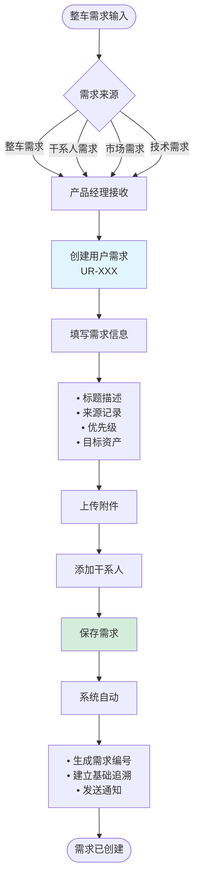

#### 功能点映射

| 活动节点 | 功能模块 | 功能点 | 页面/操作 |
|---------|---------|-------|----------|
| 创建用户需求 | F007-用户需求管理 | 创建需求 | `/requirements/user/create` |
| 填写需求信息 | F007-用户需求管理 | 需求表单 | 表单组件 `RequirementForm` |
| 上传附件 | F007-用户需求管理 | 附件管理 | 文件上传组件 `FileUpload` |
| 添加干系人 | F007-用户需求管理 | 干系人管理 | 人员选择组件 `UserSelect` |
| 生成编号 | F007-用户需求管理 | 编号生成规则 | 后端服务 `RequirementService.generateCode()` |
| 发送通知 | F015-通知消息 | 消息推送 | 通知服务 `NotificationService.send()` |

#### 页面设计

**页面**: 创建用户需求
- **路由**: `/requirements/user/create`
- **组件**: `UserRequirementCreatePage`
- **关键元素**:
  - 需求表单（标题、来源、描述、优先级）
  - 富文本编辑器
  - 文件上传区
  - 干系人选择器
  - 保存按钮

#### 时间度量

| 指标 | 目标值 | 当前值 | 优化方向 |
|------|--------|--------|----------|
| 需求创建时间 | < 15分钟 | - | 表单预填充、模板复用 |
| 等待审批时间 | < 2小时 | - | 自动路由、实时通知 |
| 价值流效率 | > 80% | - | 减少等待时间 |

---

### 2.3 阶段2: 需求分析

#### 价值流活动图

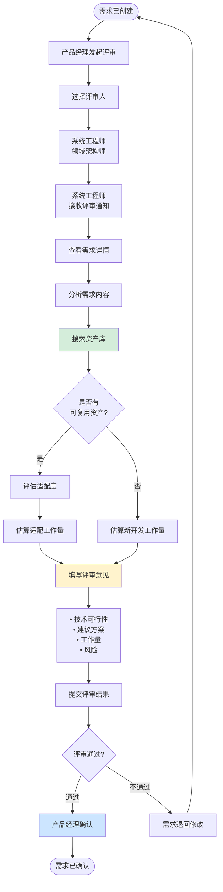

#### 功能点映射

| 活动节点 | 功能模块 | 功能点 | 页面/操作 |
|---------|---------|-------|----------|
| 发起评审 | F007-用户需求管理 | 需求评审 | `/requirements/user/:id/review` |
| 搜索资产库 | F005-资产库管理 | 资产检索 | `/assets/search` |
| 评估适配度 | F005-资产库管理 | 资产评估 | 评估工具 `AssetEvaluator` |
| 填写评审意见 | F013-评审管理 | 评审表单 | `/reviews/:id/submit` |
| 确认评审 | F007-用户需求管理 | 评审确认 | 详情页操作按钮 |

#### 页面设计

**页面1**: 需求评审发起
- **路由**: `/requirements/user/:id/review`
- **组件**: `RequirementReviewInitiate`

**页面2**: 资产检索
- **路由**: `/assets/search`
- **组件**: `AssetSearchPage`
- **关键元素**:
  - 搜索框（关键词、类型、领域）
  - 资产列表（卡片展示）
  - 资产详情面板
  - 适配度评分

**页面3**: 评审意见提交
- **路由**: `/reviews/:id/submit`
- **组件**: `ReviewSubmitForm`

#### 时间度量

| 指标 | 目标值 | 当前值 | 优化方向 |
|------|--------|--------|----------|
| 资产检索时间 | < 5分钟 | - | 智能推荐、相似度算法 |
| 评审填写时间 | < 30分钟 | - | 评审模板、历史复用 |
| 评审审批时间 | < 1天 | - | 并行评审、快速通道 |
| 价值流效率 | > 70% | - | 减少等待和返工 |

---

### 2.4 阶段3: 资产规划

#### 价值流活动图

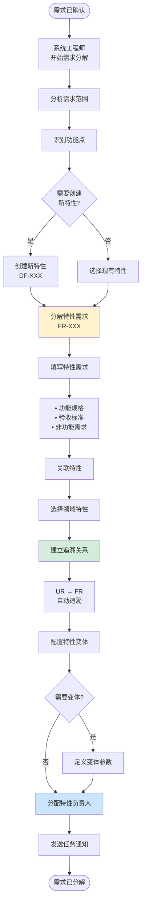

#### 功能点映射

| 活动节点 | 功能模块 | 功能点 | 页面/操作 |
|---------|---------|-------|----------|
| 分析需求 | F007-用户需求管理 | 需求详情 | `/requirements/user/:id` |
| 创建新特性 | F003-领域特性管理 | 特性创建 | `/features/create` |
| 分解需求 | F008-特性需求管理 | 需求分解 | `/requirements/feature/create` |
| 关联特性 | F008-特性需求管理 | 特性关联 | 选择器组件 |
| 建立追溯 | F010-需求追溯管理 | 自动追溯 | 后端服务 `TraceService` |
| 配置变体 | F003-领域特性管理 | 变体管理 | `/features/:id/variants` |
| 分配负责人 | F008-特性需求管理 | 任务分配 | 分配组件 `TaskAssign` |

#### 页面设计

**页面1**: 需求分解向导
- **路由**: `/requirements/user/:id/decompose`
- **组件**: `RequirementDecomposeWizard`
- **步骤**:
  1. 分析需求范围
  2. 选择/创建特性
  3. 填写特性需求
  4. 配置变体（可选）
  5. 分配负责人

**页面2**: 特性需求创建
- **路由**: `/requirements/feature/create`
- **组件**: `FeatureRequirementForm`

**页面3**: 追溯关系视图
- **路由**: `/traceability/:id`
- **组件**: `TraceabilityView`
- **展示**: 树形结构 UR → FR → MR

#### 时间度量

| 指标 | 目标值 | 当前值 | 优化方向 |
|------|--------|--------|----------|
| 需求分解时间 | < 2小时 | - | 分解模板、智能建议 |
| 特性选择时间 | < 30分钟 | - | 智能推荐 |
| 追溯建立时间 | < 1分钟 | - | 自动化 |
| 价值流效率 | > 85% | - | 自动化操作 |

---

### 2.5 阶段4: 方案设计

#### 价值流活动图

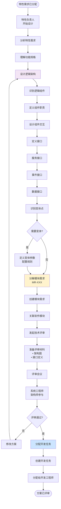

#### 功能点映射

| 活动节点 | 功能模块 | 功能点 | 页面/操作 |
|---------|---------|-------|----------|
| 查看特性需求 | F008-特性需求管理 | 需求详情 | `/requirements/feature/:id` |
| 设计架构 | F003-领域特性管理 | 架构设计 | `/features/:id/architecture` |
| 定义接口 | F004-软件模块管理 | 接口管理 | `/modules/:id/interfaces` |
| 定义变体 | F003-领域特性管理 | 变体点管理 | `/features/:id/variability` |
| 分解模块需求 | F009-模块需求管理 | 需求创建 | `/requirements/module/create` |
| 发起评审 | F013-评审管理 | 技术评审 | `/reviews/technical/create` |
| 分配任务 | F012-任务管理 | 任务创建分配 | `/tasks/create` |

#### 页面设计

**页面1**: 架构设计画布
- **路由**: `/features/:id/architecture`
- **组件**: `ArchitectureDesignCanvas`
- **功能**:
  - 拖拽式组件设计
  - 连接线表示交互
  - 接口定义面板
  - 导出架构图

**页面2**: 模块需求创建
- **路由**: `/requirements/module/create`
- **组件**: `ModuleRequirementForm`

**页面3**: 技术评审
- **路由**: `/reviews/technical/:id`
- **组件**: `TechnicalReviewPage`
- **功能**:
  - 查看评审材料
  - 在线评审讨论
  - 提交评审意见
  - 评审决策

#### 时间度量

| 指标 | 目标值 | 当前值 | 优化方向 |
|------|--------|--------|----------|
| 方案设计时间 | < 3天 | - | 设计模板、参考架构 |
| 接口定义时间 | < 4小时 | - | 接口模板、自动生成 |
| 评审准备时间 | < 2小时 | - | 自动生成评审材料 |
| 评审会议时间 | < 2小时 | - | 提前审阅、聚焦讨论 |
| 价值流效率 | > 75% | - | 减少返工 |

---

### 2.6 阶段5: 开发实现

#### 价值流活动图

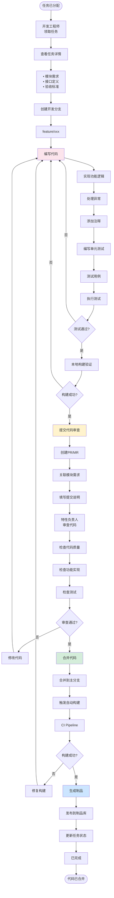

#### 功能点映射

| 活动节点 | 功能模块 | 功能点 | 页面/操作 |
|---------|---------|-------|----------|
| 查看任务 | F012-任务管理 | 任务详情 | `/tasks/:id` |
| 查看需求 | F009-模块需求管理 | 需求详情 | `/requirements/module/:id` |
| 代码管理 | F017-配置管理 | Git操作 | Git集成 |
| 提交PR | F017-配置管理 | 代码审查 | `/pull-requests/create` |
| 审查代码 | F017-配置管理 | 代码审查 | `/pull-requests/:id` |
| 触发构建 | F018-构建管理 | 自动构建 | CI/CD Pipeline |
| 查看构建 | F018-构建管理 | 构建详情 | `/builds/:id` |
| 更新任务 | F012-任务管理 | 状态更新 | 任务操作 |

#### 页面设计

**页面1**: 我的任务
- **路由**: `/tasks/my`
- **组件**: `MyTasksPage`
- **功能**:
  - 任务列表（待办、进行中、已完成）
  - 过滤和排序
  - 快速操作

**页面2**: 任务详情
- **路由**: `/tasks/:id`
- **组件**: `TaskDetailPage`
- **功能**:
  - 任务信息
  - 关联需求（点击跳转）
  - 代码提交列表
  - 讨论评论
  - 状态更新

**页面3**: 代码审查
- **路由**: `/pull-requests/:id`
- **组件**: `PullRequestReviewPage`
- **功能**:
  - 代码diff展示
  - 行内评论
  - 代码质量报告
  - 审查决策（批准/拒绝/请求修改）

**页面4**: 构建详情
- **路由**: `/builds/:id`
- **组件**: `BuildDetailPage`
- **功能**:
  - 构建状态
  - 构建日志
  - 测试报告
  - 制品下载

#### 时间度量

| 指标 | 目标值 | 当前值 | 优化方向 |
|------|--------|--------|----------|
| 编码时间 | 2-5天/任务 | - | 代码生成、模板复用 |
| 单元测试时间 | 20%编码时间 | - | 测试框架、Mock工具 |
| 代码审查时间 | < 4小时 | - | 自动化检查、重点审查 |
| 构建时间 | < 10分钟 | - | 增量构建、并行编译 |
| 价值流效率 | > 80% | - | 减少等待和返工 |

---

### 2.7 阶段6: 测试验证

#### 价值流活动图

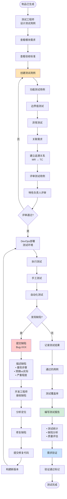

#### 功能点映射

| 活动节点 | 功能模块 | 功能点 | 页面/操作 |
|---------|---------|-------|----------|
| 查看需求 | F009-模块需求管理 | 需求详情 | `/requirements/module/:id` |
| 创建用例 | F019-测试管理 | 用例管理 | `/test-cases/create` |
| 关联需求 | F010-需求追溯管理 | 追溯建立 | 用例表单 |
| 评审用例 | F013-评审管理 | 用例评审 | `/reviews/test-case/:id` |
| 部署环境 | F020-发布管理 | 环境部署 | `/environments/:env/deploy` |
| 执行测试 | F019-测试管理 | 测试执行 | `/test-executions/:id` |
| 提交缺陷 | F019-测试管理 | 缺陷管理 | `/bugs/create` |
| 修复缺陷 | F019-测试管理 | 缺陷跟踪 | `/bugs/:id` |
| 测试报告 | F019-测试管理 | 报告生成 | `/test-reports/:id` |

#### 页面设计

**页面1**: 测试用例管理
- **路由**: `/test-cases`
- **组件**: `TestCaseListPage`
- **功能**:
  - 用例列表
  - 创建/编辑用例
  - 批量操作
  - 导入导出

**页面2**: 测试执行
- **路由**: `/test-executions/:planId`
- **组件**: `TestExecutionPage`
- **功能**:
  - 用例执行列表
  - 执行结果记录
  - 快速提缺陷
  - 进度跟踪

**页面3**: 缺陷管理
- **路由**: `/bugs`
- **组件**: `BugManagementPage`
- **功能**:
  - 缺陷列表（按状态）
  - 缺陷看板
  - 缺陷详情
  - 缺陷流转

**页面4**: 测试报告
- **路由**: `/test-reports/:id`
- **组件**: `TestReportPage`
- **功能**:
  - 测试摘要
  - 用例统计
  - 缺陷统计
  - 质量评估
  - 导出报告

#### 时间度量

| 指标 | 目标值 | 当前值 | 优化方向 |
|------|--------|--------|----------|
| 用例设计时间 | 1天/特性 | - | 用例模板、自动生成 |
| 手工测试时间 | 2-3天/特性 | - | 自动化测试 |
| 自动化测试时间 | < 30分钟 | - | 并行执行、优化脚本 |
| 缺陷修复时间 | P0:4h, P1:1d, P2:3d | - | 快速定位、减少缺陷 |
| 价值流效率 | > 70% | - | 自动化、左移测试 |

---

### 2.8 阶段7: 发布交付

#### 价值流活动图

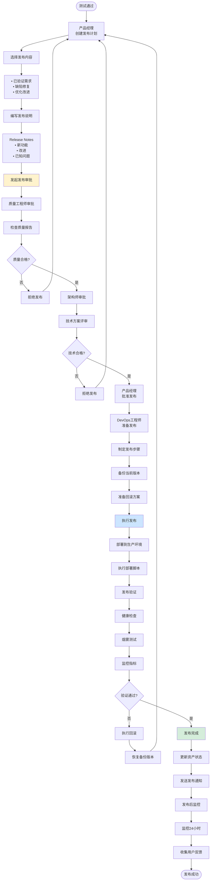

#### 功能点映射

| 活动节点 | 功能模块 | 功能点 | 页面/操作 |
|---------|---------|-------|----------|
| 创建发布计划 | F020-发布管理 | 发布计划 | `/releases/create` |
| 发起审批 | F020-发布管理 | 审批流程 | `/releases/:id/approve` |
| 质量审批 | F023-质量分析 | 质量检查 | 审批页面 |
| 技术审批 | F020-发布管理 | 技术审批 | 审批页面 |
| 准备发布 | F020-发布管理 | 发布准备 | `/releases/:id/prepare` |
| 执行发布 | F020-发布管理 | 部署执行 | `/releases/:id/deploy` |
| 发布验证 | F020-发布管理 | 验证检查 | 验证面板 |
| 回滚 | F020-发布管理 | 回滚操作 | `/releases/:id/rollback` |
| 发布监控 | F021-监控运维 | 监控大屏 | `/monitoring/dashboard` |

#### 页面设计

**页面1**: 发布计划
- **路由**: `/releases/create`
- **组件**: `ReleaseCreatePage`
- **功能**:
  - 选择发布内容
  - 编写发布说明
  - 设置发布时间
  - 配置发布策略（全量/灰度）

**页面2**: 发布审批
- **路由**: `/releases/:id/approve`
- **组件**: `ReleaseApprovePage`
- **功能**:
  - 查看发布计划
  - 查看质量报告
  - 查看测试报告
  - 审批决策

**页面3**: 发布执行
- **路由**: `/releases/:id/deploy`
- **组件**: `ReleaseDeployPage`
- **功能**:
  - 发布步骤展示
  - 实时日志
  - 进度跟踪
  - 异常告警
  - 快速回滚按钮

**页面4**: 发布监控
- **路由**: `/releases/:id/monitoring`
- **组件**: `ReleaseMonitoringPage`
- **功能**:
  - 关键指标监控
  - 错误日志
  - 性能指标
  - 用户反馈

#### 时间度量

| 指标 | 目标值 | 当前值 | 优化方向 |
|------|--------|--------|----------|
| 发布准备时间 | < 2小时 | - | 自动化脚本、检查清单 |
| 审批时间 | < 1天 | - | 并行审批、快速通道 |
| 部署时间 | < 30分钟 | - | 自动化部署、并行部署 |
| 验证时间 | < 1小时 | - | 自动化验证 |
| 价值流效率 | > 85% | - | 自动化、减少等待 |

---

### 2.9 主干价值流总览

#### 端到端时间线

```
┌──────────────────────────────────────────────────────────────────────────┐
│                        主干价值流时间线                                    │
└──────────────────────────────────────────────────────────────────────────┘

阶段1          阶段2         阶段3        阶段4         阶段5        阶段6       阶段7
需求输入        需求分析      资产规划     方案设计      开发实现     测试验证    发布交付
  ▼             ▼            ▼            ▼             ▼            ▼           ▼
[15分钟]      [1-2天]      [2-4小时]    [3-5天]      [5-10天]     [3-5天]     [1-2天]
  │             │            │            │             │            │           │
  │────等待────→│──等待───→│────等待───→│─────等待────→│────等待───→│───等待──→│
  │  2小时      │  4小时     │  4小时      │   1天       │   2小时    │  1天      │
  ▼             ▼            ▼            ▼             ▼            ▼           ▼

总Lead Time: 20-30天
总加工时间: 12-22天
价值流效率: 60-73%

优化目标:
- Lead Time: 降低到15天
- 加工时间: 保持12-22天
- 价值流效率: 提升到80%
```

#### 关键度量指标

| 指标 | 定义 | 目标值 | 优化方向 |
|------|------|--------|----------|
| **Lead Time** | 从需求输入到发布交付的总时间 | < 15天 | 减少等待时间 |
| **Cycle Time** | 实际加工时间 | 12-22天 | 提高效率 |
| **价值流效率** | 加工时间/总时间 | > 80% | 消除浪费 |
| **一次通过率** | 无返工的比例 | > 85% | 提高质量 |
| **交接次数** | 流程中的交接次数 | 6次 | 减少交接 |
| **等待时间** | 各阶段等待总和 | < 3天 | 减少等待 |

---

## 三、分支价值流

### 3.1 分支价值流概览

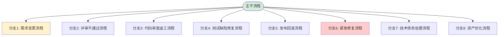

### 3.2 分支1: 需求变更流程

#### 价值流活动图

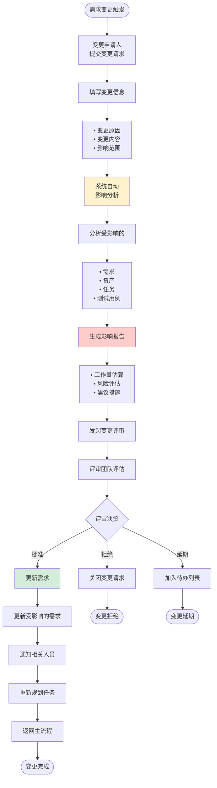

#### 功能点映射

| 活动节点 | 功能模块 | 功能点 | 页面/操作 |
|---------|---------|-------|----------|
| 提交变更 | F011-需求变更管理 | 变更申请 | `/change-requests/create` |
| 影响分析 | F010-需求追溯管理 | 影响分析 | 自动分析引擎 |
| 生成报告 | F011-需求变更管理 | 影响报告 | `/change-requests/:id/impact` |
| 变更评审 | F013-评审管理 | 变更评审 | `/reviews/change/:id` |
| 更新需求 | F007-用户需求管理 | 需求更新 | API调用 |

#### 时间度量

| 指标 | 目标值 |
|------|--------|
| 影响分析时间 | < 1小时（自动） |
| 评审时间 | < 2天 |
| 变更实施时间 | 视影响范围 |

---

### 3.3 分支2: 评审不通过流程

#### 价值流活动图

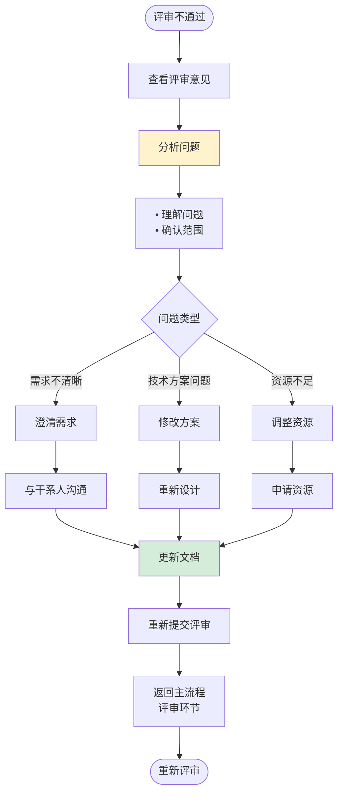

#### 功能点映射

| 活动节点 | 功能模块 | 功能点 | 页面/操作 |
|---------|---------|-------|----------|
| 查看意见 | F013-评审管理 | 评审详情 | `/reviews/:id` |
| 更新文档 | 对应需求/设计模块 | 文档更新 | 编辑页面 |
| 重新提交 | F013-评审管理 | 重新评审 | 评审按钮 |

---

### 3.4 分支3: 代码审查返工流程

#### 价值流活动图

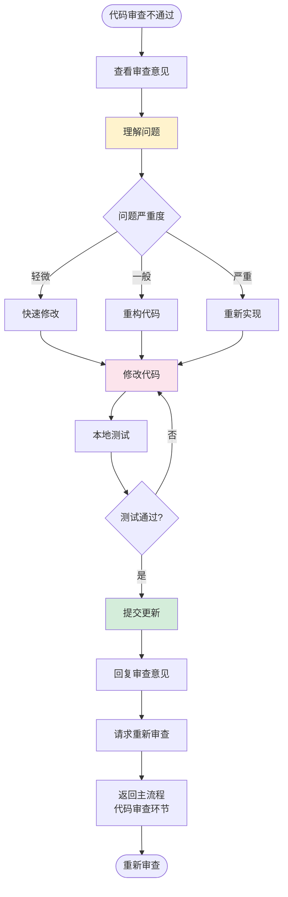

#### 功能点映射

| 活动节点 | 功能模块 | 功能点 | 页面/操作 |
|---------|---------|-------|----------|
| 查看意见 | F017-配置管理 | PR详情 | `/pull-requests/:id` |
| 修改代码 | F017-配置管理 | Git操作 | 本地开发 |
| 提交更新 | F017-配置管理 | 提交代码 | Git push |
| 请求审查 | F017-配置管理 | 更新PR | PR操作 |

---

### 3.5 分支4: 测试缺陷修复流程

#### 价值流活动图

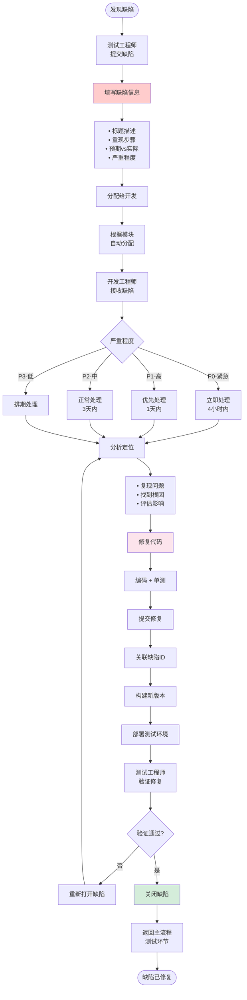

#### 功能点映射

| 活动节点 | 功能模块 | 功能点 | 页面/操作 |
|---------|---------|-------|----------|
| 提交缺陷 | F019-测试管理 | 缺陷创建 | `/bugs/create` |
| 分配缺陷 | F019-测试管理 | 缺陷分配 | 自动分配规则 |
| 接收缺陷 | F019-测试管理 | 缺陷详情 | `/bugs/:id` |
| 修复代码 | F017-配置管理 | 代码提交 | Git操作 |
| 构建部署 | F018-构建管理 | 构建触发 | CI/CD |
| 验证修复 | F019-测试管理 | 缺陷验证 | 测试执行 |
| 关闭缺陷 | F019-测试管理 | 状态更新 | 缺陷操作 |

#### 时间度量

| 指标 | 目标值 |
|------|--------|
| P0缺陷修复 | < 4小时 |
| P1缺陷修复 | < 1天 |
| P2缺陷修复 | < 3天 |
| 验证时间 | < 2小时 |

---

### 3.6 分支5: 发布回滚流程

#### 价值流活动图

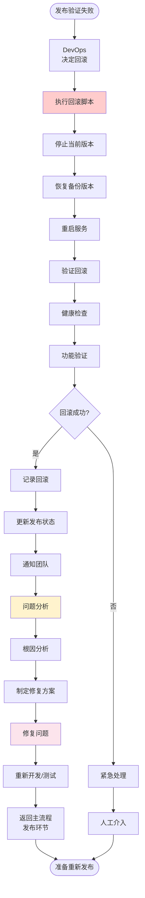

#### 功能点映射

| 活动节点 | 功能模块 | 功能点 | 页面/操作 |
|---------|---------|-------|----------|
| 决定回滚 | F020-发布管理 | 回滚决策 | `/releases/:id/rollback` |
| 执行回滚 | F020-发布管理 | 回滚脚本 | 自动执行 |
| 验证回滚 | F020-发布管理 | 验证检查 | 健康检查 |
| 记录回滚 | F020-发布管理 | 状态记录 | 发布日志 |
| 问题分析 | F023-质量分析 | 根因分析 | 分析报告 |

---

### 3.7 分支6: 紧急修复流程（Hotfix）

#### 价值流活动图

```mermaid
graph TB
    Start([线上紧急问题]) --> F1[产品经理<br/>创建紧急需求]
    
    F1 --> F11[标记P0优先级]
    
    F11 --> F2[快速评审]
    F2 --> F21[15分钟评审会]
    
    F21 --> F3[立即分配]
    F3 --> F31[分配给熟悉模块<br/>的开发工程师]
    
    F31 --> F4[紧急开发]
    F4 --> F41[创建hotfix分支]
    F41 --> F42[快速定位修复]
    F42 --> F43[简化测试]
    
    F43 --> F5[快速审查]
    F5 --> F51[特性负责人<br/>30分钟内审查]
    
    F51 --> F6[紧急构建]
    F6 --> F61[优先级构建队列]
    
    F61 --> F7[快速测试]
    F7 --> F71[冒烟测试<br/>重点测试]
    
    F71 --> F8[紧急发布审批]
    F8 --> F81[简化审批流程<br/>口头确认]
    
    F81 --> F9[热修复发布]
    F9 --> F91[灰度发布<br/>快速回滚准备]
    
    F91 --> F10[密切监控]
    F10 --> F101[实时监控<br/>24小时值班]
    
    F101 --> F11A[补充完整流程]
    F11A --> F111[补充测试用例]
    F111 --> F112[补充文档]
    F112 --> F113[合并到主分支]
    
    F113 --> End([紧急修复完成])
    
    style F1 fill:#ffcccc
    style F4 fill:#fce4ec
    style F9 fill:#fff3cd
```

#### 功能点映射

| 活动节点 | 功能模块 | 功能点 | 页面/操作 |
|---------|---------|-------|----------|
| 创建紧急需求 | F007-用户需求管理 | 需求创建 | 快速创建模式 |
| 快速评审 | F013-评审管理 | 紧急评审 | 在线会议 |
| 立即分配 | F012-任务管理 | 任务分配 | 紧急任务标识 |
| 紧急构建 | F018-构建管理 | 优先构建 | 构建队列优先级 |
| 热修复发布 | F020-发布管理 | 紧急发布 | 简化审批流程 |
| 密切监控 | F021-监控运维 | 实时监控 | 监控大屏 |

#### 时间度量

| 指标 | 目标值 |
|------|--------|
| 评审时间 | < 15分钟 |
| 开发时间 | < 4小时 |
| 测试时间 | < 1小时 |
| 审批时间 | < 30分钟 |
| 发布时间 | < 30分钟 |
| **总时间** | **< 8小时** |

---

### 3.8 分支7: 技术债务处理流程

#### 价值流活动图

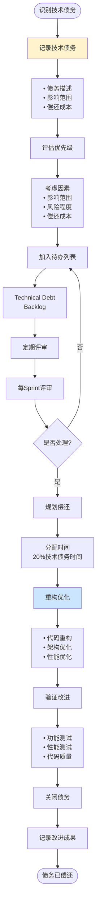

#### 功能点映射

| 活动节点 | 功能模块 | 功能点 | 页面/操作 |
|---------|---------|-------|----------|
| 记录债务 | F012-任务管理 | 技术债务 | `/tech-debts/create` |
| 评估优先级 | F012-任务管理 | 债务评估 | 评估工具 |
| 待办列表 | F012-任务管理 | Backlog | `/tech-debts` |
| 规划偿还 | F012-任务管理 | Sprint规划 | 规划会议 |
| 重构优化 | F017-配置管理 | 代码重构 | 开发活动 |

---

### 3.9 分支8: 资产优化流程

#### 价值流活动图

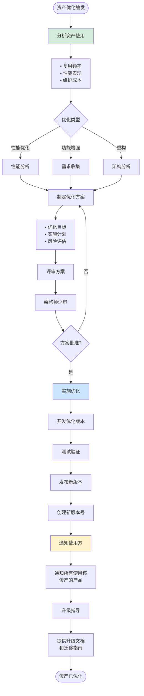

#### 功能点映射

| 活动节点 | 功能模块 | 功能点 | 页面/操作 |
|---------|---------|-------|----------|
| 分析使用 | F024-复用分析 | 资产分析 | `/assets/:id/analytics` |
| 制定方案 | F003-领域特性管理 | 优化规划 | 设计文档 |
| 评审方案 | F013-评审管理 | 架构评审 | 评审会议 |
| 发布新版本 | F020-发布管理 | 版本发布 | 发布流程 |
| 通知使用方 | F015-通知消息 | 广播通知 | 批量通知 |

---

## 四、价值流与功能映射

### 4.1 功能模块覆盖矩阵

| 价值流阶段 | 涉及功能模块 | 关键功能点 |
|-----------|-------------|-----------|
| **阶段1: 需求输入** | F007, F015 | 需求创建、通知推送 |
| **阶段2: 需求分析** | F007, F005, F013 | 需求评审、资产检索、评审管理 |
| **阶段3: 资产规划** | F008, F003, F010 | 需求分解、特性管理、追溯管理 |
| **阶段4: 方案设计** | F008, F009, F003, F004, F013, F012 | 需求细化、架构设计、评审、任务分配 |
| **阶段5: 开发实现** | F012, F017, F018 | 任务管理、代码管理、构建管理 |
| **阶段6: 测试验证** | F019, F020 | 测试管理、环境部署、缺陷管理 |
| **阶段7: 发布交付** | F020, F021, F023 | 发布管理、监控运维、质量分析 |
| **分支: 需求变更** | F011, F010 | 变更管理、影响分析 |
| **分支: 缺陷修复** | F019, F018, F017 | 缺陷管理、构建、代码管理 |
| **分支: 紧急修复** | 所有核心模块 | 全流程简化快速通道 |

### 4.2 功能使用频率

```
高频使用 (每天多次):
├─ F012: 任务管理 ⭐⭐⭐⭐⭐
├─ F017: 配置管理 ⭐⭐⭐⭐⭐
├─ F015: 通知消息 ⭐⭐⭐⭐⭐
└─ F014: 协同看板 ⭐⭐⭐⭐

中频使用 (每天):
├─ F007: 用户需求管理 ⭐⭐⭐
├─ F008: 特性需求管理 ⭐⭐⭐
├─ F018: 构建管理 ⭐⭐⭐
└─ F019: 测试管理 ⭐⭐⭐

低频使用 (每周):
├─ F002: 领域产品管理 ⭐⭐
├─ F003: 领域特性管理 ⭐⭐
├─ F013: 评审管理 ⭐⭐
└─ F020: 发布管理 ⭐⭐

按需使用:
├─ F011: 需求变更管理
├─ F024: 复用分析
└─ F025: 趋势预测
```

---

## 五、价值流与页面映射

### 5.1 页面层次结构

```
Auto DevOps Platform
│
├─ 【工作台】 Dashboard
│  ├─ 产品经理工作台 /dashboard/pm
│  ├─ 系统工程师工作台 /dashboard/se
│  ├─ 特性负责人工作台 /dashboard/fo
│  ├─ 开发工程师工作台 /dashboard/dev
│  ├─ 测试工程师工作台 /dashboard/te
│  └─ DevOps工程师工作台 /dashboard/devops
│
├─ 【需求管理】 Requirements
│  ├─ 用户需求列表 /requirements/user
│  ├─ 创建用户需求 /requirements/user/create
│  ├─ 需求详情 /requirements/user/:id
│  ├─ 需求分解 /requirements/user/:id/decompose
│  ├─ 特性需求列表 /requirements/feature
│  ├─ 模块需求列表 /requirements/module
│  ├─ 需求追溯 /requirements/trace/:id
│  └─ 需求看板 /requirements/board
│
├─ 【资产管理】 Assets
│  ├─ 资产库 /assets
│  ├─ 资产检索 /assets/search
│  ├─ 产品线管理 /product-lines
│  ├─ 领域产品 /products
│  ├─ 领域特性 /features
│  ├─ 软件模块 /modules
│  └─ 资产分析 /assets/analytics
│
├─ 【任务管理】 Tasks
│  ├─ 我的任务 /tasks/my
│  ├─ 任务看板 /tasks/board
│  ├─ 任务详情 /tasks/:id
│  └─ 创建任务 /tasks/create
│
├─ 【代码管理】 Code
│  ├─ 代码仓库 /repositories
│  ├─ 代码提交 /commits
│  ├─ 代码审查 /pull-requests
│  └─ 分支管理 /branches
│
├─ 【构建管理】 Builds
│  ├─ 构建列表 /builds
│  ├─ 构建详情 /builds/:id
│  ├─ 构建配置 /builds/config
│  └─ 制品管理 /artifacts
│
├─ 【测试管理】 Testing
│  ├─ 测试计划 /test-plans
│  ├─ 测试用例 /test-cases
│  ├─ 测试执行 /test-executions
│  ├─ 缺陷管理 /bugs
│  └─ 测试报告 /test-reports
│
├─ 【发布管理】 Releases
│  ├─ 发布计划 /releases
│  ├─ 创建发布 /releases/create
│  ├─ 发布详情 /releases/:id
│  ├─ 发布审批 /releases/:id/approve
│  ├─ 发布执行 /releases/:id/deploy
│  └─ 发布监控 /releases/:id/monitoring
│
├─ 【评审管理】 Reviews
│  ├─ 我的评审 /reviews/my
│  ├─ 需求评审 /reviews/requirement/:id
│  ├─ 技术评审 /reviews/technical/:id
│  └─ 代码审查 /reviews/code/:id
│
├─ 【数据分析】 Analytics
│  ├─ 效能分析 /analytics/efficiency
│  ├─ 质量分析 /analytics/quality
│  ├─ 复用分析 /analytics/reuse
│  └─ 趋势预测 /analytics/trends
│
└─ 【系统管理】 Admin
   ├─ 用户管理 /admin/users
   ├─ 权限管理 /admin/permissions
   ├─ 系统配置 /admin/config
   └─ 审计日志 /admin/audit-logs
```

### 5.2 关键页面详细设计

#### 页面分类统计

| 页面类型 | 数量 | 占比 |
|---------|------|------|
| 列表页 | 25 | 35% |
| 详情页 | 20 | 28% |
| 创建/编辑页 | 15 | 21% |
| 看板页 | 6 | 8% |
| 分析页 | 6 | 8% |
| **总计** | **72** | **100%** |

---

## 六、价值流度量

### 6.1 价值流效率度量

```typescript
// 价值流效率计算
interface ValueStreamMetrics {
  // Lead Time: 从需求输入到发布交付的总时间
  leadTime: number; // 单位: 天
  
  // Processing Time: 实际加工时间（去除等待时间）
  processingTime: number; // 单位: 天
  
  // Value Stream Efficiency: 价值流效率
  efficiency: number; // processingTime / leadTime
  
  // Touch Time: 实际增值时间
  touchTime: number; // 单位: 天
  
  // Wait Time: 等待时间
  waitTime: number; // 单位: 天
  
  // Handoff Count: 交接次数
  handoffCount: number;
  
  // Rework Rate: 返工率
  reworkRate: number; // 返工次数 / 总任务数
  
  // First Pass Yield: 一次通过率
  firstPassYield: number; // 一次通过 / 总任务数
}

// 计算价值流效率
function calculateVSE(metrics: ValueStreamMetrics): number {
  return metrics.processingTime / metrics.leadTime;
}

// 目标值
const targets = {
  leadTime: 15, // 天
  processingTime: 12, // 天
  efficiency: 0.80, // 80%
  reworkRate: 0.15, // < 15%
  firstPassYield: 0.85, // > 85%
};
```

### 6.2 各阶段度量指标

| 阶段 | Lead Time | Processing Time | Wait Time | 效率 | 瓶颈 |
|------|-----------|----------------|-----------|------|------|
| 需求输入 | 2.5小时 | 15分钟 | 2小时 | 10% | 等待评审 |
| 需求分析 | 1.5天 | 1天 | 4小时 | 67% | 资产检索 |
| 资产规划 | 4小时 | 2小时 | 4小时 | 50% | 追溯建立 |
| 方案设计 | 4天 | 3天 | 1天 | 75% | 评审等待 |
| 开发实现 | 11天 | 10天 | 1天 | 91% | 代码审查 |
| 测试验证 | 4天 | 3天 | 1天 | 75% | 缺陷修复 |
| 发布交付 | 2天 | 1天 | 1天 | 50% | 审批等待 |
| **总计** | **23.5天** | **18天** | **5.5天** | **77%** | - |

### 6.3 瓶颈分析

```
价值流瓶颈识别:

1. 开发实现阶段 (占总时间 47%)
   - 瓶颈: 代码审查等待
   - 改进: 增加审查人员、异步审查

2. 等待时间过长 (5.5天, 占23%)
   - 瓶颈: 各环节审批和评审
   - 改进: 并行审批、简化流程

3. 需求分析阶段 (1.5天)
   - 瓶颈: 资产检索效率低
   - 改进: 智能推荐、相似度算法

4. 测试验证阶段 (4天)
   - 瓶颈: 缺陷修复循环
   - 改进: 左移测试、提高代码质量

5. 交接次数过多 (6次)
   - 瓶颈: 信息传递损耗
   - 改进: 减少交接、一站式平台
```

### 6.4 改进建议

```yaml
短期改进 (1-3个月):
  - 实施并行评审: 减少等待时间50%
  - 优化代码审查: 增加审查人员，4小时内完成
  - 自动化测试: 提高测试效率30%
  - 目标: Lead Time降低到20天

中期改进 (3-6个月):
  - 智能资产推荐: 减少检索时间60%
  - 自动影响分析: 变更分析时间< 1小时
  - CI/CD优化: 构建时间< 5分钟
  - 目标: Lead Time降低到15天

长期改进 (6-12个月):
  - AI辅助需求分解: 提高效率50%
  - 预测式质量分析: 提前发现问题
  - 智能化监控告警: 快速响应
  - 目标: Lead Time降低到10天，效率85%
```

---

## 总结

### 核心成果

1. **完整价值流设计**
   - 主干流程：7个阶段，详细活动图
   - 分支流程：8个分支，覆盖所有异常场景
   - 时间度量：每个阶段的Lead Time和效率

2. **功能映射**
   - 28个功能模块完整映射
   - 72个关键页面设计
   - 使用频率分析

3. **度量体系**
   - 价值流效率指标
   - 各阶段度量数据
   - 瓶颈识别和改进建议

4. **优化目标**
   - Lead Time: 23.5天 → 15天
   - 价值流效率: 77% → 85%
   - 一次通过率: > 85%

---

**文档维护**:
- 负责人: 产品架构团队 + DevOps团队
- 更新频率: 季度更新
- 最后更新: 2025-01-02

