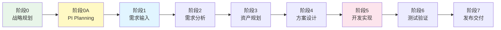
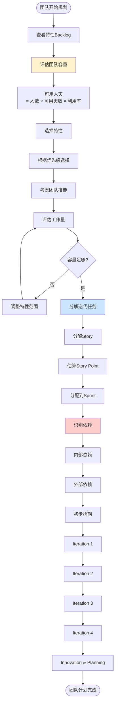
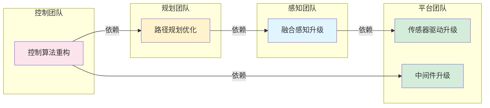
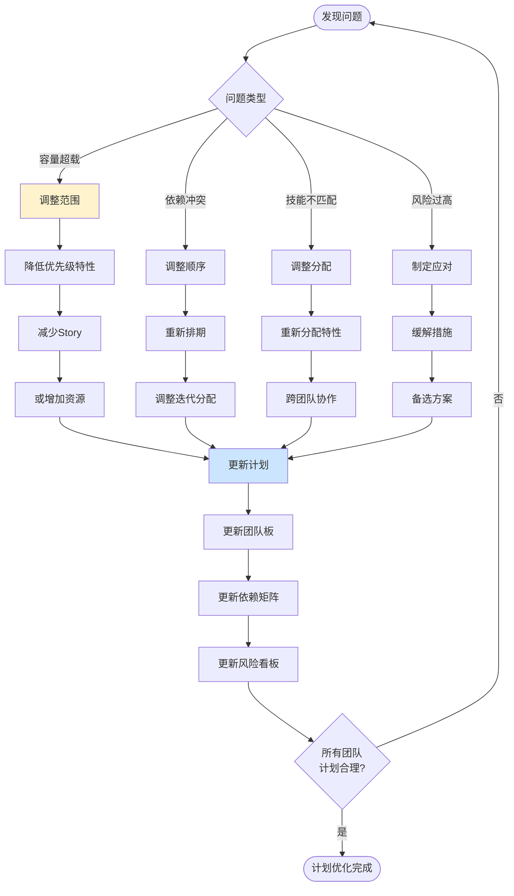

# Auto DevOps平台 - PI Planning设计

> **文档版本**: v1.0  
> **创建日期**: 2025-01-02  
> **目标**: 设计多项目PI Planning协同规划流程

---

## 📋 目录

1. [PI Planning概述](#一pi-planning概述)
2. [价值流位置](#二价值流位置)
3. [PI Planning流程设计](#三pi-planning流程设计)
4. [可视化协同工具](#四可视化协同工具)
5. [功能与页面设计](#五功能与页面设计)
6. [角色与职责](#六角色与职责)

---

## 一、PI Planning概述

### 1.1 什么是PI Planning

**PI (Program Increment)**: 项目群增量，通常为8-12周的固定时间盒，包含4-6个Sprint。

**PI Planning**: 多项目团队的同步规划活动，目的是：
- **承接上层**：产品线路线图、产品版本计划、特性需求
- **启动下层**：跨团队协同、Sprint规划、资源分配、依赖识别

### 1.2 PI Planning的价值

```yaml
对产品线:
  - 确保多产品版本对齐
  - 识别跨产品依赖
  - 优化资源分配

对团队:
  - 明确PI目标
  - 识别团队间依赖
  - 同步开发节奏

对管理:
  - 可视化进度和风险
  - 数据驱动决策
  - 及时调整计划
```

### 1.3 PI Planning的输入输出

```
输入 (来自上层):
├─ 产品线路线图
├─ 产品版本计划 (多个产品 × 多个版本)
├─ 已确认的用户需求和特性需求
├─ 可用资源 (团队、人员、预算)
└─ 技术约束和依赖

处理过程 (PI Planning):
├─ 需求对齐与澄清
├─ 团队容量规划
├─ 特性分配与排期
├─ 依赖识别与解决
└─ 风险评估与应对

输出 (给到下层):
├─ PI目标 (PI Objectives)
├─ 团队迭代计划 (Team Iteration Plans)
├─ 特性交付计划 (Feature Delivery Plan)
├─ 依赖矩阵 (Dependency Matrix)
├─ 风险清单 (Risk Board)
└─ PI看板 (PI Board)
```

---

## 二、价值流位置

### 2.1 调整后的价值流全景



### 2.2 阶段0: 战略规划（已存在）

```
产品线层面:
├─ 制定产品线路线图
├─ 定义核心能力
├─ 规划技术演进
└─ 分配年度预算

产品层面:
├─ 定义产品版本
├─ 规划版本特性
├─ 确定目标市场
└─ 设定商业目标

输出:
├─ 产品线路线图 (12-24个月)
├─ 产品版本计划 (每个产品3-4个版本/年)
└─ 特性Backlog (优先级排序)
```

### 2.3 阶段0A: PI Planning（新增）⭐

```
时间: 每个PI开始前 (通常2-3天的集中活动)
周期: 每8-12周一次
参与: 所有产品团队、架构师、管理层

活动:
├─ Day 0 (准备): 材料准备、环境搭建
├─ Day 1 (规划): 需求澄清、团队规划、第一轮规划
├─ Day 2 (协同): 依赖识别、风险评估、调整优化
└─ Day 2.5 (总结): PI目标确认、计划展示、管理评审

输出:
├─ PI Objectives (每个团队的PI目标)
├─ Team Boards (每个团队的迭代计划)
├─ 依赖矩阵和解决方案
├─ 风险清单和缓解措施
└─ PI看板 (整体视图)
```

---

## 三、PI Planning流程设计

### 3.1 PI Planning完整流程

```mermaid
graph TB
    Start([PI Planning启动]) --> Phase0[准备阶段<br/>Day 0]
    
    Phase0 --> P01[产品线经理<br/>发起PI Planning]
    P01 --> P02[选择PI周期]
    P02 --> P021[PI时间范围<br/>包含的Sprint]
    
    P021 --> P03[邀请参与团队]
    P03 --> P031[• 产品团队<br/>• 特性团队<br/>• 架构师<br/>• 管理层]
    
    P031 --> P04[准备输入材料]
    P04 --> P041[• 产品版本计划<br/>• 特性Backlog<br/>• 团队容量<br/>• 技术约束]
    
    P041 --> Phase1[Day 1: 规划阶段]
    
    Phase1 --> P11[上午: 背景与对齐]
    P11 --> P111[产品愿景宣讲]
    P111 --> P112[架构愿景分享]
    P112 --> P113[业务背景和目标]
    
    P113 --> P12[下午: 团队规划]
    P12 --> P121[各团队分组规划]
    P121 --> P122[团队领取特性]
    P122 --> P123[分解迭代任务]
    P123 --> P124[初步排期]
    
    P124 --> Phase2[Day 2: 协同阶段]
    
    Phase2 --> P21[上午: 依赖识别]
    P21 --> P211[团队展示计划]
    P211 --> P212[识别团队间依赖]
    P212 --> P213[标记依赖关系]
    
    P213 --> P22[中午: 风险评估]
    P22 --> P221[识别风险]
    P221 --> P222[评估影响]
    P222 --> P223[制定应对措施]
    
    P223 --> P23[下午: 调整优化]
    P23 --> P231[解决依赖冲突]
    P231 --> P232[调整团队计划]
    P232 --> P233[优化资源分配]
    
    P233 --> P24[晚上: 最终确认]
    P24 --> P241[各团队确认计划]
    P241 --> P242[制定PI Objectives]
    P242 --> P243[投票表决信心度]
    
    P243 --> Phase3[总结阶段]
    
    Phase3 --> P31[管理评审]
    P31 --> P311{计划可行?}
    
    P311 -->|需调整| P312[反馈调整意见]
    P312 --> P23
    
    P311 -->|通过| P32[发布PI计划]
    P32 --> P321[发布到平台]
    P321 --> P322[通知所有成员]
    
    P322 --> P33[PI执行准备]
    P33 --> P331[创建Sprint 1]
    P331 --> P332[分配初始任务]
    
    P332 --> End([PI开始执行])
    
    style Phase0 fill:#e8f5e9
    style Phase1 fill:#fff9c4
    style Phase2 fill:#ffe4b5
    style Phase3 fill:#cce5ff
```



### 3.2 关键活动详解

#### 3.2.1 准备阶段（Day 0）

**活动1: 材料准备**

```yaml
产品线经理准备:
  - 产品线路线图 (12个月)
  - 本PI的业务目标
  - 各产品版本计划
  - 预算和资源分配

产品经理准备:
  - 产品版本详细计划
  - 特性Backlog (优先级排序)
  - 用户需求列表 (已确认)
  - 市场和竞争分析

架构师准备:
  - 技术愿景和演进路线
  - 架构约束和非功能需求
  - 技术债务清单
  - 平台升级计划

团队负责人准备:
  - 团队容量 (人员、技能、可用时间)
  - 上个PI的回顾总结
  - 技术准备情况
  - 环境和工具就绪
```

**活动2: 环境搭建**

```yaml
物理环境:
  - 大会议室或开放空间
  - 每个团队一块白板区域
  - 公共展示区域
  - 茶歇和午餐安排

数字环境:
  - PI Planning工作区 (平台)
  - 视频会议 (远程团队)
  - 协同白板工具
  - 实时数据同步
```

#### 3.2.2 Day 1上午: 背景与对齐

**活动序列**:
```
08:30-09:00  签到和开场
09:00-09:30  业务背景 (产品线经理)
09:30-10:00  产品愿景 (各产品经理)
10:00-10:30  架构愿景 (架构师)
10:30-10:45  茶歇
10:45-11:30  团队能力展示 (各团队)
11:30-12:00  Q&A和对齐
```

**关键产出**:
- 所有人对业务目标达成共识
- 理解产品版本的优先级
- 清楚技术约束和架构方向
- 团队能力和容量透明

#### 3.2.3 Day 1下午: 团队规划

**活动: 团队分组规划**



**工具: 团队规划板**

```
团队: NOA特性团队
容量: 8人 × 50天 × 80% = 320人天 = 128 SP

┌─────────────────────────────────────────────────────┐
│              PI-2025-Q1 团队规划板                   │
├─────────────────────────────────────────────────────┤
│ 特性               │ SP │ Iter1│ Iter2│ Iter3│ Iter4│
├─────────────────────────────────────────────────────┤
│ 融合感知升级       │ 34 │  ✓  │  ✓  │      │      │
│ 路径规划优化       │ 21 │      │  ✓  │  ✓  │      │
│ 控制算法重构       │ 55 │      │      │  ✓  │  ✓  │
│ DMS集成           │ 13 │  ✓  │      │      │      │
│ 性能优化          │  8 │      │      │      │  ✓  │
├─────────────────────────────────────────────────────┤
│ 合计              │ 131│  47  │  55  │  55  │  63  │
│ 容量              │ 128│  32  │  32  │  32  │  32  │
│ 负载率            │102%│ 147% │ 172% │ 172% │ 197% │ ⚠️
└─────────────────────────────────────────────────────┘

问题: 容量超载，需要调整
```

#### 3.2.4 Day 2上午: 依赖识别

**活动: 依赖网络构建**



**工具: 依赖矩阵**

```
依赖方 ↓  / 被依赖方 → │ 感知团队 │ 规划团队 │ 控制团队 │ 平台团队 │
─────────────────────┼──────────┼──────────┼──────────┼──────────┤
感知团队              │    -     │          │          │    D1    │
规划团队              │    D2    │    -     │          │          │
控制团队              │          │    D3    │    -     │    D4    │
平台团队              │          │          │          │    -     │

依赖说明:
D1: 感知团队依赖平台团队的传感器驱动升级 (Iter 1 Week 2)
D2: 规划团队依赖感知团队的融合感知接口 (Iter 1 Week 4)
D3: 控制团队依赖规划团队的路径规划输出 (Iter 2 Week 2)
D4: 控制团队依赖平台团队的中间件升级 (Iter 2 Week 1)
```

**依赖解决方案**:
```yaml
D1: 传感器驱动升级
  状态: 高风险
  影响: 阻塞感知团队 Iter 1
  解决方案:
    - 平台团队提前到Iter 1 Week 1完成
    - 提供Mock接口供感知团队并行开发
  负责人: 平台团队Leader
  跟踪频率: 每日站会

D2: 融合感知接口
  状态: 中风险
  影响: 规划团队 Iter 1延后1周
  解决方案:
    - 感知团队在Iter 1 Week 3提供稳定接口
    - 规划团队调整计划，Iter 1聚焦其他Story
  负责人: 感知团队Leader
  跟踪频率: 每周
```

#### 3.2.5 Day 2中午: 风险评估

**活动: 风险识别和评估**

```
风险识别方法:
1. 各团队提出潜在风险
2. 头脑风暴识别隐藏风险
3. 查看历史风险清单
4. 架构师识别技术风险
```

**工具: 风险看板（ROAM）**

```
┌────────────────────────────────────────────────────┐
│                   风险看板 (ROAM)                   │
├────────────────────────────────────────────────────┤
│ Resolved (已解决)                                   │
│ • R1: 开发环境准备 - 已提前完成                     │
│                                                     │
├────────────────────────────────────────────────────┤
│ Owned (已有负责人和计划)                            │
│ • O1: 传感器驱动延期 - 平台团队加人               │
│ • O2: 算法性能不达标 - 提前性能测试               │
│                                                     │
├────────────────────────────────────────────────────┤
│ Accepted (已接受的风险)                             │
│ • A1: 第三方库升级可能有兼容性问题 - 预留2天调试  │
│                                                     │
├────────────────────────────────────────────────────┤
│ Mitigated (已有缓解措施)                            │
│ • M1: 人员请假影响容量 - 交叉培训，备份人员       │
│ • M2: 测试环境不稳定 - 准备备用环境               │
└────────────────────────────────────────────────────┘
```

#### 3.2.6 Day 2下午: 调整优化

**活动: 迭代优化计划**



#### 3.2.7 Day 2晚上: 最终确认

**活动1: 制定PI Objectives**

```yaml
团队: NOA特性团队
PI: 2025-Q1

Business Objectives (业务目标):
  1. 交付融合感知升级，支持新传感器 (高优先级)
  2. 优化路径规划算法，降低计算时延20% (高优先级)
  3. 完成控制算法重构，提升代码质量 (中优先级)
  4. 集成DMS功能，满足法规要求 (高优先级)

Stretch Objectives (弹性目标):
  5. 性能优化，整体性能提升10% (低优先级)

Enabler Objectives (使能目标):
  6. 建立自动化测试框架 (中优先级)
  7. 完善技术文档和培训材料 (低优先级)
```

**活动2: 信心投票**

```
投票规则:
- 每人举手表示信心度 (1-5个手指)
- 5: 非常有信心
- 4: 有信心
- 3: 一般
- 2: 有疑虑
- 1: 没信心

结果统计:
团队成员: 8人
平均信心度: 3.8
分布: 5分(2人), 4分(4人), 3分(2人)

问题: 2位成员信心度为3
原因:
- 担心平台团队的依赖能否按时交付
- 担心算法性能优化的难度

应对:
- 与平台团队确认承诺
- 安排技术预研和技术尖峰
```

### 3.3 PI Planning输出物

#### 输出物1: PI Objectives

```markdown
# PI-2025-Q1 Objectives

## 产品线目标
- 交付NOA v3.1和LCC v2.0
- 实现跨产品传感器平台统一
- 法规合规性100%

## NOA产品目标
### 必须完成 (Committed)
1. 融合感知升级 - 支持4D毫米波雷达
2. DMS功能集成 - 满足法规要求
3. 路径规划优化 - 降低时延20%

### 力争完成 (Uncommitted)
4. 控制算法重构 - 提升代码质量
5. 整体性能优化 - 性能提升10%

## LCC产品目标
### 必须完成
1. 车道保持算法优化
2. 紧急制动功能增强

### 力争完成
3. 自适应巡航升级
```

#### 输出物2: PI看板

```
┌──────────────────────────────────────────────────────────┐
│                  PI-2025-Q1 看板                          │
├──────────────────────────────────────────────────────────┤
│                                                           │
│  Iter 1      │  Iter 2      │  Iter 3      │  Iter 4     │
│  Week 1-2    │  Week 3-4    │  Week 5-6    │  Week 7-8   │
│              │              │              │             │
│ [感知升级]   │ [感知升级]   │ [控制重构]   │ [控制重构]  │
│ [DMS集成]    │ [规划优化]   │ [规划优化]   │ [性能优化]  │
│ [平台驱动]   │ [平台中间件] │              │             │
│              │              │              │             │
│ 容量: 85%    │ 容量: 90%    │ 容量: 88%    │ 容量: 82%   │
│ 风险: 🟡    │ 风险: 🟢    │ 风险: 🟢    │ 风险: 🟢   │
│              │              │              │             │
└──────────────────────────────────────────────────────────┘

里程碑:
▼ Iter 1 End: 感知升级接口冻结
▼ Iter 2 End: 路径规划优化完成
▼ Iter 3 End: 控制算法重构完成  
▼ Iter 4 End: 系统集成测试完成
```

#### 输出物3: 依赖矩阵（已标注解决方案）

#### 输出物4: 风险看板（ROAM分类）

#### 输出物5: 团队迭代计划

```yaml
团队: NOA特性团队
PI: 2025-Q1

Iteration 1 (Week 1-2):
  Sprint Goal: 完成感知升级基础和DMS集成
  Stories:
    - US-001: 4D毫米波雷达驱动集成 (13 SP)
    - US-002: 融合感知算法适配 (21 SP)
    - US-003: DMS摄像头接入 (8 SP)
  Total: 42 SP / 32 SP容量 (超载，需调整)
  Dependencies:
    - D1: 平台团队传感器驱动 (Week 1)
  Risks:
    - R1: 传感器驱动延期 (Owned by 平台团队)

Iteration 2 (Week 3-4):
  Sprint Goal: 感知接口稳定，规划优化启动
  Stories:
    - US-004: 感知接口优化和测试 (13 SP)
    - US-005: 路径规划算法优化 (21 SP)
  Total: 34 SP / 32 SP容量
  Dependencies:
    - D2: 感知团队接口 (Week 3)
  Risks: 无高风险

Iteration 3: ...
Iteration 4: ...
```

---

## 四、可视化协同工具

### 4.1 PI Planning工作区

**页面结构**:
```
/pi-planning/:piId
├─ 总览 (Overview)
├─ 准备 (Preparation)
├─ 团队规划 (Team Planning)
├─ 依赖管理 (Dependencies)
├─ 风险看板 (Risks)
├─ PI看板 (PI Board)
└─ 结果展示 (Outcomes)
```

### 4.2 核心可视化组件

#### 组件1: PI看板（Kanban风格）

```
┌────────────────────────────────────────────────────────┐
│ PI-2025-Q1 看板              [切换视图▼] [导出] [分享] │
├────────────────────────────────────────────────────────┤
│                                                         │
│ 团队过滤: [全部▼] [感知] [规划] [控制] [平台]         │
│ 时间轴:   ◄═══ Iter 1 ═══►                            │
│                                                         │
├─────────┬─────────┬─────────┬─────────┬─────────┬─────┤
│ Backlog │ Iter 1  │ Iter 2  │ Iter 3  │ Iter 4  │ Done│
├─────────┼─────────┼─────────┼─────────┼─────────┼─────┤
│         │         │         │         │         │     │
│ [特性卡片1] [移动]              [特性卡片2]         │
│  ┌─────┐ ┌─────┐  ┌─────┐  ┌─────┐  ┌─────┐       │
│  │感知  │ │DMS  │  │规划  │  │控制  │  │性能  │       │
│  │升级  │ │集成 │  │优化  │  │重构  │  │优化  │       │
│  │     │ │     │  │     │  │     │  │     │       │
│  │34SP │ │13SP │  │21SP │  │55SP │  │ 8SP │       │
│  │🟡   │ │🟢   │  │🟢   │  │🟡   │  │🟢   │       │
│  └─────┘ └─────┘  └─────┘  └─────┘  └─────┘       │
│         │         │         │         │         │     │
│ 6个特性  │ 2个特性 │ 3个特性 │ 2个特性 │ 1个特性 │     │
│ 85 SP   │ 47 SP   │ 55 SP   │ 55 SP   │ 8 SP    │     │
│         │ 147%负载│ 172%负载│ 172%负载│ 25%负载 │     │
└─────────┴─────────┴─────────┴─────────┴─────────┴─────┘
```

**特性卡片详情**:
```
┌─────────────────────────────────────┐
│ 融合感知升级                         │
│ ID: F-NOA-001                       │
├─────────────────────────────────────┤
│ 负责团队: 感知团队                   │
│ Story Point: 34                     │
│ 优先级: 高 🔴                       │
│ 状态: Iter 1-2                      │
├─────────────────────────────────────┤
│ 依赖:                                │
│ • D1: 平台团队传感器驱动 (Iter 1)   │
│                                     │
│ 风险: 🟡 中等                       │
│ • 传感器驱动可能延期                │
│                                     │
│ 进度: ████████░░ 80%                │
│                                     │
│ [查看详情] [编辑] [讨论]            │
└─────────────────────────────────────┘
```

#### 组件2: 依赖网络图（交互式）

```
依赖可视化:

     [平台团队]
         │
    传感器驱动 (Iter 1 W1)
         │
         ↓
     [感知团队]
         │
    融合感知接口 (Iter 1 W3)
         │
         ↓
     [规划团队]
         │
    路径规划输出 (Iter 2 W2)
         │
         ↓
     [控制团队]
         │
    控制算法 (Iter 3)

交互功能:
- 鼠标悬停: 显示依赖详情
- 点击节点: 高亮相关依赖链
- 拖拽调整: 调整时间线
- 右键菜单: 标记风险、添加备注
```

#### 组件3: 团队容量规划器

```
┌──────────────────────────────────────────────────────┐
│ 团队容量规划                    [保存] [重置] [导出] │
├──────────────────────────────────────────────────────┤
│                                                       │
│ 团队: NOA特性团队                                    │
│ PI周期: 2025-Q1 (8周 = 4个Sprint)                   │
│                                                       │
│ 团队成员: 8人                                        │
│ ┌───────────────┬──────┬──────┬──────┬──────┐      │
│ │ 成员          │Iter1 │Iter2 │Iter3 │Iter4 │      │
│ ├───────────────┼──────┼──────┼──────┼──────┤      │
│ │ 张三 (Leader) │ 80%  │ 80%  │ 80%  │ 80%  │      │
│ │ 李四 (Sr)     │ 90%  │ 90%  │ 70%  │ 90%  │🏖️   │
│ │ 王五 (Sr)     │ 90%  │ 90%  │ 90%  │ 90%  │      │
│ │ 赵六          │ 80%  │ 80%  │ 80%  │ 80%  │      │
│ │ ...           │      │      │      │      │      │
│ └───────────────┴──────┴──────┴──────┴──────┘      │
│                                                       │
│ 可用人天:                                            │
│ • Iter 1: 8人 × 10天 × 85% = 68人天 = 32 SP        │
│ • Iter 2: 8人 × 10天 × 85% = 68人天 = 32 SP        │
│ • Iter 3: 8人 × 10天 × 80% = 64人天 = 30 SP        │
│ • Iter 4: 8人 × 10天 × 85% = 68人天 = 32 SP        │
│ • 合计: 268人天 = 126 SP                            │
│                                                       │
│ 已分配: 131 SP ⚠️ 超载5 SP                          │
│                                                       │
│ 建议:                                                │
│ • 减少1个13SP的Story                                │
│ • 或将弹性目标移至下个PI                            │
│                                                       │
│ [智能优化建议]                                       │
└──────────────────────────────────────────────────────┘
```

#### 组件4: 风险热力图

```
┌──────────────────────────────────────────────────────┐
│ 风险热力图                      [刷新] [导出]        │
├──────────────────────────────────────────────────────┤
│                                                       │
│                     影响程度                         │
│                      High                            │
│                       ▲                              │
│                       │                              │
│              High │   │ R3🔴                        │
│                   │   │                              │
│                   │───┼───│                          │
│                   │ R1│ R2│                          │
│                   │🟡 │🟡 │                          │
│   概              │───┼───│                          │
│   率   Medium │   │ R4│   │                          │
│                   │🟢 │   │                          │
│                   │───┼───│                          │
│                   │   │   │                          │
│              Low  │   │   │                          │
│                       │                              │
│       ─────────────────────────────►                 │
│                   Low  Medium  High                  │
│                                                       │
│ 图例:                                                │
│ 🔴 高风险 (需立即处理)                              │
│ 🟡 中风险 (需要关注)                                │
│ 🟢 低风险 (常规跟踪)                                │
│                                                       │
│ 风险详情:                                            │
│ R1: 传感器驱动延期 (中概率, 高影响)                │
│ R2: 算法性能不达标 (中概率, 中影响)                │
│ R3: 人员突然离职 (低概率, 高影响)                  │
│ R4: 测试环境不稳定 (中概率, 低影响)                │
└──────────────────────────────────────────────────────┘
```

#### 组件5: 实时协同白板

```
功能:
├─ 无限画布
├─ 便签纸 (不同颜色)
├─ 连接线和箭头
├─ 图形和图标
├─ 文本标注
├─ 多人光标（实时协作）
└─ 模板库

使用场景:
- 依赖识别: 团队用便签纸表示依赖，连线标注
- 头脑风暴: 识别风险和应对措施
- 团队讨论: 可视化问题和解决方案
- 成果展示: 导出为图片或PDF
```

---

## 五、功能与页面设计

### 5.1 新增功能模块

#### F029: PI Planning管理 [P0]

**功能描述**: 管理PI Planning的全生命周期

**核心功能**:
```yaml
PI管理:
  - 创建PI
  - 配置PI参数（周期、Sprint数量）
  - 邀请参与团队
  - 发布PI计划

准备管理:
  - 上传输入材料
  - 配置会议日程
  - 环境检查

规划管理:
  - 团队容量规划
  - 特性分配
  - 迭代排期
  - 依赖标注

协同管理:
  - 实时白板
  - 视频会议集成
  - 讨论和投票
  - 决策记录

输出管理:
  - 生成PI Objectives
  - 生成PI看板
  - 生成依赖矩阵
  - 生成风险看板
  - 导出报告
```

### 5.2 页面设计详情

#### 页面1: PI Planning主页

**路由**: `/pi-planning`

**布局**:
```
┌────────────────────────────────────────────────────────┐
│ Auto DevOps > PI Planning               [创建PI] [帮助]│
├────────────────────────────────────────────────────────┤
│                                                         │
│ 【进行中的PI】                                         │
│ ┌─────────────────────────────────────────────────┐  │
│ │ PI-2025-Q1 (进行中 - Iter 2)                    │  │
│ │ 时间: 2025-01-06 ~ 2025-03-02 (8周)             │  │
│ │ 参与团队: 4个 | 特性: 12个 | 容量: 87%          │  │
│ │ [查看看板] [进度报告] [风险看板]                │  │
│ └─────────────────────────────────────────────────┘  │
│                                                         │
│ 【即将开始的PI】                                       │
│ ┌─────────────────────────────────────────────────┐  │
│ │ PI-2025-Q2 (规划中)                             │  │
│ │ 时间: 2025-03-03 ~ 2025-04-27 (8周)             │  │
│ │ Planning日期: 2025-02-27 ~ 2025-02-28           │  │
│ │ [进入规划] [准备材料] [邀请团队]                │  │
│ └─────────────────────────────────────────────────┘  │
│                                                         │
│ 【历史PI】                                             │
│ • PI-2024-Q4 (已完成) - 查看回顾                     │
│ • PI-2024-Q3 (已完成) - 查看回顾                     │
│                                                         │
└────────────────────────────────────────────────────────┘
```

#### 页面2: PI Planning工作区

**路由**: `/pi-planning/:piId/workspace`

**布局**:
```
┌────────────────────────────────────────────────────────┐
│ PI-2025-Q2 Planning工作区                               │
│ [总览] [准备] [规划] [依赖] [风险] [看板] [结果]       │
├────────────────────────────────────────────────────────┤
│                                                         │
│ 左侧: 导航和团队列表                                   │
│ ┌──────────────┐                                       │
│ │ 参与团队(4)  │                                       │
│ │ ✓ 感知团队   │◄─ 当前团队                           │
│ │ □ 规划团队   │                                       │
│ │ □ 控制团队   │                                       │
│ │ □ 平台团队   │                                       │
│ │              │                                       │
│ │ [邀请团队]   │                                       │
│ └──────────────┘                                       │
│                                                         │
│ 中间: 主工作区 (根据Tab切换内容)                       │
│ - 总览: PI概况、进度、统计                             │
│ - 准备: 材料上传、日程、检查清单                       │
│ - 规划: 团队容量、特性分配、排期                       │
│ - 依赖: 依赖网络图、依赖矩阵                           │
│ - 风险: 风险看板(ROAM)、风险热力图                    │
│ - 看板: PI看板、拖拽排期                               │
│ - 结果: PI Objectives、导出报告                        │
│                                                         │
│ 右侧: 协同工具                                         │
│ ┌──────────────┐                                       │
│ │ 讨论 (3)     │                                       │
│ │ @张三: 依赖...│                                       │
│ │              │                                       │
│ │ 在线(5人)    │                                       │
│ │ 🟢 张三       │                                       │
│ │ 🟢 李四       │                                       │
│ │              │                                       │
│ │ [白板] [投票]│                                       │
│ └──────────────┘                                       │
└────────────────────────────────────────────────────────┘
```

#### 页面3: 团队规划页

**路由**: `/pi-planning/:piId/team/:teamId/planning`

**组件**: `TeamPlanningPage`

**功能**:
1. 团队容量输入
2. 特性Backlog展示
3. 拖拽分配特性到Iteration
4. Story Point估算
5. 依赖标注
6. 实时保存

---

## 六、角色与职责

### 6.1 PI Planning中的角色

#### 发起角色

**产品线经理（Product Line Manager）**
```yaml
准备阶段:
  - 发起PI Planning
  - 确定PI范围和目标
  - 准备产品线路线图
  - 分配预算和资源

Planning阶段:
  - 开场和业务背景宣讲
  - 监督整体进展
  - 解决跨产品冲突
  - 最终评审和批准

交付物:
  - 产品线愿景
  - 业务目标
  - 预算分配
```

#### 核心参与角色

**产品经理（Product Manager）**
```yaml
准备阶段:
  - 准备产品版本计划
  - 整理特性Backlog
  - 准备市场分析
  
Planning阶段:
  - 产品愿景宣讲
  - 回答需求问题
  - 调整优先级
  - 确认PI Objectives

交付物:
  - 产品愿景
  - 特性优先级
  - PI Objectives
```

**架构师（Architect）**
```yaml
准备阶段:
  - 准备技术愿景
  - 识别技术约束
  - 准备架构演进计划
  
Planning阶段:
  - 架构愿景宣讲
  - 技术方案咨询
  - 识别技术风险
  - 评审技术决策

交付物:
  - 技术愿景
  - 架构指导
  - 技术风险清单
```

**团队负责人（Team Lead）**
```yaml
准备阶段:
  - 准备团队容量
  - 评估团队技能
  - 回顾上个PI
  
Planning阶段:
  - 带领团队规划
  - 评估Story Point
  - 识别依赖和风险
  - 确认团队计划

交付物:
  - 团队迭代计划
  - 团队PI Objectives
  - 依赖清单
  - 风险清单
```

**团队成员（Team Member）**
```yaml
Planning阶段:
  - 参与团队规划
  - 评估Story Point
  - 识别技术风险
  - 信心投票

交付物:
  - 工作量估算
  - 技术意见
```

#### 支持角色

**Scrum Master / 敏捷教练**
```yaml
准备阶段:
  - 安排会议室和设备
  - 准备材料和工具
  - 培训新成员

Planning阶段:
  - 主持会议
  - 引导讨论
  - 记录决策
  - 解决冲突

交付物:
  - 会议纪要
  - 行动项清单
```

**工具管理员（Tool Admin）**
```yaml
准备阶段:
  - 配置PI Planning工作区
  - 导入基础数据
  - 测试工具功能
  
Planning阶段:
  - 技术支持
  - 数据同步
  - 导出报告

交付物:
  - PI Planning工作区
  - 最终报告
```

---

## 总结

### 核心成果

1. **完整的PI Planning流程设计**
   - 准备阶段（Day 0）
   - 规划阶段（Day 1）
   - 协同阶段（Day 2）
   - 总结阶段

2. **可视化协同工具设计**
   - PI看板（拖拽式）
   - 依赖网络图（交互式）
   - 团队容量规划器
   - 风险热力图
   - 实时协同白板

3. **完整的输出物**
   - PI Objectives
   - PI看板
   - 团队迭代计划
   - 依赖矩阵
   - 风险看板（ROAM）

4. **新增功能模块**
   - F029: PI Planning管理
   - 10+个新页面

### 价值流调整

```
原价值流:
阶段0: 战略规划 → 阶段1: 需求输入 → ...

调整后价值流:
阶段0: 战略规划 → 
阶段0A: PI Planning ⭐ (新增) → 
阶段1: 需求输入 → ...

承上启下:
- 承接: 产品线路线图、产品版本计划、特性Backlog
- 启动: 团队迭代计划、特性分配、Sprint 1
```

### 关键改进

1. **多项目协同**：从单项目到多项目群协同规划
2. **可视化规划**：从文档到可视化交互工具
3. **依赖管理**：从手工到自动化依赖识别和跟踪
4. **风险管理**：从事后到事前识别和应对
5. **团队自组织**：从分配任务到团队自主规划

---

**文档维护**:
- 负责人: 产品架构团队 + 敏捷教练
- 更新频率: 每个PI更新
- 最后更新: 2025-01-02

