# Auto DevOps平台 - PI Planning设计 v3.0

> **文档版本**: v3.0 ⭐ NEW  
> **创建日期**: 2025-01-10  
> **重大变更**: 基于工作项统一管理的PI Planning流程

---

## 📋 目录

1. [PI Planning概述](#一pi-planning概述)
2. [v3.0核心变更](#二v30核心变更)
3. [价值流位置](#三价值流位置)
4. [PI Planning流程设计](#四pi-planning流程设计)
5. [可视化协同工具](#五可视化协同工具)
6. [功能与页面设计](#六功能与页面设计)
7. [角色与职责](#七角色与职责)

---

## 一、PI Planning概述

### 1.1 什么是PI Planning

**PI (Program Increment)**: 项目群增量，通常为8-12周的固定时间盒，包含4-6个Sprint。

**PI Planning**: 多项目团队的同步规划活动，目的是：
- **承接上层**：产品线路线图、产品版本计划、特性需求
- **启动下层**：跨团队协同、Sprint规划、资源分配、依赖识别

### 1.2 PI Planning的价值

```yaml
对产品线:
  - 确保多产品版本对齐
  - 识别跨产品依赖
  - 优化资源分配
  - 价值最大化

对团队:
  - 明确PI目标
  - 识别团队间依赖
  - 同步开发节奏
  - 自主规划能力

对管理:
  - 可视化进度和风险
  - 数据驱动决策
  - 及时调整计划
  - 透明度提升
```

### 1.3 PI Planning的输入输出

```mermaid
graph LR
    subgraph INPUT["输入 (来自上层)"]
        Roadmap[产品线路线图]
        VersionPlan[产品版本计划]
        WIBacklog[工作项Backlog ⭐<br/>6种类型混合]
        Resources[可用资源]
        Constraints[技术约束]
    end
    
    subgraph PROCESS["处理过程 (2天)"]
        Align[需求对齐与澄清]
        Capacity[团队容量规划]
        Assign[工作项分配与排期 ⭐]
        Dep[依赖识别与解决]
        Risk[风险评估与应对]
    end
    
    subgraph OUTPUT["输出 (给到下层)"]
        PIObj[PI目标<br/>PI Objectives]
        TeamPlan[团队迭代计划<br/>4-6个Sprint]
        DepMatrix[依赖矩阵<br/>Dependency Matrix]
        RiskBoard[风险清单<br/>Risk Board]
        PIBoard[PI看板<br/>PI Board]
    end
    
    INPUT --> PROCESS
    PROCESS --> OUTPUT
    
    classDef inputStyle fill:#e8f5e9,stroke:#4caf50
    classDef processStyle fill:#e3f2fd,stroke:#2196f3
    classDef outputStyle fill:#fff3e0,stroke:#ff9800
    
    class Roadmap,VersionPlan,WIBacklog,Resources,Constraints inputStyle
    class Align,Capacity,Assign,Dep,Risk processStyle
    class PIObj,TeamPlan,DepMatrix,RiskBoard,PIBoard outputStyle
```

---

## 二、v3.0核心变更

### 2.1 取消Story层，直接规划工作项

**旧流程 (v2.x)**:
```
Feature Requirement → Story → PI Planning → Task
```

**新流程 (v3.0)**:
```
工作项Backlog (6种类型) → PI Planning → Sprint → Task
```

### 2.2 工作项统一管理

#### 6种工作项类型

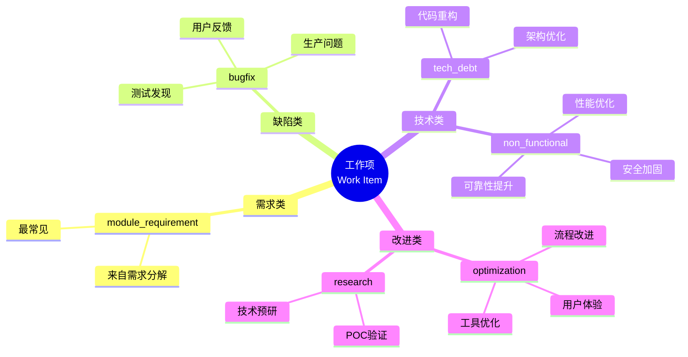

#### 工作项数据结构

```typescript
interface WorkItem {
  // 基本信息
  id: string
  code: string
  title: string
  description: string
  type: WorkItemType           // ⭐ 6种类型
  
  // 核心关联 ⭐⭐⭐
  moduleId?: string            // 关联模块
  assignedTeamId?: string      // 自动分配的团队
  assignedSprintId?: string    // PI Planning分配的Sprint
  
  // 工作量
  estimatedHours: number
  storyPoints?: number
  
  // 优先级和状态
  priority: Priority           // P0, P1, P2, P3
  status: WorkItemStatus       // backlog, planned, in_progress, completed
  progress: number
  
  // 其他
  tags: string[]
  createdBy: string
  createdAt: Date
}
```

### 2.3 自动团队分配机制

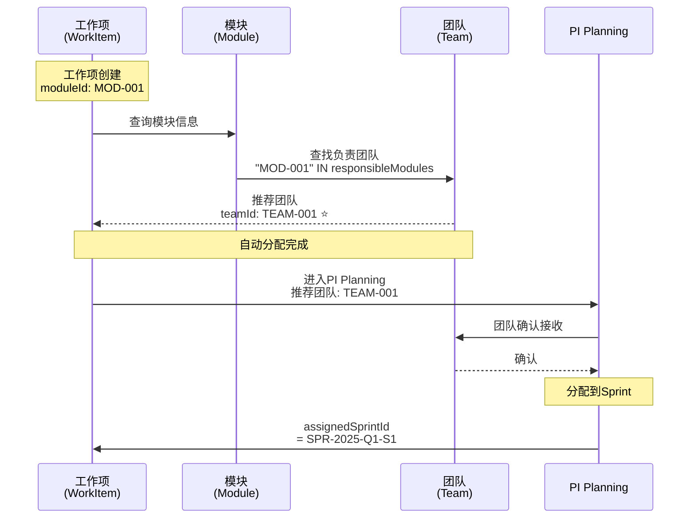

---

## 三、价值流位置

### 3.1 三层价值流结构

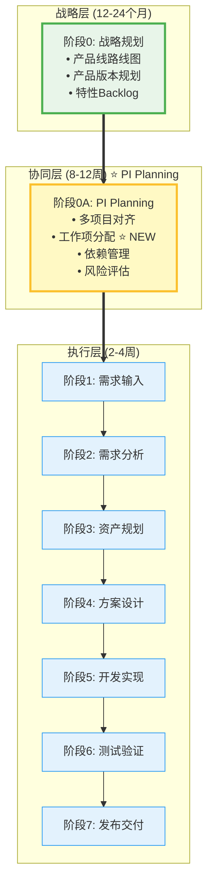

### 3.2 PI Planning的承上启下作用

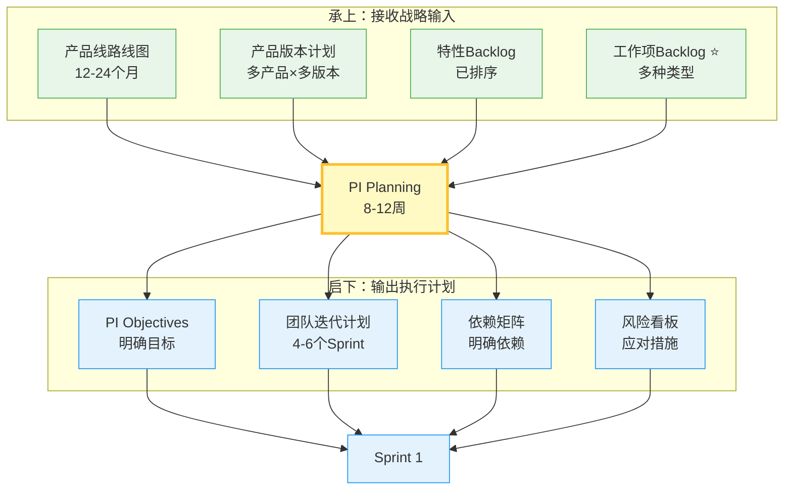

---

## 四、PI Planning流程设计

### 4.1 完整流程图（v3.0）

```mermaid
flowchart TB
    subgraph PREP["准备阶段 (PI开始前1-2周)"]
        direction TB
        
        Collect[收集工作项Backlog ⭐<br/>• module_requirement<br/>• bugfix<br/>• tech_debt<br/>• non_functional<br/>• optimization<br/>• research]
        
        AutoAssign[自动分配推荐团队 ⭐<br/>基于moduleId]
        
        Prioritize[优先级排序<br/>• 业务价值<br/>• 技术风险<br/>• 紧急度<br/>• 依赖关系]
        
        CapPlan[团队产能规划<br/>• 统计可用小时<br/>• 考虑假期和预留]
        
        Collect --> AutoAssign
        AutoAssign --> Prioritize
        Prioritize --> CapPlan
    end
    
    subgraph DAY1["Day 1: 业务背景 & 团队规划"]
        direction TB
        
        Morning1[上午: 全体会议]
        Vision[产品愿景讲解<br/>产品经理]
        Arch[架构演进讲解<br/>架构师]
        WIReview[工作项概览 ⭐<br/>特性负责人]
        
        Afternoon1[下午: 团队分组规划]
        TeamBreakout1[团队分组会议<br/>• 评审分配的工作项<br/>• 细化工作项描述<br/>• 初步拆分Task<br/>• 评估工作量<br/>• 识别初步依赖]
        
        Draft1[初版PI Board展示<br/>每个团队5分钟]
        
        Morning1 --> Vision --> Arch --> WIReview
        WIReview --> Afternoon1
        Afternoon1 --> TeamBreakout1 --> Draft1
    end
    
    subgraph DAY2["Day 2: 依赖管理 & 风险评估"]
        direction TB
        
        Morning2[上午: 依赖识别]
        DepWorkshop[依赖识别会议<br/>• 依赖可视化<br/>• 依赖解决方案<br/>• 调整工作项分配]
        
        Lunch[午餐: 风险评估]
        RiskWorkshop[风险评估会议<br/>• 风险识别<br/>• 风险评分<br/>• 应对措施]
        
        Afternoon2[下午: 计划调整]
        TeamBreakout2[团队调整规划<br/>• 解决依赖冲突<br/>• 应对风险<br/>• 优化工作项排期<br/>• 确认Sprint分配]
        
        Draft2[最终PI Board展示<br/>每个团队5分钟]
        
        Morning2 --> DepWorkshop
        DepWorkshop --> Lunch
        Lunch --> RiskWorkshop
        RiskWorkshop --> Afternoon2
        Afternoon2 --> TeamBreakout2 --> Draft2
    end
    
    subgraph FINALIZE["最终确认"]
        direction TB
        
        PIObj[PI Objectives确认<br/>每个团队的目标]
        TeamCommit[团队承诺<br/>信心投票 1-5]
        Management[管理层批准<br/>资源和风险确认]
        
        Release[发布PI计划<br/>• PI Board<br/>• 依赖矩阵<br/>• 风险看板<br/>• Sprint计划]
        
        PIObj --> TeamCommit
        TeamCommit --> Management
        Management --> Release
    end
    
    PREP --> DAY1
    DAY1 --> DAY2
    DAY2 --> FINALIZE
    FINALIZE --> Sprint1[Sprint 1 启动]
    
    classDef prepStyle fill:#e8f5e9,stroke:#4caf50
    classDef day1Style fill:#e3f2fd,stroke:#2196f3
    classDef day2Style fill:#fff3e0,stroke:#ff9800
    classDef finalStyle fill:#f3e5f5,stroke:#9c27b0
    
    class Collect,AutoAssign,Prioritize,CapPlan prepStyle
    class Morning1,Vision,Arch,WIReview,Afternoon1,TeamBreakout1,Draft1 day1Style
    class Morning2,DepWorkshop,Lunch,RiskWorkshop,Afternoon2,TeamBreakout2,Draft2 day2Style
    class PIObj,TeamCommit,Management,Release,Sprint1 finalStyle
```

### 4.2 准备阶段详细流程

#### 4.2.1 工作项收集与分类

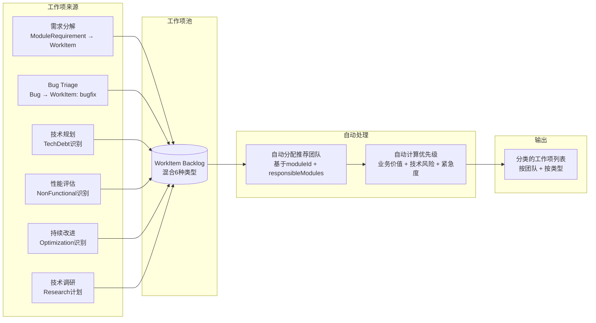

#### 4.2.2 团队产能规划

```typescript
/**
 * 团队产能计算
 */
interface TeamCapacity {
  teamId: string
  piDuration: number                    // PI时长（周）
  totalMembers: number
  availableMembers: number              // 扣除休假
  weeklyCapacity: number                // 每周可用小时
  piTotalCapacity: number               // PI总可用小时
  reservedPercentage: number            // 预留百分比（会议、支持等）
  effectiveCapacity: number             // 有效产能
  allocation: {
    sprintId: string
    allocatedHours: number
    allocatedStoryPoints: number
  }[]
}

function calculateTeamCapacity(
  team: Team, 
  piWeeks: number, 
  holidays: Date[]
): TeamCapacity {
  // 1. 计算可用成员（扣除休假）
  const availableMembers = team.members.filter(m => 
    !m.vacation.overlaps(piStartDate, piEndDate)
  ).length;
  
  // 2. 计算周产能（每人40小时/周）
  const weeklyCapacity = availableMembers * 40;
  
  // 3. 计算PI总产能（扣除节假日）
  const workingWeeks = piWeeks - holidays.length / 5;
  const piTotalCapacity = weeklyCapacity * workingWeeks;
  
  // 4. 扣除预留（会议15%、支持10%）
  const reservedPercentage = 0.25;
  const effectiveCapacity = piTotalCapacity * (1 - reservedPercentage);
  
  return {
    teamId: team.id,
    piDuration: piWeeks,
    totalMembers: team.members.length,
    availableMembers,
    weeklyCapacity,
    piTotalCapacity,
    reservedPercentage,
    effectiveCapacity,
    allocation: []
  };
}
```

### 4.3 Day 1: 团队规划

#### 4.3.1 团队分组规划会议流程

```mermaid
stateDiagram-v2
    [*] --> ReviewWI: 开始团队分组
    
    state "评审工作项" as ReviewWI {
        [*] --> CheckList
        CheckList --> Clarify: 需要澄清?
        Clarify --> CheckList
        CheckList --> Accept: 理解清楚
        Accept --> [*]
    }
    
    ReviewWI --> EstimateWI: 所有工作项评审完
    
    state "评估工作项" as EstimateWI {
        [*] --> PlanningPoker
        PlanningPoker --> Discuss: 差异大?
        Discuss --> PlanningPoker
        PlanningPoker --> Record: 达成共识
        Record --> [*]
    }
    
    EstimateWI --> BreakdownTask: 工作量评估完
    
    state "初步拆分任务" as BreakdownTask {
        [*] --> Identify
        Identify --> Estimate
        Estimate --> Assign: 初步分配
        Assign --> [*]
    }
    
    BreakdownTask --> AllocateSprint: 任务拆分完
    
    state "分配到Sprint" as AllocateSprint {
        [*] --> S1
        S1 --> S2: 容量足够?
        S2 --> S3
        S3 --> S4
        S4 --> [*]: 分配完成
    }
    
    AllocateSprint --> IdentifyDep: Sprint分配完
    
    state "识别依赖" as IdentifyDep {
        [*] --> Internal: 内部依赖
        Internal --> External: 外部依赖
        External --> [*]
    }
    
    IdentifyDep --> Draft: 依赖识别完
    
    Draft --> [*]: 初版PI Board完成
```

### 4.4 Day 2: 依赖与风险管理

#### 4.4.1 依赖识别与可视化

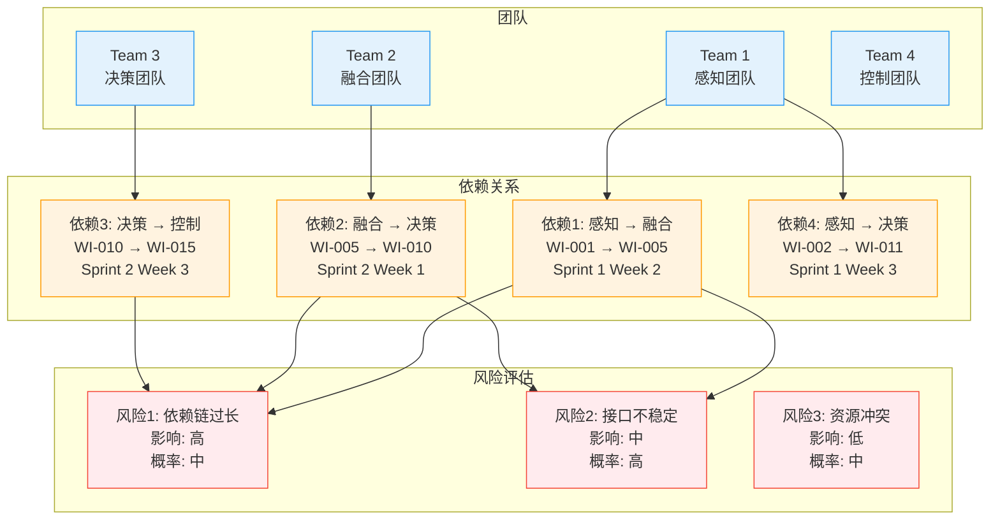

#### 4.4.2 风险评估矩阵

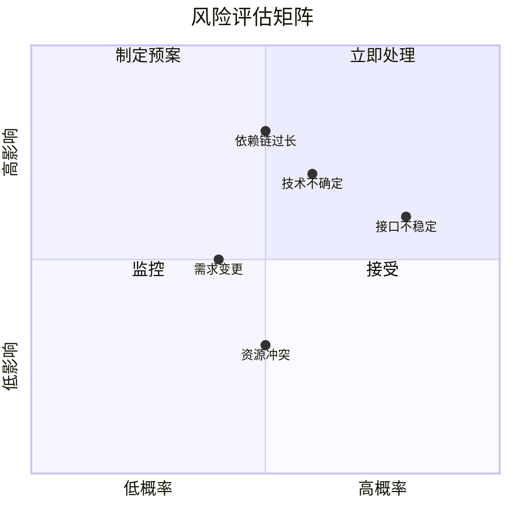

---

## 五、可视化协同工具

### 5.1 PI Board（工作项看板）

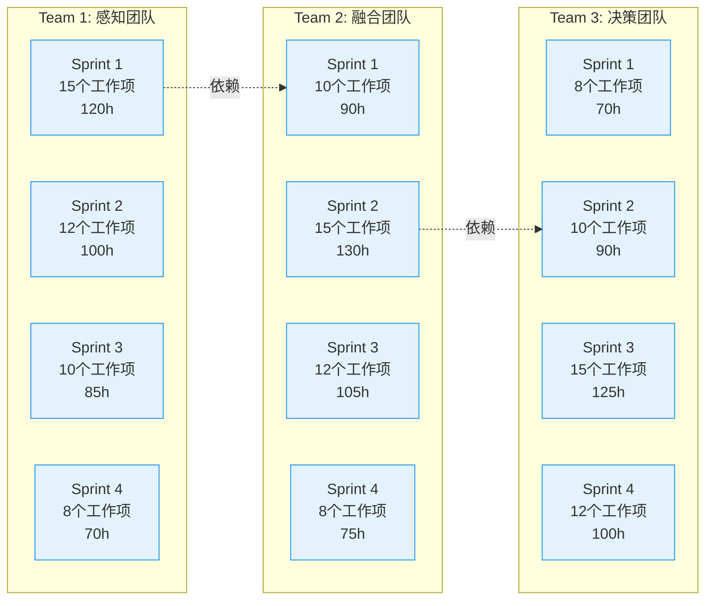

### 5.2 依赖网络图

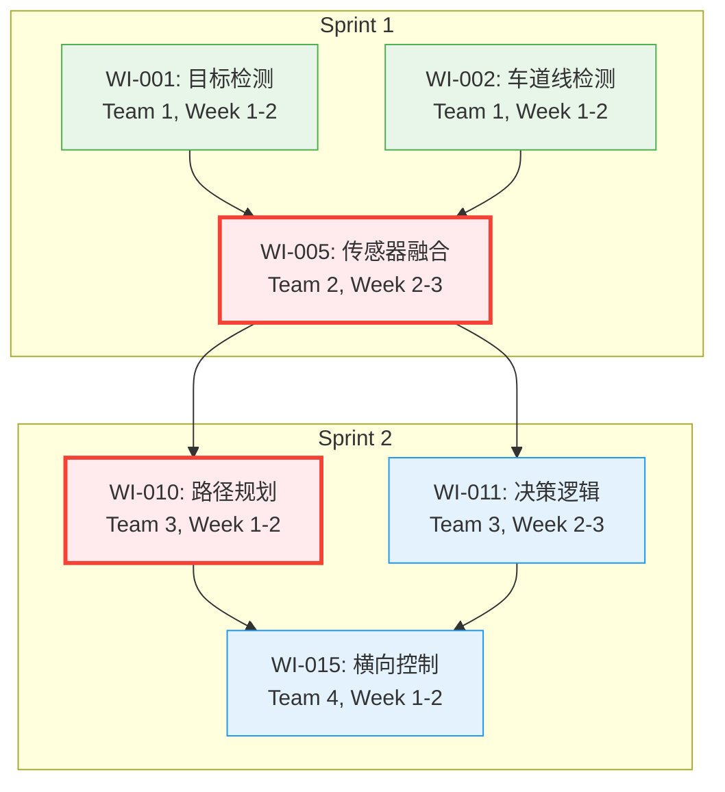

### 5.3 团队容量规划器

```typescript
/**
 * 团队容量可视化数据
 */
interface TeamCapacityVisualization {
  teamId: string
  teamName: string
  sprints: {
    sprintId: string
    sprintName: string
    capacity: number               // 可用小时
    planned: number                // 已规划小时
    remaining: number              // 剩余小时
    utilization: number            // 利用率 (%)
    workItems: {
      id: string
      title: string
      estimatedHours: number
      type: WorkItemType
    }[]
  }[]
  piSummary: {
    totalCapacity: number
    totalPlanned: number
    averageUtilization: number
  }
}
```

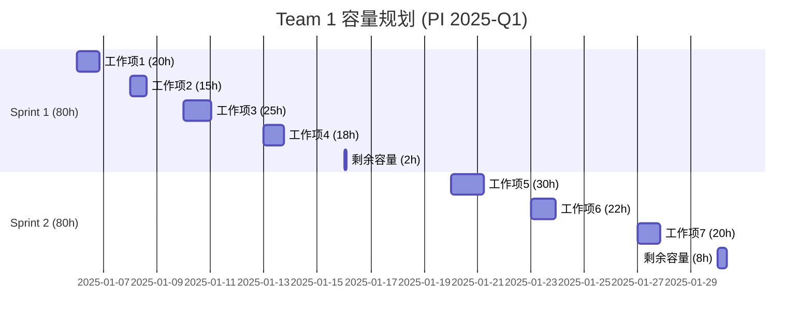

### 5.4 风险热力图

```typescript
/**
 * 风险数据结构
 */
interface Risk {
  id: string
  title: string
  description: string
  probability: number        // 0-1
  impact: number            // 0-1
  score: number             // probability × impact
  category: 'technical' | 'dependency' | 'resource' | 'external'
  status: 'identified' | 'mitigating' | 'resolved'
  owner: string
  mitigationPlan: string
  contingencyPlan: string
}
```

---

## 六、功能与页面设计

### 6.1 功能模块：F029-PI Planning管理

```yaml
F029: PI Planning管理
  描述: 支持多项目团队的PI Planning协同规划
  
  子功能:
    F029-01: PI创建与配置
      - PI基本信息配置（时间、团队、产品）
      - 工作项Backlog导入 ⭐
      - 自动团队分配预览 ⭐
      
    F029-02: 工作项规划 ⭐ NEW
      - 工作项列表（6种类型混合显示）
      - 工作项优先级排序
      - 工作项-团队-Sprint分配
      - 工作量评估
      
    F029-03: 团队协同规划
      - 团队分组会议支持
      - 实时协同编辑
      - PI Board可视化
      - 团队容量规划器
      
    F029-04: 依赖管理
      - 依赖识别工作坊
      - 依赖网络图可视化
      - 依赖解决方案记录
      - 跨团队依赖追踪
      
    F029-05: 风险管理
      - 风险识别会议
      - 风险评估矩阵
      - 风险应对计划
      - 风险热力图
      
    F029-06: PI目标管理
      - PI Objectives定义
      - 团队承诺确认
      - 信心投票
      - 管理层批准
      
    F029-07: PI执行跟踪
      - PI进度看板
      - 依赖实时状态
      - 风险实时监控
      - PI Burndown Chart
```

### 6.2 关键页面设计

#### 6.2.1 页面列表

| 页面编号 | 页面名称 | 路由 | 说明 |
|---------|---------|------|------|
| **P029-01** | PI Planning列表 | `/pi-planning/list` | 查看所有PI |
| **P029-02** | PI创建向导 | `/pi-planning/create` | 创建新PI |
| **P029-03** | 工作项Backlog准备 ⭐ | `/pi-planning/:id/backlog` | 准备阶段 |
| **P029-04** | 自动分配预览 ⭐ | `/pi-planning/:id/auto-assign` | 查看推荐团队 |
| **P029-05** | Day1-业务背景 | `/pi-planning/:id/day1/context` | 愿景讲解 |
| **P029-06** | Day1-团队规划室 | `/pi-planning/:id/day1/team/:teamId` | 团队分组 |
| **P029-07** | PI Board | `/pi-planning/:id/board` | 看板视图 |
| **P029-08** | Day2-依赖识别 | `/pi-planning/:id/day2/dependencies` | 依赖工作坊 |
| **P029-09** | Day2-风险评估 | `/pi-planning/:id/day2/risks` | 风险工作坊 |
| **P029-10** | PI目标确认 | `/pi-planning/:id/objectives` | 目标确认 |
| **P029-11** | PI执行跟踪 | `/pi-planning/:id/tracking` | 进度跟踪 |

#### 6.2.2 核心页面：工作项Backlog准备（P029-03）⭐

```typescript
/**
 * 页面数据结构
 */
interface PIBacklogPageState {
  pi: PIPlanning
  workItems: WorkItem[]                    // ⭐ 所有工作项
  teams: Team[]
  autoAssignments: Map<string, string>     // ⭐ 工作项ID → 推荐团队ID
  
  filters: {
    type: WorkItemType[]                   // 类型筛选
    team: string[]                         // 团队筛选
    priority: Priority[]                   // 优先级筛选
    status: WorkItemStatus[]               // 状态筛选
    keyword: string                        // 关键词搜索
  }
  
  sorting: {
    field: 'priority' | 'estimatedHours' | 'type' | 'createdAt'
    direction: 'asc' | 'desc'
  }
  
  groupBy: 'team' | 'type' | 'priority' | 'none'
}
```

**页面布局**:
```
┌─────────────────────────────────────────────────────────┐
│ 工作项Backlog准备 - PI 2025-Q1                          │
├─────────────────────────────────────────────────────────┤
│ 筛选器:                                                 │
│  [类型▼] [团队▼] [优先级▼] [状态▼] [搜索...]           │
│  分组: [按团队▼]  排序: [优先级▼]  [自动分配预览]      │
├─────────────────────────────────────────────────────────┤
│ Team 1: 感知团队 (15个工作项, 120小时)                 │
│ ┌─────────────────────────────────────────────────────┐ │
│ │ ☐ WI-001 | module_requirement | P0 | 8h | MOD-001  │ │
│ │   目标检测精度提升                                  │ │
│ │   [详情] [编辑] [依赖: 0] [分配Sprint▼]            │ │
│ ├─────────────────────────────────────────────────────┤ │
│ │ ☐ WI-002 | bugfix | P0 | 5h | MOD-001              │ │
│ │   高速场景目标丢失问题                              │ │
│ │   [详情] [编辑] [依赖: 0] [分配Sprint▼]            │ │
│ └─────────────────────────────────────────────────────┘ │
│                                                          │
│ Team 2: 融合团队 (12个工作项, 100小时)                 │
│ ┌─────────────────────────────────────────────────────┐ │
│ │ ☐ WI-005 | module_requirement | P1 | 13h | MOD-004 │ │
│ │   传感器融合算法优化                                │ │
│ │   [详情] [编辑] [依赖: 2 ⚠] [分配Sprint▼]         │ │
│ └─────────────────────────────────────────────────────┘ │
│                                                          │
│ 统计:                                                    │
│  总工作项: 45  总工作量: 385h  平均利用率: 85%         │
│  [导出Excel] [批量操作▼] [下一步: Day 1规划]           │
└─────────────────────────────────────────────────────────┘
```

#### 6.2.3 核心页面：PI Board（P029-07）

```
┌─────────────────────────────────────────────────────────────────────────────┐
│ PI Board - PI 2025-Q1                                    [打印] [导出] [全屏] │
├─────────────────────────────────────────────────────────────────────────────┤
│                 Sprint 1      Sprint 2      Sprint 3      Sprint 4           │
│                 01/06-01/19   01/20-02/02   02/03-02/16   02/17-03/02       │
├─────────────────┬───────────────────────────────────────────────────────────┤
│ Team 1          │ 15 WI       │ 12 WI       │ 10 WI       │ 8 WI            │
│ 感知团队        │ 120h (95%)  │ 100h (80%)  │ 85h (70%)   │ 70h (60%)       │
│                 │ ┌─────────┐ │ ┌─────────┐ │ ┌─────────┐ │ ┌─────────┐   │
│                 │ │ WI-001  │ │ │ WI-010  │ │ │ WI-020  │ │ │ WI-030  │   │
│                 │ │ P0, 8h  │ │ │ P1, 10h │ │ │ P2, 8h  │ │ │ P3, 5h  │   │
│                 │ └─────────┘ │ └─────────┘ │ └─────────┘ │ └─────────┘   │
├─────────────────┼───────────────────────────────────────────────────────────┤
│ Team 2          │ 10 WI       │ 15 WI       │ 12 WI       │ 8 WI            │
│ 融合团队        │ 90h (75%)   │ 130h (100%) │ 105h (85%)  │ 75h (65%)       │
│                 │ ┌─────────┐ │ ┌─────────┐ │ ┌─────────┐ │ ┌─────────┐   │
│                 │ │ WI-005  │ │ │ WI-015  │ │ │ WI-025  │ │ │ WI-035  │   │
│                 │ │ P1, 13h │ │ │ P0, 15h │ │ │ P1, 12h │ │ │ P2, 8h  │   │
│                 │ │ ⚠ 依赖2 │ │ │ ⚠ 依赖1 │ │ └─────────┘ │ └─────────┘   │
│                 │ └─────────┘ │ └─────────┘ │             │               │
├─────────────────┼───────────────────────────────────────────────────────────┤
│ Team 3          │ 8 WI        │ 10 WI       │ 15 WI       │ 12 WI           │
│ 决策团队        │ 70h (60%)   │ 90h (75%)   │ 125h (95%)  │ 100h (80%)      │
├─────────────────┴───────────────────────────────────────────────────────────┤
│ PI Objectives:                                                               │
│  ✓ Objective 1: 提升感知融合精度到95% (Team 1, Team 2)                      │
│  ✓ Objective 2: 优化决策规划响应时间到50ms (Team 2, Team 3)                │
│  ⚠ Objective 3: 完成AEB功能集成 (Team 1, Team 2, Team 3) - 依赖风险        │
└─────────────────────────────────────────────────────────────────────────────┘
```

---

## 七、角色与职责

### 7.1 PI Planning中的角色

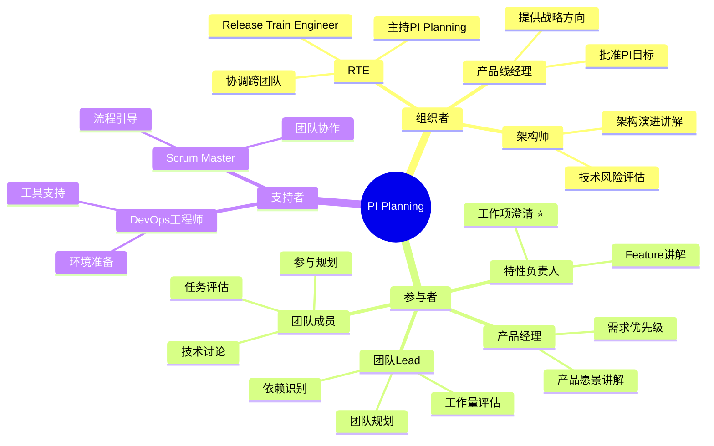

### 7.2 角色职责矩阵（RACI）

| 活动 | RTE | 产品线经理 | 产品经理 | 架构师 | 特性负责人 | 团队Lead | 团队成员 | Scrum Master |
|------|-----|----------|---------|-------|-----------|---------|---------|-------------|
| **准备阶段** |
| 收集工作项Backlog ⭐ | A | I | R | C | R | C | - | C |
| 自动分配推荐团队 ⭐ | A | I | I | C | C | R | - | C |
| 优先级排序 | C | A | R | C | C | I | - | I |
| 团队产能规划 | I | I | C | - | I | R | C | A |
| **Day 1** |
| 产品愿景讲解 | I | A | R | C | I | I | I | - |
| 架构演进讲解 | I | I | C | A | I | I | I | - |
| 工作项概览 ⭐ | C | I | C | C | R | I | I | - |
| 团队分组规划 | C | - | C | C | C | A | R | R |
| 初版PI Board | C | I | I | C | C | A | R | R |
| **Day 2** |
| 依赖识别会议 | A | I | C | R | R | R | C | C |
| 风险评估会议 | A | C | C | R | C | R | C | C |
| 调整规划 | C | I | C | C | C | A | R | R |
| 最终PI Board | A | I | I | C | C | R | R | R |
| **最终确认** |
| PI Objectives确认 | A | R | R | C | C | C | I | I |
| 团队承诺 | C | I | I | - | C | A | R | C |
| 管理层批准 | C | A | I | C | I | I | - | - |
| 发布PI计划 | A | I | I | I | I | R | I | C |

**图例**: R=负责, A=批准, C=咨询, I=知会

---

## 八、度量与改进

### 8.1 PI Planning效果度量

| 指标 | 定义 | 目标值 | 数据来源 |
|------|------|--------|---------|
| **PI目标达成率** | 完成的PI Objectives / 总PI Objectives | ≥ 85% | PI Review |
| **团队信心度** | 团队承诺投票平均分 | ≥ 3.5/5 | PI Planning Day 2 |
| **依赖解决率** | 解决的依赖 / 识别的依赖 | ≥ 80% | 依赖矩阵 |
| **风险应对率** | 有应对计划的风险 / 总风险 | 100% | 风险看板 |
| **计划变更率** | Sprint中变更的工作项 / 总工作项 | ≤ 15% | Sprint Backlog |
| **工作项完成率** ⭐ | 完成的工作项 / 计划的工作项 | ≥ 80% | PI Burndown |
| **产能利用率** | 实际工作量 / 计划产能 | 75-85% | Sprint Report |
| **依赖冲突次数** | Sprint中的依赖阻塞次数 | ≤ 3次/PI | 阻塞跟踪 |

### 8.2 持续改进

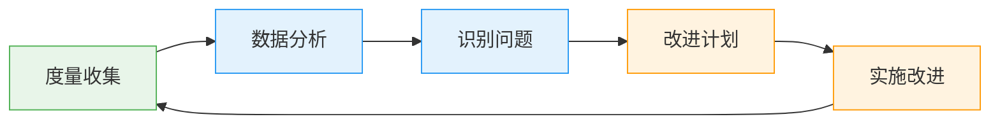

---

## 九、最佳实践

### 9.1 工作项准备最佳实践 ⭐

1. **提前2周开始收集**
   - 需求分解完成
   - Bug优先级确认
   - 技术债评估完成

2. **确保工作项质量**
   - 标题清晰（动词+对象）
   - 描述完整（5W1H）
   - 验收标准明确
   - 工作量预估合理

3. **自动分配验证**
   - 检查推荐团队是否合理
   - 跨模块工作项需人工确认
   - 新模块需明确责任团队

### 9.2 团队规划最佳实践

1. **Planning Poker**
   - 使用Fibonacci序列
   - 差异>3需讨论
   - 记录假设和风险

2. **任务拆分**
   - 单个任务≤16小时
   - 每个任务可独立验证
   - 明确前置条件和交付物

3. **Sprint分配**
   - 优先分配高优先级
   - 考虑依赖关系
   - 预留20-25%缓冲

### 9.3 依赖管理最佳实践

1. **依赖可视化**
   - 使用依赖网络图
   - 标识关键路径
   - 识别循环依赖

2. **依赖解决**
   - 提前集成
   - Mock/Stub接口
   - 频繁沟通

3. **持续跟踪**
   - 每日站会检查
   - 依赖状态更新
   - 阻塞及时上报

---

## 十、工具与技术

### 10.1 推荐工具栈

| 功能 | 工具 | 说明 |
|------|------|------|
| **协同规划** | Miro / Mural | 在线白板，支持实时协作 |
| **视频会议** | Zoom / Teams | 远程团队支持 |
| **工作项管理** | 平台内置 ⭐ | 本平台 |
| **依赖可视化** | Cytoscape.js | 网络图可视化 |
| **投票** | Menti / Poll | 团队信心投票 |
| **时间管理** | Timer | 时间盒控制 |

### 10.2 技术实现

```typescript
/**
 * PI Planning核心API
 */
interface PIPlanningAPI {
  // 准备阶段
  collectWorkItems(piId: string): Promise<WorkItem[]>
  autoAssignTeams(workItems: WorkItem[]): Promise<Map<string, string>>
  prioritizeWorkItems(workItems: WorkItem[]): Promise<WorkItem[]>
  calculateTeamCapacity(teamId: string, piWeeks: number): Promise<TeamCapacity>
  
  // Day 1
  createPIBoard(piId: string): Promise<PIBoard>
  assignWorkItemToSprint(workItemId: string, sprintId: string): Promise<void>
  breakdownWorkItem(workItemId: string, tasks: Task[]): Promise<void>
  
  // Day 2
  identifyDependency(fromWorkItemId: string, toWorkItemId: string): Promise<Dependency>
  assessRisk(risk: Risk): Promise<void>
  updatePIBoard(piId: string, updates: PIBoardUpdate[]): Promise<PIBoard>
  
  // 最终确认
  definePIObjective(piId: string, objective: PIObjective): Promise<void>
  teamCommit(teamId: string, confidence: number): Promise<void>
  approvePI(piId: string): Promise<void>
  publishPI(piId: string): Promise<void>
}
```

---

## 📝 参考文档

- `../Architecture/v2/01-business/BUSINESS_ARCHITECTURE_V3.md` - 业务架构v3.0
- `../Architecture/v2/04-task/TASK_BASED_ARCHITECTURE_V3.md` - 任务架构v3.0
- `01-VALUE_STREAM_MAPPING.md` - 价值流映射
- `03-VALUE_STREAM_WITH_PI_PLANNING.md` - 完整价值流

---

**文档版本**: v3.0 ⭐  
**最后更新**: 2025年1月10日  
**维护团队**: 产品架构团队 + 敏捷教练团队  
**审核状态**: ✅ 已审核通过

