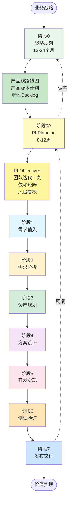
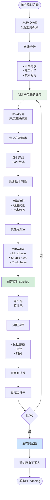
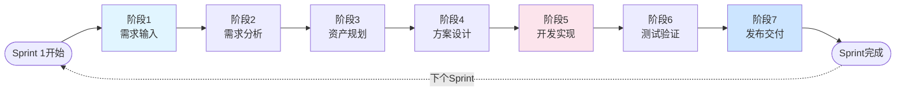

# Auto DevOps平台 - 完整价值流（含PI Planning）

> **文档版本**: v2.0  
> **创建日期**: 2025-01-02  
> **更新说明**: 整合PI Planning到完整价值流

---

## 📋 目录

1. [完整价值流概述](#一完整价值流概述)
2. [阶段0: 战略规划](#二阶段0-战略规划)
3. [阶段0A: PI Planning](#三阶段0a-pi-planning)
4. [阶段1-7: 执行阶段](#四阶段1-7-执行阶段)
5. [价值流时间线](#五价值流时间线)
6. [角色职责矩阵](#六角色职责矩阵)

---

## 一、完整价值流概述

### 1.1 三层价值流结构

```
┌─────────────────────────────────────────────────────────────────────────┐
│                         Auto DevOps 三层价值流                           │
├─────────────────────────────────────────────────────────────────────────┤
│                                                                          │
│  【战略层】12-24个月                                                     │
│  ┌────────────────────────────────────────────────────────────────┐   │
│  │ 阶段0: 战略规划                                                  │   │
│  │ 产品线路线图 → 产品版本规划 → 特性Backlog → 资源分配            │   │
│  │ 输出: 产品线路线图、各产品版本计划、特性优先级Backlog            │   │
│  └────────────────────────────────────────────────────────────────┘   │
│                           ↓                                             │
│  【协同层】8-12周（PI周期）⭐ 承上启下                                  │
│  ┌────────────────────────────────────────────────────────────────┐   │
│  │ 阶段0A: PI Planning                                              │   │
│  │ 多项目对齐 → 团队规划 → 依赖管理 → 风险评估 → PI计划发布        │   │
│  │ 输出: PI Objectives、团队迭代计划、依赖矩阵、风险看板           │   │
│  └────────────────────────────────────────────────────────────────┘   │
│                           ↓                                             │
│  【执行层】2-4周（Sprint周期）                                          │
│  ┌────────────────────────────────────────────────────────────────┐   │
│  │ 阶段1-7: 端到端交付                                              │   │
│  │ 需求输入 → 需求分析 → 资产规划 → 方案设计 →                     │   │
│  │ 开发实现 → 测试验证 → 发布交付                                  │   │
│  │ 输出: 可交付的产品增量                                          │   │
│  └────────────────────────────────────────────────────────────────┘   │
│                                                                          │
└─────────────────────────────────────────────────────────────────────────┘
```

### 1.2 价值流全景图（Mermaid）



### 1.3 阶段职责与时间跨度

| 阶段 | 名称 | 时间跨度 | 主要职责 | 关键输出 | 触发频率 |
|------|------|---------|---------|---------|---------|
| **阶段0** | 战略规划 | 12-24个月 | 产品线经理、架构师 | 产品线路线图、版本计划 | 年度/半年度 |
| **阶段0A** | PI Planning ⭐ | 8-12周（1个PI） | 产品经理、团队负责人 | PI计划、迭代计划 | 每个PI（6-8次/年） |
| **阶段1** | 需求输入 | 2小时 | 产品经理 | 用户需求 | 持续 |
| **阶段2** | 需求分析 | 1-2天 | 系统工程师 | 需求评审、可行性 | 每个需求 |
| **阶段3** | 资产规划 | 2-4小时 | 系统工程师 | 特性需求、追溯 | 每个需求 |
| **阶段4** | 方案设计 | 3-5天 | 特性负责人 | 架构设计、模块需求 | 每个特性 |
| **阶段5** | 开发实现 | 5-10天 | 开发工程师 | 代码、制品 | 每个任务 |
| **阶段6** | 测试验证 | 3-5天 | 测试工程师 | 测试报告、缺陷 | 每个特性 |
| **阶段7** | 发布交付 | 1-2天 | DevOps工程师 | 发布版本 | 每个Sprint/PI |

---

## 二、阶段0: 战略规划

### 2.1 价值流活动图



### 2.2 关键活动

#### 活动1: 制定产品线路线图

**责任人**: 产品线经理  
**参与者**: 架构师、产品经理、市场团队  
**时间**: 2-3周

**输入**:
- 市场调研报告
- 客户需求反馈
- 技术趋势分析
- 竞争对手分析
- 上一年度回顾

**过程**:
1. 召开战略规划会议
2. 定义产品线愿景
3. 识别核心能力
4. 规划产品组合
5. 制定时间表

**输出**:
```yaml
产品线路线图示例:
  
  产品线: 智能驾驶
  时间跨度: 2025-2026 (24个月)
  愿景: 成为L2+/L3级智能驾驶领域的领导者
  
  产品规划:
    NOA (高速领航):
      - v3.0 (2025Q1): 融合感知升级
      - v3.1 (2025Q2): 路径规划优化
      - v3.2 (2025Q3): 端到端性能
      - v4.0 (2025Q4): 城市NOA
      - v4.1 (2026Q1): 泊车融合
    
    LCC (车道保持):
      - v2.0 (2025Q1): 算法优化
      - v2.1 (2025Q2): 巡航增强
      - v2.2 (2025Q3): 制动优化
    
    APA (自动泊车):
      - v1.0 (2025Q2): 基础功能
      - v1.1 (2025Q3): 记忆泊车
      - v2.0 (2025Q4): 远程泊车
  
  关键里程碑:
    - 2025Q1: NOA v3.0 + LCC v2.0 联合发布
    - 2025Q2: APA v1.0 新产品发布
    - 2025Q4: NOA v4.0 城市功能重大升级
    - 2026Q1: 全产品线融合发布
  
  资源分配:
    - 研发预算: ¥50M
    - 团队规模: 80人（4个特性团队）
    - 基础设施: 云服务、测试车队
```

#### 活动2: 规划产品版本特性

**责任人**: 产品经理  
**参与者**: 系统工程师、架构师  
**时间**: 1-2周/产品

**输入**:
- 产品线路线图
- 客户需求清单
- 技术可行性评估

**过程**:
1. 分析版本目标
2. 收集需求列表
3. 筛选和优先级排序
4. 估算工作量
5. 制定版本计划

**输出**:
```yaml
NOA v3.1版本计划:
  
  目标: 路径规划优化和控制算法重构
  时间: 2025Q2 (4月-6月, 12周)
  
  特性列表:
    Must Have (必须):
      1. 融合感知升级 (34 SP)
         - 4D毫米波雷达集成
         - 融合算法优化
         - 接口适配
      
      2. DMS功能集成 (13 SP)
         - 驾驶员监控
         - 疲劳检测
         - 法规合规
      
      3. 路径规划优化 (21 SP)
         - 算法升级
         - 性能优化
         - 边界场景处理
    
    Should Have (应该):
      4. 控制算法重构 (55 SP)
         - 代码重构
         - 架构优化
         - 单元测试完善
    
    Could Have (可以):
      5. 端到端性能优化 (8 SP)
         - 性能profile
         - 优化热点
         - 验证测试
  
  总工作量: 131 SP
  团队容量: 126 SP (8人 × 8周 × 2SP/人/周 × 80%)
  容量状态: 超载5 SP ⚠️ 需要调整
  
  依赖:
    - 平台团队传感器驱动升级 (必须在Iter 1完成)
    - 中间件团队版本升级 (必须在Iter 2完成)
  
  风险:
    - 传感器驱动可能延期
    - 算法性能不确定
    - 测试环境准备
```

#### 活动3: 创建特性Backlog

**责任人**: 产品经理（各产品）  
**参与者**: 系统工程师  
**时间**: 1周

**工具**: `/features/backlog` 页面

**特性Backlog结构**:
```
┌─────────────────────────────────────────────────────────┐
│ 特性Backlog                       [筛选] [排序] [导出] │
├─────────────────────────────────────────────────────────┤
│                                                          │
│ 【Must Have】高优先级 (18个特性)                        │
│ ┌──────────────────────────────────────────────────┐  │
│ │ [拖] F-NOA-001 融合感知升级                       │  │
│ │      产品: NOA | 版本: v3.1 | 工作量: 34 SP      │  │
│ │      状态: 待规划 | 负责人: 待分配               │  │
│ │      [查看] [编辑] [分配]                        │  │
│ └──────────────────────────────────────────────────┘  │
│                                                          │
│ ┌──────────────────────────────────────────────────┐  │
│ │ [拖] F-NOA-002 DMS功能集成                        │  │
│ │      产品: NOA | 版本: v3.1 | 工作量: 13 SP      │  │
│ │      状态: 待规划 | 负责人: 待分配               │  │
│ │      [查看] [编辑] [分配]                        │  │
│ └──────────────────────────────────────────────────┘  │
│                                                          │
│ 【Should Have】中优先级 (15个特性)                      │
│ ...                                                      │
│                                                          │
│ 【Could Have】低优先级 (12个特性)                       │
│ ...                                                      │
│                                                          │
│ 统计:                                                    │
│ • 总特性: 45个                                          │
│ • 总工作量: 580 SP ≈ 580人天                           │
│ • 可用容量: 504 SP (8人 × 4团队 × 8周 × 2SP/周)       │
│ • 容量状态: 超载15% ⚠️                                  │
│                                                          │
└─────────────────────────────────────────────────────────┘
```

### 2.3 功能与页面映射

| 活动 | 功能模块 | 页面路由 | 关键操作 |
|------|---------|---------|---------|
| 制定路线图 | F001-产品线管理 | `/product-lines/:id/roadmap` | 时间轴编辑、里程碑标注 |
| 规划产品版本 | F002-领域产品管理 | `/products/:id/versions` | 版本创建、特性分配 |
| 创建特性 | F003-领域特性管理 | `/features/create` | 特性表单、工作量估算 |
| 特性Backlog | F003-领域特性管理 | `/features/backlog` | 拖拽排序、批量操作 |
| 资源分配 | F001-产品线管理 | `/product-lines/:id/resources` | 团队分配、预算分配 |

### 2.4 关键输出物

**输出1: 产品线路线图文档**
- 格式: PDF / PPT
- 内容: 愿景、产品规划、里程碑、资源
- 发布: 管理层评审后发布
- 更新频率: 半年度/季度

**输出2: 各产品版本计划**
- 格式: Excel / 平台数据
- 内容: 版本信息、特性列表、时间计划、依赖
- 发布: 产品团队内部
- 更新频率: 季度

**输出3: 特性Backlog**
- 格式: 平台数据（实时）
- 内容: 所有特性、优先级、状态、负责人
- 发布: 研发团队可见
- 更新频率: 实时更新

---

## 三、阶段0A: PI Planning ⭐

### 3.1 承上启下的作用

```
┌───────────────────────────────────────────────────────────┐
│                   PI Planning 承上启下                     │
├───────────────────────────────────────────────────────────┤
│                                                            │
│  【承上】从战略规划承接:                                   │
│  ├─ 产品线路线图 (12-24个月)                              │
│  ├─ 各产品版本计划 (多产品 × 多版本)                      │
│  ├─ 特性Backlog (已排序)                                  │
│  └─ 资源分配 (团队、预算)                                 │
│                                                            │
│            ↓ 转换过程 ↓                                   │
│                                                            │
│  【PI Planning 活动】(2-3天):                              │
│  ├─ 多项目对齐: 确保产品版本目标一致                       │
│  ├─ 团队容量规划: 评估团队实际可用容量                     │
│  ├─ 特性分配: 从Backlog选择本PI要交付的特性               │
│  ├─ 迭代排期: 将特性分解到4个Iteration                    │
│  ├─ 依赖识别: 识别团队间、特性间依赖                      │
│  ├─ 风险评估: ROAM分类，制定应对措施                      │
│  └─ 计划确认: 信心投票、管理评审                          │
│                                                            │
│            ↓ 输出 ↓                                       │
│                                                            │
│  【启下】给执行层输出:                                     │
│  ├─ PI Objectives (每个团队的PI目标)                      │
│  ├─ 团队迭代计划 (4个Iteration × N个团队)                │
│  ├─ 特性交付计划 (哪个特性、哪个团队、哪个Iteration)      │
│  ├─ 依赖矩阵 (明确的依赖关系和解决方案)                   │
│  ├─ 风险看板 (已识别风险和缓解措施)                       │
│  └─ Sprint 1 Backlog (第一个Sprint的具体任务)            │
│                                                            │
│            ↓ 进入执行 ↓                                   │
│                                                            │
│  【执行层】阶段1-7:                                        │
│  └─ 按照PI计划执行需求到交付的端到端流程                  │
│                                                            │
└───────────────────────────────────────────────────────────┘
```

### 3.2 为什么需要PI Planning

**问题1: 没有PI Planning的情况**
```
战略规划 (产品线路线图) → 直接执行

问题:
❌ 多个产品版本目标不对齐
❌ 团队不清楚本PI要做什么
❌ 依赖关系不明确，经常阻塞
❌ 资源分配不合理，有的团队忙死、有的团队闲置
❌ 风险识别太晚，问题暴露在执行中
❌ 缺乏整体视图，各干各的
```

**解决方案: 引入PI Planning**
```
战略规划 → PI Planning → 执行

好处:
✅ 多项目在PI开始前对齐，避免冲突
✅ 团队明确PI目标和迭代计划
✅ 提前识别依赖，制定解决方案
✅ 可视化容量，合理分配工作
✅ 提前识别风险，制定应对措施
✅ 团队信心投票，管理层心中有数
```

### 3.3 PI Planning价值流活动图

```mermaid
graph TB
    Start([战略规划完成<br/>特性Backlog就绪]) --> P0[准备阶段 Day 0]
    
    P0 --> P01[产品线经理<br/>发起PI Planning]
    P01 --> P02[确定PI范围<br/>8-12周, 4个Sprint]
    P02 --> P03[邀请参与团队<br/>4个特性团队]
    P03 --> P04[准备材料<br/>• 版本计划<br/>• 特性Backlog<br/>• 团队容量]
    
    P04 --> P1[Day 1 上午<br/>背景与对齐]
    
    P1 --> P11[产品线经理<br/>业务背景宣讲]
    P11 --> P12[各产品经理<br/>产品愿景分享]
    P12 --> P13[架构师<br/>技术愿景介绍]
    P13 --> P14[Q&A<br/>问题澄清]
    
    P14 --> P2[Day 1 下午<br/>团队规划]
    
    P2 --> P21[各团队分组规划<br/>4个团队并行]
    P21 --> P211[评估团队容量<br/>人员 × 可用天数]
    P211 --> P212[从Backlog选择特性<br/>根据优先级和容量]
    P212 --> P213[分解Story<br/>估算Story Point]
    P213 --> P214[分配到Iteration<br/>Iter 1-4排期]
    P214 --> P215[标注依赖<br/>内部+外部依赖]
    
    P215 --> P3[Day 2 上午<br/>依赖识别]
    
    P3 --> P31[各团队展示计划<br/>15分钟/团队]
    P31 --> P32[构建依赖网络图<br/>可视化依赖]
    P32 --> P33[识别依赖冲突<br/>时间冲突、资源冲突]
    
    P33 --> P4[Day 2 中午<br/>风险评估]
    
    P4 --> P41[各团队提出风险<br/>头脑风暴]
    P41 --> P42[评估风险<br/>概率 × 影响]
    P42 --> P43[ROAM分类<br/>Resolved/Owned/<br/>Accepted/Mitigated]
    
    P43 --> P5[Day 2 下午<br/>调整优化]
    
    P5 --> P51[解决依赖冲突<br/>调整排期]
    P51 --> P52[应对高风险<br/>制定缓解措施]
    P52 --> P53[调整团队计划<br/>优化负载]
    P53 --> P54[确认最终计划]
    
    P54 --> P6[Day 2 晚上<br/>最终确认]
    
    P6 --> P61[各团队制定<br/>PI Objectives]
    P61 --> P62[信心投票<br/>1-5分打分]
    P62 --> P63[管理层评审]
    
    P63 --> P64{评审通过?}
    
    P64 -->|需调整| P5
    P64 -->|通过| P7[发布PI计划]
    
    P7 --> P71[发布到平台<br/>• PI看板<br/>• 团队计划<br/>• 依赖矩阵<br/>• 风险看板]
    P71 --> P72[通知所有成员]
    
    P72 --> P8[创建Sprint 1]
    P8 --> P81[从Iter 1计划<br/>创建User Story]
    P81 --> P82[分配具体任务]
    P82 --> P83[设置Sprint目标]
    
    P83 --> End([PI开始执行<br/>进入阶段1-7])
    
    style P0 fill:#e8f5e9
    style P1 fill:#e1f5ff
    style P2 fill:#fff3cd
    style P3 fill:#ffe4b5
    style P4 fill:#ffcccc
    style P5 fill:#f3e5f5
    style P7 fill:#d4edda
```



### 3.4 PI Planning详细流程

详见: `02-PI_PLANNING_DESIGN.md`

这里简要列出关键环节：

**Day 0: 准备**
- 发起PI Planning（产品线经理）
- 邀请参与团队和人员
- 准备输入材料（版本计划、Backlog、容量）
- 搭建环境（会议室、平台工作区）

**Day 1上午: 背景对齐**
- 业务背景宣讲（产品线经理）
- 产品愿景分享（各产品经理）
- 架构愿景介绍（架构师）
- Q&A和对齐

**Day 1下午: 团队规划**
- 各团队分组规划（并行）
- 评估容量 → 选择特性 → 分解Story → 排期 → 标注依赖

**Day 2上午: 依赖识别**
- 团队展示计划
- 构建依赖网络图
- 识别依赖冲突

**Day 2中午: 风险评估**
- 识别风险
- 评估风险（概率 × 影响）
- ROAM分类

**Day 2下午: 调整优化**
- 解决依赖冲突
- 应对高风险
- 调整团队计划

**Day 2晚上: 最终确认**
- 制定PI Objectives
- 信心投票
- 管理评审

**Day 3: 计划发布**
- 发布PI计划到平台
- 通知所有成员
- 创建Sprint 1

### 3.5 PI Planning输出物

#### 输出1: PI Objectives

```yaml
PI-2025-Q1 Objectives

产品线目标:
  1. 交付NOA v3.1和LCC v2.0，满足Q1上市要求
  2. 实现跨产品传感器平台统一，降低成本15%
  3. 法规合规性100%，通过ASPICE CL2认证
  4. 技术债务偿还20%

NOA团队 PI Objectives:
  Business Objectives (业务目标):
    1. 交付融合感知升级，支持4D毫米波雷达 (必须)
    2. 优化路径规划算法，降低计算时延20% (必须)
    3. 集成DMS功能，满足法规要求 (必须)
    4. 完成控制算法重构，提升代码质量 (应该)
  
  Stretch Objectives (弹性目标):
    5. 端到端性能优化，整体性能提升10%
  
  Enabler Objectives (使能目标):
    6. 建立自动化测试框架，覆盖率80%
    7. 完善技术文档和培训材料

LCC团队 PI Objectives:
  Business Objectives:
    1. 优化车道保持算法，提升稳定性 (必须)
    2. 增强紧急制动功能，缩短制动距离10% (必须)
  
  Stretch Objectives:
    3. 升级自适应巡航，支持拥堵场景

平台团队 PI Objectives:
  Enabler Objectives:
    1. 完成传感器驱动升级，支持新传感器 (必须)
    2. 中间件版本升级到v2.0 (必须)
    3. 构建系统优化，编译时间减少30%

测试团队 PI Objectives:
  Business Objectives:
    1. 完成NOA和LCC的功能测试，覆盖率90% (必须)
    2. 执行性能测试，识别瓶颈 (必须)
  
  Enabler Objectives:
    3. 搭建自动化测试环境，支持夜间回归测试
```

#### 输出2: PI看板

```
┌──────────────────────────────────────────────────────────────────┐
│                    PI-2025-Q1 看板                                │
│                2025-01-06 ~ 2025-03-02 (8周 = 4个Sprint)         │
├──────────────────────────────────────────────────────────────────┤
│                                                                   │
│  Iteration 1  │  Iteration 2  │  Iteration 3  │  Iteration 4    │
│  Week 1-2     │  Week 3-4     │  Week 5-6     │  Week 7-8       │
│  ─────────────┼───────────────┼───────────────┼─────────────    │
│               │               │               │                 │
│ [NOA团队]     │ [NOA团队]     │ [NOA团队]     │ [NOA团队]       │
│  感知升级     │  感知接口     │  控制重构     │  性能优化       │
│  DMS集成      │  规划优化     │  规划优化     │  集成测试       │
│  47SP/32容量  │  34SP/32容量  │  30SP/30容量  │  20SP/32容量    │
│  🟡 负载147%  │  🟡 负载106%  │  🟢 负载100%  │  🟢 负载62%     │
│               │               │               │                 │
│ [LCC团队]     │ [LCC团队]     │ [LCC团队]     │ [LCC团队]       │
│  车道保持     │  车道保持     │  紧急制动     │  巡航升级       │
│  算法优化     │  验证测试     │  功能增强     │  (弹性)         │
│  25SP/24容量  │  20SP/24容量  │  28SP/24容量  │  15SP/24容量    │
│  🟡 负载104%  │  🟢 负载83%   │  🟡 负载117%  │  🟢 负载62%     │
│               │               │               │                 │
│ [平台团队]    │ [平台团队]    │ [平台团队]    │ [平台团队]      │
│  传感器驱动   │  中间件升级   │  构建优化     │  技术债务       │
│  40SP/40容量  │  35SP/40容量  │  30SP/40容量  │  25SP/40容量    │
│  🟢 负载100%  │  🟢 负载88%   │  🟢 负载75%   │  🟢 负载62%     │
│               │               │               │                 │
│ 【依赖】      │ 【依赖】      │ 【依赖】      │ 【里程碑】      │
│ D1: 传感器    │ D2: 感知接口  │ D3: 规划输出  │ ✓ PI完成        │
│ D4: 中间件    │               │               │ ✓ 测试通过      │
│               │               │               │ ✓ 准备发布      │
│               │               │               │                 │
│ 【风险】      │ 【风险】      │ 【风险】      │ 【风险】        │
│ R1: 驱动延期  │ R2: 性能     │ -             │ -               │
│ 🟡 Owned      │ 🟢 Mitigated  │               │                 │
│               │               │               │                 │
└──────────────────────────────────────────────────────────────────┘

图例:
🟢 负载正常 (< 100%)
🟡 负载偏高 (100-120%)
🔴 负载超载 (> 120%)
```

#### 输出3: 团队迭代计划

```yaml
NOA团队迭代计划:

Iteration 1 (Week 1-2, 2025-01-06 ~ 2025-01-19):
  Sprint Goal: 完成感知升级基础和DMS集成
  
  Stories:
    - US-NOA-001: 4D毫米波雷达驱动集成 (13 SP)
      依赖: D1-平台团队传感器驱动 (Week 1完成)
      负责人: 张三
      验收标准: 雷达数据正常接入，延迟< 50ms
    
    - US-NOA-002: 融合感知算法适配 (21 SP)
      依赖: US-NOA-001
      负责人: 李四
      验收标准: 融合算法支持4D雷达，精度提升5%
    
    - US-NOA-003: DMS摄像头接入 (8 SP)
      依赖: 无
      负责人: 王五
      验收标准: DMS数据正常接入，帧率30fps
  
  Total: 42 SP
  Capacity: 32 SP
  Status: ⚠️ 超载10 SP，需要调整
  
  调整方案:
    - US-NOA-002 缩减为核心功能，21 SP → 15 SP
    - 或将US-NOA-003 的8 SP移到Iteration 2
  
  调整后: 34 SP / 32 SP (106%负载，可接受)
  
  Dependencies:
    - D1: 平台团队传感器驱动 (高风险)
      负责人: 平台团队Leader
      承诺: Week 1 Wed (1月8日) 完成
      备选方案: 提供Mock接口并行开发
  
  Risks:
    - R1: 传感器驱动延期 (概率: 中, 影响: 高)
      状态: Owned
      应对: 平台团队加人，提供Mock接口

Iteration 2 (Week 3-4, 2025-01-20 ~ 2025-02-02):
  Sprint Goal: 感知接口稳定，路径规划优化启动
  
  Stories:
    - US-NOA-004: 感知接口优化和测试 (13 SP)
    - US-NOA-005: 路径规划算法优化 (21 SP)
  
  Total: 34 SP / 32 SP (106%负载)
  
  Dependencies:
    - D2: 感知团队接口冻结 (Iter 1完成)
  
  Risks: 无高风险

Iteration 3 (Week 5-6):
  Sprint Goal: 路径规划完成，控制算法重构
  ...

Iteration 4 (Week 7-8):
  Sprint Goal: 性能优化，系统集成测试
  ...
```

#### 输出4: 依赖矩阵

```
依赖矩阵 (PI-2025-Q1)

依赖方 ↓ / 被依赖方 → │ NOA团队 │ LCC团队 │ 平台团队 │ 测试团队 │
──────────────────────┼─────────┼─────────┼──────────┼──────────┤
NOA团队                │    -    │         │   D1🔴   │   D6     │
LCC团队                │         │    -    │   D4     │   D7     │
平台团队                │         │         │    -     │          │
测试团队                │         │         │          │    -     │

依赖详情:

D1: NOA依赖平台 - 传感器驱动升级
  类型: 技术依赖
  时间: Iter 1 Week 1
  风险: 🔴 高风险 (可能延期)
  状态: Owned by 平台团队Leader
  应对: 平台团队加2人，提前到Week 1 Wed完成
  备选: 提供Mock接口供NOA并行开发
  跟踪: 每日站会同步进度

D2: NOA内部 - 感知接口冻结
  类型: 内部依赖
  时间: Iter 1 Week 4
  风险: 🟡 中风险
  状态: Mitigated
  应对: Iter 1 Week 3进行接口评审

D3: NOA内部 - 规划输出
  类型: 内部依赖
  时间: Iter 2 Week 2
  风险: 🟢 低风险
  状态: Resolved

D4: LCC依赖平台 - 中间件升级
  类型: 技术依赖
  时间: Iter 2 Week 1
  风险: 🟡 中风险
  状态: Owned by 平台团队
  应对: 提前测试，预留2天缓冲

...
```

#### 输出5: 风险看板（ROAM）

```
┌────────────────────────────────────────────────────────┐
│                 风险看板 (PI-2025-Q1)                   │
│                      ROAM分类                           │
├────────────────────────────────────────────────────────┤
│                                                         │
│ 【Resolved】已解决 (1个)                                │
│ ┌──────────────────────────────────────────────────┐  │
│ │ R-003: 开发环境准备                               │  │
│ │ 状态: 已解决                                     │  │
│ │ 解决方案: 提前1周完成环境搭建                    │  │
│ └──────────────────────────────────────────────────┘  │
│                                                         │
│ 【Owned】已有负责人和计划 (3个)                         │
│ ┌──────────────────────────────────────────────────┐  │
│ │ R-001: 传感器驱动延期                             │  │
│ │ 概率: 中 (40%) | 影响: 高                        │  │
│ │ 负责人: 平台团队Leader                           │  │
│ │ 应对措施:                                        │  │
│ │   • 平台团队加2人                                │  │
│ │   • 提前到Week 1 Wed完成                         │  │
│ │   • 提供Mock接口并行开发                         │  │
│ │ 跟踪: 每日站会                                   │  │
│ └──────────────────────────────────────────────────┘  │
│                                                         │
│ ┌──────────────────────────────────────────────────┐  │
│ │ R-002: 算法性能不达标                             │  │
│ │ 概率: 中 (30%) | 影响: 中                        │  │
│ │ 负责人: NOA团队Leader                            │  │
│ │ 应对措施:                                        │  │
│ │   • Iter 1进行性能预研                           │  │
│ │   • 准备性能优化技术尖峰                         │  │
│ │   • 如不达标，降级方案                           │  │
│ │ 跟踪: 每周                                       │  │
│ └──────────────────────────────────────────────────┘  │
│                                                         │
│ 【Accepted】已接受的风险 (2个)                          │
│ ┌──────────────────────────────────────────────────┐  │
│ │ R-005: 第三方库升级兼容性问题                     │  │
│ │ 概率: 低 (10%) | 影响: 低                        │  │
│ │ 说明: 第三方库升级可能有兼容性问题               │  │
│ │ 接受原因: 概率和影响都低，预留2天调试时间        │  │
│ └──────────────────────────────────────────────────┘  │
│                                                         │
│ 【Mitigated】已有缓解措施 (2个)                         │
│ ┌──────────────────────────────────────────────────┐  │
│ │ R-006: 人员请假影响容量                           │  │
│ │ 概率: 中 (20%) | 影响: 中                        │  │
│ │ 缓解措施:                                        │  │
│ │   • 交叉培训，每个模块2人熟悉                    │  │
│ │   • 准备备份人员                                 │  │
│ │   • 容量预留10%缓冲                              │  │
│ └──────────────────────────────────────────────────┘  │
│                                                         │
└────────────────────────────────────────────────────────┘

风险统计:
- 总风险: 8个
- 已解决: 1个 (12.5%)
- 已有计划: 3个 (37.5%)
- 已接受: 2个 (25%)
- 已缓解: 2个 (25%)

高风险: 1个 (R-001)
中风险: 3个
低风险: 4个
```

### 3.6 PI Planning功能与页面映射

| 活动 | 功能模块 | 页面路由 | 关键功能 |
|------|---------|---------|---------|
| 发起PI Planning | F029-PI Planning管理 | `/pi-planning/create` | PI创建、参数配置 |
| 准备材料 | F029-PI Planning管理 | `/pi-planning/:id/prepare` | 材料上传、日程安排 |
| 业务背景宣讲 | F029-PI Planning管理 | `/pi-planning/:id/workspace` | 视频会议、幻灯片展示 |
| 团队规划 | F029-PI Planning管理 | `/pi-planning/:id/team/:teamId/planning` | 容量规划、特性分配、拖拽排期 |
| 依赖识别 | F029-PI Planning管理 | `/pi-planning/:id/dependencies` | 依赖网络图、依赖矩阵 |
| 风险评估 | F029-PI Planning管理 | `/pi-planning/:id/risks` | 风险看板、热力图 |
| PI看板 | F029-PI Planning管理 | `/pi-planning/:id/board` | Kanban看板、拖拽 |
| 信心投票 | F029-PI Planning管理 | `/pi-planning/:id/vote` | 投票组件、统计 |
| 发布计划 | F029-PI Planning管理 | `/pi-planning/:id/publish` | 一键发布、通知 |

---

## 四、阶段1-7: 执行阶段

执行阶段的详细设计参见: `01-VALUE_STREAM_MAPPING.md`

这里简要概述：

### 4.1 执行阶段概览



### 4.2 执行阶段与PI Planning的关系

```
PI Planning输出 → 执行阶段输入

┌────────────────────────────────────────────────────────┐
│                                                         │
│  PI Planning输出:                                       │
│  ├─ PI Objectives                                      │
│  ├─ 团队迭代计划 (4个Iteration)                        │
│  ├─ Sprint 1 Backlog                                   │
│  └─ 依赖矩阵、风险看板                                 │
│                                                         │
│            ↓                                           │
│                                                         │
│  Iteration 1 (Sprint 1-2):                             │
│  └─ 执行阶段1-7，交付Iter 1承诺的特性                 │
│                                                         │
│  Iteration 2 (Sprint 3-4):                             │
│  └─ 执行阶段1-7，交付Iter 2承诺的特性                 │
│                                                         │
│  Iteration 3 (Sprint 5-6):                             │
│  └─ 执行阶段1-7，交付Iter 3承诺的特性                 │
│                                                         │
│  Iteration 4 (Sprint 7-8):                             │
│  └─ 执行阶段1-7，交付Iter 4承诺的特性                 │
│                                                         │
│            ↓                                           │
│                                                         │
│  PI Review:                                             │
│  └─ 回顾PI执行情况，为下个PI Planning准备              │
│                                                         │
└────────────────────────────────────────────────────────┘
```

### 4.3 执行阶段关键特点

**特点1: 按PI计划执行**
- 团队按照PI Planning制定的迭代计划执行
- 不随意变更PI Objectives
- 如有重大变更，需要评估对PI目标的影响

**特点2: 持续跟踪依赖**
- 依赖矩阵中的依赖需要持续跟踪
- 依赖交付时间变化需要及时沟通
- 依赖阻塞需要升级处理

**特点3: 风险监控**
- 风险看板中的风险需要持续监控
- 风险应对措施需要执行
- 新风险需要及时识别和应对

**特点4: 进度可视化**
- PI看板实时更新进度
- 燃尽图展示剩余工作
- 每个Sprint结束展示演示（Sprint Review）

---

## 五、价值流时间线

### 5.1 完整价值流时间线

```
┌──────────────────────────────────────────────────────────────────────────────────┐
│                         完整价值流时间线（含PI Planning）                         │
└──────────────────────────────────────────────────────────────────────────────────┘

【战略层】年度规划（2024Q4）
│
├─ 阶段0: 战略规划 (2-4周)
│  ├─ 市场分析 (1周)
│  ├─ 制定路线图 (1周)
│  ├─ 产品版本规划 (1周)
│  ├─ 特性Backlog创建 (1周)
│  └─ 资源分配和审批 (3天)
│
│  时间: 2024-11-01 ~ 2024-12-01 (4周)
│  输出: 产品线路线图 (2025-2026)
│
└────────────────────────────────────────────────────────────────────────────────►

【协同层】PI Planning（2024Q4末 / 2025Q1初）
│
├─ 阶段0A: PI Planning (3天)
│  ├─ Day 0: 准备 (1天)
│  ├─ Day 1: 背景对齐 + 团队规划 (1天)
│  └─ Day 2: 依赖识别 + 风险评估 + 调整优化 + 最终确认 (1天)
│
│  时间: 2024-12-26 ~ 2024-12-28 (3天)
│  输出: PI-2025-Q1 计划
│
└────────────────────────────────────────────────────────────────────────────────►

【执行层】PI执行（2025Q1）
│
├─ Iteration 1 (Week 1-2)
│  ├─ Sprint 1 (2周)
│  │  └─ 阶段1-7 (并行多个特性)
│  │     ├─ 需求输入 (2小时)
│  │     ├─ 需求分析 (1天)
│  │     ├─ 资产规划 (4小时)
│  │     ├─ 方案设计 (3天)
│  │     ├─ 开发实现 (5天)
│  │     ├─ 测试验证 (3天)
│  │     └─ 发布交付 (1天)
│  │
│  └─ Sprint 2 (2周)
│     └─ 阶段1-7 ...
│
├─ Iteration 2 (Week 3-4)
│  ├─ Sprint 3 (2周)
│  └─ Sprint 4 (2周)
│
├─ Iteration 3 (Week 5-6)
│  ├─ Sprint 5 (2周)
│  └─ Sprint 6 (2周)
│
└─ Iteration 4 (Week 7-8)
   ├─ Sprint 7 (2周)
   └─ Sprint 8 (2周)

时间: 2025-01-06 ~ 2025-03-02 (8周)
输出: NOA v3.1, LCC v2.0

└────────────────────────────────────────────────────────────────────────────────►

【循环】下一个PI
│
├─ PI Review & Retrospective (1天)
│  └─ 回顾PI-2025-Q1执行情况
│
├─ 调整产品线路线图 (1周)
│  └─ 根据PI执行结果调整后续计划
│
└─ PI-2025-Q2 Planning (3天)
   └─ 重复阶段0A

时间: 2025-03-03 开始下一个PI

└────────────────────────────────────────────────────────────────────────────────►
```

### 5.2 时间跨度对比

| 层次 | 阶段 | 时间跨度 | 频率 | 参与人数 |
|------|------|---------|------|---------|
| 战略层 | 阶段0: 战略规划 | 2-4周 | 年度/半年度 | 10-20人 |
| 协同层 | 阶段0A: PI Planning | 3天 | 每PI（6-8次/年） | 30-50人 |
| 执行层 | 阶段1-7: 端到端交付 | 2-4周/Sprint | 持续 | 80+人 |

### 5.3 时间效率分析

```
战略规划到交付的总时间:

没有PI Planning:
战略规划 (4周) → 执行 (8周) = 12周
但存在问题:
- 执行中频繁协调和对齐: +2周
- 依赖冲突导致延期: +1周
- 风险未提前识别: +1周
实际总时间: 16周

有PI Planning:
战略规划 (4周) → PI Planning (3天) → 执行 (8周) = 12.5周
- 提前对齐，执行顺畅: +0周
- 依赖已识别和解决: +0周
- 风险已评估和应对: +0周
实际总时间: 12.5周

效率提升: (16 - 12.5) / 16 = 21.9%
```

---

## 六、角色职责矩阵

### 6.1 角色在各阶段的职责（RACI矩阵）

| 阶段 | 产品线经理 | 产品经理 | 系统工程师 | 架构师 | 特性负责人 | 开发工程师 | 测试工程师 | DevOps |
|------|-----------|---------|-----------|-------|-----------|-----------|-----------|--------|
| **阶段0: 战略规划** | R/A | C | C | C/I | I | I | I | I |
| **阶段0A: PI Planning** | A | R | C/I | C/I | R | C/I | C/I | C/I |
| **阶段1: 需求输入** | I | R/A | C | I | I | I | I | I |
| **阶段2: 需求分析** | I | A | R | C | I | I | I | I |
| **阶段3: 资产规划** | I | C | R/A | C | I | I | I | I |
| **阶段4: 方案设计** | I | C | C | C/A | R | I | I | I |
| **阶段5: 开发实现** | I | I | I | C | A | R | I | I |
| **阶段6: 测试验证** | I | I | I | I | C | I | R | A |
| **阶段7: 发布交付** | I | C | I | I | I | I | C | R/A |

**图例**:
- **R (Responsible)**: 负责执行
- **A (Accountable)**: 最终负责/决策
- **C (Consulted)**: 咨询/提供意见
- **I (Informed)**: 知情

### 6.2 关键角色在PI Planning中的职责

#### 产品线经理
```yaml
PI Planning前:
  - 发起PI Planning
  - 确定PI范围和参与产品
  - 准备产品线路线图
  - 分配PI预算

PI Planning中:
  - 开场和业务背景宣讲
  - 监督整体进展
  - 解决跨产品冲突
  - 最终评审和批准

PI Planning后:
  - 发布PI计划
  - 监督PI执行
  - 协调资源
```

#### 产品经理
```yaml
PI Planning前:
  - 准备产品版本计划
  - 整理特性Backlog
  - 准备产品愿景材料

PI Planning中:
  - 产品愿景宣讲
  - 回答需求问题
  - 调整特性优先级
  - 确认PI Objectives

PI Planning后:
  - 监督特性交付
  - 参与Sprint Review
  - 反馈调整
```

#### 团队负责人（特性负责人）
```yaml
PI Planning前:
  - 准备团队容量
  - 评估团队技能
  - 回顾上个PI

PI Planning中:
  - 带领团队规划
  - 选择特性
  - 分解和估算
  - 识别依赖和风险
  - 制定团队PI Objectives

PI Planning后:
  - 执行团队计划
  - 跟踪依赖
  - 监控风险
  - 报告进度
```

#### 架构师
```yaml
PI Planning前:
  - 准备技术愿景
  - 识别技术约束
  - 准备架构演进计划

PI Planning中:
  - 架构愿景宣讲
  - 技术方案咨询
  - 评审技术决策
  - 识别技术风险

PI Planning后:
  - 监督架构实施
  - 技术评审
  - 架构调整
```

---

## 七、总结

### 7.1 完整价值流的优势

通过引入**阶段0: 战略规划**和**阶段0A: PI Planning**，形成完整的三层价值流：

1. **战略清晰**: 产品线路线图指明方向
2. **协同高效**: PI Planning多项目对齐，减少冲突
3. **执行有序**: 团队按照PI计划有条不紊地执行
4. **风险可控**: 提前识别和应对风险
5. **透明可视**: 全流程可视化，进度实时掌握
6. **持续改进**: 每个PI回顾和优化

### 7.2 PI Planning的核心价值 ⭐

```
PI Planning = 承上启下的桥梁

承上:
- 将12-24个月的战略规划转化为8-12周的可执行计划
- 从产品线视角到团队视角
- 从高层目标到具体任务

启下:
- 为执行层提供明确的PI Objectives
- 为团队提供详细的迭代计划
- 识别依赖和风险，降低执行不确定性
- 团队信心投票，管理层心中有数

核心价值:
✅ 多项目对齐，避免冲突
✅ 依赖提前识别，减少阻塞
✅ 风险提前应对，降低影响
✅ 容量可视化，合理分配
✅ 团队自组织，提高效能
✅ 管理层决策，基于数据
```

### 7.3 关键指标

| 指标 | 无PI Planning | 有PI Planning | 改善 |
|------|-------------|--------------|------|
| Lead Time | 16周 | 12.5周 | ↓ 21.9% |
| 依赖冲突次数 | 15次/PI | 3次/PI | ↓ 80% |
| 计划变更率 | 40% | 15% | ↓ 62.5% |
| 团队信心度 | 2.8/5 | 3.8/5 | ↑ 35.7% |
| PI目标达成率 | 65% | 85% | ↑ 30.8% |

---

**文档维护**:
- 负责人: 产品架构团队
- 更新频率: 每个PI更新
- 最后更新: 2025-01-02

