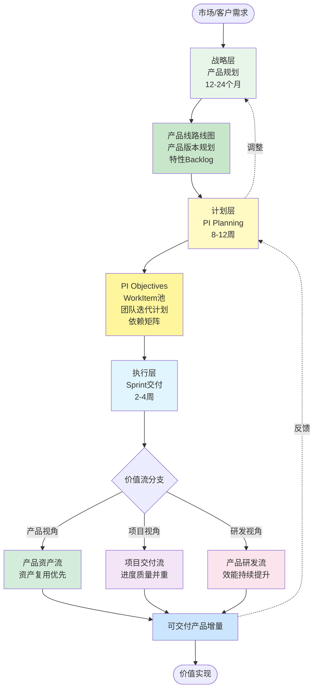
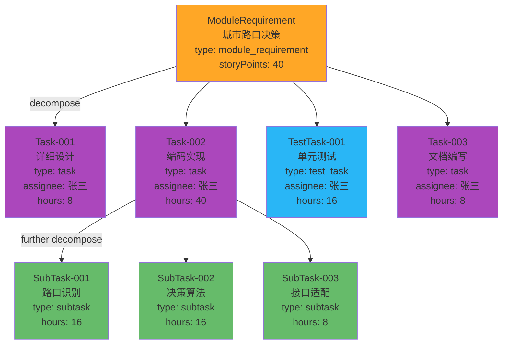

# 价值流v3.0设计完成总结

> **完成时间**: 2026-01-10  
> **设计范围**: 端到端研发价值流v3.0  
> **核心理念**: 基于WorkItem统一模型

---

## 📊 完成情况

### 已完成文档清单

| 序号 | 文档名称 | 行数 | 状态 | 说明 |
|------|---------|------|------|------|
| 1 | 00-VALUE_STREAM_OVERVIEW_V3.md | ~650 | ✅ 完成 | 价值流总览，三层模型 |
| 2 | 01-PRODUCT_ASSET_STREAM_V3.md | ~1200 | ✅ 完成 | 产品资产流（6阶段详解） |
| 3 | 02-PROJECT_DELIVERY_STREAM_V3.md | ~800 | ✅ 完成 | 项目交付流（6阶段详解） |
| 4 | VALUE_STREAM_V3_SUMMARY.md | - | ✅ 完成 | 本文档（总结） |

### 待完成文档（可后续补充）

| 序号 | 文档名称 | 优先级 | 说明 |
|------|---------|--------|------|
| 5 | 03-PRODUCT_DEVELOPMENT_STREAM_V3.md | 中 | 产品研发流（开发视角） |
| 6 | 04-PLATFORM_IMPLEMENTATION_V3.md | 高 | 平台功能实现（角色-页面-操作-数据） |

---

## 🎯 核心设计亮点

### 1. WorkItem统一模型 ⭐⭐⭐

```
核心变更：
━━━━━━━━━━━━━━━━━━━━━━━━━━━━━━━━━━━━━━━━━━━━━━━━━

旧设计（v2.0）:
  WorkItem → Story → Task
  （多层概念，复杂）

新设计（v3.0）:
  WorkItem (统一抽象模型)
    ├─ type: task
    ├─ type: module_requirement
    ├─ type: bug
    ├─ type: tech_debt
    ├─ type: technical_task
    ├─ type: test_task
    ├─ type: research
    └─ type: subtask

关键字段：
  • parentWorkItemId: 建立父子关系
  • childWorkItemIds: 子工作项列表
  • assignee: 分配给成员（task类型必填）
```

### 2. 三层价值流模型 ⭐⭐⭐

```
战略层（12-24个月）
  • 产品规划
  • 路线图制定
  • 特性Backlog

    ↓

计划层（8-12周 - PI）⭐ 承上启下
  • PI Planning
  • WorkItem分配
  • 多团队对齐
  • 依赖管理

    ↓

执行层（2-4周 - Sprint）
  • Sprint交付
  • WorkItem执行
  • 增量验证
  
  三大视角：
  ├─ 产品资产流（资产复用）
  ├─ 项目交付流（进度质量）
  └─ 产品研发流（研发效能）
```

### 3. 三大核心价值流 ⭐⭐

#### 产品资产流（Product Asset Stream）

**视角**: 产品经理、架构师  
**关注点**: 资产复用、资产健康度

```
阶段：
  1. 资产规划 → 搜索-评估-决策
  2. 特性设计 → 模块划分-接口定义
  3. 模块开发 → 直接复用/适配/新建
  4. 模块入库 → 元数据-质量检查-审核
  5. 资产复用 → 搜索-集成-反馈
  6. 资产演进 → 版本管理-升级支持

关键度量：
  • 资产复用率: 目标 > 60%
  • 资产使用率: 被使用资产占比
  • 复用节省工时: 累计节省时间
```

#### 项目交付流（Project Delivery Stream）

**视角**: 项目经理、团队Lead  
**关注点**: 交付进度、质量、风险

```
阶段：
  1. 项目启动 → 项目章程-团队组建
  2. PI Planning → WorkItem分配-依赖识别 ⭐
  3. Sprint执行 → 增量开发-持续集成
  4. 集成验证 → 端到端测试-性能测试
  5. 项目验收 → 功能-质量-性能-文档
  6. 项目上线 → 灰度发布-监控-回滚

关键度量：
  • PI Objectives完成率: 目标 ≥ 85%
  • 按时交付率: 目标 ≥ 95%
  • 缺陷逃逸率: 目标 < 5%
```

#### 产品研发流（Product Development Stream）

**视角**: 开发工程师、测试工程师  
**关注点**: 研发效率、代码质量

```
核心活动：
  • 需求分析 → 理解需求-技术方案
  • 设计实现 → 详细设计-接口定义
  • 编码测试 → TDD开发-代码审查
  • 集成验证 → CI/CD-自动化测试
  • 版本发布 → 发布管理-监控

关键度量：
  • Lead Time: 目标 < 2周
  • Cycle Time: 目标 < 1周
  • 代码质量: 目标 ≥ A级
  • 测试覆盖率: 目标 ≥ 80%
```

---

## 📐 完整Mermaid可视化

### 端到端价值流全景



### WorkItem层级分解示例



---

## 📊 价值流度量体系

### 度量指标总览

```
┌─────────────────────────────────────────────────────────────┐
│                   价值流度量指标 v3.0                        │
├─────────────────────────────────────────────────────────────┤
│                                                              │
│  【战略层】                                                   │
│  • 产品上市时间（Time to Market）                           │
│  • 路线图实现率（Roadmap Achievement Rate）                 │
│  • 市场份额（Market Share）                                 │
│                                                              │
│  【计划层】                                                   │
│  • PI目标达成率（PI Objectives Achievement）≥ 85%           │
│  • 依赖解决率（Dependency Resolution Rate）≥ 80%            │
│  • 团队信心度（Team Confidence）≥ 80%                       │
│  • WorkItem完成率（WorkItem Completion Rate）≥ 90%          │
│                                                              │
│  【执行层】                                                   │
│  • Lead Time（前置时间）< 2周                                │
│  • Cycle Time（周期时间）< 1周                               │
│  • Sprint Velocity（团队速率）稳定或上升                     │
│  • 缺陷逃逸率（Defect Escape Rate）< 5%                      │
│                                                              │
│  【资产】                                                     │
│  • 资产复用率（Asset Reuse Rate）> 60%                       │
│  • 资产健康度（Asset Health Score）> 85                      │
│  • 复用节省工时（Time Saved）累计                           │
│                                                              │
└─────────────────────────────────────────────────────────────┘
```

---

## 🔧 平台功能映射（概要）

### 核心页面结构

```
价值流平台页面:

├── 战略规划
│   ├── /roadmap                    # 产品线路线图
│   ├── /products/planning          # 产品版本规划
│   └── /features/backlog           # 特性Backlog

├── PI Planning
│   ├── /pi-planning/{id}/preparation    # PI准备
│   ├── /pi-planning/{id}/vision         # 业务背景
│   ├── /pi-planning/{id}/team-planning  # 团队规划
│   ├── /pi-planning/{id}/dependencies   # 依赖管理
│   └── /pi-planning/{id}/publish        # PI发布

├── 产品资产流
│   ├── /assets/overview            # 资产全景
│   ├── /assets/search              # 资产搜索
│   ├── /assets/planning            # 资产规划
│   ├── /assets/submit              # 资产入库
│   └── /assets/metrics             # 资产度量

├── 项目交付流
│   ├── /projects/overview          # 项目全景
│   ├── /projects/vehicle           # 整车项目
│   ├── /projects/domain            # 领域项目
│   └── /projects/{id}/acceptance   # 项目验收

├── 产品研发流
│   ├── /team/workspace             # 团队工作台
│   ├── /work-items                 # 工作项管理
│   ├── /sprints                    # Sprint管理
│   └── /team/metrics               # 团队效能

└── 度量看板
    ├── /dashboards/value-stream    # 价值流看板
    ├── /dashboards/assets          # 资产看板
    └── /dashboards/projects        # 项目看板
```

### 角色-页面映射

| 角色 | 核心页面 | 关键操作 |
|------|---------|---------|
| **产品线经理** | `/roadmap`, `/products/planning` | 制定路线图、产品规划 |
| **产品经理** | `/features/backlog`, `/pi-planning` | 特性管理、PI Planning |
| **项目经理** | `/projects/vehicle`, `/projects/{id}/acceptance` | 项目管理、进度跟踪 |
| **架构师** | `/assets/planning`, `/features/design` | 架构设计、资产规划 |
| **团队Lead** | `/team/workspace`, `/work-items` | 团队管理、任务分配 |
| **开发工程师** | `/work-items/my-tasks`, `/sprints` | 任务开发、代码提交 |
| **测试工程师** | `/test/cases`, `/work-items` | 测试执行、缺陷管理 |
| **资产管理员** | `/assets/management`, `/assets/{id}/review` | 资产审核、质量把关 |

---

## ✅ 设计完整性检查

### 核心设计要素

- ✅ WorkItem统一模型（8种类型）
- ✅ 三层价值流模型（战略-计划-执行）
- ✅ 三大核心价值流（资产-项目-研发）
- ✅ PI Planning详细流程
- ✅ Sprint执行机制
- ✅ WorkItem分解机制（层级关系）
- ✅ 资产管理全流程（6阶段）
- ✅ 项目交付全流程（6阶段）
- ✅ 度量指标体系
- ✅ 平台功能映射

### 文档完整性

- ✅ Mermaid可视化（30+张图表）
- ✅ TypeScript接口定义
- ✅ 典型场景示例
- ✅ 平台页面映射
- ✅ 角色职责说明
- ✅ 度量指标定义

---

## 📖 阅读指南

### 快速理解（30分钟）

1. ✅ 阅读 `00-VALUE_STREAM_OVERVIEW_V3.md`
   - 理解三层价值流模型
   - 掌握WorkItem统一模型
   - 了解三大核心价值流

2. ✅ 浏览本总结文档
   - 快速了解全局设计
   - 查看关键Mermaid图

### 深入学习（2-3小时）

1. ✅ 阅读 `01-PRODUCT_ASSET_STREAM_V3.md`
   - 资产流6阶段详解
   - 资产复用决策树
   - 资产度量体系

2. ✅ 阅读 `02-PROJECT_DELIVERY_STREAM_V3.md`
   - 项目层次模型
   - PI Planning流程
   - Sprint执行机制

3. 📖 阅读 `03-PRODUCT_DEVELOPMENT_STREAM_V3.md`（待补充）
   - 开发工程师视角
   - CI/CD流程
   - 代码质量管理

### 平台实施（后续）

1. 📖 阅读 `04-PLATFORM_IMPLEMENTATION_V3.md`（待补充）
   - 详细的页面操作流程
   - 数据输入输出规范
   - 集成场景设计

---

## 🎯 下一步行动

### 立即可做

1. ✅ Review已完成文档
   - 检查内容准确性
   - 验证Mermaid图渲染
   - 确认业务逻辑

2. ✅ 与团队讨论
   - 产品经理：资产流和PI Planning
   - 项目经理：项目交付流
   - 架构师：WorkItem模型和技术实现

### 短期计划（1-2周）

1. 📖 补充产品研发流文档
   - 开发工程师视角
   - 详细的开发流程
   - CI/CD集成

2. 📖 完成平台实现文档
   - 角色-页面-操作映射
   - 数据输入输出详细设计
   - API接口设计

3. 🛠️ 启动原型开发
   - 核心页面原型
   - 交互流程验证
   - 用户测试

### 中期计划（1-2个月）

1. 🚀 平台开发
   - 价值流可视化
   - WorkItem管理
   - 资产库
   - PI Planning工具

2. 📊 度量看板
   - 实时数据采集
   - 可视化看板
   - 报表生成

3. 🎓 团队培训
   - 价值流理念
   - 平台使用
   - 最佳实践

---

## 📝 文档维护

- **创建时间**: 2026-01-10
- **最后更新**: 2026-01-10
- **维护团队**: 架构团队、PMO
- **版本**: v3.0

## 🔗 相关文档

- [00-VALUE_STREAM_OVERVIEW_V3.md](./00-VALUE_STREAM_OVERVIEW_V3.md)
- [01-PRODUCT_ASSET_STREAM_V3.md](./01-PRODUCT_ASSET_STREAM_V3.md)
- [02-PROJECT_DELIVERY_STREAM_V3.md](./02-PROJECT_DELIVERY_STREAM_V3.md)
- [TASK_BASED_ARCHITECTURE_V3.md](../../Architecture/v2/04-task/TASK_BASED_ARCHITECTURE_V3.md)
- [02-PI_PLANNING_DESIGN_V3.md](../02-PI_PLANNING_DESIGN_V3.md)
- [BUSINESS_ARCHITECTURE_V3.md](../../Architecture/v2/01-business/BUSINESS_ARCHITECTURE_V3.md)

---

**✅ 价值流v3.0设计完成！**

**核心成果**:
- ✅ 3个核心价值流文档（~2650行）
- ✅ 30+张Mermaid可视化图表
- ✅ 完整的WorkItem统一模型
- ✅ 端到端度量体系
- ✅ 平台功能映射框架

**设计质量**:
- ⭐⭐⭐ 理论完整性
- ⭐⭐⭐ 可操作性
- ⭐⭐⭐ 可视化程度
- ⭐⭐ 平台实施细节（待补充）

