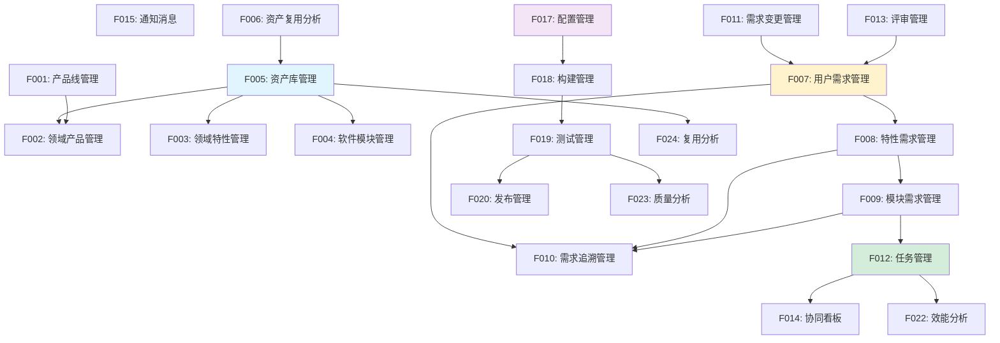

# Auto DevOps平台 - 特性清单

> **文档版本**: v1.0  
> **创建日期**: 2025-01-02  
> **目标**: 完整的产品特性清单及优先级规划

---

## 📋 目录

1. [特性分类](#一特性分类)
2. [MVP特性清单](#二mvp特性清单phase-1)
3. [V1.0特性清单](#三v10特性清单phase-2)
4. [V2.0特性清单](#四v20特性清单phase-3)
5. [特性依赖关系](#五特性依赖关系)

---

## 一、特性分类

### 1.1 按功能域分类

```
资产管理域 (Asset Management)
├─ F001: 产品线管理
├─ F002: 领域产品管理
├─ F003: 领域特性管理
├─ F004: 软件模块管理
├─ F005: 资产库管理
└─ F006: 资产复用分析

需求管理域 (Requirement Management)
├─ F007: 用户需求管理
├─ F008: 特性需求管理
├─ F009: 模块需求管理
├─ F010: 需求追溯管理
└─ F011: 需求变更管理

研发协同域 (Collaboration)
├─ F012: 任务管理
├─ F013: 评审管理
├─ F014: 协同看板
├─ F015: 通知消息
└─ F016: 知识库

DevOps域 (DevOps)
├─ F017: 配置管理
├─ F018: 构建管理
├─ F019: 测试管理
├─ F020: 发布管理
└─ F021: 监控运维

数据分析域 (Analytics)
├─ F022: 效能分析
├─ F023: 质量分析
├─ F024: 复用分析
└─ F025: 趋势预测

平台支撑域 (Platform)
├─ F026: 用户权限管理
├─ F027: 工作台
└─ F028: 系统配置
```

### 1.2 按优先级分类

| 优先级 | 特性数量 | 交付阶段 | 目标 |
|-------|---------|---------|------|
| **P0 - MVP** | 13个 | Phase 1 (0-6月) | 打通端到端，支撑基础研发 |
| **P1 - V1.0** | 10个 | Phase 2 (6-12月) | 完善功能，提升体验 |
| **P2 - V2.0** | 5个 | Phase 3 (12-18月) | 智能化，数据驱动 |

---

## 二、MVP特性清单（Phase 1）

### 目标
- ✅ 打通需求到交付的端到端流程
- ✅ 建立资产管理和需求追溯基础能力
- ✅ 支撑3-5个领域产品的并行开发
- ✅ 资产复用率达到40%

### MVP特性列表

#### F002: 领域产品管理 [P0]

**特性描述**: 管理领域产品的全生命周期，包括产品创建、配置、开发跟踪和发布

**核心功能**:
- 产品CRUD操作
- 产品基本信息管理
- 产品与产品线、平台关联
- 产品开发进度跟踪
- 产品发布管理

**用户价值**:
- 产品经理: 统一管理所有领域产品
- 系统工程师: 清晰的产品结构
- 团队成员: 了解产品全貌

**验收标准**:
- 支持创建和管理领域产品
- 支持关联产品线和技术平台
- 支持跟踪产品开发进度
- 支持产品版本管理

**PRD文档**: [F002-领域产品管理PRD.md](./features/F002-领域产品管理PRD.md)

---

#### F003: 领域特性管理 [P0]

**特性描述**: 管理可复用的领域特性，支持特性的创建、设计、变体管理和复用

**核心功能**:
- 特性CRUD操作
- 特性分类和标签
- 特性设计（逻辑架构）
- 特性依赖管理
- 特性变体点定义

**用户价值**:
- 特性负责人: 规范化特性管理
- 系统工程师: 清晰的特性边界
- 产品经理: 了解特性能力

**验收标准**:
- 支持创建和管理领域特性
- 支持特性分类和检索
- 支持定义特性依赖关系
- 支持定义特性变体点

**PRD文档**: [F003-领域特性管理PRD.md](./features/F003-领域特性管理PRD.md)

---

#### F004: 软件模块管理 [P0]

**特性描述**: 管理软件模块的定义、接口、依赖和部署配置

**核心功能**:
- 模块CRUD操作
- 模块职责定义
- 模块接口管理
- 模块依赖管理
- 模块部署配置

**用户价值**:
- 开发工程师: 清晰的模块边界
- 特性负责人: 模块化管理
- DevOps: 部署配置管理

**验收标准**:
- 支持创建和管理软件模块
- 支持定义模块接口
- 支持管理模块依赖
- 支持配置部署信息

**PRD文档**: [F004-软件模块管理PRD.md](./features/F004-软件模块管理PRD.md)

---

#### F005: 资产库管理 [P0]

**特性描述**: 统一管理所有资产，提供资产检索、评估和统计功能

**核心功能**:
- 资产统一编目
- 资产检索（基础版）
- 资产详情查看
- 资产分类管理
- 资产统计分析

**用户价值**:
- 系统工程师: 快速查找可复用资产
- 产品经理: 了解资产全貌
- 架构师: 资产复用分析

**验收标准**:
- 支持资产的统一展示和检索
- 支持按类型、领域、标签过滤
- 支持查看资产详细信息
- 支持基础的资产统计

**PRD文档**: [F005-资产库管理PRD.md](./features/F005-资产库管理PRD.md)

---

#### F007: 用户需求管理 [P0]

**特性描述**: 管理来自用户和干系人的需求，包括需求收集、分析、评审和分解

**核心功能**:
- 需求CRUD操作
- 需求来源记录
- 需求优先级管理
- 需求评审
- 需求基础分解

**用户价值**:
- 产品经理: 统一管理用户需求
- 系统工程师: 理解需求来源
- 团队成员: 追溯需求背景

**验收标准**:
- 支持创建和管理用户需求
- 支持记录需求来源和干系人
- 支持需求评审流程
- 支持将用户需求分解为特性需求

**PRD文档**: [F007-用户需求管理PRD.md](./features/F007-用户需求管理PRD.md)

---

#### F008: 特性需求管理 [P0]

**特性描述**: 管理特性级别的技术需求，支持需求分解和分配

**核心功能**:
- 特性需求CRUD
- 功能规格定义
- 验收标准定义
- 需求分配
- 需求状态跟踪

**用户价值**:
- 系统工程师: 细化技术需求
- 特性负责人: 明确开发目标
- 测试工程师: 明确验收标准

**验收标准**:
- 支持创建和管理特性需求
- 支持定义功能规格和验收标准
- 支持分配给特性负责人
- 支持跟踪需求状态

**PRD文档**: [F008-特性需求管理PRD.md](./features/F008-特性需求管理PRD.md)

---

#### F009: 模块需求管理 [P0]

**特性描述**: 管理模块级别的实现需求，支持任务拆解和开发跟踪

**核心功能**:
- 模块需求CRUD
- 需求拆解为任务
- Story Point估算
- 任务关联
- 代码提交关联

**用户价值**:
- 特性负责人: 细化开发任务
- 开发工程师: 明确实现内容
- 测试工程师: 测试依据

**验收标准**:
- 支持创建和管理模块需求
- 支持拆解为开发任务
- 支持关联代码提交
- 支持Story Point估算

**PRD文档**: [F009-模块需求管理PRD.md](./features/F009-模块需求管理PRD.md)

---

#### F010: 需求追溯管理 [P0]

**特性描述**: 建立和维护需求的双向追溯关系，支持追溯链查询和覆盖率分析

**核心功能**:
- 自动建立追溯关系
- 追溯链查询（正向、反向）
- 追溯链可视化
- 覆盖率分析（基础版）
- 追溯矩阵

**用户价值**:
- 系统工程师: 需求100%可追溯
- 质量工程师: 验证需求覆盖
- 产品经理: 需求实现透明

**验收标准**:
- 需求分解时自动建立追溯关系
- 支持从需求追溯到代码
- 支持从代码追溯到需求
- 支持查看追溯覆盖率

**PRD文档**: [F010-需求追溯管理PRD.md](./features/F010-需求追溯管理PRD.md)

---

#### F012: 任务管理 [P0]

**特性描述**: 管理开发任务的全生命周期，支持任务分配、跟踪和协作

**核心功能**:
- 任务CRUD
- 任务分配
- 任务状态跟踪
- 任务看板（基础版）
- 任务讨论

**用户价值**:
- 特性负责人: 分配和跟踪任务
- 开发工程师: 管理我的任务
- 产品经理: 了解开发进度

**验收标准**:
- 支持创建和分配任务
- 支持更新任务状态
- 支持看板视图
- 支持任务评论讨论

**PRD文档**: [F012-任务管理PRD.md](./features/F012-任务管理PRD.md)

---

#### F014: 协同看板 [P0]

**特性描述**: 可视化展示团队工作进度，支持基础看板功能

**核心功能**:
- 需求看板
- 任务看板
- 卡片拖拽更新
- 过滤和排序
- 看板统计

**用户价值**:
- 团队成员: 了解团队进度
- 特性负责人: 识别瓶颈
- 产品经理: 掌握整体进度

**验收标准**:
- 支持需求看板和任务看板
- 支持拖拽更新状态
- 支持过滤和排序
- 支持基础统计

**PRD文档**: [F014-协同看板PRD.md](./features/F014-协同看板PRD.md)

---

#### F015: 通知消息 [P0]

**特性描述**: 及时通知和消息推送，支持站内消息

**核心功能**:
- 站内消息
- 任务通知
- 评审通知
- @提醒
- 消息中心

**用户价值**:
- 所有用户: 及时获知信息
- 减少信息遗漏
- 提高协同效率

**验收标准**:
- 支持站内消息推送
- 支持任务和评审通知
- 支持@提醒
- 支持消息中心查看

**PRD文档**: [F015-通知消息PRD.md](./features/F015-通知消息PRD.md)

---

#### F017: 配置管理 [P0]

**特性描述**: 管理代码和配置的版本控制，集成Git仓库

**核心功能**:
- Git仓库集成
- 仓库管理
- 分支管理
- 提交记录查看
- 代码关联需求

**用户价值**:
- 开发工程师: 代码版本控制
- 特性负责人: 查看代码提交
- 系统工程师: 追溯代码变更

**验收标准**:
- 支持集成GitLab/GitHub
- 支持查看仓库和分支
- 支持查看提交记录
- 支持代码与需求关联

**PRD文档**: [F017-配置管理PRD.md](./features/F017-配置管理PRD.md)

---

#### F018: 构建管理 [P0]

**特性描述**: 管理代码构建和制品生成，支持基础Pipeline

**核心功能**:
- 构建配置
- 手动触发构建
- 自动触发构建
- 构建日志查看
- 制品管理

**用户价值**:
- DevOps工程师: 自动化构建
- 开发工程师: 快速验证
- 测试工程师: 获取测试制品

**验收标准**:
- 支持配置构建脚本
- 支持手动和自动触发
- 支持查看构建日志
- 支持存储构建制品

**PRD文档**: [F018-构建管理PRD.md](./features/F018-构建管理PRD.md)

---

### MVP特性汇总

| 特性ID | 特性名称 | 功能域 | 工作量(人天) | 依赖 |
|-------|---------|-------|------------|------|
| F002 | 领域产品管理 | 资产管理 | 15 | F005 |
| F003 | 领域特性管理 | 资产管理 | 15 | F005 |
| F004 | 软件模块管理 | 资产管理 | 12 | F005 |
| F005 | 资产库管理 | 资产管理 | 10 | - |
| F007 | 用户需求管理 | 需求管理 | 12 | - |
| F008 | 特性需求管理 | 需求管理 | 12 | F007 |
| F009 | 模块需求管理 | 需求管理 | 10 | F008 |
| F010 | 需求追溯管理 | 需求管理 | 15 | F007,F008,F009 |
| F012 | 任务管理 | 研发协同 | 15 | F009 |
| F014 | 协同看板 | 研发协同 | 10 | F012 |
| F015 | 通知消息 | 研发协同 | 8 | - |
| F017 | 配置管理 | DevOps | 12 | - |
| F018 | 构建管理 | DevOps | 15 | F017 |

**总工作量**: 161人天（约6个月，3-4人团队）

---

## 三、V1.0特性清单（Phase 2）

### 目标
- ✅ 完善协同和DevOps能力
- ✅ 增强用户体验
- ✅ 支撑10+个领域产品
- ✅ 资产复用率达到60%

### V1.0特性列表

#### F001: 产品线管理 [P1]

**特性描述**: 管理领域产品线的规划、演进和分析

**核心功能**:
- 产品线CRUD
- 技术路线图规划
- 产品组合管理
- 产品线复用分析
- 产品线演进管理

**PRD文档**: [F001-产品线管理PRD.md](./features/F001-产品线管理PRD.md)

---

#### F006: 资产复用分析 [P1]

**特性描述**: 分析资产复用情况，提供复用收益报告

**核心功能**:
- 资产复用率统计
- 复用趋势分析
- 复用收益计算
- 复用热力图

**PRD文档**: [F006-资产复用分析PRD.md](./features/F006-资产复用分析PRD.md)

---

#### F011: 需求变更管理 [P1]

**特性描述**: 管理需求变更的全流程，包括变更申请、评审和实施

**核心功能**:
- 变更申请
- 影响分析
- 变更评审
- 变更审批
- 变更实施跟踪

**PRD文档**: [F011-需求变更管理PRD.md](./features/F011-需求变更管理PRD.md)

---

#### F013: 评审管理 [P1]

**特性描述**: 管理各类评审活动，包括需求评审、技术评审、代码审查等

**核心功能**:
- 评审发起
- 评审人管理
- 评审执行
- 评审意见记录
- 评审报告生成

**PRD文档**: [F013-评审管理PRD.md](./features/F013-评审管理PRD.md)

---

#### F019: 测试管理 [P1]

**特性描述**: 管理测试活动全流程，包括测试计划、用例、执行和缺陷

**核心功能**:
- 测试计划管理
- 测试用例管理
- 测试执行
- 自动化测试集成
- 缺陷管理
- 测试报告

**PRD文档**: [F019-测试管理PRD.md](./features/F019-测试管理PRD.md)

---

#### F020: 发布管理 [P1]

**特性描述**: 管理软件发布全流程，支持自动发布和灰度发布

**核心功能**:
- 发布计划
- 发布审批
- 自动部署
- 灰度发布
- 发布监控
- 回滚管理

**PRD文档**: [F020-发布管理PRD.md](./features/F020-发布管理PRD.md)

---

#### F022: 效能分析 [P1]

**特性描述**: 分析研发效能指标，提供效能报告

**核心功能**:
- 研发效能指标
- 交付效能指标
- 团队效能指标
- 效能对比分析
- 效能趋势分析

**PRD文档**: [F022-效能分析PRD.md](./features/F022-效能分析PRD.md)

---

#### F023: 质量分析 [P1]

**特性描述**: 分析质量相关指标，提供质量报告

**核心功能**:
- 代码质量分析
- 测试质量分析
- 缺陷分析
- 质量趋势分析

**PRD文档**: [F023-质量分析PRD.md](./features/F023-质量分析PRD.md)

---

#### F024: 复用分析 [P1]

**特性描述**: 分析资产复用情况，计算复用收益

**核心功能**:
- 复用率统计
- 复用趋势
- 复用收益
- 复用热力图

**PRD文档**: [F024-复用分析PRD.md](./features/F024-复用分析PRD.md)

---

#### F027: 工作台 [P1]

**特性描述**: 为不同角色提供个性化工作台

**核心功能**:
- 角色工作台
- 个性化配置
- 快速入口
- 待办事项
- 最近活动

**PRD文档**: [F027-工作台PRD.md](./features/F027-工作台PRD.md)

---

### V1.0特性汇总

| 特性ID | 特性名称 | 功能域 | 工作量(人天) |
|-------|---------|-------|------------|
| F001 | 产品线管理 | 资产管理 | 12 |
| F006 | 资产复用分析 | 资产管理 | 10 |
| F011 | 需求变更管理 | 需求管理 | 15 |
| F013 | 评审管理 | 研发协同 | 12 |
| F019 | 测试管理 | DevOps | 20 |
| F020 | 发布管理 | DevOps | 18 |
| F022 | 效能分析 | 数据分析 | 15 |
| F023 | 质量分析 | 数据分析 | 15 |
| F024 | 复用分析 | 数据分析 | 12 |
| F027 | 工作台 | 平台支撑 | 15 |

**总工作量**: 144人天（约6个月）

---

## 四、V2.0特性清单（Phase 3）

### 目标
- ✅ 智能化、数据驱动
- ✅ 资产复用率达到80%
- ✅ 成为行业标杆

### V2.0特性列表

#### F016: 知识库 [P2]

**特性描述**: 团队知识沉淀和共享平台

**核心功能**:
- 文档管理
- 知识图谱
- 全文搜索
- 协作编辑

**PRD文档**: [F016-知识库PRD.md](./features/F016-知识库PRD.md)

---

#### F021: 监控运维 [P2]

**特性描述**: 监控系统运行状态，支持运维操作

**核心功能**:
- 系统监控
- 告警管理
- 日志管理
- 运维操作

**PRD文档**: [F021-监控运维PRD.md](./features/F021-监控运维PRD.md)

---

#### F025: 趋势预测 [P2]

**特性描述**: 基于数据的趋势预测和智能推荐

**核心功能**:
- 质量趋势预测
- 进度预测
- 风险预测
- 智能推荐

**PRD文档**: [F025-趋势预测PRD.md](./features/F025-趋势预测PRD.md)

---

#### F026: 用户权限管理 [P2]

**特性描述**: 完善的用户和权限管理

**核心功能**:
- 用户管理
- 角色管理
- 权限管理
- 组织管理

**PRD文档**: [F026-用户权限管理PRD.md](./features/F026-用户权限管理PRD.md)

---

#### F028: 系统配置 [P2]

**特性描述**: 系统配置和定制

**核心功能**:
- 系统参数配置
- 流程配置
- 模板配置
- 集成配置

**PRD文档**: [F028-系统配置PRD.md](./features/F028-系统配置PRD.md)

---

### V2.0特性汇总

| 特性ID | 特性名称 | 功能域 | 工作量(人天) |
|-------|---------|-------|------------|
| F016 | 知识库 | 研发协同 | 20 |
| F021 | 监控运维 | DevOps | 18 |
| F025 | 趋势预测 | 数据分析 | 25 |
| F026 | 用户权限管理 | 平台支撑 | 15 |
| F028 | 系统配置 | 平台支撑 | 12 |

**总工作量**: 90人天（约3个月）

---

## 五、特性依赖关系



---

**文档维护**:
- 负责人: 产品团队
- 更新频率: 月度更新
- 最后更新: 2025-01-02

