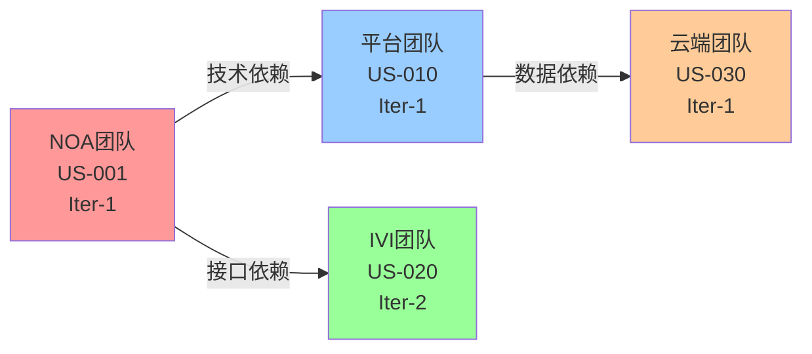

# F029 - PI Planning管理

> **Feature ID**: F029  
> **Feature Name**: PI Planning管理  
> **优先级**: MVP (P0)  
> **Story Points**: 55 SP  
> **预估工作量**: 22人天  
> **负责团队**: 项目管理团队 + 敏捷教练团队

---

## 📋 Feature概述

### 背景

PI Planning (Program Increment Planning) 是SAFe (Scaled Agile Framework) 中的核心实践，是多团队、多产品协同规划的关键阶段。在当前平台的端到端价值流中，PI Planning处于**需求分析之后、迭代研发之前**，起到"承上启下"的关键作用：

**承上**: 
- 消化产品规划的结果
- 理解需求分析的输出（用户需求、特性需求、PRD）

**启下**:
- 拆分任务到团队和迭代
- 识别依赖和风险
- 制定清晰的多迭代研发计划
- 输出Sprint Backlog，启动迭代研发

### 目标

建立完整的PI Planning能力，支撑：
1. ✅ **多团队容量规划** - 评估团队容量，选择特性
2. ✅ **Story分解与分配** - 将特性需求分解为Story，分配到迭代
3. ✅ **依赖识别与管理** - 识别团队间依赖，制定协同计划
4. ✅ **风险评估与应对** - 识别PI级别风险，制定缓解措施
5. ✅ **PI Objectives制定** - 每个团队制定PI目标和承诺
6. ✅ **置信度投票** - 团队对PI计划进行置信度投票

### 用户价值

**项目经理/Release Train Engineer**:
- 📊 组织和主持PI Planning会议
- 🔄 协调多团队协同
- 📈 掌握整体规划进度
- ⚠️ 及时识别和应对风险

**技术经理/Team Leader**:
- 👥 规划团队的PI工作
- 📋 制定团队PI Objectives
- 🔗 管理与其他团队的依赖
- ⚡ 评估和应对风险

**产品经理**:
- 🎯 明确PI的产品目标
- 📊 了解特性的实现计划
- 📅 协调产品交付时间

**开发/测试团队成员**:
- 🎯 清晰的PI目标和迭代计划
- 📋 了解自己的工作内容和时间安排
- 🤝 理解与其他团队的协作点

---

## 🎯 核心功能

### 1. PI准备（Day 0）

**功能描述**: PI Planning前的准备工作

**子功能**:
- 1.1 PI基本信息设置
  - PI周期（通常8-12周）
  - 包含的Iteration数量（通常4个）
  - 参与团队列表
  - PI目标

- 1.2 输入准备
  - 产品Backlog（已评审的特性需求列表）
  - 团队信息（成员、角色、技能）
  - 上一个PI的回顾结论
  - 已知的约束和依赖

- 1.3 会议准备
  - 创建PI Planning工作区
  - 邀请参会人员
  - 准备会议议程
  - 准备演示材料

**页面**:
- `/pi-planning/create` - 创建PI
- `/pi-planning/:id/preparation` - PI准备页面

---

### 2. 团队容量规划

**功能描述**: 每个团队评估容量，选择要完成的特性

**子功能**:
- 2.1 团队容量计算
  - 团队成员列表
  - 可用工作时间（扣除假期、培训等）
  - 团队速率（Velocity）
  - 容量计算（Story Points）

- 2.2 特性选择
  - 查看产品Backlog
  - 评估特性Story Points
  - 选择本PI要完成的特性
  - 容量vs承诺对比

- 2.3 初步Story分解
  - 将特性分解为Story
  - 估算Story Points
  - 初步分配到Iteration

**页面**:
- `/pi-planning/:id/team/:teamId/capacity` - 团队容量规划
- `/pi-planning/:id/team/:teamId/backlog` - 团队Backlog选择

---

### 3. Story分解与分配（Day 1）

**功能描述**: 详细的Story分解和迭代分配

**子功能**:
- 3.1 Story详细分解
  - 从特性需求拆解Story
  - 定义Story验收条件
  - 估算Story Points
  - 识别Story依赖

- 3.2 Iteration分配
  - 拖拽Story到Iteration
  - 检查Iteration容量
  - 调整Story优先级
  - 平衡迭代负载

- 3.3 团队规划板
  - 可视化展示团队的4个Iteration计划
  - 每个Iteration的Story列表
  - 容量vs负载对比
  - Story状态标识

**页面**:
- `/pi-planning/:id/team/:teamId/planning` - 团队规划页面
- `/pi-planning/:id/board` - PI Planning看板

**交互**:
- 拖拽Story到Iteration
- 拖拽Story调整优先级
- 实时容量计算和提示

---

### 4. 依赖识别与管理（Day 1 下午）

**功能描述**: 识别团队间的依赖关系，制定协同计划

**子功能**:
- 4.1 依赖创建
  - 创建Story/Feature间的依赖
  - 定义依赖类型（技术、数据、接口）
  - 设置依赖时间（哪个Iteration）
  - 标注关键路径

- 4.2 依赖网络图
  - 可视化展示所有依赖关系
  - 按团队着色
  - 突出显示关键路径
  - 支持交互式探索

- 4.3 依赖协调
  - 依赖状态跟踪
  - 依赖owner确认
  - 依赖时间协调
  - 依赖风险评估

**页面**:
- `/pi-planning/:id/dependencies` - 依赖管理
- `/pi-planning/:id/dependencies/network` - 依赖网络图

**可视化**:


---

### 5. 风险识别与评估（Day 2上午）

**功能描述**: 识别PI级别的风险，制定应对措施

**子功能**:
- 5.1 风险识别
  - 创建风险项
  - 风险分类（技术、资源、依赖、外部）
  - 风险描述和影响
  - 关联受影响的Story/Feature

- 5.2 风险评估
  - 风险概率评估（高/中/低）
  - 风险影响评估（高/中/低）
  - 风险矩阵可视化
  - 风险优先级排序

- 5.3 风险应对
  - 制定缓解措施
  - 分配风险owner
  - 设置风险检查点
  - 风险ROAM分类
    - Resolved (已解决)
    - Owned (已分配owner)
    - Accepted (已接受)
    - Mitigated (已缓解)

**页面**:
- `/pi-planning/:id/risks` - 风险管理
- `/pi-planning/:id/risks/matrix` - 风险矩阵

**风险看板**:
```
┌─────────────────────────────────────┐
│ 风险看板 (ROAM Board)                │
├─────────┬─────────┬─────────┬───────┤
│ Resolved │ Owned   │ Accepted│ Mitig│
├─────────┼─────────┼─────────┼───────┤
│ R1: ... │ R2: ... │ R5: ... │R3: ...│
│         │ R4: ... │         │       │
└─────────┴─────────┴─────────┴───────┘
```

---

### 6. PI Objectives制定（Day 2上午）

**功能描述**: 每个团队制定PI目标和承诺

**子功能**:
- 6.1 Objectives编写
  - 创建团队PI Objectives
  - 定义目标描述（业务价值语言）
  - 设置目标的业务价值（BV分数）
  - 标注是否为承诺目标（Committed）

- 6.2 Objectives汇总
  - 查看所有团队的Objectives
  - 检查Objectives对齐
  - 计算总BV分数
  - 识别冲突或冗余

**页面**:
- `/pi-planning/:id/team/:teamId/objectives` - 团队Objectives
- `/pi-planning/:id/objectives/summary` - Objectives汇总

**示例**:
```yaml
NOA团队 PI Objectives:
  1. 完成融合感知升级，精度提升5% (BV: 10, Committed)
  2. 集成4D毫米波雷达 (BV: 8, Committed)
  3. 优化路径规划算法，降低时延20% (BV: 7, Uncommitted)
  4. 完成DMS功能集成 (BV: 6, Committed)

总BV: 31 (Committed: 24, Uncommitted: 7)
```

---

### 7. 置信度投票（Day 2下午）

**功能描述**: 团队对PI计划进行置信度投票

**子功能**:
- 7.1 投票发起
  - 发起置信度投票
  - 展示当前PI计划（Objectives, Dependencies, Risks）
  - 设置投票规则（1-5分，3分及格）

- 7.2 投票过程
  - 每个团队投票（举手或线上）
  - 实时显示投票结果
  - 识别低分团队（< 3分）

- 7.3 问题解决
  - 低分团队说明原因
  - 讨论解决方案
  - 调整计划
  - 重新投票（如需要）

**页面**:
- `/pi-planning/:id/confidence-vote` - 置信度投票

**投票结果可视化**:
```
团队投票结果:
NOA团队:    👍👍👍👍👍 (5分) ✓
IVI团队:    👍👍👍👍   (4分) ✓
平台团队:   👍👍       (2分) ✗ 需要讨论
测试团队:   👍👍👍     (3分) ✓

平均分: 3.5 / 5.0
状态: 需要调整 (平台团队有顾虑)
```

---

### 8. PI计划发布

**功能描述**: 发布最终的PI计划，启动迭代研发

**子功能**:
- 8.1 计划确认
  - 确认所有团队Objectives
  - 确认所有依赖
  - 确认所有风险应对措施
  - 锁定PI计划

- 8.2 Sprint创建
  - 自动为每个团队创建Sprint 1
  - 导入Sprint 1的Story Backlog
  - 设置Sprint时间
  - 通知团队成员

- 8.3 PI看板
  - 创建PI跟踪看板
  - 展示所有团队的Objectives进度
  - 展示依赖状态
  - 展示风险状态

**页面**:
- `/pi-planning/:id/publish` - 发布PI计划
- `/pi/:id/board` - PI看板（跟踪）

---

## 📊 验收标准

### 功能验收

- [x] 支持创建和配置PI
- [x] 支持团队容量计算和特性选择
- [x] 支持Story分解和迭代分配
- [x] 支持依赖识别和网络图可视化
- [x] 支持风险识别、评估和ROAM管理
- [x] 支持团队PI Objectives制定
- [x] 支持置信度投票
- [x] 支持PI计划发布和Sprint创建

### 非功能验收

**性能**:
- PI Planning工作区加载 < 2秒
- 依赖网络图渲染 < 3秒（100+依赖）
- 实时协同延迟 < 500ms

**可用性**:
- 支持拖拽式交互
- 支持实时协同（多人同时规划）
- 支持离线编辑（网络断开后恢复）
- 支持移动端查看（Planning结果）

**协同**:
- 支持多团队同时规划
- 实时同步各团队进度
- 冲突检测和提示

---

## 🔗 文档导航

- [PRD文档](./PRD.md) - 详细产品需求文档
- [用户故事](./USER_STORIES.md) - 完整用户故事列表
- [数据模型](./DATA_MODEL.md) - PI Planning数据模型
- [API设计](./API_DESIGN.md) - PI Planning API
- [UI原型](./UI_PROTOTYPE.md) - PI Planning页面原型

**参考文档**:
- [PI Planning设计](../../../platform-rd-process/02-PI_PLANNING_DESIGN.md) - 完整的PI Planning流程设计
- [价值流与PI Planning集成](../../../platform-rd-process/03-VALUE_STREAM_WITH_PI_PLANNING.md)

---

## 📈 实施计划

### Phase 1: PI准备和团队规划（Sprint 1-2，4周）

**交付**:
- ✅ PI CRUD
- ✅ 团队容量规划
- ✅ Story分解和分配
- ✅ 团队规划板

**Story Points**: 21 SP

---

### Phase 2: 依赖和风险管理（Sprint 3-4，4周）

**交付**:
- ✅ 依赖创建和管理
- ✅ 依赖网络图可视化
- ✅ 风险识别和评估
- ✅ 风险ROAM看板

**Story Points**: 18 SP

---

### Phase 3: Objectives和投票（Sprint 5-6，4周）

**交付**:
- ✅ PI Objectives制定
- ✅ 置信度投票
- ✅ PI计划发布
- ✅ PI看板

**Story Points**: 16 SP

---

## 🎯 关键指标

### 业务指标
- PI Planning参与率 ≥ 90%
- 置信度投票平均分 ≥ 3.5/5.0
- PI Objectives达成率 ≥ 80%
- 依赖按时解决率 ≥ 85%

### 使用指标
- PI Planning会议次数
- 平均PI Planning时长
- 依赖识别数量
- 风险识别和解决数量

---

## 📝 变更历史

- **v1.0** (2025-01-03): 初始版本，基于PI Planning设计文档创建

---

**维护团队**: 项目管理团队 + 敏捷教练团队  
**最后更新**: 2025-01-03

