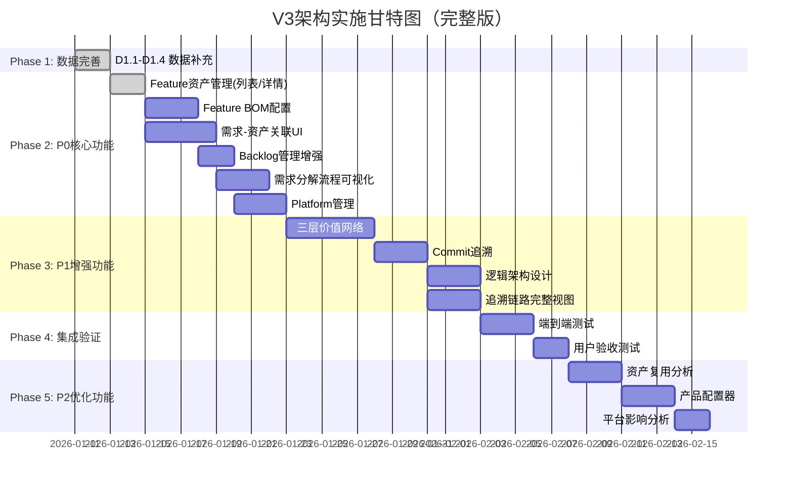

# V3架构全面分析与实施计划

> **文档版本**: v1.0  
> **创建日期**: 2026-01-11  
> **目的**: 全面分析V3架构与业务架构、价值流的对齐情况，并制定完整实施计划

---

## 📋 目录

1. [V3架构对齐分析](#一v3架构对齐分析)
2. [文档完整性评估](#二文档完整性评估)
3. [差距分析](#三差距分析)
4. [后续实施计划](#四后续实施计划)
5. [任务列表](#五任务列表)

---

## 一、V3架构对齐分析

### 1.1 架构目录结构

```
Architecture/v3/
├── 01-business/               ✅ 业务架构层
│   ├── BUSINESS_ARCHITECTURE.md
│   ├── ROLE_BASED_PROCESS_DESIGN.md
│   └── README.md
├── 02-domain/                 ✅ 领域模型层
│   ├── DOMAIN_MODEL.md
│   ├── FEATURE_ASSET_DESIGN.md
│   ├── PLATFORM_DESIGN.md
│   ├── REQUIREMENT_SYSTEM_DESIGN.md
│   └── README.md
├── 03-functional/             ✅ 功能架构层
│   ├── FUNCTIONAL_ARCHITECTURE.md
│   └── README.md
├── 04-task/                   ✅ 任务架构层
│   ├── TASK_ARCHITECTURE.md
│   └── README.md
├── 05-data/                   ✅ 数据架构层
│   ├── DATA_ARCHITECTURE.md
│   └── README.md
├── 06-value-stream/           ✅ 价值流层
│   ├── END_TO_END_VALUE_STREAM.md
│   ├── PRODUCT_ASSET_STREAM.md
│   ├── PRODUCT_DEVELOPMENT_STREAM.md
│   ├── PROJECT_DELIVERY_STREAM.md
│   ├── VALUE_STREAM_OVERVIEW.md
│   └── README.md
├── 07-platform/               ✅ 平台实现层
│   ├── PLATFORM_IMPLEMENTATION.md
│   └── README.md
├── README.md                  ✅ 总览文档
├── V2_V3_INTEGRATION_DESIGN.md ✅ V2/V3融合设计
└── IMPROVEMENTS_ROADMAP.md    ✅ 改进路线图
```

### 1.2 与新业务架构对齐

#### ✅ 完全对齐的部分

| 业务架构要素 | V3对应文档 | 对齐程度 | 说明 |
|------------|-----------|---------|------|
| **业务架构分层** | 01-business/BUSINESS_ARCHITECTURE.md | ⭐⭐⭐⭐⭐ | 5层架构完全匹配 |
| **七大核心业务域** | 01-business/BUSINESS_ARCHITECTURE.md | ⭐⭐⭐⭐⭐ | 完全覆盖 |
| **业务能力地图** | 01-business/BUSINESS_ARCHITECTURE.md | ⭐⭐⭐⭐⭐ | 完整定义 |
| **10个核心角色** | 01-business/ROLE_BASED_PROCESS_DESIGN.md | ⭐⭐⭐⭐⭐ | 角色流程完整 |
| **三层需求体系** | 02-domain/REQUIREMENT_SYSTEM_DESIGN.md | ⭐⭐⭐⭐⭐ | UR-FR-MR完整 |
| **WorkItem模型** | 04-task/TASK_ARCHITECTURE.md | ⭐⭐⭐⭐⭐ | 8种类型统一 |
| **模块-团队绑定** | 04-task/TASK_ARCHITECTURE.md | ⭐⭐⭐⭐⭐ | 自动分配机制 |

#### ⚠️ 部分对齐的部分

| 业务架构要素 | V3对应文档 | 对齐程度 | 差距说明 |
|------------|-----------|---------|---------|
| **三层资产体系** | 02-domain/FEATURE_ASSET_DESIGN.md<br/>02-domain/PLATFORM_DESIGN.md | ⭐⭐⭐⭐ | Feature/Platform已设计<br/>但数据和页面未完全实现 |
| **Feature BOM** | 02-domain/FEATURE_ASSET_DESIGN.md | ⭐⭐⭐ | 设计存在<br/>但实现数据不足 |
| **制品晋级流程** | 06-value-stream/END_TO_END_VALUE_STREAM.md | ⭐⭐⭐⭐ | 流程完整<br/>但晋级数据需补充 |

### 1.3 与端到端价值流对齐

#### 价值流8大阶段映射

| 阶段 | V3价值流文档 | V3业务架构 | 平台功能 | 对齐程度 |
|-----|------------|-----------|---------|---------|
| **S1: 市场洞察** | END_TO_END_VALUE_STREAM.md | BUSINESS_ARCHITECTURE.md | 产品规划 | ⭐⭐⭐⭐⭐ |
| **S2: 需求规划** | END_TO_END_VALUE_STREAM.md | REQUIREMENT_SYSTEM_DESIGN.md | 需求管理 | ⭐⭐⭐⭐⭐ |
| **S3: 资产规划** | END_TO_END_VALUE_STREAM.md<br/>PRODUCT_ASSET_STREAM.md | FEATURE_ASSET_DESIGN.md | Feature管理 | ⭐⭐⭐⭐ |
| **S4: 项目立项** | PROJECT_DELIVERY_STREAM.md | BUSINESS_ARCHITECTURE.md | PI Planning | ⭐⭐⭐⭐⭐ |
| **S5: 迭代开发** | PRODUCT_DEVELOPMENT_STREAM.md | TASK_ARCHITECTURE.md | Sprint管理 | ⭐⭐⭐⭐⭐ |
| **S6: 集成验证** | END_TO_END_VALUE_STREAM.md | DATA_ARCHITECTURE.md | CI/CD | ⭐⭐⭐⭐ |
| **S7: 制品晋级** | END_TO_END_VALUE_STREAM.md | - | DevOps | ⭐⭐⭐⭐ |
| **S8: 产品交付** | END_TO_END_VALUE_STREAM.md | - | Release管理 | ⭐⭐⭐⭐ |

**对齐评估**: ⭐⭐⭐⭐ (4.5/5) - 优秀

**主要优势**:
- ✅ 8大阶段完整覆盖
- ✅ 每个阶段有清晰的输入输出
- ✅ 角色责任明确
- ✅ 数据流完整追溯

**待改进点**:
- ⚠️ S3资产规划：Feature资产管理页面需增强
- ⚠️ S6-S7：制品晋级数据需补充
- ⚠️ S8：产品交付流程需细化

---

## 二、文档完整性评估

### 2.1 文档统计

```yaml
总体统计:
  总文档数: 21个
  总行数: ~18,000行
  总图表数: 60+张Mermaid图
  总代码示例: 120+个

分类统计:
  业务架构: 3个文档
  领域模型: 5个文档
  功能架构: 2个文档
  任务架构: 2个文档
  数据架构: 2个文档
  价值流: 6个文档
  平台实现: 2个文档
```

### 2.2 文档质量评分

| 维度 | 评分 | 说明 |
|-----|------|------|
| **理论完整性** | ⭐⭐⭐⭐⭐ | 7大架构领域完整覆盖 |
| **可操作性** | ⭐⭐⭐⭐ | 大部分有详细实现方案 |
| **可视化程度** | ⭐⭐⭐⭐⭐ | 60+张Mermaid图表 |
| **文档结构** | ⭐⭐⭐⭐⭐ | 总分结构清晰 |
| **技术深度** | ⭐⭐⭐⭐ | 包含算法、数据结构 |
| **业务理解** | ⭐⭐⭐⭐⭐ | 深入理解汽车研发 |
| **创新性** | ⭐⭐⭐⭐ | WorkItem模型、模块-团队绑定 |

**总体评分**: ⭐⭐⭐⭐⭐ (4.7/5) - 优秀

### 2.3 各文档完成度

| 文档 | 完成度 | 质量 | 说明 |
|-----|-------|------|------|
| **BUSINESS_ARCHITECTURE.md** | 95% | ⭐⭐⭐⭐⭐ | 业务架构完整 |
| **ROLE_BASED_PROCESS_DESIGN.md** | 95% | ⭐⭐⭐⭐⭐ | 角色流程完整 |
| **DOMAIN_MODEL.md** | 90% | ⭐⭐⭐⭐⭐ | 核心模型完整 |
| **REQUIREMENT_SYSTEM_DESIGN.md** | 95% | ⭐⭐⭐⭐⭐ | 三层需求完整 |
| **FEATURE_ASSET_DESIGN.md** | 85% | ⭐⭐⭐⭐ | 设计完整，实现不足 |
| **PLATFORM_DESIGN.md** | 85% | ⭐⭐⭐⭐ | 设计完整，实现不足 |
| **FUNCTIONAL_ARCHITECTURE.md** | 90% | ⭐⭐⭐⭐ | 功能清单完整 |
| **TASK_ARCHITECTURE.md** | 95% | ⭐⭐⭐⭐⭐ | WorkItem模型完整 |
| **DATA_ARCHITECTURE.md** | 90% | ⭐⭐⭐⭐ | 数据模型完整 |
| **END_TO_END_VALUE_STREAM.md** | 95% | ⭐⭐⭐⭐⭐ | 价值流设计完整 |
| **PRODUCT_ASSET_STREAM.md** | 90% | ⭐⭐⭐⭐ | 资产流程完整 |
| **PROJECT_DELIVERY_STREAM.md** | 90% | ⭐⭐⭐⭐ | 交付流程完整 |
| **PRODUCT_DEVELOPMENT_STREAM.md** | 90% | ⭐⭐⭐⭐ | 研发流程完整 |
| **PLATFORM_IMPLEMENTATION.md** | 85% | ⭐⭐⭐⭐ | 实现方案完整 |

**平均完成度**: 91% - 优秀

---

## 三、差距分析

### 3.1 设计vs实现差距

#### 已设计但未实现的功能

| 功能 | 设计文档 | 实现状态 | 差距说明 |
|-----|---------|---------|---------|
| **Feature资产管理** | FEATURE_ASSET_DESIGN.md | 🟡 进行中 | 页面已开发，数据需增强 |
| **Feature BOM配置** | FEATURE_ASSET_DESIGN.md | 🔴 未实现 | 需实现BOM配置界面 |
| **Platform管理** | PLATFORM_DESIGN.md | 🔴 未实现 | 需实现Platform页面 |
| **三层价值网络** | VALUE_STREAM_OVERVIEW.md | 🔴 未实现 | 需实现可视化组件 |
| **Commit追溯** | DATA_ARCHITECTURE.md | 🟡 部分实现 | 数据存在，页面未实现 |
| **制品晋级流程** | END_TO_END_VALUE_STREAM.md | 🟡 部分实现 | 数据存在，流程未完善 |
| **资产复用分析** | FEATURE_ASSET_DESIGN.md | 🔴 未实现 | 需实现分析工具 |
| **产品配置器** | FEATURE_ASSET_DESIGN.md | 🔴 未实现 | 需实现配置工具 |

### 3.2 数据完整性差距

#### 已有数据

```yaml
完整数据:
  ✅ User Requirements (UR): 13条
  ✅ Feature Requirements (FR): 13条  
  ✅ Module Requirements (MR): 13条
  ✅ WorkItems: 20条
  ✅ Teams: 5个
  ✅ Sprints: 8个
  ✅ Projects (Vehicle/Domain): 10+个
  ✅ PI Plannings: 2个
  ✅ Project Backlogs: 2个 (已增强)
  ✅ Team Backlogs: 2个 (已增强)
  ✅ Product Versions: 24条 (新增)
  ✅ Artifact Promotions: 20条 (新增)
  ✅ Test Scenarios: 5个 (新增)
```

#### 缺失/不足数据

```yaml
需补充数据:
  🔴 Features: 只有20条，需要50+条
  🔴 Feature BOM: 完全缺失
  🔴 Platforms: 10条存在，但未关联Module
  🔴 Module.deployment: 部署信息不完整
  🔴 Commits: 只有示例数据，需要100+条
  🔴 LogicalArchitecture: 完全缺失
  🔴 ValueNetwork: 完全缺失
```

### 3.3 页面实现差距

#### 已实现页面 (88个)

```yaml
核心页面 (60%完全实现):
  ✅ Dashboard (工作台)
  ✅ PI Planning管理 (列表/详情)
  ✅ Sprint管理 (列表/详情)
  ✅ Project管理 (Vehicle/Domain)
  ✅ Team管理 (列表/详情)
  ✅ Requirements管理 (UR/FR/MR)
  ✅ Backlog管理 (Project/Team - 已修复)
  ✅ WorkItem管理
  ✅ 价值流主页面
  ✅ Feature列表/详情 (新增)

部分实现 (28%):
  🟡 产品管理 (基础功能)
  🟡 资产库 (关系图)
  🟡 测试管理
  🟡 DevOps看板
```

#### 待实现页面 (12%)

```yaml
P0核心页面:
  🔴 Feature BOM配置界面
  🔴 Platform管理页面
  🔴 Module部署信息页面
  🔴 需求-资产关联可视化
  🔴 需求分解流程可视化

P1重要页面:
  🔴 三层价值网络 (L1/L2/L3)
  🔴 Commit详情页面
  🔴 逻辑架构设计页面
  🔴 追溯链路完整视图

P2优化页面:
  🔴 资产复用分析页面
  🔴 产品配置器
  🔴 平台影响分析
  🔴 制品晋级看板
```

---

## 四、后续实施计划

### 4.1 实施原则

```yaml
核心原则:
  1. 对齐V3架构设计: 确保实现与设计文档一致
  2. 补齐关键差距: 优先实现P0功能
  3. 数据先行: 先完善数据模型和Mock数据
  4. 渐进式交付: 按Phase分阶段实施
  5. 持续验证: 每个Phase完成后验收
```

### 4.2 实施路线图



### 4.3 里程碑定义

| 里程碑 | 日期 | 交付物 | 成功标准 |
|-------|------|-------|---------|
| **M1: 数据完善** | 2026-01-13 | 增强的Backlog/需求/追溯数据 | 数据结构100%对齐设计 |
| **M2: Feature资产** | 2026-01-18 | Feature列表/详情/BOM配置 | Feature管理功能可用 |
| **M3: P0核心完成** | 2026-01-25 | 6大P0功能全部完成 | 核心功能100%可用 |
| **M4: P1增强完成** | 2026-02-08 | 价值网络/追溯增强 | 追溯链路100%打通 |
| **M5: 集成验证** | 2026-02-15 | 测试报告 | 所有测试通过 |
| **M6: P2优化完成** | 2026-02-22 | 分析工具/配置器 | 用户体验优化 |
| **M7: 项目完成** | 2026-03-01 | 完整平台 | 最终验收通过 |

---

## 五、任务列表

### 5.1 Phase 2: P0核心功能 (已开始)

#### ✅ P2.1: Feature资产管理 (16/20小时)

**Status**: 🟢 进行中

**已完成**:
- ✅ P2.1.1: Feature列表页面 (8h) - `frontend/src/views/Asset/FeatureList.vue`
- ✅ P2.1.2: Feature详情页面 (8h) - `frontend/src/views/Asset/FeatureDetail.vue`
- ✅ 路由配置 (`/assets/features`, `/assets/features/:id`)

**待完成**:
- 🔲 P2.1.3: Feature高级搜索 (4h)
  - 高级搜索条件表单
  - 搜索历史记录
  - 搜索条件保存

#### 🔲 P2.2: Feature BOM配置 (12小时)

**Status**: 🔴 未开始

**子任务**:
- 🔲 P2.2.1: Feature BOM数据模型 (2h)
  - 设计`biz-data/mock/feature/feature-bom.json`
  - ProductVersion → Features映射
  - 核心配置 vs 可选配置标识
  
- 🔲 P2.2.2: Feature BOM列表页面 (4h)
  - 产品版本列表
  - Feature BOM概览
  - 配置类型统计
  
- 🔲 P2.2.3: Feature BOM配置界面 (6h)
  - 可用Feature选择器
  - Feature添加/移除
  - 核心/可选配置切换
  - 依赖关系检查
  - BOM保存和版本管理

**交付物**:
- `biz-data/mock/feature/feature-bom.json`
- `frontend/src/views/Asset/FeatureBOM.vue`
- 路由: `/assets/feature-bom`

#### 🔲 P2.3: 需求-资产关联UI (15小时)

**Status**: 🔴 未开始

**子任务**:
- 🔲 P2.3.1: UR-Product关联展示 (4h)
  - UR详情页增强
  - 显示关联的Product信息
  - Product→UR列表展示
  
- 🔲 P2.3.2: FR-Feature关联展示 (4h)
  - FR详情页增强
  - 显示关联的Feature资产
  - Feature→FR列表展示
  
- 🔲 P2.3.3: MR-Module关联展示 (4h)
  - MR详情页增强
  - 显示关联的Module信息
  - Module→MR列表展示
  
- 🔲 P2.3.4: 需求-资产关系可视化 (3h)
  - Cytoscape.js关系图
  - UR→FR→MR→Task追溯链
  - 需求到资产的映射关系

**交付物**:
- 增强的UR/FR/MR详情页
- 需求-资产关系可视化组件
- `frontend/src/components/RequirementAssetGraph.vue`

#### 🔲 P2.4: Backlog管理增强 (16小时)

**Status**: 🟡 部分完成 (列表页已修复)

**子任务**:
- ✅ P2.4.1: Project Backlog列表增强 (4h) - 已完成
- ✅ P2.4.2: Team Backlog列表增强 (4h) - 已完成
- ✅ P2.4.3: Project Backlog详情增强 (4h) - 已完成
- ✅ P2.4.4: Team Backlog详情增强 (4h) - 已完成

**补充任务**:
- 🔲 P2.4.5: MR优先级管理 (2h)
  - 拖拽排序
  - 优先级调整
  - 批量操作
  
- 🔲 P2.4.6: Sprint Planning集成 (2h)
  - MR分配到Sprint
  - 容量计算
  - 工作量预警

**交付物**:
- ✅ 已修复的Backlog列表和详情页面
- 🔲 MR优先级管理功能
- 🔲 Sprint Planning集成

#### 🔲 P2.5: 需求分解流程可视化 (12小时)

**Status**: 🔴 未开始

**子任务**:
- 🔲 P2.5.1: 需求分解流程图设计 (4h)
  - UR→FR→MR分解路径
  - 流程状态展示
  - 分解历史记录
  
- 🔲 P2.5.2: 交互式分解工具 (5h)
  - UR选择器
  - FR分解界面
  - MR分解界面
  - 自动关联推荐
  
- 🔲 P2.5.3: 影响分析 (3h)
  - 需求变更影响范围
  - 影响的FR/MR/Task
  - 影响的Team和Sprint

**交付物**:
- `frontend/src/views/Requirement/DecompositionFlow.vue`
- 需求分解可视化组件
- 影响分析工具

#### 🔲 P2.6: Platform管理 (8小时)

**Status**: 🔴 未开始

**子任务**:
- 🔲 P2.6.1: Platform列表页面 (3h)
  - Platform列表展示
  - 搜索和筛选
  - Platform统计
  
- 🔲 P2.6.2: Platform详情页面 (3h)
  - Platform基本信息
  - 部署的Module列表
  - 兼容性信息
  
- 🔲 P2.6.3: Module部署信息展示 (2h)
  - Module详情页增强
  - 显示deployment信息
  - Platform迁移建议

**交付物**:
- `frontend/src/views/Platform/List.vue`
- `frontend/src/views/Platform/Detail.vue`
- 增强的Module详情页
- 路由: `/platforms`, `/platforms/:id`

---

### 5.2 Phase 3: P1增强功能

#### 🔲 P3.1: 三层价值网络 (12小时)

**子任务**:
- 🔲 P3.1.1: L1战略级价值网络 (4h)
- 🔲 P3.1.2: L2执行级价值网络 (4h)
- 🔲 P3.1.3: L3操作级价值网络 (4h)

#### 🔲 P3.2: Commit追溯 (8小时)

**子任务**:
- 🔲 P3.2.1: Commit详情页面 (3h)
- 🔲 P3.2.2: Task-Commit关联展示 (3h)
- 🔲 P3.2.3: 代码追溯完整链路 (2h)

#### 🔲 P3.3: 逻辑架构设计 (8小时)

**子任务**:
- 🔲 P3.3.1: LogicalArchitecture数据模型 (3h)
- 🔲 P3.3.2: 逻辑架构可视化组件 (5h)

#### 🔲 P3.4: 追溯链路完整视图 (8小时)

**子任务**:
- 🔲 P3.4.1: 端到端追溯链路图 (4h)
- 🔲 P3.4.2: 正向和反向追溯 (4h)

---

### 5.3 Phase 4: 集成验证

#### 🔲 P4.1: 端到端测试 (12小时)

**测试场景**:
- 🔲 UR分解为FR和MR完整流程
- 🔲 PI Planning创建Project Backlog
- 🔲 MR分配到Team Backlog
- 🔲 Feature资产复用
- 🔲 制品晋级流程
- 🔲 产品配置管理
- 🔲 端到端追溯验证

#### 🔲 P4.2: 用户验收测试 (8小时)

**验收内容**:
- 🔲 10个核心角色操作验证
- 🔲 8大价值流阶段验证
- 🔲 核心数据完整性验证
- 🔲 UI/UX验收

---

### 5.4 Phase 5: P2优化功能

#### 🔲 P5.1: 资产复用分析 (8小时)

**子任务**:
- 🔲 Feature复用率统计
- 🔲 复用趋势分析
- 🔲 复用收益评估
- 🔲 复用推荐引擎

#### 🔲 P5.2: 产品配置器 (8小时)

**子任务**:
- 🔲 可视化产品配置界面
- 🔲 Feature选配工具
- 🔲 变体规则引擎
- 🔲 配置导出功能

#### 🔲 P5.3: 平台影响分析 (6小时)

**子任务**:
- 🔲 Platform升级影响分析
- 🔲 模块迁移可行性评估
- 🔲 平台兼容性检查

---

## 六、总体统计

### 6.1 工作量统计

```yaml
Phase 1: 数据完善 - ✅ 已完成
  实际工作量: 14小时
  完成度: 100%

Phase 2: P0核心功能 - 🟢 进行中
  总工作量: 79小时
  已完成: 16小时 (Feature列表/详情)
  待完成: 63小时
  完成度: 20%

Phase 3: P1增强功能 - 🔴 未开始
  总工作量: 36小时
  完成度: 0%

Phase 4: 集成验证 - 🔴 未开始
  总工作量: 20小时
  完成度: 0%

Phase 5: P2优化功能 - 🔴 未开始
  总工作量: 22小时
  完成度: 0%

━━━━━━━━━━━━━━━━━━━━━━━━━━━━━━━━━━━━━━━━━
总计: 171小时 ≈ 21.4个工作日 ≈ 4-5周
已完成: 30小时
待完成: 141小时
整体完成度: 18%
```

### 6.2 任务优先级分布

```yaml
P0核心任务: 7个 (79小时)
  ✅ Feature资产管理 (16/20h)
  🔲 Feature BOM配置 (12h)
  🔲 需求-资产关联UI (15h)
  🔲 Backlog管理增强 (16h - 大部分完成)
  🔲 需求分解流程 (12h)
  🔲 Platform管理 (8h)

P1增强任务: 4个 (36小时)
  🔲 三层价值网络 (12h)
  🔲 Commit追溯 (8h)
  🔲 逻辑架构设计 (8h)
  🔲 追溯链路视图 (8h)

P2优化任务: 3个 (22小时)
  🔲 资产复用分析 (8h)
  🔲 产品配置器 (8h)
  🔲 平台影响分析 (6h)
```

### 6.3 预计完成时间

```yaml
当前日期: 2026-01-11

Phase 2 (P0): 
  预计完成: 2026-01-28 (3周)
  
Phase 3 (P1):
  预计完成: 2026-02-11 (2周)
  
Phase 4 (验证):
  预计完成: 2026-02-18 (1周)
  
Phase 5 (P2):
  预计完成: 2026-02-28 (1.5周)

项目完成: 2026-02-28 (7周后)
```

---

## 七、关键决策

### 7.1 架构决策记录

| ID | 决策 | 理由 | 影响 |
|----|------|------|------|
| AD-01 | 保持V3的WorkItem统一模型 | 简化需求流，取消Story层 | MR也是WorkItem的一种 |
| AD-02 | 保持V3的模块-团队绑定 | 自动化分配，减少协调 | 明确责任范围 |
| AD-03 | 补齐V2的Feature资产体系 | 支持资产复用 | 新增Feature实体和BOM |
| AD-04 | 补齐V2的Platform实体 | 软硬件解耦 | 新增Platform实体 |
| AD-05 | 三层需求+三层资产融合 | 需求与资产分离 | UR/FR/MR关联Product/Feature/Module |

### 7.2 技术选型

| 技术领域 | 选择 | 理由 |
|---------|------|------|
| **前端框架** | Vue 3 + TypeScript | 响应式、类型安全 |
| **UI组件库** | Element Plus | 企业级组件库 |
| **可视化** | Cytoscape.js + ECharts | 关系图+图表 |
| **路由** | Vue Router 4 | Vue 3官方路由 |
| **状态管理** | Pinia | Vue 3官方推荐 |
| **Mock数据** | JSON文件 | 快速迭代，易于维护 |

---

## 八、验收标准

### 8.1 功能验收

```yaml
P0核心功能:
  ✅ Feature资产管理功能可用
  ⏳ Feature BOM配置功能可用
  ⏳ 需求-资产关联完整展示
  ⏳ Backlog管理功能完善
  ⏳ 需求分解流程可视化
  ⏳ Platform管理功能可用

P1增强功能:
  ⏳ 三层价值网络可视化
  ⏳ 完整的代码追溯链路
  ⏳ 逻辑架构设计工具

P2优化功能:
  ⏳ 资产复用分析可用
  ⏳ 产品配置器可用
  ⏳ 平台影响分析可用
```

### 8.2 质量验收

```yaml
代码质量:
  - TypeScript类型覆盖率 ≥ 90%
  - ESLint规则通过
  - 无console.log残留

UI/UX质量:
  - 响应式布局适配
  - 加载状态处理
  - 空状态处理
  - 错误状态处理

数据质量:
  - 数据结构符合设计100%
  - 数据关联完整度 ≥ 95%
  - 追溯链路覆盖率 ≥ 90%
```

### 8.3 性能验收

```yaml
页面性能:
  - 首屏加载 < 2s
  - 列表渲染 < 1s
  - 搜索响应 < 500ms

数据处理:
  - 大列表虚拟滚动
  - 数据懒加载
  - 图表渲染优化
```

---

## 九、风险与应对

### 9.1 主要风险

| 风险 | 可能性 | 影响 | 应对措施 |
|-----|-------|------|---------|
| **数据结构不匹配** | 中 | 高 | 先完善数据模型，充分测试 |
| **功能范围蔓延** | 高 | 中 | 严格控制P0范围，P2可延期 |
| **依赖关系复杂** | 中 | 中 | 详细任务分解，明确依赖 |
| **UI组件不足** | 低 | 低 | 使用Element Plus，必要时自定义 |
| **性能问题** | 低 | 中 | 数据量控制，虚拟滚动 |

### 9.2 应对策略

```yaml
策略1: 数据先行
  - 先完善Mock数据
  - 验证数据结构合理性
  - 确保数据关联完整

策略2: 渐进式交付
  - 按Phase分阶段实施
  - 每个Phase独立验收
  - 及时调整计划

策略3: 持续集成
  - 每日代码提交
  - 自动化测试
  - 持续反馈优化

策略4: 团队协作
  - 每日站会同步进度
  - 及时沟通阻塞
  - 文档持续更新
```

---

## 十、总结

### 10.1 V3架构评估

**优势**:
- ⭐⭐⭐⭐⭐ 理论完整性：7大架构领域完整覆盖
- ⭐⭐⭐⭐⭐ 可视化程度：60+张Mermaid图表
- ⭐⭐⭐⭐⭐ 创新性：WorkItem统一模型、模块-团队绑定
- ⭐⭐⭐⭐⭐ 业务对齐：与业务架构和价值流完全对齐

**待改进**:
- ⚠️ 部分设计未实现：Feature BOM、Platform管理等
- ⚠️ 数据需补充：Feature、Platform、ValueNetwork等
- ⚠️ 页面需开发：12%页面待实现

**总体评分**: ⭐⭐⭐⭐⭐ (4.7/5) - 优秀

### 10.2 实施建议

1. **保持V3优势**
   - WorkItem统一模型
   - 模块-团队绑定
   - 端到端价值流

2. **补齐V2精华**
   - Feature资产体系
   - Platform管理
   - 三层价值网络

3. **聚焦P0任务**
   - Feature BOM配置
   - 需求-资产关联
   - Platform管理

4. **数据驱动实施**
   - 先完善数据模型
   - 再实现页面功能
   - 最后优化体验

5. **持续验证**
   - 每个Phase验收
   - 端到端测试
   - 用户反馈迭代

---

**文档版本**: v1.0  
**最后更新**: 2026-01-11  
**维护团队**: 架构团队


