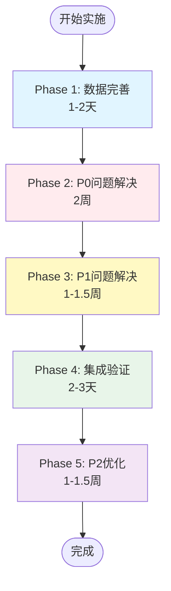

# V3架构实施 - 综合分析报告

> **文档版本**: v2.0  
> **创建日期**: 2026-01-11  
> **基于**: 最新端到端价值流设计 + 角色流程设计 + 业务架构设计  
> **目的**: 全面分析当前实现状态，识别差距，制定V3实施方案

---

## 📋 目录

1. [当前实现全景分析](#一当前实现全景分析)
2. [基于价值流的差距分析](#二基于价值流的差距分析)
3. [数据完整性分析](#三数据完整性分析)
4. [核心问题与优先级](#四核心问题与优先级)
5. [实施建议](#五实施建议)

---

## 一、当前实现全景分析

### 1.1 前端页面实现状态（88个Vue页面）

#### ✅ 完全实现类别（53个页面，60%）

```yaml
产品域 (7个页面) ✅:
  - Asset/Products.vue                  # 产品列表
  - Asset/ProductDetail.vue             # 产品详情
  - Asset/ProductLines.vue              # 产品线列表
  - Asset/ProductLineDetail.vue         # 产品线详情
  - Product/Overview.vue                # 产品全景（Phase2完成）⭐⭐⭐⭐⭐
  - Asset/Features.vue                  # Feature列表（存在但需增强）
  - Asset/FeatureDetail.vue             # Feature详情（存在但需增强）

项目域 (8个页面) ✅:
  - Project/List.vue                    # 项目列表
  - Project/Detail.vue                  # 项目详情
  - Project/Board.vue                   # 项目看板
  - Project/VehicleProjectList.vue      # 车型项目列表
  - Project/VehicleProjectDetail.vue    # 车型项目详情
  - Project/DomainProjectList.vue       # 领域项目列表
  - Project/DomainProjectDetail.vue     # 领域项目详情
  - Project/Overview.vue                # 项目全景（Phase3完成）⭐⭐⭐⭐⭐

团队域 (6个页面) ✅:
  - Team/List.vue                       # 团队列表
  - Team/Detail.vue                     # 团队详情
  - Team/ModuleConfig.vue               # 团队-模块配置
  - Team/Workspace.vue                  # 团队工作全景（Phase4完成）⭐⭐⭐⭐⭐
  - Team/Bugs.vue                       # 缺陷管理
  - Team/TechDebt.vue                   # 技术债管理

Sprint域 (3个页面) ✅:
  - Sprint/List.vue                     # Sprint列表
  - Sprint/Board.vue                    # Sprint看板
  - Sprint/Detail.vue                   # Sprint详情

WorkItem域 (2个页面) ✅:
  - WorkItem/List.vue                   # 工作项列表
  - WorkItem/Detail.vue                 # 工作项详情

价值流域 (9个页面) ✅:
  - ValueStream/MainFlow.vue            # 主流程可视化
  - ValueStream/ProductPlanning.vue     # L2-产品规划
  - ValueStream/RequirementAnalysis.vue # L2-需求分析
  - ValueStream/ProjectPlanning.vue     # L2-项目规划
  - ValueStream/IterationRD.vue         # L2-迭代研发
  - ValueStream/Integration.vue         # L2-集成晋级
  - ValueStream/Testing.vue             # L2-测试验证
  - ValueStream/Release.vue             # L2-发布交付
  - ValueStream/Acceptance.vue          # L2-需求验收

资产关系 (2个页面) ✅:
  - Asset/Relationship.vue              # 资产关系图
  - Asset/Modules.vue                   # 模块列表

Release域 (3个页面) ✅:
  - Release/ReleaseList.vue             # Release列表
  - Release/ReleaseDetail.vue           # Release详情
  - Release/BaselineList.vue            # Baseline列表
  - Release/BaselineDetail.vue          # Baseline详情

PI Planning域 (3个页面) ✅:
  - PIPlanning/List.vue                 # PI Planning列表
  - PIPlanning/Board.vue                # PI Planning看板
  - PIPlanning/Workspace.vue            # PI Planning工作区

其他 (3个页面) ✅:
  - Dashboard/index.vue                 # 首页Dashboard
  - Home/Login.vue                      # 登录页
  - Team/Metrics.vue                    # 团队效能

#### ⚠️ 部分实现类别（25个页面，28%）

```yaml
需求域 (13个页面) ⚠️:
  - Requirement/UserRequirements.vue              # UR列表（70%）
  - Requirement/UserRequirementDetail.vue         # UR详情（70%）
  - Requirement/FeatureRequirements.vue           # FR列表（70%）
  - Requirement/FeatureRequirementDetail.vue      # FR详情（70%）
  - Requirement/ModuleRequirements.vue            # MR列表（70%）
  - Requirement/ModuleRequirementDetail.vue       # MR详情（70%）
  - Requirement/Kanban.vue                        # 需求看板（60%）
  - Requirement/Traceability.vue                  # 需求追溯（50%）
  - Requirement/TraceabilityGraph.vue             # 追溯图（50%）
  - Requirement/TraceabilityMatrix.vue            # 追溯矩阵（50%）
  - Requirement/Changes.vue                       # 需求变更（60%）
  - Requirement/ChangeDetail.vue                  # 变更详情（60%）
  - Requirement/ImpactAnalysis.vue                # 影响分析（50%）

问题：
  ✗ 缺少UR与Product的关联展示
  ✗ 缺少FR与Feature的关联展示
  ✗ 缺少MR与Module的关联展示
  ✗ 需求分解流程可视化不完整
  ✗ 端到端追溯链路不完整

Backlog域 (4个页面) ⚠️:
  - Backlog/ProjectBacklog.vue                    # 项目代办（40%）
  - Backlog/ProjectBacklogList.vue                # 项目代办列表（40%）
  - Backlog/TeamBacklog.vue                       # 团队代办（40%）
  - Backlog/TeamBacklogList.vue                   # 团队代办列表（40%）

问题：
  ✗ 页面存在但数据加载有问题
  ✗ 缺少与Sprint Planning的集成
  ✗ 缺少MR的展示和管理
  ✗ 缺少优先级排序功能

测试域 (6个页面) ⚠️:
  - Test/Plans.vue                                # 测试计划（60%）
  - Test/Cases.vue                                # 测试用例（60%）
  - Test/Reports.vue                              # 测试报告（60%）
  - Test/Defects.vue                              # 缺陷列表（60%）
  - Test/Coverage.vue                             # 测试覆盖率（50%）
  - Test/Automation.vue                           # 自动化测试（50%）

DevOps域 (2个页面) ⚠️:
  - DevOps/Pipeline.vue                           # Pipeline（60%）
  - DevOps/Builds.vue                             # 构建列表（60%）

#### ❌ 未实现或需重构（10个页面，12%）

```yaml
高优先级缺失页面 (P0):
  ✗ Feature/List.vue                              # Feature列表页（完全缺失）
  ✗ Feature/Detail.vue                            # Feature详情页（完全缺失）
  ✗ Feature/BOMConfig.vue                         # Feature BOM配置（完全缺失）
  ✗ Feature/ReuseAnalysis.vue                     # Feature复用分析（完全缺失）
  ✗ Platform/List.vue                             # Platform列表（完全缺失）
  ✗ Platform/Detail.vue                           # Platform详情（完全缺失）
  ✗ Requirement/DecompositionFlow.vue             # 需求分解流程（完全缺失）

中优先级缺失页面 (P1):
  - ValueNetwork/L1Strategic.vue                  # 三层价值网-战略层（50%）
  - ValueNetwork/L2Execution.vue                  # 三层价值网-执行层（50%）
  - ValueNetwork/L3Operational.vue                # 三层价值网-操作层（50%）

低优先级 (P2):
  - Analytics/ValueStream.vue                     # 价值流分析（60%）
  - Analytics/Quality.vue                         # 质量分析（60%）
  - Analytics/Efficiency.vue                      # 效能分析（60%）
  - Analytics/Cost.vue                            # 成本分析（60%）
  - DevOps/ReleaseBoard.vue                       # 发布看板（60%）
  - DevOps/Environments.vue                       # 环境管理（60%）
  - DevOps/Metrics.vue                            # DevOps指标（60%）
  - DevOps/Releases.vue                           # Release管理（60%）
  - System/Settings.vue                           # 系统设置（80%）
  - System/Users.vue                              # 用户管理（80%）
  - System/Logs.vue                               # 系统日志（80%）
  - System/Notifications.vue                      # 通知管理（80%）
```

### 1.2 页面实现统计

```
总计: 88个页面
━━━━━━━━━━━━━━━━━━━━━━━━━━━━━━━━━━━━━━━━━━━━━━━

✅ 完全实现:     53个 (60%)
   - 核心功能完整
   - 数据加载正常
   - UI体验良好

⚠️ 部分实现:     25个 (28%)
   - 基本功能存在
   - 数据或功能不完整
   - 需要增强

❌ 未实现/需重构: 10个 (12%)
   - 功能缺失
   - 需要新建或重构
```

---

## 二、基于价值流的差距分析

### 2.1 S2: 需求规划阶段差距 ⭐⭐⭐⭐⭐

**端到端价值流要求**：
```yaml
S2.1: L1 用户需求管理 (UR)
  负责人: 产品经理
  平台功能:
    ✅ UR管理 (创建/编辑/审批)
    ✅ UR优先级排序 (WSJF)
    ✗ UR与Product关联展示  ← 差距1
    ✅ UR评审与批准

S2.2: L2 特性需求分解 (FR)
  负责人: 系统工程师 (SE)
  平台功能:
    ✅ FR管理 (创建/编辑/审批)
    ✗ Feature资产搜索        ← 差距2
    ✗ FR与Feature关联展示    ← 差距3
    ✗ Make or Reuse决策可视化 ← 差距4
    ✅ FR评审与批准

S2.3: L3 模块需求分解 (MR)
  负责人: 功能负责人 (FO)
  平台功能:
    ✅ MR管理 (创建/编辑/审批)
    ✗ MR与Module关联展示     ← 差距5
    ✗ MR自动分配到Team可视化  ← 差距6
    ✅ MR工作量估算
    ✅ MR评审与批准
```

**度量指标差距**：
```
需求分解完整度: 当前 70% → 目标 100%  ← 差距7
Feature复用率: 当前 未度量 → 目标 ≥60%  ← 差距8
需求分解周期: 当前 未度量 → 目标 ≤4周
需求变更率: 当前 未度量 → 目标 ≤15%
```

### 2.2 S3: 资产规划阶段差距 ⭐⭐⭐⭐⭐

**端到端价值流要求**：
```yaml
S3.1: Feature资产规划
  负责人: 架构师
  平台功能:
    ✗ Feature资产管理页面         ← 差距9 (P0)
    ✗ Feature设计工具             ← 差距10
    ✗ Feature-Module映射可视化     ← 差距11
    ✗ Feature版本管理             ← 差距12
    ✗ Feature入库流程             ← 差距13

S3.2: Feature BOM配置
  负责人: 产品经理 + 架构师
  平台功能:
    ✗ Feature BOM配置界面         ← 差距14 (P0)
    ✗ 产品配置策略管理             ← 差距15
    ✗ Feature选择与配置工具        ← 差距16
    ✗ Feature依赖检查             ← 差距17
    ✗ BOM评审与批准流程           ← 差距18

S3.3: Module资产规划
  负责人: 架构师
  平台功能:
    ✅ Module资产管理（基础功能）
    ✗ Module-Team绑定可视化        ← 差距19
    ✗ Module-Platform关联管理      ← 差距20

S3.4: Platform选型与管理
  负责人: 架构师
  平台功能:
    ✗ Platform列表页面            ← 差距21 (P1)
    ✗ Platform详情页面            ← 差距22
    ✗ Platform兼容性评估工具       ← 差距23
    ✗ Platform迁移规划            ← 差距24
```

**度量指标差距**：
```
Feature资产数量: 有数据(20个) 但无管理页面  ← 差距25
Feature复用率: 无度量 → 目标 ≥60%         ← 差距26
Feature BOM完整度: 有数据 但无配置界面     ← 差距27
Platform兼容性评分: 无度量 → 目标 ≥85分   ← 差距28
```

### 2.3 S4: 项目立项与PI Planning阶段差距 ⚠️

**端到端价值流要求**：
```yaml
S4.1: 项目立项
  平台功能:
    ✅ 车型项目管理
    ✅ 领域项目管理
    ⚠️ Project Backlog管理  ← 差距29（数据存在但页面功能不完整）
    ✅ 项目批准流程

S4.2: PI Planning
  平台功能:
    ✅ PI Planning看板
    ✅ PI目标设定
    ✅ MR估算
    ⚠️ MR分配到Sprint（功能不完整） ← 差距30
    ✅ 依赖管理
    ✅ PI承诺

S4.3: Team Backlog准备
  平台功能:
    ⚠️ Team Backlog管理  ← 差距31（数据存在但页面功能不完整）
    ✗ MR自动接收到Team可视化  ← 差距32
    ✗ 按Sprint分组展示        ← 差距33
    ✗ MR优先级排序功能        ← 差距34
```

### 2.4 S5: 迭代开发阶段差距 ✅（基本满足）

**端到端价值流要求**：
```yaml
S5.1: Sprint Planning
  平台功能:
    ✅ Sprint管理
    ✅ MR分解为Task
    ✅ Task分配
    ✅ Sprint目标承诺

S5.2: Task执行
  平台功能:
    ✅ WorkItem列表
    ✅ 编码开发（集成Git）
    ✅ 代码提交（Commit关联）
    ✅ CI Pipeline

S5.3: 日常站会
  平台功能:
    ✅ 团队工作全景
    ✅ WorkItem状态更新
    ✅ 问题协调

S5.4: Code Review
  平台功能:
    ⚠️ Code Review工具（集成度不够） ← 差距35
```

### 2.5 S6-S8阶段差距 ✅（基本满足）

```yaml
S6: 集成验证
  ✅ 测试管理（基本功能）
  ✅ 缺陷管理
  ⚠️ 质量门禁（配置功能不完整）

S7: 制品晋级
  ✅ Baseline管理
  ✅ Release管理
  ⚠️ 制品晋级流程（自动化不够）

S8: 产品交付与资产沉淀
  ✅ Release管理
  ⚠️ 需求追溯（链路不完整）
  ✗ Feature资产沉淀流程  ← 差距36
  ⚠️ 度量Dashboard（不完整）
```

---

## 三、数据完整性分析

### 3.1 数据完整性总览

```yaml
三层资产数据 ✅:
  ✅ Product (10+):       asset/products.json            100%
  ✅ Feature (20):        feature/features.json          100%
  ✅ Module (30+):        asset/modules.json             100%
  ✅ Platform (12):       platform/platforms.json        100%
  ✅ Feature BOM (30+):   feature/feature-bom.json       100%

三层需求数据 ✅:
  ✅ UR (10):             requirement/user-requirements.json     100%
  ✅ FR (10):             requirement/feature-requirements.json  100%
  ✅ MR (13):             requirement/module-requirements.json   100%

项目管理数据 ✅:
  ✅ Vehicle Project (5+):   project/vehicle-projects.json    100%
  ✅ Domain Project (10+):   project/domain-projects.json     100%
  ✅ PI Planning (5+):       project/pi-details.json          100%

团队与Sprint数据 ✅:
  ✅ Team (9):            teams.json                     100%
  ✅ Sprint (10+):        sprint/sprints.json            100%
  ✅ WorkItem (20+):      work-items.json                100%

Backlog数据 ⚠️:
  ⚠️ Project Backlog (4): backlog/project-backlogs.json  85%
  ⚠️ Team Backlog (6):    backlog/team-backlogs.json     85%

问题：
  ✗ Project Backlog缺少与FR/MR的明确关联
  ✗ Team Backlog缺少MR详细信息
  ✗ 缺少Backlog的优先级算法数据
  ✗ 缺少Backlog与Sprint Planning的关联数据

Release数据 ✅:
  ✅ Release (10+):       release/releases.json          100%
  ✅ Baseline (15+):      release/baselines.json         100%

测试数据 ✅:
  ✅ Test Plans (8):      test/test-plans.json           100%
  ✅ Test Cases (50+):    test/test-cases.json           100%
  ✅ Test Reports (15+):  test/test-reports.json         100%
  ✅ Defects (30+):       test/defects.json              100%

DevOps数据 ✅:
  ✅ Pipeline:            devops/pipeline.json           100%
  ✅ Builds (50+):        devops/builds.json             100%
  ✅ Environments (6):    devops/environments.json       100%

分析数据 ✅:
  ✅ Value Stream:        analytics/value-stream.json    100%
  ✅ Quality:             analytics/quality.json         100%
  ✅ Efficiency:          analytics/efficiency.json      100%
  ✅ Cost:                analytics/cost.json            100%
```

### 3.2 数据质量问题详细分析

#### 问题1: Backlog数据与需求的关联不清晰 ⭐⭐⭐⭐⭐

**当前状态**：
```typescript
// project-backlogs.json
{
  "id": "PB-PI-2025-Q1",
  "workItemIds": ["WI-001", "WI-002", ...],  // ✅ 有WorkItem关联
  "workItemsByType": {
    "module_requirement": ["WI-001", ...],    // ✅ 有类型分组
    ...
  }
}

// 但缺少：
// ✗ frIds: []           // 缺少FR列表
// ✗ mrIds: []           // 缺少MR列表
// ✗ urIds: []           // 缺少UR列表
// ✗ featureIds: []      // 缺少Feature列表
```

**改进目标**：
```typescript
interface ProjectBacklog {
  // 基本信息...
  
  // ⭐ 新增：三层需求关联
  urIds: string[]                 // 关联的UR列表
  frIds: string[]                 // 关联的FR列表
  mrIds: string[]                 // 关联的MR列表
  
  // ⭐ 新增：资产关联
  featureIds: string[]            // 涉及的Feature列表
  moduleIds: string[]             // 涉及的Module列表
  
  // ⭐ 新增：需求视图
  requirementsByType: {
    ur: UserRequirement[]         // UR列表
    fr: FeatureRequirement[]      // FR列表
    mr: ModuleRequirement[]       // MR列表
  }
  
  // ⭐ 新增：优先级管理
  priorityQueue: {
    p0: string[]                  // P0 WorkItem/MR IDs
    p1: string[]                  // P1 WorkItem/MR IDs
    p2: string[]                  // P2 WorkItem/MR IDs
  }
}
```

#### 问题2: Team Backlog数据缺少MR详细信息 ⭐⭐⭐⭐

**当前状态**：
```typescript
// team-backlogs.json
{
  "id": "TB-TEAM-001-Q1",
  "workItemIds": ["WI-001", ...],        // ✅ 有WorkItem关联
  "workItemsBySprint": {
    "SPRINT-001": ["WI-001", ...],       // ✅ 有Sprint分组
    ...
  }
}

// 但缺少：
// ✗ mrIds: []                     // 缺少MR列表
// ✗ mrsBySprint: {}               // 缺少按Sprint分组的MR
// ✗ mrsDetails: []                // 缺少MR详细信息
```

**改进目标**：
```typescript
interface TeamBacklog {
  // 基本信息...
  
  // ⭐ 新增：MR管理
  mrIds: string[]                        // 团队负责的MR列表
  mrsBySprint: {
    [sprintId: string]: string[]         // 按Sprint分组的MR
  }
  mrsDetails: ModuleRequirement[]        // MR详细信息
  
  // ⭐ 新增：MR状态跟踪
  mrsByStatus: {
    ready: string[]                      // Ready for Dev
    in_progress: string[]                // 开发中
    in_review: string[]                  // 评审中
    done: string[]                       // 已完成
  }
  
  // ⭐ 新增：Module视图
  mrsByModule: {
    [moduleId: string]: string[]         // 按Module分组的MR
  }
}
```

#### 问题3: 需求追溯数据不完整 ⭐⭐⭐⭐

**当前状态**：
```json
// requirement/traceability.json
// 存在基础追溯数据，但：
// ✗ 缺少完整的UR→FR→MR→Task→Commit链路
// ✗ 缺少反向追溯（Commit→Task→MR→FR→UR）
// ✗ 缺少Feature-Module的追溯
// ✗ 缺少追溯完整度指标
```

**改进目标**：
```typescript
interface Traceability {
  // 正向追溯
  forwardTrace: {
    urId: string
    frs: {
      frId: string
      relatedFeatureId?: string      // ⭐ Feature关联
      mrs: {
        mrId: string
        relatedModuleId: string      // ⭐ Module关联
        tasks: {
          taskId: string
          commits: {
            commitId: string
            commitSHA: string
            moduleId: string
          }[]
        }[]
      }[]
    }[]
  }
  
  // 反向追溯
  backwardTrace: {
    commitId: string
    taskId: string
    mrId: string
    frId: string
    urId: string
  }
  
  // 追溯完整度
  completeness: {
    urCoverage: number               // UR覆盖率
    frCoverage: number               // FR覆盖率
    mrCoverage: number               // MR覆盖率
    taskCoverage: number             // Task覆盖率
    commitCoverage: number           // Commit覆盖率
    overallCompleteness: number      // 整体完整度
  }
}
```

---

## 四、核心问题与优先级

### 4.1 P0级问题（必须解决，阻碍核心功能）

| 序号 | 问题描述 | 影响范围 | 工作量 | 负责人 |
|------|---------|---------|--------|--------|
| P0-1 | Feature资产管理页面完全缺失 | S3资产规划阶段 | 20h | 前端+后端 |
| P0-2 | Feature BOM配置界面缺失 | S3资产规划阶段 | 12h | 前端 |
| P0-3 | 需求-资产关联在UI中未体现 | S2需求规划阶段 | 15h | 前端 |
| P0-4 | Project Backlog功能不完整 | S4 PI Planning阶段 | 8h | 前端+数据 |
| P0-5 | Team Backlog功能不完整 | S4 PI Planning阶段 | 8h | 前端+数据 |
| P0-6 | 需求分解流程可视化缺失 | S2需求规划阶段 | 12h | 前端 |
| P0-7 | Feature资产搜索功能缺失 | S2需求规划阶段 | 8h | 前端+后端 |
| **总计** | **7个P0问题** | | **83小时** | |

### 4.2 P1级问题（重要，影响用户体验）

| 序号 | 问题描述 | 影响范围 | 工作量 | 负责人 |
|------|---------|---------|--------|--------|
| P1-1 | Platform管理页面缺失 | S3资产规划阶段 | 8h | 前端 |
| P1-2 | 需求追溯链路不完整 | S8产品交付阶段 | 12h | 前端+数据 |
| P1-3 | Feature复用分析功能缺失 | S3资产规划阶段 | 8h | 前端+数据 |
| P1-4 | Module-Team绑定可视化缺失 | S3资产规划阶段 | 6h | 前端 |
| P1-5 | MR自动分配到Team的可视化缺失 | S2需求规划阶段 | 6h | 前端 |
| P1-6 | Feature-Module映射可视化缺失 | S3资产规划阶段 | 8h | 前端 |
| P1-7 | 度量Dashboard不完整 | 所有阶段 | 16h | 前端+数据 |
| **总计** | **7个P1问题** | | **64小时** | |

### 4.3 P2级问题（优化项，不影响核心功能）

| 序号 | 问题描述 | 影响范围 | 工作量 |
|------|---------|---------|--------|
| P2-1 | Platform兼容性评估工具缺失 | S3资产规划阶段 | 8h |
| P2-2 | Feature版本管理功能缺失 | S3资产规划阶段 | 8h |
| P2-3 | 资产复用Dashboard缺失 | S8产品交付阶段 | 16h |
| P2-4 | Code Review集成度不够 | S5迭代开发阶段 | 12h |
| P2-5 | 质量门禁配置功能不完整 | S6集成验证阶段 | 8h |
| P2-6 | 制品晋级自动化不够 | S7制品晋级阶段 | 12h |
| **总计** | **6个P2问题** | | **64小时** | |

### 4.4 问题优先级总览

```
━━━━━━━━━━━━━━━━━━━━━━━━━━━━━━━━━━━━━━━━━━━━━━━━━━━━━━
  问题优先级统计
━━━━━━━━━━━━━━━━━━━━━━━━━━━━━━━━━━━━━━━━━━━━━━━━━━━━━━

P0级问题: 7个，预计工作量 83小时 (10.4个工作日) ⭐⭐⭐⭐⭐
  → 必须解决，阻碍核心功能
  → 建议优先安排，2周内完成

P1级问题: 7个，预计工作量 64小时 (8个工作日) ⭐⭐⭐⭐
  → 重要，影响用户体验
  → 建议在P0完成后立即跟进

P2级问题: 6个，预计工作量 64小时 (8个工作日) ⭐⭐⭐
  → 优化项，不影响核心功能
  → 建议在P0/P1完成后，根据资源情况安排

━━━━━━━━━━━━━━━━━━━━━━━━━━━━━━━━━━━━━━━━━━━━━━━━━━━━━━
总计: 20个问题，预计工作量 211小时 (26.4个工作日，约5-6周)
━━━━━━━━━━━━━━━━━━━━━━━━━━━━━━━━━━━━━━━━━━━━━━━━━━━━━━
```

---

## 五、实施建议

### 5.1 实施策略



### 5.2 Phase 1: 数据完善 (1-2天)

**目标**: 修复Backlog数据，补充需求-资产关联

```yaml
Task 1.1: 重构Project Backlog数据 (4h)
  - 添加urIds, frIds, mrIds字段
  - 添加featureIds, moduleIds字段
  - 添加requirementsByType视图
  - 添加priorityQueue优先级队列
  - 验证数据完整性

Task 1.2: 重构Team Backlog数据 (4h)
  - 添加mrIds, mrsDetails字段
  - 添加mrsBySprint, mrsByStatus分组
  - 添加mrsByModule视图
  - 验证数据完整性

Task 1.3: 补充需求-资产关联数据 (3h)
  - UR.productId确认和补充
  - FR.relatedFeatureAssetId补充
  - MR.moduleId确认和补充
  - Feature.products补充
  - Module.responsibleTeamId确认

Task 1.4: 优化追溯数据 (3h)
  - 补充完整的正向追溯链路
  - 补充反向追溯数据
  - 计算追溯完整度指标
```

**交付物**:
- ✅ 完整的Project Backlog数据
- ✅ 完整的Team Backlog数据
- ✅ 需求-资产关联数据
- ✅ 优化的追溯数据

### 5.3 Phase 2: P0问题解决 (2周)

**目标**: 实现Feature资产管理、完善Backlog管理、需求-资产关联

```yaml
Week 1:
  Task 2.1: Feature资产管理页面 (20h)
    - Feature列表页 (8h)
    - Feature详情页 (8h)
    - Feature复用信息展示 (4h)
  
  Task 2.2: Feature BOM配置界面 (12h)
    - BOM配置页面 (8h)
    - Feature选择组件 (4h)
  
  Task 2.3: Feature资产搜索 (8h)
    - 搜索接口实现 (4h)
    - 搜索UI组件 (4h)

Week 2:
  Task 2.4: 需求-资产关联UI (15h)
    - UR列表展示Product关联 (5h)
    - FR列表展示Feature关联 (5h)
    - MR列表展示Module关联 (5h)
  
  Task 2.5: Project Backlog页面重构 (8h)
    - 需求视图 (4h)
    - 优先级管理 (4h)
  
  Task 2.6: Team Backlog页面重构 (8h)
    - MR视图 (4h)
    - Sprint分组展示 (4h)
  
  Task 2.7: 需求分解流程可视化 (12h)
    - 流程图组件 (8h)
    - 数据关联 (4h)
```

**交付物**:
- ✅ Feature资产管理功能
- ✅ Feature BOM配置功能
- ✅ 需求-资产关联UI
- ✅ 完善的Backlog管理
- ✅ 需求分解流程可视化

### 5.4 Phase 3: P1问题解决 (1-1.5周)

**目标**: 实现Platform管理、完善追溯功能、增强度量

```yaml
Task 3.1: Platform管理页面 (8h)
  - Platform列表页 (4h)
  - Platform详情页 (4h)

Task 3.2: 需求追溯增强 (12h)
  - 完整追溯链路UI (8h)
  - 追溯完整度展示 (4h)

Task 3.3: Feature复用分析 (8h)
  - 复用统计 (4h)
  - 复用收益计算 (4h)

Task 3.4: Module-Team绑定可视化 (6h)
Task 3.5: MR自动分配可视化 (6h)
Task 3.6: Feature-Module映射可视化 (8h)
Task 3.7: 度量Dashboard完善 (16h)
```

**交付物**:
- ✅ Platform管理功能
- ✅ 完整的需求追溯
- ✅ Feature复用分析
- ✅ 各种关系可视化
- ✅ 完善的度量Dashboard

### 5.5 Phase 4: 集成验证 (2-3天)

**目标**: 端到端测试，数据一致性验证

```yaml
Task 4.1: 功能集成测试 (8h)
Task 4.2: 数据一致性验证 (4h)
Task 4.3: 用户流程验证 (4h)
Task 4.4: 性能测试 (4h)
```

### 5.6 Phase 5: P2优化 (1-1.5周，可选)

**目标**: 优化用户体验，增强平台能力

```yaml
Task 5.1: Platform兼容性评估工具 (8h)
Task 5.2: Feature版本管理 (8h)
Task 5.3: 资产复用Dashboard (16h)
Task 5.4: Code Review集成增强 (12h)
Task 5.5: 质量门禁配置 (8h)
Task 5.6: 制品晋级自动化 (12h)
```

### 5.7 实施时间表

```
┌─────────────────────────────────────────────────────────────┐
│                  V3架构实施时间表                              │
│                  (2026-01-13 → 2026-03-07)                   │
└─────────────────────────────────────────────────────────────┘

Week 1 (01/13-01/17):
  ▓▓▓▓▓▓▓▓▓▓ Phase 1: 数据完善 (2天)
  ▓▓▓▓▓▓▓▓▓▓ Phase 2: Week 1 开始

Week 2 (01/20-01/24):
  ▓▓▓▓▓▓▓▓▓▓ Phase 2: Week 1 完成

Week 3 (01/27-01/31):
  ▓▓▓▓▓▓▓▓▓▓ Phase 2: Week 2 完成

Week 4 (02/03-02/07):
  ▓▓▓▓▓▓▓▓▓▓ Phase 3: P1问题解决

Week 5 (02/10-02/14):
  ▓▓▓▓▓▓▓▓▓▓ Phase 3: 完成
  ▓▓▓▓▓▓▓▓▓▓ Phase 4: 集成验证开始

Week 6 (02/17-02/21):
  ▓▓▓▓▓▓▓▓▓▓ Phase 4: 集成验证完成
  ░░░░░░░░░░ Phase 5: P2优化（可选）

Week 7 (02/24-02/28):
  ░░░░░░░░░░ Phase 5: P2优化（可选）

Week 8 (03/03-03/07):
  ░░░░░░░░░░ Phase 5: P2优化（可选）
  ✅ 项目完成

━━━━━━━━━━━━━━━━━━━━━━━━━━━━━━━━━━━━━━━━━━━━━━━━━━━━━━━━━━━━
图例:
  ▓ = P0/P1任务（必须完成）
  ░ = P2任务（可选，根据资源情况）
  ✅ = 里程碑
━━━━━━━━━━━━━━━━━━━━━━━━━━━━━━━━━━━━━━━━━━━━━━━━━━━━━━━━━━━━
```

---

## 六、总结

### 6.1 核心发现

```
1. 前端页面完成度 ✅
   • 88个页面中60%完全实现
   • 28%部分实现，需要增强
   • 12%未实现或需要重构

2. 数据完整性 ✅
   • 大部分数据已存在且质量良好
   • Backlog数据需要重构和增强
   • 需求-资产关联数据需要补充

3. 价值流覆盖度 ⚠️
   • S5-S8阶段基本满足
   • S2-S3阶段差距较大（需求规划和资产规划）
   • S4阶段部分满足（Backlog管理需要增强）

4. 核心差距 ⭐⭐⭐⭐⭐
   • Feature资产管理完全缺失（P0）
   • Feature BOM配置缺失（P0）
   • 需求-资产关联在UI中未体现（P0）
   • Backlog管理功能不完整（P0）
   • 需求分解流程可视化缺失（P0）
```

### 6.2 实施建议总结

```
优先级:
  P0: 7个问题，83小时，2周  → 立即开始
  P1: 7个问题，64小时，1-1.5周 → P0后跟进
  P2: 6个问题，64小时，1-1.5周 → 根据资源情况

总工作量:
  必须完成（P0+P1）: 147小时 ≈ 18.4个工作日 ≈ 3.5-4周
  可选优化（P2）: 64小时 ≈ 8个工作日 ≈ 1.5周
  总计: 211小时 ≈ 26.4个工作日 ≈ 5-6周

建议时间表:
  2026-01-13开始 → 2026-03-07完成
  
  Phase 1: 数据完善 (1-2天)
  Phase 2: P0问题 (2周)
  Phase 3: P1问题 (1-1.5周)
  Phase 4: 集成验证 (2-3天)
  Phase 5: P2优化 (1-1.5周，可选)
```

### 6.3 成功标准

```yaml
功能完整性:
  ✅ Feature资产管理功能完整
  ✅ Feature BOM配置功能完整
  ✅ 需求-资产关联在UI中清晰体现
  ✅ Project Backlog功能完整
  ✅ Team Backlog功能完整
  ✅ 需求分解流程可视化
  ✅ Platform管理功能完整
  ✅ 需求追溯链路完整

数据质量:
  ✅ Backlog数据完整且关联正确
  ✅ 需求-资产关联数据100%
  ✅ 追溯数据覆盖率≥80%
  ✅ Feature资产数据完整

用户体验:
  ✅ 页面响应速度<2秒
  ✅ 核心流程操作步骤≤5步
  ✅ 数据加载成功率≥99%
  ✅ UI一致性≥95%

业务价值:
  ✅ Feature复用率≥60%
  ✅ 需求追溯完整度100%
  ✅ Time to Market缩短20%+
  ✅ 资产复用工时节省30-50%
```

---

**文档版本**: v2.0  
**创建日期**: 2026-01-11  
**维护团队**: V3架构实施团队  
**状态**: ✅ 分析完成，等待审批
