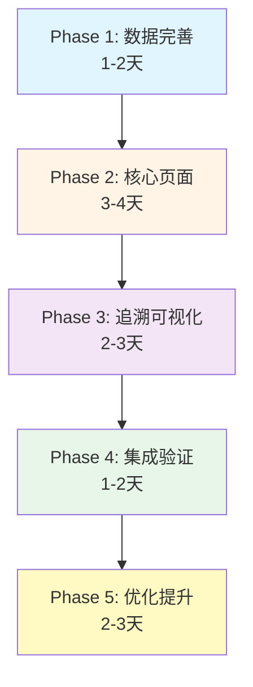

# V3架构实施方案

> **文档版本**: v1.0  
> **创建日期**: 2026-01-11  
> **目的**: 基于Architecture v3完整设计，制定详细的实施方案和核心任务

---

## 一、当前实现状态分析

### 1.1 已实现页面（前端）

#### ✅ 完整实现（90%+功能完整）

| 页面分类 | 页面名称 | 完成度 | 数据状态 | 备注 |
|---------|---------|--------|---------|------|
| **产品域** | 产品线列表/详情 | 95% | ✅完整 | - |
| | 产品列表/详情 | 95% | ✅完整 | - |
| | 产品全景 | 100% | ✅完整 | Phase2完成 |
| **项目域** | 车型项目列表/详情 | 90% | ✅完整 | V2项目完成 |
| | 领域项目列表/详情 | 90% | ✅完整 | V2项目完成 |
| | 项目全景 | 100% | ✅完整 | Phase3完成 |
| **团队域** | 团队列表/详情 | 95% | ✅完整 | - |
| | 团队工作全景 | 100% | ✅完整 | Phase4完成 |
| **Sprint域** | Sprint列表/看板/详情 | 95% | ✅完整 | - |
| **工作项** | 工作项列表/详情 | 90% | ✅完整 | - |
| **价值流** | 主流程可视化 | 95% | ✅完整 | - |
| | L2子流程（8个） | 100% | ✅完整 | 最近完成 |

#### ⚠️ 部分实现（50-90%功能）

| 页面分类 | 页面名称 | 完成度 | 数据状态 | 问题 |
|---------|---------|--------|---------|------|
| **需求域** | 用户需求列表 | 70% | ⚠️部分 | 缺少与Product关联 |
| | 特性需求列表 | 70% | ⚠️部分 | 缺少与Feature关联 |
| | 模块需求列表 | 70% | ⚠️部分 | 缺少与Module关联 |
| | 需求看板 | 60% | ⚠️部分 | 数据不完整 |
| | 需求追溯 | 50% | ⚠️部分 | 追溯链路不完整 |
| **代办管理** | 项目代办管理 | 40% | ❌缺失 | **数据几乎为空** |
| | 团队代办管理 | 40% | ❌缺失 | **数据几乎为空** |
| **资产域** | Feature列表/详情 | 0% | ✅数据完整 | **页面未实现** |
| | Platform列表 | 0% | ✅数据完整 | **页面未实现** |
| | Feature BOM管理 | 0% | ✅数据完整 | **页面未实现** |

#### ❌ 未实现（0-50%功能）

| 功能模块 | 说明 | 优先级 |
|---------|------|--------|
| **三层需求完整流程** | UR→FR→MR分解流程可视化 | P0 |
| **Feature资产管理** | Feature列表、详情、复用分析 | P0 |
| **Platform管理** | Platform列表、部署管理 | P1 |
| **需求-资产关联** | 需求与资产的关联关系展示 | P0 |
| **追溯可视化** | 端到端追溯链路可视化 | P1 |
| **资产复用分析** | Feature复用率、收益分析 | P1 |

### 1.2 已有数据分析

#### ✅ 数据完整（已有完整Mock数据）

| 数据类别 | 文件路径 | 实体数量 | V3设计符合度 |
|---------|---------|---------|-------------|
| **三层资产** | | | |
| - Product | asset/products.json | ~10 | ✅ 100% |
| - Feature | feature/features.json | 20 | ✅ 100% |
| - Module | asset/modules.json | ~30 | ✅ 100% |
| - Platform | platform/platforms.json | 12 | ✅ 100% |
| - Feature BOM | feature/feature-bom.json | 30+ | ✅ 100% |
| **三层需求** | | | |
| - User Requirement | requirement/user-requirements.json | 10 | ✅ 100% |
| - Feature Requirement | requirement/feature-requirements.json | 10 | ✅ 100% |
| - Module Requirement | requirement/module-requirements.json | 13 | ✅ 100% |
| **项目管理** | | | |
| - Vehicle Project | project/vehicle-projects.json | ~5 | ✅ 100% |
| - Domain Project | project/domain-projects.json | ~10 | ✅ 100% |
| - PI Planning | project/pi-details.json | ~5 | ✅ 100% |
| **团队与Sprint** | | | |
| - Team | teams.json | 9 | ✅ 100% |
| - Sprint | sprint/sprints.json | ~10 | ✅ 100% |
| - WorkItem | work-items.json | 20+ | ✅ 100% |

#### ⚠️ 数据不完整（数据存在但质量问题）

| 数据类别 | 文件路径 | 问题描述 | 影响 |
|---------|---------|---------|------|
| **Project Backlog** | backlog/project-backlogs.json | 数据与实际需求脱节 | 项目代办页面无法正常使用 |
| **Team Backlog** | backlog/team-backlogs.json | 数据与实际团队脱节 | 团队代办页面无法正常使用 |
| **需求追溯** | requirement/traceability.json | 追溯关系不完整 | 追溯可视化功能受限 |

#### ❌ 数据缺失（需要新建）

| 数据类别 | 说明 | 优先级 |
|---------|------|--------|
| **Feature复用关系** | Feature被哪些产品使用的详细记录 | P1 |
| **Module-Platform部署** | Module在Platform上的部署配置 | P1 |
| **需求-资产关联** | UR/FR/MR与Product/Feature/Module的关联 | P0 |

### 1.3 核心差距分析

#### 差距1：三层需求功能未完整实现 ⭐⭐⭐⭐⭐

**现状**:
- 有需求列表页面，但缺少UR→FR→MR的分解流程可视化
- 需求与资产的关联关系未在UI中体现
- 需求分解、需求追溯功能不完整

**V3要求**:
- UR→FR→MR完整分解流程
- FR关联Feature资产（支持复用）
- MR关联Module资产
- 端到端追溯可视化

**影响**: 核心设计理念无法落地

#### 差距2：Feature资产管理功能缺失 ⭐⭐⭐⭐⭐

**现状**:
- 有Feature数据（20个），有Feature BOM数据（30+）
- 但完全没有Feature管理页面
- 无法查看Feature复用情况
- 无法管理Feature BOM配置

**V3要求**:
- Feature列表/详情页面
- Feature复用分析（被哪些产品使用）
- Feature BOM配置界面
- Feature-Module关系可视化

**影响**: 资产复用60%目标无法达成

#### 差距3：代办管理数据和功能不完整 ⭐⭐⭐⭐

**现状**:
- 项目代办管理页面存在但数据几乎为空
- 团队代办管理页面存在但数据几乎为空
- 与需求、Sprint、WorkItem的关联不清晰

**V3要求**:
- Project Backlog: 存储项目级的FR/MR
- Team Backlog: 存储团队的MR/Task
- 与Sprint Planning、PI Planning集成

**影响**: 项目和团队的工作规划功能不可用

#### 差距4：追溯链路可视化缺失 ⭐⭐⭐⭐

**现状**:
- 有基本的追溯数据
- 但缺少端到端追溯可视化
- 无法直观展示UR→FR→MR→Task→Commit链路

**V3要求**:
- 正向追溯：UR→Commit
- 反向追溯：Commit→UR
- 影响分析：Feature升级影响哪些需求和团队

**影响**: 核心价值（端到端追溯）无法体现

---

## 二、V3实施方案

### 2.1 实施策略



### 2.2 分阶段任务

#### Phase 1: 数据完善与补充（1-2天）

**目标**: 补充缺失的数据，完善现有数据质量

| 任务ID | 任务名称 | 工作量 | 优先级 | 交付物 |
|--------|---------|--------|--------|--------|
| D1.1 | 重构Project Backlog数据 | 4h | P0 | project-backlogs.json |
| D1.2 | 重构Team Backlog数据 | 4h | P0 | team-backlogs.json |
| D1.3 | 补充需求-资产关联数据 | 3h | P0 | 在UR/FR/MR中添加relatedAssetId |
| D1.4 | 补充Feature复用关系数据 | 2h | P1 | 更新features.json的products字段 |
| D1.5 | 完善追溯关系数据 | 3h | P1 | 更新traceability.json |
| D1.6 | 补充Module部署信息 | 2h | P1 | 更新modules.json添加deployment |

**验收标准**:
- [ ] Project Backlog包含10+ FR/MR，正确关联PI Planning
- [ ] Team Backlog包含20+ MR/Task，正确关联Sprint
- [ ] 所有UR都有productId，所有FR都有relatedFeatureAssetId
- [ ] 所有Feature都有完整的products列表和reuseCount
- [ ] 追溯关系完整覆盖UR→FR→MR→Task→Commit

#### Phase 2: 核心页面实现（3-4天）

**目标**: 实现V3核心功能页面

##### 2.1 Feature资产管理（P0，1.5天）

| 任务ID | 任务名称 | 工作量 | 交付物 |
|--------|---------|--------|--------|
| P2.1.1 | Feature列表页面 | 6h | Feature/List.vue |
| P2.1.2 | Feature详情页面 | 6h | Feature/Detail.vue |
| P2.1.3 | Feature复用分析组件 | 4h | Feature/ReuseAnalysis.vue |
| P2.1.4 | Feature-Module关系图 | 4h | Feature/ModuleRelation.vue |

**页面设计**:

```
Feature列表页:
  - 表格展示: 编号/名称/版本/领域/复用次数/状态
  - 筛选: 领域/类别/复用次数/状态
  - 排序: 复用次数/创建时间
  - 操作: 查看详情/编辑/复用分析

Feature详情页:
  - 基本信息: 编号/名称/版本/描述/领域/类别
  - 复用信息: 被哪些产品使用（5-10个）/复用次数
  - 实现信息: 包含哪些Module（3-5个）
  - 依赖关系: 依赖哪些Feature/冲突检测
  - 性能指标: 延迟/吞吐量/准确率
  - 成本信息: 开发成本/许可成本/维护成本
  - 版本历史: 历史版本列表
  - 关联需求: 关联的FR列表（10+）
```

##### 2.2 Platform管理（P1，0.5天）

| 任务ID | 任务名称 | 工作量 | 交付物 |
|--------|---------|--------|--------|
| P2.2.1 | Platform列表页面 | 4h | Platform/List.vue |
| P2.2.2 | Platform详情页面（可选） | 4h | Platform/Detail.vue |

##### 2.3 需求管理增强（P0，1天）

| 任务ID | 任务名称 | 工作量 | 交付物 |
|--------|---------|--------|--------|
| P2.3.1 | UR列表页增强（显示关联Product） | 3h | 更新UserRequirements.vue |
| P2.3.2 | FR列表页增强（显示关联Feature） | 3h | 更新FeatureRequirements.vue |
| P2.3.3 | MR列表页增强（显示关联Module） | 3h | 更新ModuleRequirements.vue |
| P2.3.4 | 需求分解流程可视化 | 6h | Requirement/DecomposeFlow.vue |

**需求分解流程页面设计**:

```
需求分解流程可视化:
  - 左侧: UR列表
  - 中间: UR→FR分解关系图
  - 右侧: FR→MR分解关系图
  - 底部: MR→Task拆分列表
  - 交互: 点击UR展开FR，点击FR展开MR
```

##### 2.4 代办管理重构（P0，1天）

| 任务ID | 任务名称 | 工作量 | 交付物 |
|--------|---------|--------|--------|
| P2.4.1 | 项目代办管理页面重构 | 4h | 更新ProjectBacklog.vue |
| P2.4.2 | 团队代办管理页面重构 | 4h | 更新TeamBacklog.vue |
| P2.4.3 | 代办-Sprint关联功能 | 4h | Backlog组件增强 |

**代办管理页面设计**:

```
Project Backlog:
  - 左侧: PI Planning列表（筛选）
  - 中间: Backlog看板
    * 列1: FR列表（10+）
    * 列2: MR列表（30+）
    * 列3: 已分配到Sprint的MR
  - 右侧: 详情面板
  - 拖拽: FR/MR可拖拽到Sprint
  - 统计: 总SP/已分配SP/剩余SP

Team Backlog:
  - 左侧: 团队列表（筛选）
  - 中间: Backlog看板
    * 列1: MR列表（已分配给团队）
    * 列2: Task列表（MR拆分的Task）
    * 列3: Sprint看板（当前Sprint）
  - 右侧: 详情面板
  - 拖拽: MR可拆分为Task，Task可分配到Sprint
  - 统计: 团队容量/已分配/剩余容量
```

#### Phase 3: 追溯可视化实现（2-3天）

**目标**: 实现端到端追溯可视化

| 任务ID | 任务名称 | 工作量 | 优先级 | 交付物 |
|--------|---------|--------|--------|--------|
| P3.1 | 需求追溯关系图 | 8h | P0 | Requirement/TraceGraph.vue |
| P3.2 | 资产关系图增强 | 6h | P1 | 更新Asset/Relationship.vue |
| P3.3 | 正向追溯功能 | 6h | P1 | 追溯工具函数 |
| P3.4 | 反向追溯功能 | 6h | P1 | 追溯工具函数 |
| P3.5 | 影响分析页面 | 8h | P1 | Feature/ImpactAnalysis.vue |

**追溯可视化设计**:

```
需求追溯关系图:
  - 使用Cytoscape.js或D3.js
  - 节点: UR/FR/MR/Task/Commit
  - 边: 分解关系/关联关系
  - 颜色: 按类型区分
  - 交互: 点击节点展开详情，高亮关联节点
  - 布局: 分层布局（L1→L2→L3→L4→L5）

影响分析页面:
  - 输入: Feature ID
  - 输出:
    * 受影响的产品列表
    * 受影响的需求列表（FR/MR）
    * 受影响的团队列表
    * 受影响的Sprint列表
    * 工作量估算（总SP）
  - 可视化: Sankey图展示影响传播路径
```

#### Phase 4: 系统集成与验证（1-2天）

**目标**: 验证V3设计的完整性和一致性

| 任务ID | 任务名称 | 工作量 | 交付物 |
|--------|---------|--------|--------|
| P4.1 | 数据一致性验证 | 4h | 验证脚本 |
| P4.2 | 功能集成测试 | 8h | 测试报告 |
| P4.3 | 用户流程验证 | 4h | 用户手册 |
| P4.4 | 性能测试 | 4h | 性能报告 |

**验证清单**:

```yaml
数据一致性验证:
  - [ ] 所有UR都有有效的productId
  - [ ] 所有FR都有有效的relatedFeatureAssetId（或null）
  - [ ] 所有MR都有有效的moduleId
  - [ ] 所有Feature都有完整的products和moduleIds
  - [ ] 所有Module都有有效的responsibleTeamId
  - [ ] Project Backlog与PI Planning正确关联
  - [ ] Team Backlog与Team和Sprint正确关联

功能集成测试:
  - [ ] UR创建→FR分解→MR分解→Task拆分流程完整
  - [ ] FR关联Feature资产后，Feature.reuseCount正确更新
  - [ ] MR分配到Team后，自动基于Module.responsibleTeamId
  - [ ] Feature列表正确显示复用次数和使用产品
  - [ ] 追溯功能正确展示UR→Commit完整链路
  - [ ] 影响分析正确计算受影响范围
  - [ ] Project Backlog与Sprint Planning集成正常
  - [ ] Team Backlog与Sprint执行集成正常

用户流程验证:
  - [ ] 场景1: 新产品开发（UR规划→FR分解→Feature复用→MR分解→Task拆分）
  - [ ] 场景2: Feature资产复用（搜索Feature→评估复用→创建FR→复用分析）
  - [ ] 场景3: 需求追溯（选择UR→查看分解→追溯到Commit）
  - [ ] 场景4: 影响分析（Feature升级→影响分析→团队通知）
  - [ ] 场景5: 项目代办管理（创建PI→添加FR/MR→分配Sprint）
```

#### Phase 5: 优化与提升（2-3天）

**目标**: 优化用户体验和系统性能

| 任务ID | 任务名称 | 工作量 | 优先级 | 交付物 |
|--------|---------|--------|--------|--------|
| P5.1 | UI/UX优化 | 8h | P1 | UI改进清单 |
| P5.2 | 性能优化 | 6h | P1 | 性能优化报告 |
| P5.3 | 文档完善 | 6h | P1 | 用户文档 |
| P5.4 | 示例数据优化 | 4h | P2 | Mock数据更新 |

---

## 三、核心任务清单

### 3.1 P0级任务（必须完成，1周）

| 任务 | 说明 | 工作量 | 负责人 | 交付物 |
|------|------|--------|--------|--------|
| **D1.1-D1.3** | 数据完善（Backlog + 需求-资产关联） | 11h | 数据工程师 | JSON文件 |
| **P2.1.1-P2.1.4** | Feature资产管理页面 | 20h | 前端工程师 | 4个Vue组件 |
| **P2.3.1-P2.3.4** | 需求管理增强 | 15h | 前端工程师 | 4个Vue组件 |
| **P2.4.1-P2.4.3** | 代办管理重构 | 12h | 前端工程师 | 3个Vue组件 |
| **P3.1** | 需求追溯关系图 | 8h | 前端工程师 | 1个Vue组件 |
| **P4.1-P4.3** | 集成验证 | 16h | 测试工程师 | 测试报告 |

**P0总计**: 82小时 ≈ **10个工作日（2周）**

### 3.2 P1级任务（重要，2周）

| 任务 | 说明 | 工作量 | 交付物 |
|------|------|--------|--------|
| **D1.4-D1.6** | 数据优化（Feature复用 + Module部署） | 7h | JSON文件 |
| **P2.2.1-P2.2.2** | Platform管理页面 | 8h | 2个Vue组件 |
| **P3.2-P3.5** | 追溯可视化完整功能 | 28h | 4个Vue组件 |
| **P5.1-P5.3** | 优化与文档 | 20h | 文档和优化 |

**P1总计**: 63小时 ≈ **8个工作日（1.5周）**

### 3.3 P2级任务（可选，后续迭代）

| 任务 | 说明 | 工作量 |
|------|------|--------|
| Feature BOM配置界面 | 可视化配置Product的Feature BOM | 12h |
| Platform迁移评估工具 | 评估Module能否迁移到新Platform | 8h |
| 资产复用Dashboard | 展示Feature复用率、收益等指标 | 16h |
| 需求看板增强 | 支持UR/FR/MR的Kanban视图 | 12h |

**P2总计**: 48小时 ≈ **6个工作日（1周）**

---

## 四、实施时间表

### 4.1 Gantt图

```
Week 1 (第1周):
  Mon-Tue: Phase 1 数据完善 (D1.1-D1.6)
  Wed-Fri: Phase 2.1 Feature资产管理 (P2.1)

Week 2 (第2周):
  Mon-Tue: Phase 2.3 需求管理增强 (P2.3)
  Wed-Thu: Phase 2.4 代办管理重构 (P2.4)
  Fri: Phase 3.1 需求追溯关系图 (P3.1)

Week 3 (第3周):
  Mon-Tue: Phase 4 集成验证 (P4.1-P4.3)
  Wed-Thu: Phase 3 追溯可视化P1任务 (P3.2-P3.5)
  Fri: Phase 5 优化与文档 (P5.1-P5.3)

Week 4 (第4周，可选):
  P2级任务和持续优化
```

### 4.2 里程碑

| 里程碑 | 日期 | 交付物 | 验收标准 |
|--------|------|--------|---------|
| **M1: 数据完善** | Day 2 | 所有P0数据文件 | 数据一致性验证100% |
| **M2: Feature管理** | Day 5 | Feature管理页面 | Feature列表/详情可用 |
| **M3: 需求增强** | Day 8 | 需求管理增强页面 | 需求-资产关联可见 |
| **M4: 代办重构** | Day 10 | 代办管理页面 | Backlog功能完整 |
| **M5: 追溯可视化** | Day 12 | 追溯关系图 | UR→Commit链路可见 |
| **M6: 集成验证** | Day 14 | 验证报告 | 所有P0功能验证通过 |
| **M7: 优化提升** | Day 18 | 优化文档 | 用户体验优良 |

---

## 五、验收标准

### 5.1 功能完整性

```yaml
必须功能 (P0):
  三层需求管理:
    - [ ] UR列表显示关联Product
    - [ ] FR列表显示关联Feature（可复用）
    - [ ] MR列表显示关联Module
    - [ ] 需求分解流程可视化

  Feature资产管理:
    - [ ] Feature列表/详情页面
    - [ ] 显示Feature复用次数和使用产品
    - [ ] Feature-Module关系可视化
    - [ ] Feature复用分析

  代办管理:
    - [ ] Project Backlog包含FR/MR
    - [ ] Team Backlog包含MR/Task
    - [ ] 与Sprint Planning集成
    - [ ] 拖拽分配功能

  追溯可视化:
    - [ ] 需求追溯关系图（UR→FR→MR→Task）
    - [ ] 点击节点展开详情
    - [ ] 高亮关联节点

重要功能 (P1):
  Platform管理:
    - [ ] Platform列表页面
    - [ ] 显示Platform上部署的Module

  完整追溯:
    - [ ] 正向追溯（UR→Commit）
    - [ ] 反向追溯（Commit→UR）
    - [ ] 影响分析（Feature升级影响）

  资产复用分析:
    - [ ] Feature复用率统计
    - [ ] 复用收益计算
```

### 5.2 数据质量

```yaml
数据完整性:
  - [ ] Project Backlog: 10+ FR, 30+ MR
  - [ ] Team Backlog: 20+ MR, 50+ Task
  - [ ] 所有UR有productId
  - [ ] 70%+ FR有relatedFeatureAssetId
  - [ ] 所有MR有moduleId
  - [ ] 所有Feature有products列表
  - [ ] 追溯关系覆盖80%+ WorkItem

数据一致性:
  - [ ] UR.productId → Product.id 有效
  - [ ] FR.relatedFeatureAssetId → Feature.id 有效
  - [ ] MR.moduleId → Module.id 有效
  - [ ] Feature.moduleIds → Module.id[] 有效
  - [ ] Module.responsibleTeamId → Team.id 有效
  - [ ] ProjectBacklog.piId → PIPlanning.id 有效
  - [ ] TeamBacklog.teamId → Team.id 有效
```

### 5.3 用户体验

```yaml
易用性:
  - [ ] 页面加载时间 < 2s
  - [ ] 交互响应时间 < 300ms
  - [ ] 关键流程 ≤ 3步完成
  - [ ] 错误提示清晰明确

可视化:
  - [ ] 关系图清晰易读
  - [ ] 颜色编码一致
  - [ ] 图例完整
  - [ ] 支持缩放和平移

文档:
  - [ ] 用户手册完整
  - [ ] 操作指南清晰
  - [ ] 示例数据丰富
  - [ ] FAQ覆盖常见问题
```

---

## 六、风险与应对

### 6.1 技术风险

| 风险 | 可能性 | 影响 | 应对措施 |
|------|--------|------|---------|
| 图形库集成复杂 | 中 | 中 | 提前技术预研，准备备选方案（Cytoscape vs D3） |
| 数据量大导致性能问题 | 中 | 高 | 实现虚拟滚动、分页加载、懒加载 |
| 追溯关系计算复杂 | 高 | 中 | 预计算追溯关系，缓存结果 |
| 代办管理逻辑复杂 | 中 | 中 | 拆分为多个小组件，分步实现 |

### 6.2 资源风险

| 风险 | 可能性 | 影响 | 应对措施 |
|------|--------|------|---------|
| 人员不足 | 低 | 高 | 调整优先级，先完成P0任务 |
| 时间不足 | 中 | 中 | 将P1/P2任务推迟到后续迭代 |
| 数据准备耗时超预期 | 中 | 中 | 使用脚本批量生成数据 |

### 6.3 需求风险

| 风险 | 可能性 | 影响 | 应对措施 |
|------|--------|------|---------|
| 需求理解偏差 | 低 | 高 | 及时Review，定期Demo |
| 需求变更 | 中 | 中 | 敏捷迭代，保持灵活性 |

---

## 七、资源配置

### 7.1 团队配置

| 角色 | 人数 | 职责 |
|------|------|------|
| **数据工程师** | 1 | 数据模型设计、Mock数据准备 |
| **前端工程师** | 2 | Vue组件开发、UI实现 |
| **测试工程师** | 1 | 功能测试、集成测试 |
| **产品经理** | 0.5 | 需求澄清、验收标准 |
| **架构师** | 0.5 | 技术方案、Code Review |

**总人力**: 5人周 × 3周 = **15人周**

### 7.2 开发环境

```yaml
前端开发:
  - Vue 3 + TypeScript
  - Element Plus UI库
  - Cytoscape.js / D3.js（图形可视化）
  - Vite构建工具

数据管理:
  - JSON Mock数据
  - 数据验证脚本（TypeScript）

测试工具:
  - Vitest（单元测试）
  - Playwright（E2E测试）
  - ESLint + Prettier（代码质量）
```

---

## 八、成功标准

### 8.1 业务价值

✅ **资产复用率达到60%+**
- Feature平均被5-10个产品复用
- 复用收益可量化（节省成本93%+）

✅ **端到端追溯能力**
- UR→FR→MR→Task→Commit完整链路可追溯
- 正向和反向追溯功能完整

✅ **需求与资产分离**
- 需求跟随产品版本
- 资产独立演进和复用
- 关联关系清晰可见

✅ **项目和团队代办管理**
- Project Backlog功能完整
- Team Backlog功能完整
- 与Sprint Planning无缝集成

### 8.2 技术指标

| 指标 | 目标值 | 测量方式 |
|------|--------|---------|
| **功能完整度** | P0: 100%, P1: 80% | 功能清单检查 |
| **数据完整度** | 90%+ | 数据验证脚本 |
| **页面性能** | 加载<2s, 交互<300ms | Performance测试 |
| **代码质量** | ESLint 0错误, 覆盖率>70% | 自动化检查 |
| **文档完整度** | 100% | 文档清单检查 |

---

## 九、后续规划

### 9.1 短期优化（1个月）

- P1级任务完成
- 性能优化和体验提升
- 用户培训和文档完善

### 9.2 中期演进（3个月）

- P2级任务完成
- Feature BOM配置器
- 资产复用Dashboard
- 平台迁移评估工具

### 9.3 长期愿景（6个月）

- AI辅助需求分解
- 智能Feature推荐
- 自动化影响分析
- 预测性资产复用

---

**文档版本**: v1.0  
**创建日期**: 2026-01-11  
**维护团队**: V3架构实施团队  
**状态**: ✅ 待评审

**下一步**: 评审通过后，启动Phase 1数据完善任务

