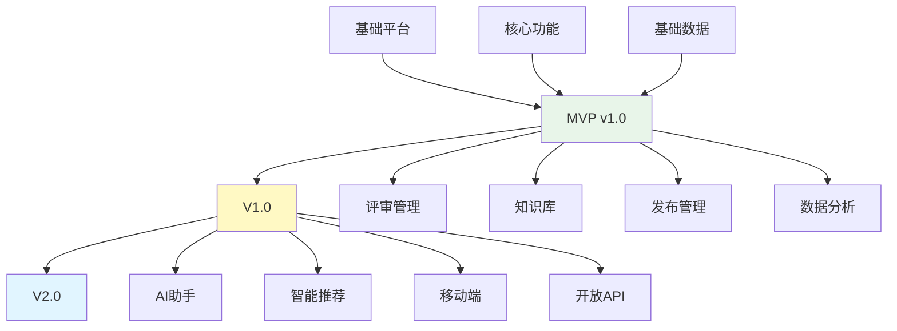

# Auto DevOps Platform - 版本规划

> **文档版本**: v1.0  
> **创建日期**: 2025-01-03  
> **规划周期**: 2025-01 ~ 2025-12（12个月）

---

## 📋 目录

1. [版本规划概述](#一版本规划概述)
2. [MVP版本规划](#二mvp版本规划v10)
3. [V1.0版本规划](#三v10版本规划)
4. [V2.0版本规划](#四v20版本规划)
5. [版本依赖关系](#五版本依赖关系)

---

## 一、版本规划概述

### 1.1 整体规划

```
2025年度版本规划时间线:

Q1         Q2         Q3         Q4
│          │          │          │
├─────────┼─────────┼─────────┼─────────┤
│  MVP开发启动                            │
│  Sprint 1-5                             │
├─────────┤                               │
          │  MVP Alpha                    │
          │  Sprint 6-9                   │
          ├─────────┤                     │
                    │  MVP Beta           │
                    │  Sprint 10-13       │
                    ├─────────┤           │
                              │ MVP发布   │
                              │ V1.0开发  │
                              ├─────────┤ │
                                        │ V1.0发布
                                        │ V2.0开发
                                        ├──────┤
                                               │V2.0发布
```

---

### 1.2 版本策略

| 版本 | 定位 | 用户范围 | 发布策略 |
|------|------|---------|---------|
| **MVP** | 核心功能，验证价值 | 内部试用 | 迭代发布 |
| **V1.0** | 功能完善，生产可用 | 首批客户 | 正式发布 |
| **V2.0** | 高级功能，成熟产品 | 全面推广 | 正式发布 |

---

## 二、MVP版本规划（v1.0）

### 2.1 MVP目标

**核心目标**: 构建端到端研发价值流管理平台，支撑NOA v3.1项目完整生命周期

**成功标准**:
- ✅ 支撑9阶段完整价值流
- ✅ 支持3种角色（产品/项目/开发）协同工作
- ✅ 实现完整的数据追溯链
- ✅ 用户满意度 ≥ 4/5

---

### 2.2 MVP Features列表

#### 功能域1: 项目管理（2个Features，120 SP）

| Feature ID | Feature Name | Priority | Story Points | Sprint |
|-----------|-------------|----------|-------------|--------|
| F029 | PI Planning管理 | P0 | 55 SP | Sprint 1-3 |
| F030 | 项目生命周期管理 | P0 | 65 SP | Sprint 3-5 |

**核心能力**:
- PI Planning工作区
- 团队容量规划
- 依赖管理
- 风险管理
- 项目看板
- 多产品协同

---

#### 功能域2: 资产管理（4个Features，76 SP）

| Feature ID | Feature Name | Priority | Story Points | Sprint |
|-----------|-------------|----------|-------------|--------|
| F002 | 领域产品管理 | P0 | 21 SP | Sprint 5-6 |
| F003 | 领域特性管理 | P0 | 21 SP | Sprint 6-7 |
| F004 | 软件模块管理 | P0 | 21 SP | Sprint 7-8 |
| F005 | 资产库管理 | P0 | 13 SP | Sprint 8 |

**核心能力**:
- 产品版本管理
- 特性管理
- 模块管理
- 资产复用

---

#### 功能域3: 需求管理（4个Features，79 SP）

| Feature ID | Feature Name | Priority | Story Points | Sprint |
|-----------|-------------|----------|-------------|--------|
| F007 | 用户需求管理 | P0 | 25.5 SP | Sprint 8-9 |
| F008 | 特性需求管理 | P0 | 22.5 SP | Sprint 9-10 |
| F009 | 模块需求管理 | P0 | 18 SP | Sprint 10-11 |
| F010 | 需求追溯管理 | P0 | 13 SP | Sprint 11 |

**核心能力**:
- 用户需求创建和管理
- 需求评审流程
- PRD编写
- 需求分解
- 需求追溯

---

#### 功能域4: 研发协同（3个Features，47 SP）

| Feature ID | Feature Name | Priority | Story Points | Sprint |
|-----------|-------------|----------|-------------|--------|
| F012 | 任务管理 | P0 | 21 SP | Sprint 11-12 |
| F014 | 协同看板 | P0 | 13 SP | Sprint 12 |
| F015 | 通知消息 | P0 | 13 SP | Sprint 12-13 |

**核心能力**:
- Sprint看板
- 任务分配和跟踪
- 团队协同
- 消息通知

---

#### 功能域5: DevOps（3个Features，44 SP）

| Feature ID | Feature Name | Priority | Story Points | Sprint |
|-----------|-------------|----------|-------------|--------|
| F017 | 配置管理 | P0 | 13 SP | Sprint 1-2 |
| F018 | 构建管理 | P0 | 18 SP | Sprint 2-3 |
| F019 | 测试管理 | P0 | 13 SP | Sprint 13 |

**核心能力**:
- Git集成
- CI/CD流水线
- 构建管理
- 测试用例管理
- 缺陷管理

---

#### 功能域6: 平台支撑（3个Features，42 SP）

| Feature ID | Feature Name | Priority | Story Points | Sprint |
|-----------|-------------|----------|-------------|--------|
| F026 | 用户权限管理 | P0 | 13 SP | Sprint 1 |
| F027 | 角色工作台 | P0 | 21 SP | Sprint 4-5 |
| F028 | 系统配置 | P0 | 8 SP | Sprint 13 |

**核心能力**:
- 用户登录认证
- 权限控制
- 角色工作台
- 系统配置

---

### 2.3 MVP时间规划

**总周期**: 26周（2025-01-06 ~ 2025-07-18）

**阶段划分**:

| 阶段 | Sprint | 周期 | 交付内容 | 里程碑 |
|------|--------|------|---------|--------|
| **阶段1** | Sprint 1-5 | 10周 | 项目管理+DevOps基础 | 2025-03-14 |
| **阶段2** | Sprint 6-9 | 8周 | 资产管理+需求管理 | 2025-05-09 (MVP Alpha) |
| **阶段3** | Sprint 10-13 | 8周 | 研发协同+测试管理 | 2025-07-18 (MVP Release) |

---

### 2.4 MVP工作量估算

**Story Points**: 396 SP

**转换系数**: 1 SP = 0.4人天

**总工作量**: 396 × 0.4 = 158人天

**团队配置**: 3人（2个全栈工程师 + 1个测试工程师）

**团队容量**: 
- 每人每周：6 SP
- 团队每周：18 SP
- 总周期：396 / 18 ≈ 22周 + 缓冲4周 = 26周

---

### 2.5 MVP关键里程碑

```
Sprint 1   Sprint 5   Sprint 9   Sprint 13
   │          │          │          │
   ├─────────┤          │          │
   │ 阶段1    │          │          │
   │ 基础搭建 │          │          │
   ├─────────┼─────────┤          │
              │ 阶段2    │          │
              │ 核心功能 │          │
              ├─────────┼─────────┤
              │          │ 阶段3    │
              │          │ 完善优化 │
              │          ├─────────┤
   │          │          │          │
启动      阶段1完成  MVP Alpha  MVP Release
2025-01-06  2025-03-14  2025-05-09  2025-07-18
```

---

## 三、V1.0版本规划

### 3.1 V1.0目标

**核心目标**: 功能完善，生产可用，支撑首批客户使用

**新增功能**:
- 完善的评审管理
- 知识库功能
- 完整的发布管理
- 基础数据分析
- 项目协同完善

---

### 3.2 V1.0 Features列表

#### 新增Features（10个，约200 SP）

| Feature ID | Feature Name | Priority | Story Points | Sprint |
|-----------|-------------|----------|-------------|--------|
| F001 | 产品线管理 | P1 | 20 SP | V1.0 Sprint 1-2 |
| F006 | 资产复用分析 | P1 | 10 SP | V1.0 Sprint 2 |
| F011 | 需求变更管理 | P1 | 15 SP | V1.0 Sprint 2-3 |
| F013 | 评审管理 | P1 | 18 SP | V1.0 Sprint 3-4 |
| F016 | 知识库 | P1 | 26 SP | V1.0 Sprint 4-6 |
| F020 | 发布管理 | P1 | 18 SP | V1.0 Sprint 6-7 |
| F021 | 监控运维 | P1 | 15 SP | V1.0 Sprint 7-8 |
| F022 | 效能分析 | P1 | 15 SP | V1.0 Sprint 8-9 |
| F023 | 质量分析 | P1 | 15 SP | V1.0 Sprint 9-10 |
| F031 | 项目协同管理 | P1 | 34 SP | V1.0 Sprint 10-12 |

---

### 3.3 V1.0时间规划

**总周期**: 12周（2025-07-21 ~ 2025-10-10）

**团队配置**: 4人（1前端 + 2后端 + 1测试）

**团队容量**: 24 SP/周

**Sprint规划**: 12个Sprint，每Sprint 2周

---

## 四、V2.0版本规划

### 4.1 V2.0目标

**核心目标**: 高级功能，平台成熟，全面推广

**高级功能**:
- AI辅助需求分析
- 智能推荐系统
- 高级数据分析
- 移动端支持
- API开放平台

---

### 4.2 V2.0 Features列表

#### 高级Features（8个，约150 SP）

| Feature ID | Feature Name | Priority | Story Points | Sprint |
|-----------|-------------|----------|-------------|--------|
| F024 | 复用分析 | P2 | 10 SP | V2.0 Sprint 1 |
| F025 | 成本分析 | P2 | 10 SP | V2.0 Sprint 1-2 |
| F032 | 趋势预测 | P2 | 15 SP | V2.0 Sprint 2-3 |
| F033 | 审计日志 | P2 | 10 SP | V2.0 Sprint 3 |
| F034 | AI需求助手 | P2 | 30 SP | V2.0 Sprint 3-5 |
| F035 | 智能推荐 | P2 | 25 SP | V2.0 Sprint 5-6 |
| F036 | 移动端 | P2 | 30 SP | V2.0 Sprint 6-8 |
| F037 | 开放API | P2 | 20 SP | V2.0 Sprint 8 |

---

### 4.3 V2.0时间规划

**总周期**: 8周（2025-10-13 ~ 2025-12-05）

**团队配置**: 5人（2前端 + 2后端 + 1测试）

**团队容量**: 30 SP/周

**Sprint规划**: 8个Sprint，每Sprint 1周

---

## 五、版本依赖关系

### 5.1 功能依赖图



---

### 5.2 技术栈依赖

| 组件 | MVP | V1.0 | V2.0 |
|------|-----|------|------|
| **前端** | Vue 3 + TypeScript | 优化 + 组件库 | 移动端 + PWA |
| **后端** | Node.js + Express | 微服务化 | GraphQL + 缓存优化 |
| **数据库** | PostgreSQL + Neo4j | 添加Redis | 添加ElasticSearch |
| **DevOps** | Docker | Kubernetes | 完整监控体系 |

---

### 5.3 数据迁移规划

**MVP → V1.0**:
- 数据库Schema升级
- 新增表：知识库、评审记录
- 迁移脚本自动化

**V1.0 → V2.0**:
- 新增AI数据表
- 审计日志表
- 数据归档策略

---

## 六、风险管理

### 6.1 MVP风险

| 风险 | 概率 | 影响 | 缓解措施 |
|------|------|------|---------|
| 团队资源不足 | Medium | High | 招聘/外包 |
| 技术难度超预期 | Medium | Medium | 技术预研，降低scope |
| 需求变更频繁 | High | Medium | 需求冻结机制 |
| 第三方依赖延迟 | Low | High | 备选方案 |

---

### 6.2 质量保证

**MVP质量标准**:
- 代码覆盖率 ≥ 70%
- 核心功能可用性 ≥ 99%
- 关键bug数量 = 0
- 用户满意度 ≥ 4/5

---

## 七、总结

### 7.1 版本对比

| 维度 | MVP | V1.0 | V2.0 |
|------|-----|------|------|
| **Features** | 19个 | +10个 | +8个 |
| **Story Points** | 396 SP | +200 SP | +150 SP |
| **周期** | 26周 | +12周 | +8周 |
| **团队** | 3人 | 4人 | 5人 |
| **用户范围** | 内部试用 | 首批客户 | 全面推广 |
| **成熟度** | 核心可用 | 生产可用 | 成熟产品 |

---

### 7.2 关键成功因素

1. **明确的MVP范围** - 聚焦核心价值，避免范围蔓延
2. **稳定的团队** - 保持团队稳定性和高效协作
3. **持续的反馈** - 与用户保持紧密沟通
4. **灵活的调整** - 基于反馈快速迭代
5. **质量优先** - 不牺牲质量追求速度

---

**文档创建日期**: 2025-01-03  
**文档状态**: ✅ 完成  
**下一步**: 详细迭代计划（02-ITERATION_PLAN.md）

