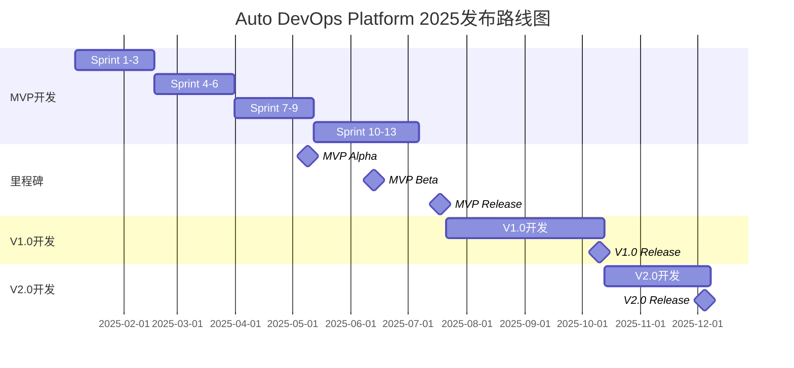

# Auto DevOps Platform - 发布路线图

> **文档版本**: v1.0  
> **创建日期**: 2025-01-03  
> **规划时间线**: 2025 Q1 ~ Q4

---

## 📊 2025年度发布路线图



---

## 📅 详细时间线

### Q1 2025 (1月-3月)

**主要目标**: MVP基础搭建 + 项目管理

| 时间 | 里程碑 | 交付内容 |
|------|--------|---------|
| 2025-01-06 | 项目启动 | 开始Sprint 1 |
| 2025-02-16 | M1: 基础平台 | 用户认证、Git配置、CI/CD |
| 2025-03-16 | M2: 项目管理 | PI Planning、角色工作台 |

---

### Q2 2025 (4月-6月)

**主要目标**: 资产管理 + 需求管理

| 时间 | 里程碑 | 交付内容 |
|------|--------|---------|
| 2025-04-27 | M3: 资产管理 | 产品、特性、模块管理 |
| 2025-05-09 | **MVP Alpha** | 核心功能可用，内部测试 |
| 2025-06-08 | M4: 需求管理 | 需求管理、追溯完整 |
| 2025-06-13 | **MVP Beta** | 功能完整，用户试用 |

---

### Q3 2025 (7月-9月)

**主要目标**: MVP正式发布 + V1.0开发

| 时间 | 里程碑 | 交付内容 |
|------|--------|---------|
| 2025-07-06 | M5: MVP完成 | 所有功能就绪 |
| 2025-07-18 | **MVP Release** | v1.0正式发布 |
| 2025-07-21 | V1.0开始 | V1.0开发启动 |
| 2025-09-30 | V1.0 Beta | V1.0功能完成 |

---

### Q4 2025 (10月-12月)

**主要目标**: V1.0发布 + V2.0开发

| 时间 | 里程碑 | 交付内容 |
|------|--------|---------|
| 2025-10-10 | **V1.0 Release** | V1.0正式发布 |
| 2025-10-13 | V2.0开始 | V2.0开发启动 |
| 2025-12-05 | **V2.0 Release** | V2.0正式发布 |

---

## 🎯 版本发布策略

### MVP v1.0发布策略

**发布类型**: 内部发布 → 灰度发布 → 正式发布

**阶段**:
1. **Alpha版本** (2025-05-09)
   - 内部团队测试
   - 核心功能验证
   - 收集初步反馈
   
2. **Beta版本** (2025-06-13)
   - 选定试点用户
   - 真实场景验证
   - 问题修复和优化
   
3. **正式版本** (2025-07-18)
   - 全面上线
   - 完整文档和培训
   - 技术支持就绪

---

### V1.0发布策略

**发布类型**: 灰度发布 → 正式发布

**阶段**:
1. **灰度发布** (2025-09-30)
   - 20%用户灰度
   - 监控系统稳定性
   - 收集用户反馈
   
2. **正式发布** (2025-10-10)
   - 全量发布
   - 市场推广
   - 客户服务

---

### V2.0发布策略

**发布类型**: 正式发布

**阶段**:
1. **正式发布** (2025-12-05)
   - 全量发布
   - 高级功能推广
   - 生态建设

---

## 📦 发布内容

### MVP v1.0 (2025-07-18)

**核心功能**:
- ✅ 完整的9阶段研发价值流
- ✅ PI Planning工作区
- ✅ 项目全生命周期管理
- ✅ 三层资产管理
- ✅ 三层需求管理
- ✅ Sprint协同看板
- ✅ 基础DevOps流程
- ✅ 角色工作台

**技术栈**:
- 前端: Vue 3 + TypeScript + Element Plus
- 后端: Node.js + Express + TypeScript
- 数据库: PostgreSQL + Neo4j
- DevOps: Docker + GitLab CI

**文档**:
- 用户手册
- 部署指南
- API文档
- 视频教程

---

### V1.0 (2025-10-10)

**新增功能**:
- ✅ 完整的评审管理
- ✅ 知识库系统
- ✅ 发布管理完善
- ✅ 效能分析
- ✅ 质量分析
- ✅ 项目协同增强

**技术升级**:
- 微服务架构
- Redis缓存
- Kubernetes部署
- 监控体系

---

### V2.0 (2025-12-05)

**高级功能**:
- ✅ AI需求助手
- ✅ 智能推荐
- ✅ 趋势预测
- ✅ 移动端App
- ✅ 开放API平台
- ✅ 审计日志

**技术增强**:
- GraphQL API
- ElasticSearch
- PWA支持
- API网关

---

## 🔄 发布流程

### 1. 发布准备

```
代码冻结 → 完整测试 → 文档更新 → 培训准备
   ↓         ↓          ↓          ↓
  T-7天    T-5天      T-3天      T-2天
```

### 2. 发布执行

```
发布通知 → 数据备份 → 系统部署 → 验证测试 → 切换流量
   ↓         ↓          ↓          ↓         ↓
  T-1天    T-Day      T-Day      T-Day     T-Day
           00:00      02:00      04:00     06:00
```

### 3. 发布验证

```
功能验证 → 性能监控 → 用户反馈 → 问题修复 → 发布总结
   ↓         ↓          ↓          ↓         ↓
 T+1小时   T+2小时    T+1天      T+3天     T+7天
```

---

## 📈 成功指标

### MVP发布成功标准

| 指标 | 目标值 | 实际值 |
|------|--------|--------|
| 核心功能可用率 | ≥ 99% | - |
| 用户满意度 | ≥ 4.0/5 | - |
| P0 Bug数量 | = 0 | - |
| 系统响应时间 | ≤ 2s | - |
| 用户培训完成率 | ≥ 90% | - |

---

### V1.0发布成功标准

| 指标 | 目标值 | 实际值 |
|------|--------|--------|
| 系统可用性 | ≥ 99.5% | - |
| 用户满意度 | ≥ 4.3/5 | - |
| 日活用户 | ≥ 50人 | - |
| 系统响应时间 | ≤ 1.5s | - |
| 客户续约率 | ≥ 80% | - |

---

### V2.0发布成功标准

| 指标 | 目标值 | 实际值 |
|------|--------|--------|
| 系统可用性 | ≥ 99.9% | - |
| 用户满意度 | ≥ 4.5/5 | - |
| 日活用户 | ≥ 100人 | - |
| API调用量 | ≥ 1000次/天 | - |
| 移动端用户 | ≥ 30% | - |

---

## 🎓 用户培训计划

### MVP培训 (2025-07月)

**培训对象**: 内部试用团队

**培训内容**:
1. 平台概览（2小时）
2. PI Planning实操（4小时）
3. 需求管理实操（4小时）
4. DevOps流程（2小时）

**培训形式**:
- 现场培训
- 视频教程
- 文档手册
- 在线答疑

---

### V1.0培训 (2025-10月)

**培训对象**: 首批客户

**培训内容**:
1. 平台使用基础（3小时）
2. 高级功能培训（6小时）
3. 最佳实践分享（2小时）
4. 管理员培训（4小时）

---

## 🔧 运维支持计划

### 支持级别

| 级别 | 响应时间 | 解决时间 | 适用场景 |
|------|---------|---------|---------|
| P0 | 15分钟 | 2小时 | 系统崩溃、数据丢失 |
| P1 | 1小时 | 8小时 | 核心功能不可用 |
| P2 | 4小时 | 2天 | 部分功能异常 |
| P3 | 1天 | 1周 | 优化建议、咨询 |

---

### 值班安排

**MVP阶段** (2025-07 ~ 2025-09):
- 7×24小时待命
- 双人值班制
- 问题升级机制

**V1.0阶段** (2025-10 ~ 2025-12):
- 工作日8小时在线
- 非工作时间待命
- 用户支持群

---

## 📝 变更管理

### 紧急发布流程

```
问题发现 → 影响评估 → 方案确认 → 快速测试 → 紧急发布
   ↓         ↓          ↓          ↓         ↓
  30min     1h         1h         2h        1h
```

### 版本回退策略

**回退条件**:
- P0 Bug无法快速修复
- 系统性能严重下降
- 数据一致性问题

**回退流程**:
1. 通知所有用户
2. 切换到备用版本
3. 数据回滚验证
4. 问题分析和修复

---

## 🎉 发布宣传

### MVP发布

**宣传渠道**:
- 内部邮件
- 技术博客
- Demo演示

---

### V1.0发布

**宣传渠道**:
- 官网公告
- 社交媒体
- 行业会议
- 客户案例

---

### V2.0发布

**宣传渠道**:
- 产品发布会
- 媒体报道
- 合作伙伴推广
- 开发者大会

---

**文档创建日期**: 2025-01-03  
**文档状态**: ✅ 完成  
**发布负责人**: 项目经理 + 产品经理

