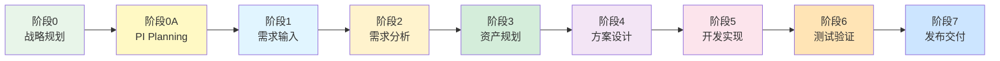

# Auto DevOps平台 - UI主题与导航设计

> **文档版本**: v1.0  
> **创建日期**: 2025-01-02  
> **核心理念**: 2级可视化流程驱动的平台UI

---

## 📋 目录

1. [设计理念](#一设计理念)
2. [UI主题设计](#二ui主题设计)
3. [2级流程导航体系](#三2级流程导航体系)
4. [主导航设计](#四主导航设计)
5. [页面布局框架](#五页面布局框架)

---

## 一、设计理念

### 1.1 核心创新：2级可视化流程驱动

```
传统平台设计:
功能模块导航 → 功能页面 → 操作表单

问题:
❌ 功能分散，难以理解整体流程
❌ 角色隔离，各自为战
❌ 流程割裂，交接不顺畅
❌ 数据孤岛，缺乏端到端视图

Auto DevOps创新设计:
L1主流程（主页） → L2详细流程 → L3功能页面

优势:
✅ 流程可视化，一目了然
✅ 全角色共享流程视图，权限区分操作
✅ 端到端流程，减少交接摩擦
✅ 数据集成，全局视角
✅ 新人友好，快速理解业务
```

### 1.2 2级流程层次

```
┌─────────────────────────────────────────────────────────────────┐
│ L1: 主流程（主页面）                                             │
│ ━━━━━━━━━━━━━━━━━━━━━━━━━━━━━━━━━━━━━━━━━━━━━━━━━━━━━━━━━━━  │
│                                                                  │
│  [战略规划] → [PI Planning] → [需求输入] → [需求分析] →         │
│  [资产规划] → [方案设计] → [开发实现] → [测试验证] → [发布交付] │
│                                                                  │
│  • 全角色可见，完整的研发价值流                                  │
│  • 可视化流程图，节点可点击                                      │
│  • 实时进度显示，当前阶段高亮                                    │
│  • 关键指标展示（Lead Time、效率等）                             │
│                                                                  │
└─────────────────────────────────────────────────────────────────┘
                        ↓ 点击节点
┌─────────────────────────────────────────────────────────────────┐
│ L2: 详细流程（弹出/侧滑）                                        │
│ ━━━━━━━━━━━━━━━━━━━━━━━━━━━━━━━━━━━━━━━━━━━━━━━━━━━━━━━━━━━  │
│                                                                  │
│  例如：点击"需求分析"节点 →                                      │
│                                                                  │
│  [接收需求] → [搜索资产库] → [评估适配度] → [填写评审意见] →    │
│  [提交评审] → [确认通过]                                        │
│                                                                  │
│  • 详细的子流程步骤                                             │
│  • 每个步骤可点击进入功能页面                                    │
│  • 显示当前步骤状态和负责人                                      │
│  • 步骤间依赖关系可视化                                         │
│                                                                  │
└─────────────────────────────────────────────────────────────────┘
                        ↓ 点击步骤
┌─────────────────────────────────────────────────────────────────┐
│ L3: 功能页面（全屏）                                             │
│ ━━━━━━━━━━━━━━━━━━━━━━━━━━━━━━━━━━━━━━━━━━━━━━━━━━━━━━━━━━━  │
│                                                                  │
│  例如：点击"搜索资产库"步骤 →                                    │
│                                                                  │
│  资产检索页面                                                    │
│  ├─ 搜索框、筛选器                                              │
│  ├─ 资产列表                                                    │
│  ├─ 资产详情                                                    │
│  └─ 适配度评估工具                                              │
│                                                                  │
│  • 具体的功能操作界面                                           │
│  • 面包屑导航显示层级                                           │
│  • 快速返回流程视图                                             │
│                                                                  │
└─────────────────────────────────────────────────────────────────┘
```

### 1.3 角色权限与流程视图

```
核心设计原则:
全角色共享流程视图，操作权限分级

示例：主流程中的"需求分析"节点

┌─────────────────────────────────────────────────────────────┐
│ 角色: 产品经理                                               │
├─────────────────────────────────────────────────────────────┤
│ 可见: ✅ 整个"需求分析"流程                                 │
│ 可操作:                                                      │
│  ✅ 发起评审                                                │
│  ✅ 查看评审进度                                            │
│  ✅ 确认评审结果                                            │
│  ❌ 填写评审意见（只能查看）                                │
└─────────────────────────────────────────────────────────────┘

┌─────────────────────────────────────────────────────────────┐
│ 角色: 系统工程师                                             │
├─────────────────────────────────────────────────────────────┤
│ 可见: ✅ 整个"需求分析"流程                                 │
│ 可操作:                                                      │
│  ✅ 查看需求详情                                            │
│  ✅ 搜索资产库                                              │
│  ✅ 评估适配度                                              │
│  ✅ 填写评审意见                                            │
│  ✅ 提交评审                                                │
│  ❌ 发起评审（只能查看）                                    │
└─────────────────────────────────────────────────────────────┘

┌─────────────────────────────────────────────────────────────┐
│ 角色: 开发工程师                                             │
├─────────────────────────────────────────────────────────────┤
│ 可见: ✅ 整个"需求分析"流程                                 │
│ 可操作:                                                      │
│  ✅ 查看需求详情（只读）                                    │
│  ✅ 查看评审结果（只读）                                    │
│  ❌ 其他操作（只能查看进度）                                │
└─────────────────────────────────────────────────────────────┘

价值:
✅ 全员理解整体流程，知道自己在哪个环节
✅ 上下游协作透明，减少沟通成本
✅ 新人快速了解业务流程
✅ 管理层全局视角，实时掌握进度
```

---

## 二、UI主题设计

### 2.1 主题定位

**平台定位**: 企业级、专业、高效、协同  
**目标用户**: 汽车研发工程师（专业用户）  
**使用场景**: 日常工作、多角色协作、长时间使用

**设计原则**:
- 🎯 **效率优先**: 减少点击次数，快速定位
- 👁️ **视觉清晰**: 信息层次分明，降低认知负担
- 🔄 **流程可视**: 流程图为核心，直观易懂
- 🤝 **协同友好**: 实时协作，状态透明
- 📊 **数据驱动**: 关键指标可视化

### 2.2 色彩系统

#### 主色调（Primary）

```
主色: #1976D2 (Material Blue 700)
用途: 主按钮、重要链接、选中状态

色值:
- Primary:     #1976D2
- Primary-Light: #42A5F5
- Primary-Dark: #1565C0
```

#### 辅助色（Secondary）

```
辅助色: #FF9800 (Material Orange 500)
用途: 次要按钮、警告信息、待办提醒

色值:
- Secondary:      #FF9800
- Secondary-Light: #FFB74D
- Secondary-Dark:  #F57C00
```

#### 语义色（Semantic）

```
成功: #4CAF50 (Green)
警告: #FF9800 (Orange)
错误: #F44336 (Red)
信息: #2196F3 (Blue)

流程状态色:
- 未开始: #9E9E9E (Grey)
- 进行中: #2196F3 (Blue)
- 已完成: #4CAF50 (Green)
- 阻塞中: #F44336 (Red)
- 等待中: #FF9800 (Orange)
```

#### 中性色（Neutral）

```
背景色:
- 主背景: #FAFAFA (Grey 50)
- 卡片背景: #FFFFFF (White)
- 侧边栏: #263238 (Blue Grey 900)

文字色:
- 主文字: #212121 (Grey 900)
- 次文字: #757575 (Grey 600)
- 辅助文字: #9E9E9E (Grey 500)
- 禁用文字: #BDBDBD (Grey 400)

边框色:
- 默认边框: #E0E0E0 (Grey 300)
- 分割线: #EEEEEE (Grey 200)
```

#### 流程节点色

```
阶段0-战略规划:   #E8F5E9 (Light Green 50)
阶段0A-PI Planning: #FFF9C4 (Yellow 50)
阶段1-需求输入:   #E1F5FF (Light Blue 50)
阶段2-需求分析:   #FFF3CD (Amber 50)
阶段3-资产规划:   #D4EDDA (Light Green 100)
阶段4-方案设计:   #F3E5F5 (Purple 50)
阶段5-开发实现:   #FCE4EC (Pink 50)
阶段6-测试验证:   #FFE4B5 (Orange 50)
阶段7-发布交付:   #CCE5FF (Blue 100)
```

### 2.3 字体系统

#### 字体家族

```css
--font-family-base: -apple-system, BlinkMacSystemFont, 
                    "Segoe UI", "PingFang SC", "Hiragino Sans GB", 
                    "Microsoft YaHei", "Helvetica Neue", Helvetica, 
                    Arial, sans-serif;

--font-family-code: "SF Mono", Monaco, "Cascadia Code", 
                    "Roboto Mono", Consolas, "Courier New", monospace;
```

#### 字体大小

```css
--font-size-h1: 32px;  /* 页面标题 */
--font-size-h2: 24px;  /* 区块标题 */
--font-size-h3: 20px;  /* 卡片标题 */
--font-size-h4: 16px;  /* 小标题 */
--font-size-base: 14px; /* 正文 */
--font-size-small: 12px; /* 辅助文字 */
--font-size-mini: 10px;  /* 标签 */
```

#### 字重

```css
--font-weight-light: 300;
--font-weight-normal: 400;
--font-weight-medium: 500;
--font-weight-semibold: 600;
--font-weight-bold: 700;
```

### 2.4 间距系统

```css
/* 基础间距单位: 8px */
--spacing-base: 8px;

/* 间距等级 */
--spacing-xs: 4px;    /* 0.5x */
--spacing-sm: 8px;    /* 1x */
--spacing-md: 16px;   /* 2x */
--spacing-lg: 24px;   /* 3x */
--spacing-xl: 32px;   /* 4x */
--spacing-xxl: 48px;  /* 6x */
--spacing-xxxl: 64px; /* 8x */
```

### 2.5 圆角系统

```css
--border-radius-sm: 4px;   /* 小按钮、标签 */
--border-radius-md: 8px;   /* 卡片、输入框 */
--border-radius-lg: 12px;  /* 大卡片、模态框 */
--border-radius-xl: 16px;  /* 特殊容器 */
--border-radius-full: 9999px; /* 圆形 */
```

### 2.6 阴影系统

```css
/* 卡片阴影 */
--shadow-sm: 0 1px 2px rgba(0,0,0,0.05);
--shadow-md: 0 2px 8px rgba(0,0,0,0.08);
--shadow-lg: 0 4px 16px rgba(0,0,0,0.12);
--shadow-xl: 0 8px 24px rgba(0,0,0,0.15);

/* 悬浮阴影 */
--shadow-hover: 0 4px 12px rgba(0,0,0,0.15);
```

### 2.7 动画系统

```css
/* 过渡时间 */
--transition-fast: 150ms;
--transition-base: 300ms;
--transition-slow: 500ms;

/* 缓动函数 */
--ease-in-out: cubic-bezier(0.4, 0, 0.2, 1);
--ease-out: cubic-bezier(0.0, 0, 0.2, 1);
--ease-in: cubic-bezier(0.4, 0, 1, 1);
```

---

## 三、2级流程导航体系

### 3.1 L1主流程（主页面）

**页面名称**: 研发价值流全景图  
**路由**: `/value-stream` 或 `/` (作为首页)  
**布局**: 全屏画布

#### 主流程节点



#### 主流程页面布局

```
┌────────────────────────────────────────────────────────────────┐
│ 顶部导航栏 (60px)                                               │
│ [Logo] [搜索框] [通知] [我的任务] [用户菜单]                   │
├────────────────────────────────────────────────────────────────┤
│                                                                 │
│ 【主流程标题栏】 (80px)                                         │
│ ┌──────────────────────────────────────────────────────────┐ │
│ │ 研发价值流全景图                                          │ │
│ │                                                           │ │
│ │ [视图切换] 全流程 | 当前PI | 当前Sprint                   │ │
│ │ [筛选] 产品: NOA | 状态: 进行中                           │ │
│ └──────────────────────────────────────────────────────────┘ │
│                                                                 │
│ 【主流程画布】 (全屏滚动)                                       │
│ ┌──────────────────────────────────────────────────────────┐ │
│ │                                                           │ │
│ │  [战略规划] → [PI Planning] → [需求输入] → [需求分析] →  │ │
│ │     ↓            ↓              ↓            ↓           │ │
│ │   进度: 100%    进度: 100%    进度: 80%    进度: 60%      │ │
│ │   时间: 4周     时间: 3天     时间: 2h     时间: 1天      │ │
│ │   负责: 产品线  负责: 各团队  负责: PM     负责: SE       │ │
│ │                                                           │ │
│ │  [资产规划] → [方案设计] → [开发实现] → [测试验证] →      │ │
│ │     ↓            ↓            ↓            ↓             │ │
│ │   进度: 40%    进度: 20%    进度: 10%    进度: 0%        │ │
│ │   时间: 4h     时间: 3天     时间: 5天    时间: 3天       │ │
│ │   负责: SE     负责: FO      负责: Dev    负责: TE        │ │
│ │                                                           │ │
│ │  [发布交付]                                              │ │
│ │     ↓                                                     │ │
│ │   进度: 0%                                               │ │
│ │   时间: 1天                                              │ │
│ │   负责: DevOps                                           │ │
│ │                                                           │ │
│ │  【关键指标】                                             │ │
│ │  Lead Time: 23天 | 价值流效率: 77% | 一次通过率: 82%    │ │
│ │                                                           │ │
│ │  【当前状态】                                             │ │
│ │  • NOA v3.1 - 需求分析阶段 (60%完成)                     │ │
│ │  • LCC v2.0 - 开发实现阶段 (30%完成)                     │ │
│ │                                                           │ │
│ └──────────────────────────────────────────────────────────┘ │
│                                                                 │
│ 【侧边栏】 (可折叠, 300px)                                      │
│ ┌──────────────────────────────────────────────────────────┐ │
│ │ 快捷操作                                                  │ │
│ │ • 创建需求                                               │ │
│ │ • 发起评审                                               │ │
│ │ • 查看我的任务                                           │ │
│ │                                                           │ │
│ │ 最近活动                                                  │ │
│ │ • 张三 提交了 UR-001 评审                                │ │
│ │ • 李四 完成了 US-025 开发                                │ │
│ │                                                           │ │
│ │ 待办事项 (8)                                             │ │
│ │ • UR-003 需求评审 (紧急)                                 │ │
│ │ • PR-125 代码审查                                        │ │
│ └──────────────────────────────────────────────────────────┘ │
│                                                                 │
└────────────────────────────────────────────────────────────────┘

交互:
- 鼠标悬停节点: 显示详细信息tooltip
- 点击节点: 展开L2详细流程（右侧抽屉或模态框）
- 拖拽画布: 查看更多内容
- 滚轮缩放: 调整流程图大小
```

### 3.2 L2详细流程（9个核心流程）

#### L2-0: 战略规划详细流程

**触发**: 点击主流程"阶段0-战略规划"节点  
**展示**: 右侧抽屉（800px宽）

```
详细流程节点:
1. 市场分析
2. 制定产品线路线图
3. 规划产品版本
4. 定义版本特性
5. 优先级排序
6. 创建特性Backlog
7. 分配资源
8. 评审和批准
9. 发布路线图

每个节点可点击进入L3功能页面
```

#### L2-0A: PI Planning详细流程

**触发**: 点击主流程"阶段0A-PI Planning"节点  
**展示**: 右侧抽屉（800px宽）

```
详细流程节点:
Day 0: 准备阶段
  1. 发起PI Planning
  2. 邀请参与团队
  3. 准备输入材料
  4. 环境搭建

Day 1: 规划阶段
  5. 业务背景宣讲
  6. 产品愿景分享
  7. 架构愿景介绍
  8. 团队容量规划
  9. 特性分配排期

Day 2: 协同阶段
  10. 团队展示计划
  11. 依赖识别
  12. 风险评估
  13. 调整优化
  14. 制定PI Objectives
  15. 信心投票
  16. 管理评审

Day 3: 发布
  17. 发布PI计划
  18. 创建Sprint 1

每个节点可点击进入L3功能页面
```

#### L2-1: 需求输入详细流程

```
1. 接收需求来源 (整车需求/干系人需求/市场需求)
2. 创建用户需求 (UR-XXX)
3. 填写需求信息 (标题、描述、优先级、目标资产)
4. 上传附件 (需求文档、原型图)
5. 添加干系人
6. 保存需求
7. 系统生成需求编号
8. 建立基础追溯
9. 发送通知
```

#### L2-2: 需求分析详细流程

```
1. 产品经理发起评审
2. 选择评审人 (系统工程师、架构师)
3. 系统工程师接收通知
4. 查看需求详情
5. 搜索资产库 (查找可复用资产)
6. 评估适配度 (复用 vs 新开发)
7. 估算工作量
8. 填写评审意见 (可行性、建议方案、风险)
9. 提交评审结果
10. 产品经理确认 (通过/退回)
```

#### L2-3: 资产规划详细流程

```
1. 系统工程师开始需求分解
2. 分析需求范围
3. 识别功能点
4. 选择/创建领域特性 (DF-XXX)
5. 创建特性需求 (FR-XXX)
6. 填写特性需求信息 (功能规格、验收标准)
7. 关联领域特性
8. 建立追溯关系 (UR → FR)
9. 配置特性变体 (如需要)
10. 分配特性负责人
11. 发送任务通知
```

#### L2-4: 方案设计详细流程

```
1. 特性负责人接收任务
2. 分析特性需求
3. 设计逻辑架构 (识别逻辑组件)
4. 定义组件职责
5. 设计组件交互
6. 定义接口 (服务接口、事件接口、数据接口)
7. 识别变体点
8. 分解模块需求 (MR-XXX)
9. 关联软件模块
10. 准备评审材料 (架构图、接口定义)
11. 发起技术评审
12. 评审会议 (系统工程师、架构师参与)
13. 评审通过/修改方案
14. 创建开发任务
15. 分配给开发工程师
```

#### L2-5: 开发实现详细流程

```
1. 开发工程师领取任务
2. 查看任务详情 (模块需求、接口定义、验收标准)
3. 创建开发分支 (feature/xxx)
4. 编写代码 (功能逻辑、异常处理、注释)
5. 编写单元测试
6. 执行单元测试
7. 本地构建验证
8. 提交代码审查 (创建PR/MR)
9. 关联模块需求
10. 填写提交说明
11. 特性负责人审查代码 (质量、功能、测试)
12. 审查通过/修改代码
13. 合并代码到主分支
14. 触发自动构建 (CI Pipeline)
15. 构建成功/修复构建
16. 生成制品，发布到制品库
17. 更新任务状态 (已完成)
```

#### L2-6: 测试验证详细流程

```
1. 测试工程师查看模块需求
2. 查看验收标准
3. 设计测试用例 (功能测试、边界值、异常测试)
4. 关联需求 (MR → TC)
5. 评审测试用例 (特性负责人评审)
6. DevOps部署测试环境
7. 执行测试 (手工测试 + 自动化测试)
8. 发现缺陷 → 提交缺陷 (Bug-XXX)
9. 描述缺陷 (重现步骤、预期vs实际、严重程度)
10. 开发工程师接收缺陷
11. 分析定位缺陷
12. 修复缺陷，提交修复代码
13. 构建新版本
14. 测试工程师验证修复
15. 验证通过 → 关闭缺陷
16. 所有缺陷关闭 → 记录测试结果
17. 编写测试报告 (测试统计、缺陷分析、质量评估)
18. 需求验证通过标记
```

#### L2-7: 发布交付详细流程

```
1. 产品经理创建发布计划
2. 选择发布内容 (已验证需求、缺陷修复)
3. 编写发布说明 (Release Notes)
4. 发起发布审批
5. 质量工程师审批 (检查质量报告)
6. 架构师审批 (技术方案评审)
7. 产品经理批准发布
8. DevOps工程师准备发布 (制定步骤、备份、回滚方案)
9. 执行发布 (部署到生产环境)
10. 发布验证 (健康检查、烟雾测试、监控指标)
11. 验证通过/执行回滚
12. 发布完成，更新资产状态
13. 发送发布通知
14. 发布后监控 (24小时监控，收集反馈)
```

### 3.3 L2流程展示样式

```
┌────────────────────────────────────────────────────────────────┐
│ 【L2详细流程抽屉】 (右侧, 800px宽)                              │
├────────────────────────────────────────────────────────────────┤
│                                                                 │
│ ┌────────────────────────────────────────────────────────────┐ │
│ │ [×] 阶段2: 需求分析 - 详细流程                             │ │
│ │                                                             │ │
│ │ 总体进度: ████████░░ 80%                                   │ │
│ │ 当前步骤: 5. 搜索资产库                                    │ │
│ │ 负责人: 张三 (系统工程师)                                  │ │
│ └────────────────────────────────────────────────────────────┘ │
│                                                                 │
│ 【流程可视化】                                                  │
│ ┌────────────────────────────────────────────────────────────┐ │
│ │                                                             │ │
│ │  1. [✓] 产品经理发起评审                                   │ │
│ │      时间: 2025-01-02 10:00 | 耗时: 5分钟                  │ │
│ │      操作人: 李四 (PM)                                     │ │
│ │      [查看详情]                                            │ │
│ │         ↓                                                   │ │
│ │  2. [✓] 选择评审人                                         │ │
│ │      评审人: 张三 (SE), 王五 (架构师)                      │ │
│ │      [查看详情]                                            │ │
│ │         ↓                                                   │ │
│ │  3. [✓] 系统工程师接收通知                                 │ │
│ │      时间: 2025-01-02 10:05 | 通知方式: 邮件+平台          │ │
│ │      [查看通知]                                            │ │
│ │         ↓                                                   │ │
│ │  4. [✓] 查看需求详情                                       │ │
│ │      需求: UR-001 融合感知升级需求                         │ │
│ │      [打开需求详情]                                        │ │
│ │         ↓                                                   │ │
│ │  5. [🔵] 搜索资产库  ← 当前步骤                            │ │
│ │      开始时间: 2025-01-02 11:00                            │ │
│ │      操作人: 张三                                          │ │
│ │      [进入资产检索] ← 点击进入L3功能页面                   │ │
│ │         ↓                                                   │ │
│ │  6. [ ] 评估适配度                                         │ │
│ │      状态: 等待上一步完成                                  │ │
│ │         ↓                                                   │ │
│ │  7. [ ] 填写评审意见                                       │ │
│ │         ↓                                                   │ │
│ │  8. [ ] 提交评审结果                                       │ │
│ │         ↓                                                   │ │
│ │  9. [ ] 产品经理确认                                       │ │
│ │                                                             │ │
│ └────────────────────────────────────────────────────────────┘ │
│                                                                 │
│ 【步骤详情面板】 (可展开)                                       │
│ ┌────────────────────────────────────────────────────────────┐ │
│ │ 步骤5: 搜索资产库                                          │ │
│ │                                                             │ │
│ │ 描述: 在资产库中搜索可复用的资产，评估是否满足需求         │ │
│ │                                                             │ │
│ │ 负责角色: 系统工程师                                       │ │
│ │ 当前负责人: 张三                                           │ │
│ │                                                             │ │
│ │ 输入:                                                       │ │
│ │ • 用户需求详情 (UR-001)                                    │ │
│ │ • 需求关键词                                               │ │
│ │                                                             │ │
│ │ 输出:                                                       │ │
│ │ • 候选资产列表                                             │ │
│ │ • 适配度评估                                               │ │
│ │                                                             │ │
│ │ 关键操作:                                                   │ │
│ │ [进入资产检索] [查看历史记录] [标记完成]                   │ │
│ └────────────────────────────────────────────────────────────┘ │
│                                                                 │
└────────────────────────────────────────────────────────────────┘

图例:
[✓] 已完成
[🔵] 进行中
[ ] 未开始
[⚠️] 阻塞/异常
```

---

## 四、主导航设计

### 4.1 导航结构

```
┌────────────────────────────────────────────────────────────────┐
│ 顶部导航栏 (固定, 60px高)                                       │
├────────────────────────────────────────────────────────────────┤
│                                                                 │
│ [Logo]  [主导航]  [搜索框]  [快捷操作]  [通知]  [用户]         │
│                                                                 │
│ Auto     价值流                🔍 搜索...      ⭐  🔔  👤      │
│ DevOps   工作台                                 (3)            │
│          资产库                                                 │
│          协同                                                   │
│          数据                                                   │
│          管理                                                   │
│                                                                 │
└────────────────────────────────────────────────────────────────┘
```

### 4.2 主导航项

#### 1. 价值流 (核心，首页)

```
路由: /value-stream 或 /

内容:
- 完整的研发价值流可视化（L1主流程）
- 当前PI进度概览
- 当前Sprint进度概览
- 关键指标展示

切换视图:
- 全流程视图 (战略 → 交付)
- PI视图 (当前PI的4个Iteration)
- Sprint视图 (当前Sprint的任务看板)
```

#### 2. 工作台 (个性化)

```
路由: /dashboard

内容:
- 我的待办 (8)
- 我的任务 (12)
- 我的评审 (3)
- 最近活动
- 团队动态
- 快捷操作

角色定制:
- 产品经理工作台
- 系统工程师工作台
- 开发工程师工作台
- 测试工程师工作台
- 等等
```

#### 3. 资产库

```
路由: /assets

子导航:
- 产品线 /product-lines
- 领域产品 /products
- 领域特性 /features
- 软件模块 /modules
- 软件组件 /components
- 资产检索 /assets/search
- 资产分析 /assets/analytics
```

#### 4. 协同

```
路由: /collaboration

子导航:
- 需求管理 /requirements
- 任务看板 /tasks/board
- 评审中心 /reviews
- 团队协作 /teams
- 讨论区 /discussions
```

#### 5. 数据

```
路由: /analytics

子导航:
- 效能分析 /analytics/efficiency
- 质量分析 /analytics/quality
- 复用分析 /analytics/reuse
- 趋势预测 /analytics/trends
- 自定义报表 /analytics/custom
```

#### 6. 管理

```
路由: /admin

子导航:
- 用户管理 /admin/users
- 团队管理 /admin/teams
- 权限管理 /admin/permissions
- 系统配置 /admin/config
- 审计日志 /admin/audit-logs
```

### 4.3 快捷操作按钮

```
⭐ 常用功能快捷入口 (悬浮菜单)
├─ 创建需求
├─ 创建任务
├─ 发起评审
├─ 搜索资产
└─ 创建会议

🔔 通知中心 (3条未读)
├─ @你 的评审请求
├─ 任务截止提醒
└─ 依赖交付通知

👤 用户菜单
├─ 个人设置
├─ 切换角色
├─ 帮助文档
└─ 退出登录
```

---

## 五、页面布局框架

### 5.1 全局布局

```
┌────────────────────────────────────────────────────────────────┐
│ 顶部导航栏 (固定, 60px)                                         │
│ [Logo] [主导航] [搜索] [快捷操作] [通知] [用户]                │
├────────────────────────────────────────────────────────────────┤
│                             │                                   │
│                             │                                   │
│                             │                                   │
│ 主内容区                     │ 侧边栏 (可选, 可折叠)              │
│ (全宽或 calc(100% - 300px)) │ (300px)                          │
│                             │                                   │
│                             │ - 快捷操作                        │
│                             │ - 最近活动                        │
│                             │ - 待办事项                        │
│                             │ - 相关信息                        │
│                             │                                   │
└─────────────────────────────┴───────────────────────────────────┘
```

### 5.2 价值流页面布局（核心）

```
┌────────────────────────────────────────────────────────────────┐
│ 顶部导航栏 (60px)                                               │
├────────────────────────────────────────────────────────────────┤
│ 价值流工具栏 (80px)                                             │
│ [标题] [视图切换] [筛选] [缩放控制] [导出]                      │
├────────────────────────────────────────────────────────────────┤
│                                                                 │
│ 价值流画布 (全屏可滚动)                                         │
│                                                                 │
│ [交互式流程图]                                                  │
│                                                                 │
│ - 可拖拽画布                                                    │
│ - 可缩放                                                        │
│ - 节点可点击                                                    │
│ - 悬停显示详情                                                  │
│                                                                 │
│                                                                 │
│                                                                 │
│                                                                 │
└────────────────────────────────────────────────────────────────┘

右侧抽屉 (L2详细流程展开时):
┌──────────────────┐
│ L2详细流程        │
│ (800px宽)        │
│                  │
│ [流程步骤]       │
│ [当前状态]       │
│ [操作按钮]       │
│                  │
└──────────────────┘
```

### 5.3 列表页布局

```
┌────────────────────────────────────────────────────────────────┐
│ 顶部导航栏 (60px)                                               │
├────────────────────────────────────────────────────────────────┤
│ 页面标题栏 (60px)                                               │
│ [标题] [面包屑]                      [创建按钮] [更多操作]      │
├────────────────────────────────────────────────────────────────┤
│ 筛选器栏 (60px)                                                 │
│ [搜索框] [状态筛选] [类型筛选] [负责人筛选] [日期筛选]         │
├────────────────────────────────────────────────────────────────┤
│                                                                 │
│ 列表内容区                                                      │
│                                                                 │
│ ┌──────────────────────────────────────────────────────────┐  │
│ │ [表格] 或 [卡片列表]                                      │  │
│ │                                                           │  │
│ │ 行1: 需求UR-001 | 融合感知升级 | 进行中 | 张三 | 2025-01-02│  │
│ │ 行2: 需求UR-002 | DMS集成 | 待评审 | 李四 | 2025-01-03    │  │
│ │ ...                                                       │  │
│ └──────────────────────────────────────────────────────────┘  │
│                                                                 │
│ 分页器 (40px)                                                   │
│ [<] [1] [2] [3] ... [10] [>]          共100条，每页20条        │
└────────────────────────────────────────────────────────────────┘
```

### 5.4 详情页布局

```
┌────────────────────────────────────────────────────────────────┐
│ 顶部导航栏 (60px)                                               │
├────────────────────────────────────────────────────────────────┤
│ 页面标题栏 (60px)                                               │
│ [返回] [标题] [ID] [状态标签]         [编辑] [删除] [更多]     │
├────────────────────────────────────────────────────────────────┤
│                             │                                   │
│ 主内容区 (70%)               │ 侧边栏 (30%)                      │
│                             │                                   │
│ 【基本信息卡片】             │ 【元信息】                        │
│ ┌─────────────────────────┐ │ - 创建人: 张三                   │
│ │ 标题: 融合感知升级需求   │ │ - 创建时间: 2025-01-02           │
│ │ 描述: ...               │ │ - 更新时间: 2025-01-03           │
│ │ 优先级: 高              │ │ - 负责人: 李四                   │
│ └─────────────────────────┘ │                                   │
│                             │ 【关联信息】                      │
│ 【详细信息卡片】             │ - 关联特性: 2个                  │
│ ┌─────────────────────────┐ │ - 关联任务: 5个                  │
│ │ 验收标准: ...           │ │ - 关联缺陷: 1个                  │
│ │ 附件: 2个文件           │ │                                   │
│ └─────────────────────────┘ │ 【操作历史】                      │
│                             │ - 2025-01-03 张三 提交评审        │
│ 【追溯关系卡片】             │ - 2025-01-02 李四 创建需求        │
│ ┌─────────────────────────┐ │                                   │
│ │ [追溯树状图]            │ │ 【快捷操作】                      │
│ │ UR → FR → MR            │ │ [发起评审] [分配任务]            │
│ └─────────────────────────┘ │                                   │
│                             │                                   │
│ 【评论和讨论】               │                                   │
│ ┌─────────────────────────┐ │                                   │
│ │ [评论列表]              │ │                                   │
│ │ [评论输入框]            │ │                                   │
│ └─────────────────────────┘ │                                   │
│                             │                                   │
└─────────────────────────────┴───────────────────────────────────┘
```

### 5.5 表单页布局

```
┌────────────────────────────────────────────────────────────────┐
│ 顶部导航栏 (60px)                                               │
├────────────────────────────────────────────────────────────────┤
│ 页面标题栏 (60px)                                               │
│ [返回] [标题: 创建用户需求]                                     │
├────────────────────────────────────────────────────────────────┤
│                                                                 │
│ 表单内容区 (居中, 最大800px)                                    │
│                                                                 │
│ ┌────────────────────────────────────────────────────────────┐ │
│ │ 【基本信息】                                                │ │
│ │                                                             │ │
│ │ 需求标题 *                                                  │ │
│ │ [输入框                                                    ]│ │
│ │                                                             │ │
│ │ 需求来源 *                                                  │ │
│ │ [下拉选择: 整车需求/干系人需求/市场需求                    ]│ │
│ │                                                             │ │
│ │ 优先级 *                                                    │ │
│ │ [单选: 高/中/低                                            ]│ │
│ │                                                             │ │
│ │ 需求描述 *                                                  │ │
│ │ [富文本编辑器                                              ]│ │
│ │                                                             │ │
│ │ 目标资产                                                    │ │
│ │ [资产选择器                                                ]│ │
│ │                                                             │ │
│ │ 附件                                                        │ │
│ │ [文件上传区域                                              ]│ │
│ │                                                             │ │
│ │ 干系人                                                      │ │
│ │ [人员选择器                                                ]│ │
│ │                                                             │ │
│ └────────────────────────────────────────────────────────────┘ │
│                                                                 │
│ 操作栏 (固定在底部)                                             │
│ ┌────────────────────────────────────────────────────────────┐ │
│ │ [取消] [保存草稿]                              [提交] │ │
│ └────────────────────────────────────────────────────────────┘ │
│                                                                 │
└────────────────────────────────────────────────────────────────┘
```

---

## 六、响应式设计

### 6.1 断点定义

```css
/* 手机 */
@media (max-width: 767px) {
  /* 单栏布局，侧边栏隐藏 */
}

/* 平板 */
@media (min-width: 768px) and (max-width: 1023px) {
  /* 双栏布局，侧边栏可折叠 */
}

/* 桌面 */
@media (min-width: 1024px) and (max-width: 1439px) {
  /* 标准布局 */
}

/* 大屏 */
@media (min-width: 1440px) {
  /* 宽屏布局，更多信息展示 */
}
```

### 6.2 价值流页面响应式

```
桌面 (1440px+):
- 完整流程图展示
- 侧边栏固定显示
- L2抽屉800px宽

平板 (768-1023px):
- 流程图可横向滚动
- 侧边栏可折叠
- L2抽屉600px宽

手机 (< 768px):
- 流程图简化版（垂直展示）
- 侧边栏隐藏（抽屉式）
- L2抽屉全屏展示
```

---

## 总结

### 核心设计亮点

1. **2级可视化流程驱动** ⭐
   - L1主流程作为首页，全角色共享
   - L2详细流程，可视化每个阶段的子步骤
   - L3功能页面，具体操作界面

2. **流程为中心，而非功能模块**
   - 新人快速理解业务流程
   - 减少功能割裂感
   - 端到端视角

3. **角色权限分离**
   - 相同流程视图，不同操作权限
   - 全员理解整体，各司其职
   - 提升协作效率

4. **数据可视化**
   - 实时进度展示
   - 关键指标Dashboard
   - 流程瓶颈识别

---

**文档维护**:
- 负责人: UI/UX团队 + 产品架构团队
- 更新频率: 按需更新
- 最后更新: 2025-01-02

