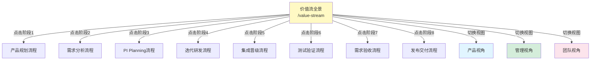
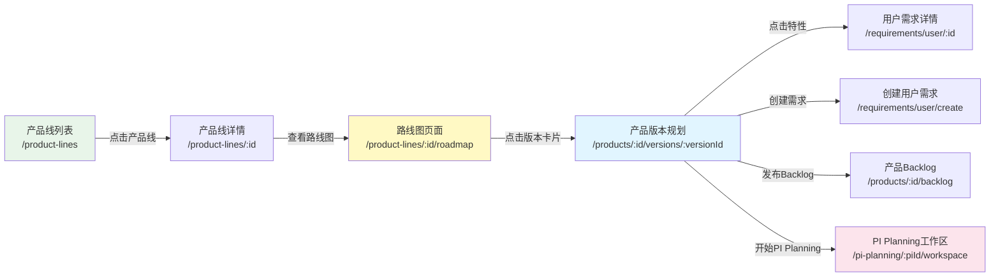
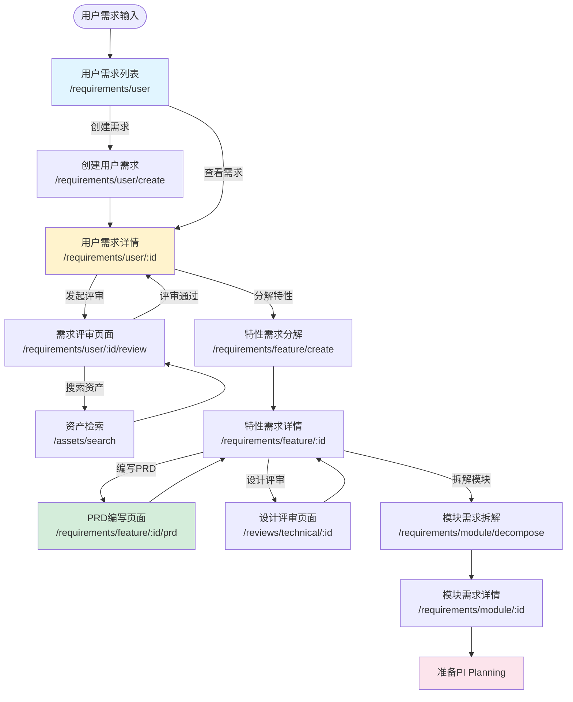
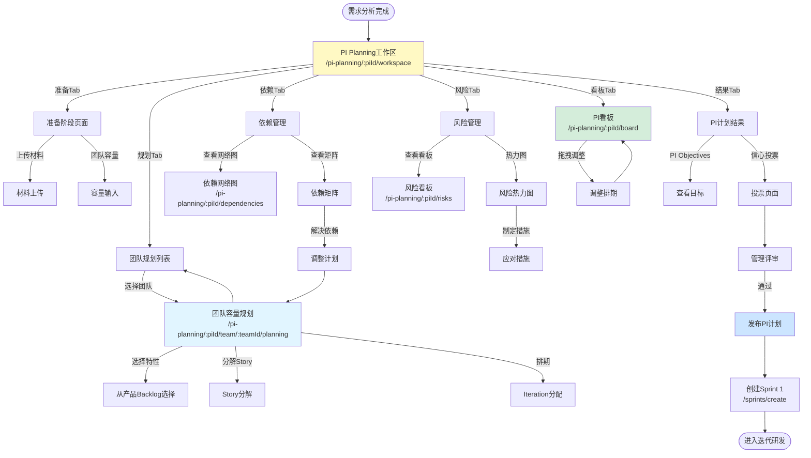
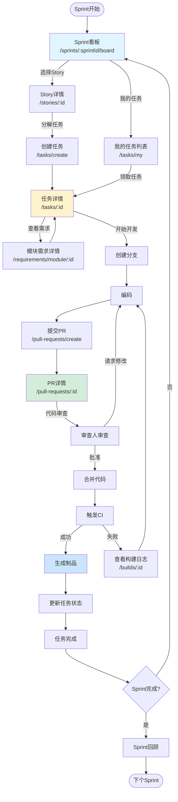
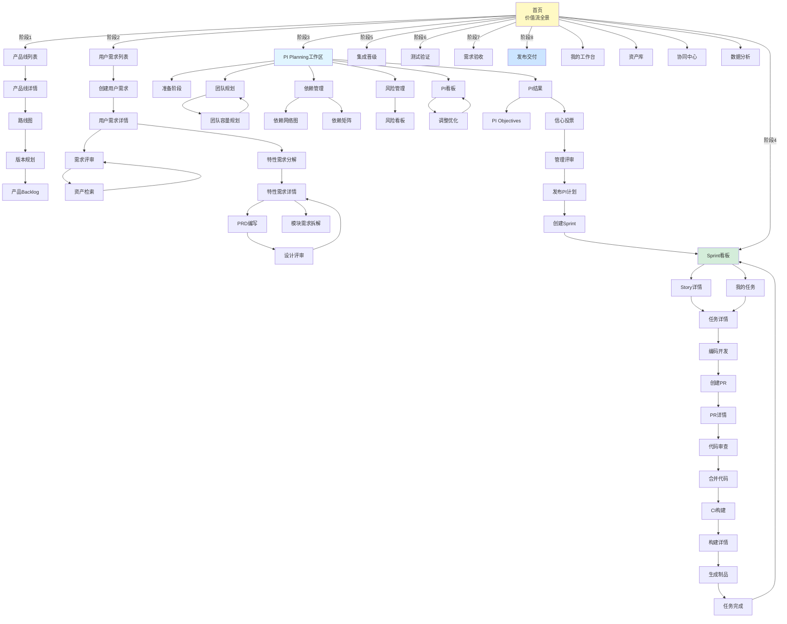

# Auto DevOps平台 - 页面跳转关系图

> **文档版本**: v1.0  
> **创建日期**: 2025-01-02  
> **说明**: 基于实际业务数据的页面跳转关系

---

## 📋 目录

1. [导航体系总览](#一导航体系总览)
2. [主流程页面跳转](#二主流程页面跳转)
3. [产品规划流程跳转](#三产品规划流程跳转)
4. [需求分析流程跳转](#四需求分析流程跳转)
5. [PI Planning流程跳转](#五pi-planning流程跳转)
6. [迭代研发流程跳转](#六迭代研发流程跳转)
7. [完整跳转关系Mermaid图](#七完整跳转关系mermaid图)

---

## 一、导航体系总览

### 1.1 三层导航结构

```
L0: 顶部主导航 (全局固定)
  ├─ 价值流 (首页)
  ├─ 工作台
  ├─ 资产库
  ├─ 协同
  ├─ 数据
  └─ 管理

L1: 二级导航 (根据主导航切换)
  ├─ 价值流下:全流程视图 | 产品视角 | 管理视角 | 团队视角
  ├─ 资产库下: 产品线 | 产品 | 特性 | 模块 | 组件 | 检索
  ├─ 协同下: 需求 | 任务 | 评审 | 团队 | 讨论
  └─ ...

L2: 详细页面 (具体功能页面)
  └─ 列表页 | 详情页 | 创建/编辑页 | 看板页 | 报表页
```

### 1.2 页面层级关系

```
首页 (/)
│
├─ 研发价值流全景 (/value-stream)
│  ├─ 全流程视图
│  ├─ 产品视角视图
│  ├─ 管理视角视图
│  └─ 团队视角视图
│
├─ 我的工作台 (/dashboard)
│  ├─ 产品经理工作台
│  ├─ 系统工程师工作台
│  ├─ 开发工程师工作台
│  └─ ...
│
├─ 产品规划
│  ├─ 产品线列表 (/product-lines)
│  │  └─ 产品线详情 (/product-lines/:id)
│  │     └─ 路线图 (/product-lines/:id/roadmap)
│  └─ 产品版本规划 (/products/:id/versions)
│
├─ 需求分析
│  ├─ 用户需求列表 (/requirements/user)
│  │  ├─ 创建用户需求 (/requirements/user/create)
│  │  └─ 用户需求详情 (/requirements/user/:id)
│  │     ├─ 需求评审 (/requirements/user/:id/review)
│  │     └─ PRD编写 (/requirements/feature/:id/prd)
│  └─ 特性需求列表 (/requirements/feature)
│     └─ 模块需求拆解 (/requirements/module/decompose)
│
├─ PI Planning
│  └─ PI Planning工作区 (/pi-planning/:piId/workspace)
│     ├─ PI看板 (/pi-planning/:piId/board)
│     ├─ 团队规划 (/pi-planning/:piId/team/:teamId/planning)
│     ├─ 依赖网络 (/pi-planning/:piId/dependencies)
│     └─ 风险看板 (/pi-planning/:piId/risks)
│
├─ 迭代研发
│  ├─ Sprint看板 (/sprints/:sprintId/board)
│  ├─ 团队Backlog (/teams/:teamId/backlog)
│  ├─ 我的任务 (/tasks/my)
│  │  └─ 任务详情 (/tasks/:id)
│  └─ 代码审查 (/pull-requests/:id)
│
└─ ...后续阶段
```

---

## 二、主流程页面跳转

### 2.1 从价值流全景跳转到各阶段



### 2.2 用户首次登录的导航路径

```
场景1: 产品经理首次登录

登录 → 首页(/value-stream) 
    → 看到全流程，当前在"需求分析"阶段
    → 点击"阶段2:需求分析"节点
    → 弹出L2详细流程(右侧抽屉)
    → 点击"用户需求输入"步骤
    → 跳转到"用户需求列表"(/requirements/user)
    → 点击"创建需求"
    → 跳转到"创建用户需求"页面(/requirements/user/create)

场景2: 开发工程师首次登录

登录 → 首页(/value-stream)
    → 自动切换到"团队视角"
    → 看到自己团队(NOA团队)的Sprint看板
    → 点击"我的任务"
    → 跳转到"我的任务"页面(/tasks/my)
    → 看到3个待办任务
    → 点击某个任务
    → 跳转到"任务详情"(/tasks/:id)
```

---

## 三、产品规划流程跳转

### 3.1 产品规划完整跳转路径



### 3.2 实际业务数据跳转示例

**示例**: 查看NOA v3.1版本规划并开始PI Planning

```
步骤1: 产品线列表
路由: /product-lines
数据: 
  - 智能驾驶产品线 (ID: pl-001)
  - ADAS产品线 (ID: pl-002)
  - ...
操作: 点击"智能驾驶产品线"
    ↓
步骤2: 产品线详情
路由: /product-lines/pl-001
数据:
  - 产品线名称: 智能驾驶
  - 包含产品: NOA, LCC, APA
  - 路线图: 2025-2026
操作: 点击"查看路线图"
    ↓
步骤3: 路线图页面
路由: /product-lines/pl-001/roadmap
数据:
  - NOA: v3.0(2025Q1), v3.1(2025Q2), v3.2(2025Q3)
  - LCC: v2.0(2025Q1), v2.1(2025Q2)
  - APA: v1.0(2025Q2)
操作: 点击"NOA v3.1"版本卡片
    ↓
步骤4: NOA v3.1版本规划
路由: /products/noa/versions/v3.1
数据:
  - 版本目标: 路径规划优化、控制算法重构
  - 特性列表: 5个特性 (UR-001 ~ UR-005)
  - 总工作量: 131 SP
  - 状态: 需求分析中
操作: 点击"开始PI Planning"
    ↓
步骤5: PI Planning工作区
路由: /pi-planning/2025-q1/workspace
数据:
  - PI: 2025-Q1
  - 周期: 8周
  - 参与团队: NOA, LCC, 平台, 测试
  - 输入: NOA v3.1特性列表
```

---

## 四、需求分析流程跳转

### 4.1 需求分析完整跳转路径



### 4.2 实际业务数据跳转示例

**示例**: 创建融合感知升级需求，完成评审和PRD

```
步骤1: 创建用户需求
路由: /requirements/user/create
输入数据:
  - 标题: 融合感知升级需求
  - 来源: 整车需求
  - 描述: 支持4D毫米波雷达...
  - 优先级: P0
  - 目标资产: 智能感知
操作: 提交
    ↓
步骤2: 用户需求详情
路由: /requirements/user/ur-001
数据:
  - ID: UR-001
  - 标题: 融合感知升级需求
  - 状态: 待评审
  - 创建人: 李四(PM)
操作: 点击"发起评审"
    ↓
步骤3: 需求评审
路由: /requirements/user/ur-001/review
数据:
  - 需求: UR-001
  - 评审人: 张三(SE), 赵六(架构师)
操作: 张三搜索资产库 → 点击"搜索资产"
    ↓
步骤4: 资产检索
路由: /assets/search?context=review&requirementId=ur-001
搜索: "4D毫米波雷达 感知"
结果:
  - 传感器平台驱动 v2.0 (适配度: 85%)
  - 融合感知算法 v1.5 (适配度: 70%)
操作: 返回评审页面
    ↓
步骤5: 完成评审
路由: /requirements/user/ur-001/review
填写:
  - 技术可行性: 可行
  - 建议方案: 复用传感器驱动，优化算法
  - 工作量: 34 SP
  - 风险: 中等
操作: 提交评审
    ↓
步骤6: 需求详情(更新状态)
路由: /requirements/user/ur-001
数据:
  - 状态: 评审通过 ✓
  - 评审意见: 已记录
操作: 点击"分解特性需求"
    ↓
步骤7: 特性需求分解
路由: /requirements/feature/create?fromUR=ur-001
预填充:
  - 关联用户需求: UR-001
  - 领域特性: 智能感知
输入:
  - 特性需求ID: FR-001
  - 标题: 融合感知升级特性
  - 功能规格: ...
操作: 提交
    ↓
步骤8: 特性需求详情
路由: /requirements/feature/fr-001
数据:
  - ID: FR-001
  - 标题: 融合感知升级特性
  - 关联UR: UR-001
  - 状态: PRD编写中
操作: 点击"编写PRD"
    ↓
步骤9: PRD编写
路由: /requirements/feature/fr-001/prd
编辑器: 富文本+结构化
章节:
  - 1. 特性概述
  - 2. 用户场景
  - 3. 功能需求
  - 4. 非功能需求
  - 5. 验收标准
操作: 保存并提交评审
    ↓
步骤10: 设计评审
路由: /reviews/technical/rv-001
数据:
  - 评审对象: PRD - FR-001
  - 评审人: 架构师
评审结果: 通过 ✓
    ↓
步骤11: 特性需求详情(更新状态)
路由: /requirements/feature/fr-001
数据:
  - 状态: PRD已完成 ✓
  - 下一步: 等待PI Planning
操作: 可以开始模块需求拆解(可选)
```

---

## 五、PI Planning流程跳转

### 5.1 PI Planning完整跳转路径



### 5.2 实际业务数据跳转示例

**示例**: NOA团队在PI Planning中规划Sprint

```
步骤1: 进入PI Planning工作区
路由: /pi-planning/2025-q1/workspace
数据:
  - PI: 2025-Q1
  - 日期: 2024-12-26 ~ 12-28
  - 状态: Day 1下午 - 团队规划
  - 参与团队: NOA, LCC, 平台, 测试
操作: 点击"规划"Tab → 选择"NOA团队"
    ↓
步骤2: NOA团队容量规划
路由: /pi-planning/2025-q1/team/noa/planning
数据:
  - 团队: NOA特性团队
  - 人员: 8人
  - PI周期: 8周 = 4个Iteration
  - 可用容量: 126 SP
  - 产品Backlog: 5个特性可选
    - UR-001 融合感知升级 (34 SP)
    - UR-002 路径规划优化 (21 SP)
    - UR-003 DMS集成 (13 SP)
    - UR-004 控制算法重构 (55 SP)
    - UR-005 性能优化 (8 SP)
操作: 
  1. 选择Must Have特性(前3个)
  2. 选择Should Have特性(第4个)
  3. 计算: 34+21+13+55 = 123 SP ≈ 容量126 SP
    ↓
步骤3: 分解和排期
界面: 特性分配到Iteration
操作:
  Iteration 1 (Week 1-2, 32 SP容量):
    - UR-001 融合感知升级 (34 SP) → 分解为:
      - US-001 传感器驱动集成 (13 SP)
      - US-002 融合算法适配 (21 SP)
    - UR-003 DMS集成 (13 SP) → 分解为:
      - US-003 DMS摄像头接入 (8 SP)
      - US-004 DMS算法集成 (5 SP)
    小计: 47 SP ⚠️ 超载15 SP
    
  调整:
    - US-002缩减到15 SP (只做核心功能)
    - US-004移到Iteration 2
    调整后: 36 SP (可接受)
    
  Iteration 2 (Week 3-4, 32 SP容量):
    - US-004 DMS算法集成 (5 SP, 从Iter 1移入)
    - UR-002 路径规划优化 (21 SP)
    小计: 26 SP ✓
    
  Iteration 3 (Week 5-6, 30 SP容量):
    - UR-004 控制算法重构 (55 SP) → 分解为:
      - US-010 控制算法重构-Part1 (30 SP)
    小计: 30 SP ✓
    
  Iteration 4 (Week 7-8, 32 SP容量):
    - UR-004 控制算法重构 (继续)
      - US-011 控制算法重构-Part2 (25 SP)
    小计: 25 SP ✓
    
总计: 117 SP (在126 SP容量内) ✓
操作: 保存团队计划
    ↓
步骤4: 标注依赖
界面: 依赖标注
识别:
  - D1: US-001依赖平台团队"传感器驱动升级" (Iter 1 Week 1)
  - D2: US-002依赖US-001完成 (Iter 1 Week 2)
  - D3: US-010依赖"路径规划输出" (Iter 3)
标注: 在对应Story上添加依赖标记
操作: 完成团队规划
    ↓
步骤5: 回到PI Planning工作区
路由: /pi-planning/2025-q1/workspace
状态: NOA团队规划已完成 ✓
显示: 
  - 容量: 126 SP
  - 已分配: 117 SP
  - 负载: 93% 🟢
  - 特性: 4个
  - 依赖: 3个
操作: 等待其他团队完成规划
    ↓
步骤6: Day 2 - 依赖识别
路由: /pi-planning/2025-q1/dependencies
界面: 依赖网络图
显示:
  [NOA团队] ─D1→ [平台团队]
      ↓ D2(内部)
  [LCC团队] ←D4─ [平台团队]
  
依赖详情:
  - D1: NOA依赖平台传感器驱动 (Iter 1 Week 1)
    状态: 🔴 高风险
    原因: 平台团队人手不足
    应对: 平台团队加2人，承诺Week 1 Wed完成
    备选: 提供Mock接口供并行开发
    
操作: 调整依赖解决方案
    ↓
步骤7: 风险评估
路由: /pi-planning/2025-q1/risks
界面: 风险看板(ROAM)
新增风险:
  - R1: 传感器驱动延期 (概率:中, 影响:高)
    分类: Owned (平台团队Leader负责)
    措施: 加人、提供Mock
    
操作: 完成风险评估
    ↓
步骤8: 调整优化
路由: /pi-planning/2025-q1/board (PI看板)
界面: 拖拽调整
优化:
  - 确认NOA团队Iter 1排期
  - 确认依赖D1的解决方案
  - 平衡各团队负载
    
操作: 最终确认
    ↓
步骤9: 制定PI Objectives
路由: /pi-planning/2025-q1/objectives
NOA团队PI Objectives:
  Business Objectives:
    1. 交付融合感知升级 (Must)
    2. 优化路径规划算法 (Must)
    3. 集成DMS功能 (Must)
    4. 完成控制算法重构 (Should)
  Stretch Objectives:
    5. 性能优化 (Could, 如果时间充裕)
    
操作: 提交PI Objectives
    ↓
步骤10: 信心投票
路由: /pi-planning/2025-q1/vote
界面: 投票页面
NOA团队成员投票:
  - 张三: 4分
  - 李四: 4分
  - 王五: 3分 (担心依赖D1)
  - 赵六: 4分
  - ...
  平均: 3.8分
  
问题: 王五的疑虑
讨论: 与平台团队确认承诺
结果: 王五改投4分
最终平均: 4.0分 ✓
    ↓
步骤11: 管理评审
路由: /pi-planning/2025-q1/review
参与: 产品线经理、技术经理
评审内容:
  - PI Objectives
  - 团队计划
  - 依赖解决方案
  - 风险应对措施
  - 信心投票结果
    
决策: 通过 ✓
    ↓
步骤12: 发布PI计划
路由: /pi-planning/2025-q1/publish
生成:
  - PI看板
  - 团队迭代计划
  - 依赖矩阵
  - 风险看板
    
发布: 所有团队成员可见
通知: 邮件+平台通知
    ↓
步骤13: 创建Sprint 1
路由: /sprints/create
数据:
  - Sprint: Sprint 1 (PI 2025-Q1)
  - 团队: NOA
  - 时间: 2025-01-06 ~ 2025-01-19 (2周)
  - 目标: 完成感知升级基础和DMS集成
  - Backlog: 从Iter 1计划导入
    - US-001 传感器驱动集成 (13 SP)
    - US-002 融合算法适配 (15 SP)
    - US-003 DMS摄像头接入 (8 SP)
  - 总计: 36 SP
    
操作: 创建Sprint，进入迭代研发阶段
```

---

## 六、迭代研发流程跳转

### 6.1 迭代研发完整跳转路径



### 6.2 实际业务数据跳转示例

**示例**: 开发工程师完成US-001任务

```
步骤1: Sprint看板
路由: /sprints/sprint-1-2025-q1/board
数据:
  - Sprint: Sprint 1
  - 团队: NOA
  - 时间: Week 1-2
  - 目标: 完成感知升级基础和DMS集成
  
看板列:
  待办(3) | 进行中(0) | 代码审查(0) | 测试(0) | 完成(0)
  ─────────┼──────────┼────────────┼────────┼────────
  US-001   │          │            │        │
  13 SP    │          │            │        │
  @张三    │          │            │        │
  
  US-002   │          │            │        │
  15 SP    │          │            │        │
  @李四    │          │            │        │
  
  US-003   │          │            │        │
  8 SP     │          │            │        │
  @王五    │          │            │        │
  
操作: 张三点击US-001卡片
    ↓
步骤2: Story详情
路由: /stories/us-001
数据:
  - ID: US-001
  - 标题: 传感器驱动集成
  - 描述: 集成4D毫米波雷达驱动...
  - Story Point: 13 SP
  - 负责人: 张三
  - 状态: 待办
  - 验收标准:
    1. 雷达数据正常接入
    2. 延迟< 50ms
    3. 帧率20fps
  - 关联需求: MR-001 传感器驱动模块需求
  - 依赖: D1 平台团队传感器驱动 v2.0
  
操作: 点击"查看关联需求"
    ↓
步骤3: 模块需求详情
路由: /requirements/module/mr-001
数据:
  - ID: MR-001
  - 标题: 传感器驱动模块需求
  - 接口定义:
    - 输入: 雷达原始数据 (Binary)
    - 输出: 目标列表 (JSON)
  - 性能要求: 延迟< 50ms
  - 技术规格: ...
  
操作: 理解需求后，返回Story详情
    ↓
步骤4: 分解任务
路由: /stories/us-001
操作: 点击"分解任务"
分解为3个任务:
  - Task-001: 驱动接口适配 (3h)
  - Task-002: 数据解析逻辑 (5h)
  - Task-003: 单元测试 (2h)
  
操作: 创建任务并分配给张三
    ↓
步骤5: 我的任务
路由: /tasks/my
数据:
  今日待办(3):
    - Task-001 驱动接口适配 (3h, US-001)
    - Task-002 数据解析逻辑 (5h, US-001)
    - Task-003 单元测试 (2h, US-001)
    
操作: 点击Task-001
    ↓
步骤6: 任务详情
路由: /tasks/task-001
数据:
  - ID: Task-001
  - 标题: 驱动接口适配
  - 所属Story: US-001
  - 预估: 3h
  - 状态: 待办
  - 负责人: 张三
  - 描述: 适配新的4D雷达驱动接口...
  
操作: 点击"开始任务"
状态更新: 待办 → 进行中
操作: 点击"创建开发分支"
    ↓
步骤7: 创建分支
操作: Git命令 (平台集成)
  git checkout -b feature/us-001-radar-driver-integration
  
显示: 分支已创建，可以开始编码
    ↓
步骤8: 编码
本地开发环境:
  - 编写驱动适配代码
  - 编写单元测试
  - 本地运行测试
  - 本地构建验证
  
完成后:
  git add .
  git commit -m "feat: 实现4D雷达驱动接口适配"
  git push origin feature/us-001-radar-driver-integration
  
操作: 在平台上创建PR
    ↓
步骤9: 创建PR
路由: /pull-requests/create
数据:
  - 源分支: feature/us-001-radar-driver-integration
  - 目标分支: develop
  - 标题: feat: 实现4D雷达驱动接口适配
  - 描述:
    - 完成4D雷达驱动接口适配
    - 添加单元测试，覆盖率85%
    - 性能测试通过，延迟45ms
  - 关联Story: US-001
  - 关联Task: Task-001
  - 审查人: 李四 (特性负责人)
  
操作: 提交PR
    ↓
步骤10: PR详情
路由: /pull-requests/pr-125
数据:
  - ID: PR-125
  - 标题: feat: 实现4D雷达驱动接口适配
  - 作者: 张三
  - 状态: 待审查
  - 审查人: 李四
  - 代码变更:
    - 5个文件修改
    - +250行, -30行
  - 代码质量检查:
    - SonarQube: 通过 ✓
    - ESLint: 0个错误
    - 单元测试: 通过 ✓
    - 覆盖率: 85%
  
通知: 发送通知给李四
    ↓
步骤11: 代码审查
李四接收通知 → 查看PR详情
路由: /pull-requests/pr-125
操作: 李四审查代码
  - 查看代码diff
  - 检查命名规范
  - 检查错误处理
  - 检查测试覆盖
  - 添加行内评论 (2处建议)
  
评审意见:
  - L45: 建议添加null检查
  - L78: 性能优化建议
  
操作: 李四点击"请求修改"
    ↓
步骤12: 修改代码
张三接收通知 → 查看PR详情
路由: /pull-requests/pr-125
查看: 李四的评审意见
操作: 张三修改代码
  - 添加null检查
  - 优化性能
  git commit -m "fix: 根据审查意见修改代码"
  git push
  
自动: PR更新，重新请求审查
    ↓
步骤13: 重新审查
李四接收通知 → 再次查看PR
路由: /pull-requests/pr-125
查看: 最新提交
确认: 修改满意
操作: 李四点击"批准"
    ↓
步骤14: 合并代码
路由: /pull-requests/pr-125
状态: 已批准 ✓
操作: 张三点击"合并"
执行:
  git checkout develop
  git merge feature/us-001-radar-driver-integration
  git push
  
显示: 合并成功 ✓
    ↓
步骤15: 触发CI
自动: Git hook触发CI Pipeline
路由: /builds/build-1234
数据:
  - Build ID: build-1234
  - 触发: PR-125合并
  - 分支: develop
  - 提交: abc123
  - 状态: 运行中...
  
Pipeline步骤:
  1. [✓] 代码检出
  2. [✓] 依赖安装
  3. [✓] 编译构建
  4. [✓] 单元测试
  5. [✓] 集成测试
  6. [🔵] 生成制品...
  7. [ ] 发布到制品库
  
操作: 等待构建完成
    ↓
步骤16: 构建成功
路由: /builds/build-1234
状态: 成功 ✓
制品:
  - sensor-driver-module-v1.2.0.tar.gz (5.2MB)
  - 下载链接: [点击下载]
  
操作: 自动发布到制品库
    ↓
步骤17: 更新任务状态
自动: CI成功后，更新任务状态
路由: /tasks/task-001
数据:
  - 状态: 完成 ✓
  - 实际耗时: 3.5h
  - 完成时间: 2025-01-07 16:30
  
同时更新: Story US-001进度 (Task-001完成 1/3)
    ↓
步骤18: Sprint看板更新
路由: /sprints/sprint-1-2025-q1/board
看板更新:
  待办(2) | 进行中(1) | 代码审查(0) | 测试(0) | 完成(1)
  ─────────┼──────────┼────────────┼────────┼────────
           │ US-001   │            │        │ Task-001
           │ 进行中   │            │        │ ✓
           │ 33%进度  │            │        │
           │ @张三    │            │        │
  
  US-002   │          │            │        │
  @李四    │          │            │        │
  
  US-003   │          │            │        │
  @王五    │          │            │        │
  
操作: 张三继续下一个任务 (Task-002)
```

---

## 七、完整跳转关系Mermaid图

### 7.1 核心页面跳转全景图



---

## 八、总结

### 8.1 页面跳转设计原则

1. **业务流程驱动**: 页面跳转遵循实际业务流程
2. **减少跳转层级**: 核心操作不超过3次跳转
3. **上下文保持**: 跳转时保持业务上下文（面包屑、参数传递）
4. **数据联动**: 页面间数据自动联动，减少重复输入
5. **快捷入口**: 提供快捷操作按钮，减少重复导航

### 8.2 关键跳转路径总结

| 起点 | 目标 | 关键节点 | 跳转次数 |
|------|------|---------|---------|
| 首页 → 创建需求 | 用户需求创建 | 需求列表 | 2次 |
| 需求详情 → PI Planning | PI工作区 | 版本规划 | 3次 |
| PI Planning → Sprint | Sprint看板 | 发布计划 | 2次 |
| Sprint看板 → 编码 | 任务详情 | Story详情 | 2次 |
| 编码 → 制品 | 生成制品 | PR、CI构建 | 4次 |

### 8.3 优化建议

1. **添加全局搜索**: 支持快速跳转到任何需求/任务/PR
2. **最近访问**: 记录用户最近访问的页面，快速返回
3. **收藏夹**: 支持收藏常用页面
4. **快捷键**: 支持键盘快捷键快速导航
5. **智能推荐**: 根据用户角色和当前上下文，推荐下一步操作

---

**文档维护**:
- 负责人: UI/UX团队
- 更新频率: 按需更新
- 最后更新: 2025-01-02

