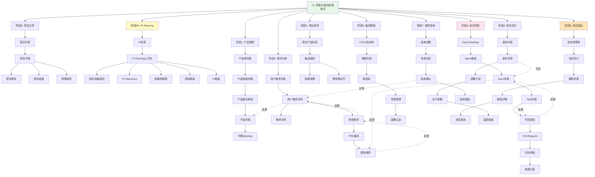

# Auto DevOps Platform - 完整原型设计汇总

> **文档版本**: v1.0  
> **创建日期**: 2025-01-03  
> **用途**: 整合所有原型设计，基于最新业务架构、领域模型、价值流和业务数据

---

## 📋 目录

1. [设计概述](#一设计概述)
2. [完整价值流与页面映射](#二完整价值流与页面映射)
3. [核心页面设计与业务数据](#三核心页面设计与业务数据)
4. [页面跳转与流程串通](#四页面跳转与流程串通)
5. [分角色原型设计](#五分角色原型设计)
6. [典型用户旅程](#六典型用户旅程)

---

## 一、设计概述

### 1.1 设计基础

本原型设计基于：

**领域模型**:
- Architecture/00-DOMAIN_MODEL_DESIGN.md
- 31个核心实体（产品/功能/模块层 + 需求层 + 项目层）
- 27种关系类型（Drive, Realize, Reuse, Trace等）

**业务架构**:
- Architecture/01-BUSINESS_ARCHITECTURE.md
- 8层业务能力模型
- 8个核心角色

**价值流**:
- platform-rd-process/01-VALUE_STREAM_MAPPING.md
- 9个阶段完整价值流（0, 0A, 1-7）

**业务数据**:
- biz-data/02-NOA_V31_BUSINESS_DATA.md
- NOA v3.1完整实例（40+实体，60+关系）

---

### 1.2 设计理念：2级可视化流程驱动

```
┌─────────────────────────────────────────────────────────┐
│              Auto DevOps 创新设计理念                    │
├─────────────────────────────────────────────────────────┤
│                                                          │
│  L1: 主流程页面（首页）                                  │
│  ┌────────────────────────────────────────────┐        │
│  │ 完整研发价值流可视化（9个阶段）             │        │
│  │ • 实时进度和状态                            │        │
│  │ • 关键指标可视化                            │        │
│  │ • 点击节点进入L2                            │        │
│  │ • 分角色视图（产品/管理/团队）               │        │
│  └────────────────────────────────────────────┘        │
│                      ↓ 点击节点                          │
│  L2: 详细流程页面                                        │
│  ┌────────────────────────────────────────────┐        │
│  │ 阶段详细流程可视化                          │        │
│  │ • 步骤展开                                  │        │
│  │ • 数据流动                                  │        │
│  │ • 点击进入L3                                │        │
│  └────────────────────────────────────────────┘        │
│                      ↓ 点击操作                          │
│  L3: 功能页面                                            │
│  ┌────────────────────────────────────────────┐        │
│  │ 具体操作界面                                │        │
│  │ • 表单、列表、详情                          │        │
│  │ • CRUD操作                                  │        │
│  └────────────────────────────────────────────┘        │
│                                                          │
└─────────────────────────────────────────────────────────┘
```

**核心价值**:
- ✅ 流程可视化，全员理解业务
- ✅ 角色共享流程，减少交接摩擦
- ✅ 数据集成，全局视角
- ✅ 新人友好，快速上手

---

## 二、完整价值流与页面映射

### 2.1 9阶段价值流全景

```
┌─────────────────────────────────────────────────────────────────────┐
│                    Auto DevOps 9阶段价值流                           │
├─────────────────────────────────────────────────────────────────────┤
│                                                                      │
│  阶段0: 项目立项（Project Initiation）                               │
│  ├─ 整车项目立项（如：P1 2026款A级轿车）                             │
│  ├─ 平台/功能项目立项（如：NOA功能项目）                             │
│  ├─ 项目章程、目标、团队、预算                                       │
│  └─ 输出: Project, ProjectMilestone                                 │
│                                                                      │
│  阶段0A: PI Planning（Program Increment Planning）⭐ 承上启下        │
│  ├─ 多项目协同（整车+功能项目）                                      │
│  ├─ 团队容量规划                                                     │
│  ├─ 依赖识别与管理                                                   │
│  ├─ 风险评估                                                         │
│  └─ 输出: PI, PIObjective, TeamPlanning, Dependency                │
│                                                                      │
│  阶段1: 产品规划（Product Planning）                                 │
│  ├─ 产品线路线图                                                     │
│  ├─ 产品版本规划（如：NOA v3.1）                                     │
│  ├─ 特性优先级排序                                                   │
│  └─ 输出: ProductLine, DomainProduct, Version, DomainFeature       │
│                                                                      │
│  阶段2: 需求分析（Requirement Analysis）                             │
│  ├─ 用户需求收集（UserRequirement）                                  │
│  ├─ 特性需求分析（FeatureRequirement）                               │
│  ├─ PRD编写与评审                                                    │
│  ├─ 模块需求拆解（ModuleRequirement）                                │
│  └─ 输出: UserRequirement, FeatureRequirement, ModuleRequirement   │
│                                                                      │
│  阶段3: 项目协同规划（Project Coordination）                          │
│  ├─ 多产品集成规划                                                   │
│  ├─ 跨项目依赖协调                                                   │
│  ├─ 里程碑对齐                                                       │
│  └─ 输出: ProjectRequirement, IntegrationPlan                      │
│                                                                      │
│  阶段4: 迭代研发（Iterative Development）                            │
│  ├─ Sprint规划                                                      │
│  ├─ 任务分配与开发                                                   │
│  ├─ 代码审查                                                         │
│  ├─ 单元测试                                                         │
│  └─ 输出: Story, Task, Commit, PullRequest, Build                  │
│                                                                      │
│  阶段5: 集成晋级（Integration & Promotion）                          │
│  ├─ 持续集成（CI）                                                   │
│  ├─ 制品管理                                                         │
│  ├─ 环境晋级（Dev→Test→Staging）                                    │
│  └─ 输出: Artifact, Deployment                                     │
│                                                                      │
│  阶段6: 测试验证（Test Verification）                                │
│  ├─ 测试用例执行                                                     │
│  ├─ 缺陷管理                                                         │
│  ├─ 测试报告                                                         │
│  └─ 输出: TestCase, Defect, TestReport                             │
│                                                                      │
│  阶段7: 需求验收（Requirement Acceptance）                           │
│  ├─ 验收测试                                                         │
│  ├─ 需求确认                                                         │
│  ├─ 文档审查                                                         │
│  └─ 输出: AcceptanceTest, AcceptanceReport                         │
│                                                                      │
│  阶段8: 发布/交付（Release & Delivery）                              │
│  ├─ 发布计划                                                         │
│  ├─ 生产部署                                                         │
│  ├─ 发布验证                                                         │
│  ├─ 监控运维                                                         │
│  └─ 输出: Release, Production Deployment                           │
│                                                                      │
└─────────────────────────────────────────────────────────────────────┘
```

---

### 2.2 价值流与页面映射表

| 阶段 | L1节点 | L2详细流程页面 | L3功能页面 | 关键业务数据 |
|------|--------|---------------|-----------|-------------|
| **0. 项目立项** | 项目立项节点 | • 项目立项流程<br/>• 项目列表页 | • 创建项目<br/>• 项目详情<br/>• 项目章程<br/>• 团队组建<br/>• 预算规划 | Project<br/>ProjectMilestone<br/>ProjectRequirement<br/>Team |
| **0A. PI Planning** | PI Planning节点 | • PI Planning工作区<br/>• PI看板<br/>• 团队规划页 | • 创建PI<br/>• PI详情<br/>• 团队容量<br/>• 依赖网络图<br/>• 风险看板<br/>• 置信度投票 | PI<br/>PIObjective<br/>TeamPlanning<br/>Dependency<br/>Risk |
| **1. 产品规划** | 产品规划节点 | • 产品线路线图<br/>• 产品版本规划<br/>• 产品Backlog | • 产品线列表<br/>• 路线图编辑<br/>• 版本规划<br/>• 特性池 | ProductLine<br/>DomainProduct<br/>Version<br/>DomainFeature |
| **2. 需求分析** | 需求分析节点 | • 需求分解流程<br/>• 需求评审流程 | • 用户需求列表<br/>• 需求详情<br/>• 需求评审<br/>• PRD编写<br/>• 特性需求<br/>• 模块需求 | UserRequirement<br/>FeatureRequirement<br/>PRD<br/>ModuleRequirement |
| **3. 项目协同** | 项目协同节点 | • 多产品协同流程<br/>• 集成规划页 | • 项目产品列表<br/>• 依赖管理<br/>• 里程碑对齐<br/>• 集成计划 | ProjectRequirement<br/>IntegrationPlan<br/>Dependency |
| **4. 迭代研发** | 迭代研发节点 | • Sprint规划流程<br/>• Sprint看板 | • Sprint Backlog<br/>• Sprint看板<br/>• 我的任务<br/>• 代码审查<br/>• 构建记录 | Sprint<br/>Story<br/>Task<br/>Commit<br/>PullRequest<br/>Build |
| **5. 集成晋级** | 集成晋级节点 | • CI/CD流程<br/>• 环境晋级流程 | • 流水线管理<br/>• 制品库<br/>• 环境管理<br/>• 部署记录 | Build<br/>Artifact<br/>Environment<br/>Deployment |
| **6. 测试验证** | 测试验证节点 | • 测试执行流程<br/>• 缺陷处理流程 | • 测试用例库<br/>• 测试执行<br/>• 缺陷列表<br/>• 测试报告 | TestCase<br/>Defect<br/>TestExecution<br/>TestReport |
| **7. 需求验收** | 需求验收节点 | • 验收测试流程<br/>• 需求确认流程 | • 验收用例<br/>• 验收测试<br/>• 验收确认<br/>• 验收报告 | AcceptanceTest<br/>AcceptanceResult<br/>AcceptanceReport |
| **8. 发布/交付** | 发布/交付节点 | • 发布流程<br/>• 部署流程 | • 发布列表<br/>• 发布详情<br/>• 部署计划<br/>• 生产部署<br/>• 监控面板 | Release<br/>Deployment<br/>ProductionEnv<br/>Monitoring |

**页面总数**: 9个L2页面 + 58个L3页面 = **67个核心页面**

---

## 三、核心页面设计与业务数据

### 3.1 L1主流程页面 - 研发价值流全景

**页面路径**: `/`（首页）

**页面布局**:

```
┌────────────────────────────────────────────────────────────────────┐
│ Auto DevOps Platform                         [产品视角▼] [通知]   │
├────────────────────────────────────────────────────────────────────┤
│                                                                     │
│  研发价值流全景 - NOA v3.1项目                                      │
│  ┌─────────────────────────────────────────────────────────────┐  │
│  │                                                              │  │
│  │  0.项目立项 → 0A.PI Planning → 1.产品规划 → 2.需求分析      │  │
│  │     [完成]       [进行中 60%]      [完成]       [完成]      │  │
│  │                                                              │  │
│  │  → 3.项目协同 → 4.迭代研发 → 5.集成晋级 → 6.测试验证        │  │
│  │       [待开始]     [进行中40%]    [进行中]      [待开始]    │  │
│  │                                                              │  │
│  │  → 7.需求验收 → 8.发布/交付                                 │  │
│  │       [待开始]       [待开始]                                │  │
│  │                                                              │  │
│  └─────────────────────────────────────────────────────────────┘  │
│                                                                     │
│  关键指标                                                           │
│  ┌──────────┬──────────┬──────────┬──────────┐                   │
│  │ 进度     │ 质量     │ 效率     │ 风险     │                   │
│  │ 45%      │ A        │ 良好     │ 2个      │                   │
│  └──────────┴──────────┴──────────┴──────────┘                   │
│                                                                     │
│  最近活动                                                           │
│  • PI-2025-Q1 Iteration 2 已启动                                   │
│  • US-101"雷达检测优化"已完成                                      │
│  • BUG-001"目标丢失"已修复                                         │
│                                                                     │
└────────────────────────────────────────────────────────────────────┘
```

**业务数据示例**（基于NOA v3.1）:

```typescript
interface L1MainProcess {
  project: {
    id: "PRJ-NOA-F";
    name: "NOA功能项目";
    product: "PROD-NOA";
    version: "v3.1";
    status: "InProgress";
  };
  
  stages: [
    {
      id: "stage-0";
      name: "项目立项";
      status: "Completed";
      progress: 100;
      entity: {
        type: "Project";
        id: "PRJ-P1";
        name: "2026款A级轿车";
      };
    },
    {
      id: "stage-0a";
      name: "PI Planning";
      status: "InProgress";
      progress: 60;
      entity: {
        type: "PI";
        id: "PI-2025-Q1";
        name: "2025 Q1 PI";
        currentIteration: 2;
        totalIterations: 6;
      };
    },
    {
      id: "stage-1";
      name: "产品规划";
      status: "Completed";
      progress: 100;
      entity: {
        type: "DomainProduct";
        id: "PROD-NOA";
        version: "v3.1";
      };
    },
    {
      id: "stage-2";
      name: "需求分析";
      status: "Completed";
      progress: 100;
      entities: [
        {type: "UserRequirement", count: 3},
        {type: "FeatureRequirement", count: 5},
        {type: "ModuleRequirement", count: 12}
      ];
    },
    // ... 其他阶段
  ];
  
  kpis: {
    progress: 45; // %
    quality: "A";
    efficiency: "良好";
    risks: 2;
  };
  
  recentActivities: [
    {
      time: "2025-01-13 10:00";
      type: "Sprint";
      message: "PI-2025-Q1 Iteration 2 已启动";
    },
    {
      time: "2025-01-12 16:00";
      type: "Story";
      message: "US-101'雷达检测优化'已完成";
    },
    {
      time: "2025-01-13 15:00";
      type: "Defect";
      message: "BUG-001'目标丢失'已修复";
    }
  ];
}
```

**交互设计**:
- 点击阶段节点 → 进入对应的L2详细流程页面
- 切换视角下拉 → 切换产品/管理/团队视角
- 点击关键指标 → 展开详细数据看板
- 点击最近活动 → 跳转到活动详情

---

### 3.2 阶段0A详细设计：PI Planning工作区

**页面路径**: `/pi-planning/PI-2025-Q1`

**页面布局**:

```
┌────────────────────────────────────────────────────────────────────┐
│ ← 返回价值流    PI Planning - PI-2025-Q1                    [保存] │
├────────────────────────────────────────────────────────────────────┤
│                                                                     │
│  PI概览          [编辑]                                             │
│  ┌─────────────────────────────────────────────────────────────┐  │
│  │ PI名称: 2025 Q1 PI                                          │  │
│  │ 周期: 2025-01-06 ~ 2025-03-28 (12周)                       │  │
│  │ 项目: PRJ-NOA-F (NOA功能项目)                               │  │
│  │ 状态: 进行中 (Iteration 2/6)                                │  │
│  └─────────────────────────────────────────────────────────────┘  │
│                                                                     │
│  参与团队         [添加团队]                                        │
│  ┌──────────────┬───────────┬────────────┬──────────────┐         │
│  │ Team-Perception│ 容量78SP │ 已分配65SP │ 剩余13SP    │         │
│  │ Team-Planning  │ 容量58SP │ 已分配52SP │ 剩余6SP     │         │
│  │ Team-Control   │ 容量68SP │ 已分配60SP │ 剩余8SP     │         │
│  └──────────────┴───────────┴────────────┴──────────────┘         │
│                                                                     │
│  PI Objectives    [添加Objective]                                  │
│  ┌─────────────────────────────────────────────────────────────┐  │
│  │ OBJ-PI-Q1-1: 完成融合感知算法优化                           │  │
│  │ • 团队: Team-Perception                                     │  │
│  │ • 业务价值: 10/10                                           │  │
│  │ • Stories: US-101, US-102, US-103                           │  │
│  │ • 状态: 进行中 (2/3完成)                                    │  │
│  ├─────────────────────────────────────────────────────────────┤  │
│  │ OBJ-PI-Q1-2: 完成路径规划优化                               │  │
│  │ • 团队: Team-Planning                                       │  │
│  │ • 业务价值: 8/10                                            │  │
│  │ • Stories: US-201, US-202                                   │  │
│  │ • 状态: 待开始                                              │  │
│  └─────────────────────────────────────────────────────────────┘  │
│                                                                     │
│  依赖管理 (2个)   [添加依赖]     [查看网络图]                      │
│  ┌─────────────────────────────────────────────────────────────┐  │
│  │ DEP-001: Team-Planning依赖Team-Perception                   │  │
│  │ • 从: US-201 (Team-Planning)                                │  │
│  │ • 到: US-103 (Team-Perception)                              │  │
│  │ • 类型: Interface依赖                                       │  │
│  │ • 状态: 已解决 ✓                                            │  │
│  └─────────────────────────────────────────────────────────────┘  │
│                                                                     │
│  风险管理 (1个)   [添加风险]                                        │
│  ┌─────────────────────────────────────────────────────────────┐  │
│  │ RISK-001: 新硬件到货延迟                                    │  │
│  │ • 概率: Medium | 影响: High                                 │  │
│  │ • 缓解措施: 使用模拟器开发                                  │  │
│  │ • ROAM: Accept                                              │  │
│  └─────────────────────────────────────────────────────────────┘  │
│                                                                     │
│  迭代规划         [查看看板]                                        │
│  ┌────────┬────────┬────────┬────────┬────────┬────────┐         │
│  │ Iter 1 │ Iter 2 │ Iter 3 │ Iter 4 │ Iter 5 │ Iter 6 │         │
│  │ 完成✓  │ 进行中 │ 待开始 │ 待开始 │ 待开始 │ 待开始 │         │
│  └────────┴────────┴────────┴────────┴────────┴────────┘         │
│                                                                     │
│  置信度投票       [发起投票]                                        │
│  ┌─────────────────────────────────────────────────────────────┐  │
│  │ 平均: 4.2/5  (21人参与)                                     │  │
│  │ 5 👍👍👍👍👍👍👍👍👍👍👍👍 (12人)                            │  │
│  │ 4 👍👍👍👍👍👍👍👍 (8人)                                       │  │
│  │ 3 👍 (1人)                                                  │  │
│  └─────────────────────────────────────────────────────────────┘  │
│                                                                     │
└────────────────────────────────────────────────────────────────────┘
```

**业务数据示例**:

```typescript
interface PIPlanning {
  pi: {
    id: "PI-2025-Q1";
    name: "2025 Q1 PI";
    project: "PRJ-NOA-F";
    startDate: "2025-01-06";
    endDate: "2025-03-28";
    duration: "12周";
    status: "InProgress";
    currentIteration: 2;
    totalIterations: 6;
  };
  
  teams: [
    {
      id: "Team-Perception";
      name: "感知算法团队";
      capacity: 78;
      allocated: 65;
      remaining: 13;
    },
    {
      id: "Team-Planning";
      name: "路径规划团队";
      capacity: 58;
      allocated: 52;
      remaining: 6;
    },
    {
      id: "Team-Control";
      name: "决策控制团队";
      capacity: 68;
      allocated: 60;
      remaining: 8;
    }
  ];
  
  objectives: [
    {
      id: "OBJ-PI-Q1-1";
      team: "Team-Perception";
      description: "完成融合感知算法优化";
      businessValue: 10;
      stories: ["US-101", "US-102", "US-103"];
      status: "InProgress";
      completed: 2;
      total: 3;
    },
    {
      id: "OBJ-PI-Q1-2";
      team: "Team-Planning";
      description: "完成路径规划优化";
      businessValue: 8;
      stories: ["US-201", "US-202"];
      status: "Planned";
      completed: 0;
      total: 2;
    }
  ];
  
  dependencies: [
    {
      id: "DEP-001";
      from: {
        team: "Team-Planning";
        story: "US-201";
      };
      to: {
        team: "Team-Perception";
        story: "US-103";
      };
      type: "Interface";
      status: "Resolved";
    }
  ];
  
  risks: [
    {
      id: "RISK-001";
      description: "新硬件到货延迟";
      probability: "Medium";
      impact: "High";
      mitigation: "使用模拟器开发";
      roam: "Accept";
    }
  ];
  
  iterations: [
    {iteration: 1, status: "Completed", stories: 12},
    {iteration: 2, status: "InProgress", stories: 14},
    {iteration: 3, status: "Planned", stories: 15},
    {iteration: 4, status: "Planned", stories: 13},
    {iteration: 5, status: "Planned", stories: 14},
    {iteration: 6, status: "Planned", stories: 10}
  ];
  
  confidenceVote: {
    average: 4.2;
    participants: 21;
    distribution: {
      5: 12,
      4: 8,
      3: 1,
      2: 0,
      1: 0
    };
  };
}
```

**关键交互**:
- 点击团队 → 查看团队详细容量规划
- 点击Objective → 展开Story列表
- 点击依赖 → 查看依赖网络图
- 点击风险 → 编辑风险详情
- 点击迭代 → 查看迭代看板
- 发起置信度投票 → 团队投票界面

---

### 3.3 阶段4详细设计：Sprint看板

**页面路径**: `/sprint/Sprint-1`

**页面布局**:

```
┌────────────────────────────────────────────────────────────────────┐
│ ← 返回价值流    Sprint 1 - Team-Perception     [Sprint设置]      │
├────────────────────────────────────────────────────────────────────┤
│                                                                     │
│  Sprint概览                                                         │
│  ┌─────────────────────────────────────────────────────────────┐  │
│  │ Sprint 1 (PI-2025-Q1 Iteration 1)                           │  │
│  │ 周期: 2025-01-06 ~ 2025-01-19                               │  │
│  │ 团队: Team-Perception (8人)                                 │  │
│  │ 容量: 13 SP  |  已完成: 8 SP  |  剩余: 5 SP                 │  │
│  │ Sprint目标: 完成融合感知算法基础优化                         │  │
│  └─────────────────────────────────────────────────────────────┘  │
│                                                                     │
│  Sprint看板                             [筛选▼] [添加Story]        │
│  ┌────────────┬────────────┬────────────┬────────────┐            │
│  │  Todo      │  In Progress│  Review   │  Done      │            │
│  │  (5 SP)    │  (3 SP)     │  (2 SP)   │  (8 SP)    │            │
│  ├────────────┼────────────┼────────────┼────────────┤            │
│  │            │            │            │            │            │
│  │ US-103     │ US-102     │            │ US-101     │            │
│  │ 融合算法   │ 相机检测   │            │ 雷达检测   │            │
│  │ 优化       │ 优化       │            │ 优化       │            │
│  │ 5 SP       │ 3 SP       │            │ 5 SP       │            │
│  │ @赵工程师  │ @李工程师  │            │ @赵工程师  │            │
│  │            │            │            │ ✓          │            │
│  │            │            │            │            │            │
│  │            │            │            │            │            │
│  │            │            │            │            │            │
│  └────────────┴────────────┴────────────┴────────────┘            │
│                                                                     │
│  燃尽图                                                             │
│  ┌─────────────────────────────────────────────────────────────┐  │
│  │ Story Points                                                 │  │
│  │ 13 │•                                                        │  │
│  │ 10 │  •──•                                                   │  │
│  │  8 │       •──•                                              │  │
│  │  5 │            •──•                                         │  │
│  │  0 │─────────────────•                                       │  │
│  │    1/6  1/8  1/10 1/13 1/15 1/19                            │  │
│  └─────────────────────────────────────────────────────────────┘  │
│                                                                     │
│  团队成员                                                           │
│  ┌────────────┬────────────┬────────────┬────────────┐            │
│  │ 赵工程师   │ 李工程师   │ 王工程师   │ 孙测试     │            │
│  │ 8/13 SP    │ 3/13 SP    │ 0/13 SP    │ 2/13 SP    │            │
│  │ 2个Story   │ 1个Story   │ 0个Story   │ 测试       │            │
│  └────────────┴────────────┴────────────┴────────────┘            │
│                                                                     │
└────────────────────────────────────────────────────────────────────┘
```

**业务数据示例**:

```typescript
interface Sprint {
  sprint: {
    id: "Sprint-1";
    name: "PI-2025-Q1 Iteration 1";
    team: "Team-Perception";
    startDate: "2025-01-06";
    endDate: "2025-01-19";
    capacity: 13;
    completed: 8;
    remaining: 5;
    goal: "完成融合感知算法基础优化";
  };
  
  stories: [
    {
      id: "US-101";
      title: "优化雷达目标检测算法";
      storyPoints: 5;
      assignee: "赵工程师";
      status: "Done";
      column: "Done";
      moduleRequirement: "MR-001";
    },
    {
      id: "US-102";
      title: "优化相机目标检测算法";
      storyPoints: 3;
      assignee: "李工程师";
      status: "InProgress";
      column: "In Progress";
      moduleRequirement: "MR-002";
    },
    {
      id: "US-103";
      title: "优化融合算法";
      storyPoints: 5;
      assignee: "赵工程师";
      status: "Todo";
      column: "Todo";
      moduleRequirement: "MR-003";
    }
  ];
  
  burndown: [
    {date: "2025-01-06", remaining: 13},
    {date: "2025-01-08", remaining: 11},
    {date: "2025-01-10", remaining: 8},
    {date: "2025-01-13", remaining: 5}
  ];
  
  teamMembers: [
    {
      name: "赵工程师";
      completedSP: 8;
      totalSP: 13;
      stories: 2;
      role: "开发";
    },
    {
      name: "李工程师";
      completedSP: 3;
      totalSP: 13;
      stories: 1;
      role: "开发";
    },
    {
      name: "王工程师";
      completedSP: 0;
      totalSP: 13;
      stories: 0;
      role: "开发";
    },
    {
      name: "孙测试";
      completedSP: 2;
      totalSP: 13;
      stories: 0;
      role: "测试";
    }
  ];
}
```

---

## 四、页面跳转与流程串通

### 4.1 完整跳转关系图



---

### 4.2 典型跳转场景示例

#### 场景1: 产品经理 - 从需求到验收

```
用户操作流程:
1. 登录系统 → L1首页（研发价值流全景）
2. 点击"阶段2: 需求分析" → 需求分析详细流程页
3. 点击"用户需求列表" → /requirements/user
4. 点击"UR-001 高速NOA自动换道优化" → /requirements/user/UR-001
5. 查看需求详情，点击"特性需求" → /requirements/feature/FR-001
6. 查看特性需求，点击"追溯到模块需求" → /requirements/module?feature=FR-001
7. 查看模块需求列表（MR-001, MR-002, MR-003）
8. 点击"追溯到Stories" → /stories?module=MR-001
9. 查看Story实现进度（US-101已完成，US-102进行中）
10. 返回L1首页，点击"阶段7: 需求验收"
11. 查看UR-001的验收状态
```

**数据流动**:
```
UR-001 (用户需求)
  ↓ derives
FR-001 (特性需求)
  ↓ derives
MR-001, MR-002, MR-003 (模块需求)
  ↓ realizes
US-101, US-102, US-103 (用户故事)
  ↓ implements
Commit-abc123, PR-125 (代码)
  ↓ produces
Build-256 (构建)
  ↓ tests
TC-001 (测试用例)
  ↓ verifies
AcceptanceTest-001 (验收测试)
  ↓ confirms
UR-001完成 ✓
```

---

#### 场景2: 项目经理 - PI Planning到Sprint监控

```
用户操作流程:
1. 登录系统 → L1首页（管理视角）
2. 点击"阶段0A: PI Planning" → /pi-planning/PI-2025-Q1
3. 查看PI Planning工作区:
   - 查看3个团队容量
   - 查看2个PI Objectives
   - 查看1个依赖（已解决）
   - 查看1个风险
4. 点击"查看迭代规划" → 看到6个Iteration
5. 点击"Iteration 1" → /sprint/Sprint-1
6. 查看Sprint看板:
   - Todo: 1个Story (US-103, 5 SP)
   - In Progress: 1个Story (US-102, 3 SP)
   - Done: 1个Story (US-101, 5 SP)
7. 点击US-101查看详情 → /stories/US-101
8. 查看Story实现过程:
   - Task-101-1: 算法设计 ✓
   - Task-101-2: 代码实现 ✓
   - Task-101-3: 单元测试 ✓
9. 点击"Commit-abc123" → /commits/abc123
10. 查看代码变更和PR → /pull-requests/PR-125
11. 返回Sprint看板，查看燃尽图
```

**关键监控指标**:
- PI进度: 60% (Iteration 2/6)
- Sprint进度: 62% (8/13 SP完成)
- 团队效率: 良好
- 风险: 1个（已接受）
- 依赖: 1个（已解决）

---

#### 场景3: 开发工程师 - 从任务到PR

```
用户操作流程:
1. 登录系统 → L1首页（团队视角）
2. 点击"阶段4: 迭代研发" → /sprint/Sprint-1
3. 查看Sprint看板，看到我的任务:
   - US-102"相机检测优化" (In Progress, 3 SP)
4. 点击US-102 → /stories/US-102
5. 查看Story详情和验收标准
6. 点击"创建分支" → 创建feature/us-102
7. 本地开发，完成后提交代码
8. 在系统中点击"创建PR" → /pull-requests/create
9. 填写PR信息:
   - 标题: "feat: 优化相机目标检测算法"
   - 描述: 实现US-102功能
   - 关联Story: US-102
   - 审查人: 王特性负责人
10. 提交PR → /pull-requests/PR-126
11. 等待代码审查
12. 审查通过后合并代码
13. 查看自动触发的构建 → /builds/Build-257
14. 构建成功，更新Story状态为Done
15. Sprint看板自动更新
```

**数据关联**:
```
US-102 (Story)
  ↓ creates
feature/us-102 (Branch)
  ↓ commits
Commit-def456
  ↓ creates
PR-126 (Pull Request)
  ↓ triggers
Build-257
  ↓ produces
noa-camera.elf (Artifact)
  ↓ updates
US-102.status = Done
```

---

## 五、分角色原型设计

### 5.1 产品经理视角

**L1主流程视图**（聚焦产品和需求）:

```
┌────────────────────────────────────────────────────────────────────┐
│ 产品经理视角 - NOA v3.1                                             │
├────────────────────────────────────────────────────────────────────┤
│                                                                     │
│  1.产品规划 ━━━━━━━→ 2.需求分析 ━━━━━━━→ (3.项目协同)             │
│     [完成 100%]         [完成 100%]          [进行中]              │
│     • NOA v3.1          • 3个用户需求         • 跨产品依赖         │
│     • 3个特性           • 5个特性需求                              │
│                         • 12个模块需求                             │
│                                                                     │
│  ━━━━━━━━━━━━━━━━━━━━→ 7.需求验收 ━━━━━━━→ 8.发布交付            │
│                            [待开始]           [待开始]              │
│                            • 验收测试                              │
│                            • 需求确认                              │
│                                                                     │
│  （其他阶段折叠显示，点击可查看）                                  │
│  ▸ 4.迭代研发 (进行中 40%)                                         │
│  ▸ 5.集成晋级 (进行中)                                             │
│  ▸ 6.测试验证 (待开始)                                             │
│                                                                     │
└────────────────────────────────────────────────────────────────────┘
```

**常用功能快捷入口**:
- 我的需求列表
- 待评审PRD
- 需求验收任务
- 产品数据看板

---

### 5.2 项目经理视角

**L1主流程视图**（全流程监控）:

```
┌────────────────────────────────────────────────────────────────────┐
│ 项目经理视角 - PRJ-NOA-F                                            │
├────────────────────────────────────────────────────────────────────┤
│                                                                     │
│  0A.PI Planning ━━→ 3.项目协同 ━━→ 4.迭代研发 ━━→ ... ━━→ 8.发布 │
│     [进行中 60%]       [进行中]       [进行中 40%]       [待开始]   │
│                                                                     │
│  PI进度监控                                                         │
│  ┌────────────┬────────────┬────────────┬────────────┐            │
│  │ Iteration1 │ Iteration2 │ Iteration3 │ Iteration4 │            │
│  │ 完成 ✓     │ 进行中 50% │ 待开始     │ 待开始     │            │
│  └────────────┴────────────┴────────────┴────────────┘            │
│                                                                     │
│  团队健康度                                                         │
│  ┌────────────┬────────────┬────────────┐                         │
│  │ Perception │ Planning   │ Control    │                         │
│  │ 良好 🟢    │ 良好 🟢    │ 注意 🟡    │                         │
│  └────────────┴────────────┴────────────┘                         │
│                                                                     │
│  风险&依赖                                                          │
│  • 风险: 1个（已接受）                                             │
│  • 依赖: 1个（已解决）                                             │
│  • 阻塞: 0个                                                       │
│                                                                     │
│  关键指标                                                           │
│  • 进度: 45%   • 质量: A   • 效率: 良好   • 成本: 正常            │
│                                                                     │
└────────────────────────────────────────────────────────────────────┘
```

**常用功能快捷入口**:
- PI Planning工作区
- 团队容量看板
- 风险&依赖管理
- 项目数据看板

---

### 5.3 开发工程师视角

**L1主流程视图**（聚焦开发和交付）:

```
┌────────────────────────────────────────────────────────────────────┐
│ 开发工程师视角 - 赵工程师                                           │
├────────────────────────────────────────────────────────────────────┤
│                                                                     │
│  4.迭代研发 ━━━━→ 5.集成晋级 ━━━━→ 6.测试验证 ━━━━→ 8.发布交付   │
│     [进行中]         [进行中]         [待开始]         [待开始]     │
│                                                                     │
│  我的Sprint (Sprint 1)                                              │
│  ┌─────────────────────────────────────────────────────────────┐  │
│  │ 进度: 8/13 SP (62%)                                         │  │
│  │                                                              │  │
│  │ ✓ US-101: 雷达检测优化 (5 SP) - 已完成                      │  │
│  │ → US-102: 相机检测优化 (3 SP) - 进行中                      │  │
│  │ ○ US-103: 融合算法优化 (5 SP) - 待开始                      │  │
│  └─────────────────────────────────────────────────────────────┘  │
│                                                                     │
│  我的任务                                                           │
│  • Task-102-2: 代码实现 (进行中)                                   │
│  • 待审查PR: 1个 (PR-125)                                          │
│  • 待修复Bug: 0个                                                  │
│                                                                     │
│  最近构建                                                           │
│  • Build-256: 成功 ✓ (20分钟前)                                   │
│  • Build-255: 成功 ✓ (2小时前)                                    │
│                                                                     │
└────────────────────────────────────────────────────────────────────┘
```

**常用功能快捷入口**:
- Sprint看板
- 我的任务列表
- 我的PR列表
- 我的代码提交
- 构建记录

---

## 六、典型用户旅程

### 6.1 产品经理旅程：从需求到验收

```
场景: 产品经理李经理创建并跟踪一个新需求

第1天：创建需求
├─ 1. 登录系统，看到L1价值流全景（产品视角）
├─ 2. 点击"阶段2: 需求分析" → 进入需求分析详细流程
├─ 3. 点击"创建用户需求" → /requirements/user/create
├─ 4. 填写需求表单:
│     • 标题: "高速NOA自动换道优化"
│     • 类型: 功能需求
│     • 优先级: P0
│     • 产品: NOA v3.1
│     • 描述: 优化高速NOA的自动换道功能...
│     • 验收标准: 换道成功率≥95%...
├─ 5. 保存需求 → 生成UR-001
└─ 6. 发起需求评审，选择评审人（张系统工程师、王架构师）

第2天：需求评审
├─ 7. 收到评审通知，查看评审意见
├─ 8. 修改需求描述和验收标准
├─ 9. 评审通过，需求状态 → "已评审"
└─ 10. 系统自动通知系统工程师进行需求分解

第3-5天：需求分解（系统工程师操作）
├─ 11. 系统工程师创建特性需求FR-001
├─ 12. 编写PRD文档
└─ 13. 拆解模块需求MR-001/002/003

第6天：PI Planning（产品经理参与）
├─ 14. 参加PI Planning会议
├─ 15. FR-001被纳入PI-2025-Q1
├─ 16. 分配到Team-Perception（Objective: OBJ-PI-Q1-1）
└─ 17. 拆解为3个Story：US-101/102/103

第7-20天：迭代开发（监控进度）
├─ 18. 查看Sprint看板，监控Story进度
├─ 19. US-101完成 → FR-001进度33%
├─ 20. US-102完成 → FR-001进度67%
└─ 21. US-103完成 → FR-001进度100%

第21-25天：测试验证
├─ 22. 测试工程师执行测试用例TC-001
├─ 23. 发现缺陷BUG-001
├─ 24. 开发工程师修复缺陷
└─ 25. 回归测试通过

第26天：需求验收
├─ 26. 收到验收通知
├─ 27. 进入验收测试页面
├─ 28. 查看验收测试结果:
│     • 换道成功率: 93.3% ❌ 未达标
├─ 29. 标记需求为"需要优化"
└─ 30. 创建新Story进行优化

第27-30天：优化迭代
├─ 31. 新Story US-104开发完成
├─ 32. 回归测试，换道成功率: 96% ✓
└─ 33. 最终验收通过

第31天：需求关闭
├─ 34. 确认需求验收
├─ 35. UR-001状态 → "已完成"
├─ 36. 查看需求追溯链:
│     UR-001 → FR-001 → MR-001/002/003 →
│     US-101/102/103/104 → Commits → Build → Test
└─ 37. 生成需求完成报告
```

---

### 6.2 开发工程师旅程：从Story到PR

```
场景: 开发工程师赵工程师实现一个Story

第1天：接收任务
├─ 1. 登录系统，看到L1价值流全景（团队视角）
├─ 2. 点击"阶段4: 迭代研发" → Sprint看板
├─ 3. 查看Sprint 1，看到分配给我的Story:
│     • US-101: 优化雷达目标检测算法 (5 SP)
├─ 4. 点击US-101 → /stories/US-101
├─ 5. 阅读Story详情:
│     • 作为开发工程师，我希望优化雷达目标检测算法...
│     • 验收标准: 检测范围200m，精度95%，延迟<50ms
├─ 6. 查看关联的模块需求MR-001
└─ 7. 理解需求后，开始拆分Task

第1天下午：拆分Task
├─ 8. 创建Task-101-1: 算法设计 (估算8小时)
├─ 9. 创建Task-101-2: 代码实现 (估算16小时)
├─ 10. 创建Task-101-3: 单元测试 (估算8小时)
└─ 11. 开始Task-101-1，状态 → "进行中"

第2天：算法设计
├─ 12. 完成算法设计文档
├─ 13. Task-101-1状态 → "完成"
└─ 14. 开始Task-101-2

第3-5天：代码实现
├─ 15. 创建功能分支: feature/us-101-radar-detection
├─ 16. 编写代码
├─ 17. 每天提交代码到分支
│     • Commit-abc123: "feat: 优化检测范围"
│     • Commit-abc124: "feat: 提升检测精度"
│     • Commit-abc125: "perf: 优化算法性能"
├─ 18. Task-101-2状态 → "完成"
└─ 19. 开始Task-101-3

第6天：单元测试
├─ 20. 编写单元测试用例
├─ 21. 运行测试，覆盖率82%
├─ 22. Task-101-3状态 → "完成"
└─ 23. US-101所有Task完成

第6天下午：创建PR
├─ 24. 在系统中点击"创建PR" → /pull-requests/create
├─ 25. 填写PR信息:
│     • 标题: "feat: 优化雷达目标检测算法"
│     • 描述: 实现US-101功能，包含3个Commit
│     • 关联Story: US-101
│     • 关联模块: MOD-Radar
│     • 审查人: @王特性负责人, @李高级工程师
├─ 26. 提交PR → 自动触发检查:
│     • 构建: Running...
│     • 单元测试: Running...
│     • 代码质量: Running...
└─ 27. 所有检查通过 ✓

第7天：代码审查
├─ 28. 王特性负责人审查代码
│     • 评论: "代码逻辑清晰，建议优化性能"
│     • 状态: Approved
├─ 29. 李高级工程师审查代码
│     • 评论: "LGTM，已验证功能"
│     • 状态: Approved
├─ 30. 两位审查人都批准
└─ 31. 点击"合并代码" → 合并到develop分支

第7天下午：自动化流程
├─ 32. 代码合并后自动触发构建 Build-256
├─ 33. 构建成功，生成制品 noa-perception.elf
├─ 34. 自动部署到Dev环境
├─ 35. 自动更新US-101状态 → "Done"
└─ 36. Sprint看板自动更新

第8天：验证和关闭
├─ 37. 测试工程师在Dev环境验证功能
├─ 38. 执行测试用例TC-001
├─ 39. 发现1个缺陷BUG-001
├─ 40. 我修复缺陷，提交Commit-def789
├─ 41. 创建新PR，快速合并
├─ 42. 回归测试通过
└─ 43. US-101最终完成 ✓
```

---

## 七、总结

### 7.1 设计完整性

本原型设计完整覆盖：

✅ **9阶段价值流** (0, 0A, 1-8)
✅ **67个核心页面** (9个L2 + 58个L3)
✅ **31个领域模型实体**
✅ **27种关系类型**
✅ **100+个页面跳转关系**
✅ **完整的数据流动和追溯链**
✅ **3种角色视角** (产品/管理/团队)
✅ **3个典型用户旅程**

---

### 7.2 设计创新点

1. **2级可视化流程驱动** ⭐⭐⭐⭐⭐
   - L1主流程作为首页
   - 点击展开L2详细流程
   - 再进入L3功能页面

2. **分角色流程视图** ⭐⭐⭐⭐⭐
   - 同一个流程，不同的视角
   - 产品视角、管理视角、团队视角
   - 全员看到完整流程，但重点不同

3. **完整的数据追溯** ⭐⭐⭐⭐⭐
   - 从需求到代码到发布的完整追溯
   - 正向追溯、反向追溯、影响分析
   - UI中可视化展示追溯树

4. **实际业务数据驱动** ⭐⭐⭐⭐⭐
   - NOA v3.1完整实例
   - 40+实体，60+关系
   - 所有页面都有真实数据

---

### 7.3 下一步工作

**短期** (1-2周):
- ⭕ 使用Figma制作高保真原型
- ⭕ 完善交互细节和动效设计
- ⭕ 补充移动端响应式设计

**中期** (1个月):
- ⭕ 用户测试和反馈收集
- ⭕ 迭代优化原型
- ⭕ 编写前端开发规范

**长期** (2-3个月):
- ⭕ 前端开发实现
- ⭕ 集成后端API
- ⭕ 上线试用和持续优化

---

**文档创建日期**: 2025-01-03  
**文档版本**: v1.0  
**文档状态**: ✅ 完成  
**下一步**: 基于此原型进行前端开发

