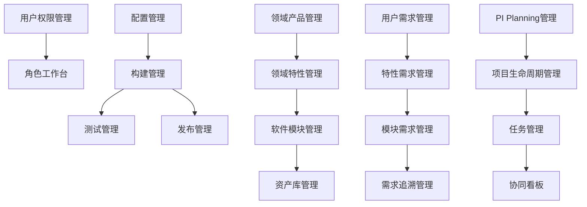

# Next Steps - 下一步计划

> **更新日期**: 2025-01-04  
> **规划周期**: 2025-01 ~ 2025-07  
> **版本**: MVP v1.0

---

## 🎯 总体目标

### MVP目标（2025-07-18）

**核心目标**: 完成Auto DevOps Platform MVP版本，支撑NOA v3.1项目全生命周期管理

**成功标准**:
- ✅ 19个MVP Features全部实现
- ✅ 67个页面全部开发完成
- ✅ 核心功能可用率 ≥ 99%
- ✅ 用户满意度 ≥ 4.0/5
- ✅ P0 Bug = 0

---

## 📅 短期计划（1-2周）

### 本周计划（2025-W02: 01-06 ~ 01-12）

#### 1. 完善工作文档 ✅

**负责人**: 项目管理团队  
**Story Points**: 2 SP

**任务**:
- ✅ 创建works_progress_docs目录
- ✅ 完成项目总览文档
- ✅ 完成当前状态文档
- ✅ 完成下一步计划文档
- 📋 完成开发时间线文档
- 📋 完成里程碑跟踪文档

**产出**:
- 完整的工作进展文档体系

---

#### 2. Sprint 1准备

**负责人**: 项目经理  
**Story Points**: 3 SP

**任务**:
- 📋 确认团队成员（3人）
- 📋 开发环境准备
  - 开发机器配置
  - IDE和工具安装
  - Git权限配置
- 📋 Sprint 1 Planning会议
  - 回顾Sprint目标
  - Story讲解和澄清
  - 任务分配

**产出**:
- Sprint 1 Ready
- 团队就绪

---

#### 3. 技术准备

**负责人**: 技术Leader  
**Story Points**: 5 SP

**任务**:
- 📋 后端项目框架搭建
  - Node.js + Express + TypeScript
  - 项目结构设计
  - 依赖包安装
- 📋 数据库环境准备
  - PostgreSQL安装和配置
  - Neo4j安装和配置
  - Redis安装和配置
- 📋 CI/CD基础搭建
  - GitLab CI配置
  - Docker镜像准备

**产出**:
- 后端框架
- 数据库环境
- CI/CD基础

---

### 下周计划（2025-W03: 01-13 ~ 01-19）

#### Sprint 1开发 🚀

**时间**: 2025-01-06 ~ 2025-01-19（2周）  
**Story Points**: 30 SP  
**Features**: F026（用户权限管理）+ F017（配置管理部分）

**主要Story**:

1. **搭建前端Vue3项目框架** (3 SP) ✅
   - 已完成

2. **搭建后端Node.js项目框架** (3 SP)
   - 📋 创建Express应用
   - 📋 TypeScript配置
   - 📋 目录结构设计

3. **数据库设计和初始化** (4 SP)
   - 📋 设计数据库Schema
   - 📋 创建数据表
   - 📋 初始化数据

4. **用户注册登录功能** (5 SP)
   - 📋 注册API
   - 📋 登录API
   - 📋 前端页面集成

5. **JWT认证实现** (3 SP)
   - 📋 JWT生成和验证
   - 📋 Token刷新机制
   - 📋 前端Token管理

6. **RBAC权限模型** (5 SP)
   - 📋 角色管理
   - 📋 权限管理
   - 📋 权限检查中间件

7. **Git仓库配置管理** (5 SP)
   - 📋 Git配置API
   - 📋 Webhook配置
   - 📋 前端页面

8. **分支策略配置** (2 SP)
   - 📋 分支策略API
   - 📋 前端页面

**验收标准**:
- ✅ 项目框架搭建完成
- ✅ 用户可以注册登录
- ✅ 权限控制生效
- ✅ Git配置可管理

---

## 📅 中期计划（1-3个月）

### Sprint 2-5（2025-02 ~ 2025-03）

**时间**: 2025-01-20 ~ 2025-03-16（8周）  
**Story Points**: 124 SP  
**Features**: F017完成 + F018 + F029 + F027 + F030部分 + F002部分

**主要功能**:

#### Sprint 2 (01-20 ~ 02-02): 配置和构建管理
- F017: 配置管理（完成）
- F018: 构建管理（部分）
- CI/CD基础设施

#### Sprint 3 (02-03 ~ 02-16): PI Planning启动
- F018: 构建管理（完成）
- F029: PI Planning管理（部分）

#### Sprint 4 (02-17 ~ 03-02): PI Planning和工作台
- F029: PI Planning管理（部分）
- F027: 角色工作台（部分）

#### Sprint 5 (03-03 ~ 03-16): 项目管理和产品管理
- F029: PI Planning管理（完成）
- F027: 角色工作台（部分）
- F030: 项目生命周期管理（部分）
- F002: 领域产品管理（部分）

**关键里程碑**:
- M1: 基础平台就绪（2025-02-16）
- M2: 项目管理就绪（2025-03-16）

---

### Sprint 6-9（2025-03 ~ 2025-05）

**时间**: 2025-03-17 ~ 2025-05-11（8周）  
**Story Points**: 124 SP  
**Features**: F030完成 + F002完成 + F003 + F004 + F005 + F007 + F008部分

**主要功能**:

#### Sprint 6 (03-17 ~ 03-30): 项目和产品管理
- F030: 项目生命周期管理（完成）
- F002: 领域产品管理（完成）
- F003: 领域特性管理（部分）

#### Sprint 7 (03-31 ~ 04-13): 特性和模块管理
- F003: 领域特性管理（部分）
- F004: 软件模块管理（部分）

#### Sprint 8 (04-14 ~ 04-27): 资产和需求管理
- F004: 软件模块管理（完成）
- F005: 资产库管理（完成）
- F007: 用户需求管理（部分）

#### Sprint 9 (04-28 ~ 05-11): 需求管理
- F007: 用户需求管理（部分）
- F008: 特性需求管理（部分）

**关键里程碑**:
- M3: 资产管理就绪（2025-04-27）
- MVP Alpha（2025-05-09）

---

### Sprint 10-13（2025-05 ~ 2025-07）

**时间**: 2025-05-12 ~ 2025-07-06（8周）  
**Story Points**: 148 SP  
**Features**: F008完成 + F009 + F010 + F012 + F014 + F015 + F019 + F028

**主要功能**:

#### Sprint 10 (05-12 ~ 05-25): 需求管理完善
- F008: 特性需求管理（完成）
- F009: 模块需求管理（部分）

#### Sprint 11 (05-26 ~ 06-08): 需求追溯和任务管理
- F009: 模块需求管理（完成）
- F010: 需求追溯管理（完成）
- F012: 任务管理（部分）

#### Sprint 12 (06-09 ~ 06-22): Sprint协同
- F012: 任务管理（完成）
- F014: 协同看板（完成）
- F015: 通知消息（部分）

#### Sprint 13 (06-23 ~ 07-06): 测试和系统配置
- F015: 通知消息（完成）
- F019: 测试管理（完成）
- F028: 系统配置（完成）
- 系统优化和Bug修复

**关键里程碑**:
- M4: 需求管理就绪（2025-06-08）
- MVP Beta（2025-06-13）
- M5: MVP完成（2025-07-06）

---

## 📅 长期计划（3-12个月）

### MVP发布准备（2025-07）

**时间**: 2025-07-07 ~ 2025-07-18（2周）

**主要任务**:
- 📋 完整的系统测试
  - 功能测试
  - 性能测试
  - 安全测试
  - 兼容性测试
- 📋 文档完善
  - 用户手册
  - 部署指南
  - API文档
  - 视频教程
- 📋 用户培训
  - 培训材料准备
  - 培训课程
  - 在线答疑
- 📋 上线准备
  - 生产环境部署
  - 数据迁移
  - 监控配置
  - 应急预案

**关键里程碑**:
- MVP Release（2025-07-18）

---

### V1.0开发（2025-07 ~ 2025-10）

**时间**: 12周  
**Story Points**: 200 SP  
**Features**: 10个新增Features

**主要功能**:
- F001: 产品线管理
- F006: 资产复用分析
- F011: 需求变更管理
- F013: 评审管理（完善）
- F016: 知识库
- F020: 发布管理（完善）
- F021: 监控运维
- F022: 效能分析
- F023: 质量分析
- F031: 项目协同管理

**关键里程碑**:
- V1.0 Beta（2025-09-30）
- V1.0 Release（2025-10-10）

---

### V2.0开发（2025-10 ~ 2025-12）

**时间**: 8周  
**Story Points**: 150 SP  
**Features**: 8个高级Features

**主要功能**:
- F024: 复用分析
- F025: 成本分析
- F032: 趋势预测
- F033: 审计日志
- F034: AI需求助手
- F035: 智能推荐
- F036: 移动端
- F037: 开放API

**关键里程碑**:
- V2.0 Release（2025-12-05）

---

## 🎯 优先级和依赖

### 功能优先级

**P0（核心功能，MVP必须）**:
- F026: 用户权限管理
- F017: 配置管理
- F018: 构建管理
- F029: PI Planning管理
- F030: 项目生命周期管理
- F002: 领域产品管理
- F003: 领域特性管理
- F004: 软件模块管理
- F005: 资产库管理
- F007: 用户需求管理
- F008: 特性需求管理
- F009: 模块需求管理
- F010: 需求追溯管理
- F012: 任务管理
- F014: 协同看板
- F015: 通知消息
- F019: 测试管理
- F027: 角色工作台
- F028: 系统配置

**P1（重要功能，V1.0完成）**:
- F001: 产品线管理
- F006: 资产复用分析
- F011: 需求变更管理
- F013: 评审管理
- F016: 知识库
- F020: 发布管理
- F021: 监控运维
- F022: 效能分析
- F023: 质量分析
- F031: 项目协同管理

**P2（高级功能，V2.0完成）**:
- F024: 复用分析
- F025: 成本分析
- F032: 趋势预测
- F033: 审计日志
- F034: AI需求助手
- F035: 智能推荐
- F036: 移动端
- F037: 开放API

---

### 功能依赖关系

---

## 📋 具体行动项

### 即刻行动（本周内）

1. **组建开发团队** ⚡
   - 确认3人核心团队
   - 明确角色和职责
   - 团队培训和沟通

2. **搭建开发环境** ⚡
   - 后端框架搭建
   - 数据库环境准备
   - CI/CD基础配置

3. **Sprint 1准备** ⚡
   - Sprint Planning会议
   - Story讲解和澄清
   - 任务分配和估算

### 近期行动（2周内）

4. **Sprint 1开发** 📅
   - 用户权限管理
   - 配置管理
   - 前后端集成

5. **后端API设计** 📅
   - RESTful API设计
   - API文档编写
   - 接口测试

6. **数据库实现** 📅
   - Schema设计
   - 数据表创建
   - 数据迁移脚本

### 中期行动（1-3个月）

7. **核心功能开发** 📅
   - PI Planning功能
   - 项目管理功能
   - 资产管理功能
   - 需求管理功能

8. **测试和优化** 📅
   - 单元测试
   - 集成测试
   - 性能优化

9. **文档完善** 📅
   - API文档
   - 用户手册
   - 部署指南

---

## 🎯 关键成功因素

### 1. 团队稳定性

- ✅ 核心团队固定（3人）
- ✅ 角色职责清晰
- ✅ 沟通机制建立
- ✅ 协作工具配置

### 2. 开发效率

- ✅ 合理的Sprint规划
- ✅ 明确的Story定义
- ✅ 高效的Code Review
- ✅ 自动化测试覆盖

### 3. 质量保障

- ✅ 代码规范和检查
- ✅ 完整的测试覆盖
- ✅ 持续集成和部署
- ✅ 性能和安全测试

### 4. 持续改进

- ✅ Sprint回顾会议
- ✅ 问题和改进跟踪
- ✅ 最佳实践总结
- ✅ 知识分享机制

---

## 📞 联系和协调

### 每日站会

**时间**: 每天上午9:30  
**时长**: 15分钟  
**参与人**: 全体开发团队  
**内容**:
- 昨天完成了什么
- 今天计划做什么
- 遇到什么问题

### Sprint规划会

**时间**: 每Sprint第1天  
**时长**: 2小时  
**参与人**: 全体团队  
**内容**:
- 回顾Sprint目标
- Story讲解和澄清
- 任务分配和估算

### Sprint回顾会

**时间**: 每Sprint最后1天  
**时长**: 1小时  
**参与人**: 全体团队  
**内容**:
- Sprint总结
- 问题分析
- 改进计划

---

## 📖 参考文档

- [项目总览](./01-PROJECT_OVERVIEW.md)
- [当前状态](./04-CURRENT_STATUS.md)
- [版本规划](../project-manage/01-VERSION_PLANNING.md)
- [迭代计划](../project-manage/02-ITERATION_PLAN.md)
- [发布路线图](../project-manage/03-RELEASE_ROADMAP.md)

---

**更新频率**: 每周更新  
**下次更新**: 2025-01-11  
**文档维护**: 项目管理团队

